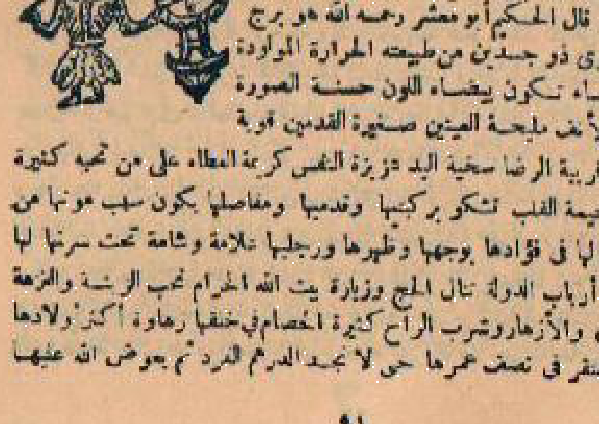
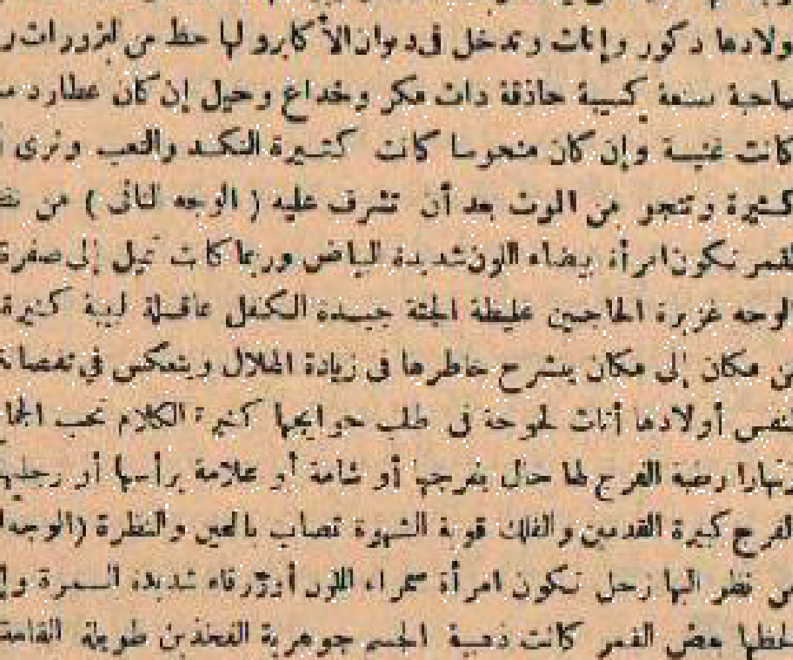
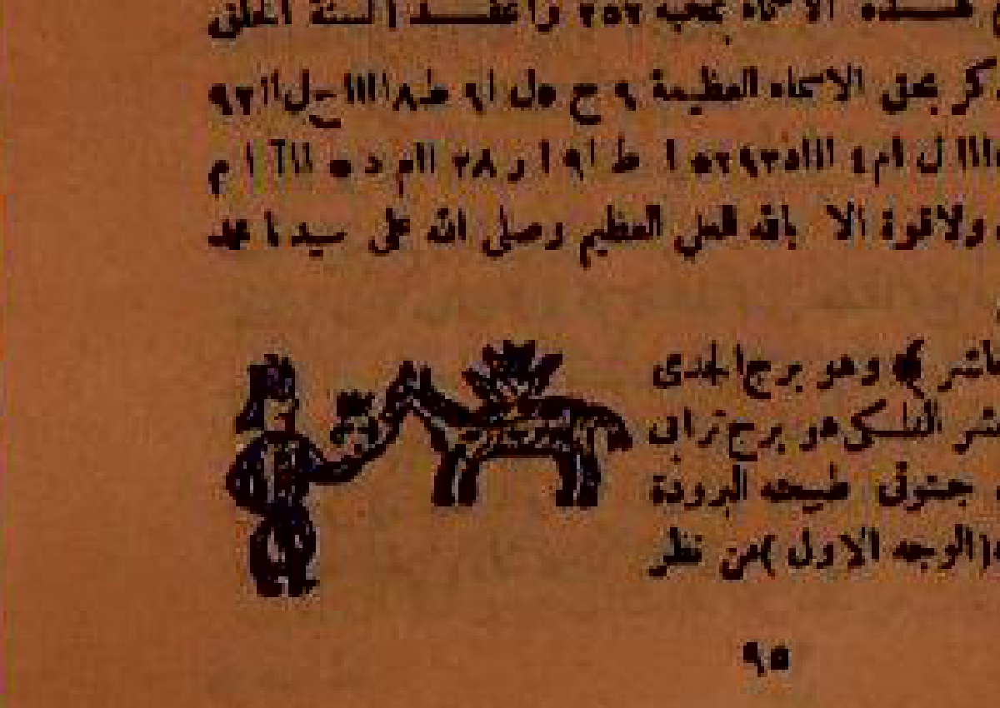
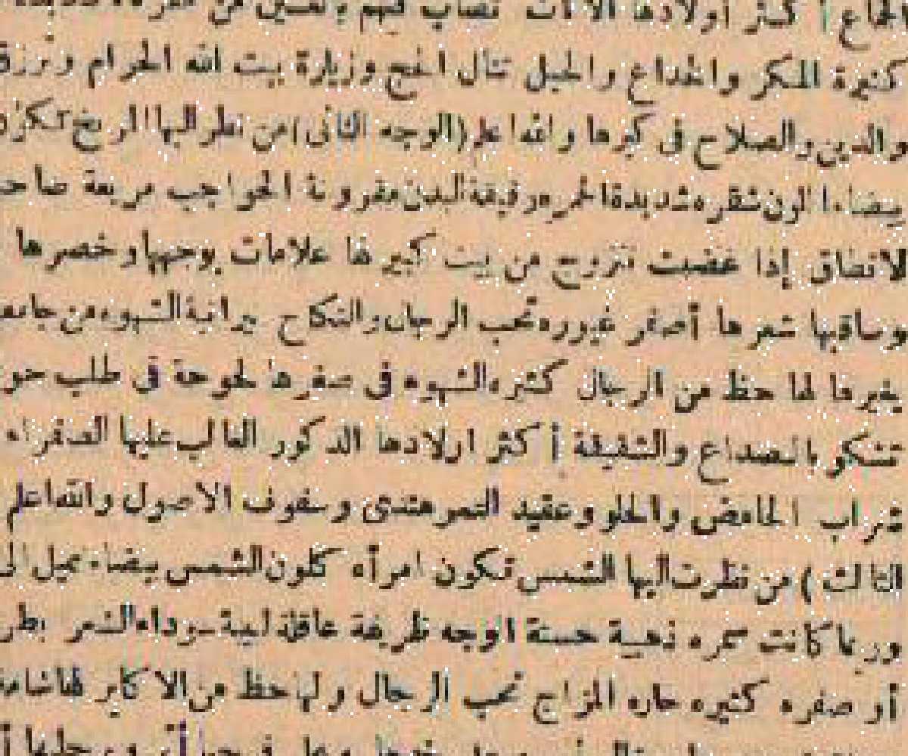
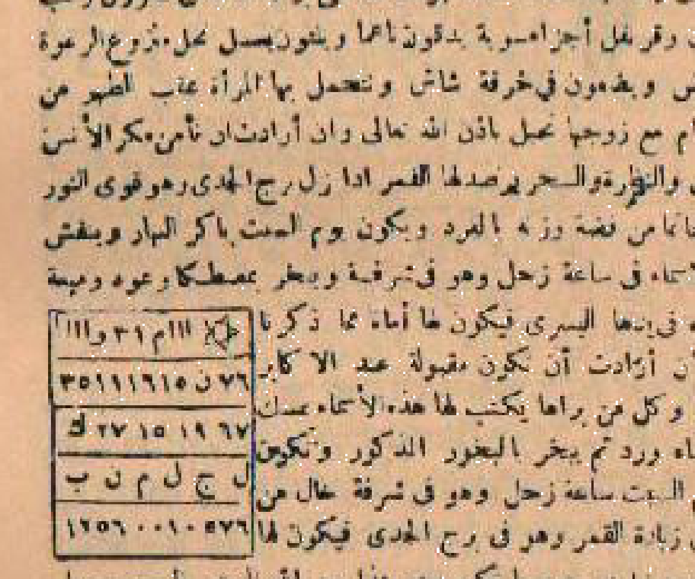
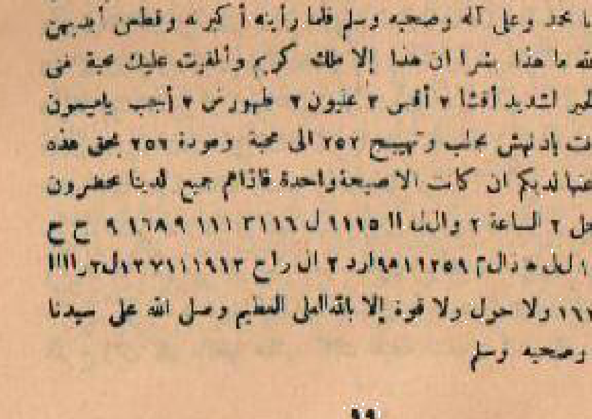

# BATCH 10 — HALAMAN PDF 46–50 (HALAMAN CETAK 92–101)

---

## HALAMAN CETAK 92 (Halaman PDF 46, sisi kanan)

**[Teks Arab Asli]**

( بيت أزواجها وفراشها ) الحمل والمريخ: تتزوج برجل شجاع ذى مروءة وسخاء، يحبها حبا شديدا ويغار عليها غيرة حسنة، وتعيش معه فى هناء وعز، وتكون هى صاحبة الكلمة والتدبير فى بيتها، والله أعلم.

**[Transliterasi Latin Fonetik]**

*(baytu azwaajihaa wa firaasyihaa  al-Hamali wal-Mirriikhi  tatazawwaju bi-rajulin syajaa'i dzaa muruu'atan wa sakhaa'an, yuhibbuhaa hubbaa syadiidan wa yughaaru 'alayhaa ghayrata hasanatun, wa ta'iisyu ma'ahu fii hanaa'in wa 'izzin, wa takuunu hiya shaahibatal-kalimati wat-tadbiiri fii baytuhaa, wallaahu a'lamu *) **[Terjemahan Indonesia]**

(Rumah jodoh pernikahan dan peraduannya) Aries dan Mars: Ia dipersunting oleh seorang pria pemberani yang berjiwa ksatria dan amat dermawan; suaminya sangat mencintainya dengan cinta mendalam dan memiliki kecemburuan yang wajar untuk menjaganya; mereka membina rumah tangga dalam ketentraman dan kemuliaan; serta dialah yang dipercaya memegang kendali tata kelola rumah tangganya. Wallahu a'lam.

---

**[Teks Arab Asli]**

( بيت خوفها وموتها ) الثور والزهرة: يخاف عليها من أمراض البرودة وعوارض الرطوبة، وأعوام الخطر عندها: ثمانى سنين، وست عشرة سنة، وأربع وثلاثون سنة، وخمسون سنة، وسبعون سنة، فان سلمت منها عاشت إلى ثمانين سنة، والله أعلم.

**[Transliterasi Latin Fonetik]**

*(baytu khawfihaa wa mawtihaa  ats-Tsawri waz-Zuharati  yukhaafu 'alayhaa min amraadhin al-buruudati wa 'awaaridhir-ruthuubati, wa a'waamal-khuthuri 'indahaa  tsamaanii siniina, wa sitta 'asyrata sanatin, wa arba'i wa tsalaatsuuna sanatin, khamsuuna sanatin, sab'uuna sanatin, fa-in salimat minhaa 'aasyat ilaa tsamaaniina sanatin, wallaahu a'lamu *) **[Terjemahan Indonesia]**

(Rumah masa rawan dan krisis kesehatannya) Taurus dan Venus: Dikhawatirkan atasnya penyakit akibat udara dingin basah dan kelembapan tubuh; tahun-tahun rawan dalam siklus usianya adalah usia 8 tahun, 16 tahun, 34 tahun, 50 tahun, dan 70 tahun; jika ia berhasil melaluinya dengan selamat, usianya akan mencapai 80 tahun. Wallahu a'lam.

---

**[Teks Arab Asli]**

( بيت أسفارها وحركاتها ) الجوزاء وعطارد: تكون أسفارها مأمونة مباركة فى صحبة زوجها وأهلها، وتسافر إلى البلاد الحضرية والتجارات النافعة، وتنال فى أسفارها راحة وكرامة، والله أعلم.

**[Transliterasi Latin Fonetik]**

*(baytu asfaarihaa wa harakaatihaa  al-Jawzaa'i wa 'Uthaarida  takuunu asfaarihaa ma'muunata mubaarakatun fii shuhbati zawjuhaa wa ahlihaa, wa tusaafiru ilal-bilaadil-hadhriyyati wat-tijaaraatin-naafi'ati, wa tanaalu fii asfaarihaa raahatan wa karaamatan, wallaahu a'lamu *) **[Terjemahan Indonesia]**

(Rumah perjalanan dan pergerakannya) Gemini dan Merkurius: Perjalanannya senantiasa aman dan penuh berkah dengan didampingi oleh suami dan keluarganya; bepergian ke pusat-pusat kota peradaban dan pusat perniagaan yang menguntungkan; serta memetik kenyamanan dan kemuliaan di sepanjang perjalanannya. Wallahu a'lam.

---

**[Teks Arab Asli]**

( بيت عزها وشرفها ) السرطان والقمر: تنال شرفا ومكانة رفيعة بين النساء بحسن خلقها وجمالها ووقارها، وتكون محترمة الجانب مقبولة الشفاعة، ويثنى عليها الجميع، والله أعلم.

**[Transliterasi Latin Fonetik]**

*(baytu 'izzihaa wa syarafihaa  as-Sarathaani wal-Qamari  tanaalu syarafan wa makaanata rafii'ata baynan-nisaa'i bi-husni khalqihaa wa jamaalihaa wa waqaarihaa, wa takuunu muhtaramatul-jaanibi maqbuulatasy-syafaa'ati, wa yutsnaa 'alayhaal-jamii'i, wallaahu a'lamu *) **[Terjemahan Indonesia]**

(Rumah kemuliaan dan status sosialnya) Cancer dan Bulan: Ia meraih kehormatan dan kedudukan tinggi di tengah kaum wanita berkat keindahan budi pekerti, kecantikan paras, dan ketenangannya; disegani kewibawaannya dan diterima pertolongannya; serta menuai sanjungan pujian dari semua orang. Wallahu a'lam.

---

**[Teks Arab Asli]**

( بيت رجائها وآمالها ) الأسد والشمس: يبلغها الله ما ترجوه من تمام النعمة وصلاح الأحوال وبر الأولاد، ويرزقها الله عيشا رغيدا وخاتمة حسنة، والله أعلم.

**[Transliterasi Latin Fonetik]**

*(baytu rajaa'ihaa wa aamaalihaa  al-Asadi wasy-Syamsi  yablughuhaa Allaahi maa tarjuuhu min tamaamin-na'amati wa shalaahin al-ahwaali wa barril-awlaadi, wa yarzuquhaa Allaahi 'aysyan raghiidan wa khaatimata hasanatun, wallaahu a'lamu *) **[Terjemahan Indonesia]**

(Rumah harapan dan dambaannya) Leo dan Matahari: Allah menyampaikan dirinya pada apa yang ia dambakan berupa kesempurnaan nikmat, kemapanan kondisi keluarga, dan bakti anak-anaknya; serta dianugerahi kehidupan yang makmur sejahtera dan husnul khatimah. Wallahu a'lam.

---

**[Teks Arab Asli]**

( بيت أعدائها وحسادها ) السنبلة وعطارد: أعداؤها من بعض الحواسد اللاتى يحسدنها على حسن طلعتها وكمال عقلها، ويكفيها الله كيدهن ويجعلها منصورة عليهن، والله سبحانه أعلم.

**[Transliterasi Latin Fonetik]**

*(baytu a'daa'ihaa wa hussaadihaa  as-Sunbulati wa 'Uthaarida  a'daa'uhaa min ba'dhul-hawaasidil-laatii yahsudannahaa 'alaa hasanu thal'atihaa wa kamaali 'aqlihaa, wa yakfiihaa Allaahi kaydihinna wa yaj'aluhaa manshuuratun 'alayhunna, wallaahu Subhaanahu a'lamu *) **[Terjemahan Indonesia]**

(Rumah musuh dan para pendengkinya) Virgo dan Merkurius: Musuh-musuhnya hanyalah segelintir wanita pendengki yang iri menyaksikan keelokan paras wajahnya dan kesempurnaan daya pikirnya; namun Allah mencukupkan perlindungan dari tipu daya mereka dan menjadikannya senantiasa unggul menang. Wallahu Subhanahu wa Ta'ala a'lam.

---

## HALAMAN CETAK 93 (Halaman PDF 46, sisi kiri)

**[Teks Arab Asli]**

( ولصاحبة هذا البرج من أشكال الرمل شكل النصرة الخارجة )
قال الحكيم: اعلمى أيتها السائلة أن شكل النصرة الخارجة يدل على الظفر بالأمانى، والخروج من كل ضيق إلى فرج عاجل، وفتح أبواب الخير والبركة، فعليك بملازمة الشكر، واسمعى ما قيل:
نلت الظفر وبدت لك الآمال * وازداد عزا جاهك والمال
فاحمدى المولى على نعمائه * فبشكره تتبدل الأحوال

**[Transliterasi Latin Fonetik]**

*(wa li-shaahibati haadzaal-burji min asykaalir-ramli syaklun-nashratil-khaarijati)*
*qaalal-hakiimu  i'lamii ayyatuhas-saa'ilatu an syaklun-nashratil-khaarijati yadullu 'alaa azh-zhafari bil-amaan, wal-khuruuja min kullu dhayyiqin ilaa faraji 'aajili, wa fataha abwaabal-khayri wal-barakati, fa'alayka bimulaazimatisy-syukri, wa isma'ii maa qiila:*
*nultuzh-zhafara wa badat lak al-aamaali * wa izdaada 'izzan jaahika wal-maali*
*faahamadaal-mawlaa 'alaa na'maa'ihi * fa-bisyukrihi tatabaddalul-ahwaalu*

**[Terjemahan Indonesia]**

(Bagi pemilik buruj wanita ini dari bentuk-bentuk ilmu raml adalah bentuk *an-Nushrah al-Kharijah*)
Berkata sang ahli hikmah: Ketahuilah wahai wanita penanya, sesungguhnya bentuk an-Nushrah al-Kharijah melambangkan tercapainya cita-cita impian, keluarnya jiwa dari segala kesempitan menuju kelapangan yang segera tiba, serta terbukanya pintu-pintu kebajikan dan keberkahan; maka lazimkanlah bersyukur; simaklah bait syair bijak ini:
*Engkau telah meraih kemenangan dan harapan-harapan indah tampak nyata * Kian bertambah kemuliaan kedudukan martabat dan hartamu*
*Maka pujilah Tuhan Maha Pemelihara atas limpahan kenikmatan-Nya * Karena dengan bersyukur kepada-Nya segala keadaan berubah menjadi lebih indah.*

---

**[Gambar Rajah Asli Halaman 93 — Wafaq al-Mizan Kaum Wanita]**

*Gambar Rajah Asli Halaman 93* — Wafaq angka keramat pelindung buruj Libra bagi kaum wanita untuk daya pikat cinta sejati, keadilan rumah tangga, dan tolak bala perselisihan.

---

## HALAMAN CETAK 94 (Halaman PDF 47, sisi kanan)

**[Teks Arab Asli]**

( البرج الثامن من طوالع النساء: برج العقرب والمريخ )
وصاحبة فلك العقرب مريخها الحازم * يدل على الشجاعة والحدة واليقين
لها العزم القوى والوفاء اللازم * وتظفر فى دهرها بنصر مبين
تحب العفاف وتكرم الجار * وتلقى من الله الحفظ والوقار

**[Transliterasi Latin Fonetik]**

*(al-burjits-tsaaminu min thawaali'un-nisaa'i  burjul-'Aqrabi wal-Mirriikhi)*
*wa shaahibatu falak al-'Aqrabi mirriikhahaal-haazima * yadullu 'alaa asy-syajaa'ati wal-haddati wal-yaqiini*
*lahaal-'azmil-quwaa wal-wafaa'al-laazima * wa tazhfaru fii dahrihaa binashri mubayyani*
*tuhibbul-'afaafu wa takarrumul-jaari * wa talaqqaa min Allaahil-hifzhi wal-waqaari*

**[Terjemahan Indonesia]**

(Buruj Kedelapan dari Thali' Kaum Wanita: Buruj Scorpio dan Penguasanya: Mars)
*Penguasa orbit Scorpio bagi wanita adalah Mars sang bintang penegak tekad * Memberi petunjuk pada keteguhan hati, ketajaman insting batin, dan kemantapan keyakinan*
*Ia dianugerahi tekad yang kokoh membaja dan kesetiaan yang tak tergoyahkan * Berhasil meraih kemenangan yang nyata di sepanjang lembaran hidupnya*
*Mencintai kesucian kehormatan diri dan memuliakan para tetangga * Serta senantiasa dinaungi pemeliharaan dan wibawa kemuliaan dari Allah.*

---

**[Gambar Rajah Asli Halaman 94 — Tilsm Buruj al-Aqrab Kaum Wanita]**

*Gambar Rajah Asli Halaman 94* — Gambar Tilsam simbolik buruj Scorpio untuk Thali' Kaum Wanita: Sosok ksatria putri memegang pedang keadilan menundukkan kalajengking di bawah pengaruh planet Mars.

---

**[Teks Arab Asli]**

( القول على طبع الطالع واختلاف الوجوه للنسوة )
قال الحكيم الفلكى: هى امرأة سمراء اللون صافية البشرة أو مائلة إلى الحمرة، حسنة العينين، عريضة الجبين، قوية العزم، ذات مهابة وشجاعة، صريحة اللهجة، ولها ثلاثة وجوه.

**[Transliterasi Latin Fonetik]**

*(al-qawli 'alaa thab'uth-thaali'u wa ikhtilaafil-wujuuhi lin-niswata)*
*qaalal-hakiimul-Falakiyyu  hiya imra'atun samraa'al-lawni shaafiyatal-basyarati aw maa'ilatun ilal-humrati, hasanatun al-'aynayni, 'ariidhatal-jabiini, quwwiyyatal-'azmi, dzaat mahaabatin wa syajaa'atin, shariihatal-lahjati, wa lahaa tsalaatsatun wujuuhin *

**[Terjemahan Indonesia]**

(Uraian watak dasar thali' wanita dan pembagian tiga wajahnya)
Berkata sang ahli astrologi falak: Wanita yang lahir di bawah naungan buruj Scorpio ini berkulit sawo matang bersih memikat atau condong kemerahan merona, kedua matanya tajam berbinar indah, berdahi bidang cerah, bertekad membaja, berwibawa dan bernyali ksatria, jujur tegas dalam bertutur kata; dan ia memiliki tiga wajah (wajh).

---

**[Teks Arab Asli]**

( الوجه الأول ) من نظر إليها المريخ: تكون امرأة شجاعة حازمة، قوية الشخصية، تحسن تدبير شؤون بيتها بحزم وعدل، وتكون مهابة عند النساء والرجال، وتنال عزا وجاها، والله أعلم.

**[Transliterasi Latin Fonetik]**

*(al-wajhul-awwalu  min nazhara ilayhaal-Mirriikhi  takuunu imra'atun syajaa'ati haazimati, quwwiyyatasy-syakhshiyyati, tahassuna tadbiiri syu'uuni baytuhaa bihazmin wa 'adlin, wa takuunu mahaabatu 'indan-nisaa'i war-rijaali, wa tanaalu 'izzan wijaahan, wallaahu a'lamu *) **[Terjemahan Indonesia]**

(Wajah Pertama) Bagi yang dipandang oleh planet Mars: Ia menjadi wanita yang berjiwa teguh mandiri, berkepribadian tangguh, mengelola tata urusan rumah tangganya dengan ketegasan dan keadilan, disegani oleh kaum wanita maupun pria, serta meraih kemuliaan dan kedudukan terhormat. Wallahu a'lam.

---

**[Teks Arab Asli]**

( الوجه الثانى ) من نظر إليها الشمس: تكون امرأة ذات بهاء ورفعة، صبيحة الوجه، كريمة النفس، ترزق مالا كثيرا من جهة الأكابر، وتعيش فى رفاهية وعز، والله تعالى أعلم.

**[Transliterasi Latin Fonetik]**

*(al-wajhuts-tsaanii  min nazhara ilayhaa asy-Syamsi  takuunu imra'atun dzaat bahaa'in wa raf'atin, shabiihatal-wajhu, kariimatan-nafsi, turzaqu maalan katsiiran min jihatil-akaabiri, wa ta'iisyu fii ruffaahiyyatin wa 'izzin, wallaahu Ta'aalaa a'lamu *) **[Terjemahan Indonesia]**

(Wajah Kedua) Bagi yang dipandang oleh Matahari: Ia memancarkan keanggunan dan kemuliaan derajat, berparas wajah berseri memikat, berjiwa dermawan, dianugerahi limpahan kekayaan dari relasi terpandang, serta menjalani hari-harinya dalam kemakmuran dan kehormatan. Wallahu Ta'ala a'lam.

---

**[Teks Arab Asli]**

( الوجه الثالث ) من نظر إليها الزهرة: تكون امرأة لطيفة ظريفة، تحب الزينة والطيب والملابس الأنيقة، ذات دلال وجمال، يحبها زوجها ويكرم مقامها، والله أعلم.

**[Transliterasi Latin Fonetik]**

*(al-wajhuts-tsaalitsu  min nazhara ilayhaa az-Zuharati  takuunu imra'atun lathiifatu zhariifatu, tuhibbuz-zaynatu wath-thayyibu wal-malaabisul-aniiqatu, dzaat dalaalin wa jamaalin, yuhibbuhaa zawjuhaa wa yukarrimu maqaamuhaa, wallaahu a'lamu *) **[Terjemahan Indonesia]**

(Wajah Ketiga) Bagi yang dipandang oleh planet Venus: Ia adalah wanita yang sangat anggun mempesona, gemar mengenakan wewangian harum, perhiasan indah, dan busana-busana modis, berdaya pikat manja yang memikat, sangat disayangi suaminya dan dimuliakan kedudukannya. Wallahu a'lam.

---

## HALAMAN CETAK 95 (Halaman PDF 47, sisi kiri)

**[Teks Arab Asli]**

( بيت حياتها ومعيشتها ) العقرب والمريخ: تكون معيشتها طيبة قوية، وتكفى مؤنتها بحسن تدبيرها وشجاعتها، وتعيش مستورة الحال فى عفة وكرامة، ولا تموت إلا فى نعمة وسلام، والله أعلم.

**[Transliterasi Latin Fonetik]**

*(baytu hayaatihaa wa ma'iisyatihaa  al-'Aqrabi wal-Mirriikhi  takuunu ma'iisyatuhaa thayyibatu quwayatin, wa tukfaa mu'anatuhaa bi-husni tadbiirihaa wa syajaa'atihaa, wa ta'iisyu mastuuratul-haali fii 'iffatin wa karaamatin, wa laa tamuutu illaa fii ni'matin wa sullaamin, wallaahu a'lamu *) **[Terjemahan Indonesia]**

(Rumah kehidupan dan penghidupannya) Scorpio dan Mars: Penghidupannya berlangsung stabil, sejahtera, dan mandiri; tercukupi segala kebutuhannya berkat manajemen yang matang dan keteguhan mentalnya; hidup dalam keadaan terjaga kehormatannya; serta tidak berpulang melainkan dalam limpahan nikmat dan keselamatan dari Allah. Wallahu a'lam.

---

**[Teks Arab Asli]**

( بيت مالها وتجارتها ) القوس والمشترى: تكتسب الأموال من التجارة الرابحة والعقارات، وترزق ذهبا وحليا كثيرا، ويبارك الله فى مكاسبها، وتجمع ثروة تدخرها لأولادها، والله أعلم.

**[Transliterasi Latin Fonetik]**

*(baytu maalihaa wa tijaaratihaa  al-Qawsi wal-Musytarii  taktasibul-amwaali minat-tijaaratir-raabihati wal-'aqaaraati, wa turzaqu dzahabaa wa halyaa katsiiran, wa yubaariku Allaahi fii makaasibihaa, wa tajammu'a tsarwatin taddakhiruhaa li-awlaadihaa, wallaahu a'lamu *) **[Terjemahan Indonesia]**

(Rumah harta dan perniagaannya) Sagittarius dan Yupiter: Ia merengkuh kekayaan dari perniagaan yang menguntungkan dan kepemilikan aset properti; dianugerahi simpanan emas dan perhiasan berharga; Allah melimpahkan keberkahan dalam usahanya; serta mampu menabung kekayaan yang berharga bagi anak keturunannya. Wallahu a'lam.

---

**[Teks Arab Asli]**

( بيت إخوتها وأخواتها ) الجدى وزحل: يكون لها إخوة تحسن إليهم وتعينهم فى نوائب الدهر، وتكون هى موضع ثقتهم ومحبتهم، ويدوم بينهم الود والتعاطف، والله تعالى أعلم.

**[Transliterasi Latin Fonetik]**

*(baytu ikhwatihaa wa akhawaatihaa  al-Jadyi wa Zuhala  yakuunu lahaa ikhwatin tahassunin ilayhim wa tu'ayyinuhum fii nawaa'ibid-dahri, wa takuunu hiya mawdhi'a tsiqatihim wa mahabbatihim, wa yudawwimu baynahum al-wadda wat-ta'aathufa, wallaahu Ta'aalaa a'lamu *) **[Terjemahan Indonesia]**

(Rumah saudara-saudaranya) Capricorn dan Saturnus: Ia memiliki saudara kandung yang sangat ia sayangi dan ia bantu di saat menghadapi kesulitan hidup; dialah yang menjadi tempat tumpuan kepercayaan dan kasih sayang keluarga; serta ikatan persaudaraan mereka berlangsung harmonis. Wallahu Ta'ala a'lam.

---

**[Teks Arab Asli]**

( بيت آبائها وأمهاتها ) الدلو وزحل: تنال من والديها دعاء مباركا ورضا حسنا، وتكون مطيعة لهما بارة بهما، وتدفن أباها قبل أمها، وترث منهما مالا حلالا، والله أعلم.

**[Transliterasi Latin Fonetik]**

*(baytu aabaa'ihaa wa ummahaatihaa  ad-Dalwi wa Zuhala  tanaalu min waalidayhaa du'aa'an mubaarakan wa ridhaa hissinaa, wa takuunu muthii'atun lahumaa baarratin bihimaa, wa tadfinu abaahaa qabla ummihaa, wa taritsu minhumaa maalan halaalan, wallaahu a'lamu *) **[Terjemahan Indonesia]**

(Rumah orang tuanya) Aquarius dan Saturnus: Ia memetik curahan doa berkah dan keridhaan yang tulus dari kedua orang tuanya; sangat berbakti dan taat kepada keduanya; memakamkan ayahnya lebih dahulu sebelum ibunya; serta mewarisi dari keduanya harta peninggalan yang halal. Wallahu a'lam.

---

**[Teks Arab Asli]**

( بيت أولادها وأفراحها ) الحوت والمشترى: ترزق بأولاد ذكور وإناث يكونون لها قرة عين وسرورا، ويكون أولادها أصحاب شجاعة وصلاح، وتقر عينها برؤيتهم فى أحسن حال، والله أعلم.

**[Transliterasi Latin Fonetik]**

*(baytu awlaadihaa wa afraahihaa  al-Huuti wal-Musytarii  turzaqu bi-awlaadin dzukuurin wa inaatsi yukawwinuuna lahaa qarratin 'ayn wa suruuran, wa yakuunu awlaadihaa ashhaabu syajaa'atin wa shalaahin, wa tuqirru 'aynahaa biru'yatihim fii ahsanu haali, wallaahu a'lamu *) **[Terjemahan Indonesia]**

(Rumah anak-anak dan kebahagiaannya) Pisces dan Yupiter: Ia dikaruniai putra dan putri yang menjadi penyejuk pandangan mata dan sumber kebahagiaannya; anak-anaknya tumbuh tangguh berani dan berakhlak saleh; serta sejuk pandangan matanya menyaksikan mereka meraih kesuksesan hidup. Wallahu a'lam.

---

**[Teks Arab Asli]**

( بيت أمراضها وأسقامها ) الحمل والمريخ: تصيبها أمراض الحرارة فى الرأس والصداع ووجع الظهر والبطن، فلتستعمل شراب السكنجبين والتمر هندى، وتتجنب الأطعمة الحارة، والله أعلم.

**[Transliterasi Latin Fonetik]**

*(baytu amraadhihaa wa asqaamihaa  al-Hamali wal-Mirriikhi  tushiibuhaa amraadhin al-haraarati fir-ra'si wash-shudaa'i wa waja'izh-zhahri wal-bathni, fa-latasta'milu syaraabus-sakanjabiini wat-tamri hindiyyun, wa tatajannabul-ath'imatul-haarratu, wallaahu a'lamu *) **[Terjemahan Indonesia]**

(Rumah penyakit dan keluhan fisiknya) Aries dan Mars: Ia rentan mengalami keluhan sakit kepala panas, nyeri punggung, dan gangguan organ perut; maka dianjurkan rutin meminum oxymel (sikinjabin) dan sari asam jawa; serta menjauhi makanan-makanan yang bersifat terlalu pedas dan panas. Wallahu a'lam.

---

## HALAMAN CETAK 96 (Halaman PDF 48, sisi kanan)

**[Teks Arab Asli]**

( بيت أزواجها وفراشها ) الثور والزهرة: تتزوج برجل شريف كريم ذى مال وحسب، يحبها ويكرمها، وتعيش معه فى هناء ورغد، وتدوم بينهما المحبة والألفة طوال العمر، والله أعلم.

**[Transliterasi Latin Fonetik]**

*(baytu azwaajihaa wa firaasyihaa  ats-Tsawri waz-Zuharati  tatazawwaju bi-rajulin syariifi kariimi dzaa maalin wahasb, yuhibbuhaa wa yukarrimuhaa, wa ta'iisyu ma'ahu fii hanaa'in wa raghadin, wa tudawwimu baynahumaal-mahabbata wal-alfata thuwaalul-'umri, wallaahu a'lamu *) **[Terjemahan Indonesia]**

(Rumah jodoh pernikahan dan peraduannya) Taurus dan Venus: Ia dipersunting oleh seorang pria terhormat berjiwa dermawan yang memiliki kekayaan dan nasab mulia; suaminya sangat mencintainya dan memuliakan kedudukannya; mereka menjalani bahtera rumah tangga dalam ketentraman dan kemakmuran; serta keharmonisan di antara mereka berlangsung abadi sepanjang usia. Wallahu a'lam.

---

**[Teks Arab Asli]**

( بيت خوفها وموتها ) الجوزاء وعطارد: يخاف عليها من أمراض الحرارة الحادة وعوارض الهواء، وأعوام الخطر عندها: تسع سنين، وثمانى عشرة سنة، وسبع وثلاثون سنة، وخمسون سنة، وسبعون سنة، فان سلمت منها عاشت إلى خمس وثمانين سنة، والله أعلم.

**[Transliterasi Latin Fonetik]**

*(baytu khawfihaa wa mawtihaa  al-Jawzaa'i wa 'Uthaarida  yukhaafu 'alayhaa min amraadhin al-haraaratil-haaddati wa 'awaaridhil-hawaa'i, wa a'waamal-khuthuri 'indahaa  tasa'u siniina, watsamaan 'asyrata sanatin, wa sab'i wa tsalaatsuuna sanatin, khamsuuna sanatin, sab'uuna sanatin, fa-in salimat minhaa 'aasyat ilaa khamsi wa tsamaaniina sanatin, wallaahu a'lamu *) **[Terjemahan Indonesia]**

(Rumah masa rawan dan krisis kesehatannya) Gemini dan Merkurius: Dikhawatirkan atasnya penyakit demam panas akut dan gangguan cuaca ekstrem; tahun-tahun rawan dalam siklus usianya adalah usia 9 tahun, 18 tahun, 37 tahun, 50 tahun, dan 70 tahun; jika ia berhasil melaluinya dengan selamat, usianya akan mencapai 85 tahun. Wallahu a'lam.

---

**[Teks Arab Asli]**

( بيت أسفارها وحركاتها ) السرطان والقمر: تكون أسفارها ميمونة مباركة فى صحبة محارمها، وتسافر إلى البلاد القريبة والبعيدة فى سلامة وتوفيق، والله أعلم.

**[Transliterasi Latin Fonetik]**

*(baytu asfaarihaa wa harakaatihaa  as-Sarathaani wal-Qamari  takuunu asfaarihaa maymuunata mubaarakatun fii shuhbati mahaarimihaa, wa tusaafiru ilal-bilaadil-qariibati wal-ba'iidati fii sullaamatin wa tawfiiqin, wallaahu a'lamu *) **[Terjemahan Indonesia]**

(Rumah perjalanan dan pergerakannya) Cancer dan Bulan: Aktivitas perjalanannya senantiasa membawa keberkahan dengan didampingi oleh mahramnya; bepergian ke berbagai wilayah dalam naungan keselamatan dan kemudahan. Wallahu a'lam.

---

**[Teks Arab Asli]**

( بيت عزها وشرفها ) الأسد والشمس: تنال عزا عظيما ومكانة سامية بين النساء بحزمها وشجاعتها، وتكون مهابة الجانب محترمة الكلمة عند الجميع، والله أعلم.

**[Transliterasi Latin Fonetik]**

*(baytu 'izzihaa wa syarafihaa  al-Asadi wasy-Syamsi  tanaalu 'izzan 'azhiiman wa makaanatu saammiyyatu baynan-nisaa'i bihazmihaa wa syajaa'atihaa, wa takuunu mahaabatul-jaanibi muhtaramatal-kalimati 'indal-jamii'i, wallaahu a'lamu *) **[Terjemahan Indonesia]**

(Rumah kemuliaan dan status sosialnya) Leo dan Matahari: Ia merengkuh kemuliaan yang agung dan kedudukan tinggi di tengah kaum wanita berkat keteguhan dan keberaniannya; disegani kewibawaannya dan dihormati perkataannya oleh semua orang. Wallahu a'lam.

---

**[Teks Arab Asli]**

( بيت رجائها وآمالها ) السنبلة وعطارد: يبلغها الله ما ترجوه من صلاح بيتها وراحة بالها وبر أولادها، وترزق عيشا قارا وخاتمة حسنة، والله أعلم.

**[Transliterasi Latin Fonetik]**

*(baytu rajaa'ihaa wa aamaalihaa  as-Sunbulati wa 'Uthaarida  yablughuhaa Allaahi maa tarjuuhu min shalaahi baytuhaa wa raahati bil-haa wa barri awlaadihaa, wa turzaqu 'aysyaa qaarraa wa khaatimatu hasanatun, wallaahu a'lamu *) **[Terjemahan Indonesia]**

(Rumah harapan dan dambaannya) Virgo dan Merkurius: Allah menyampaikan dirinya pada apa yang ia dambakan berupa keharmonisan rumah tangganya, ketentraman jiwanya, dan bakti anak-anaknya; serta dianugerahi kehidupan yang mapan dan husnul khatimah. Wallahu a'lam.

---

**[Teks Arab Asli]**

( بيت أعدائها وحسادها ) الميزان والزهرة: أعداؤها من بعض الحواسد اللاتى يحسدنها على شجاعتها وحسن حالها، ويكفيها الله كيدهن ويحفظها من كل مكروه، والله سبحانه أعلم.

**[Transliterasi Latin Fonetik]**

*(baytu a'daa'ihaa wa hussaadihaa  al-Miizaani waz-Zuharati  a'daa'uhaa min ba'dhul-hawaasidil-laatii yahsudannahaa 'alaa syajaa'atihaa wa husni haalihaa, wa yakfiihaa Allaahi kaydihinna wa yahfazhuhaa min kullu makruuhin, wallaahu Subhaanahu a'lamu *) **[Terjemahan Indonesia]**

(Rumah musuh dan para pendengkinya) Libra dan Venus: Musuh-musuhnya hanyalah segelintir wanita pendengki yang iri melihat ketangguhan dan kemapanan hidupnya; namun Allah mencukupkan perlindungan dari tipu daya mereka dan memeliharanya dari segala marabahaya. Wallahu Subhanahu wa Ta'ala a'lam.

---

## HALAMAN CETAK 97 (Halaman PDF 48, sisi kiri)

**[Teks Arab Asli]**

( ولصاحبة هذا البرج من أشكال الرمل شكل الحمرة )
قال الحكيم: اعلمى أيتها السائلة أن شكل الحمرة يدل على الغلبة والظفر على كل من عاداك، ودفع كيد الحواسد، ونيل المراد بالصبر والشجاعة، فعليك بالتقوى، واسمعى ما قيل:
ظفرت بما ترجين من رفعة العلى * وكافاك رب العرش خيرا وأجزلا
فلا ترهبى كيد العدا إن كيدهم * يزول بإذن الله حتما ومجملا

**[Transliterasi Latin Fonetik]**

*(wa li-shaahibati haadzaal-burji min asykaalir-ramli syaklul-humrati)*
*qaalal-hakiimu  i'lamii ayyatuhas-saa'ilatu an syaklul-humrati yadullu 'alaal-ghulbati wazh-zhafari 'alaa kullu min 'aadaaka, wa dafa'a kayadil-hawaasidi, wa niilal-muraadu bish-shabri wasy-syajaa'ati, fa'alayka bit-taqwaa, wa isma'ii maa qiila:*
*zhafirat bimaa tarajjayni min raf'atil-'Aliyyi * wa kaafaaka rabbil-'arsyi khayran wa ajzalaa*
*fa-laa tarahabaa kayadil-'idaa inna kaydihim * yuzawwilu bi-idzni Allaahi hatman wa mujmalan*

**[Terjemahan Indonesia]**

(Bagi pemilik buruj wanita ini dari bentuk-bentuk ilmu raml adalah bentuk *al-Humrah*)
Berkata sang ahli hikmah: Ketahuilah wahai wanita penanya, sesungguhnya bentuk al-Humrah menunjukkan keunggulan dan kemenangan mutlak atas siapa saja yang memusuhi dirimu, tertolaknya tipu daya para pendengki, serta tercapainya impian melalui kesabaran dan keberanian; maka lazimkanlah ketakwaan; simaklah bait syair bijak ini:
*Engkau telah memenangkan apa yang kau impikan berupa ketinggian martabat * Dan Tuhan Pemelihara 'Arsy membalasmu dengan kebaikan yang berlimpah*
*Janganlah takut pada tipu muslihat musuh karena sesungguhnya rencana jahat mereka * Pasti akan binasa dan lenyap dengan izin Allah secara sempurna.*

---

**[Gambar Rajah Asli Halaman 97 — Wafaq al-Aqrab Kaum Wanita]**

*Gambar Rajah Asli Halaman 97* — Wafaq angka keramat pelindung buruj Scorpio bagi kaum wanita untuk benteng kekebalan batin, tolak bala sihir, dan wibawa kepemimpinan.

---

## HALAMAN CETAK 98 (Halaman PDF 49, sisi kanan)

**[Teks Arab Asli]**

( البرج التاسع من طوالع النساء: برج القوس والمشترى )
وصاحبة فلك القوس مشتريها السعيد * يدل على الدين والعقل والسخاء
لها الفؤاد الطيب والرأى السديد * وتظفر فى دهرها بالرفعة والبهاء
تحب المبرة وتكرم الضيفان * وترزق فى عمرها بفيض الإحسان

**[Transliterasi Latin Fonetik]**

*(al-burjit-taasi'u min thawaali'un-nisaa'i  burjul-Qawsi wal-Musytarii)*
*wa shaahibatu falak al-Qawsi musytariyihaa as-sa'iidi * yadullu 'alaa ad-diini wal-'aqli was-sakhaa'i*
*lahaal-fu'aadith-thayyibi waalara'aa as-sadiida * wa tazhfaru fii dahrihaa bir-raf'ati wal-bahaa'i*
*tuhibbul-mabarratu wa takarrumudh-dhayfaani * wa turzaqu fii 'umruhaa bifaydhil-ahsaani*

**[Terjemahan Indonesia]**

(Buruj Kesembilan dari Thali' Kaum Wanita: Buruj Sagittarius dan Penguasanya: Yupiter)
*Penguasa peredaran Sagittarius bagi wanita adalah Yupiter sang bintang pembawa berkah kebahagiaan * Memberi petunjuk pada kemantapan agama, kearifan akal, dan keluhuran derma*
*Ia dianugerahi hati nurani yang tulus bersih dan pandangan yang lurus tepat * Merengkuh di sepanjang usianya dengan ketinggian derajat dan pesona anggun*
*Mencintai amal kebajikan dan gemar memuliakan para tetamu * Serta dilimpahi di sepanjang hayatnya dengan curahan kebaikan ihsan.*

---

**[Gambar Rajah Asli Halaman 98 — Tilsm Buruj al-Qaus Kaum Wanita]**

*Gambar Rajah Asli Halaman 98* — Gambar Tilsam simbolik buruj Sagittarius untuk Thali' Kaum Wanita: Sosok permaisuri ksatria pemanah membawa busur emas dan panji keberuntungan di bawah naungan bintang Yupiter.

---

**[Teks Arab Asli]**

( القول على طبع الطالع واختلاف الوجوه للنسوة )
قال الحكيم الفلكى: هى امرأة بيضاء اللون مشربة بحمرة، حسنة القد والقامة، مليحة الوجه، واسعة الصدر، صادقة اللهجة، محبوبة عند أهل الخير، ولها ثلاثة وجوه.

**[Transliterasi Latin Fonetik]**

*(al-qawli 'alaa thab'uth-thaali'u wa ikhtilaafil-wujuuhi lin-niswata)*
*qaalal-hakiimul-Falakiyyu  hiya imra'atun baydhaa'ul-lawni masyrabatan bi-humratin, hasanatun al-qaddi wal-qaamati, maliihatal-wajhu, waasi'atan ash-shadri, shaadiqatal-lahjati, mahbuubatan 'inda ahlil-khayri, wa lahaa tsalaatsatun wujuuhin *

**[Terjemahan Indonesia]**

(Uraian watak dasar thali' wanita dan pembagian tiga wajahnya)
Berkata sang ahli astrologi falak: Wanita yang lahir bernaung di bawah buruj Sagittarius berkulit putih bersih merona kemerahan cerah, berpostur tubuh proporsional tinggi anggun, berwajah rupawan manis berseri, berdada bidang lapang, jujur tulus dalam bertutur kata, sangat dicintai di kalangan orang-orang saleh; dan ia memiliki tiga wajah (wajh).

---

**[Teks Arab Asli]**

( الوجه الأول ) من نظر إليها المشترى: تكون امرأة صالحة عابدة، ذات فقه وحكمة، تحسن تدبير شؤون بيتها وتربية أولادها على طاعة الله، وتنال خيرا كثيرا، والله أعلم.

**[Transliterasi Latin Fonetik]**

*(al-wajhul-awwalu  min nazhara ilayhaal-Musytarii  takuunu imra'atun shaalihatu 'aabidatu, dzaat fiqhin wa hukmatin, tahassuna tadbiiri syu'uuni baytuhaa wa tarbiyati awlaadihaa 'alaa thaa'ati Allaahi, wa tanaalu khayran katsiiran, wallaahu a'lamu *) **[Terjemahan Indonesia]**

(Wajah Pertama) Bagi yang dipandang oleh planet Yupiter: Ia menjadi wanita salihah yang tekun beribadah, memiliki pemahaman agama dan kebijaksanaan hikmah yang mendalam, mendidik putra-putrinya di atas ketaatan kepada Allah, serta dianugerahi kelimpahan kebaikan yang berlimpah. Wallahu a'lam.

---

**[Teks Arab Asli]**

( الوجه الثانى ) من نظر إليها الشمس: تكون امرأة ذات رفعة وجاه، صبيحة الوجه، كريمة النفس، ترزق مالا كثيرا وعزا، وتكون محترمة ومطاعة فى قومها، والله تعالى أعلم.

**[Transliterasi Latin Fonetik]**

*(al-wajhuts-tsaanii  min nazhara ilayhaa asy-Syamsi  takuunu imra'atun dzaat raf'atin wa jaahin, shabiihatal-wajhu, kariimatan-nafsi, turzaqu maalan katsiiran wa 'izzan, wa takuunu muhtaramatun wa muthaa'atun fii qawmihaa, wallaahu Ta'aalaa a'lamu *) **[Terjemahan Indonesia]**

(Wajah Kedua) Bagi yang dipandang oleh Matahari: Ia memancarkan wibawa dan kedudukan terpandang, berwajah cerah bersinar memikat, berjiwa mulia dermawan, dianugerahi kekayaan melimpah dan status sosial tinggi, serta dihormati dan ditaati pandangannya di tengah masyarakat. Wallahu Ta'ala a'lam.

---

**[Teks Arab Asli]**

( الوجه الثالث ) من نظر إليها الزهرة: تكون امرأة ظريفة حسناء، محبة للطيب والزينة والملابس الفاخرة، ذات حظ عظيم فى السعادة والمحبة، والله أعلم.

**[Transliterasi Latin Fonetik]**

*(al-wajhuts-tsaalitsu  min nazhara ilayhaa az-Zuharati  takuunu imra'atun zhariifatu hasnaa'i, mahabbatan lith-thayyiba waz-zaynata wal-malaabisal-faakhirata, dzaat hazhzhun 'azhiimun fis-sa'aadati wal-mahabbati, wallaahu a'lamu *) **[Terjemahan Indonesia]**

(Wajah Ketiga) Bagi yang dipandang oleh planet Venus: Ia berparas sangat cantik jelita dan modis, gemar mengenakan wewangian harum, perhiasan indah, dan busana-busana mewah bermartabat, serta dinaungi peruntungan besar dalam keharmonisan asmara dan kebahagiaan hidup. Wallahu a'lam.

---

## HALAMAN CETAK 99 (Halaman PDF 49, sisi kiri)

**[Teks Arab Asli]**

( بيت حياتها ومعيشتها ) القوس والمشترى: تكون حياتها فى عافية وسعة، ومعيشتها هنيئة رغيدة، تنال من الخير ما يغنيها عن الناس، ولا تزال فى ارتقاء وسعادة، ولا تموت إلا فى نعمة وسلام، والله أعلم.

**[Transliterasi Latin Fonetik]**

*(baytu hayaatihaa wa ma'iisyatihaa  al-Qawsi wal-Musytarii  takuunu hayaatihaa fii 'aafiyati wus'atin, wa ma'iisyatihaa hanii'atu raghiidatin, tanaalu minal-khayri maa yughanniihaa 'an an-naasi, wa laa tuzaalu fii irtiqaa'in wa sa'aadatin, wa laa tamuutu illaa fii ni'matin wa sullaamin, wallaahu a'lamu *) **[Terjemahan Indonesia]**

(Rumah kehidupan dan penghidupannya) Sagittarius dan Yupiter: Garis kehidupannya diliputi kesehatan afiat dan kelapangan rezeki; penghidupannya amat tentram dan sejahtera; dianugerahi kecukupan yang membuatnya tidak bergantung pada orang lain; senantiasa menanjak dalam kebahagiaan; serta tidak berpulang melainkan dalam limpahan nikmat dan keselamatan dari Allah. Wallahu a'lam.

---

**[Teks Arab Asli]**

( بيت مالها وتجارتها ) الجدى وزحل: تكتسب الأموال من التجارة الرابحة والعقارات والصنائع اليدوية، ويبارك الله فى مالها، وتجمع ثروة طيبة تدخرها لأولادها، والله أعلم.

**[Transliterasi Latin Fonetik]**

*(baytu maalihaa wa tijaaratihaa  al-Jadyi wa Zuhala  taktasibul-amwaali minat-tijaaratir-raabihati wal-'aqaaraati wash-shanaa'i'il-yadawiyyati, wa yubaariku Allaahi fii maalihaa, wa tajammu'a tsarwati thiibatin taddakhiruhaa li-awlaadihaa, wallaahu a'lamu *) **[Terjemahan Indonesia]**

(Rumah harta dan perniagaannya) Capricorn dan Saturnus: Ia mendulang kekayaan dari sektor perniagaan yang berkah, kepemilikan aset properti, dan keterampilan kerajinan tangan bernilai tinggi; Allah melipatgandakan keberkahan dalam hartanya; serta mampu menabung kekayaan yang berharga untuk masa depan anak-anaknya. Wallahu a'lam.

---

**[Teks Arab Asli]**

( بيت إخوتها وأخواتها ) الدلو وزحل: يكون لها إخوة وأخوات ذكورا وإناثا، ويكون بينهم مودة وتعاطف وبر، وتكون هى موضع سرهم ومحبتهم، ولا ترى منهم إلا ما يسرها، والله تعالى أعلم.

**[Transliterasi Latin Fonetik]**

*(baytu ikhwatihaa wa akhawaatihaa  ad-Dalwi wa Zuhala  yakuunu lahaa ikhwatin wa akhawaatin dzukuuran wa inaatsan, wa yakuunu baynahum mawaddatan wa ta'aathufa wa barin, wa takuunu hiya mawdhi'a sirrihim wa mahabbatihim, wa laa taraa minhum illaa maa yusrihaa, wallaahu Ta'aalaa a'lamu *) **[Terjemahan Indonesia]**

(Rumah saudara-saudaranya) Aquarius dan Saturnus: Ia memiliki saudara kandung laki-laki dan perempuan; ikatan persaudaraan di antara mereka terjalin harmonis penuh kasih sayang dan saling tolong-menolong; dialah yang menjadi tempat curahan hati dan kesayangan keluarga; serta ia tidak melihat dari mereka melainkan kebaikan. Wallahu Ta'ala a'lam.

---

**[Teks Arab Asli]**

( بيت آبائها وأمهاتها ) الحوت والمشترى: تنال من والديها برا ومحبة، وتكون مطيعة لهما محسنة إليهما، وتدفن أباها قبل أمها، وترث منهما مالا وبركة، والله أعلم.

**[Transliterasi Latin Fonetik]**

*(baytu aabaa'ihaa wa ummahaatihaa  al-Huuti wal-Musytarii  tanaalu min waalidayhaa barran wa mahabbatan, wa takuunu muthii'atun lahumaa muhsinatin ilayhimaa, wa tadfinu abaahaa qabla ummihaa, wa taritsu minhumaa maalan wa barakatin, wallaahu a'lamu *) **[Terjemahan Indonesia]**

(Rumah orang tuanya) Pisces dan Yupiter: Ia memetik curahan kasih sayang dan doa tulus dari kedua orang tuanya; sangat berbakti dan berbuat ihsan kepada keduanya; memakamkan ayahnya lebih dahulu sebelum ibunya; serta mewarisi dari keduanya warisan harta dan doa keberkahan. Wallahu a'lam.

---

**[Teks Arab Asli]**

( بيت أولادها وأفراحها ) الحمل والمريخ: ترزق بأولاد مباركين نجباء ذكورا وإناثا، ويكون أولادها أصحاب عقل وشجاعة، وتنال منهم فرحا وسرورا عظيما، وتقر عينها بصلاحهم، والله أعلم.

**[Transliterasi Latin Fonetik]**

*(baytu awlaadihaa wa afraahihaa  al-Hamali wal-Mirriikhi  turzaqu bi-awlaadin mubaarakiina nujabaa'i dzukuuran wa inaatsan, wa yakuunu awlaadihaa ashhaabu 'aqlin wa syajaa'atin, wa tanaalu minhum fa-rahan wa suruuran 'azhiiman, wa tuqirru 'aynahaa bishulaahihim, wallaahu a'lamu *) **[Terjemahan Indonesia]**

(Rumah anak-anak dan kebahagiaannya) Aries dan Mars: Ia dianugerahi putra dan putri yang berbakat cerdas dan berjiwa ksatria; ia memetik kegembiraan dan kebanggaan yang mendalam atas mereka; serta sejuk pandangan matanya menyaksikan kesalehan hidup anak-anaknya. Wallahu a'lam.

---

**[Teks Arab Asli]**

( بيت أمراضها وأسقامها ) الثور والزهرة: تصيبها أمراض الرطوبة والرياح فى المفاصل والصداع ووجع الظهر، فلتستعمل شراب العسل بالزنجبيل والدهن العطرى، وتتجنب الهواء البارد على الريق، والله أعلم.

**[Transliterasi Latin Fonetik]**

*(baytu amraadhihaa wa asqaamihaa  ats-Tsawri waz-Zuharati  tushiibuhaa amraadhin ar-ruthuubati war-riyaahi fil-mafaashili wash-shudaa'i wa waja'izh-zhahri, fa-latasta'milu syaraabul-'asali biz-zanjabiili wad-dihinnal-'atharaa, wa tatajannabul-hawaa'ul-baaridu 'alaa ar-rayyiqi, wallaahu a'lamu *) **[Terjemahan Indonesia]**

(Rumah penyakit dan keluhan fisiknya) Taurus dan Venus: Ia rentan mengalami keluhan pegal linu persendian akibat kelembapan tubuh, pusing kepala, dan nyeri punggung; maka dianjurkan rutin meminum madu jahe hangat dan mengoleskan minyak aromaterapi berkhasiat; serta menghindari paparan angin dingin saat perut kosong di pagi hari. Wallahu a'lam.

---

## HALAMAN CETAK 100 (Halaman PDF 50, sisi kanan)

**[Teks Arab Asli]**

( بيت أزواجها وفراشها ) الجوزاء وعطارد: تتزوج برجل صالح كريم ذى علم وحسب، يحبها ويكرمها، وتعيش معه فى هناء ورغد، وتدوم بينهما المحبة والألفة طوال العمر، والله أعلم.

**[Transliterasi Latin Fonetik]**

*(baytu azwaajihaa wa firaasyihaa  al-Jawzaa'i wa 'Uthaarida  tatazawwaju bi-rajulin shaalihi kariimi dzaa 'ilmun wahasb, yuhibbuhaa wa yukarrimuhaa, wa ta'iisyu ma'ahu fii hanaa'in wa raghadin, wa tudawwimu baynahumaal-mahabbata wal-alfata thuwaalul-'umri, wallaahu a'lamu *) **[Terjemahan Indonesia]**

(Rumah jodoh pernikahan dan peraduannya) Gemini dan Merkurius: Ia dipersunting oleh seorang pria saleh nan dermawan yang memiliki kedalaman ilmu dan nasab terhormat; suaminya sangat mencintainya dan memuliakan kedudukannya; mereka menjalani bahtera rumah tangga dalam ketentraman dan kemakmuran; serta keharmonisan di antara mereka berlangsung abadi sepanjang usia. Wallahu a'lam.

---

**[Teks Arab Asli]**

( بيت خوفها وموتها ) السرطان والقمر: يخاف عليها من أمراض الرطوبة وعوارض المياه، وأعوام الخطر عندها: عشر سنين، وعشرون سنة، وثلاثون سنة، وخمسون سنة، وسبعون سنة، فان سلمت منها عاشت إلى تسعين سنة، والله أعلم.

**[Transliterasi Latin Fonetik]**

*(baytu khawfihaa wa mawtihaa  as-Sarathaani wal-Qamari  yukhaafu 'alayhaa min amraadhin ar-ruthuubati wa 'awaaridhil-miyaahi, wa a'waamal-khuthuri 'indahaa  'asyara siniina, 'isyruuna sanatin, tsalaatsuuna sanatin, khamsuuna sanatin, sab'uuna sanatin, fa-in salimat minhaa 'aasyat ilaa tis'iina sanatin, wallaahu a'lamu *) **[Terjemahan Indonesia]**

(Rumah masa rawan dan krisis kesehatannya) Cancer dan Bulan: Dikhawatirkan atasnya penyakit akibat kelembapan tubuh dan insiden perairan; tahun-tahun rawan dalam siklus usianya adalah usia 10 tahun, 20 tahun, 30 tahun, 50 tahun, dan 70 tahun; jika ia berhasil melaluinya dengan selamat, usianya akan berlanjut hingga 90 tahun. Wallahu a'lam.

---

**[Teks Arab Asli]**

( بيت أسفارها وحركاتها ) الأسد والشمس: تكون أسفارها ميمونة مباركة فى صحبة محارمها، وتسافر إلى الحواضر الكبرى وحج بيت الله الحرام، وتنال فى أسفارها سلامة وتوفيقا، والله أعلم.

**[Transliterasi Latin Fonetik]**

*(baytu asfaarihaa wa harakaatihaa  al-Asadi wasy-Syamsi  takuunu asfaarihaa maymuunata mubaarakatun fii shuhbati mahaarimihaa, wa tusaafiru ilal-hawaadhiril-kubraa wa hajja baytu Allaahil-Haraami, wa tanaalu fii asfaarihaa sullaamatan wa tawfiiqan, wallaahu a'lamu *) **[Terjemahan Indonesia]**

(Rumah perjalanan dan pergerakannya) Leo dan Matahari: Aktivitas perjalanannya senantiasa membawa keberkahan dengan didampingi oleh mahramnya; bepergian ke kota-kota besar peradaban dan menunaikan ibadah haji ke Baitullah al-Haram; serta memetik keselamatan dan kemudahan di sepanjang musafir. Wallahu a'lam.

---

**[Teks Arab Asli]**

( بيت عزها وشرفها ) السنبلة وعطارد: تنال عزا عظيما ومكانة سامية بين النساء بعقلها وحسن تدبيرها، وتكون محترمة الجانب مقبولة الشفاعة عند الجميع، والله أعلم.

**[Transliterasi Latin Fonetik]**

*(baytu 'izzihaa wa syarafihaa  as-Sunbulati wa 'Uthaarida  tanaalu 'izzan 'azhiiman wa makaanatu saammiyyatu baynan-nisaa'i bi'aqlihaa wa husni tadbiirihaa, wa takuunu muhtaramatul-jaanibi maqbuulatasy-syafaa'ati 'indal-jamii'i, wallaahu a'lamu *) **[Terjemahan Indonesia]**

(Rumah kemuliaan dan status sosialnya) Virgo dan Merkurius: Ia merengkuh kemuliaan yang agung dan kedudukan tinggi di tengah kaum wanita berkat kecerdasan akal dan kepandaian manajemen hidupnya; disegani kewibawaannya dan diterima pertolongannya oleh semua orang. Wallahu a'lam.

---

**[Teks Arab Asli]**

( بيت رجائها وآمالها ) الميزان والزهرة: يبلغها الله ما ترجوه من صلاح بيتها وراحة بالها وبر أولادها، وترزق عيشا رغيدا وخاتمة حسنة، والله أعلم.

**[Transliterasi Latin Fonetik]**

*(baytu rajaa'ihaa wa aamaalihaa  al-Miizaani waz-Zuharati  yablughuhaa Allaahi maa tarjuuhu min shalaahi baytuhaa wa raahati bil-haa wa barri awlaadihaa, wa turzaqu 'aysyaa raghiidaa wa khaatimatu hasanatun, wallaahu a'lamu *) **[Terjemahan Indonesia]**

(Rumah harapan dan dambaannya) Libra dan Venus: Allah menyampaikan dirinya pada apa yang ia dambakan berupa keharmonisan rumah tangganya, ketentraman jiwanya, dan bakti anak-anaknya; serta dianugerahi kehidupan yang makmur sejahtera dan husnul khatimah. Wallahu a'lam.

---

**[Teks Arab Asli]**

( بيت أعدائها وحسادها ) العقرب والمريخ: أعداؤها من بعض الحواسد اللاتى يحسدنها على كمال دينها وعقلها، ويكفيها الله كيدهن ويحفظها من كل مكروه، والله سبحانه أعلم.

**[Transliterasi Latin Fonetik]**

*(baytu a'daa'ihaa wa hussaadihaa  al-'Aqrabi wal-Mirriikhi  a'daa'uhaa min ba'dhul-hawaasidil-laatii yahsudannahaa 'alaa kamaali diinihaa wa 'aqlihaa, wa yakfiihaa Allaahi kaydihinna wa yahfazhuhaa min kullu makruuhin, wallaahu Subhaanahu a'lamu *) **[Terjemahan Indonesia]**

(Rumah musuh dan para pendengkinya) Scorpio dan Mars: Musuh-musuhnya hanyalah segelintir wanita pendengki yang iri melihat kesempurnaan agamanya dan kecerdasan akalnya; namun Allah mencukupkan perlindungan dari tipu daya mereka dan memeliharanya dari segala marabahaya. Wallahu Subhanahu wa Ta'ala a'lam.

---

## HALAMAN CETAK 101 (Halaman PDF 50, sisi kiri)

**[Teks Arab Asli]**

( ولصاحبة هذا البرج من أشكال الرمل شكل البياض )
قال الحكيم: اعلمى أيتها السائلة أن شكل البياض يدل على صفاء النية، ونقاء السيرة، وظهور البركة فى كل حركة وسكون، فعليك بالصدق وملازمة التقوى، واسمعى ما قيل:
صفا لك الدهر وازدادت بك النعم * وفاض جودك حتى أشرق الحرم
فاستبشرى بالرضا من ربنا أبدا * فمن رجا الله لا يشقى ولا يضم

**[Transliterasi Latin Fonetik]**

*(wa li-shaahibati haadzaal-burji min asykaalir-ramli syaklul-bayaadhi)*
*qaalal-hakiimu  i'lamii ayyatuhas-saa'ilatu an syaklul-bayaadhi yadullu 'alaa shafaa'in-niyyati, wa nuqaa'as-sayrati, wa zhuhuural-barakati fii kullu harakatin wa sukuunin, fa'alayka bish-shidqi wa mulaazamatit-taqwaa, wa isma'ii maa qiila:*
*shaffan lak ad-dahri wa izdaadat bik an-na'ami * wa faadha juuduka hattaa asyarqal-harami*
*faasatabasyaraa bir-ridhaa min rabbinaa abadaa * fa-min rajaa Allaahi laa yusyqaa wa laa yadhummu*

**[Terjemahan Indonesia]**

(Bagi pemilik buruj wanita ini dari bentuk-bentuk ilmu raml adalah bentuk *al-Bayadh*)
Berkata sang ahli hikmah: Ketahuilah wahai wanita penanya, sesungguhnya bentuk al-Bayadh melambangkan kejernihan niat batin, kesucian rekam jejak perilaku, dan terbitnya keberkahan dalam setiap gerak maupun diam; maka berpegang teguhlah pada kejujuran dan ketakwaan; simaklah bait syair bijak ini:
*Zaman telah jernih berpihak kepadamu dan kenikmatan kian bertambah melimpah * Dan kedermawananmu mengalir hingga menyinari tanah suci*
*Maka bergembiralah menyongsong keridhaan dari Tuhan kita selamanya * Karena barang siapa yang berharap kepada Allah takkan pernah celaka dan tersia-siakan.*

---

**[Gambar Rajah Asli Halaman 101 — Wafaq al-Qaus Kaum Wanita]**

*Gambar Rajah Asli Halaman 101 (Rajah 1)* — Wafaq angka keramat pelindung buruj Sagittarius bagi kaum wanita untuk kelapangan rezeki, daya tarik mahabbah, dan ketentraman batin.

---

**[Teks Arab Asli]**

( البرج العاشر من طوالع النساء: برج الجدى وزحل )
وصاحبة فلك الجدى زحلها الثابت * يدل على الرزانة والوقار والصبر
لها العقل الراجح والأصل النابت * وتظفر فى دهرها بعظيم الأجر
تحب الأمانة وتصون البيوت * وترزق فى عمرها بتمام القوت

**[Transliterasi Latin Fonetik]**

*(al-burjil-'aasyiru min thawaali'un-nisaa'i  burjul-Jadyi wa Zuhala)*
*wa shaahibatu falak al-Jadyi zahlahaa ats-tsaabita * yadullu 'alaa ar-rizaanati wal-waqaari wash-shabri*
*lahaal-'aqlir-raajihi wal-ashlin-naabiti * wa tazhfaru fii dahrihaa bi'azhiimil-ajri*
*tuhibbul-amaanatu wa tashuunul-buyuutu * wa turzaqu fii 'umruhaa bitamaamil-quuti*

**[Terjemahan Indonesia]**

(Buruj Kesepuluh dari Thali' Kaum Wanita: Buruj Capricorn dan Penguasanya: Saturnus)
*Penguasa orbit Capricorn bagi wanita adalah Saturnus sang bintang keteguhan kokoh * Memberi petunjuk pada ketenangan jiwa, wibawa kemuliaan, dan kesabaran membaja*
*Ia dianugerahi akal pikiran yang matang dan kemuliaan nasab yang mengakar kuat * Berhasil meraih pahala dan kebaikan yang amat agung di sepanjang usianya*
*Mencintai amanah kejujuran dan merawat keharmonisan rumah tangga * Serta dianugerahi di sepanjang hayatnya dengan kesempurnaan kecukupan rezeki.*

---

**[Gambar Rajah Asli Halaman 101 — Tilsm Buruj al-Jady Kaum Wanita]**

*Gambar Rajah Asli Halaman 101 (Rajah 2)* — Gambar Tilsam simbolik buruj Capricorn untuk Thali' Kaum Wanita: Sosok permaisuri bertahta mahkota batu mulia melambangkan ketahanan, kesetiaan, dan kemakmuran di bawah bintang Saturnus.

---

> **STATUS BATCH 10: SELESAI** (Halaman Cetak 92–101 / Halaman PDF 46–50).
> Rajah/wafaq/tilsam batch ini telah di-crop presisi, latar putih, tersimpan di folder `rajah/`:
> `rajah_p93_wafaq_nisa_mizan.png`, `rajah_p94_tilsam_nisa_aqrab.png`, `rajah_p97_wafaq_nisa_aqrab.png`, `rajah_p98_tilsam_nisa_qaus.png`, `rajah_p101_wafaq_nisa_qaus.png`, `rajah_p101_tilsam_nisa_jady.png`.
