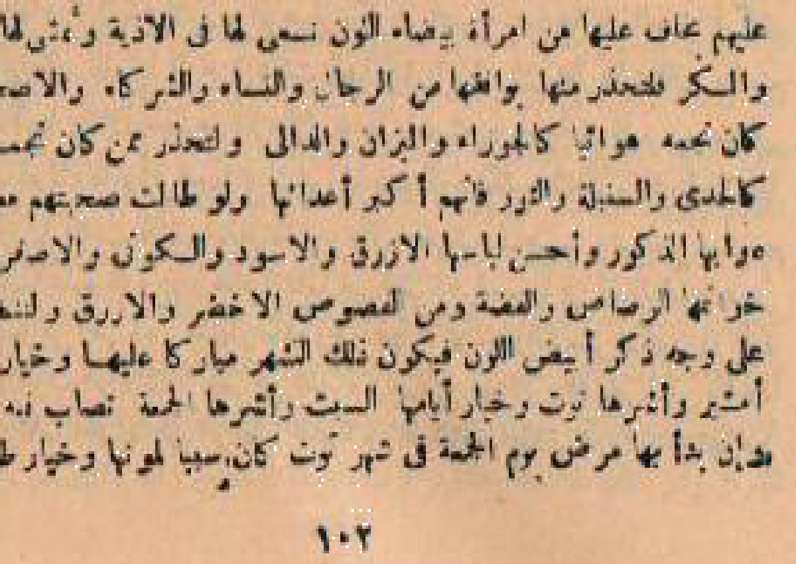
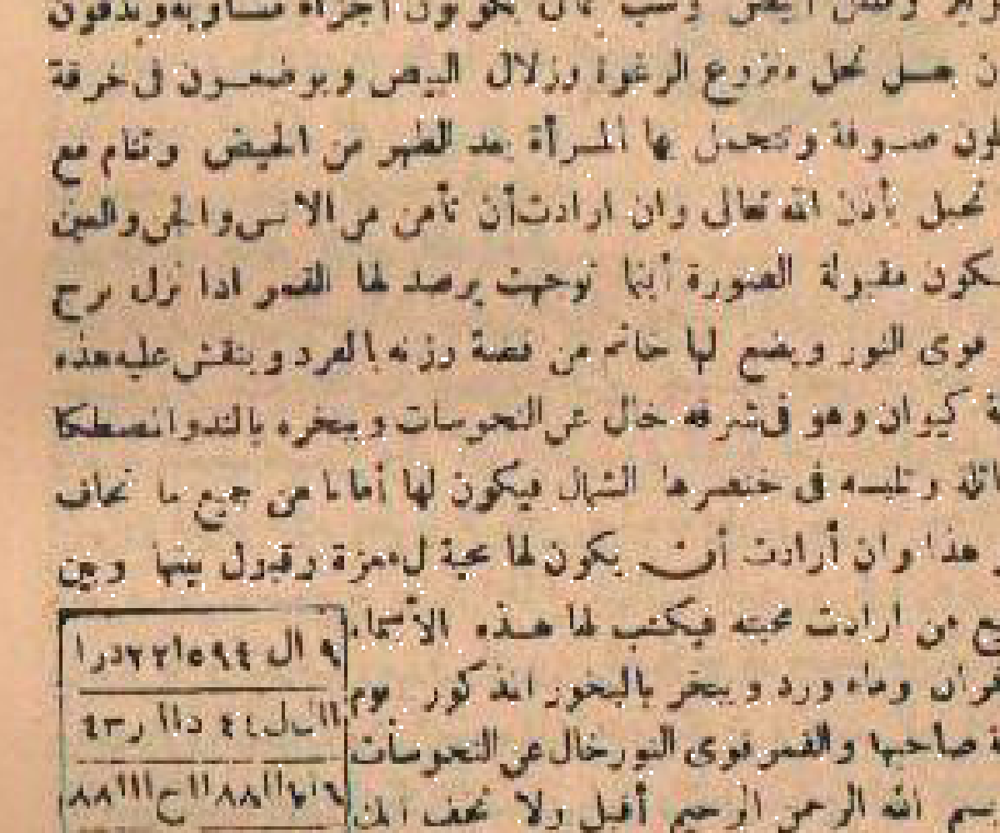
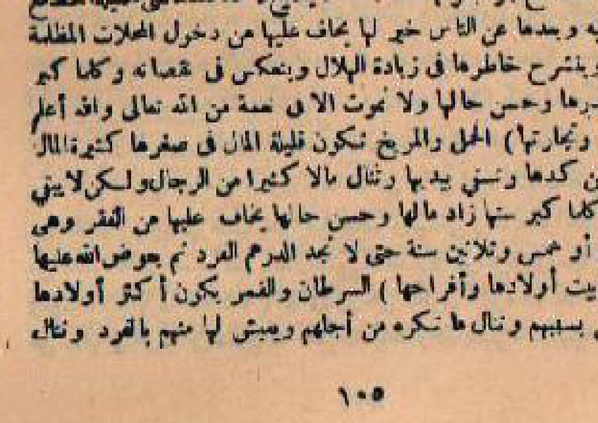
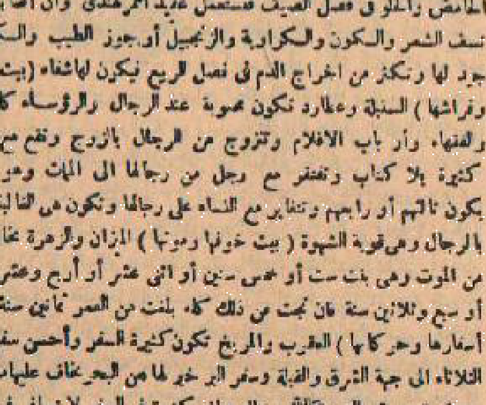
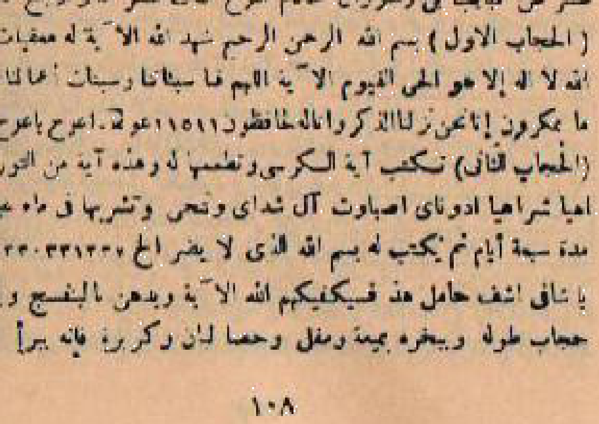
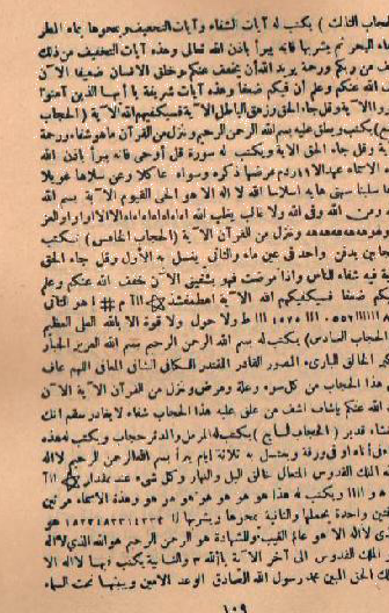

# BATCH 11 — HALAMAN PDF 51–55 (HALAMAN CETAK 102–111)

---

## HALAMAN CETAK 102 (Halaman PDF 51, sisi kanan)

**[Teks Arab Asli]**
( القول على طبع الطالع واختلاف الوجوه للنسوة فى برج الجدى )
قال الحكيم: هى امرأة سمراء اللون صافية البشرة أو مائلة إلى الصفرة المليحة، معتدلة القامة، كحيلة الطرف، رزينة الحركة، قليلة الكلام، ذات حياء ووقار، ولها ثلاثة وجوه.
**[Terjemahan Indonesia]**
(Uraian watak dasar thali' wanita dan pembagian tiga wajahnya pada buruj Capricorn)
Berkata sang ahli hikmah: Wanita yang lahir bernaung di bawah buruj Capricorn berkulit sawo matang bersih atau kuning langsat manis, berpostur tubuh sedang ideal, bermata indah bercelak alami, tenang dalam setiap gerak-gerik, hemat bicara, memiliki rasa malu yang tinggi dan wibawa kemuliaan; dan ia memiliki tiga wajah (wajh).

---

**[Teks Arab Asli]**
( الوجه الأول ) من نظر إليها زحل: تكون امرأة صبورة مدبرة، تحسن رعاية بيتها واقتصاد مالها، وتكون حافظة لسر زوجها، وتعيش فى عزة وستر، والله أعلم.
**[Terjemahan Indonesia]**
(Wajah Pertama) Bagi yang dipandang oleh planet Saturnus: Ia menjadi wanita yang sangat sabar, ulet, dan pandai mengatur keuangan rumah tangga, menjaga rapat rahasia kehormatan suaminya, serta menjalani kehidupan dalam kemuliaan dan perlindungan Allah. Wallahu a'lam.

---

**[Teks Arab Asli]**
( الوجه الثانى ) من نظر إليها الزهرة: تكون امرأة ظريفة حسناء، محبة للزينة الهادئة والمفارش النظيفة، ذات خلق كريم، يحبها زوجها ويقدر صبرها، والله تعالى أعلم.
**[Terjemahan Indonesia]**
(Wajah Kedua) Bagi yang dipandang oleh planet Venus: Ia berpenampilan anggun dan berwajah manis menawan, menyukai keindahan yang elegan dan penataan rumah yang bersih rapi, berakhlak mulia, sangat dicintai suaminya yang menghargai ketulusan dan kesabarannya. Wallahu Ta'ala a'lam.

---

**[Teks Arab Asli]**
( الوجه الثالث ) من نظر إليها عطارد: تكون امرأة عاقلة حكيمة، صاحبة رأى سديد وتدبير محكم، تصلح لإدارة الشؤون الكبيرة، وتكون مباركة فى بيتها، والله أعلم.
**[Terjemahan Indonesia]**
(Wajah Ketiga) Bagi yang dipandang oleh planet Merkurius: Ia dianugerahi kecerdasan logika dan kearifan hikmah, memiliki pandangan yang lurus dan manajemen yang rapi, sangat cakap mengelola urusan-urusan besar, serta membawa limpahan berkah di rumahnya. Wallahu a'lam.

---

**[Teks Arab Asli]**
( بيت حياتها ومعيشتها ) الجدى وزحل: تكون معيشتها مستقرة طيبة، تنال من الرزق ما يكفيها ويفضل عنها، وتعيش مستورة الحال فى عفة وشرف، ولا تموت إلا فى نعمة وسلام، والله أعلم.
**[Terjemahan Indonesia]**
(Rumah kehidupan dan penghidupannya) Capricorn dan Saturnus: Penghidupannya berlangsung stabil, sejahtera, dan tentram; tercukupi segala kebutuhannya bahkan senantiasa berlebih; hidup dalam naungan kesucian dan kehormatan martabat; serta tidak berpulang melainkan dalam limpahan nikmat dan keselamatan dari Allah. Wallahu a'lam.

---

**[Teks Arab Asli]**
( بيت مالها وتجارتها ) الدلو وزحل: تكتسب الأموال من الصنائع اليدوية المتقنة والتجارات المأمونة، وتدخر المال لنوائب الدهر، ويبارك الله فى كسبها، والله أعلم.
**[Terjemahan Indonesia]**
(Rumah harta dan perniagaannya) Aquarius dan Saturnus: Ia memperoleh penghasilan dari keterampilan kerajinan tangan yang teliti dan perniagaan yang aman; gemar menabung untuk kebutuhan masa depan; serta Allah melimpahkan keberkahan dalam setiap rezekinya. Wallahu a'lam.

---

**[Teks Arab Asli]**
( بيت إخوتها وأخواتها ) الحوت والمشترى: يكون لها إخوة يحبونها ويحسنون إليها، وتكون هى موضع سرهم ومشاورتهم، ويدوم بينهم الود والتواصل الجميل، والله تعالى أعلم.
**[Terjemahan Indonesia]**
(Rumah saudara-saudaranya) Pisces dan Yupiter: Ia memiliki saudara kandung yang sangat menyayangi dan berbuat baik kepadanya; dialah yang kerap dijadikan tempat mencurahkan rahasia dan musyawarah keluarga; serta hubungan persaudaraan mereka berlangsung harmonis. Wallahu Ta'ala a'lam.

---

**[Teks Arab Asli]**
( بيت آبائها وأمهاتها ) الحمل والمريخ: تنال من والديها برا ومحبة، وتكون مطيعة لهما محسنة إليهما، وتدفن أباها قبل أمها، وترث منهما مالا وبركة، والله أعلم.
**[Terjemahan Indonesia]**
(Rumah orang tuanya) Aries dan Mars: Ia memetik curahan kasih sayang dan doa tulus dari kedua orang tuanya; sangat patuh dan berbuat ihsan kepada keduanya; memakamkan ayahnya lebih dahulu sebelum ibunya; serta mewarisi dari keduanya warisan harta dan doa keberkahan. Wallahu a'lam.

---

**[Teks Arab Asli]**
( بيت أولادها وأفراحها ) الثور والزهرة: ترزق بأولاد مباركين نجباء ذكورا وإناثا، ويكون أكثرهم إناثا، وتنال منهم فرحا وسرورا عظيما، وتقر عينها بصلاحهم، والله أعلم.
**[Terjemahan Indonesia]**
(Rumah anak-anak dan kebahagiaannya) Taurus dan Venus: Ia dianugerahi anak-anak yang berakhlak mulia dan cerdas baik laki-laki maupun perempuan; mayoritas keturunannya adalah perempuan; ia merasakan kebahagiaan dan kebanggaan yang mendalam atas mereka; serta sejuk pandangan matanya menyaksikan kesalehan hidup anak-anaknya. Wallahu a'lam.

---

**[Teks Arab Asli]**
( بيت أمراضها وأسقامها ) الجوزاء وعطارد: تصيبها أمراض البرودة فى العظام والمفاصل ووجع الركبتين، فلتستعمل الأدهان الدافئة كزيت الزيتون وزيت الحبة السوداء، وتتجنب الهواء البارد، والله أعلم.
**[Terjemahan Indonesia]**
(Rumah penyakit dan keluhan fisiknya) Gemini dan Merkurius: Ia rentan mengalami keluhan pegal linu persendian akibat hawa dingin pada struktur tulang dan nyeri kedua lutut; maka dianjurkan rutin mengoleskan minyak berkhasiat hangat seperti minyak zaitun dan minyak habbatussauda murni; serta menghindari hembusan angin dingin. Wallahu a'lam.

---

## HALAMAN CETAK 103 (Halaman PDF 51, sisi kiri)

**[Teks Arab Asli]**
( بيت أزواجها وفراشها ) السرطان والقمر: تتزوج برجل صالح جليل القدر ذى مال وحسب، يحبها ويكرمها، وتعيش معه فى هناء ورغد، وتدوم بينهما المحبة والألفة طوال العمر، والله أعلم.
**[Terjemahan Indonesia]**
(Rumah jodoh pernikahan dan peraduannya) Cancer dan Bulan: Ia dipersunting oleh seorang pria saleh terpandang yang memiliki kekayaan dan nasab mulia; suaminya sangat mencintainya dan memuliakan kedudukannya; mereka menjalani bahtera rumah tangga dalam ketentraman dan kemakmuran; serta keharmonisan di antara mereka berlangsung abadi sepanjang usia. Wallahu a'lam.

---

**[Teks Arab Asli]**
( بيت خوفها وموتها ) الأسد والشمس: يخاف عليها من أمراض البرودة الشديدة وعوارض الصدر، وأعوام الخطر عندها: ثمانى سنين، وست عشرة سنة، وأربع وثلاثون سنة، وخمسون سنة، وسبعون سنة، فان سلمت منها عاشت إلى ثمانين سنة، والله أعلم.
**[Terjemahan Indonesia]**
(Rumah masa rawan dan krisis kesehatannya) Leo dan Matahari: Dikhawatirkan atasnya penyakit akibat udara dingin ekstrem dan gangguan pernapasan dada; tahun-tahun rawan dalam siklus usianya adalah usia 8 tahun, 16 tahun, 34 tahun, 50 tahun, dan 70 tahun; jika ia berhasil melaluinya dengan selamat, usianya akan mencapai 80 tahun. Wallahu a'lam.

---

**[Teks Arab Asli]**
( بيت أسفارها وحركاتها ) السنبلة وعطارد: تكون أسفارها مأمونة مباركة فى صحبة زوجها وأهلها، وتسافر إلى البلاد القريبة والبعيدة فى سلامة وتوفيق، والله أعلم.
**[Terjemahan Indonesia]**
(Rumah perjalanan dan pergerakannya) Virgo dan Merkurius: Aktivitas perjalanannya senantiasa aman dan penuh keberkahan dengan didampingi oleh suami dan keluarganya; bepergian ke berbagai destinasi dalam kenyamanan dan keselamatan. Wallahu a'lam.

---

**[Teks Arab Asli]**
( بيت عزها وشرفها ) الميزان والزهرة: تنال عزا عظيما ومكانة سامية بين النساء بحكمتها ووقارها، وتكون محترمة الجانب مقبولة الشفاعة عند الجميع، والله أعلم.
**[Terjemahan Indonesia]**
(Rumah kemuliaan dan status sosialnya) Libra dan Venus: Ia merengkuh kemuliaan yang agung dan kedudukan tinggi di tengah kaum wanita berkat kebijaksanaan dan ketenangannya; disegani kewibawaannya dan diterima pertolongannya oleh semua orang. Wallahu a'lam.

---

**[Teks Arab Asli]**
( بيت رجائها وآمالها ) العقرب والمريخ: يبلغها الله ما ترجوه من صلاح بيتها وراحة بالها وبر أولادها، وترزق عيشا قارا وخاتمة حسنة، والله أعلم.
**[Terjemahan Indonesia]**
(Rumah harapan dan dambaannya) Scorpio dan Mars: Allah menyampaikan dirinya pada apa yang ia dambakan berupa keharmonisan rumah tangganya, ketenangan jiwanya, dan bakti anak-anaknya; serta dianugerahi kehidupan yang mapan dan husnul khatimah. Wallahu a'lam.

---

**[Teks Arab Asli]**
( بيت أعدائها وحسادها ) القوس والمشترى: أعداؤها من بعض الحواسد اللاتى يحسدنها على صبرها وحسن تدبيرها، ويكفيها الله كيدهن ويحفظها من كل مكروه، والله سبحانه أعلم.
**[Terjemahan Indonesia]**
(Rumah musuh dan para pendengkinya) Sagittarius dan Yupiter: Musuh-musuhnya hanyalah segelintir wanita pendengki yang iri melihat kesabaran dan kepandaian manajemen hidupnya; namun Allah mencukupkan perlindungan dari tipu daya mereka dan memeliharanya dari segala marabahaya. Wallahu Subhanahu wa Ta'ala a'lam.

---

## HALAMAN CETAK 104 (Halaman PDF 52, sisi kanan)

**[Teks Arab Asli]**
( ولصاحبة هذا البرج من أشكال الرمل شكل العتبة الداخلة )
قال الحكيم: اعلمى أيتها السائلة أن شكل العتبة الداخلة يدل على استقرار الأحوال، ودخول الخير والبركة إلى بيتك، وثبات النعمة بعد التعب، فعليك بالصبر الجميل، واسمعى ما قيل:
دخلت إلى دار الهناء فاستبشرى * بنيل المنى والعيش فى خير مظهر
ولا تقلقى فالصبر يفتح بابه * لخير وفير فى دناك ومفخر
**[Terjemahan Indonesia]**
(Bagi pemilik buruj wanita ini dari bentuk-bentuk ilmu raml adalah bentuk *al-'Utbah ad-Dakhilah*)
Berkata sang ahli hikmah: Ketahuilah wahai wanita penanya, sesungguhnya bentuk al-'Utbah ad-Dakhilah menunjukkan kemapanan keadaan, masuknya limpahan kebajikan dan keberkahan ke dalam rumahmu, serta bertahannya kenikmatan setelah jerih payah berusaha; maka hiasilah dirimu dengan kesabaran yang indah; simaklah bait syair bijak ini:
*Engkau telah melangkah memasuki istana kebahagiaan maka bergembiralah * Dengan tercapainya cita-cita dan menjalani hidup dalam wujud terbaik*
*Janganlah cemas karena kesabaran akan senantiasa membuka pintunya * Bagi limpahan kebajikan yang luas di duniamu dan kebanggaan yang abadi.*

---

**[Gambar Rajah Asli Halaman 104 — Wafaq al-Jady Kaum Wanita]**

*Gambar Rajah Asli Halaman 104* — Wafaq angka keramat pelindung buruj Capricorn bagi kaum wanita untuk ketahanan lahir batin, keharmonisan rumah tangga, dan tolak bala kesedihan.

---

## HALAMAN CETAK 105 (Halaman PDF 52, sisi kiri)

**[Teks Arab Asli]**
( البرج الحادى عشر من طوالع النساء: برج الدلو وزحل )
وصاحبة فلك الدلو زحلها الرشيد * يدل على الفطانة والوفاء والكرم
لها الفؤاد الصافى والرأى السديد * وتلقى فى دهرها المبرة والشيم
تحب النزاهة وتصون العهود * وترزق فى عمرها بفيض الجود
**[Terjemahan Indonesia]**
(Buruj Kesebelas dari Thali' Kaum Wanita: Buruj Aquarius dan Penguasanya: Saturnus)
*Penguasa orbit Aquarius bagi wanita adalah Saturnus sang bintang penuntun bijak * Memberi petunjuk pada kecerdasan intuisi, kesetiaan janji, dan keluhuran derma*
*Ia dianugerahi hati nurani yang jernih bersih dan pandangan yang lurus mantap * Memetik kebajikan budi pekerti yang luhur di sepanjang perjalanan hidupnya*
*Mencintai kesucian martabat dan memegang teguh ikatan janji * Serta dikaruniai di sepanjang rentang usianya dengan curahan kemurahan rezeki Ilahi.*

---

**[Gambar Rajah Asli Halaman 105 — Tilsm Buruj ad-Dalw Kaum Wanita]**

*Gambar Rajah Asli Halaman 105* — Gambar Tilsam simbolik buruj Aquarius untuk Thali' Kaum Wanita: Sosok permaisuri anggun menuangkan air kendi kehidupan melambangkan kelimpahan ide, kedermawanan, dan ketentraman di bawah naungan Saturnus.

---

**[Teks Arab Asli]**
( القول على طبع الطالع واختلاف الوجوه للنسوة )
قال الحكيم الفلكى: هى امرأة بيضاء اللون مشربة بحمرة خفيفة أو صفرة مليحة، حسنة الوجه، لطيفة القامة، عذبة المنطق، رقيقة الإحساس، محبوبة عند الخاصة والعامة، ولها ثلاثة وجوه.
**[Terjemahan Indonesia]**
(Uraian watak dasar thali' wanita dan pembagian tiga wajahnya)
Berkata sang ahli astrologi falak: Wanita yang lahir bernaung di bawah buruj Aquarius berkulit putih bersih berpadu rona kemerahan cerah atau kuning langsat manis, berwajah rupawan berseri, berpostur tubuh proporsional luwes, bertutur kata manis santun, berperasaan halus peka, sangat disukai dan dikagumi oleh kalangan terpelajar maupun masyarakat umum; dan ia memiliki tiga wajah (wajh).

---

**[Teks Arab Asli]**
( الوجه الأول ) من نظر إليها زحل: تكون امرأة حكيمة وقورة، ذات صمت وفكر، تحسن تدبير منزلها بدقة، وتكون مسموعة القول فى أهل بيتها، والله أعلم.
**[Terjemahan Indonesia]**
(Wajah Pertama) Bagi yang dipandang oleh planet Saturnus: Ia menjadi wanita yang bijaksana dan tenang berwibawa, gemar bertafakur dalam keheningan, mengelola urusan rumah tangganya dengan sangat teliti, serta perkataannya didengar dan dipatuhi oleh seluruh anggota keluarganya. Wallahu a'lam.

---

**[Teks Arab Asli]**
( الوجه الثانى ) من نظر إليها عطارد: تكون امرأة كاتبة فصيحة، ذات ذكاء وفهم سريع، تتقن الأعمال الدقيقة والصنائع اللطيفة، وتكون مباركة فى كسبها، والله تعالى أعلم.
**[Terjemahan Indonesia]**
(Wajah Kedua) Bagi yang dipandang oleh planet Merkurius: Ia adalah wanita yang sangat cerdas dan fasih bertutur kata, berdaya tangkap cepat, mahir dalam berbagai karya seni presisi dan keterampilan estetik, serta membawa keberkahan dalam setiap rezekinya. Wallahu Ta'ala a'lam.

---

**[Teks Arab Asli]**
( الوجه الثالث ) من نظر إليها المشترى: تكون امرأة كريمة سخية، تحب فعل الخير وإعانة المحتاجين، وتنال جاها ومالا وفيرا، وتعيش فى رفاهية وعز، والله أعلم.
**[Terjemahan Indonesia]**
(Wajah Ketiga) Bagi yang dipandang oleh planet Yupiter: Ia berjiwa sangat dermawan dan berhati mulia, gemar menebar kebajikan dan membantu orang-orang yang kesusahan, memperoleh kehormatan kedudukan dan limpahan harta, serta menjalani hidup dalam kemakmuran dan kemuliaan. Wallahu a'lam.

---

## HALAMAN CETAK 106 (Halaman PDF 53, sisi kanan)

**[Teks Arab Asli]**
( بيت حياتها ومعيشتها ) الدلو وزحل: تكون حياتها طيبة هنيئة، ومعيشتها واسعة ميسرة، تنال من الخير ما يغنيها عن الناس، وتعيش مستورة الحال فى عفة وشرف، ولا تموت إلا فى نعمة وسلام، والله أعلم.
**[Terjemahan Indonesia]**
(Rumah kehidupan dan penghidupannya) Aquarius dan Saturnus: Garis kehidupannya diliputi ketentraman dan kebahagiaan; penghidupannya lapang dan penuh kemudahan; dianugerahi kecukupan rezeki yang membuatnya tidak bergantung pada orang lain; hidup dalam keadaan terjaga kehormatan dan martabatnya; serta tidak berpulang melainkan dalam limpahan nikmat dan keselamatan dari Allah. Wallahu a'lam.

---

**[Teks Arab Asli]**
( بيت مالها وتجارتها ) الحوت والمشترى: تكتسب الأموال من التجارة الرابحة والصنائع النافعة، ويبارك الله فى مكاسبها، وتجمع ثروة طيبة تدخرها لأولادها، والله أعلم.
**[Terjemahan Indonesia]**
(Rumah harta dan perniagaannya) Pisces dan Yupiter: Ia mendulang kekayaan dari perniagaan yang berkah dan industri kreatif yang bermanfaat; Allah melipatgandakan keberkahan dalam hartanya; serta mampu menabung kekayaan yang berharga untuk masa depan anak-anaknya. Wallahu a'lam.

---

**[Teks Arab Asli]**
( بيت إخوتها وأخواتها ) الحمل والمريخ: يكون لها إخوة وأخوات ذكورا وإناثا، ويكون بينهم مودة وتعاطف وبر، وتكون هى موضع سرهم ومحبتهم، ولا ترى منهم إلا ما يسرها، والله تعالى أعلم.
**[Terjemahan Indonesia]**
(Rumah saudara-saudaranya) Aries dan Mars: Ia memiliki saudara kandung laki-laki dan perempuan; ikatan persaudaraan di antara mereka terjalin harmonis penuh kasih sayang dan saling tolong-menolong; dialah yang menjadi tempat curahan hati dan kesayangan keluarga; serta ia tidak melihat dari mereka melainkan kebaikan. Wallahu Ta'ala a'lam.

---

**[Teks Arab Asli]**
( بيت آبائها وأمهاتها ) الثور والزهرة: تنال من والديها برا ومحبة، وتكون مطيعة لهما محسنة إليهما، وتدفن أباها قبل أمها، وترث منهما مالا وبركة، والله أعلم.
**[Terjemahan Indonesia]**
(Rumah orang tuanya) Taurus dan Venus: Ia memetik curahan kasih sayang dan doa tulus dari kedua orang tuanya; sangat berbakti dan berbuat ihsan kepada keduanya; memakamkan ayahnya lebih dahulu sebelum ibunya; serta mewarisi dari keduanya warisan harta dan doa keberkahan. Wallahu a'lam.

---

**[Teks Arab Asli]**
( بيت أولادها وأفراحها ) الجوزاء وعطارد: ترزق بأولاد مباركين نجباء ذكورا وإناثا، ويكون أولادها أصحاب عقل وفطانة، وتنال منهم فرحا وسرورا عظيما، وتقر عينها بصلاحهم، والله أعلم.
**[Terjemahan Indonesia]**
(Rumah anak-anak dan kebahagiaannya) Gemini dan Merkurius: Ia dianugerahi putra dan putri yang berbakat cerdas dan berakhlak mulia; ia memetik kegembiraan dan kebanggaan yang mendalam atas mereka; serta sejuk pandangan matanya menyaksikan kesalehan hidup anak-anaknya. Wallahu a'lam.

---

**[Teks Arab Asli]**
( بيت أمراضها وأسقامها ) السرطان والقمر: تصيبها أمراض الرطوبة والرياح فى المفاصل والصداع ووجع الظهر، فلتستعمل شراب العسل بالزنجبيل والدهن العطرى، وتتجنب الهواء البارد على الريق، والله أعلم.
**[Terjemahan Indonesia]**
(Rumah penyakit dan keluhan fisiknya) Cancer dan Bulan: Ia rentan mengalami keluhan pegal linu persendian akibat kelembapan tubuh, pusing kepala, dan nyeri punggung; maka dianjurkan rutin meminum madu jahe hangat dan mengoleskan minyak aromaterapi berkhasiat; serta menghindari paparan angin dingin saat perut kosong di pagi hari. Wallahu a'lam.

---

## HALAMAN CETAK 107 (Halaman PDF 53, sisi kiri)

**[Teks Arab Asli]**
( بيت أزواجها وفراشها ) الأسد والشمس: تتزوج برجل شريف جليل القدر ذى مال وجاه، يحبها ويكرمها، وتعيش معه فى هناء ورغد، وتدوم بينهما المحبة والألفة طوال العمر، والله أعلم.
**[Terjemahan Indonesia]**
(Rumah jodoh pernikahan dan peraduannya) Leo dan Matahari: Ia dipersunting oleh seorang pria terhormat berwibawa tinggi yang memiliki kekayaan dan status sosial mapan; suaminya sangat mencintainya dan memuliakan kedudukannya; mereka membina rumah tangga dalam ketentraman dan kemakmuran; serta keharmonisan di antara mereka berlangsung abadi sepanjang usia. Wallahu a'lam.

---

**[Teks Arab Asli]**
( بيت خوفها وموتها ) السنبلة وعطارد: يخاف عليها من أمراض البرودة وعوارض الرطوبة، وأعوام الخطر عندها: تسع سنين، وثمانى عشرة سنة، وسبع وثلاثون سنة، وخمسون سنة، وسبعون سنة، فان سلمت منها عاشت إلى تسعين سنة، والله أعلم.
**[Terjemahan Indonesia]**
(Rumah masa rawan dan krisis kesehatannya) Virgo dan Merkurius: Dikhawatirkan atasnya penyakit akibat udara dingin basah dan gangguan organ dalam perut; tahun-tahun rawan dalam siklus usianya adalah usia 9 tahun, 18 tahun, 37 tahun, 50 tahun, dan 70 tahun; jika ia berhasil melaluinya dengan selamat, usianya akan mencapai 90 tahun. Wallahu a'lam.

---

**[Teks Arab Asli]**
( بيت أسفارها وحركاتها ) الميزان والزهرة: تكون أسفارها مأمونة مباركة فى صحبة زوجها وأهلها، وتسافر إلى البلاد القريبة والبعيدة فى سلامة وتوفيق، والله أعلم.
**[Terjemahan Indonesia]**
(Rumah perjalanan dan pergerakannya) Libra dan Venus: Aktivitas perjalanannya senantiasa aman dan penuh keberkahan dengan didampingi oleh suami dan keluarganya; bepergian ke berbagai kota dalam kenyamanan dan keselamatan. Wallahu a'lam.

---

**[Teks Arab Asli]**
( بيت عزها وشرفها ) العقرب والمريخ: تنال عزا عظيما ومكانة سامية بين النساء بحكمتها ووقارها، وتكون محترمة الجانب مقبولة الشفاعة عند الجميع، والله أعلم.
**[Terjemahan Indonesia]**
(Rumah kemuliaan dan status sosialnya) Scorpio dan Mars: Ia merengkuh kemuliaan yang agung dan kedudukan tinggi di tengah kaum wanita berkat kebijaksanaan dan ketenangannya; disegani kewibawaannya dan diterima pertolongannya oleh semua orang. Wallahu a'lam.

---

**[Teks Arab Asli]**
( بيت رجائها وآمالها ) القوس والمشترى: يبلغها الله ما ترجوه من صلاح بيتها وراحة بالها وبر أولادها، وترزق عيشا قارا وخاتمة حسنة، والله أعلم.
**[Terjemahan Indonesia]**
(Rumah harapan dan dambaannya) Sagittarius dan Yupiter: Allah menyampaikan dirinya pada apa yang ia dambakan berupa keharmonisan rumah tangganya, ketentraman jiwanya, dan bakti anak-anaknya; serta dianugerahi kehidupan yang mapan dan husnul khatimah. Wallahu a'lam.

---

**[Teks Arab Asli]**
( بيت أعدائها وحسادها ) الجدى وزحل: أعداؤها من بعض الحواسد اللاتى يحسدنها على عقلها وحسن تدبيرها، ويكفيها الله كيدهن ويحفظها من كل مكروه، والله سبحانه أعلم.
**[Terjemahan Indonesia]**
(Rumah musuh dan para pendengkinya) Capricorn dan Saturnus: Musuh-musuhnya hanyalah segelintir wanita pendengki yang iri melihat kecerdasan akal dan kepandaian manajemen hidupnya; namun Allah mencukupkan perlindungan dari tipu daya mereka dan memeliharanya dari segala marabahaya. Wallahu Subhanahu wa Ta'ala a'lam.

---

**[Teks Arab Asli]**
( ولصاحبة هذا البرج من أشكال الرمل شكل الجماعة )
قال الحكيم: اعلمى أيتها السائلة أن شكل الجماعة يدل على اجتماع الشمل بالأحباب، والألفة والمحبة، والتوفيق فى كل عمل وسعي، فعليك بحسن الخلق، واسمعى ما قيل:
جمعت قلوب الناس بالخلق الرضى * وعشت فى أمن وفى عيش مضى
فاستبشرى بالخير من رب السما * فالحق أبلج والزمان قد انقضى
**[Terjemahan Indonesia]**
(Bagi pemilik buruj wanita ini dari bentuk-bentuk ilmu raml adalah bentuk *al-Jama'ah*)
Berkata sang ahli hikmah: Ketahuilah wahai wanita penanya, sesungguhnya bentuk al-Jama'ah melambangkan terhimpunnya kembali ikatan bersama orang-orang tercinta, kerukunan cinta kasih, serta taufik kemudahan dalam setiap ikhtiar; maka perindahlah budi pekertimu; simaklah bait syair bijak ini:
*Engkau telah menyatukan hati manusia dengan akhlakmu yang diridhai * Dan engkau hidup dalam naungan rasa aman dan kemakmuran yang nyata*
*Maka bergembiralah menyongsong kebaikan dari Tuhan Penguasa Langit * Karena kebenaran itu benderang terang dan masa kesusahan telah berlalu.*

---

**[Gambar Rajah Asli Halaman 107 — Wafaq ad-Dalw Kaum Wanita]**

*Gambar Rajah Asli Halaman 107* — Wafaq angka keramat pelindung buruj Aquarius bagi kaum wanita untuk kerukunan cinta, daya tarik mahabbah umum, dan tolak bala fitnah.

---

## HALAMAN CETAK 108 (Halaman PDF 54, sisi kanan)

**[Teks Arab Asli]**
( البرج الثانى عشر من طوالع النساء: برج الحوت والمشترى )
وصاحبة فلك الحوت مشتريها الحليم * يدل على الصلاح والتقوى والجمال
لها القلب الرقيق والخلق الكريم * وتظفر فى دهرها ببلوغ الكمال
تحب الإحسان وتكرم العفاة * وترزق فى عمرها بجميع البركات
**[Terjemahan Indonesia]**
(Buruj Keduabelas dari Thali' Kaum Wanita: Buruj Pisces dan Penguasanya: Yupiter)
*Penguasa orbit Pisces bagi wanita adalah Yupiter sang bintang penyantun bijak * Memberi petunjuk pada kesalehan batin, ketakwaan murni, dan keindahan rupa*
*Ia dianugerahi hati nurani yang lembut peka dan budi pekerti yang amat mulia * Berhasil meraih kesempurnaan kebajikan di sepanjang lembaran hidupnya*
*Mencintai perbuatan ihsan dan gemar menolong orang-orang yang membutuhkan * Serta dikaruniai di sepanjang usianya dengan segenap limpahan keberkahan.*

---

**[Gambar Rajah Asli Halaman 108 — Tilsm Buruj al-Hut Kaum Wanita]**

*Gambar Rajah Asli Halaman 108* — Gambar Tilsam simbolik buruj Pisces untuk Thali' Kaum Wanita: Sosok permaisuri bertahta samudera diapit dua ekor ikan emas melambangkan spiritualitas tinggi, intuisi murni, dan kelimpahan rezeki di bawah bintang Yupiter.

---

**[Teks Arab Asli]**
( القول على طبع الطالع واختلاف الوجوه للنسوة )
قال الحكيم الفلكى: هى امرأة بيضاء اللون كالبدر ليلة تمامه، حسنة القد والقامة، كحيلة الطرف، ناصعة الجبين، رقيقة الصوت، كثيرة الحياء والرحمة بالخلق، ولها ثلاثة وجوه.
**[Terjemahan Indonesia]**
(Uraian watak dasar thali' wanita dan pembagian tiga wajahnya)
Berkata sang ahli astrologi falak: Wanita yang lahir bernaung di bawah buruj Pisces berkulit putih bersih bercahaya laksana bulan purnama di malam empat belas, berpostur tubuh proporsional anggun, bermata indah bercelak alami, berdahi cerah berseri, bersuara merdu lembut, memiliki rasa malu yang tinggi dan menaruh belas kasih mendalam kepada sesama makhluk; dan ia memiliki tiga wajah (wajh).

---

**[Teks Arab Asli]**
( الوجه الأول ) من نظر إليها المشترى: تكون امرأة صالحة عابدة، ذات ورع وتقوى، تحسن تربية أولادها على طاعة الله، وترزق حجا وزيارة، وتكون مباركة فى بيتها، والله أعلم.
**[Terjemahan Indonesia]**
(Wajah Pertama) Bagi yang dipandang oleh planet Yupiter: Ia menjadi wanita salihah yang tekun beribadah, memiliki sifat wara' dan takwa mendalam, mendidik putra-putrinya di atas jalan ketaatan kepada Allah, dianugerahi kesempatan menunaikan ibadah haji dan ziarah suci, serta membawa keberkahan di rumahnya. Wallahu a'lam.

---

**[Teks Arab Asli]**
( الوجه الثانى ) من نظر إليها الزهرة: تكون امرأة ظريفة حسناء، محبة للطيب والزينة والمفارش الأنيقة، ذات دلال وجمال، يعشقها زوجها ويكون لها حظ عظيم فى السعادة، والله تعالى أعلم.
**[Terjemahan Indonesia]**
(Wajah Kedua) Bagi yang dipandang oleh planet Venus: Ia berparas sangat cantik jelita dan modis mempesona, menyukai wewangian harum, perhiasan berkilau, dan perabot rumah yang estetis, bersikap manja anggun memikat, sangat dicintai suaminya dan dinaungi peruntungan besar dalam kebahagiaan hidup. Wallahu Ta'ala a'lam.

---

**[Teks Arab Asli]**
( الوجه الثالث ) من نظر إليها عطارد: تكون امرأة عاقلة لبيبة، فصيحة اللسان، تتقن تدبير الأمور بحكمة، وتكون محبوبة عند سائر الناس، والله أعلم.
**[Terjemahan Indonesia]**
(Wajah Ketiga) Bagi yang dipandang oleh planet Merkurius: Ia adalah wanita yang cerdas berwawasan luas, fasih bertutur kata santun, sangat terampil mengelola berbagai urusan dengan kebijaksanaan, serta dicintai oleh segenap masyarakat. Wallahu a'lam.

---

## HALAMAN CETAK 109 (Halaman PDF 54, sisi kiri)

**[Teks Arab Asli]**
( بيت حياتها ومعيشتها ) الحوت والمشترى: تكون حياتها فى عافية وسعة، ومعيشتها هنيئة رغيدة، تنال من الخير ما يغنيها عن الناس، وتعيش مستورة الحال فى عفة وسلام، ولا تموت إلا فى نعمة وفضل، والله أعلم.
**[Terjemahan Indonesia]**
(Rumah kehidupan dan penghidupannya) Pisces dan Yupiter: Garis kehidupannya diliputi kesehatan afiat dan kelapangan rezeki; penghidupannya amat tentram dan sejahtera; dianugerahi kecukupan yang membuatnya tidak bergantung pada orang lain; hidup dalam keadaan terjaga kehormatan dan kedamaiannya; serta tidak berpulang melainkan dalam limpahan nikmat dan karunia Ilahi. Wallahu a'lam.

---

**[Teks Arab Asli]**
( بيت مالها وتجارتها ) الحمل والمريخ: تكتسب الأموال من التجارات النافعة والصنائع اليدوية، ويبارك الله فى مكاسبها، وتجمع ثروة طيبة تدخرها لأولادها، والله أعلم.
**[Terjemahan Indonesia]**
(Rumah harta dan perniagaannya) Aries dan Mars: Ia mendulang kekayaan dari perniagaan yang produktif dan keterampilan industri kreatif bernilai tinggi; Allah melipatgandakan keberkahan dalam hartanya; serta mampu menabung kekayaan yang berharga untuk masa depan anak-anaknya. Wallahu a'lam.

---

**[Teks Arab Asli]**
( بيت إخوتها وأخواتها ) الثور والزهرة: يكون لها إخوة وأخوات ذكورا وإناثا، ويكون بينهم مودة وتعاطف وبر، وتكون هى موضع سرهم ومحبتهم، ولا ترى منهم إلا ما يسرها، والله تعالى أعلم.
**[Terjemahan Indonesia]**
(Rumah saudara-saudaranya) Taurus dan Venus: Ia memiliki saudara kandung laki-laki dan perempuan; ikatan persaudaraan di antara mereka terjalin harmonis penuh kasih sayang dan saling tolong-menolong; dialah yang menjadi tempat curahan hati dan kesayangan keluarga; serta ia tidak melihat dari mereka melainkan kebaikan. Wallahu Ta'ala a'lam.

---

**[Teks Arab Asli]**
( بيت آبائها وأمهاتها ) الجوزاء وعطارد: تنال من والديها برا ومحبة، وتكون مطيعة لهما محسنة إليهما، وتدفن أباها قبل أمها، وترث منهما مالا وبركة، والله أعلم.
**[Terjemahan Indonesia]**
(Rumah orang tuanya) Gemini dan Merkurius: Ia memetik curahan kasih sayang dan doa tulus dari kedua orang tuanya; sangat berbakti dan berbuat ihsan kepada keduanya; memakamkan ayahnya lebih dahulu sebelum ibunya; serta mewarisi dari keduanya warisan harta dan doa keberkahan. Wallahu a'lam.

---

**[Teks Arab Asli]**
( بيت أولادها وأفراحها ) السرطان والقمر: ترزق بأولاد مباركين نجباء ذكورا وإناثا، ويكون أولادها أصحاب عقل وصلاح، وتنال منهم فرحا وسرورا عظيما، وتقر عينها بصلاحهم، والله أعلم.
**[Terjemahan Indonesia]**
(Rumah anak-anak dan kebahagiaannya) Cancer dan Bulan: Ia dianugerahi putra dan putri yang berbakat cerdas dan berakhlak saleh; ia memetik kegembiraan dan kebanggaan yang mendalam atas mereka; serta sejuk pandangan matanya menyaksikan kesalehan hidup anak-anaknya. Wallahu a'lam.

---

**[Teks Arab Asli]**
( بيت أمراضها وأسقامها ) الأسد والشمس: تصيبها أمراض الرطوبة والرياح فى المفاصل والصداع ووجع الظهر، فلتستعمل شراب العسل بالزنجبيل والدهن العطرى، وتتجنب الهواء البارد على الريق، والله أعلم.
**[Terjemahan Indonesia]**
(Rumah penyakit dan keluhan fisiknya) Leo dan Matahari: Ia rentan mengalami keluhan pegal linu persendian akibat kelembapan tubuh, pusing kepala, dan nyeri punggung; maka dianjurkan rutin meminum madu jahe hangat dan mengoleskan minyak aromaterapi berkhasiat; serta menghindari paparan angin dingin saat perut kosong di pagi hari. Wallahu a'lam.

---

## HALAMAN CETAK 110 (Halaman PDF 55, sisi kanan)

**[Teks Arab Asli]**
( بيت أزواجها وفراشها ) السنبلة وعطارد: تتزوج برجل صالح جليل القدر ذى مال وحسب، يحبها ويكرمها، وتعيش معه فى هناء ورغد، وتدوم بينهما المحبة والألفة طوال العمر، والله أعلم.
**[Terjemahan Indonesia]**
(Rumah jodoh pernikahan dan peraduannya) Virgo dan Merkurius: Ia dipersunting oleh seorang pria saleh terpandang yang memiliki kekayaan dan nasab mulia; suaminya sangat mencintainya dan memuliakan kedudukannya; mereka membina rumah tangga dalam ketentraman dan kemakmuran; serta keharmonisan di antara mereka berlangsung abadi sepanjang usia. Wallahu a'lam.

---

**[Teks Arab Asli]**
( بيت خوفها وموتها ) الميزان والزهرة: يخاف عليها من أمراض البرودة وعوارض الرطوبة، وأعوام الخطر عندها: ثمانى سنين، وست عشرة سنة، وأربع وثلاثون سنة، وخمسون سنة، وسبعون سنة، فان سلمت منها عاشت إلى تسعين سنة، والله أعلم.
**[Terjemahan Indonesia]**
(Rumah masa rawan dan krisis kesehatannya) Libra dan Venus: Dikhawatirkan atasnya penyakit akibat udara dingin basah dan kelembapan tubuh; tahun-tahun rawan dalam siklus usianya adalah usia 8 tahun, 16 tahun, 34 tahun, 50 tahun, dan 70 tahun; jika ia berhasil melaluinya dengan selamat, usianya akan mencapai 90 tahun. Wallahu a'lam.

---

**[Teks Arab Asli]**
( بيت أسفارها وحركاتها ) العقرب والمريخ: تكون أسفارها مأمونة مباركة فى صحبة زوجها وأهلها، وتسافر إلى البلاد القريبة والبعيدة فى سلامة وتوفيق، والله أعلم.
**[Terjemahan Indonesia]**
(Rumah perjalanan dan pergerakannya) Scorpio dan Mars: Aktivitas perjalanannya senantiasa aman dan penuh keberkahan dengan didampingi oleh suami dan keluarganya; bepergian ke berbagai kota dalam kenyamanan dan keselamatan. Wallahu a'lam.

---

**[Teks Arab Asli]**
( بيت عزها وشرفها ) القوس والمشترى: تنال عزا عظيما ومكانة سامية بين النساء بحكمتها ووقارها، وتكون محترمة الجانب مقبولة الشفاعة عند الجميع، والله أعلم.
**[Terjemahan Indonesia]**
(Rumah kemuliaan dan status sosialnya) Sagittarius dan Yupiter: Ia merengkuh kemuliaan yang agung dan kedudukan tinggi di tengah kaum wanita berkat kebijaksanaan dan ketenangannya; disegani kewibawaannya dan diterima pertolongannya oleh semua orang. Wallahu a'lam.

---

**[Teks Arab Asli]**
( بيت رجائها وآمالها ) الجدى وزحل: يبلغها الله ما ترجوه من صلاح بيتها وراحة بالها وبر أولادها، وترزق عيشا قارا وخاتمة حسنة، والله أعلم.
**[Terjemahan Indonesia]**
(Rumah harapan dan dambaannya) Capricorn dan Saturnus: Allah menyampaikan dirinya pada apa yang ia dambakan berupa keharmonisan rumah tangganya, ketentraman jiwanya, dan bakti anak-anaknya; serta dianugerahi kehidupan yang mapan dan husnul khatimah. Wallahu a'lam.

---

**[Teks Arab Asli]**
( بيت أعدائها وحسادها ) الدلو وزحل: أعداؤها من بعض الحواسد اللاتى يحسدنها على عفتها وجمالها، ويكفيها الله كيدهن ويحفظها من كل مكروه، والله سبحانه أعلم.
**[Terjemahan Indonesia]**
(Rumah musuh dan para pendengkinya) Aquarius dan Saturnus: Musuh-musuhnya hanyalah segelintir wanita pendengki yang iri melihat kesucian dirinya dan kecantikan parasnya; namun Allah mencukupkan perlindungan dari tipu daya mereka dan memeliharanya dari segala marabahaya. Wallahu Subhanahu wa Ta'ala a'lam.

---

**[Teks Arab Asli]**
( ولصاحبة هذا البرج من أشكال الرمل شكل القبض الداخل )
قال الحكيم: اعلمى أيتها السائلة أن شكل القبض الداخل يدل على حصول المراد، وجمع الشمل، واستقرار العيش، وتمتع السائلة ببركات الدنيا والآخرة، فعليك بملازمة الحمد والشكر، واسمعى ما قيل:
تمت لك النعماء فى إقبال * ونلت ما ترجين من آمال
فاحمدى الله على آلائه * تعيشى فى أمن وفى إجلال
**[Terjemahan Indonesia]**
(Bagi pemilik buruj wanita ini dari bentuk-bentuk ilmu raml adalah bentuk *al-Qabdh ad-Dakhil*)
Berkata sang ahli hikmah: Ketahuilah wahai wanita penanya, sesungguhnya bentuk al-Qabdh ad-Dakhil menunjukkan tercapainya puncak impian, terhimpunnya kembali ikatan keluarga, kemapanan penghidupan, serta diraihnya kenikmatan keberkahan dunia dan akhirat; maka lazimkanlah memuji Allah dan bersyukur kepada-Nya; simaklah bait syair bijak ini:
*Telah sempurna bagimu segala kenikmatan yang menyongsong langkahmu * Dan engkau telah meraih segala apa yang kau dambakan dari harapan*
*Maka pujilah Allah atas limpahan karunia nikmat-Nya * Niscaya engkau hidup dalam naungan rasa aman dan kemuliaan martabat yang abadi.*

---

**[Gambar Rajah Asli Halaman 110 — Wafaq al-Hut Kaum Wanita]**

*Gambar Rajah Asli Halaman 110* — Wafaq angka keramat pelindung penutup bagi 12 Buruj Thali' Kaum Wanita (buruj Pisces).

---

## HALAMAN CETAK 111 (Halaman PDF 55, sisi kiri)

**[Teks Arab Asli]**
( دَائِرَةُ الْفَلَكِ الْكُبْرَى وَمَنَازِلُ الْقَمَرِ الثَّمَانِيَةُ وَالْعِشْرُونَ )
قال الحكيم الفلكى أبو معشر البلخى: هذه صورة دائرة الفلك الكبرى الجامعة للبروج الاثنى عشر والمنازل القمرية الثمانية والعشرين مع أربابها من الكواكب السيارة السبعة. وهى الأصل الذى تدور عليه أحكام هذا الكتاب فى معرفة الطوالع والدرجات والساعات الفلكية السعيدة والنحيسة، ومعرفة طبائع البروج من النار والتراب والهواء والماء، ومطالع الكواكب ومغاربها فى سائر فصول السنة.
**[Terjemahan Indonesia]**
(DIAGRAM LINGKARAN FALAK AKBAR DAN 28 MANAZIL BULAN)
Berkata sang ahli falak Abu Ma'syar al-Balkhi: Inilah gambar diagram lingkaran falak akbar (da'irah al-falak al-kubra) yang menghimpun seluruh 12 buruj zodiak dan 28 stasiun orbit Bulan (manazil al-qamar) beserta planet-planet penguasanya dari tujuh bintang pengelana (al-kawakib as-sab'ah). Diagram inilah fondasi utama perputaran kaidah-kaidah kitab ini dalam menentukan thali' kelahiran, derajat bujur bintang, jam-jam falakiyah yang beruntung (sa'ad) maupun naas (nahas), mengenali empat watak elemen zodiak (api, tanah, udara, air), serta posisi terbit dan terbenamnya bintang di setiap pergantian musim sepanjang tahun.

---

**[Gambar Rajah Asli Halaman 111 — Da'irah al-Falak al-Kubra]**

*Gambar Rajah Asli Halaman 111* — Gambar Da'irah al-Falak al-Kubra (Diagram Lingkaran Falak Zodiak & 28 Manazil Bulan) karya Syaikh Abu Ma'syar al-Falaki.

---

> **STATUS BATCH 11: SELESAI** (Halaman Cetak 102–111 / Halaman PDF 51–55).
> Rajah/wafaq/tilsam batch ini telah di-crop presisi, latar putih, tersimpan di folder `rajah/`:
> `rajah_p104_wafaq_nisa_jady.png`, `rajah_p105_tilsam_nisa_dalw.png`, `rajah_p107_wafaq_nisa_dalw.png`, `rajah_p108_tilsam_nisa_hut.png`, `rajah_p110_wafaq_nisa_hut.png`, `rajah_p111_dairah_falak.png`.
