# TERJEMAHAN KITAB: ABU MA'SYAR AL-FALAKI AL-KABIR
## (أبو معشر الفلكي الكبير فيه طوالع الرجال والنساء بالتمام والكمال)

**Format dokumen ini:**
- Setiap bagian menampilkan **[Teks Arab Asli]** di atas dan **[Terjemahan Indonesia]** di bawahnya, per paragraf, sesuai halaman cetak kitab.
- Rajah / Wafaq / Tabel / Gambar mistik **tidak diterjemahkan menjadi teks** — ditampilkan apa adanya sebagai gambar crop resolusi tinggi dengan latar putih, diberi keterangan *"Gambar Rajah Asli Halaman …"*, disertai keterangan cara baca dalam bahasa Indonesia bila ada di dalam kitab.
- Istilah kunci hikmah yang tidak ada padanan Indonesianya dibiarkan dalam bahasa Arab dan diberi penjelasan dalam kurung.
- Sumber: hasil pindaian (scan) litograf dari repositori `fatimah86-dot/kitab` (56 halaman PDF). Transkripsi Arab disalin seteliti mungkin dari litograf; pada edisi cetak ini sebagian huruf aus/tidak sempurna, dan bagian yang benar-benar tidak terbaca ditandai `[…]` tanpa membuang struktur kalimatnya.
- Pengerjaan dilakukan per 5 halaman PDF per batch. **Batch 1 = halaman PDF 1–5 (halaman cetak 3–11).**

---

## HALAMAN CETAK 3 (Halaman PDF 1)

**[Teks Arab Asli]**

بِسْمِ اللهِ الرَّحْمٰنِ الرَّحِيْمِ

الحمد لله الذى خلق الانسان من سلالة من طين ثم جعله نطفة فى قرار مكين ثم خلق النطفة علقة فخلق العلقة مضغة وخلق المضغة عظاماً فكسا العظام لحماً ثم أنشأه خلقاً آخر فتبارك الله أحسن الخالقين، يهدى من يشاء بتوفيقه الى جنات النعيم ويضل من يشاء من الجحيم ويجعل فى الحميم، وأشهد أن لا إله إلا الله وحده لا شريك له الملك الحق المبين، وأشهد أن سيدنا محمداً عبده ورسوله النبى الأمين (وصلى) […] من يوم المحشر […] أتصف خلق الله وأظهر […] قول الله تبارك وتعالى الذى جعل فى السماء بروجاً الآيات. استخرت الله تعالى أن أبين طبع الانسان من هذه البروج، والتزمت أن أرتب كل برج على ثلاثة أوجه واثني عشر بيتاً، وأربّعه بما له من الأشكال الرملية، وجعلت مقدمة هذا الكتاب فى بعض أشياء من علم الحساب، وخاتمته فى الحجج اللازمة لهذا الكتاب، فأقول وعلى الله حسن القبول.

**[Transliterasi Latin Fonetik]**

*Bismillaahir-Rahmaanir-Rahiim*

*Al-hamdu lillaahil-ladzii khalaqal-insaana min sulaalatin min thiinin tsumma ja'alahu nuthfatan fii qaraarin makiinin tsumma khalaqan-nuthfata 'alaqatan fa-khalaqal-'alaqata mudhghatan wa khalaqal-mudhghata 'izhaaman fa-kasaal-'izhaama lahman tsumma ansya'ahu khalqan aakhara fa-tabaaraka Allaahi ahsanul-khaaliqiina, yahdii min yasyaa'u bi-tawfiiqihi ilaa jannaatin-na'iimi wa yudhillu min yasyaa'u minal-jahiimi wa yaj'alu fil-hamiimi, wa asyhadu an laa ilaaha illaa Allaahi wahdahu laa syariika lahul-malikil-Haqqul-Mubiinu, wa asyhadu an sayyidinaa Muhammadan 'abduhu wa rasuuluhun-Nabiyyil-Amiini (wa shallaa)[…] min yawmal-mahasyar […] atashifu khalaqa Allaahi wa azhharu […] qawlu Allaahi Tabaaraka wa Ta'aalaal-ladzii ja'al fis-samaa'i baruujaal-aayaati  astakhart Allaahi Ta'aalaa an abayni thab'ul-insaana min haadzihil-buruuji, wat-tazamat an arattaba kullu burju 'alaa tsalaatsatun awjuhi wa itsnay 'asyara baytan, wa urabbi'uhu bimaa lahu minal-asykaalir-ramliyyati, waja'alat muqaddamatu haadzaal-kitaabi fii ba'dhu asyyaa'in min 'ilmil-hisaabi, wa khaatimatahu fil-hijajil-laazimati li-haadzaal-kitaabi, fa-aquulu wa 'alaa Allaahi hasanul-qabuuli *

**[Terjemahan Indonesia]**

Dengan nama Allah Yang Maha Pengasih lagi Maha Penyayang.

Segala puji bagi Allah yang telah menciptakan manusia dari saripati tanah, kemudian menjadikannya setetes mani di dalam tempat yang kokoh, kemudian menciptakan mani itu menjadi segumpal darah, lalu menciptakan segumpal darah itu menjadi segumpal daging, lalu menjadikan daging itu tulang-belulang, kemudian membungkus tulang itu dengan daging, lalu menjadikannya makhluk yang baru. Mahasuci Allah, sebaik-baik Pencipta. Dengan taufik-Nya Dia memberi petunjuk siapa yang Dia kehendaki menuju taman-taman kenikmatan (surga), dan Dia membiarkan sesat siapa yang Dia kehendaki menuju Jahim (neraka) dan menempatkannya di dalam air yang mendidih. Aku bersaksi bahwa tiada tuhan selain Allah semata, tiada sekutu bagi-Nya, Raja Yang Hak lagi Maha Nyata; dan aku bersaksi bahwa junjungan kita Muhammad adalah hamba-Nya dan utusan-Nya, nabi yang terpercaya (semoga shalawat tercurah kepadanya) … pada hari kebangkitan … aku menelaah ciptaan Allah … firman Allah Yang Mahasuci dan Mahatinggi: "*Demi Dia yang menjadikan di langit bintang-bintang (buruj)…*" (QS. al-Furqan: 61). Aku telah memohon pilihan (istikharah) kepada Allah Ta'ala untuk menjelaskan watak (tabi'ah) manusia berdasarkan bintang-bintang (buruj) ini, dan aku berkomitmen menyusun setiap buruj atas tiga wajah (wajh — pembagian sepertiga buruj dalam astrologi) dan dua belas rumah (bait — kedudukan peredaran), lalu melengkapinya dengan bentuk-bentuk ramliyah (geomansi/ilmu raml) yang menjadi haknya. Aku jadikan pendahuluan kitab ini memuat beberapa hal dari ilmu hitung (hisab), dan penutupnya memuat hujah-hujah yang diperlukan oleh kitab ini. Maka aku mulai menulis, dan kepada Allah semata aku memohon penerimaan yang baik.

---

**[Teks Arab Asli]**

( فصل فى معرفة ما يحدث فى السنين بحسب الايام السبع )

فان كان أول السنة يوم الاحد فان الشمس تملكها، وهذا دليل على ظهور الملك والولاة واتصال الأسباب مع بعض، ويكون النيل متوسطاً فى طبعه ويبقى على وجه الارض ويخرج زرعاً جيداً ويكثر القمح فى أول […] ويغلو العصير فى أواخر طوبة ويغلو النساء والصوف الى برموده وينتقل بعض الناس من أرض الى أرض مع مقاساة وأمراض يصيبها حار يقع فيه فناء فى البوادى ويكثر ثمر النخل ويكون الزرع مباركاً والملك منصوراً مؤيداً والله أعلم. وان كان أولها يوم الاثنين فان القمر يملكها فيدل على صلاح الولاة ونزول الغيث والرحمة وحسن زيادة النيل والزرع ونمو القمح فى ميلاد السنة وغلاء […] فى أواخرها ويقع مع بعض الولاة مناظرة شائرها لبن وتكثر الألبان وتقع بعض أمراض فى أواخرها والله أعلم

**[Transliterasi Latin Fonetik]**

*(fashlun fii ma'rifata maa yahdutsu fis-siniina bi-hasabil-ayyaamis-sab'i)*

*fa-in kaana awwalus-sanati yawmal-Ahadi fa-in asy-Syamsi tamlikuhaa, wa haadzaa daliilun 'alaa zhuhuuril-maliki wal-wulaati wa ittishaalil-asbaabi ma'a ba'dhu, wa yakuunun-nayla mutawassithan fii thab'uhu wa yubqii 'alaa wajhil-ardhi wa yakhruju zar'aa jayyidaa wa yaktsurul-qamhu fii awwalu […] wa yaghluul-'ashiiru fii uuaakhar thuubatan wa yaghluu an-nisaa'i wash-shuufu ilaa barmuudah wa yantaqilu ba'dhun-naasi min aradhi ilaa ardha ma'a muqaasaatin wa amraadhin yushiibuhaa haarrun yuq'i fiihi fannaa'i fil-bawaadii wa yaktsuru tsamarun-nakhli wa yakuunuz-zar'a mubaarakan wal-maliki manshuuran mu'ayyidan wallaahu a'lamu  wa in kaana awwaluhaa yawmal-Itsnayni fa-in al-Qamari yamlikuhaa fa-yadullu 'alaa shalaahil-wulaati wa nuzuulil-ghaytsi war-rahmati wa husni ziyaadatin-niili waz-zar'i wa numuwwil-qamhi fii miilaadis-sanati wa ghalaa'i […] fii uuaakharahaa wa yuq'i ma'a ba'dhul-wulaati munaazharata syaa'irahaa labanun wa takatstsurul-albaani wa tuqqi'a ba'dhu amraadhin fii uuaakharahaa wallaahu a'lamu*

**[Terjemahan Indonesia]**

(Bab: mengetahui apa yang terjadi pada tahun-tahun berdasarkan tujuh hari)

Bila awal tahun jatuh pada hari Ahad (Minggu), maka Matahari yang menguasai tahun itu. Ini menjadi pertanda munculnya kekuatan raja dan para penguasa, serta saling bersambutnya sebab-akibat; air Nil naik secara pertengahan menurut tabiatnya dan menetap di permukaan bumi; tanaman tumbuh baik dan gandum melimpah di awal tahun; minuman perasan (anggur) mahal di akhir bulan Tubah (bulan Qibti/penanggalan Mesir kuno); wanita dan wol mahal hingga bulan Baramuda; sebagian manusia berpindah dari satu negeri ke negeri lain dengan penuh kesusahan; timbul penyakit yang bersifat panas dan terjadi kematian di daerah-daerah pedalaman; buah kurma melimpah; tanaman menjadi berberkah; dan kekuasaan raja mendapat pertolongan serta dukungan. Wallahu a'lam. Bila awal tahun jatuh pada hari Senin, maka Bulan yang menguasainya; ini menjadi pertanda baiknya para penguasa, turunnya hujan dan rahmat, baiknya kenaikan air Nil dan tanaman, serta suburnya gandum pada "milad" (awal kelahiran) tahun itu; minyak dan […] mahal di akhir tahun; terjadi perdebatan di antara sebagian penguasa yang ujungnya berupa susu; susu menjadi banyak; dan terjadi beberapa penyakit di akhir tahun. Wallahu a'lam.

---

## HALAMAN CETAK 4 (Halaman PDF 2, sisi kanan)

**[Teks Arab Asli]**

وان كان أولها يوم الثلاثاء فالمريخ يملكها، فهذا يدل على ظهور الملك بجميع أعدائه ونفاذ أموره وسرعة وجهوده وكثرة الأقاويل ويمتد النيل وتخرب الأراضي فى غالب الجهات ويصبح فيها سلطان الدم وربما مات به قليل من أهل الأقطار المارة ولا يكثر النخل إلا قليلاً وتهراق الدماء ويغيب غالب الزروعات وينهزم العدو ويقع بعض منازعات فى ملوك العجم وتطول الدولة فى أواخرها وربما زالت وانهدمت بعض حصون المفسدين والله تعالى أعلم. وان كان أولها يوم الأربعاء كان عطارد يملكها، فيدل على العدل من الملوك والقضاة، يكون النيل فيها متوسطاً سريع النقصان، وتظهر البدائع والغرائب من الصناعات والآلات ويتعجب الناس خصوصاً أهل الأمصار وموت كثير من الكتّاب والسالكين ورخص البر فى […] ويغلو فى […] يدل على […] وتكثر الأمطار والهلاك ويعدل الزمان فى الشتاء والصيف وتعلو فيها مراتب العجم وربما قلت الأنهار والله أعلم. وان كان أولها يوم الخميس فالمشترى يملكها، فذلك يدل على موت الأغنياء ويكون النيل مباركاً وتكثر الماشية والعمور والقماش وتهب الرياح كثيراً ويكثر صيد البر والبحر ويظهر العدل من السلطان وتيسر الأسباب ويرتفع الظلم وينمو الزرع ويرخص القمح والقصير والقطن ويقل الشر وتنعطف قلوب الناس بعضهم على بعض ويقوى الضعيف ويسر المعسر ويكون البرد قليلاً ويكثر فى أيام الديبور والله تعالى أعلم. وان كان أولها يوم الجمعة فالزهرة تملكها، بهذا يدل على انشراح الصدور وتودد الناس خصوصاً أهل الأمصار وتأييد الملوك وتوسط النيل وزرع البحار فى الغلال وطغيان أهل الملاهى من النساء والرجال، أولها رخاء ووسطها فيه للناس وباء وآخرها غلاء، وربما أعقبها فناء منه ترخص الأقوات وتكثر الحسنات ويوفق من يوفق للطاعات، يقع فيها بعض اعتبارات يعقبها السكون والوباء لمناسبة عداوة زحل للزهرة ومعاداة الزهرة لزحل فى بيت شرفه والله تعالى أعلم. وان كان أولها يوم السبت فزحل يملكها، فهذا يدل على تولية العبيد للروم كثرة الوباء والشؤم وفناء المشايخ والصالحين ويقع فيها توقف الأسباب ويموت فيها بعض ملوك

**[Transliterasi Latin Fonetik]**

*wa in kaana awwaluhaa yawmats-Tsulaatsaa'i fal-Mirriikhu yamlikuhaa, fa-haadzaa yadullu 'alaa zhuhuuril-maliki bi-jamii'i a'daa'ihi wa nafaadzi umuurihi wa sur'atin wajuhuudihi wa katsratil-aqaawiili wa yamtaddun-naylu wa tukharribul-araadhii fii ghaalibul-jihaati wa yushbihu fiihaa sulthaanud-dami wa rubbamaa maata bihi qaliilu min ahlil-aqthaaril-maarrati wa laa yaktsurun-nakhlu illaa qaliilan wa tuhraaqud-dimaa'a wa yaghiibu ghaalibuz-zuruu'aati wa yanhazimul-'aduwwu wa yuq'i ba'dhu munaaza'aatin fii muluukil-'ajami wa tuthawwilud-dawlatu fii uuaakharahaa wa rubbamaa zaalat wa inhadamat ba'dhu hushuunil-mufsidiina wallaahu Ta'aalaa a'lamu  wa in kaana awwaluhaa yawmal-Arbi'aa'i kaana 'Uthaarida yamlikuhaa, fa-yadullu 'alaal-'adli minal-muluuki wal-qudhaati, yakuunun-nayla fiihaa mutawassithan sarii'un-nuqshaani, wa tazhharul-badaa'i'u wal-gharaa'ibu minash-shinaa'aati wal-aalaati wa yata'ajjabun-naasi khushuushaa ahlil-amshaari wa mawti katsiiru minal-kitaabi was-saalikiina wa rakhshil-barri fii […] wa yaghluu fii […] yadullu 'alaa […] wa taktsurul-amthaaru wal-hullaaku wa yu'addiluz-zamaanu fisy-syitaa'i wash-shayfi wa ta'luu fiihaa maraatibal-'ajami wa rubbamaa qultul-anhaara wallaahu a'lamu  wa in kaana awwaluhaa yawmal-Khamiisi fal-Musytarii yamlikuhaa, fa-dzaalika yadullu 'alaa mawtil-aghniyaa'i wa yakuunun-nayla mubaarakan wa takatstsural-maasyiyati waala'amuur wal-qumaasya wa tahubbur-riyaahi katsiiran wa yaktsuru shaydul-barri wal-bahri wa yazhharul-'adlu minas-sulthaani wa tayassuril-asbaabi wa yartafi'uzh-zhulmu wiinamuu az-zar'a wa yarkhushul-qamhu wal-qashiiru wal-quthnu wa yaqul asy-syarri wa tan'athifu quluubun-naasi ba'dhuhum 'alaa ba'dhu wa yuqwaa adh-dha'iifu wa yusrun al-mu'siri wa yakuunul-barda qaliilan wa yaktsuru fii ayyaamid-diibuur wallaahu Ta'aalaa a'lamu  wa in kaana awwaluhaa yawmal-Jumu'ati faz-Zuharatu tamlikuhaa, bi-haadzaa yadullu 'alaa insyiraahish-shuduuri wa tawaddudin-naasi khushuushaa ahlil-amshaari wa ta'yiidil-muluuki wa tawassathan-naylu wa zar'ul-bahhaari fil-ghilaali wa thughyaani ahlil-malaahii minan-nisaa'i war-rijaali, awwaluhaa rakhaa'un wa wasathuhaa fiihi lin-naasa wabaa'an wa aakhiruhaa ghalaa'an, wa rubbamaa a'aqibahaa fannaa'un minhu tarkhushul-aqwaatu wa takatstsurul-husnaati wa yuwaffiqu min yuwaffiqu lith-thaa'aati, yuq'i fiihaa ba'dhu i'tibaaraatin yu'qibuhaa as-sukuunu wal-wabaa'u limunaasabata 'adaawati Zuhala liz-Zuharati wa mu'aadaataz-Zuharati li-Zuhala fii baytu syarafihi wallaahu Ta'aalaa a'lamu  wa in kaana awwaluhaa yawmas-Sabti fa-Zuhalu yamlikuhaa, fa-haadzaa yadullu 'alaa tawalliyatil-'abiidi lir-ruuma kutsratul-wabaa'i wasy-syu'mi wa fanaa'il-masyaayikhi wash-shaalihiina wa yuq'i fiihaa tawaqqufal-asbaabi wa yamuutu fiihaa ba'dhu muluukin*

**[Terjemahan Indonesia]**

Bila awal tahun jatuh pada hari Selasa, maka Mars (al-Mirrikh) yang menguasainya. Ini menjadi pertanda raja tampak di hadapan semua musuh-musuhnya, urusan-urusannya berjalan cepat, banyaknya desas-desus; air Nil meluap; tanah-tanah rusak di kebanyakan daerah; muncul "kekuasaan darah" (pertumpahan darah); sebagian kecil penduduk negeri-negeri yang dilalui meninggal karenanya; pohon kurma tidak banyak berbuah kecuali sedikit; darah tertumpahkan; kebanyakan tanaman hilang; musuh kalah; terjadi beberapa sengketa di antara raja-raja Ajam (non-Arab); daulat pemerintahan memanjang di akhirnya dan boleh jadi lenyap; sebagian benteng para perusak runtuh. Wallahu a'lam.

Bila awal tahun jatuh pada hari Rabu, maka Merkurius ('Utarid) yang menguasainya. Ini menjadi pertanda keadilan dari para raja dan hakim; air Nil pertengahan dan cepat surut; muncul karya-karya menakjubkan dan aneh dari berbagai kerajinan dan alat; orang-orang takjub, terutama penduduk kota-kota besar; banyak para juru tulis dan para penempuh jalan (salikin) meninggal; gandum murah pada […] dan mahal pada […]; menjadi pertanda […]; hujan banyak dan terjadi kebinasaan; musim dingin dan musim panas menjadi seimbang; derajat orang-orang Ajam meninggi; dan boleh jadi sungai-sungai berkurang. Wallahu a'lam.

Bila awal tahun jatuh pada hari Kamis, maka Yupiter (al-Musytari) yang menguasainya. Itu menjadi pertanda meninggalnya orang-orang kaya; air Nil berberkah; ternak, buah-buahan, dan kain melimpah; angin bertiup kencang; hasil buruan darat dan laut banyak; keadilan tampak dari sultan; sebab-sebab rezeki menjadi mudah; kezaliman terangkat; tanaman tumbuh; gandum, buah-buahan kecil, dan kapas murah; kejahatan berkurang; hati manusia saling condong satu sama lain; yang lemah menjadi kuat; yang sulit dimudahkan; udara dingin sedikit; dan hal itu banyak terjadi pada hari-hari angin ad-Dabbur (angin timur). Wallahu a'lam.

Bila awal tahun jatuh pada hari Jumat, maka Venus (az-Zuhrah) yang menguasainya. Ini menjadi pertanda lapangnya dada, saling kasihnya manusia terutama penduduk kota-kota besar, dikuatkannya para raja, pertengahan air Nil, dan tanaman ladang pada biji-bijian; serta meluapnya orang-orang yang tenggelam dalam hiburan, dari kalangan wanita maupun pria. Awal tahun itu kelapangan, pertengahannya terjadi wabah bagi manusia, dan akhirnya kemahalan; boleh jadi menyusul kebinasaan yang menyebabkan bahan pangan murah; kebaikan-kebaikan banyak; dan orang yang ditaufikkan dimudahkan untuk taat. Terjadi di dalamnya beberapa peristiwa yang kemudian diikuti ketenangan dan wabah, karena adanya kesesuaian permusuhan Saturnus (Zuhal) terhadap Venus, dan permusuhan Venus terhadap Saturnus di rumah kemuliaannya (bait syaraf). Wallahu a'lam.

Bila awal tahun jatuh pada hari Sabtu, maka Saturnus (Zuhal) yang menguasainya. Ini menjadi pertanda diangkatnya para budak untuk memimpin Romawi; banyaknya wabah dan kesialan; binasanya para sesepuh dan orang-orang saleh; terhentinya sebab-sebab rezeki; dan meninggalnya sebagian raja…

---

## HALAMAN CETAK 5 (Halaman PDF 2, sisi kiri)

**[Teks Arab Asli]**

الأعاجم وتسقط البعض من الجبال مع موت الاطفال أولها عسر وآخرها يسر تهب فيها رياح يابسة وربما تحرك سلطان السودان من روحية زحل والله أعلم (فى تيب) قد ذكر العلماء ان معرفة حال السنين إنما تكون بحسب طول كوكب زحل فى أحد بروج الطرائع الأربعة المعلومة عند بعض الناس المعاصر حيث أنه لم يخرج شىء من الموجودات عن حدّها، وذلك أنه إذا كان أول حلوله فى برج نارى دل على كثرة الحرارة والغلاء والحواية وإذا كان فى برج ترابى دل على اليبوسة والقحط والرخاء جيداً وإذا كان فى برج هوائى دل على المزاوجة بين الخلق وظهور الصنايع والسبيب وكثرة الفرح والملاهى والتيسير فى كل شىء اتصل به الانسان واعتدال الزمان حرارة وبرودة ويبوسة ورطوبة وإذا كان فى برج مائى دل على الخصب العظيم والخير فى الزرع والنيل المبارك والحياة الطيبة والمودة بين الناس بعضهم مع بعض والله أعلم

( فصل فى معرفة كواكب الأيام وطبائعها ومعادنها وملوكها )

( يوم الأحد ) كوكبه الشمس طبعه حار يابس معدنه الذهب ملكه العلوى روح بائيل والسفل يمون ( يوم الاثنين ) كوكبه القمر طبعه بارد رطب معدنه الفضة ملكه العلوى جبرائيل والسفل مرة ( يوم الثلاثاء ) كوكبه المريخ طبعه حار يابس معدنه النحاس ملكه العلوى سمسمائيل ( يوم الأربعاء ) كوكبه عطارد طبعه ممتزج معدنه الزئبق ملكه العلوى ميكائيل والسفل برقان ( يوم الخميس ) كوكبه المشترى طبعه حار رطب معدنه القصدير ملكه العلوى صرفيائيل والسفل تمهيورش ( يوم الجمعة ) كوكبه الزهرة طبعه بارد يابس معدنه […] ملكه العلوى عيديائيل والسفل زويعة ( يوم السبت ) كوكبه زحل طبعه بارد […] معدنه الحديد والرصاص ملكه السفلى رفياييل والسفل المذهب والله تعالى أعلم

( فصل فى ذكر ساعات الأيام وسيدها ونحسها )

( يوم الأحد ) الساعة الأولى للشمس سيدة يعمل فيها أفعال الخير، الساعة الثانية للزهرة سيدة يعمل فيها للطلب، الساعة الثالثة لعطارد ممنوعة، الساعة الرابعة للقمر سيدة لا يباع فيها أفعال

**[Transliterasi Latin Fonetik]**

*al-A'aajimi wa tasquthul-ba'dhu minal-jibaali ma'a mawtil-athfaali awwaluhaa 'usrun wa aakhiruhaa yusrun tahubbu fiihaa riyaahun yaabisatun wa rubbamaa taharraka sulthaanus-Suudaani min ruuhiyyati Zuhala wallaahu a'lamu (fii tiib  qad dzakaral-'ulamaa'u anna ma'rifata haalis-siniina innamaa takuunu bi-hasabi thuuli kawkabi Zuhala fii ahadi buruujith-tharaa'a' al-arba'atul-ma'luumata 'inda ba'dhun-naasil-mu'aashiri hayts annahu lam yakhruju syay'in minal-mawjuudaati 'an haddihaa, wa dzaalika annahu idzaa kaana awwalu huluulihi fii burju naariyyun dalla 'alaa katsratil-haraarati wal-ghalaa'i waalahuuaayh wa idzaa kaana fii burju turaabiyyun dalla 'alaal-yubuusati wal-qahthi war-rakhaa'i jayyidan wa idzaa kaana fii burju hawaa'iyyun dalla 'alaal-muzaawajati baynal-khalqi wa zhuhuurish-shanaay' was-sabiiba wa katsratal-farahi waalamalaahaa wat-taysiira fii kullu syay'in ittashala bihil-insaana wa i'tidaaliz-zamaani haraaratan wa buruudatan wa yubuusatan wa ruthuubatan wa idzaa kaana fii burju maa'iyyun dalla 'alaal-khashibil-'Azhiimi wal-khayri fiz-zar'i wan-naylil-mubaaraki wal-hayaatith-thayyibati wal-mawaddati baynan-naasi ba'dhuhum ma'a ba'dhu wallaahu a'lamu*) *(fashlun fii ma'rifata kawaakibil-ayyaami wa thabaa'i'ihaa wa ma'aadinihaa wa muluukihaa)*

*(yawmal-Ahadi  kawkabuhusy-Syamsi thab'uhu haarrun yaabisun ma'dinihidz-dzahaba malikahul-'alawiyya rawwaha baa'iil was-sufla yumawwinu (yawmal-Itsnayni  kawkabuhul-Qamari thab'uhu baaridun rathbun ma'dinihil-fidhdhata malikahul-'alawiyya jabraa'iilu was-sufla marrah (yawmats-Tsulaatsaa'i  kawkabuhul-Mirriikhi thab'uhu haarrun yaabisun ma'dinihin-nahhaasa malikahul-'alawiyya samasamaa'iil (yawmal-Arbi'aa'i  kawkabuhu 'Uthaarida thab'uhu mumtazijun ma'dinihiz-zi'baqa malikahul-'alawiyya miikaa'iilu was-sufla barqaani (yawmal-Khamiisi  kawkabuhul-Musytarii thab'uhu haarrun rathbun ma'dinihil-qashdiira malikahul-'alawiyya sharafiiaa'iil was-sufla tamahiiwarasy (yawmal-Jumu'ati  kawkabuhuz-Zuharati thab'uhu baaridun yaabisun ma'dinihi […] malikahul-'alawiyya 'iidiiaa'iil was-sufla zuuya'ah (yawmas-Sabti  kawkabuhu Zuhala thab'uhu baaridun […] ma'danahul-hadiidu war-rashaashu malikahus-sufliyya rafiiaayiil was-suflal-mudzahhaba wallaahu Ta'aalaa a'lamu*) *(fashlun fii dzakara saa'aatil-ayyaami wa sayyidihaa wa nahsihaa)*

*(yawmal-Ahadi  as-saa'atul-uulaa lisy-Syamsi sayyidatun ya'malu fiihaa af'aalal-khayri, as-saa'atuts-tsaaniyatu liz-Zuharati sayyidatun ya'malu fiihaa lith-thalabi, as-saa'atuts-tsaalitsatu li-'Uthaarida mamnuu'atun, as-saa'atur-raabi'atu lil-Qamari sayyidatun laa yubaa'u fiihaa af'aala*) **[Terjemahan Indonesia]**

…orang-orang Ajam; sebagian gunung longsor bersama meninggalnya anak-anak; awal tahun itu sulit dan akhirnya mudah; bertiup padanya angin-angin kering; dan boleh jadi tergerak kekuasaan raja Sudan oleh pengaruh ruhani Saturnus (rūhiyyat Zuhal). Wallahu a'lam. (Dalam edisi tercantum:) Para ulama telah menyebutkan bahwa mengetahui keadaan tahun-tahun itu bergantung pada kedudukan tinggi (thul) planet Saturnus di salah satu dari empat buruj pembawa berita (thali'ah) yang diketahui oleh sebagian orang sezaman; karena tidak ada satu pun dari makhluk yang keluar dari batasnya. Ketahuilah: apabila awal masuknya Saturnus di buruj berelemen api, itu menunjukkan banyaknya panas, kemahalan, dan […]; apabila di buruj berelemen tanah, menunjukkan kekeringan dan paceklik, namun kemurahan tetap baik; apabila di buruj berelemen udara, menunjukkan percampuran di antara makhluk, munculnya kerajinan, banyaknya kegembiraan dan hiburan, kemudahan pada segala sesuatu yang bersentuhan dengan manusia, serta seimbangnya musim dalam panas-dingin dan kering-lembap; dan apabila di buruj berelemen air, menunjukkan kesuburan yang besar, kebaikan pada tanaman, air Nil yang berberkah, kehidupan yang baik, dan kasih sayang di antara sesama manusia. Wallahu a'lam.

(Bab: mengetahui planet-planet penguasa hari, tabiatnya, tambang logamnya, dan raja-roh penunggunya)

- (Hari Ahad) Planetnya: Matahari; tabiatnya panas-kering; tambangnya: emas; raja ruhani atasnya: ruh Ba'il, dan yang bawah: Yammun.
- (Hari Senin) Planetnya: Bulan; tabiatnya dingin-lembap; tambangnya: perak; raja atasnya: Jibrail, dan yang bawah: Murrah.
- (Hari Selasa) Planetnya: Mars; tabiatnya panas-kering; tambangnya: tembaga; raja atasnya: Samasma'il.
- (Hari Rabu) Planetnya: Merkurius; tabiatnya campur/seimbang; tambangnya: air raksa (zaibak); raja atasnya: Mikail, dan yang bawah: Barqan.
- (Hari Kamis) Planetnya: Yupiter; tabiatnya panas-lembap; tambangnya: timah putih; raja atasnya: Sharfiya'il, dan yang bawah: Tamhayursy.
- (Hari Jumat) Planetnya: Venus; tabiatnya dingin-kering; tambangnya: […]; raja atasnya: 'Idiya'il, dan yang bawah: Zuyai'ah.
- (Hari Sabtu) Planetnya: Saturnus; tabiatnya dingin […]; tambangnya: besi dan timah hitam; raja bawahnya: Rafiya'il, dan yang bawah: al-Mudzahhab. Wallahu a'lam.

(Bab: menyebutkan jam-jam penguasa siang, jam yang "sayyid" (baik/dikuasai) dan jam yang "nahs" (buruk))

(Hari Ahad) Jam ke-1 untuk Matahari, jam baik (sayyidah) — dikerjakan padanya amal-amal kebaikan. Jam ke-2 untuk Venus, jam baik — dikerjakan padanya untuk hajat/permintaan. Jam ke-3 untuk Merkurius, jam terlarang (mumtani'ah). Jam ke-4 untuk Bulan, jam baik — tidak dikerjakan padanya amal-amal…

---

## HALAMAN CETAK 6 (Halaman PDF 3, sisi kanan)

**[Teks Arab Asli]**

الشر، الساعة السادسة للمشترى سيدة يسعى فيها لطلب الحوائج من الشرعة والأكابر والسلاطين، الساعة السابعة للمريخ نحسة، الساعة الثامنة للشمس يعمل فيها للمودة والعطف، الساعة التاسعة للزهرة سيدة، الساعة العاشرة لعطارد ممنوعة يعمل فيها كل شىء، الساعة الحادية عشر للقمر سيدة، الساعة الثانية عشر لزحل نحسة يعمل فيها أفعال الشر. ( يوم الاثنين ) الساعة الأولى للقمر سيدة، الساعة الثانية لزحل نحسة، الساعة الثالثة للمشترى سيدة، الساعة الرابعة للمريخ نحسة، الساعة الخامسة للشمس سيدة، الساعة السادسة لزحل نحسة، الساعة السابعة للمشترى سيدة، الساعة الثامنة للمريخ نحسة، الساعة التاسعة للشمس سيدة، الساعة العاشرة للزهرة سيدة، الساعة الحادية عشر لعطارد ممنوعة، الساعة الثانية عشر للقمر سيدة. ( يوم الثلاثاء ) الساعة الأولى للمريخ نحسة، الساعة الثانية للشمس سيدة، الساعة الثالثة للزهرة سيدة، الساعة الرابعة لعطارد ممنوعة، الساعة الخامسة للقمر سيدة، الساعة السادسة لزحل نحسة، الساعة السابعة للمشترى سيدة، الساعة الثامنة للمريخ نحسة، الساعة التاسعة للشمس سيدة، الساعة العاشرة للزهرة سيدة، الساعة الحادية عشر لعطارد ممنوعة، الساعة الثانية عشر للقمر سيدة. ( يوم الأربعاء ) الساعة الأولى لعطارد ممنوعة، الساعة الثانية للقمر سيدة، الساعة الثالثة لزحل نحسة، الساعة الرابعة للمشترى سيدة، الساعة الخامسة للمريخ نحسة، الساعة السادسة للشمس سيدة، الساعة السابعة للزهرة سيدة، الساعة الثامنة لعطارد ممنوعة، الساعة التاسعة للقمر سيدة، الساعة العاشرة لزحل نحسة، الساعة الحادية عشر للمشترى سيدة، الساعة الثانية عشر للمريخ نحسة. ( يوم الخميس ) الساعة الأولى للمشترى سيدة، الساعة الثانية للمريخ نحسة، الساعة الثالثة للشمس سيدة، الساعة الرابعة للزهرة سيدة، الساعة الخامسة لعطارد ممنوعة، الساعة السادسة للقمر سيدة، الساعة السابعة لزحل نحسة، الساعة الثامنة للمشترى سيدة، الساعة التاسعة للمريخ نحسة، الساعة العاشرة للشمس سيدة، الساعة الحادية عشر للزهرة سيدة، الساعة الثانية عشر لعطارد ممنوعة. ( يوم الجمعة ) الساعة الأولى للزهرة سيدة، الساعة الثانية لعطارد ممنوعة، الساعة

**[Transliterasi Latin Fonetik]**

*asy-syarri, as-saa'atus-saadisatu lil-Musytarii sayyidatun yas'aa fiihaa li-thalabil-hawaa'iji minasy-syara'ati wal-akaabiri was-salaathiini, as-saa'atus-saabi'atu lil-Mirriikhi nahsatun, as-saa'atuts-tsaaminatu lisy-Syamsi ya'malu fiihaa lil-mawaddati wal-'athfi, as-saa'atut-taasi'atu liz-Zuharati sayyidatun, as-saa'atul-'aasyiratu li-'Uthaarida mamnuu'atun ya'malu fiihaa kullu syay'in, as-saa'atul-haadiyata 'asyara lil-Qamari sayyidatun, as-saa'atuts-tsaaniyatu 'asyara li-Zuhala nahsatun ya'malu fiihaa af'aalasy-syarri. (yawmal-Itsnayni  as-saa'atul-uulaa lil-Qamari sayyidatun, as-saa'atuts-tsaaniyatu li-Zuhala nahsatun, as-saa'atuts-tsaalitsatu lil-Musytarii sayyidatun, as-saa'atur-raabi'atu lil-Mirriikhi nahsatun, as-saa'atul-khaamisatu lisy-Syamsi sayyidatun, as-saa'atus-saadisatu li-Zuhala nahsatun, as-saa'atus-saabi'atu lil-Musytarii sayyidatun, as-saa'atuts-tsaaminatu lil-Mirriikhi nahsatun, as-saa'atut-taasi'atu lisy-Syamsi sayyidatun, as-saa'atul-'aasyiratu liz-Zuharati sayyidatun, as-saa'atul-haadiyata 'asyara li-'Uthaarida mamnuu'atun, as-saa'atuts-tsaaniyatu 'asyara lil-Qamari sayyidatun. (yawmats-Tsulaatsaa'i  as-saa'atul-uulaa lil-Mirriikhi nahsatun, as-saa'atuts-tsaaniyatu lisy-Syamsi sayyidatun, as-saa'atuts-tsaalitsatu liz-Zuharati sayyidatun, as-saa'atur-raabi'atu li-'Uthaarida mamnuu'atun, as-saa'atul-khaamisatu lil-Qamari sayyidatun, as-saa'atus-saadisatu li-Zuhala nahsatun, as-saa'atus-saabi'atu lil-Musytarii sayyidatun, as-saa'atuts-tsaaminatu lil-Mirriikhi nahsatun, as-saa'atut-taasi'atu lisy-Syamsi sayyidatun, as-saa'atul-'aasyiratu liz-Zuharati sayyidatun, as-saa'atul-haadiyata 'asyara li-'Uthaarida mamnuu'atun, as-saa'atuts-tsaaniyatu 'asyara lil-Qamari sayyidatun. (yawmal-Arbi'aa'i  as-saa'atul-uulaa li-'Uthaarida mamnuu'atun, as-saa'atuts-tsaaniyatu lil-Qamari sayyidatun, as-saa'atuts-tsaalitsatu li-Zuhala nahsatun, as-saa'atur-raabi'atu lil-Musytarii sayyidatun, as-saa'atul-khaamisatu lil-Mirriikhi nahsatun, as-saa'atus-saadisatu lisy-Syamsi sayyidatun, as-saa'atus-saabi'atu liz-Zuharati sayyidatun, as-saa'atuts-tsaaminatu li-'Uthaarida mamnuu'atun, as-saa'atut-taasi'atu lil-Qamari sayyidatun, as-saa'atul-'aasyiratu li-Zuhala nahsatun, as-saa'atul-haadiyata 'asyara lil-Musytarii sayyidatun, as-saa'atuts-tsaaniyatu 'asyara lil-Mirriikhi nahsatun. (yawmal-Khamiisi  as-saa'atul-uulaa lil-Musytarii sayyidatun, as-saa'atuts-tsaaniyatu lil-Mirriikhi nahsatun, as-saa'atuts-tsaalitsatu lisy-Syamsi sayyidatun, as-saa'atur-raabi'atu liz-Zuharati sayyidatun, as-saa'atul-khaamisatu li-'Uthaarida mamnuu'atun, as-saa'atus-saadisatu lil-Qamari sayyidatun, as-saa'atus-saabi'atu li-Zuhala nahsatun, as-saa'atuts-tsaaminatu lil-Musytarii sayyidatun, as-saa'atut-taasi'atu lil-Mirriikhi nahsatun, as-saa'atul-'aasyiratu lisy-Syamsi sayyidatun, as-saa'atul-haadiyata 'asyara liz-Zuharati sayyidatun, as-saa'atuts-tsaaniyatu 'asyara li-'Uthaarida mamnuu'atun. (yawmal-Jumu'ati  as-saa'atul-uulaa liz-Zuharati sayyidatun, as-saa'atuts-tsaaniyatu li-'Uthaarida mamnuu'atun, as-saa'atu*) **[Terjemahan Indonesia]**

…keburukan. Jam ke-6 untuk Yupiter, jam baik — berusaha padanya untuk meminta hajat kepada para pembesar dan raja-raja. Jam ke-7 untuk Mars, jam buruk (nahs). Jam ke-8 untuk Matahari — dikerjakan padanya amalan kasih sayang dan pengasihan. Jam ke-9 untuk Venus, jam baik. Jam ke-10 untuk Merkurius, jam terlarang — (namun dalam edisi lain disebutkan) dikerjakan padanya segala sesuatu. Jam ke-11 untuk Bulan, jam baik. Jam ke-12 untuk Saturnus, jam buruk — dikerjakan padanya amal-amal keburukan.

(Hari Senin) Jam 1 Bulan (baik), jam 2 Saturnus (buruk), jam 3 Yupiter (baik), jam 4 Mars (buruk), jam 5 Matahari (baik), jam 6 Saturnus (buruk), jam 7 Yupiter (baik), jam 8 Mars (buruk), jam 9 Matahari (baik), jam 10 Venus (baik), jam 11 Merkurius (terlarang), jam 12 Bulan (baik).

(Hari Selasa) Jam 1 Mars (buruk), jam 2 Matahari (baik), jam 3 Venus (baik), jam 4 Merkurius (terlarang), jam 5 Bulan (baik), jam 6 Saturnus (buruk), jam 7 Yupiter (baik), jam 8 Mars (buruk), jam 9 Matahari (baik), jam 10 Venus (baik), jam 11 Merkurius (terlarang), jam 12 Bulan (baik).

(Hari Rabu) Jam 1 Merkurius (terlarang), jam 2 Bulan (baik), jam 3 Saturnus (buruk), jam 4 Yupiter (baik), jam 5 Mars (buruk), jam 6 Matahari (baik), jam 7 Venus (baik), jam 8 Merkurius (terlarang), jam 9 Bulan (baik), jam 10 Saturnus (buruk), jam 11 Yupiter (baik), jam 12 Mars (buruk).

(Hari Kamis) Jam 1 Yupiter (baik), jam 2 Mars (buruk), jam 3 Matahari (baik), jam 4 Venus (baik), jam 5 Merkurius (terlarang), jam 6 Bulan (baik), jam 7 Saturnus (buruk), jam 8 Yupiter (baik), jam 9 Mars (buruk), jam 10 Matahari (baik), jam 11 Venus (baik), jam 12 Merkurius (terlarang).

(Hari Jumat) Jam 1 Venus (baik), jam 2 Merkurius (terlarang), jam…

---

## HALAMAN CETAK 7 (Halaman PDF 3, sisi kiri)

**[Teks Arab Asli]**

الثالثة للقمر سيدة، الساعة الرابعة لزحل تصلح لظهور الآبار وما أشبهه، الساعة الخامسة للمشترى سيدة، الساعة السادسة للمريخ نحسة، الساعة السابعة للشمس سيدة، الساعة الثامنة للزهرة سيدة، الساعة التاسعة لعطارد ممنوعة، الساعة العاشرة للقمر سيدة، الساعة الحادية عشر لزحل نحسة، الساعة الثانية عشر للمشترى سيدة. ( يوم السبت ) الساعة الأولى لزحل نحسة، الساعة الثانية للمشترى سيدة، الساعة الثالثة للمريخ نحسة، الساعة الرابعة للشمس سيدة، الساعة الخامسة للزهرة سيدة، الساعة السادسة لعطارد ممنوعة، الساعة السابعة للقمر سيدة، الساعة الثامنة لزحل نحسة، الساعة التاسعة للمشترى سيدة، الساعة العاشرة للمريخ نحسة، الساعة الحادية عشر للزهرة سيدة، الساعة الثانية عشر لعطارد ممنوعة.

( فصل فى ذكر ساعات الليالى وسيدها ونحسها )

( ليلة الأحد ) الساعة الأولى لعطارد ممنوعة، الساعة الثانية للقمر سيدة، الساعة الثالثة لزحل نحسة، الساعة الرابعة للمشترى سيدة، الساعة الخامسة للمريخ نحسة، الساعة السادسة للشمس سيدة، الساعة السابعة للزهرة سيدة، الساعة الثامنة لعطارد ممنوعة، الساعة التاسعة للقمر سيدة، الساعة العاشرة لزحل نحسة، الساعة الحادية عشر للمشترى سيدة، الساعة الثانية عشر للمريخ نحسة. ( ليلة الاثنين ) الساعة الأولى للمشترى سيدة، الساعة الثانية للمريخ نحسة، الساعة الثالثة للشمس سيدة، الساعة الرابعة للزهرة سيدة، الساعة الخامسة لعطارد ممنوعة، الساعة السادسة للقمر سيدة، الساعة السابعة لزحل نحسة، الساعة الثامنة للمشترى سيدة، الساعة التاسعة للمريخ نحسة، الساعة العاشرة للشمس سيدة، الساعة الحادية عشر للزهرة سيدة، الساعة الثانية عشر لعطارد ممنوعة. ( ليلة الثلاثاء ) الساعة الأولى للزهرة سيدة، الساعة الثانية لعطارد ممنوعة، الساعة الثالثة للقمر سيدة، الساعة الرابعة لزحل نحسة، الساعة الخامسة للمشترى سيدة، الساعة السادسة للمريخ نحسة، الساعة السابعة للشمس سيدة، الساعة الثامنة للزهرة سيدة، الساعة التاسعة لعطارد ممنوعة، الساعة العاشرة للقمر سيدة، الساعة الحادية عشر لزحل نحسة، الساعة الثانية عشر للمشترى سيدة. ( ليلة الأربعاء ) الساعة الأولى لزحل نحسة، الساعة الثانية للمشترى سيدة، الساعة الثالثة للمريخ نحسة، الساعة الرابعة للشمس سيدة، الساعة الخامسة

**[Transliterasi Latin Fonetik]**

*ats-tsaalitsatu lil-Qamari sayyidatun, as-saa'atur-raabi'atu li-Zuhala tashluhu li-zhuhuuril-aabaari wa maa asybahahu, as-saa'atul-khaamisatu lil-Musytarii sayyidatun, as-saa'atus-saadisatu lil-Mirriikhi nahsatun, as-saa'atus-saabi'atu lisy-Syamsi sayyidatun, as-saa'atuts-tsaaminatu liz-Zuharati sayyidatun, as-saa'atut-taasi'atu li-'Uthaarida mamnuu'atun, as-saa'atul-'aasyiratu lil-Qamari sayyidatun, as-saa'atul-haadiyata 'asyara li-Zuhala nahsatun, as-saa'atuts-tsaaniyatu 'asyara lil-Musytarii sayyidatun. (yawmas-Sabti  as-saa'atul-uulaa li-Zuhala nahsatun, as-saa'atuts-tsaaniyatu lil-Musytarii sayyidatun, as-saa'atuts-tsaalitsatu lil-Mirriikhi nahsatun, as-saa'atur-raabi'atu lisy-Syamsi sayyidatun, as-saa'atul-khaamisatu liz-Zuharati sayyidatun, as-saa'atus-saadisatu li-'Uthaarida mamnuu'atun, as-saa'atus-saabi'atu lil-Qamari sayyidatun, as-saa'atuts-tsaaminatu li-Zuhala nahsatun, as-saa'atut-taasi'atu lil-Musytarii sayyidatun, as-saa'atul-'aasyiratu lil-Mirriikhi nahsatun, as-saa'atul-haadiyata 'asyara liz-Zuharati sayyidatun, as-saa'atuts-tsaaniyatu 'asyara li-'Uthaarida mamnuu'atun.*) *(fashlun fii dzakara saa'aatil-layaalii wa sayyidihaa wa nahsihaa)*

*(laylatal-Ahadi  as-saa'atul-uulaa li-'Uthaarida mamnuu'atun, as-saa'atuts-tsaaniyatu lil-Qamari sayyidatun, as-saa'atuts-tsaalitsatu li-Zuhala nahsatun, as-saa'atur-raabi'atu lil-Musytarii sayyidatun, as-saa'atul-khaamisatu lil-Mirriikhi nahsatun, as-saa'atus-saadisatu lisy-Syamsi sayyidatun, as-saa'atus-saabi'atu liz-Zuharati sayyidatun, as-saa'atuts-tsaaminatu li-'Uthaarida mamnuu'atun, as-saa'atut-taasi'atu lil-Qamari sayyidatun, as-saa'atul-'aasyiratu li-Zuhala nahsatun, as-saa'atul-haadiyata 'asyara lil-Musytarii sayyidatun, as-saa'atuts-tsaaniyatu 'asyara lil-Mirriikhi nahsatun. (laylatal-Itsnayni  as-saa'atul-uulaa lil-Musytarii sayyidatun, as-saa'atuts-tsaaniyatu lil-Mirriikhi nahsatun, as-saa'atuts-tsaalitsatu lisy-Syamsi sayyidatun, as-saa'atur-raabi'atu liz-Zuharati sayyidatun, as-saa'atul-khaamisatu li-'Uthaarida mamnuu'atun, as-saa'atus-saadisatu lil-Qamari sayyidatun, as-saa'atus-saabi'atu li-Zuhala nahsatun, as-saa'atuts-tsaaminatu lil-Musytarii sayyidatun, as-saa'atut-taasi'atu lil-Mirriikhi nahsatun, as-saa'atul-'aasyiratu lisy-Syamsi sayyidatun, as-saa'atul-haadiyata 'asyara liz-Zuharati sayyidatun, as-saa'atuts-tsaaniyatu 'asyara li-'Uthaarida mamnuu'atun. (laylatats-Tsulaatsaa'i  as-saa'atul-uulaa liz-Zuharati sayyidatun, as-saa'atuts-tsaaniyatu li-'Uthaarida mamnuu'atun, as-saa'atuts-tsaalitsatu lil-Qamari sayyidatun, as-saa'atur-raabi'atu li-Zuhala nahsatun, as-saa'atul-khaamisatu lil-Musytarii sayyidatun, as-saa'atus-saadisatu lil-Mirriikhi nahsatun, as-saa'atus-saabi'atu lisy-Syamsi sayyidatun, as-saa'atuts-tsaaminatu liz-Zuharati sayyidatun, as-saa'atut-taasi'atu li-'Uthaarida mamnuu'atun, as-saa'atul-'aasyiratu lil-Qamari sayyidatun, as-saa'atul-haadiyata 'asyara li-Zuhala nahsatun, as-saa'atuts-tsaaniyatu 'asyara lil-Musytarii sayyidatun. (laylatal-Arbi'aa'i  as-saa'atul-uulaa li-Zuhala nahsatun, as-saa'atuts-tsaaniyatu lil-Musytarii sayyidatun, as-saa'atuts-tsaalitsatu lil-Mirriikhi nahsatun, as-saa'atur-raabi'atu lisy-Syamsi sayyidatun, as-saa'atul-khaamisatu*) **[Terjemahan Indonesia]**

…jam 3 Bulan (baik), jam 4 Saturnus (buruk) — cocok untuk memunculkan sumur dan yang semacamnya, jam 5 Yupiter (baik), jam 6 Mars (buruk), jam 7 Matahari (baik), jam 8 Venus (baik), jam 9 Merkurius (terlarang), jam 10 Bulan (baik), jam 11 Saturnus (buruk), jam 12 Yupiter (baik).

(Hari Sabtu) Jam 1 Saturnus (buruk), jam 2 Yupiter (baik), jam 3 Mars (buruk), jam 4 Matahari (baik), jam 5 Venus (baik), jam 6 Merkurius (terlarang), jam 7 Bulan (baik), jam 8 Saturnus (buruk), jam 9 Yupiter (baik), jam 10 Mars (buruk), jam 11 Venus (baik), jam 12 Merkurius (terlarang).

(Bab: menyebutkan jam-jam malam, yang baik dan yang buruk)

(Malam Ahad) Jam 1 Merkurius (terlarang), jam 2 Bulan (baik), jam 3 Saturnus (buruk), jam 4 Yupiter (baik), jam 5 Mars (buruk), jam 6 Matahari (baik), jam 7 Venus (baik), jam 8 Merkurius (terlarang), jam 9 Bulan (baik), jam 10 Saturnus (buruk), jam 11 Yupiter (baik), jam 12 Mars (buruk).

(Malam Senin) Jam 1 Yupiter (baik), jam 2 Mars (buruk), jam 3 Matahari (baik), jam 4 Venus (baik), jam 5 Merkurius (terlarang), jam 6 Bulan (baik), jam 7 Saturnus (buruk), jam 8 Yupiter (baik), jam 9 Mars (buruk), jam 10 Matahari (baik), jam 11 Venus (baik), jam 12 Merkurius (terlarang).

(Malam Selasa) Jam 1 Venus (baik), jam 2 Merkurius (terlarang), jam 3 Bulan (baik), jam 4 Saturnus (buruk), jam 5 Yupiter (baik), jam 6 Mars (buruk), jam 7 Matahari (baik), jam 8 Venus (baik), jam 9 Merkurius (terlarang), jam 10 Bulan (baik), jam 11 Saturnus (buruk), jam 12 Yupiter (baik).

(Malam Rabu) Jam 1 Saturnus (buruk), jam 2 Yupiter (baik), jam 3 Mars (buruk), jam 4 Matahari (baik), jam…

---

## HALAMAN CETAK 8 (Halaman PDF 4, sisi kanan)

**[Teks Arab Asli]**

لزحل نحسة، الساعة السادسة للمشترى سيدة، الساعة السابعة للمريخ نحسة، الساعة الثامنة للشمس سيدة، الساعة التاسعة للزهرة سيدة، الساعة العاشرة لعطارد ممنوعة، الساعة الحادية عشر للقمر سيدة، الساعة الثانية عشر لزحل نحسة. ( ليلة الخميس ) الساعة الأولى للمشترى سيدة، الساعة الثانية للمريخ نحسة، الساعة الثالثة للشمس سيدة، الساعة الرابعة للزهرة سيدة، الساعة الخامسة لعطارد ممنوعة، الساعة السادسة للقمر سيدة، الساعة السابعة لزحل نحسة، الساعة الثامنة للمشترى سيدة، الساعة التاسعة للمريخ نحسة، الساعة العاشرة للشمس سيدة، الساعة الحادية عشر للزهرة سيدة، الساعة الثانية عشر لعطارد ممنوعة. ( ليلة الجمعة ) الساعة الأولى للزهرة سيدة، الساعة الثانية لعطارد ممنوعة، الساعة الثالثة للقمر سيدة، الساعة الرابعة لزحل نحسة، الساعة الخامسة للمشترى سيدة، الساعة السادسة للمريخ نحسة، الساعة السابعة للشمس سيدة، الساعة الثامنة للزهرة سيدة، الساعة التاسعة لعطارد ممنوعة، الساعة العاشرة للقمر سيدة، الساعة الحادية عشر لزحل نحسة، الساعة الثانية عشر للمشترى سيدة. ( ليلة السبت ) الساعة الأولى لزحل نحسة، الساعة الثانية للمشترى سيدة، الساعة الثالثة للمريخ نحسة، الساعة الرابعة للشمس سيدة، الساعة الخامسة للزهرة سيدة، الساعة السادسة لعطارد ممنوعة، الساعة السابعة للقمر سيدة، الساعة الثامنة لزحل نحسة، الساعة التاسعة للمشترى سيدة، الساعة العاشرة للمريخ نحسة، الساعة الحادية عشر للشمس سيدة، الساعة الثانية عشر للزهرة سيدة.

( فصل فى حساب الذائب والمغلوب )

اذا اردت أن تعرف ذلك فأحسب اسم كل واحد منهما على حده واسقطه من ٩٩، وينبغى أن فى سقط الالف ثانية من مثل ابراهيم واسماعيل وتسقطها من مثل الحسن والحسين حتى يكون الاسم ثانياً بدءاً من غير زيادة ولا نقصان، فان كان للرجل اسمان فأحسب له الاسم المشهور به عند الناس، واعلم انك لو حسبت اسم كل غالب ومغلوب من أولاد آدم وبنات حواء من أول الدنيا الى يوم القيامة لوجدت الغالب غالباً والمغلوب مغلوباً، وارحميك بالحذر من القطع والبيان فى حساب الجمل، ومن ذلك ما ذكره الله تعالى من قضية داود وجالوت فباقى حساب داود ٦ وجالوت ١٥ فاذا نظرت فيها بيان أن نجد الستة تغلب الثانية، وكذلك اسم موسى وفرعون فان باقى موسى ٨ وفرعون […] وتجد الثانية تغلب الواحد، و ٧ الواحد يغلب…

**[Transliterasi Latin Fonetik]**

*li-Zuhala nahsatun, as-saa'atus-saadisatu lil-Musytarii sayyidatun, as-saa'atus-saabi'atu lil-Mirriikhi nahsatun, as-saa'atuts-tsaaminatu lisy-Syamsi sayyidatun, as-saa'atut-taasi'atu liz-Zuharati sayyidatun, as-saa'atul-'aasyiratu li-'Uthaarida mamnuu'atun, as-saa'atul-haadiyata 'asyara lil-Qamari sayyidatun, as-saa'atuts-tsaaniyatu 'asyara li-Zuhala nahsatun. (laylatal-Khamiisi  as-saa'atul-uulaa lil-Musytarii sayyidatun, as-saa'atuts-tsaaniyatu lil-Mirriikhi nahsatun, as-saa'atuts-tsaalitsatu lisy-Syamsi sayyidatun, as-saa'atur-raabi'atu liz-Zuharati sayyidatun, as-saa'atul-khaamisatu li-'Uthaarida mamnuu'atun, as-saa'atus-saadisatu lil-Qamari sayyidatun, as-saa'atus-saabi'atu li-Zuhala nahsatun, as-saa'atuts-tsaaminatu lil-Musytarii sayyidatun, as-saa'atut-taasi'atu lil-Mirriikhi nahsatun, as-saa'atul-'aasyiratu lisy-Syamsi sayyidatun, as-saa'atul-haadiyata 'asyara liz-Zuharati sayyidatun, as-saa'atuts-tsaaniyatu 'asyara li-'Uthaarida mamnuu'atun. (laylatal-Jumu'ati  as-saa'atul-uulaa liz-Zuharati sayyidatun, as-saa'atuts-tsaaniyatu li-'Uthaarida mamnuu'atun, as-saa'atuts-tsaalitsatu lil-Qamari sayyidatun, as-saa'atur-raabi'atu li-Zuhala nahsatun, as-saa'atul-khaamisatu lil-Musytarii sayyidatun, as-saa'atus-saadisatu lil-Mirriikhi nahsatun, as-saa'atus-saabi'atu lisy-Syamsi sayyidatun, as-saa'atuts-tsaaminatu liz-Zuharati sayyidatun, as-saa'atut-taasi'atu li-'Uthaarida mamnuu'atun, as-saa'atul-'aasyiratu lil-Qamari sayyidatun, as-saa'atul-haadiyata 'asyara li-Zuhala nahsatun, as-saa'atuts-tsaaniyatu 'asyara lil-Musytarii sayyidatun. (laylatas-Sabti  as-saa'atul-uulaa li-Zuhala nahsatun, as-saa'atuts-tsaaniyatu lil-Musytarii sayyidatun, as-saa'atuts-tsaalitsatu lil-Mirriikhi nahsatun, as-saa'atur-raabi'atu lisy-Syamsi sayyidatun, as-saa'atul-khaamisatu liz-Zuharati sayyidatun, as-saa'atus-saadisatu li-'Uthaarida mamnuu'atun, as-saa'atus-saabi'atu lil-Qamari sayyidatun, as-saa'atuts-tsaaminatu li-Zuhala nahsatun, as-saa'atut-taasi'atu lil-Musytarii sayyidatun, as-saa'atul-'aasyiratu lil-Mirriikhi nahsatun, as-saa'atul-haadiyata 'asyara lisy-Syamsi sayyidatun, as-saa'atuts-tsaaniyatu 'asyara liz-Zuharati sayyidatun.*) *(fashlun fii hisaabidz-dzaa'ab wal-maghluubu)*

*idzaa aradat an ta'arrufi dzaalika fa'ahsabu isma kullu waahidun minhumaa 'alaa haddihi waasaqathah min 99, wa yanbaghii an fii saqathil-alaf tsaaniyatan min mitsl abaraahiim waasamaa'iil wa tusqithuhaa min mitsl al-husni wal-hissayni hattaa yakuunul-isma tsaaniyan bad'an min ghayri ziyaadatin wa laa nuqshaanin, fa-in kaana lir-rajula ismaani fa'ahsabu lahul-ismil-masyhuuri bihi 'indan-naasi, wa i'lam inki law hasibat isma kullu ghaalibu wa maghluubun min awlaadin aadami wa bunnaati hawwaa'i min awwalud-dunyaa ilaa yawmal-qiyaamati liwajadat al-ghaalibu ghaaliban wal-maghluubu maghluuban, wa irhamiika bil-hadziri minal-qath'i wal-bayaani fii hisaabil-jamali, wa min dzaalika maa dzakarahu Allaahi Ta'aalaa min qadhiyyati daawudin wa jaaluuti fabaaqaa hisaabi daawudi 6 wa jaaluuta 15 fa-idzaa nazharat fiihaa bayaana an najdis-sittatu taghlibuts-tsaaniyatu, wa kadzaalika isma muusan wa fir'awni fa-in baaqiyyi muusaa 8 wa fir'awna […] wa tajiduts-tsaaniyatu taghlibul-waahidu, w 7 al-waahidu yaghlibu …*

**[Terjemahan Indonesia]**

…jam 5 Saturnus (buruk), jam 6 Yupiter (baik), jam 7 Mars (buruk), jam 8 Matahari (baik), jam 9 Venus (baik), jam 10 Merkurius (terlarang), jam 11 Bulan (baik), jam 12 Saturnus (buruk).

(Malam Kamis) Jam 1 Yupiter (baik), jam 2 Mars (buruk), jam 3 Matahari (baik), jam 4 Venus (baik), jam 5 Merkurius (terlarang), jam 6 Bulan (baik), jam 7 Saturnus (buruk), jam 8 Yupiter (baik), jam 9 Mars (buruk), jam 10 Matahari (baik), jam 11 Venus (baik), jam 12 Merkurius (terlarang).

(Malam Jumat) Jam 1 Venus (baik), jam 2 Merkurius (terlarang), jam 3 Bulan (baik), jam 4 Saturnus (buruk), jam 5 Yupiter (baik), jam 6 Mars (buruk), jam 7 Matahari (baik), jam 8 Venus (baik), jam 9 Merkurius (terlarang), jam 10 Bulan (baik), jam 11 Saturnus (buruk), jam 12 Yupiter (baik).

(Malam Sabtu) Jam 1 Saturnus (buruk), jam 2 Yupiter (baik), jam 3 Mars (buruk), jam 4 Matahari (baik), jam 5 Venus (baik), jam 6 Merkurius (terlarang), jam 7 Bulan (baik), jam 8 Saturnus (buruk), jam 9 Yupiter (baik), jam 10 Mars (buruk), jam 11 Matahari (baik), jam 12 Venus (baik).

(Bab: perhitungan "yang melebur" dan "yang dikalahkan" — mengetahui pihak yang menang dan yang kalah)

Bila engkau ingin mengetahui hal itu, hitunglah nama masing-masing dari keduanya secara terpisah lalu gugurkanlah dari 99. Perlu diperhatikan: pada pengguguran, huruf alif dihitung sebagai kedua dari nama-nama seperti Ibrahim dan Isma'il, dan engkau menggugurkannya dari nama-nama sepertil-Hasan dan al-Husain, sehingga nama itu menjadi "kedua" secara awal tanpa tambahan maupun kekurangan. Bila seseorang punya dua nama, hitunglah nama yang masyhur dia pakai di kalangan orang banyak. Ketahuilah, seandainya engkau menghitung nama setiap pihak yang menang dan yang kalah dari anak-anak Adam dan putri-putri Hawa dari awal dunia sampai hari kiamat, niscaya engkau mendapati yang menang tetap menang dan yang kalah tetap kalah. Aku peringatkan engkau agar berhati-hati dalam memastikan (qath'i) dalam perhitungan jumal (nilai huruf abjad), dan di antaranya ialah apa yang disebut Allah Ta'ala tentang kisah Dawud dan Jalut: sisa perhitungan Dawud adalah 6 dan Jalut 15; bila engkau memperhatikannya, jelas bahwa yang enam mengalahkan yang kedua (belas/…); demikian pula nama Musa dan Fir'aun, sisa Musa 8 dan Fir'aun […], dan engkau mendapati yang kedua mengalahkan yang satu, dan 7 yang satu mengalahkan…

---

## HALAMAN CETAK 9 (Halaman PDF 4, sisi kiri)

**[Teks Arab Asli]**

…الستة ١ و ٦ الستة تغلب الواحد ١ و ٥ الواحد يغلب الخمسة ٦ و ٤ الاربعة تغلب الواحد ١ و  الواحد يغلب الثلاثة ٦ و ٢ الاثنان تغلب الواحد ١ و ١ الطالب يغلب المطلوب ٧ و ٩ التسعة تغلب الاثنين ٣ و ٨ الاثنان تغلب الثمانية ٧ و ٥ الخمسة تغلب الاثنين ٢ و ٤ الاثنان يغلبان الاربعة ٣ و ٦ الثلاثة تغلب الاثنين ٣ و ١ الواحد يغلب الطالب ٣ و ٢ الاثنان تغلب الواحد ٣ و ٤ الثلاثة تغلب خمسة ٣ و ٦ الستة تغلب الثلاثة ٣ و ٩ الثلاثة تغلب الخمسة ٣ و ٤ الثلاثة تغلب الاربعة ٣ و ٧ الواحد يغلب المطلوب والله أعلم

( فصل فى حساب الشريك والرقيق والزوج والآخرة وهى برج توفيقه )

تقيم عدد اسمك مع اسم من تريد بالجمل الكبير جملة واحدة وزد عليهم الاثنين سبعة وتسقطهم ٩٩، ومنها تأخذ بعد الاسقاط من واحد الى تسعة، فان فضل واحد فهو وطىء لا خير فيه، وان بقى اثنان فهو طيب، وان بقى ثلاثة أوله وطىء وآخره ردىء بعد التضيق الفرج، وان بقى أربعة فيه قوة عين وتوفيقه وطاء، وان بقى خمسة فهو بيت البنين، وان بقى ستة أوله طيب وآخره هم وغم، وان بقى سبعة فهو بيت الفراش وسعد السعودان مع طالعه اغنى الطالب والا كان رفت لك ورقت عليك، وان بقى ثمانية فهو بيت الانكيس، وان بقى تسعة فهو رحيل ونزاع وفراق، وقد نظم ذلك بعضهم فقال:

ان كان ا خ ب أو هن فهي خير * وان كان ط فهى نمى تعملا
وان أد فهي جمع وفرقة * وان كان ح فهو هم وما انجلا

( فصل فى حساب المريض ومن أى شىء مرضه )

اذا اردت ذلك فأحسب اسمه واسم اليوم الذى سالت فيه وأسقطه ٧٧ من بعد ان تضيف له الاثنى عشرة، فان بقى واحد فمن الجن، وان بقى اثنان فمن الهواء، وان بقى ثلاثة فمن البحر، وان بقى أربعة فمن العين، وان بقى خمسة فمن الدم، وان بقى ستة فمن الصفراء، وان بقى سبعة فى السوداء والله أعلم

**[Transliterasi Latin Fonetik]**

*… as-sittatu 1 w 6 as-sittatu taghlibul-waahidu 1 w 5 al-waahidu yaghlibul-khamsatu 6 w 4 al-arba'atu taghlibul-waahidu 1 w al-waahidu yaghlibuts-tsalaatsatu 6 w 2 al-itsnaani taghlibul-waahidu 1 w 1 ath-thaalibu yaghlibul-mathluubu 7 w 9 at-tis'atu taghlibul-Itsnayni 3 w 8 al-itsnaani taghlibuts-tsamaaniyatu 7 w 5 al-khamsatu taghlibul-Itsnayni 2 w 4 al-itsnaani yaghlibaannil-arba'atu 3 w 6 ats-tsalaatsatu taghlibul-Itsnayni 3 w 1 al-waahidu yaghlibuth-thaalibu 3 w 2 al-itsnaani taghlibul-waahidu 3 w 4 ats-tsalaatsatu taghlibu khamsatun 3 w 6 as-sittatu taghlibuts-tsalaatsatu 3 w 9 ats-tsalaatsatu taghlibul-khamsatu 3 w 4 ats-tsalaatsatu taghlibul-arba'atu 3 w 7 al-waahidu yaghlibul-mathluubu wallaahu a'lamu*

*(fashlun fii hisaabisy-syariiki war-raqiiqi waz-zawji wal-aakhirati wa hiya burju tawfiiqihi)*

*tuqiimu 'adadu ismika ma'a isma min turiidu bil-jamalil-Kabiiru jumlata waahidatun wa zid 'alayhim al-Itsnayni sab'atun wa tusqithuhum 99, wa minhaa ta'khudzu ba'dal-asaqaath min waahidun ilaa tis'atun, fa-in fadhalla waahidun fa-huwa wathii'a laa khayrun fiihi, wa in baqiya itsnaani fa-huwa thayyibin, wa in baqiya tsalaatsatun awwaluhu wathii'a wa aakhirahu radaa' ba'dat-tadhayyuqil-farji, wa in baqiya arba'atun fiihi quwwatan 'ayn wa tawfiiqahu withaa'an, wa in baqiya khamsatun fa-huwa baytul-bunnayni, wa in baqiya sittatun awwaluhu thayyibun wa aakhiruhu hum wa ghammun, wa in baqiya sab'atun fa-huwa baytul-firaasyi wa sa'dis-su'uudaani ma'a thaali'uhu aghan ath-thaalibu wa illaa kaana rafat lak wa ruqtu 'alayka, wa in baqiya tsamaaniyatun fa-huwa baytul-anakiis, wa in baqiya tis'atun fa-huwa rahiilin wa nizaa'in wa firaaqin, wa qad nazhzhama dzaalika ba'dhuhum fa-qaala:*

*anna kaana a kh b aw hunn fa-hiya khayrun * wa in kaana th fa-hiya nammaa ta'malaa*
*wa in addi fa-hiya jam'in wa firqati * wa in kaana h fa-huwa hum wa maa unjulaa*

*(fashlun fii hisaabil-mariidhi wa min ay syay'in maradhahu)*

*idzaa aradat dzaalika fa'ahsabu ismahu wa ismal-yawmil-ladzii saalitu fiihi wa asqathahu 77 min ba'da anna tudhiifu lahul-atsnaa 'asyrata, fa-in baqiya waahidun fa-minal-jinni, wa in baqiya itsnaani fa-minal-hawaa'i, wa in baqiya tsalaatsatun fa-minal-bahri, wa in baqiya arba'atun fa-minal-'ayni, wa in baqiya khamsatun fa-minad-dami, wa in baqiya sittatun fa-minash-shafraa'i, wa in baqiya sab'atun fis-sawdaa'i wallaahu a'lamu*

**[Terjemahan Indonesia]**

…(lanjutan tabel perbandingan angka kemenangan): 1 dan 6 — yang enam mengalahkan yang satu; 1 dan 5 — yang satu mengalahkan yang lima; 6 dan 4 — yang empat mengalahkan yang satu; 1 dan 3 — yang satu mengalahkan yang tiga; 6 dan 2 — yang dua mengalahkan yang satu; 1 dan 1 — yang menuntut (penagih) mengalahkan yang dituntut; 7 dan 9 — yang sembilan mengalahkan yang dua; 3 dan 8 — yang dua mengalahkan yang delapan; 7 dan 5 — yang lima mengalahkan yang dua; 2 dan 4 — yang dua mengalahkan yang empat; 3 dan 6 — yang tiga mengalahkan yang dua; 3 dan 1 — yang satu mengalahkan yang menuntut; 3 dan 2 — yang dua mengalahkan yang satu; 3 dan 4 — yang tiga mengalahkan yang lima; 3 dan 6 — yang enam mengalahkan yang tiga; 3 dan 9 — yang tiga mengalahkan yang lima; 3 dan 4 — yang tiga mengalahkan yang empat; 3 dan 7 — yang satu mengalahkan yang dituntut. Wallahu a'lam.

(Bab: perhitungan perihal rekan bisnis (syarik), hamba sahaya (raqiq), pasangan (zauj), dan akibat urusan — yaitu buruj yang membawa taufiknya)

Engkau ambil jumlah (nilai huruf) namamu bersama nama orang yang engkau kehendaki menurut perhitungan jumal besar (al-jumal al-kabir — sistem nilai huruf abjad: alif=1 … ghain=1000) dalam satu total, tambahkan pada keduanya "dua-belas tujuh" (27?), lalu gugurkanlah dari 99; dari sisanya engkau ambil dari satu sampai sembilan. Bila tersisa satu: itu jejak/injakan yang tiada kebaikan padanya; bila tersisa dua: itu baik; bila tersisa tiga: awalnya jelek dan akhirnya buruk, namun kelapangan datang setelah kesempitan; bila tersisa empat: padanya kekuatan 'ain (pandangan mata yang berpengaruh) dan taufiknya baik; bila tersisa lima: itu rumah anak-anak (bait al-banin); bila tersisa enam: awalnya baik, akhirnya duka dan kesedihan; bila tersisa tujuh: itu rumah tempat tidur (bait al-firasy — urusan ranjang/perkawinan) dan kebahagiaan dari dua kebahagiaan yang bersama bintang terbitnya (thali') memuaskan si penuntut, bila tidak maka ia memperlunakmu dan melembutkanmu; bila tersisa delapan: itu rumah kesedihan (bait al-ankis); dan bila tersisa sembilan: itu kepergian, perselisihan, dan perpisahan. Sebagian ulama menggubah hal itu dalam nadzam:

"Bila yang muncul alif, kha, ba, atau 'han' — maka itu kebaikan; * bila tha — maka ia bertambah, berusahalah. Bila alif-dal — maka itu berkumpul dan berpisah; * bila ha — maka itu kesedihan yang tak kunjung reda."

(Bab: perhitungan orang sakit dan dari apa sakitnya)

Bila engkau menginginkan hal itu, hitunglah namanya dan nama hari yang engkau tanyakan padanya, lalu gugurkanlah 77 setelah engkau menambahkan padanya angka dua belas. Bila tersisa satu: dari jin; dua: dari angin (udara); tiga: dari laut; empat: dari 'ain (pandangan mata); lima: dari darah; enam: dari empedu kuning (shafra'); dan tujuh: dari empedu hitam (sauda'). Wallahu a'lam.

---

## HALAMAN CETAK 10 (Halaman PDF 5, sisi kanan)

**[Teks Arab Asli]**

( طريقة فى حساب الحامل )

هل عند ذكر أم التى أحسب اسمها واسم امها واسم اليوم الذى سالت فيه واسقطه ٤٤، فان بقى واحد فذكر، وان بقى اثنان فانثى، وان بقى ثلاثة سقط، وان بقى أربعة ولد زوجها والله تعالى أعلم

( فصل فى حساب السائر والتائب )

اذا اردت ذلك فأحسب اسمه واسم اليوم الذى أتت فيه واسقطه ٤٤، فان بقى واحد دل على أنه مشغول القلب، وإن بقى اثنان فهو محبوس او مريض، وان بقى ثلاثة دل على أنه فى جماعة متعاونين مسروراً بهم، وان بقى أربعة دل على قرب وصوله الى وطنه فرحاً مكتسباً والله أعلم

( فصل فى بيان أزقات الولادة )

قال حكيم ابو معشر: من ولد فى وقت الصباح يكون ناجحاً فى أموره عظيماً الشأن كبير المال، ومن ولد فى طلوع الشمس كان طالباً فى جميع اموره ولا يكون الا مطلب، ومن ولد فى الضحى كان رزقه بالعيب والمشقة والضنك، ومن ولد عند الظهر كان ظاهراً بين أهله عالي الرتبة، ومن ولد فى العصر كان مخوفاً عزيزاً بين اخوانه، ومن ولد عند الغروب كان سريع الرضا والغضب ذو مال، ومن ولد وقت العشاء كان سخياً عنيفاً، ومن ولد آخر الليل كان مجاب الدعوة مشتغلاً بالعبادة ملازماً لها

( فصل فى معرفة طالع الانسان )

اذا اردت ذلك فأحسب اسمه واسم أمه بالجمل الكبير واسقط المجتمع ١٢-١٢، وما فضل فاقسمه على البروج الاثنى عشر، فحيث انتهى عدد الفاضل الى برج فهو برج الانسان ومنه يعرف حاله وطبعه، فان فضل واحد فبرجه الحمل وطالعه المريخ وطبعه نارى، وان فضل اثنان فبرجه الثور وطالعه الزهرة وهو ترابى، وان بقى ثلاثة فبرجه الجوزاء وطالعه عطارد وهو هوائى، وان فضل أربعة فبرجه السرطان وطالعه القمر وهو مائى، وان فضل خمسة فبرجه

**[Transliterasi Latin Fonetik]**

*(thariiqatan fii hisaabil-haamili)*

*hal 'inda dzakara am al-latii ahasb ismihaa wa isma amahaa wa ismal-yawmil-ladzii saalitu fiihi waasaqathah 44, fa-in baqiya waahidun fa-dzakara, wa in baqiya itsnaani faanatsaa, wa in baqiya tsalaatsatun saqathin, wa in baqiya arba'atun waladin zawjuhaa wallaahu Ta'aalaa a'lamu*

*(fashlun fii hisaabis-saa'iri wat-taa'ibi)*

*idzaa aradat dzaalika fa'ahsabu ismahu wa ismal-yawmil-ladzii atat fiihi waasaqathah 44, fa-in baqiya waahidun dalla 'alaa annahu masyghuulal-qalbi, wa in baqiya itsnaani fa-huwa mahbuusi aw mariidhun, wa in baqiya tsalaatsatun dalla 'alaa annahu fii jummaa'ati muta'aawiniina masruuran bahum, wa in baqiya arba'atun dalla 'alaa qurabi wushuulihi ilaa wa thanuhu fa-rihan muktasaban wallaahu a'lamu*

*(fashlun fii bayaani aziqqaatil-wilaadati)*

*qaala hakiimu ibwi Ma'syarin  min waladin fii waqtish-shabaahi yakuunu naajihaa fii umuurihi 'azhiiman asy-sya'ni kabiirun al-maali, wa min waladin fii thuluu'isy-Syamsi kaana thaaliban fii jamii'i amuurah wa laa yakuunu illaa mathlabin, wa min waladin fidh-dhuhaa kaana rizqihi bil-'aybi wal-masyaqqati wadh-dhanki, wa min waladin 'indazh-zhahri kaana zhaahiraa bayna ahlihi 'aaliyyar-rutbati, wa min waladin fil-'ashri kaana makhuufan 'aziizan bayna akhuuaanah, wa min waladin 'indal-ghuruubi kaana sarii'ur-ridhaa wal-ghadhabi dzuu maalin, wa min waladin waqtil-'isyaa'i kaana sakhiyyan 'aniifan, wa min waladin aakharal-layli kaana majaab ad-da'wata musytaghilan bil-'ibaadati mulaaziman lahaa*

*(fashlun fii ma'rifata thaali'il-insaana)*

*idzaa aradat dzaalika fa'ahsabu ismahu wa isma ummihi bil-jamalil-Kabiiru wa usquth al-mujtama'a 12 - 12, wa maa fadhlin fa-iqsimhu 'alaal-buruujil-atsnaa 'asyara, fahayts intahaa 'adadul-faadhili ilaa burju fa-huwa burjul-insaana wa minhu ya'rufu haalahu wa thab'uhu, fa-in fadhalla waahidun fa-burjuhul-Hamali wa thaali'uhul-Mirriikhi wa thab'uhu naariyyun, wa in fadhli itsnaani fa-burjuhuts-Tsawri wa thaali'uhuz-Zuharati wa huwa turaabiyyun, wa in baqiya tsalaatsatun fa-burjuhul-Jawzaa'i wa thaali'uhu 'Uthaarida wa huwa hawaa'iyyun, wa in fadhli arba'atun fa-burjuhus-Sarathaani wa thaali'uhul-Qamari wa huwa maa'iyyun, wa in fadhli khamsatun fa-burjuhu*

**[Terjemahan Indonesia]**

(Cara perhitungan wanita hamil — jenis kelamin janin)

Bila engkau menyebut nama ibu yang (hamil) itu, hitunglah namanya, nama ibunya, dan nama hari yang engkau tanyakan padanya, lalu gugurkanlah 44. Bila tersisa satu: janin laki-laki (dzakar); bila tersisa dua: perempuan; bila tersisa tiga: keguguran (siqth); dan bila tersisa empat: anak yang mirip suaminya. Wallahu a'lam.

(Bab: perhitungan orang yang sedang bepergian (sa'ir) dan orang yang kembali/bertobat (ta'ib))

Bila engkau menghendaki hal itu, hitunglah namanya dan nama hari yang ia datang padanya, lalu gugurkanlah 44. Bila tersisa satu: menunjukkan hatinya sedang sibuk/terganggu; bila tersisa dua: ia tertahan atau sakit; bila tersisa tiga: menunjukkan ia berada di tengah kelompok yang saling menolong, senang bersama mereka; dan bila tersisa empat: menunjukkan dekatnya ia tiba di kampung halamannya dengan gembira sambil memperoleh hasil. Wallahu a'lam.

(Bab: penjelasan waktu-waktu (azqat) kelahiran)

Berkata sang bijak Abu Ma'syar: orang yang lahir pada waktu pagi akan sukses dalam urusan-urusannya, berkedudukan besar, dan banyak harta; yang lahir saat matahari terbit menjadi orang yang selalu menuntut dalam semua urusannya dan tidak menjadi kecuali orang yang terkabul tuntutannya; yang lahir pada waktu dhuha rezekinya bercela, penuh susah dan sempit; yang lahir saat zhuhur menjadi orang yang terkemuka di tengah keluarganya dan tinggi derajatnya; yang lahir pada waktu ashar menjadi orang yang ditakuti dan mulia di antara saudara-saudaranya; yang lahir saat magrib menjadi orang yang cepat ridha dan cepat marah serta memiliki harta; yang lahir pada waktu isya menjadi orang yang dermawan lagi keras; dan yang lahir di akhir malam menjadi orang yang doanya terkabul, sibuk dengan ibadah, dan menetapinya.

(Bab: mengetahui bintang terbit (thali') manusia)

Bila engkau menginginkan hal itu, hitunglah namanya dan nama ibunya dengan jumal besar, gugurkanlah jumlah yang terkumpul 12-12 (dua belas-dua belas), dan sisanya bagilah atas dua belas buruj. Tempat berakhirnya angka sisa pada suatu buruj, itulah buruj manusia tersebut, dan dari sanalah diketahui keadaan dan wataknya. Bila tersisa satu: burujnya Aries (al-Haml), thali'-nya Mars, wataknya api; bila tersisa dua: burujnya Taurus (ats-Tsaur), thali'-nya Venus, wataknya tanah; bila tersisa tiga: burujnya Gemini (al-Jauza'), thali'-nya Merkurius, wataknya udara; bila tersisa empat: burujnya Cancer (as-Sarathan), thali'-nya Bulan, wataknya air; dan bila tersisa lima: burujnya…

---

## HALAMAN CETAK 11 (Halaman PDF 5, sisi kiri)

**[Teks Arab Asli]**

الاسد وطالعه الشمس وهو نارى، وان فضل ستة فبرجه السنبلة وطالعه عطارد وهو ترابى، وان فضل سبعة فبرجه الميزان وطالعه الزهرة وهو هوائى، وان فضل ثمانية فبرجه العقرب وطالعه المريخ وهو مائى، وان فضل تسعة فبرجه القوس وطالعه المشترى وهو نارى، وان فضل عشرة فبرجه الجدى وطالعه زحل وهو هوائى، وان فضل اثنا عشر فبرجه الحوت وطالعه المشترى وهو مائى والله أعلم

( طريقة لطيفة فى حساب المريض أيعيش أم لا )

اذا اردت ذلك فأحسب اسم المريض واسم أمه أو اسم الكتاب واسم أمه او الحاجة ومن هى عنده، وزد عليه الاثنى عشرين، واحسب اسم اليوم الذى مرض فيه أو جائك فيه السؤال، وضيف له ما مضى من الشهر العربى، واسقط المجتمع ٣٠، وما فضل فان كان فى روح الحياة فالمريض يبرأ والحاجة تقضى والثواب يرجع سالماً، وان كان فى لوح الميت فالمريض لا يرجع برؤه والحاجة لا تقضى والثواب يخاف عليه

**[Transliterasi Latin Fonetik]**

*al-Asadi wa thaali'uhusy-Syamsi wa huwa naariyyun, wa in fadhli sittatun fa-burjuhus-Sunbulati wa thaali'uhu 'Uthaarida wa huwa turaabiyyun, wa in fadhli sab'atun fa-burjuhul-Miizaani wa thaali'uhuz-Zuharati wa huwa hawaa'iyyun, wa in fadhli tsamaaniyatun fa-burjuhul-'Aqrabi wa thaali'uhul-Mirriikhi wa huwa maa'iyyun, wa in fadhli tis'atun fa-burjuhul-Qawsi wa thaali'uhul-Musytarii wa huwa naariyyun, wa in fadhli 'asyrata fa-burjuhul-Jadyi wa thaali'uhu Zuhala wa huwa hawaa'iyyun, wa in fadhli itsnaa 'asyara fa-burjuhul-Huuti wa thaali'uhul-Musytarii wa huwa maa'iyyun wallaahu a'lamu*

*(thariiqata lathiifata fii hisaabil-mariidhi ayu'ayyisyu am laa)*

*idzaa aradat dzaalika fa'ahsabu ismal-mariidhi wa isma ummihi aw ismal-kitaabi wa isma ummihi aw al-haajata wa min hiya 'indahu, wa zid 'alayhil-atsnaa 'isyriina, wa ihsab ismal-yawmil-ladzii maradhin fiihi aw jaa'ik fiihis-su'aala, wa dhayfun lahu maa madhaa minasy-syahril-'arabii, wa usquth al-mujtama'a 30, wa maa fadhli fa-in kaana fii rawhil-hayaati fal-mariidhi yabra'u wal-haajata tuqdhaa wats-tsawaaba yarji'u saaliman, wa in kaana fii lawhil-mayti fal-mariidhi laa yarji'u baru'ah wal-haajata laa tuqdhaa wats-tsawaaba yukhaafu 'alayhi*

**[Terjemahan Indonesia]**

…Leo (al-Asad), thali'-nya Matahari, wataknya api; bila tersisa enam: burujnya Virgo (as-Sunbulah), thali'-nya Merkurius, wataknya tanah; bila tersisa tujuh: burujnya Libra (al-Mizan), thali'-nya Venus, wataknya udara; bila tersisa delapan: burujnya Scorpio (al-'Aqrab), thali'-nya Mars, wataknya air; bila tersisa sembilan: burujnya Sagittarius (al-Qaus), thali'-nya Yupiter, wataknya api; bila tersisa sepuluh: burujnya Capricorn (al-Jady), thali'-nya Saturnus, wataknya udara; dan bila tersisa dua belas: burujnya Pisces (al-Hut), thali'-nya Yupiter, wataknya air. Wallahu a'lam.

(Cara halus dalam perhitungan orang sakit: apakah ia akan hidup atau tidak)

Bila engkau menginginkan hal itu, hitunglah nama orang yang sakit dan nama ibunya — atau nama surat (kitab) dan nama ibunya, atau nama hajat (keperluan) dan nama orang yang memegangnya — lalu tambahkan padanya "dua-belas-dua-belas" (24), hitunglah nama hari yang ia jatuh sakit padanya atau hari datang pertanyaan kepadamu, tambahkan padanya apa yang telah berlalu dari bulan Arab (Hijriah), lalu gugurkanlah jumlah terkumpul 30. Sisanya: bila jatuh pada "Ruh al-Hayah" (لوح الحيات — papan/lajur "ruh kehidupan", lihat rajah di bawah), maka orang sakit akan sembuh, hajat akan tertunaikan, dan orang yang bepergian akan kembali dengan selamat; namun bila jatuh pada "Lauh al-Mait" (لوح الميت — papan "ruh orang mati"), maka orang sakit tidak akan kembali sembuh, hajat tidak tertunaikan, dan orang yang bepergian dikhawatirkan keselamatannya.

**[Gambar Rajah Asli Halaman 11 — Wafaq/Rajah 1: لوح الحيات (Papan Ruh Kehidupan)]**

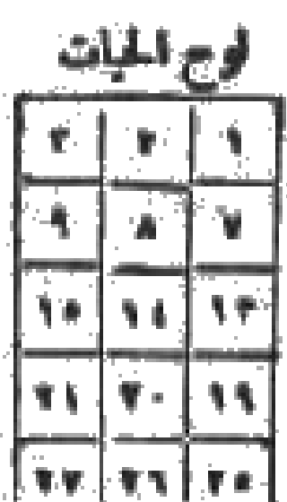

*Gambar Rajah Asli Halaman 11* — Papan wafaq "Ruh al-Hayat" (ruh kehidupan). Angka-angka pada kolomnya (dari kanan ke kiri, baris per baris): 1-2-3 / 7-8-9 / 13-14-15 / 19-20-21 / 25-26-27. **Cara baca menurut kitab:** sisa hitungan nama orang sakit (setelah digugurkan 30 seperti pada pasal di atas) dicocokkan dengan angka pada papan ini; bila masuk ke papan "ruh kehidupan" ini, orang sakit akan sembuh, hajat terkabul, dan yang bepergian pulang selamat.

**[Gambar Rajah Asli Halaman 11 — Wafaq/Rajah 2: لوح الميت (Papan Ruh Orang Mati)]**

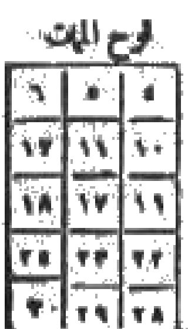

*Gambar Rajah Asli Halaman 11* — Papan wafaq "Ruh al-Mait" (ruh orang mati). Angka-angka pada kolomnya (dari kanan ke kiri, baris per baris): 4-5-6 / 10-11-12 / 16-17-18 / 22-23-24 / 28-29-30. **Cara baca menurut kitab:** bila sisa hitungan jatuh pada papan ini, orang sakit tidak kembali sembuh, hajat tidak tertunaikan, dan orang yang bepergian dikhawatirkan keselamatannya.

**[Gambar Rajah Asli Halaman 11 — Rajah 3: gambar buruj al-Haml (Aries)]**

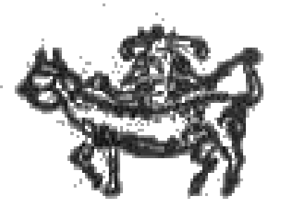

*Gambar Rajah Asli Halaman 11* — Gambar talisman buruj al-Haml (Aries/kijang pembawa angin). Keterangan asli di bawah gambar dalam kitab: "وهو برج الحمل والريح وهو نارى قال المكرم فيه نمراً" — *Inilah buruj Aries beserta anginnya, berelemen api; berkatal-Mukarram: padanya ada (kekuatan) macan tutul.*

**[Teks Arab Asli — lanjutan halaman 11: nadzam sifat pemilik buruj Aries]**

وصاحب الحمل نارى وان له * عند الملوك مقاما صادقا يجعل
مريخ كوكبه والشرف طالعه * والسعد يخدمه فى السهل والجبل
ذو صورة ظهرت من عظم همة * معارف نشأت من خالق الأول
قال أبو معشر: المولود بهذا البرج يكون رجلاً أحمر اللون طويل القامة

**[Transliterasi Latin Fonetik]**

*wa shaahibul-Hamali naariyyun wa in lahu * 'indal-muluuki maqaaman shaadiqan yaj'alu*
*Mirriikhu kawkabuhu wasy-syarafi thaali'uhu * was-sa'da yukhaddimuhu fis-sahli wal-jabali*
*dzuu shuurati zhaharat min 'azhmi hammatin * ma'aarifa nasysya'at min khaaliqil-awwalu*
*qaala Abuu Ma'syarin  al-mawluudu bi-haadzaal-burji yakuunu rajulan ahmarul-lawni thawiilul-qaamati*

**[Terjemahan Indonesia]**

Pemilik (buruj) Aries berelemen api, dan sesungguhnya ia * memiliki kedudukan yang benar di sisi para raja;
Mars adalah planetnya, dan "kemuliaan" (syaraf) adalah bintang terbitnya, * dan keberuntungan melayaninya di dataran maupun di gunung;
Ia berpenampilan yang tampak dari besarnya cita-cita, * keistimewaan-keistimewaan yang tumbuh dari Sang Pencipta yang Maha Awal.

Berkata Abu Ma'syar: orang yang dilahirkan di bawah buruj ini menjadi laki-laki berkulit kemerahan, bertubuh jangkung…

---

> **STATUS BATCH 1: SELESAI** (halaman cetak 3–11 / halaman PDF 1–5).
> Batch berikutnya (halaman PDF 6–10 dan seterusnya) akan dikerjakan pada lanjutan berikutnya sesuai aturan "per 5 halaman". Rajah/wafaq yang ditemukan pada batch ini telah di-crop presisi (hanya kotaknya, tanpa teks sekeliling), latar dibersihkan menjadi putih, resolusi 300 DPI, tersimpan di folder `rajah/`.

---

# BATCH 2 — HALAMAN PDF 6–10 (HALAMAN CETAK 12–21)

---

## HALAMAN CETAK 12 (Halaman PDF 6, sisi kanan)

**[Teks Arab Asli]**

كبير الرأس صعب المراس سريع الغضب قريب الرضا وطباعه؟ […] سريع الانتقال من مكان إلى مكان يقول الحق ويكره الباطل لا يعمل إلا برأيه ويكون استخلاؤه؟ بمشورته فيه بعض فساد، تارة يفتقر وتارة يستغنى، حاله؟ حسناً صبوراً على الأحوال. وله ثلاثة وجوه. ( الوجه الأول ) من نظر اليه زحل قال الحكيم: يكون […] وكان حالاً؟ صابراً على المصائب والأهوال، يحب الناس ويهوى محل الضحك والطرب، وليس له حظ فى عشرة الناس، والغريب خير له من قريب، وهو جليل القدر كثير الخيرات، حب؟ النساء، عاقل لبيب، فضل؟ جميل مع غير أهله، والناس معه على أقسام: فيهم من يحبه ومن يبغضه وهو لا يعرف الحب من البغض؛ يأتيه عسر ويسر وضيق وفرج وصحة وسقم، والزمان لا يدوم على حالة واحدة معه. قال الحكيم: يخاف عليه من وجع الرأس وخفقان القلب، وتزاول؟ تعتريه من رأسه إلى قدمه، ويتقى؟ ساعياً غالياً؟ عن الوجود، ومن وجع الرأس وبخذلان اليدين، فاذا نام قام مهدل الأذرع تقبل الجنة؟ وسبب ذلك أنه صب ماء فى حوض؟ خراب أو أوقد ناراً فى كانون ولم يستر، فقفل؟ على رأسه طارق من النهار فبيض؟ عليه وتقع فى وجهه فأورثه ذلك المرض. قال الحكيم: فاذا أردت الخلاص مما ذكر فاكتب له حجاب الأقسام وشفاء الأجسام وآية الشفاء، ويعلق عليه بعد البخور وهو عود وجاوى، بأنه يكون أماماً؟ لجميع المكونات، ويؤخذ له سفوف الأصول يستعمله سبعة أيام يبرأ باذن الله والله أعلم. ( الوجه الثانى ) من نظر اليه المشترى قال الحكيم: يتزوج من النساء […] ويخاف عليه من قبيل؟ وضرب اللسان وهرج كلام وحب؟ قلب؟ يتعب؟ زين؟ النساء، أو من قبل امرأة تكون قريبة منه أو شريكة له، يصيب بسببها تعبا شديدا، ويشتد عليه ذلك الأمر حتى يقع بينها وبينه الانفصال، وربما أنها تبقى له ما يقتضى الحقد؟ والبغض والبعد بعد القرب، تظهر له الغدارة لأنها أكبر أعدائه، وتنظر له بعين المكر والخداع وتريد له الخراب ولا تريد له العهد؟، وربما أنها تكذب؟ له بالأعمال الرديئة وتكلم الناس فى عرضه بالباطل وهو سليم

**[Transliterasi Latin Fonetik]**

*kabiirun ar-ra'si sha'bal-miraasi sarii'ul-ghadhabi qariibin ar-ridhaa wa thibaa'ihi ؟[…] sarii'ul-intiqaali min makaanin ilaa makaanin yaquulul-Haqqu wa yakrahul-baathilu laa ya'malu illaa bira'yihi wa yakuunu asatakhalaa'ah? bimasyuuratihi fiihi ba'dhu fa-saadin, taarah yaftaqiru wataarah yasataghan, haalahu? husnan shabuuran 'alaal-ahwaali  wa lahu tsalaatsatun wujuuhin. (al-wajhul-awwalu  min nazhara ilayhi Zuhala qaalal-hakiimu  yakuunu […] wakaan haalan? shaabiran 'alaal-mashaa'ibi wal-ahwaali, yuhibbun-naasi wa yuhwaa mahalludh-dhahiki wath-tharabi, walays lahu hazhzhun fii 'asyratan-naasi, wal-ghariiba khayrun lahu min qariibin, wa huwa jaliilul-qadri katsiirul-khayraati, hubbun? an-nisaa'i, 'aaqila labiiba, fadhlun? jamiila ma'a ghayri ahlihi, wan-naasi ma'ahu 'alaa aqsaamin  fiihum min yuhibbuhu wa min yubghidhuhu wa huwa laa ya'ruful-hubbu minal-bughdhi; ya'tiihi 'usrun wa yusrun wa dhayyiqun wa farajun wa shihhatun wa suqmun, waz-zamaana laa yudawwimu 'alaa haalatin waahidatun ma'ahu  qaalal-hakiimu  yukhaafu 'alayhi min waja'ir-ra'si wa khafaqaanil-qalbi, wa tuzaawilu? ta'tariihi min ra'sihi ilaa qadamihi, wa yuttaqaa? saa'iyan ghaaliyan? 'an al-wujuudi, wa min waja'ir-ra'si wa bikhidzlaanil-yadayni, fa-idzaa naamin qaam muhaddalil-adzru'i taqbalul-jannatu? wa sabbaba dzaalika annahu shabba maa'an fii hawdhin? kharaabun aw awaqadda naaraa fii kaanuunin walam yasturu, fa-quflun? 'alaa ra'sihi thaariqun minan-nahaari fa-buydhin? 'alayhi wa tuqqi'a fii wajhihi fa-awratsahu dzaalikal-maradhu  qaalal-hakiimu  fa-idzaa aradtul-khalaasha mimmaa dzakara fa-uktub lahu hijaabil-aqsaami wa syifaa'il-ajsaami wa aayatisy-syifaa'i, wa yu'alliqu 'alayhi ba'dal-bukhuuri wa huwa 'uudi wajaawaa, ba'annahu yakuunu amaamaa? li-jamii'il-mukawwinaati, wa yu'khadzu lahu safuufil-ushuuli yasta'miluhu sab'atun ayyaami yubarra'u bi-idzni Allaahi wallaahu a'lamu. (al-wajhuts-tsaanii  min nazhara ilayhil-Musytarii qaalal-hakiimu  yatazawwaju minan-nisaa'i […] wa yukhaafu 'alayhi min qabiilin? wa dharbal-lisaani wa haraji kilaamin wa hubbin? qalbun? yat'abu? zaynun? an-nisaa'i, aw min qabla imra'atun takuunu qariibati minhu aw syariikatun lahu, yushiibu bisababihaa ta'ibaa syadiidan, wa yasytaddu 'alayhi dzaalikal-amri hattaa yuq'i baynahaa wabaynahul-infishaala, wa rubbamaa annahaa tabqaa lahu maa yuqtadhaal-hiqdu? wal-bughdha wal-bu'da ba'dal-qurbi, tazhharu lahul-ghaddaarati la'annahaa akbara a'daa'ihi, wa tanazhzhurun lahu ba'ayn al-makri wal-khidaa'i wa turiidu lahul-kharaabi wa laa turiidu lahul-'ahdi ؟، wa rubbamaa annahaa takadzdzuba? lahu bil-a'maalir-radii'ati wa takallaman-naasi fii 'ardhihi bil-baathili wa huwa saliimin*) **[Terjemahan Indonesia]**

…(lanjutan sifat pemilik buruj Aries dari halaman sebelumnya): kepalanya besar, keras wataknya, cepat marah tetapi juga cepat ridha, tabiatnya […]; ia cepat berpindah dari satu tempat ke tempat lain; berkata benar dan membenci kebatilan; tidak bekerja kecuali dengan pendapatnya sendiri; dan dalam musyawarahnya ada sedikit kerusakan. Kadang ia miskin, kadang kaya; keadaannya […] baik, penyabar terhadap berbagai keadaan. Buruj ini mempunyai tiga wajah (wajh — sepertiga pembagian buruj).

(Wajah pertama) Bila yang memandangnya (mengaspeknya) adalah Saturnus (Zuhal), sang bijak berkata: ia menjadi […] dan berada dalam keadaan sabar menghadapi musibah dan kesusahan; ia mencintai manusia dan menyukai tempat tawa dan keceriaan; ia tidak beruntung dalam pergaulan dengan orang banyak; orang asing lebih baik baginya daripada kerabat; ia berbudi besar, banyak kebaikannya, mencintai wanita, berakal, cerdas, utama […], baik terhadap orang selain keluarganya. Manusia terhadapnya bergolongan-golongan: ada yang mencintainya dan ada yang membencinya, sedangkan ia sendiri tidak bisa membedakan cinta dari benci. Datang kepadanya kesukaran dan kemudahan, kesempitan dan kelapangan, kesehatan dan penyakit; dan masa tidak kekal baginya dalam satu keadaan. Sang bijak berkata: ia patut khawatir terhadap sakit kepala dan berdebar-debar jantung, serta penyakit yang menyerangnya dari kepala sampai kaki; […] dan kelemahan kedua tangan; bila tidur ia bangun dengan lengan terkulai […]. Sebab hal itu ialah bahwa ia pernah menuang air ke tempat/ruang yang rusak, atau menyalakan api di perapian (kanun) lalu tidak menutupnya, maka "pengetuk" siang hari menutup kepalanya lalu […] menimpanya dan mengenai wajahnya, sehingga penyakit itulah yang diwariskannya. Sang bijak berkata: bila engkau menginginkan keselamatan dari apa yang disebutkan, tuliskanlah baginya hijab (azimat) al-Aqsam (sumpah-sumpah) dan "Syifa' al-Ajsam" (penyembuhan tubuh-tubuh) serta ayat syifa' (ayat penyembuhan), dan digantungkan padanya setelah dibungkusi dengan dupa kayuan — yaitu gaharu (oud) dan jawi (kemenyan) — karena hal itu menjadi imam? bagi seluruh unsur; dan ambillah untuknya serbuk akar-akaran (safuf al-ushul) yang ia pakai selama tujuh hari, niscaya ia sembuh dengan izin Allah. Wallahu a'lam.

(Wajah kedua) Bila yang memandangnya adalah Yupiter (al-Musytari), sang bijak berkata: ia menikahi wanita […] dan ia patut khawatir terhadap […] pukulan lisan (caci maki), keributan kata-kata, dan cinta […] yang melelahkan […] wanita, atau dari pihak wanita yang masih kerabatnya atau sekutunya; karena wanita itu ia tertimpa kesusahan yang berat, dan perkara itu semakin berat baginya hingga terjadi perpisahan antara keduanya; dan boleh jadi wanita itu menyisakan baginya apa yang menuntut kedengkian dan kebencian serta jauh setelah dekat; pengkhianatan tampak baginya dari wanita itu, karena wanita itu adalah musuh terbesarnya, memandangnya dengan mata tipu daya dan khianat, menginginkan kehancurannya dan tidak menginginkan perjanjiannya […]; dan boleh jadi wanita itu mendustakannya? dengan perbuatan-perbuatan buruk dan membicarakan kehormatannya dengan batil padahal ia bersih…

---

## HALAMAN CETAK 13 (Halaman PDF 6, sisi kiri)

**[Teks Arab Asli]**

الأقسام والبخور يجرى؟ وبيعة؟ سالمة ويأمن؟ عليه، ويكتب له بعد ذلك أسماء التراصيل؟ وأسماء القصور؟ النورانية والآيات الروحانية ويعلق على رأسه فانه تستعد؟ عليه الألسن ويبلغ ما يريد باذن الله الحميد والله أعلم. ( الوجه الثالث ) من نظر اليه المريخ قال الحكيم: يخاف عليه من الانتقال من مكان إلى مكان، وربما يخرج من يده شىء يندم عليه، وهيهات أن يتمتع؟ القدم؟ على ما فات، ولا بد من حصول اشتغال باله وتعب قلبه بسبب انسان حبيب عنه أو بمرض أو سفر أو خروج شىء من يده يشتغل به، ولكن العواقب سليمة والاجتماع حاصل والحبيب مواصل، ويرى فيه محبة ومودة الناس — ومن القلب للقلب رسول — وتقع فرقة يكثر فيها الفتن، ومن كان حبيبا ينقلب عدوا، فلا تبح بسرك إلى الناس لأن فيهم الحبيب والعدو. ومع هذا يخاف عليه من ملوك الجان، فاذا أراد الانسان؟ يكاتب؟ له حزب الأنوار وحزب برأ؟ باذن الله تعالى. ( بيت […] ) بيت حياته؟ […] الحمل […] والمريخ طالعه، وتكون حياته طيبة وعيشه جيدة وأموره مرضية وعواقبه سليمة وأحواله مستقيمة ولا يموت الا بعد توبة […] والله أعلم. ( بيت الاحياء؟ ) بيت ماله وكتبه برجه النور؟ وطالعه الزهرة، قال الحكيم يكتب بالاحلال؟ ويستشفى به طول عمره؟ […]. ( بيت الراية؟ ) بيت الاهل والاخوان والأصحاب والفرح، وجهه الجوزاء وطالعه عطارد، قال الحكيم: يكون عند اخوانه وأصحابه محبوبا عندهم، يرى ما يسره منهم والله أعلم. ( بيت البياض؟ ) بيت آبائه وأجداده، برجه السرطان وطالعه القمر، قال الحكيم: يكون بارا بوالديه محبوبا عندهم. ( بيت النساء؟ ) بيت نسائه وأفراحه وسعده؟ يرزق من البنين والبنات ما يسر؟ ويرى؟ […] منهم، وينال منه التعب والشقاء، ويسر بمولد يقرأ كتاب الله فيرحم به دنيا وأخرى. ( بيت الغيبة الخارجة ) بيت اسقامه واعتلاله، من البروج السنبلة ومن الطوالع عطارد، قال الحكيم: يعتريه فى بعض الأزمان علل ومرض وأكثره من رياح الخفقان والصداع، قال الحكيم: يكتب له حزب الاندرون؟ […] يبرأ باذن الله والله أعلم. ( بيت الحمرة ) بيت قرائنه وأزواجه…

**[Transliterasi Latin Fonetik]**

*al-aqsaamu wal-bukhuuru yujraa? wa bay'atan? saalimatan wa ya'ammanna? 'alayhi, wa yaktubu lahu ba'da dzaalika asmaa'it-taraashiil? wa asmaa'al-qushuuri? an-nuuraaniyyata wal-aayaatir-ruuhaaniyyati wa yu'alliqu 'alaa ra'sihi fa-innahu tasta'iddu? 'alayhil-alsana wa yablughu maa yuriidu bi-idzni Allaahil-hamiidi wallaahu a'lamu. (al-wajhuts-tsaalitsu  min nazhara ilayhil-Mirriikhi qaalal-hakiimu  yukhaafu 'alayhi minal-intiqaali min makaanin ilaa makaanin, wa rubbamaa yukhriju min yadihi syay'in yandamu 'alayhi, wa hayhaatan an yatamatta'u? al-qadama? 'alaa maa fa-ata, wa laa badda min hushuuli isytighaali bil-hi wa ta'abi qalbihi bisababi anasaan habiibun 'anhu aw bimaradhin aw safarun aw khuruuju syay'in min yadihi yasytaghilu bihi, walakinn al-'awaaqibi saliimatan wal-ijtimaa'a haashilun wal-habiibu muwaashilun, wa yaraa fiihi muhibbati wa mawaddatin-naasi  wa minal-qalbi lil-qalba rasuula  wa tuq'i farqatun yaktsuru fiihaal-fitana, wa min kaana habiiban yanqalibu 'aduwwaa, fa-laa tubih bisirkin ilan-naasi la'ann fiihum al-habiiba wal-'aduwwa  wa ma'a haadzaa yukhaafu 'alayhi min muluukil-jaanni, fa-idzaa araadal-insaana? yukaatibu? lahu hizbil-anwaari wa hizbi barra'a? bi-idzni Allaahi Ta'aalaa. (baytu […]) baytu hayaatihi ؟[…] al-Hamali […] wal-Mirriikhi thaali'uhu, wa takuunu hayaatihi thayyibatun wa 'aysyuhu jayyidatun wa umuuruhu mardhayatu wa 'awaaqibuhu saliimatan wa ahwaalahu mustaqiimatan wa laa yamuutu illaa ba'da tawbatin […] wallaahu a'lamu. (baytul-ahiiaa' ؟) baytu maalihi wa kutubihi burjuhun-nuura? wa thaali'uhuz-Zuharati, qaalal-hakiimu yaktubu bil-ahalaal? wiisatasyafaa bihi thuuli 'umruhu ؟[…]. (baytur-raayati ؟) baytul-ahal waalaakhuuaan wal-ashhaaba wal-faraha, wajjahahul-Jawzaa'i wa thaali'uhu 'Uthaarida, qaalal-hakiimu  yakuunu 'inda akhuuaanah wa ashhaabahu mahbuuban 'indahum, yaraa maa yusrihi minhum wallaahu a'lamu. (baytul-bayaadhi ؟) baytu aabaa'ihi wa'ajadaadah, burjuhus-Sarathaani wa thaali'uhul-Qamari, qaalal-hakiimu  yakuunu baarran biwaalidiihu mahbuuban 'indahum. (baytun-nisaa'i ؟) baytu nisaa'ihi wa afraahihi wa sa'adahu? yurzaqu minal-bunnayni wal-bunnaati maa yusrun? wa yaraa ؟[…] minhum, wa yanaalu minhut-ta'aba wasy-syaqaa'a, wa yusrun bimawlidin yaqra'u kitaaba Allaahi fa-yarhamu bihi dunyaa wa ukhraa. (baytul-ghaybatil-khaarijati  baytu asaqaamah wa i'tilaalahu, minal-buruujis-Sunbulati wa minath-thawaali'i 'Uthaarida, qaalal-hakiimu  ya'tariihi fii ba'dhul-azmaani 'allala wa marradha wa'aktsarahu min riyaahun al-khafaqaani wash-shudaa'i, qaalal-hakiimu  yaktubu lahu hizbil-anadaruun ؟[…] yubarra'u bi-idzni Allaahi wallaahu a'lamu. (baytul-humrati  baytu qaraa'inihi wa azwaajihi …*) **[Terjemahan Indonesia]**

…aszim-sumpah dan dupa itu berjalan? […] dengan jual-beli? yang selamat dan ia aman […]; kemudian tuliskan baginya setelah itu nama-nama perincian? dan nama-nama istana? cahaya (nuraniyah) serta ayat-ayat ruhaniyah, dan gantungkan pada kepalanya, maka tunduklah kepadanya lisan-lisan dan ia mencapai apa yang ia kehendaki dengan izin Allah Yang Maha Terpuji. Wallahu a'lam.

(Wajah ketiga) Bila yang memandangnya adalah Mars (al-Mirrikh), sang bijak berkata: ia patut khawatir terhadap perpindahan dari satu tempat ke tempat lain; boleh jadi keluar dari tangannya sesuatu yang ia sesali; dan mustahil menikmati kembali apa yang telah luput; tak terhindarkan ia mengalami kesibukan pikiran dan kelelahan hati karena orang yang dikasihinya berjauhan darinya, atau karena penyakit, atau perjalanan, atau keluarnya sesuatu dari tangannya yang menyibukkannya; tetapi kesudahan-kesudahannya selamat, pertemuan tercapai, dan kekasih tetap berhubungan; ia melihat cinta dan kasih manusia — "dari hati ke hati ada utusan" — ; dan terjadi perpisahan yang banyak fitnah padanya, dan yang tadinya kekasih berbalik menjadi musuh; maka janganlah engkau membukakan rahasiamu kepada manusia, karena di antara mereka ada kekasih dan ada musuh. Bersama itu, ia patut khawatir terhadap raja-raja jin; maka bila orang itu menghendaki, tuliskan baginya hizb (wirid/azimat) al-Anwar dan hizb […] dengan izin Allah Ta'ala.

(Rumah […]) rumah kehidupannya […] Aries […] dan Mars adalah thali'-nya; maka kehidupannya baik, penghidapannya menyenangkan, urusan-urusannya memuaskan, kesudahan-kesudahannya selamat, keadaan-keadaannya lurus, dan ia tidak meninggal kecuali setelah bertobat […]. Wallahu a'lam.

(Rumah al-Ahya'?/kehidupan) rumah harta dan kitab-kitabnya; burujnya […] dan thali'-nya Venus; sang bijak berkata: dituliskan dengan al-Ahlal? dan dimintakan kesembuhan dengannya sepanjang umurnya? […]. (Rumah bendera?) rumah keluarga, saudara-saudara, sahabat-sahabat, dan kegembiraan; wajahnya Gemini dan thali'-nya Merkurius; sang bijak berkata: ia dicintai di antara saudara-saudara dan sahabat-sahabatnya, dan ia melihat dari mereka apa yang menyenangkan hatinya. Wallahu a'lam. (Rumah keputihan?) rumah bapak-bapak dan kakek-kakeknya; burujnya Cancer dan thali'-nya Bulan; sang bijak berkata: ia berbakti kepada kedua orang tuanya dan dicintai keduanya. (Rumah wanita) rumah istri-istrinya, kegembiraan-kegembiraannya, dan kebahagiaannya?; ia dikaruniai anak laki-laki dan perempuan yang menyenangkan?; […] dan ia mendapat dari mereka kelelahan dan kesusahan, tetapi ia berbahagia dengan anak yang membaca Kitab Allah sehingga ia dirahmati karenanya di dunia dan akhirat. (Rumah gaibah luar/kealpaan lahir) rumah penyakit-penyakit dan kelemahannya; dari buruj-buruj ialah Virgo (as-Sunbulah) dan dari thali'-thali' ialah Merkurius; sang bijak berkata: pada sebagian masa ia diserang cacat dan penyakit, kebanyakan berupa angin berdebar dan sakit kepala; sang bijak berkata: dituliskan baginya hizb al-Andurun? […] niscaya sembuh dengan izin Allah. Wallahu a'lam. (Rumah kemerahan) rumah teman-teman dekat dan istri-istrinya…

---

## HALAMAN CETAK 14 (Halaman PDF 7, sisi kanan)

**[Teks Arab Asli]**

وماله من النساء. قال الحكيم: يتزوج من النساء […] يطلق ويرد؟ وربما لا يوافقه البعض ولا يمكث معه إلا القليل، يتنكح؟ نساء كثيرة فى المحرم؟ وهو محبوب معصوم؟. ( بيت الانكيس ) بيت خوفه وموته، العقرب برجه والمريخ طالعه، قال الحكيم: يخاف عليه من سنة يكون طالعتها؟ بهما يحصل له تهمة أو نكبة فى ماله أو شىء يضيع منه، وربما وقع من مكان عال يمرض به حتى يشرف على الهلاك وينجو من ذلك والله أعلم. ( بيت النصرة الخارجية ) بيت أسفاره وأحلامه، برجه الجدى وطالعه زحل، يسافر سفرا طويلا ويكون سفره الى جهة المشرق ويرى منه خيرا كثيرا، وسفر البر خير له من سفر البحر، وينال الحج الى بيت الله الحرام ويزور قبر النبى عليه الصلاة والسلام والله أعلم. ( بيت العزة؟ ) بيت عزه وسلطانه، له من البروج القوس والطالع المشترى، يكون معزوزا مكرما عند الامراء والاكابر وأرباب المناصب والاقلام، مرزوقا حينا؟ توجه والله أعلم. ( بيت الاجتماع ) بيت أصدقائه وأحبائه وأصحابه، برجه الجوزاء وطالعه القمر، يكون كثير الاصدقاء والاخلان من الرجال ويسر منهم بما يسرهم […] ما يفرحه والله أعلم. ( بيت النصرة الداخلة ) بيت رجاله وآماله من قومه، لا ينال منهم فائدة وهم أشد أعدائه، والله ينتصره عليهم. ( بيت الطريق ) بيت أعدائه وحساده، برجه الحوت والمشترى، يدل على أنه يكون أبيض اللون، لا بد له أن ينتقل من مكان الى مكان، ودليل السؤال عن حب؟ […] محبوبه وما أتى ذلك ويريد رجوعه اليه. ( بيت القبض الخارج ) بيت مقصوده، برجه الثور والزهرة، يدل على أنه يصيب ماله ويظفر؟ أول دهره ويخلفه الله عليه. ( بيت الجماعة ) برجه الدلو؟ وطالعه زحل، يوافقه السفر وينال منه حظا وفوائد من انسان. ( بيت القبض الداخل ) بيت آبائه وعواقبه؟ يدل على أنه تكون عاقبته مباركة، يحتاج اليه أهل بيته ويرث مالا عن ابويه والله أعلم. ( قال الحكيم ) صاحب هذا البرج يوافقه من النساء من كان طالعها الحمل والمريخ، ويحذر ممن كان طالعها السرطان والقمر؛ ويوافقه اذا نظر الهلال أن ينظر الى وجه ذكر؛ واذا أراد النوم ينام على جنبه الأيمن

**[Transliterasi Latin Fonetik]**

*wa maalihi minan-nisaa'i  qaalal-hakiimu  yatazawwaju minan-nisaa'i […] yuthliqu wa yaruddu? wa rubbamaa laa yuwaafiquhul-ba'dhu wa laa yumkitsu ma'ahu illaal-qaliili, yatanakah? nisaa'a katsiiratun fil-muharrami? wa huwa mahbuubun ma'shuumi ؟. (baytul-anakiis  baytu khawfihi wa mawtihi, al-'Aqrabi burjuhu wal-Mirriikhi thaali'uhu, qaalal-hakiimu  yukhaafu 'alayhi min sanatin yakuunu thaali'atuhaa? bihimaa yuhashshilu lahu tuhmatin aw nakbatun fii maalihi aw syay'in yadhii'u minhu, wa rubbamaa wa q'in min makaani 'aalin yumridhu bihi hattaa yusyrifu 'alaal-hullaaki wa yanjuu min dzaalika wallaahu a'lamu. (baytun-nashratil-khaarijiyyati  baytu asfaarihi wa ahlaamihi, burjuhul-Jadyi wa thaali'uhu Zuhala, yusaafiru safaraa thawiilaa wa yakuunu safarihi ilaa jihatil-masyriqi wa yaraa minhu khayran katsiiran, wa safaral-barri khayrun lahu min safaril-bahri, wa yanaalul-hajju ilaa baytu Allaahil-Haraami wa yazuuru qabran-Nabiyyi 'alayhish-shalaatu was-sullaamu wallaahu a'lamu. (baytul-'izzati ؟) baytu 'izzihi wa sulthaanihi, lahu minal-buruujil-Qawsi wath-thaali'ul-Musytarii, yakuunu ma'azuuzaa mukarramaa 'indal-amaraa' waalaakaabar wa arbaabal-manaashibi waalaaqalaam, marzuuqaa hayyinaa? tawajjuhun wallaahu a'lamu. (baytul-ijtimaa'i  baytu ashdiqaa'ihi wa ahibbaa'ihi wa ashhaabihi, burjuhul-Jawzaa'i wa thaali'uhul-Qamari, yakuunu katsiirul-ashadaqaa' waalaakhalaan minar-rijaali wa yusrun minhum bimaa yusrihim […] maa yufrihuhu wallaahu a'lamu. (baytun-nashratid-daakhilati  baytu rujjaalihi wa aamaalihi min qawmihi, laa yanaalu minhum fa-a'idatan wa hum asyaddi a'daa'ihi, wallaahu yanatasharah 'alayhim. (baytuth-thariiqi  baytu a'daa'ihi wa hussaadihi, burjuhul-Huuti wal-Musytarii, yadullu 'alaa annahu yakuunu abyadhul-lawni, laa badda lahu an yantaqilu min makaani ilaa makaanun, wa daliilun as-su'aali 'an hubbi ؟[…] mahbuubahu wa maa ataa dzaalika wa yuriidu rujuu'ahu ilayhi. (baytul-qabdhil-khaariji  baytu maqshuudihi, burjuhuts-Tsawri waz-Zuharati, yadullu 'alaa annahu yushiibu maalihi wa yazhfaru? awwalu dahrihi wa yukhallifuhu Allaahi 'alayhi. (baytul-jamaa'ati  burjuhud-Dalwi? wa thaali'uhu Zuhala, yuwaafiquhus-safaru wa yanaalu minhu hazhzhan wa fawaa'ida min anasaan. (baytul-qabdhid-daakhili  baytu aabaa'ihi wa 'awaaqibihi? yadullu 'alaa annahu takuunu 'aaqibatihi mubaarakatun, yahtaaju ilayhi ahli baytuhu wa yaritsu maalan 'an abuuyah wallaahu a'lamu. (qaalal-hakiimu  shaahibu haadzaal-burji yuwaafiquhu minan-nisaa'i min kaana thaali'uhaal-Hamali wal-Mirriikhi, wa yuhadzdziru mimman kaana thaali'uhaa as-Sarathaani wal-Qamari; wa yuwaafiquhu idzaa nazharal-halaali an yanzhuru ilaa wajhi dzakara; wa idzaa araadan-nawma yunaamu 'alaa janbihil-aymani*) **[Terjemahan Indonesia]**

…dan bagiannya dari wanita. Sang bijak berkata: ia menikahi wanita-wanita […]; menceraikan dan rujuk?; boleh jadi sebagian istri tidak cocok dengannya dan tidak tinggal bersamanya kecuali sebentar; ia menikahi? banyak wanita dalam (bulan) haram?; dan ia dicintai lagi terpelihara?.

(Rumah al-Ankis) rumah ketakutan dan kematiannya; burujnya Scorpio dan thali'-nya Mars. Sang bijak berkata: ia patut khawatir terhadap suatu tahun yang thali' keduanya? mendatangkan tuduhan atau musibah pada hartanya atau hilangnya sesuatu miliknya; dan boleh jadi ia jatuh dari tempat tinggi lalu sakit karenanya hingga hampir binasa, kemudian selamat dari itu. Wallahu a'lam.

(Rumah pertolongan luar) rumah perjalanan-perjalanan dan mimpi-mimpinya; burujnya Capricorn dan thali'-nya Saturnus; ia bepergian jauh dan perjalanannya ke arah timur, dan ia melihat kebaikan yang banyak darinya; perjalanan darat lebih baik baginya daripada perjalanan laut; dan ia mencapai haji ke Baitullah al-Haram serta menziarahi makam Nabi. Wallahu a'lam.

(Rumah kemuliaan) rumah kewibawaan dan kekuasaannya; baginya dari buruj-buruj ialah Sagittarius dan thali'nya Yupiter; ia menjadi perkasa dan dimuliakan di sisi para pangeran, pembesar, dan pemilik jabatan serta pena; diberi rezeki […] Wallahu a'lam.

(Rumah perkumpulan) rumah kawan-kawan, kekasih-kekasih, dan sahabat-sahabatnya; burujnya Gemini dan thali'-nya Bulan; ia banyak mempunyai teman dan sahabat karib dari kalangan laki-laki dan merasa senang dari mereka dengan apa yang menyenangkan mereka […] apa yang menggembirakannya. Wallahu a'lam.

(Rumah pertolongan dalam) rumah orang-orang dan harapan-harapannya dari kaumnya; ia tidak memperoleh faedah dari mereka padahal mereka adalah musuh-musuh yang paling keras baginya, namun Allah memenangkannya atas mereka.

(Rumah jalan) rumah musuh-musuh dan para pendengki; burujnya Pisces bersama Yupiter; menunjukkan bahwa ia berkulit putih; ia harus berpindah dari satu tempat ke tempat lain; dan dalil pertanyaan tentang cinta? […] kekasihnya, dan bahwa hal itu datang dan ia ingin kembali kepadanya.

(Rumah genggaman luar) rumah tujuannya; burujnya Taurus dan Venus; menunjukkan bahwa ia memperoleh hartanya dan beruntung? di awal umurnya, dan Allah menyisakannya baginya.

(Rumah jamaah) burujnya Aquarius? dan thali'-nya Saturnus; perjalanan cocok baginya dan ia memperoleh darinya keberuntungan serta faedah dari seseorang.

(Rumah genggaman dalam) rumah bapak-bapaknya dan kesudahan-kesudahannya?; menunjukkan bahwa kesudahannya diberkahi, keluarganya membutuhkannya, dan ia mewarisi harta dari kedua orang tuanya. Wallahu a'lam.

(Sang bijak berkata) Pemilik buruj ini cocok, di antara wanita, dengan wanita yang thali'-nya Aries dan Mars, dan hendaknya ia berhati-hati terhadap wanita yang thali'-nya Cancer dan Bulan; dan cocok baginya, apabila melihat hilal, memandang wajah laki-laki; dan apabila hendak tidur, hendaklah ia tidur di atas lambung kanannya…

---

## HALAMAN CETAK 15 (Halaman PDF 7, sisi kiri)

**[Teks Arab Asli]**

ويجعل رأسه الى المغرب فانه يأتى من حوائم؟ الارض ومن سائر مؤناتها؛ ويوافقه من الطعام الحار الرطب، ومن الأدهان دهن اللوز، ومن الرياحين الورد، ومن البقول الخس؟، ومن الطيور الحمام، ومن المعادن الحديد، ومن الملوك الملك الاحمر، ومن الساعات ساعة المريخ، ومن الفصول فصل الربيع، ومن الشهور الرومية نيسان، ومن الشهور القبطية برموده؛ وهو من شرف الشمس وهبوط زحل ووبال الزهرة؛ وقوله؟ من الحجب والحجا؟ كل؟ دعاء الحصن الحصين والدرع المتين وهذا الخاتم والخواتم والصلاة على النبى صلى الله عليه وسلم؛ ومن أشكال الرمل الجودة والاحسان. قال الله تعالى: وأما الذين سعدوا ففى الجنة خالدين فيها ما دامت السموات والارض. فأبشر أيها السائل […] يرزقك ظافر؟ وطالع سعيد […] كل نحس؟ […] وملاك الضد والحسود. وقد أتاك من الاشكال المطولة؟ وهو حرف؟ سنة مقبلة لها من الكواكب الزهرة. ( بيت النفس ) دل على راحة قلب السائل وطيب نفسه و […] وزيارة فرحه واجتماعه بمقصوده وزوال همه وغمه؛ فأبشر بالظفر والفرج والخروج من الشدائد الى الفرج ومن العسر الى اليسر والاجتماع بمن رجا وصاله؛ وان سألت عن غائب فانه عن قريب يقدم عليك وتفرح به؛ وان سألت عن حركة […] فاعلم […] ولا تتأخر؛ وان سألت عن السفر فانه صالح، والبيع والشرا؟ رابح، واحسانك واصل، و […] حاصل، والغائب يرجع سالما؛ ولا بد لك من قبض؟ داخل الى يدك […] أو مالا أو ضائعا أو آبقا أو يدخل عليك منصب […]. قال الشاعر:

أتتك حادثة لا تخف * قد نلت عزا وانماك الشرف
انهض الى ما قد سألت عنه وبادر ولا تخف

( القول على الأحيان ) قال الله تعالى: سلام عليكم طبتم فادخلوها خالدين. أبشر أيها

**[Transliterasi Latin Fonetik]**

*wa yaj'alu ra'sahu ilal-maghriba fa-innahu ya'ataa min huuaa'am? al-aradha wa min saa'iri mu'naatuhaa; wa yuwaafiquhu minath-tha'aamil-haarrir-rathba, wa minal-adhaani duhnal-lawzi, wa minar-rayaahiinil-warda, wa minal-buquulil-khassa ؟، wa minath-thuyuuril-hamaama, wa minal-ma'aadinil-hadiida, wa minal-muluukil-malikil-ahmaru, wa minas-saa'aati saa'atal-Mirriikhi, wa minal-fushuuli fashlun ar-rabii'i, wa minasy-syahuur ar-ruumiyyata naysaana, wa minasy-syahuur al-qibthiyyata barmuudah; wa huwa min syarafisy-Syamsi wa hubuuthi Zuhala wa wabaaliz-Zuharati; wa qawwalahu? minal-hujubi wal-hijaa? kullu? du'aa'al-hishnil-hashiini wad-dar'il-matiini wa haadzaal-khaatamu wal-khawaatimi wash-shalaati 'alaa an-Nabiyyi shallaa Allaahi 'alayhi wa sallama; wa min asykaalir-ramlil-jawdata waalaahasaan  qaala Allaahi Ta'aalaa  wa ammaa adz-dziin sa'iduuaa fa-fil-jannata khaalidiina fiihaa maa daamat as-sumuwwaatu waalaaradh  fa-ubasysyiru ayyuhas-saa'ilu […] yarzuquka zhaafirun? wa thaali'a sa'iida […] kullu nahsi ؟[…] wa mallaakadh-dhiddu wal-hasuudu  wa qad ataaka minal-asyakaal al-muthawwalata? wa huwa harfin? sanatin muqabbilatin lahaa minal-kawaakibiz-Zuharati. (baytun-nafsi  dalla 'alaa raahati qalbis-saa'ilu wa thiibi nafsihi w […] wa ziyaarati fa-rahihi wa ijtimaa'ihi bimaqshuudihi wa zawaali hammihi wa ghammihi; fa-ubasysyiru bizh-zhafari wal-farji wal-khuruuji minasy-syadaa'idi ilal-farji wa minal-'usri ilal-yusra wal-ijtimaa'a baman rajaa wishaalihi; wa in sa'alat 'an ghaa'ibin fa-innahu 'an qariibin yaqdamu 'aliyyuka wa tafrahu bihi; wa in sa'alat 'an harakati […] fa-i'lam […] wa laa tata'akhkharu; wa in sa'alat 'an as-safari fa-innahu shaaliha, wal-bay'a wasy-syiraa? raabihun, waahasaanak wa ashilun, w […] haashilun, wal-ghaa'iba yarji'u saalimaa; wa laa badda lak min qabdhin? daakhila ilaa yadaka […] aw maalan aw dhaa'i'an aw aabiqan aw yadkhulu 'alayka manshiba […]. qaalasy-syaa'iru:*) *atatka haaditsatun laa takhaffin * qad nultu 'izzan waanamaak asy-syarafa*
*inhadh ilaa maa qad sa'alat 'anhu wa baadirun wa laa takhaffin*

*(al-qawli 'alaal-ahiiaan  qaala Allaahi Ta'aalaa  sullaamun 'alaykum thibtum fa-udkhuluuhaa khaalidiina  abasysyara ayyuhal-*) **[Terjemahan Indonesia]**

…dan hendaknya ia meletakkan kepalanya ke arah barat, karena hal itu datang dari sekeliling? bumi dan dari seluruh perbekalannya. Yang cocok baginya: dari makanan ialah yang panas-lembap; dari minyak-minyakan ialah minyak almond; dari bunga-bungaan ialah mawar; dari sayur-mayur ialah selada?; dari burung-burungan ialah merpati; dari barang tambang ialah besi; dari raja-raja ialah raja merah; dari jam-jam ialah jam Mars; dari musim-musim ialah musim semi; dari bulan-bulan Romawi ialah Nisan; dan dari bulan-bulan Qibti ialah Baramudah. Buruj ini berkaitan dengan kemuliaan (syaraf) Matahari, penurunan (hubuth) Saturnus, dan kelemahan (wabal) Venus. Dan ucapannya? dari hijab-hijab dan perlindungan? […] doal-Hishn al-Hashin (benteng yang kokoh) dan ad-Dir' al-Matin (perisai yang kuat), serta khatam (cincin meterai) ini dan khatam-khatam, dan shalawat kepada Nabi. Dan dari bentuk-bentuk raml (geomansi) ialah al-Jaudah dan al-Ihsan. Allah Ta'ala berfirman: "*Adapun orang-orang yang berbahagia, maka (tempatnya) di dalam surga, mereka kekal di dalamnya selama ada langit dan bumi*" (QS. Hud: 108). Maka bergembiralah wahai penanya […] diberikan kepadamu yang menang? dan thali' yang bahagia […] setiap kesialan? […] serta penguasa kebalikan dan pendengki. Telah datang kepadamu dari bentuk-bentuk […] dan ia adalah huruf? tahun yang akan datang baginya dari planet-planet ialah Venus.

(Rumah jiwa) menunjukkan kenyaman hati penanya, kebaikan jiwanya, […], kunjungan kegembiraannya, pertemuannya dengan maksudnya, dan hilangnya kesedihan serta duka citanya. Maka terimalah kabar gembira berupa kemenangan, kelapangan, dan keluarnya dari kesulitan menuju kelapangan, dari kesukaran menuju kemudahan, serta pertemuan dengan orang yang ia harapkan sambungannya. Bila engkau bertanya tentang orang yang gaib (bepergian), maka tidak lama lagi ia akan datang kepadamu dan engkau bersukacita karenanya; bila engkau bertanya tentang gerakan […], maka ketahuilah […] dan tidak tertunda; bila engkau bertanya tentang perjalanan, maka ia baik; jual-beli? menguntungkan; kebaikanmu sampai; […] tercapai; dan orang yang gaib kembali dengan selamat; dan tak terhindar bagimu genggaman? yang masuk ke tanganmu […] atau harta, atau barang hilang, atau hamba yang lari, atau jabatan masuk atasmu […]. Sang penyair berkata:

*"Suatu kejadian datang kepadamu — jangan takut * sungguh engkau telah memperoleh kemuliaan dan kebangsawananmu tumbuh. Bangkitlah kepada apa yang engkau tanyakan, dan bersegeralah — jangan takut."*

(Perkataan tentang al-Ahyan?) Allah Ta'ala berfirman: "*Salamun 'alaikum (sejahtera bagimu), kamu telah baik, maka masukilah surga ini dengan kekal*." Bergembiralah, wahai…

**[Gambar Rajah Asli Halaman 15 — Wafaq Huruf (khatam huruf)]**

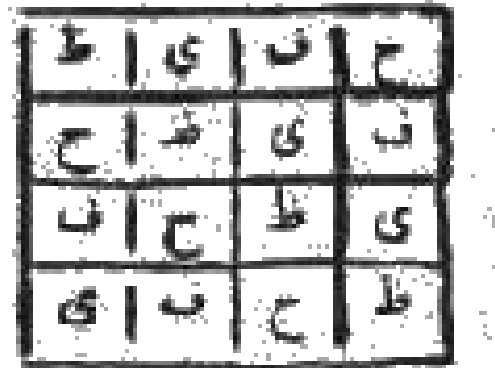

*Gambar Rajah Asli Halaman 15* — Wafaq berupa tabel 4×4 berisi huruf-huruf yang berputar: ح (ha), ف (fa), ي (ya), ط (tha), tersusun bergiliran pada tiap barisnya (baris 1: ح ف ي ط; baris 2: ف ي ط ح; baris 3: ي ط ح ف; baris 4: ط ح ف ي). **Keterangan cara baca menurut kitab:** wafaq huruf ini merupakan "khatam" (meterai) yang disebut pada teks halaman ini — bagian dari amalan/rajah bagi pemilik buruj Aries agar selamat dan dikabulkan hajatnya; huruf-hurufnya adalah sandi ruhani yang tidak dialihkan menjadi teks, dan dipakai bersama doa "al-Hishn al-Hashin" serta shalawat yang disebut sebelumnya.

---

## HALAMAN CETAK 16 (Halaman PDF 8, sisi kanan)

**[Teks Arab Asli]**

السائل […] بحيث طيبة وأمور مرضية ورزق يتجدد […] فى ساعة من ساعات الاقدار، لأنه قد أتاك من الاشكال الأحياء؟ من الكواكب المشترى وهو بيت سعيد يدل على فرح السائل وصلاح حاله وظفره بغض؟ […] يسعده وزيارة أفراحه وزوال همه وغمه واتشراح صدره وكثرة رزقه وينال المطلوب ويبلغ ما يسر القلب؛ واذا سألت عن غائب فانه يقدم […] أو يسافر فانه يكون صالحا؛ أو زواج فانه يكون ناجحا؛ وهذه الحركة تنجح؛ والتفسير الذى؟ […] عليه أو أتت طالعه […] وعافيته جيدة؛ ولا بد لك من ولد مبارك وترى الخير على يديه؛ والشركة مفيدة وأمورك سعيدة؛ وتنال الحج الى بيت الله الحرام والاجتماع بمن تحب وصاله؛ والمريض يشفى؛ فأبشر بما قلت فما عليك من بأس. واسمع قول الشاعر:

أتلك أحيان بالسعادة أخبر * فبادر الى الامر الذى أنت مضمر
لان لسان الحال فى الحال مخبر * اذا أردت أمرا لا تكن فيه مقصر

( القول على البرج الثانى وهو برج الثور والزهرة ترابى وفيه شعر )

وصاحب الثور ما أحمل شائله؟ * فى العالمين وما أبداه من رجل
مصاحب للمعانى عند منطقة؟ * بحسنه وطيب القد والقفل؟
ونجمه؟ الزهرة الزهراء مشرفة * بالسعد طالعه فى أفخر الملل؟
له نصيب من الغزلان متصل * على الدوام وسعد غير منفصل

قال الحكيم: هو برج نهران؟ ترابى داخل، وهو بيت الزهرة وشرف القمر فى ثلاث درج منه، ووباله المريخ، وليس فيه هبوط لشىء من الكواكب. المولود بهذا النجم يكون كبير الهمة عالى المنازل معتدل القامة واسع الجبهة يميل الى البياض كبير

**[Transliterasi Latin Fonetik]**

*as-saa'ilu […] bahayts thayyibatin wa umuuri maradhiyyati wa rizqin yatajaddadu […] fii saa'ata min saa'aatil-aqadaar, la'annahu qad ataaka minal-asyakaal al-ahyaa'a? minal-kawaakibil-Musytarii wa huwa baytu sa'iidi yadullu 'alaa farahis-saa'ilu wa shalaahin haalihi wa zhafarihi bighadhdhi ؟[…] yus'iduhu wa ziyaarati afaraahahu wa zawaala hammihi wa ghammihi waatasyaraah shadrahu wa katsrata rizqihi wa yanaalul-mathluubu wa yablughu maa yusrun al-qalbi; wa idzaa sa'alat 'an ghaa'ibin fa-innahu yuqaddimu […] aw yusaafiru fa-innahu yakuunu shaalihan; aw zawaajun fa-innahu yakuunu naajihan; wa haadzihil-harakati tanjahu; wat-tafsiiral-ladzii ؟[…] 'alayhi aw atat thaali'uhu […] wa 'aafiyatahu jayyidatu; wa laa badda lak min waladin mubaarakun wa taraal-khayri 'alaa yadiyyihi; wasy-syarikata mufiidatun wa umuuruka sa'iidatun; wa tanaalul-hajja ilaa baytu Allaahil-Haraami wal-ijtimaa'a baman tuhibbu wishaaluhu; wal-mariidha yusyfaa; fa-ubasysyiru bimaa qultu famaa 'alayk min ba'asin  wa isma' qawlusy-syaa'iri:*

*atilk ahayyaani bis-sa'aadati akhabara * fa-baadara ilal-amar al-ladzii ant mudhmarin*
*laana lisaanul-haali fil-haali makhbara * idzaa aradtu amran laa takannin fiihi muqashshiri*

*(al-qawli 'alaal-burjits-tsaanii wa huwa burjuts-Tsawri waz-Zuharati turaabiyyun wa fiihi syi'ra)*

*wa shaahibuts-Tsawri maa ahamala syaa'ilah ؟* fil-'aalamiina wa maa abdaahu min rajulin*
*mushaahiba lil-ma'aan 'inda minthaqati ؟* bihusnihi wa thayyibil-qaddi wal-qufli?*
*wa najamahu? az-Zuharatiz-zahraa'a musyrifatu * bis-sa'di thaali'uhu fii afakhral-malali?*
*lahu nashiibin minal-ghizlaani muttashila * 'alaa ad-dawaami wa sa'di ghayri munfashilin*

*qaalal-hakiimu  huwa burju nahraani? turaabiyyun daakhilun, wa huwa baytuz-Zuharati wa syarafil-Qamari fii tsalaatsi darajun minhu, wa wabaalahul-Mirriikhi, walays fiihi habuuthi lasyaa'un minal-kawaakibi  al-mawluudu bi-haadzaa an-najmi yakuunu kabiirun al-hammati 'aalaal-munaazilu mu'tadilul-qaamati waasi'ul-jabhati yamiilu ilal-bayaadhi kabiirun*

**[Terjemahan Indonesia]**

…penanya […] dengan keadaan yang baik, urusan-urusan yang memuaskan, dan rezeki yang terus baru […] pada suatu jam dari jam-jam takdir; karena telah datang kepadamu dari bentuk-bentuk al-Ahya'? (yang menghidupkan), dari planet-planet ialah Yupiter, dan ia adalah rumah yang berbahagia; menunjukkan kegembiraan penanya, baiknya keadaannya, dan kemenangannya atas […]; […] membahagiakannya, kunjungan kegembiraan-kegembiraannya, hilangnya kesedihan dan dukanya, lapangnya dada, banyaknya rezekinya; ia memperoleh yang diminta dan mencapai apa yang menyenangkan hati. Bila engkau bertanya tentang orang gaib, maka ia akan datang […] atau bepergian, maka itu baik; atau pernikahan, maka itu berhasil; dan gerakan ini berhasil; dan tafsir yang? […] atasnya atau datang, thali'-nya […] dan kesehatannya baik; tak terhindar bagimu anak yang diberkahi dan engkau melihat kebaikan pada kedua tangannya; persekutuan (syirkah) bermanfaat dan urusan-urusanmu berbahagia; engkau mencapai haji ke Baitullah al-Haram dan pertemuan dengan orang yang engkau cintai sambungannya; dan orang sakit sembuh. Maka bergembiralah dengan apa yang kukatakan, karena tiada bahaya atasmu. Dengarkanlah ucapan sang penyair:

*"Itulah masa-masa yang mengabarkan kebahagiaan * maka bersegeralah kepada perkara yang engkau sembunyikan. Karena lisan keadaan kini sedang memberitahu * bila engkau menghendaki sesuatu, janganlah engkau lalai."*

(Perkataan tentang buruj kedua, yaitu buruj Taurus (ats-Tsaur); Venus penguasanya, berelemen tanah; dan padanya ada syair:)

*Pemilik Taurus — alangkah kuatnya pembawa? nya * di antara semesta, dan alangkah hebatnya laki-laki yang ditunjukkannya;
Ia berteman dengan makna-makna di wilayah tuturnya? * dengan kebaikannya dan indahnya perawakan dan sosok?;
Bintangnya Venus yang cemerlang, dimuliakan * dengan keberuntungan, thali'-nya, di antara umat-umat yang termulia?;
Ia mempunyai bagian dari kijang-kijang (kecantikan) yang bersambung * terus-menerus, dan keberuntungan yang tak terputus.*

Sang bijak berkata: Ia adalah buruj […] berelemen tanah, bersifat dalam; ia adalah rumah Venus dan tempat kemuliaan (syaraf) Bulan pada tiga derajat darinya; kelemahannya (wabal) adalah Mars; dan tidak ada di dalamnya penurunan (hubuth) sesuatu pun dari planet-planet. Orang yang dilahirkan di bawah bintang ini menjadi orang yang besar cita-citanya, tinggi kedudukannya, sedang perawakannya, lebar dahinya, condong ke putih, besar…

**[Gambar Rajah Asli Halaman 16 — Tilsm (gambar talisman) buruj ats-Tsaur (Taurus)]**

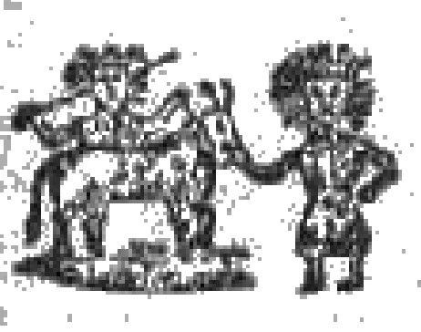

*Gambar Rajah Asli Halaman 16* — Gambar talisman buruj ats-Tsaur (Taurus): sosok manusia berdiri di samping lembu/sapi (lambang Taurus). Tidak diterjemahkan; dipakai sebagai rajah asli sebagaimana adanya dalam kitab.

---

## HALAMAN CETAK 17 (Halaman PDF 8, sisi kiri)

**[Teks Arab Asli]**

الرأس ضخم الوجه أسود العينين مقرون الحاجبين عريض الأكتاف رقيق الخصر والأرداف […] الساقين ضخم القدمين، يحب اللهو والطرب والمزاح والمجامعة للنساء، ذو فرح وهيبة ووقار، ينازع الناس على قدر عقولهم، يحب الزينة والسكوت؟ الزراعة؟ والأكل والشرب والقشرة؟ والبسط، ليس له حظ من أصحابه يريد لهم الخير وهم يريدون له الشر، ويجيب الله من؟ مكرهم وشرهم؛ يلزمه السعاية والنميمة التى؟ يده يطعمها لغيره، عزيز النفس، حسود على […]; له فى رأسه أثر وعلى ظهره علامة وعلى بطنه خامة؟؛ لطيف الجسم حسن الصورة؛ طبيعته السوداء؟؛ له من منازل القمر الثريا والدبران؛ محبوب عند كل انسان […] من حسن عشرته؛ له رزق من الارض […]; لا تصيب؟ عليه الأمور الا فرج الله عنه؛ يمضى حوائج الناس ويتكمل؟ من حاجة نفسه […] لبعض الأسرار؛ وبعض الأوقات يروح؟ ببعضها؛ وهو لطيف الخلق والذات. وله ثلاثة وجوه. ( الوجه الاول ) من نظر اليه عطارد قال الحكيم: يكون صاحب طبع […] واسع الجبهة أحمر اللون كبير الذقن […] الحاجبين أكحل العينين ذو صنعة فى حلو الكلام على يديه علامة، ينال عز؟ أمورا نافعة وسعادة والله أعلم. ( الوجه الثانى ) من نظر اليه القمر قال الحكيم: يكون رجلا […] ويكون جبينه عريضا وفى وجهه شامة أو علامة، صبيح الوجه مقرون الحواجب، ويوجد أثر فى فروة؟ الهامة والله أعلم. ( الوجه الثالث ) من نظر اليه زحل يكون احمر اللون […] صغيرة؟ طويل القامة كبير اللحية أسود العينين على بطنه ثعلبة؟ يحب جمع المال ويهون عليه اخراجه والله أعلم.

( بيت نفسه وحياته ) الثور والزهرة. قال الحكيم: يعيش عيشة طيبة فى عز ورفعة فى أول عمره ثم يتعب فى وسطه وفى آخره يرد الى الخير ويكون طويل العمر والله أعلم. ( بيت ماله وكسبه ) […] عطارد. قال الحكيم: لا بد ان يرزق مالا من غير تعب يتعب فيه يديه ولا يحرق فيه جبينه؛ قال الحكيم: لا بد ان يرزق مالا من الارض وينال خيرا وينتفع؟ […] والله أعلم. ( بيت اخوته واخواته ) السرطان والقمر. قال الحكيم: ينال المحبة من اخوته ويكرم منهم؟ خيرا كثيرا، ويكون ماله؟ […] عاما عليه، ولا بد؟ ان يلحقه نكد من بعض اخوانه والله أعلم. ( بيت آبائه وامهاته ) الاسد والشمس. قال الحكيم: يكون […] الوالدين وينال خيرا […] فى صغره والله أعلم. ( بيت أولاده وأفراحه ) السنبلة

**[Transliterasi Latin Fonetik]**

*ar-ra'si dhakhmul-wajhu aswadul-'aynayni maqruunal-haajibayni 'ariidhal-aktaafi raqiiqal-khashri wal-ardaafi […] as-saaqayni dhakhmal-qadamayni, yuhibbul-lahwu wath-tharabu wal-mazzaahu wal-mujaami'atu lin-nisaa'a, dzuu farahin wa haybatin wa waqaarin, yunaazi'un-naasi 'alaa qadri 'uquulihim, yuhibbuz-zaynatu was-sukuutu? az-ziraa'ata? wal-akla wasy-syurba wal-qisyrata? wal-bastha, lays lahu hazhzhun min ashhaabihi yuriidu lahum al-khayri wa hum yuriiduuna lahusy-syarri, wa yujiibu Allaahi min? makarahum wa syarrahum; yalzamuhus-si'aayatu wan-namiimatul-latii? yadahu yath'amuhaa li-ghayrihi, 'aziizan-nafsi, hasuudun 'alaa […]; lahu fii ra'sihi atsir wa 'alaa zhaharahu 'alaamatun wa 'alaa bathnihi khaamata ؟؛ li-thayfal-jismi hasanush-shuurati; thabii'atahus-sawdaa'i ؟؛ lahu min munaazilil-Qamarits-tsurayyaa wad-dibraani; mahbuubun 'inda kullu anasaan […] min hasanu 'usyuratihi; lahu rizqin minal-aradhi […]; laa tushiibu? 'alayhil-umuura illaa farajja Allaahi 'anhu; yumdhaa hawaa'ijan-naasi wa yatakammalu? min haajati nafsihi […] laba'dhil-asraari; wa ba'dhul-awqaati yaruuhu? baba'dhihaa; wa huwa lathiifil-khalqi waaladzaat  wa lahu tsalaatsatun wujuuhin. (al-wajhul-awwalu  min nazhara ilayhi 'Uthaarida qaalal-hakiimu  yakuunu shaahibu thab'u […] waasi'ul-jabhati ahmarul-lawni kabiirun adz-dzaqani […] al-haajibayni akuhlal-'aynayni dzuu shan'atin fii halwul-kilaami 'alaa yadiyyihi 'ullaamatan, yanaalu 'izzun? amuurraa naafi'atan wa sa'aadatan wallaahu a'lamu. (al-wajhuts-tsaanii  min nazhara ilayhil-Qamari qaalal-hakiimu  yakuunu rajulan […] wa yakuunu jabiinahu 'ariidhan wa fii wajahhahu syaamatun aw 'ullaamatun, shabiihal-wajhu maqruunal-hawaajibi, wa yuujadu atsarun fii fa-rwatin? al-haamata wallaahu a'lamu. (al-wajhuts-tsaalitsu  min nazhara ilayhi Zuhala yakuunu ihmarral-lawni […] shaghiiratan? thawiilul-qaamati kabiirun al-lihyati aswadul-'aynayni 'alaa bathnihi tsa'labatan? yuhibbu jam'ul-maali wa yahuunu 'alayhi akharaajah wallaahu a'lamu.*) *(baytu nafsihi wa hayaatihi  ats-Tsawri waz-Zuharati  qaalal-hakiimu  ya'iisyu 'aysyatu thiibatin fii 'izzin wa raf'atin fii awwalu 'umruhu tsumma yat'abu fii wasathihi wa fii aakhiruhu yaruddu ilal-khayri wa yakuunu thawiilul-'umri wallaahu a'lamu. (baytu maalihi wa kasbihi)[…] 'Uthaarida  qaalal-hakiimu  laa badda anna yurzaqu maalan min ghayri ta'abin yut'ibu fiihi yadiyyahu wa laa yuhriqu fiihi jabiinahu; qaalal-hakiimu  laa badda anna yurzaqu maalan minal-aradhi wa yanaalu khayran wa yantafi'u ؟[…] wallaahu a'lamu. (baytu akhuutah waakhuuaatah  as-Sarathaani wal-Qamari  qaalal-hakiimu  yanaalul-mahabbata min akhuutah wa yukarrimu minhum? khayran katsiiran, wa yakuunu maalihi ؟[…] 'aaman 'alayhi, wa laa badda? anna yalhaquhu nakidun min ba'dhu akhuuaanah wallaahu a'lamu. (baytu aabaa'ihi waamahaatah  al-Asadi wasy-Syamsi  qaalal-hakiimu  yakuunu […] al-waalidiina wa yanaalu khayran […] fii shigharihi wallaahu a'lamu. (baytu awlaadihi wa afraahihi  as-Sunbulati*) **[Terjemahan Indonesia]**

…kepalanya, besar wajahnya, hitam kedua matanya, bertaut kedua alisnya, lebar kedua bahunya, ramping pinggang dan pantatnya, […] kedua betisnya, besar kedua telapak kakinya. Ia menyukai hiburan, musik, senda gurau, dan pergaulan dengan wanita; ia memiliki kegembiraan, wibawa, dan ketenangan; ia melayani manusia sesuai kadar akal mereka; ia menyukai perhiasan dan ketenangan? bertani? serta makan-minum dan […] dan kelapangan. Ia tidak beruntung dari sahabat-sahabatnya: ia menginginkan kebaikan untuk mereka, padahal mereka menginginkan keburukan untuknya; namun Allah menolak? tipu daya dan kejahatan mereka. Ia kerap terkena pengaduan domba dan fitnah (namimah) yang? […] tangannya memberi makan orang lain; ia mulia jiwa; pendengki atas […]; di kepalanya ada bekas, di punggungnya ada tanda, dan di perutnya ada tahi lalat?; halus tubuhnya, bagus rupanya; tabiatnya hitam (saudawi)?; baginya dari manzilah-manzilah Bulan ialah ats-Tsurayya (Pleiades/Kartika) dan ad-Dabaran; ia dicintai setiap orang […] karena bagus pergaulannya; ia mempunyai rezeki dari bumi […]; tidaklah menimpanya urusan kecuali Allah memberi kelapangan baginya; ia menunaikan hajat orang-orang dan menyempurnakan? keperluannya sendiri […] terhadap sebagian rahasia; dan pada sebagian waktu ia pulang? dengan sebagiannya; ia halus budi dan dzat. Buruj ini mempunyai tiga wajah.

(Wajah pertama) Bila yang memandangnya Merkurius ('Utarid), sang bijak berkata: ia menjadi pemilik tabiat […], lebar dahi, kemerahan warna kulit, besar dagu, […] kedua alis, celak kedua mata, memiliki keterampilan pada manisnya perkataan, pada kedua tangannya ada tanda; ia memperoleh kemuliaan?, urusan-urusan yang bermanfaat, dan kebahagiaan. Wallahu a'lam.

(Wajah kedua) Bila yang memandangnya Bulan, sang bijak berkata: ia menjadi laki-laki […] dahinya lebar dan di wajahnya ada tahi lalat atau tanda, cerah wajah, bertaut alis, dan terdapat bekas pada kulit? kepalanya. Wallahu a'lam.

(Wajah ketiga) Bila yang memandangnya Saturnus, ia menjadi kemerahan warna kulit […], kecil?; tinggi badan, besar jenggot, hitam kedua mata, pada perutnya ada "tsa'labah" (bercak/penyakit kulit?); ia suka mengumpulkan harta dan merasa ringan mengeluarkannya. Wallahu a'lam.

(Rumah jiwa dan kehidupannya) Taurus dan Venus. Sang bijak berkata: ia menjalani kehidupan yang baik dalam kemuliaan dan ketinggian pada awal umurnya, lalu letih di pertengahannya, dan di akhirnya ia kembali kepada kebaikan serta menjadi panjang umur. Wallahu a'lam.

(Rumah harta dan penghasilannya) […] Merkurius. Sang bijak berkata: tak terhindar ia diberi rezeki harta tanpa kelelahan yang melelahkan kedua tangannya dan tanpa membakar dahinya; sang bijak berkata: tak terhindar ia diberi rezeki harta dari bumi, memperoleh kebaikan, dan mendapat manfaat? […]. Wallahu a'lam.

(Rumah saudara-saudaranya laki-laki dan perempuan) Cancer dan Bulan. Sang bijak berkata: ia memperoleh cinta dari saudara-saudaranya dan dimuliakan? dari mereka dengan kebaikan yang banyak; dan hartanya? […] merata atasnya; namun tak terhindar? ia tertimpa kejengkelan dari sebagian saudaranya. Wallahu a'lam.

(Rumah bapak-bapak dan ibu-ibunya) Leo dan Matahari. Sang bijak berkata: ia menjadi […] kedua orang tua dan memperoleh kebaikan […] pada masa kecilnya. Wallahu a'lam.

(Rumah anak-anak dan kegembiraannya) Virgo…

---

## HALAMAN CETAK 18 (Halaman PDF 9, sisi kanan)

**[Teks Arab Asli]**

وعطارد: ينال أولادا ذكورا وإناثا ويعيش له منهم؟ […] ويموت له ولد؟ من أولاده ويرى منه حزنا شديدا، وهو يحب الاولاد وينال حسرة من ولد من أولاده؟ وموت أكثرهم أطفالا والله أعلم. ( بيت أمراضه وأعلاته ) الميزان والزهرة: يكون كثير الامراض فى صغره ويشرف على الموت ويصح؟ عليه ثم؟ […] وهو يشكو وجع رأسه وصلبه؟ وركبتيه وخفقان قلبه، وسبب ذلك من الريح الغليظة؛ فليستعمل؟ من أكل البصل والنخل؟ ويستعمل؟ البقر؟ واللبية؟ وسفوف الأصول؛ وان قوى؟ الامراض السوداء فليأخذ أطريلج؟ وهندى؟ وصيفرى؟ ولسان ثور وعود فرح؟ من كل واحد ثلاثة دراهم و […] درهم ثم يشرب بعده […] وهو ان تأخذ […] لبنا من عنزة حمراء ويغل؟ […] ثم يلقى عليه قدر درهم خل خالص ويشرب منه فهو نافع له من كل علة سردارية؟؛ ثم يستعمل بعد ذلك حسوة؟ الثعبان؟ […] فهو أكبر دوائه. وان بدأ به مرض يوم السبت فى شهر بانه؟ يخاف عليه من الموت ان كان طالعه السنبلة والزهرة والميزان والله أعلم. ( بيت نسائه ومواصلاته ) العقرب والمريخ: يتزوج بأربعة نسوة ويكون مغرما فى حب النساء فى صباه، وينال من امرأة خيرا شديدا، وربما طلق الاولى، ولا يموت الا ومعه امرأة بيضاء اللون بصدرها خال أسود، ويجتمع مع نساء كثيرة بلا كتاب وينال بسببهن ضياع؟ المال والله أعلم. ( بيت خوفه وموته ) القوس والمشترى: يخاف عليه من الموت فى شهر كهيك ان مرض يوم الخميس وهو ابن سنين أو ثلاث أو خمس سنين أو خمس عشرة سنة الى خمسة وثلاثين سنة، فان جاوز ذلك كله عاش الى ان يرى أولاد أولاده والله أعلم. ( بيت أسفاره وحركاته ) الجدى وزحل: يكون صادق المنام؟ قليل السفر، وأحسن سفره يوم السبت باكر النهار الى القبلة والغرب، وسفر البحر خير له من سفر البر، وينال حجة وزيارة بيت الله الحرام؛ وليحذر من سفر؟ […]؛ وينال فى سفره خيرا كثيرا ويجتمع […] قوم يصحبونه ويكرموه […] عندهم مثل اخوانهم ثم يرجع سالما غانما والله أعلم. ( بيت عزه وسلطانه )

**[Transliterasi Latin Fonetik]**

*wa 'Uthaarida  yanaalu awalaaddaa dzukuuran wa inaatsan wa ya'iisyu lahu minhum ؟[…] wa yamuutu lahu waladin? min awlaadihi wa yaraa minhu huznan syadiidan, wa huwa yuhibbul-awlaadi wa yanaalu hasratan min waladin min awlaadihi? wa mawti aktsaruhum athufaalan wallaahu a'lamu. (baytu amraadhihi wa a'laatihi  al-Miizaani waz-Zuharati  yakuunu katsiirul-amraadhi fii shigharihi wa yusyrifu 'alaal-mawti wa yashihhu? 'alayhi tsumma ؟[…] wa huwa yasykuu waja'i ra'sihi wa shalbihi? warakabatiih wa khafaqaana qalbihi, wa sabbaba dzaalika minar-riihil-ghaliizhati; fa-layasta'milu? min akull al-bashali wan-nakhli? wa yasta'milu? al-baqara? wal-lubbiyyata? wa safuufal-ushuuli; wa in quwan? al-amraadhas-sawdaa'i fa-laya'khudzu athariilaj? wahanadaa? washiifaraa? wa lisaana tsawri wa 'uudi farahin? min kullu waahidun tsalaatsatun daraahimi w […] durhum tsumma yasyrabu ba'dahu […] wa huwa anna ta'khudzu […] labanan min 'anazati hamraa'i wa yughli ؟[…] tsumma yulqaa 'alayhi qadra dirhami khulli khaalishi wa yasyrabu minhu fa-huwa naafi'in lahu min kullu 'allatin sirdaariyyatin ؟؛ tsumma yasta'milu ba'da dzaalika haswatin? ats-tsu'baana ؟[…] fa-huwa akbari dawaa'ihi  wa in bada'a bihi maradhi yawmas-Sabti fii syahri baanihi? yukhaafu 'alayhi minal-mawti anna kaana thaali'uhus-Sunbulati waz-Zuharati wal-Miizaani wallaahu a'lamu. (baytu nisaa'ihi wa muwaashalaatihi  al-'Aqrabi wal-Mirriikhi  yatazawwaju bi'arba'ati niswatin wa yakuunu mughraman fii hubbin-nisaa'i fii shabaahi, wa yanaalu min imra'atun khayran syadiidan, wa rubbamaa thalqal-uulaa, wa laa yamuutu illaa wama'ahu imra'atun baydhaa'ul-lawni bishadrihaa khaalin aswadu, wa yajtami'u ma'a nisaa'i katsiiratun bilaa kitaabin wa yanaalu bisababihinna dhayaa'un? al-maali wallaahu a'lamu. (baytu khawfihi wa mawtihi  al-Qawsi wal-Musytarii  yukhaafu 'alayhi minal-mawti fii syahri kahiyika anna maradha yawmal-Khamiisi wa huwa ibni siniina aw tsalaatsi aw khumusu siniina aw khamsa 'asyrata sanatin ilaa khamsatun wa tsalaatsiina sanatin, fa-in jaawaza dzaalika kullihi 'aasya ilaa anna yaraa awlaadin awlaadihi wallaahu a'lamu. (baytu asfaarihi wa harakaatihi  al-Jadyi wa Zuhala  yakuunu shaadiqal-manaami? qaliilus-safari, wa ahsanu safarihi yawmas-Sabti baakiran-nahaari ilal-qibalata wal-gharba, wa safaral-bahri khayrun lahu min safaril-barri, wa yanaalu hujjatan wa ziyaarati baytu Allaahil-Haraami; wa layuhadzdziru min safari ؟[…]؛ wa yanaalu fii safarihi khayran katsiiran wa yajtami'u […] quwwamun yashhabuunahu wa yukarrimuuhu […] 'indahum mitsl akhuuaanaham tsumma yarji'u saalimaa ghaanimaa wallaahu a'lamu. (baytu 'izzihi wa sulthaanihi *) **[Terjemahan Indonesia]**

…dan Merkurius: ia memperoleh anak-anak laki-laki dan perempuan, dan hidup baginya sebagian dari mereka? […]; namun meninggal pula seorang anaknya? dan ia melihat darinya kesedihan yang berat; ia mencintai anak-anak dan mendapat penyesalan dari salah seorang anaknya?; dan kebanyakan anak-anaknya meninggal saat masih kecil. Wallahu a'lam.

(Rumah penyakit-penyakit dan cacatnya) Libra dan Venus: ia banyak sakit pada masa kecilnya dan hampir mati, lalu sehat? kembali […]; ia mengeluh sakit kepala dan tulang punggung? serta kedua lututnya dan berdebar-debar jantungnya; sebab hal itu berasal dari angin yang tebal (berat); maka hendaklah ia memakai? makan bawang dan […]? dan memakai? […] serta serbuk akar-akaran (safuf al-ushul); dan bila menguat? penyakit-penyakit hitam (saudawi), hendaklah ia mengambil ithrilal? (obat campuran?), hindi? (keledang?), shaifuri? (kuning?), lisan ats-tsaur (lidah sapi — nama tumbuhan obat), dan oud farah? (kayu gembira), masing-masing tiga dirham dan […] dirham, kemudian ia meminum sesudahnya […]; caranya: engkau mengambil […] susu dari kambing betina merah, direbus? […], lalu dituangkan padanya seukuran satu dirham cuka murni dan ia meminumnya — maka itu bermanfaat baginya dari setiap penyakit yang bersifat dingin (sardariyah)?; kemudian sesudah itu ia memakai hiswah? (minuman obat) ular? […] karena itulah obat terbesarnya. Bila penyakit menyerangnya pada hari Sabtu di bulan Banah?, ia patut dikawatirkan akan kematian bila thali'-nya Virgo, Venus, dan Libra. Wallahu a'lam.

(Rumah istri-istri dan hubungan-hubungannya) Scorpio dan Mars: ia menikahi empat wanita dan sangat tergila-gila mencintai wanita pada masa mudanya; ia memperoleh dari seorang wanita kebaikan yang besar; dan boleh jadi ia menceraikan yang pertama; dan ia tidak meninggal kecuali bersama seorang wanita berkulit putih yang di dadanya ada tahi lalat hitam; ia berkumpul dengan banyak wanita tanpa kitab (nikah) dan memperoleh karena mereka kehilangan? harta. Wallahu a'lam.

(Rumah ketakutan dan kematiannya) Sagittarius dan Yupiter: ia patut dikawatirkan akan kematian pada bulan Kiyahk (bulan Qibti) bila ia sakit pada hari Kamis, saat ia berumur dua tahun, tiga tahun, lima tahun, atau lima belas tahun sampai tiga puluh lima tahun; bila ia melewati semua itu, ia hidup sampai melihat anak-anak dari anak-anaknya. Wallahu a'lam.

(Rumah perjalanan-perjalanan dan gerakannya) Capricorn dan Saturnus: ia benar mimpinya?, sedikit bepergian; perjalanannya yang terbaik ialah hari Sabtu pagi hari ke arah kiblat dan barat; perjalanan laut lebih baik baginya daripada perjalanan darat; dan ia mencapai haji serta ziarah Baitullah al-Haram; dan hendaklah ia berhati-hati dari perjalanan? […]; ia memperoleh dalam perjalanannya kebaikan yang banyak dan berkumpul […] kaum yang menyertainya dan memuliakannya […] di sisi mereka seperti saudara-saudara mereka, kemudian ia kembali dengan selamat dan beruntung. Wallahu a'lam.

(Rumah kewibawaan dan kekuasaannya)…

---

## HALAMAN CETAK 19 (Halaman PDF 9, sisi kiri)

**[Teks Arab Asli]**

الجدى؟ وزحل: يكون معزوزا حيث توجه؟ عند الاكابر وأرباب المناصب، حسن العاقبة، وينال سعادة فى آخر عمره من رجل جليل القدر ويحبه حبا شديدا وينال منه خيرا كثيرا؛ وهو محبوب عند القريب مبغوض عند الغريب والله أعلم. ( بيت اصدقائه ومودته ) الحوت والمشترى: يكون ثابت الأمل وينال ما يؤمله ويرجوه ويرى أحلاما كثيرة، وهو محمود العاقبة حسن السيرة ولا يموت الا بعد توبة من الله تعالى والله أعلم. ( بيت أعدائه وحساده ) الحمل والمريخ: يكون كثير الأعداء من أقاربه وجيرانه ومعارفه وكل من كان صاحبه يكون له عدوا؛ ويخاف عليه من امرأة صغيرة اللون؟ تعمل له مكائد […] ويرسل له سحر ويدخر؟ فى المقابر التى لا تزار؛ وينجو من ذلك كله باذن الله تعالى؛ ويوافقه من النساء من كان نجمها الثريا؟ […] والسنبلة والثور؛ وليحذر ممن كان نجمها هوائيا كالجوزاء والميزان والدلو؟ فان الهواء يتصف؟ الترابة؟؛ ويوافقه من الخدام؟ النحاس والفضة، ومن الخصوص؟ الزمرد والفيروزج؛ فان حاج؟ من الدم؟ فليقصد؟ فى فصل الخريف يوم الاربعاء ساعة المريخ فى حرف الأكحل من يمينه لينظر الطلال؟ على وجه أتى؟ فيكون ذلك الشهر مباركا عليه؛ وأحسن داوية؟ الدم وأحسن نسائه؟ الخضر؛ وأكثر من دخول الحمام ويحرق المظفات؟ كالمقل والمسك وما أشبه ذلك فانه يضري؟ عليه السوداء؛ وان طلب حاجة من كبير أو صغير فليقصده يوم الجمعة باكر النهار وخاتم الزهرة فى يده تقضى حاجته؛ وشر أيامه السبت؛ واذا أراد أن يأمن من كل شىء ويكون مقبولا حيثما توجه فليوقد؟ عند القمر اذا نزل برج الثور وهو قوى النور ويقصد الساعة يوم الجمعة ويصنع له خاتما وينقش عليه هذه الأسماء ويصفر؟ بكندر وجاوى وعود ويلبسه فى خنصره الأيمن فيكون له قبولا وحبنا؟ من كل شىء وهو هذا الخاتم؛ وان كان فقير الحال ولا له طاقة على الخاتم فليوجه؟ القمر كما ذكرنا ويكتب له هذه الأسماء بمسك وزعفران و […] ويبخر بالبخور المذكور يوم الجمعة ساعة الزهرة ويكون مقبولا عند الناس آمنا من أعدائه ومن الجن جميعا، وهي هذه:

**[Transliterasi Latin Fonetik]**

*al-Jadyi? wa Zuhala  yakuunu ma'azuuzaa hayts tawajjuhin? 'indal-akaabiri wa arbaabil-manaashibi, hasanul-'aaqibati, wa yanaalu sa'aadatan fii aakhara 'umruhu min rajulin jaliilul-qadri wa yuhibbuhu hubbaa syadiidan wa yanaalu minhu khayran katsiiran; wa huwa mahbuubun 'indal-qariibi mabghuudha 'indal-ghariibi wallaahu a'lamu. (baytu ashadaqaa'ah wa mawaddatahu  al-Huuti wal-Musytarii  yakuunu tsaabital-amali wa yanaalu maa yu'ammiluhu wa yarjuuhu wa yaraa ahalaamaa katsiiratun, wa huwa mahmuudil-'aaqibati hasanus-sayrati wa laa yamuutu illaa ba'da tawbatin min Allaahi Ta'aalaa wallaahu a'lamu. (baytu a'daa'ihi wa hussaadihi  al-Hamali wal-Mirriikhi  yakuunu katsiirul-a'daa'i min aqaaribihi wa jiiraanihi wa ma'aarifihi wakull min kaana shaahibihi yakuunu lahu 'aduwwan; wa yukhaafu 'alayhi min imra'atun shaghiiratil-lawni? ta'malu lahu makaa'idi […] wa yursilu lahu saharin wa yaddakhiru? fil-maqaabiril-latii laa tuzaaru; wa yanjuu min dzaalika kullihi bi-idzni Allaahi Ta'aalaa; wa yuwaafiquhu minan-nisaa'i min kaana najmihaa ats-tsurayyaa ؟[…] was-Sunbulati wats-Tsawri; wa layuhadzdziru mimman kaana najmihaa hawaa'iyyan kal-Jawzaa'i wal-Miizaani wad-Dalwi? fa-in al-hawaa'i yattashifu? at-turaabata ؟؛ wa yuwaafiquhu minal-khaddaami? an-nahhaasa wal-fidhdhata, wa minal-khashuush? az-zumurruda wal-fiiruuzaja; fa-in haajjin? minad-dami? fa-layaqshidu? fii fashlun al-khariifi yawmal-Arbi'aa'i saa'atal-Mirriikhi fii harfil-akhali min yamiinahu liyanzhuruth-thilaalu? 'alaa wajhi ataa? fa-yakuunu dzaalikasy-syahru mubaarakan 'alayhi; wa ahsanu daawiyata? ad-dami wa ahsanu nisaa'ihi? al-khadhira; wa'aktsara min dukhuulil-hammaami wa yuhriqul-mazhafaat? kal-muqilli wal-maski wa maa asyibh dzaalika fa-innahu yadhrii? 'alayhis-sawdaa'i; wa in thalabi haajatin min kabiirun aw shaghiirun fa-layaqshiduhu yawmal-Jumu'ati baakiran-nahaari wa khaatamuz-Zuharati fii yadihi tuqdhaa haajatuhu; wa syarrin ayyaamihis-Sabti; wa idzaa araada an ya'ammanna min kullu syay'in wa yakuunu maqbuulan haytsumaa tawajjuhin fa-layuuqidu? 'indal-Qamari idzaa nuzil burjuts-Tsawri wa huwa quwaa an-nuuri wa yaqshidus-saa'atu yawmal-Jumu'ati wa yashna'u lahu khaatiman wa yanqusyu 'alayhi haadzihil-asmaa'a wa yashfiru? bikunduri wajaawaa wa 'uudun wa yalbasuhu fii khinsharihil-aymani fa-yakuunu lahu qabuulan wa hubban? min kullu syay'in wa huwa haadzaal-khaatamu; wa in kaana faqiiril-haali wa laa lahu thaaqatin 'alaal-khaatamu fa-layuwajjihu? al-Qamari kamaa dzakaran wa yaktubu lahu haadzihil-asmaa'a bimaskin wa za'faraanin w […] wa yubakhkhiru bil-bukhuuril-madzkuura yawmal-Jumu'ati saa'ataz-Zuharati wa yakuunu maqbuulan 'indan-naasi aaman min a'daa'ihi wa minal-jun jamii'an, wa hiya haadzihi *) **[Terjemahan Indonesia]**

…Capricorn? dan Saturnus: ia menjadi perkasa ke mana pun ia menghadap? di sisi para pembesar dan pemilik jabatan; baik kesudahannya; dan ia memperoleh kebahagiaan di akhir umurnya dari seorang laki-laki berbudi besar yang sangat mencintainya, sehingga ia mendapat kebaikan yang banyak darinya; ia dicintai orang dekat dan dibenci orang asing. Wallahu a'lam.

(Rumah kawan-kawan dan kasihnya) Pisces dan Yupiter: ia teguh harapannya, memperoleh apa yang ia harapkan dan ia cita-citakan, dan melihat mimpi yang banyak; ia terpuji kesudahannya, baik perilakunya, dan tidak meninggal kecuali setelah bertobat dari Allah Ta'ala. Wallahu a'lam.

(Rumah musuh-musuh dan para pendengki) Aries dan Mars: ia banyak musuh dari kalangan kerabat, tetangga, dan kenalannya, dan setiap orang yang menjadi sahabatnya berubah menjadi musuh; ia patut khawatir terhadap seorang wanita […] yang membuat tipu daya baginya […] dan dikirimkan sihir kepadanya dan disimpan? di kuburan-kuburan yang tidak diziarahi; namun ia selamat dari semua itu dengan izin Allah Ta'ala. Yang cocok baginya di antara wanita ialah yang bintangnya ats-Tsurayya (Pleiades)? […] dan Virgo serta Taurus; dan hendaklah ia berhati-hati terhadap wanita yang bintangnya berelemen udara seperti Gemini, Libra, dan Aquarius?, karena udara bersifat? […] tanah; dan yang cocok baginya dari pelayan-pelayan? ialah tembaga dan perak, dan dari batu-batu khusus? ialah zamrud dan firuzah (turki). Bila ia hendak membekam? (mengeluarkan darah), hendaklah ia melakukannya? pada musim gugur, hari Rabu, jam Mars, pada urat al-Akhal (urat di tengah lengan) sebelah kanannya, agar […] maka bulan itu menjadi berberkah baginya; dan sebaik-baik obat? darah serta sebaik-baik wanita? ialah yang berkulit sawo matang (khudhr)?; dan hendaklah ia memperbanyak masuk kamar mandi (hammam) serta membakar […] seperti muql (kemenyan keras) dan misk (kesturi) dan yang semisalnya, karena hal itu membahayakan? atasnya empedu hitam (sauda'). Bila ia memohon hajat kepada orang besar atau kecil, hendaklah ia mendatanginya pada hari Jumat pagi hari dengan khatam (cincin meterai) Venus di tangannya, niscaya hajatnya tertunaikan; dan seburuk-buruk harinya ialah hari Sabtu. Bila ia ingin aman dari segala sesuatu dan diterima di mana pun ia menghadap, hendaklah ia memperhatikan? Bulan apabila turun di buruj Taurus dalam keadaan kuat cahayanya, dan ia menuju jam pada hari Jumat, lalu membuat khatam dan mengukir padanya nama-nama ini, serta mengasapinya? dengan kundur (kemenyan putih), jawi, dan gaharu, lalu memakainya di jari kelingking kanannya, maka ia memperoleh penerimaan dan kecintaan? dari segala sesuatu — dan itulah khatam ini. Bila ia miskin dan tidak mampu membuat khatam, hendaklah ia menghadapkan? Bulan sebagaimana kami sebutkan, dan menuliskan nama-nama ini dengan misk dan za'faran (kunyit/za'faran) dan […], serta mengasapi dengan dupa yang disebut pada hari Jumat jam Venus, maka ia menjadi diterima di sisi manusia dan aman dari musuh-musuhnya dan dari seluruh jin. Dan inilah (wafaqnya):

**[Gambar Rajah Asli Halaman 19 — Wafaq Angka (khatam nomor)]**

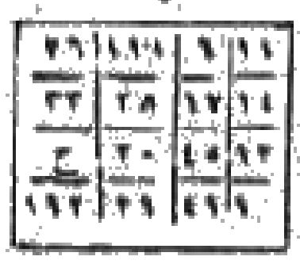

*Gambar Rajah Asli Halaman 19* — Wafaq angka 4×4 yang merupakan "khatam" (meterai) sebagaimana disebutkan teks: angka-angka pada sel-selnya (dari kanan ke kiri, baris per baris, sebatas terbaca): baris 1: ١١ | ٦ | ٦٦(?) | ٦٦ ; baris 2: ١١ | ١٢ | ٨ | ٣٣ ; baris 3: ١٢ | ١٤ | ٢٠ | ٢(?) ; baris 4: ٩ | ٦(?) | ٢٩ | ١٩٢(?). **Keterangan cara baca menurut kitab:** angka-angka ini diukir/ditulis sebagai khatam Venus yang dipakai pada jari kelingking kanan (atau ditulis dengan misk dan za'faran bagi yang tidak mampu), diaspai dengan kundur-jawi-gaharu pada hari Jumat jam Venus, agar pemilik buruj Taurus diterima di sisi manusia dan aman dari musuh serta jin.

---

## HALAMAN CETAK 20 (Halaman PDF 10, sisi kanan)

**[Teks Arab Asli]**

( بسم الله الرحمن الرحيم ) اللهم انى أسألك يا من هو أحرون؟ تاف؟ أدهم؟ حامي؟ احفظ حامل كتاب هذا بجميع هذه الاسماء وعن؟ […] بحق بسم الله الذى لا يضر مع اسمه شىء فى الارض ولا فى السماء وهو السميع العليم؛ الله حبيط؟ الله لطيف قديم أزل حى قيوم لا ينام؛ وصلى الله على سيدنا محمد وعلى آله وصحبه وسلم. ولصاحب هذا البرج من اشكال الرمل شكل راية الروح. قال الله تعالى: قلنا يا نار كونى بردا وسلاما على ابراهيم. أبشر أيها السائل بالفوز والتمكين بطيب قلب وحسن يقين والخلاص من أيدى الظالمين وقهر الأعداء والباغضين؟، فقد أتاك من الاشكال راية الروح وهو بيت الغنى؟ والأفراح والسرور، ولما؟ من الكواكب المشترى، يدل على فرح السائل وقضاء حوائجه؟ باليسر بعد العسر؛ فأمورك موفية؟ وحاجتك منقضية وجاه؟ […] من غير أذية؛ فلا تخشى من كيد الخادمين؟ وكن لله من الشاكرين؛ وهذا يدل على بلوغ المراد والمرام والمطلوب والاجتماع بما يسر القلوب من المحبوب؛ وأن الجوانب حميدة وحركاتك سعيدة؛ ولا بد لك من الاجتماع بمن فى خاطرك وعن قريب يحضر؛ ويحصل لك خير من رجل جليل القدر؛ واذا عزمت على سفر سافر ولا تخشى من ضرر أو ضجر؟ […]؛ وان حزنت […] فان أمورك سهلة؛ فشكر؟ الله تعالى. واسمع قول الشاعر:

أتلك منها رتبة راية السفوح؟ * تخبرك بالسعد وينل المراد
فغنم وبادر نسق؟ ما تريده * وما رمته يمضى على رغم الاعادى

( القول على البرج الثالث وهو برج الجوزاء وعطارد وفيه شعر )

وصاحب الفلك الجوزا؟ صاحبه * له؟ النحاسة فى سوق؟ عمل
عطارد نجمه والخط سنته؟ * يصوب؟ شرها بالمز؟ متصل
حلو الكلام زكى العقل ذو أدب * غيور ذو حرس؟ يسر وذو حيل
ديوان حسوب؟ لا يفترى له أحد * رب الخداع عن المكر والحيل

**[Transliterasi Latin Fonetik]**

*(Bismillaahir-Rahmaanir-Rahiim  Allaahumma anii asa'alaka yaa min huwa aharuunun? taafa? adahmun? haamii? ihfazh haamila kitaabi haadzaa bi-jamii'i haadzihil-asmaa'a wa 'an ؟[…] bihaqqi bismi Allaahil-ladzii laa yadhurru ma'a ismihi syay'in fil-ardhi wa laa fis-samaa'i wa huwas-samii'il-'aliimi; Allaahi habiith? Allaahi lathiifa qadiima azali haa qayyuuman laa yunaamu; wa shallaa Allaahi 'alaa sayyidinaa Muhammadin wa 'alaa aalihi wa shahbihi wa sallama  wa li-shaahibi haadzaal-burji min asyakaal ar-ramli syaklu raayatir-rawhi  qaala Allaahi Ta'aalaa  qulnaa yaa naarin kawan bardan wa salaaman 'alaa abaraahiim  abasysyara ayyuhas-saa'ilu bil-fawzi wat-tamkiini bithayyibi qalbin wa husni yaqiinin wal-khullaashi min ayadaa azh-zhaalimayni wa qahril-a'daa'i wal-baaghidhiina ؟، fa-qad ataaka minal-asyakaal raayatar-rawhi wa huwa baytul-ghinaa? waala'afaraah was-suruura, walammaa? minal-kawaakibil-Musytarii, yadullu 'alaa farahis-saa'ilu wa qadhaa'i hawaa'ijihi? bil-yusri ba'dal-'usri; fa-umuuraka muwaffiyatan? wa haajataka munqidhiyyatu wa jaahu ؟[…] min ghayri adzayatin; fa-laa takhsyaa min kaydil-khaadimiina? wa kanna lillaahi minasy-syaakiriina; wa haadzaa yadullu 'alaa buluughil-muraadi wal-maraami wal-mathluubu wal-ijtimaa'i bimaa yusrun al-qaluubi minal-mahbuubi; wa'ann al-jawaanibi hamiidatan wa harakaatika sa'iidatun; wa laa badda lak minal-ijtimaa'i baman fii khaathirika wa 'an qariibin yahdhuru; wa yuhashshilu lak khayrun min rajulin jaliilul-qadri; wa idzaa 'azzamat 'alaa safari saafiri wa laa takhsyaa min dhararin aw dhajaru ؟[…]؛ wa in hazanat […] fa-in umuurika sahlata; fa-syukrun? Allaahi Ta'aalaa  wa isma' qawlusy-syaa'iri:*) *atilk minhaa rutbata raayatis-sufuuhi ؟* tukhbiruka bis-sa'di wa yanul al-muraadu*
*fa-ghanamun wa baadiru nasaqin? maa turiiduhu * wa maa rimmatihi yumdhaa 'alaa raghmil-a'aadaa*

*(al-qawli 'alaal-burjits-tsaalitsu wa huwa burjul-Jawzaa'i wa 'Uthaarida wa fiihi syi'ra)*

*wa shaahibul-falakil-jawzaa? shaahibahu * lahu? an-nahhaasata fii suuqin? 'amalun*
*'Uthaarida najmihi wal-khaththi sanatahu ؟* yushawwibu? syarrahaa bil-muzzi? muttashilun*
*haluwal-kilaamu zakkaal-'aqlu dzuu adabi * ghayuura dzuu harasin? yusrun wadzuu haylin*
*diiwaana hasuub? laa yuftaraa lahu ahadi * rabbil-khidaa'i 'an al-makri wal-hayli*

**[Terjemahan Indonesia]**

(Dengan nama Allah Yang Maha Pengasih lagi Maha Penyayang) Ya Allah, sesungguhnya aku memohon kepada-Mu, wahai Zat yang […] Ahrrun? Taff? Adham? Hami?, jagalah pembawa kitab ini dengan seluruh nama-nama ini dan dari […] dengan hak "bismillah yang tidak akan membahayakan bersama nama-Nya sesuatu pun di bumi dan di langit, dan Dia Maha Mendengar lagi Maha Mengetahui"; Allah […] Allah Maha Lembut, Qadim azali, Hidup, Qayyum, tidak tidur; dan semoga shalawat serta salam tercurah kepada junjungan kita Muhammad beserta keluarga dan sahabatnya.

Dan bagi pemilik buruj ini, dari bentuk-bentuk raml (geomansi), ada bentuk "Rayat ar-Ruh" (Panji Ruh). Allah Ta'ala berfirman: "*Kami berfirman: wahai api, jadilah engkau dingin dan keselamatan bagi Ibrahim*" (QS. al-Anbiya': 69). Bergembiralah wahai penanya dengan kemenangan dan pengukuhan, dengan hati yang tenteram dan keyakinan yang baik, dengan keselamatan dari tangan orang-orang zalim, dan dengan penaklukan atas musuh-musuh dan para pembenci?; karena telah datang kepadamu dari bentuk-bentuk itu "Rayat ar-Ruh", yaitu rumah kekayaan? dan kegembiraan-kegembiraan serta kesukaan; dan dari planet-planet ialah Yupiter; menunjukkan kegembiraan penanya dan tertunainya hajat-hajatnya? dengan kemudahan setelah kesukaran; maka urusan-urusanmu terpenuhi?, hajatmu tertunaikan, dan wibawa? […] tanpa gangguan; maka janganlah engkau takut tipu daya para pelayan? dan jadilah engkau termasuk orang-orang yang bersyukur kepada Allah; dan ini menunjukkan tercapainya maksud, tujuan, dan yang diminta, serta pertemuan dengan apa yang menyenangkan hati dari yang dicintai; bahwa sisi-sisi (keadaan) terpuji dan gerak-gerikmu berbahagia; tak terhindar bagimu pertemuan dengan orang yang ada dalam pikiranmu, dan tidak lama lagi ia hadir; dan engkau memperoleh kebaikan dari seorang laki-laki berbudi besar; bila engkau bertekad bepergian, bepergianlah dan jangan takut kerugian atau kejengkelan? […]; dan bila engkau bersedih […] maka urusan-urusanmu mudah; maka syukur? kepada Allah Ta'ala. Dengarkan ucapan sang penyair:

*"Itulah dari sana derajat panji yang tercurah? * mengabarkan kebahagiaan kepadamu dan tercapailah maksud. Maka ambillah kesempatan dan bersegeralah […] apa yang engkau inginkan * dan apa yang engkau cita-citakan akan berjalan meski musuh-musuh enggan."*

(Perkataan tentang buruj ketiga, yaitu buruj Gemini (al-Jauza') dengan Merkurius; dan padanya ada syair:)

*Pemilik falak Gemini, pemiliknya * baginya? kesialan? di pasar? amal;
Merkurius bintangnya dan garis (tulisan) kebiasaannya? * menuangkan? […] bersambung;
Manis tutur, cerdas akal, beradab * pencemburu, berpengawal? ringan tangan dan banyak akal;
Pencatat? penghitung? yang tidak difitnah oleh seorang pun * tuan tipu daya, dari makar dan helah.*

---

## HALAMAN CETAK 21 (Halaman PDF 10, sisi kiri)

**[Teks Arab Asli]**

( القول على طبع الطالع واختلاف الوجوه التى للإنسان والطباع التى عليه )

قال الحكيم أبو معشر الفلكى: هو برج مذكر؟ […] طبيعته الحرارة والرطوبة. قال الحكيم: المولود به يكون رجلا حسن الوجه أبيض اللون بصفرة وحبرة؟ واسع الفم معتدل القامة جيد الحاجبين مليح العينين صاحب صنعة فاخرة؟ كتابا؟ حاسب؟ […] ذا رأى صائب […] رأسه شامة […]؛ بخالط الاكابر وأرباب الدولة […] عزيز الاولاد كثير الاعداء صاحب مكر ومكايد؛ لا يثبت على حالة واحدة؛ يخاف عليه وهو ابن ثلاث سنين وفى خمس وفى سبع وفى عشرين سنة الى ثلاثين سنة، فان جاوز ذلك كله عاش الى ثمانين سنة؛ وخيار شهوره بؤونة وأشرها طوبة؛ وان خدم الملوك نال خيرا كثيرا؛ وربما كان حياكا؟ أو خياطا أو منجما؟ اذا كان عطارد منحوسا، وان كان مسعودا كان قاضيا أو حاكما أو وزيرا […]. والله أعلم.

قال الحكيم: وله ثلاثة وجوه. ( الوجه الاول ) من نظر اليه المشترى يكون رجلا أبيض اللون بصفرة حسن الصورة جيد الشعر مقرون الحواجب كثير الكلام سريع الجواب طويل القامة؛ ينال الدين والصلاح اذا بلغ من العمر خمسين سنة؛ وينال الحج الى بيت الله الحرام وزيارة قبر النبى ﷺ ويتصدق على الفقراء والمساكين ويتأله؟ […] ويوجع؟ بركبتيه وصلبه ويصيبه […] علامة؟ أو شامة أو خال أسود؛ قليل الحظ من الاولاد؛ وينال ملكا؟ أو بسنا؟ […] والله أعلم.

( الوجه الثانى ) من نظر اليه المريخ يكون رجل احمر اللون بمحمرة؟ أو أشقر، وربما كان بيديه زرقة أو شهلة؟، سريع الغضب كثير العطش ساكن؟ […] غضوب؟ ذنوب؟ لا يسمع لأحد قولا، قوى الرأس خفيف الحواجب؟ ذو مال ومتاع […] وبصدره علامة؛ يخاف عليه أن يقع من مكان عال؛ وربما كان حاكما أو أميرا؟ ان كان المريخ مسعودا، وان كان منحوسا كان ثاعبا؟ أو سفاكا؟ للدماء أو جزارا أو ما أشبه ذلك والله أعلم

**[Transliterasi Latin Fonetik]**

*(al-qawli 'alaa thab'uth-thaali'u wa ikhtilaafil-wujuuhil-latii lil-insaana wath-thibaa'il-latii 'alayhi)*

*qaalal-hakiimu Abuu Ma'syarin al-Falakiyyu  huwa burju mudzakkari ؟[…] thabii'atahul-haraarati war-ruthuubati  qaalal-hakiimu  al-mawluudu bihi yakuunu rajulan hasanul-wajhu abyadhul-lawni bishifratin wa hibratin? waasi'ul-fami mu'tadilul-qaamati jayyidal-haajibayni maliihal-'aynayni shaahibu shun'atin fa-akhiratin? kitaaban? haasaba ؟[…] dzaa ra'aa shaa'ibu […] ra''asahu syaamatu […]؛ bikhaalithil-akaabiri wa arbaabid-dawlati […] 'aziizal-awlaadi katsiirul-a'daa'i shaahibu makri wamakaayd; laa yutsbitu 'alaa haalatin waahidatun; yukhaafu 'alayhi wa huwa ibni tsalaatsi siniina wa fii khumusun wa fii sab'i wa fii 'isyriina sanatin ilaa tsalaatsiina sanatin, fa-in jaawaza dzaalika kullihi 'aasya ilaa tsamaaniina sanatin; wa khiyaara syahuurah ba'uunata wa asysyarahaa thuubatu; wa in khidamil-muluuki naala khayran katsiiran; wa rubbamaa kaana hiiaakaa? aw khayyaathan aw manjaman? idzaa kaana 'Uthaarida manhuusan, wa in kaana mas'uudan kaana qaadhiyan aw haakiman aw wa ziiraa […]. wallaahu a'lamu.*

*qaalal-hakiimu  wa lahu tsalaatsatun wujuuhin. (al-wajhul-awwalu  min nazhara ilayhil-Musytarii yakuunu rajulan abyadhul-lawni bishifratin hasanush-shuurata jayyidusy-syi'ri maqruunal-hawaajibi katsiirul-kilaami sarii'ul-jawaabi thawiilul-qaamati; yanaalud-diinu wash-shulaahu idzaa balagha minal-'umri khamsiina sanatin; wa yanaalul-hajju ilaa baytu Allaahil-Haraami wa ziyaarati qabrin-Nabiyyi ﷺ wa yatashaddaqu 'alaal-fuqaraa'i wal-masaakiini wa yata'allahu ؟[…] wa yuuji'u? barakabatiih wa shalabahu wa yushiibuhu […] 'ullaamatan? aw syaamatun aw khaalin aswadu; qaliilul-hazhzhi minal-awlaadi; wa yanaalu malikaa? aw bassan ؟[…] wallaahu a'lamu.*) *(al-wajhuts-tsaanii  min nazhara ilayhil-Mirriikhi yakuunu rajulin ihmarral-lawni bimuhmarratin? aw asyqaru, wa rubbamaa kaana biidiyyihi zurqatan aw syuhlatun ؟، sarii'ul-ghadhabi katsiirul-'athasyi saakina ؟[…] ghadhuubun? dzunuubun? laa yasma'u li-ahadu quulaa, qawwaa ar-ra'si khafiiful-hawaajibi? dzuu maalin wa mataa'i […] wa bishadrihi 'ullaamata; yukhaafu 'alayhi an yuq'i min makaani 'aalin; wa rubbamaa kaana haakiman aw amiiran? anna kaanal-Mirriikhi mas'uudan, wa in kaana manhuusan kaana tsaa'abaa? aw saffaakan? lid-dimaa'a aw jazzaaran aw maa asyibh dzaalika wallaahu a'lamu*) **[Terjemahan Indonesia]**

(Perkataan tentang tabiat thali' dan perbedaan wajah-wajah yang ada pada manusia serta tabiat-tabiat yang berlaku padanya)

Berkata sang bijak Abu Ma'syar al-Falaki: ia adalah buruj maskulin (muzakkar)? […] tabiatnya panas dan lembap. Sang bijak berkata: orang yang dilahirkan di bawahnya menjadi laki-laki yang bagus wajahnya, putih warna kulitnya dengan semburat kuning dan kemerahan?, lebar mulutnya, sedang perawakannya, baik kedua alisnya, elok kedua matanya, memiliki keterampilan yang unggul?; penulis?; penghitung? […] berpendapat tepat […]; di kepalanya ada tahi lalat […]; ia bergaul dengan para pembesar dan orang-orang istana […]; sedikit anak, banyak musuh, pemilik tipu daya dan makar; ia tidak tetap dalam satu keadaan; ia patut dikawatirkan pada usia tiga tahun, lima tahun, tujuh tahun, dan dua puluh tahun sampai tiga puluh tahun; bila ia melewati semua itu, ia hidup sampai delapan puluh tahun; sebaik-baik bulannya ialah Ba'unah (bulan Qibti) dan seburuk-buruknya ialah Tubah; bila ia melayani raja-raja, ia memperoleh kebaikan yang banyak; dan boleh jadi ia menjadi penenun?, penjahit, atau ahli nujum? bila Merkurius sedang bernasib buruk (manhus); dan bila Merkurius berbahagia (mas'ud), ia menjadi qadhi (hakim), penguasa, atau wazir […]. Wallahu a'lam.

Sang bijak berkata: buruj ini mempunyai tiga wajah. (Wajah pertama) Bila yang memandangnya Yupiter: ia menjadi laki-laki putih warna kulitnya dengan semburat kuning, bagus rupa, baik rambut, bertaut alis, banyak bicara, cepat menjawab, tinggi badan; ia memperoleh agama dan kebaikan bila telah berumur lima puluh tahun; ia mencapai haji ke Baitullah al-Haram dan ziarah makam Nabi ﷺ, bersedekah kepada orang-orang fakir dan miskin, dan menekun ibadah? […]; ia merasa nyeri? pada kedua lutut dan tulang punggungnya, dan menimpanya […] tanda? atau tahi lalat atau bintik hitam; sedikit keberuntungan dari anak-anak; dan ia memperoleh kekuasaan? atau […] Wallahu a'lam.

(Wajah kedua) Bila yang memandangnya Mars: ia menjadi laki-laki kemerahan dengan kemerahan? atau pirang; boleh jadi pada kedua tangannya ada kebiruan atau kekuningan?; cepat marah, banyak haus, tenang? […]; pemarah? […] tidak mendengarkan perkataan seorang pun; kuat kepala, tipis alis?; memiliki harta dan barang […] dan di dadanya ada tanda; ia patut dikawatirkan jatuh dari tempat tinggi; dan boleh jadi ia menjadi penguasa atau amir? bila Mars sedang berbahagia; dan bila Mars sedang bernasib buruk, ia menjadi […]? atau penumpah? darah, atau penjagal, atau yang semisalnya. Wallahu a'lam.

**[Gambar Rajah Asli Halaman 21 — Tilsm buruj al-Jauza' (Gemini)]**

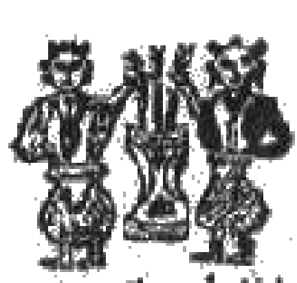

*Gambar Rajah Asli Halaman 21* — Gambar talisman buruj al-Jauza' (Gemini): dua sosok manusia mengapit sebuah benda tegak di tengah (lambang "kembar"/alat penimbang). Tidak diterjemahkan; ditampilkan apa adanya sebagai rajah asli kitab.

---

> **STATUS BATCH 2: SELESAI** (halaman cetak 12–21 / halaman PDF 6–10).
> Rajah/wafaq/tilsm batch ini telah di-crop presisi, latar putih, 300 DPI, tersimpan di `rajah/`:
> `rajah_p15_wafaq_huruf.png`, `rajah_p16_tilsam_tsaur.png`, `rajah_p19_wafaq_khatam.png`, `rajah_p21_tilsam_jauza.png`.
> Progres keseluruhan: 10 dari 56 halaman PDF selesai (±18%). Balas "lanjut" untuk Batch 3 (halaman PDF 11–15).

---

# BATCH 3 — HALAMAN PDF 11–15 (HALAMAN CETAK 22–31)

---

## HALAMAN CETAK 22 (Halaman PDF 11, sisi kanan)

**[Teks Arab Asli]**

( الوجه الثالث ) من نظر اليه الشمس يكون رجلا أبيض اللون مصفرة شعره فى اطرافه، حسود؟ يتعالى؟ صداع برأسه ودوخة، معتدل القامة، منكا؟ أو أميرا؟ أو شيخ جماعة، محفوفا من الاكابر، يكتسب المال ويحب الرجال وينال مكابد كثيرة من أهله واقاربه ويكرهونه وهو الظافر بأمورهم؟ كلما كبر سنه ازداد رزقه ويعلو؟ مراتبه، ويكون صدور الوجه واسع الصدرة معتدلا في التجارة بالشرق والقبيلة؟ واولاده ذكور ونساء؟ بالقدوة؟ ويكونون موافقين له فى كل ما يمكن ويقتدرن؟ شأ؟ والله أعلم. ( بيت حياته ومعيشته ) الجوزاء وعطارد: تكون حياته طيبة ومعيشته حميدة وصافى البضاعة؟ اتفق؟ مع الخارق؟ ويقضى مراد؟ ان لا يكتمه ويسمع المعروف مع غير اهله ولا يضيع عند الله، ودائقته؟ جيدة كلما كبر سنه زاد رزقه وعلا شأنه وانصلح حاله وارتفع مقامه عند الاكابر ولا يموت الا فى نعمة والله أعلم. ( بيت ماله وكسبه ) السرطان والقمر: يكون قليل المال فى سفره كثير المال فى كبره، كدود؟ يجمع المال من تجارة أو سبب ويستغنى به عن أقاربه، كثير اللهو والطرب، ينال كنزا أو خبيئة؟ ويصيبهما فى الحب وسباع؟ الانعام؟ وشرب الخمر والبيصارات؟ والسعى فى الخمول والخسارات، ثم بعد ذلك ينال توبة واصلاحا وريشا؟ والله أعلم

( بيت الاخوة والأخوات ) الاسد والشمس: يكون له أخوة ذكور وأخوات ان؟ لمحلقة؟ المشترى لم يكن له اخوة ذكور، وان كان له اخوة ذكور لا يتفق معهم ويحصل بينه وبينهم عداوة، وربما دفن أكثرهم ويغرب عن وطنه واهله والله أعلم. ( بيت آبائه وامهاته ) السنبلة وعطارد: يكون له حظ من أبويه فى صغره ويشقى بها فى كبره، وربما فرقهم وخرج برأيه؛ وان نحط؟ مولده زحل دفن أما بل؟ أبيه، وان نحسه؟ المشترى دفن أباه قبل أمه ويرث منهما ملكا وضمانا؟ ونال به خاتمة؟ شر أو خيرات؟ مع اخوته، فان ورث طلا؟ لم يبق منه شىء ولم ينتفع منه بشىء والله أعلم. ( بيت اولاده وافراحه )

**[Transliterasi Latin Fonetik]**

*(al-wajhuts-tsaalitsu  min nazhara ilayhisy-Syamsi yakuunu rajulan abyadhul-lawni mushfarrata syi'rihi fii atharaafah, hasuudun? yata'aalaa? shudaa'un bira'sihi wa dawkhatin, mu'tadilul-qaamati, minkaa? aw amiiran? aw syaykhu jamaa'atin, mahfuufan minal-akaabiri, yaktasibul-maali wa yuhibbur-rijaali wa yanaalu mukaabidu katsiiratun min ahlihi waaqaarabah wa yakrahuunahu wa huwazh-zhaafiri bi'umuurihim? kullamaa kibari sinnuhu izdaada rizquhu wa ya'luu? maraatibahu, wa yakuunu shuduural-wajhu waasi'ush-shadrati mu'tadilan fit-tijaarati bisy-syarqi wal-qabiilati? waawlaadah dzukuurin wa nisaa'un? bil-qudwati? wa yukawwinuuna muwaafiqayni lahu fii kullu maa yammikunna wa yaqtadiranna? sya'? wallaahu a'lamu. (baytu hayaatihi wa ma'iisyatihi  al-Jawzaa'i wa 'Uthaarida  takuunu hayaatihi thayyibatun wa ma'iisyatihi hamiidatun wa shaafaal-bidhaa'atu? ittafaqa? ma'al-khaariqi? wa yuqdhaa muraadun? anna laa yaktumuhu wa yasma'ul-ma'ruufu ma'a ghayri ahalah wa laa yadhii'u 'inda Allaahi, wadaa'aqatah? jayyidata kullamaa kibari sinnuhu zaada rizquhu wa 'allaa sya'nihi wa inshalaha haaluhu wa irtafa'a maqaamuhu 'indal-akaabiri wa laa yamuutu illaa fii ni'matin wallaahu a'lamu. (baytu maalihi wa kasbihi  as-Sarathaani wal-Qamari  yakuunu qaliilul-maali fii safarihi katsiirul-maali fii kibarihi, kaduudin? yajma'ul-maali min tijaaratin aw sababu wiisataghan bihi 'an aqaaribihi, katsiirul-lahwi wath-tharabi, yanaalu kanzaa aw khabii'atun? wa yushiibuhumaa fil-hubbi wa sibaa'in? al-ana'aam? wa syaribal-khamra waalabiishaaraat? was-sa'aa fil-khumuuli wal-khasaaraati, tsumma ba'da dzaalika yanaalu tawbatin waashalaahaa wa riisyan? wallaahu a'lamu*) *(baytul-ikhwati wal-ukhuwwaati  al-Asadi wasy-Syamsi  yakuunu lahu ukhuwwati dzukuurin wa akhawaatin anna? limihlaqatan? al-Musytarii lam yakunnu lahu akhuuh dzukuurin, wa in kaana lahu akhuuh dzukuurin laa yattafiqu ma'ahum wa yuhashshilu baynahu wa baynahum 'adaawatan, wa rubbamaa dafnin aktsaruhum wa yughribu 'an wa thanihi waahalah wallaahu a'lamu. (baytu aabaa'ihi waamahaatah  as-Sunbulati wa 'Uthaarida  yakuunu lahu hazhzhun min ubuwwiyyihi fii shigharihi wa yusyqaa bihaa fii kibarihi, wa rubbamaa fa-rqihim wa kharraja bira'yihi; wa in nuhith? mawlidahu Zuhala dafnin ammaa bal? abiihi, wa in nahsihi? al-Musytarii dafnu abaahu qabla ummihi wa yaritsu minhumaa malikan wa dhamaanan? wa naala bihi khaatimatin? syarrin aw khayraatun? ma'a akhuutah, fa-in wirtsi thallan? lam yabqa minhu syay'in walam yantafi'u minhu bisyaa'in wallaahu a'lamu. (baytu awlaadah waafaraahah *) **[Terjemahan Indonesia]**

(Wajah ketiga) Bila yang memandangnya Matahari: ia menjadi laki-laki berkulit putih dengan rambut kekuningan di ujung-ujungnya, pendengki?/sombong?, sakit kepala dan pening, sedang perawakannya, […]? atau amir? atau ketua suatu golongan; dikelilingi para pembesar; ia memperoleh harta, menyukai kaum lelaki, dan menanggung banyak penderitaan dari keluarga serta kerabatnya padahal mereka membencinya, namun ia justru menang atas urusan-urusan mereka?; semakin tua usianya semakin bertambah rezekinya dan meninggi? derajatnya; ia berwajah? berjiwa luas dan sederhana dalam berdagang di timur dan di kabilah?; anak-anaknya laki-laki dan perempuan? […] dan mereka selalu sesuai dengannya dalam segala yang mungkin dan sanggup. Wallahu a'lam.

(Rumah kehidupan dan penghidupannya) Gemini dan Merkurius: kehidupannya baik, penghidapannya terpuji, dan dagangannya? bersih […]; ia menunaikan maksud? dan tidak menyembunyikannya, serta mendengar yang makruf bersama orang selain keluarganya dan tidak menyia-nyiakannya di sisi Allah; dan keadaannya? baik: semakin tua semakin bertambah rezekinya, meninggi kedudukannya, membaik keadaannya, dan terangkat derajatnya di sisi para pembesar; dan ia tidak meninggal kecuali dalam kenikmatan. Wallahu a'lam.

(Rumah harta dan penghasilannya) Cancer dan Bulan: hartanya sedikit dalam bepergiannya dan banyak pada masa tuanya; ia pekerja keras? yang mengumpulkan harta dari perniagaan atau suatu sebab, lalu merasa cukup dengannya dari kerabatnya; ia banyak hiburan dan keceriaan; ia memperoleh harta simpanan atau benda tersembunyi? lalu menghabisannya? dalam cinta dan […]? dan meminum khamar serta […]? serta berusaha dalam kemalasan dan kerugian-kerugian; kemudian setelah itu ia memperoleh taubat, perbaikan, dan bulu (sayap/kekayaan)? Wallahu a'lam.

(Rumah saudara-saudara laki-laki dan perempuan) Leo dan Matahari: ia mempunyai saudara laki-laki dan saudara perempuan […]; bila Yupiter […], ia tidak punya saudara laki-laki; dan bila ia punya saudara laki-laki, ia tidak cocok dengan mereka dan timbul permusuhan di antara mereka, boleh jadi ia menguburkan (memakamkan) kebanyakan mereka, dan ia merantau jauh dari tanah air dan keluarganya. Wallahu a'lam.

(Rumah bapak-bapak dan ibunya) Virgo dan Merkurius: ia beruntung dari kedua orang tuanya pada masa kecilnya dan susah payah karena keduanya pada masa tuanya; boleh jadi ia memisahkan mereka dan keluar dengan pendapatnya sendiri; bila Saturnus kelahirannya menurun?, ia memakamkan ibunya lebih dulu daripada ayahnya; dan bila Yupiter menyulitkannya?, ia memakamkan ayahnya sebelum ibunya, dan ia mewarisi dari keduanya kekuasaan dan tanggungan? serta memperoleh dengannya penutup? keburukan atau kebaikan-kebaikan? bersama saudara-saudaranya; namun bila ia mewarisi […], tidak tersisa sedikit pun darinya dan ia tidak mengambil manfaat sedikit pun darinya. Wallahu a'lam.

(Rumah anak-anak dan kegembiraannya)…

---

## HALAMAN CETAK 23 (Halaman PDF 11, sisi kiri)

**[Teks Arab Asli]**

الميزان والزهرة: يكون قليل الحظ من اولاده وربما كان أكثرهم ذكورا، وربما يصاب فيهم بالدين والنظرة، ويرزق من الاولاد بالبر؟ ويموت أكثرهم؛ وان كان أول أولاده أنثى فلا يعيش له أحد منهم ويحزن على ولد منهم والله أعلم. ( بيت أمراضه وأعلاته ) العقرب والمريخ: يكون الاحب؟ عليه الحرارة والرطوبة، فيكثر من أكل البقل والحل؟ فى فصل الربيع، ويقصد فى عرق الفضال؟ من يمينه يوم الأربعاء ساعة المريخ؛ وإن قوى به البلغم فليؤخذ؟ زدر؟ حورمل؟ مصادر؟ اهليلج؟ وربيث؟ كذلك وشونيز كذلك ولبان؟ ذكر كذلك، ثم ينحل السكر؟ فى قدر ما ينصرم؟ من الماء ويصفى على أريقية؟ عرق؟ قدس؟ ويشرب ثم يتداوى؟ ويستعمل بعد ذلك الأطريفل الكبير فهو نافع له؛ وأحسن شرا به؟ القوية التى فى برج السرطان والتمر: فيأخذ سنامكى در همين وإطليلج در همين وتمر هندى وسكر من؟ دراهم، ثم يأخذ ماء قدر خمسة فناجيل ويطبخهم مثل الشورة؟ إلى أن ينقص الثلث ثم يشرب الباقى عند الصباح على الريق، وتكون المسلوقة حاضرة فيشرب من المرق يرى صعبا؟ والله أعلم. ( بيت نسائه وموصلاته؟ ) القوس والمشترى: يتزوج بابنتى؟ بكر، ونساؤه بالهواء؟ من واحدة إلى سبعة؛ وأحسن نساء الذهبيات؟ لأنهم لا يعرفون؟ خيره؛ وربما قرن الأولى بموت أو طلاق؛ ويرزق ولدا من امرأة بلا كتاب؛ ويصيب عند النساء؟ ولا بد من امرأة تعمل له سحرا وتعلمه؟ له فى الطعام الذى يأكله؛ ويحتاج إلى هذه الأسماء والآيات الشريفة يجعلها عليها؟ تكوه؟ أمانا وحفظا من جميع الأذى والمضرات ولا بأس عليه، وهى هذه التسمية والفاتحة وآية الكرسى والمعوذتان وهذه الأسماء وهم:

**[Transliterasi Latin Fonetik]**

*al-Miizaani waz-Zuharati  yakuunu qaliilul-hazhzhi min awlaadah wa rubbamaa kaana aktsaruhum dzukuuran, wa rubbamaa yushaabu fiihum bid-diini wan-nazharati, wa yurzaqu minal-awlaadi bil-barri? wa yamuutu aktsaruhum; wa in kaana awwalu awlaadihi anatsaa fa-laa ya'iisyu lahu ahadin minhum wa yahuzna 'alaa waladin minhum wallaahu a'lamu. (baytu amraadhihi wa a'laatihi  al-'Aqrabi wal-Mirriikhi  yakuunul-ahab? 'alayhil-haraarati war-ruthuubati, fa-yuktsiru min akull al-baqli wal-halli? fii fashlun ar-rabii'i, wa yaqshidu fii 'irqil-fudhdhaali? min yamiinahu yawmal-Arbi'aa'i saa'atal-Mirriikhi; wa in quwan bihil-balghami fa-layu'khadz? zadar? huuramal? mushaadarun? ahaliilaj? warabiits? kadzaalika wa syuuniizin kadzaalika wa libaanin? dzakara kadzaalika, tsumma yanhulus-sukkaru? fii qadrin maa yansharimu? minal-maa'i wa yushaffaa 'alaa arayyiqiyyatan? 'irqun? qudsun? wa yasyrabu tsumma yatadaawaa? wa yasta'milu ba'da dzaalikal-athariifal al-Kabiiru fa-huwa naafi'in lahu; wa ahsanu syarran bihi? al-quwwiyyatal-latii fii burjus-Sarathaani wat-tamri  fa-ya'khudzu sanaamakaa dur hammayni wa'athaliilaj dur hammayni wa tamri hindii wa sukkarin min? daraahum, tsumma ya'khudzu maa'u qadri khamsatun fanaajiil wa yuthabbikhuhum mitsl asy-syawwarati? ilaa an yanqushuts-tsultsu tsumma yasyrabul-baaqii 'indash-shabaahi 'alaa ar-rayyiqi, wa takuunul-masluuqatu haadhiratun fa-yasyrabu minal-maraqi yaraa sha'ban? wallaahu a'lamu. (baytu nisaa'ihi wa mawshilaatihi ؟) al-Qawsi wal-Musytarii  yatazawwaju biaabnatii? bikarrin, wa nisaa'uhu bil-hawaa'i? min waahidatun ilaa sab'atun; wa ahsanu nisaa'idz-dzahabiyyaati? la'annahum laa ya'rufuuna? khayrahu; wa rubbamaa qarnil-uulaa bimawtin aw thalaaqu; wa yurzaqu waladan min imra'atun bilaa kitaabi; wa yushiibu 'indan-nisaa'i? wa laa badda min imra'atun ta'malu lahu saharan wa ta'allumahu? lahu fith-tha'aamil-ladzii ya'kuluhu; wa yahtaaju ilaa haadzihil-asmaa'a wal-aayaatisy-syariifati yaj'aluhaa 'alayhaa? takwihi? ammaan wa hafizhaa min jamii'il-adzaa wal-mudhirraati wa laa ba'asin 'alayhi, wa hiya haadzihit-tasammiyatu wal-faatihatu wa aayatul-kursii waalama'uudzataan wa haadzihil-asmaa'a wa hum *

**[Terjemahan Indonesia]**

…Libra dan Venus: keberuntungannya dari anak-anaknya kecil; boleh jadi kebanyakan mereka laki-laki; boleh jadi ia tertimpa musibah pada mereka dalam hal agama dan pandangan (mata); ia diberi rezeki anak melalui kebaktian?; dan kebanyakan mereka meninggal; bila anak pertamanya perempuan, maka tidak ada seorang pun dari mereka yang hidup baginya, dan ia berduka atas salah seorang anaknya. Wallahu a'lam.

(Rumah penyakit-penyakit dan cacatnya) Scorpio dan Mars: yang dominan padanya ialah panas dan lembap; maka hendaklah ia memperbanyak makan sayuran dan […]? pada musim semi, dan ia membidik urat al-Fadlal? di (lengan) kanannya pada hari Rabu jam Mars; dan bila dahak (balgham) menguat padanya, hendaklah diambil? […] zur? hawrmal? (peganum — biji syajarah?), mashadir? (mur/bdellium?), ihlilaj (kemiri/kabaraka — myrobalan), rabits? demikian pula, syuniz (jintan hitam) demikian pula, dan luban? (kemenyan) dzakar demikian pula; kemudian gula dilarutkan? secukupnya […] dalam air, disaring di atas […]? lalu diminum, kemudian ia berobat? dan memakai setelah itul-Athrifal al-Kabir (obat triphala besar), karena itu bermanfaat baginya; dan sebaik-baik yang diminum? ialah yang kuat yang berada di buruj Cancer, serta kurma: maka ia mengambil sanamaki (daun senna) dua dirham, ithlilaj (myrobalan) dua dirham, tamar hindi (asam jawa), dan sukkar? […] dirham; kemudian ia mengambil air sebanyak lima cangkir dan merebusnya seperti syawrah? hingga berkurang sepertiganya, lalu meminum sisanya pada pagi hari dengan perut kosong, dengan rebusannya tersedia sehingga ia meminum kuahnya […]. Wallahu a'lam.

(Rumah istri-istri dan hubungan-hubungannya?) Sagittarius dan Yupiter: ia menikahi dua gadis? perawan, dan istri-istrinya berelemen udara? dari satu sampai tujuh; dan sebaik-baik wanita ialah yang keemasan? karena mereka tidak mengetahui? kebaikannya; boleh jadi yang pertama digabungkan (diakhiri) dengan kematian atau cerai; ia diberi rezeki anak dari seorang wanita tanpa kitab (akad); dan ia mendapat […] dari para wanita; dan tak terhindar ada seorang wanita yang membuat sihir untuknya dan menaruhnya? pada makanan yang ia makan; maka ia memerlukan nama-nama dan ayat-ayat mulia ini untuk dijadikannya di atasnya? sebagai keamanan dan penjagaan dari semua gangguan dan bahaya, dan tidak ada bahaya baginya. Nama-nama dan ayat itu ialah: Basmalah, al-Fatihah, Ayat Kursi, dua surah perlindungan (al-Falaq dan an-Nas), serta nama-nama ini, yaitu:

**[Gambar Rajah Asli Halaman 23 — Satar Huruf & Angka (baris rajah)]**

*Gambar Rajah Asli Halaman 23* — Baris rajah (satar) berisi huruf, angka, dan tanda mistik: مـ ح ح ح ح (mim-ha-ha-ha-ha), tanda ××, deret angka ٦١١١١ ٥٦٦٦٥, huruf ح ح ح, dan simbol pengait di ujung kanan. **Keterangan cara baca menurut kitab:** baris ini adalah rajah pelengkap nama-nama dan ayat pelindung di atas (Basmalah, Fatihah, Ayat Kursi, Mu'awwidzatain) yang dipakai agar pemilik buruj aman dari sihir dan bahaya; dilanjutkan teks: "dan Kami turunkan dari al-Qur'an sesuatu yang menjadi penawar dan rahmat bagi orang-orang beriman" serta "sekiranya Kami turunkan al-Qur'an ini kepada gunung…" — ayat; "dan Allah dari belakang mereka meliputi" — "bahkan ia adalah al-Qur'an yang mulia, di dalam Lauh yang terpelihara". Wallahu a'lam.

**[Teks Arab Asli — lanjutan]**

( بيت موته وخوفه ) الجدى وزحل: يخاف عليه من الموت اذا كان طالع السنة بهما وهو ابن سبع سنين أو إحدى عشرة سنة الى خمسة وعشرين سنة، فان نجا من ذلك كله عاش الى ثمانين سنة أو أزيد والله أعلم

**[Transliterasi Latin Fonetik]**

*(baytu mawtihi wa khawfihi  al-Jadyi wa Zuhala  yukhaafu 'alayhi minal-mawti idzaa kaana thaali'is-sanati bihimaa wa huwa ibni sab'i siniina aw ahdaa 'asyrata sanatin ilaa khamsatun wa 'isyriina sanatin, fa-in najaa min dzaalika kullihi 'aasya ilaa tsamaaniina sanatin aw azyadu wallaahu a'lamu*) **[Terjemahan Indonesia]**

(Rumah kematian dan ketakutannya) Capricorn dan Saturnus: ia patut khawatir akan kematian bila thali' tahun keduanya itu, saat ia berumur tujuh tahun atau sebelas tahun sampai dua puluh lima tahun; bila ia lolos dari semua itu, ia hidup sampai delapan puluh tahun atau lebih. Wallahu a'lam.

---

## HALAMAN CETAK 24 (Halaman PDF 12, sisi kanan)

**[Teks Arab Asli]**

( بيت أسفاره وأحلامه ) الدلو؟ وزحل: يكون كثير الأسفار وينال من سفره خيرا، وأحسن سفره يوم السبت باكر النهار الى جهة المغرب والقبلة؟ وسفره فى البحر خير له من البر، وينال خيرا من رجل جليل القدر، ويحال فى سفره مستغلات؟ فلالل؟ وينجو منها والله أعلم. ( بيت عزه وسلطانه ) الحوت والمشترى: يكون له حظ من أرباب الأقلام كالقضاة وأهل الديواوين والمباشرين، ويكون مقبولا عندهم ويفضلون؟ له حاجات كثيرة، وينال معزة من قبل رجل جليل القدر فيحصل له منه خير ورفعة شأن عظيم، ولا يأمن؟ حاسدا فيحذر منه فلا يسعى له فى الأذى والمضرات والله أعلم. ( بيت رجاله وماله ) الحمل والمريخ: يكون ثابتا بعقله ولمحسن؟ العاقبة محمود السريرة؟ ويؤمل آمالا كثيرة وينال ما يؤمله ويرجيه ولا يموت الا فى نعمة من الله تعالى والله أعلم. ( بيت أعدائه وحساده ) الثور والزهرة: يكون له أعداء كثيرة من كل لون أسود أو أحمر ومن أكل طعامه علماء؟ وهو منصور عليهم مؤيد لوقته، ويخاف عليه من رجل غليظ الجبهة وجيه؟ آخر يسعى فى هلاكه فليحذر منه؛ ويحذر ممن كان نجمه ترابيا كالجدى والسنبلة والثور فانهم أكثر أعدائه ولو طالت صحته؟ معهم؛ ويوافقه من النساء والرجال من كان نجمه هوائيا؟ كالجوزاء والميزان والدلو؟ فانهم أحسن أصدقائه؛ ويوافقه من الخدام؟ ومن الخصوص الفيروزج أو الزمرد؛ ثم ينظر الهلال عن وجه ذكر فيكون ذلك الشهر مباركا عليه؛ وأحسن دوابه الدم الذى كثر؟ وأحسن لباسه الأخضر والأزرق الكتانى؛ وإن أراد قضاء حاجة من كبير أو صغير فليقصده يوم الأربعاء باكر النهار وخاتم عطارد فى يده اليمنى فان حاجته تقضى سريعا ويقصد؟ خصمه؛ ويكثر من استخراج الدم فى فصل الربيع؛ وإن أراد أن يكون مقبولا عند كل من رآه ويكون معزوزا آمنا من كل شىء فليرصد القمر اذا نزل برج الجوزاء ويكون يوم الأربعاء ويصير؟ الساعة ويصنع له خاتما من فضة وزنه ثلاثة دراهم وينقش عليه هذا الخاتم ويصفره؟ بخلوق؟ أحب؟ آسى؟ ويحمله فانه يأمن من كل شىء وهذا هو الخاتم المبارك

**[Transliterasi Latin Fonetik]**

*(baytu asfaarihi wa ahlaamihi  ad-Dalwi? wa Zuhala  yakuunu katsiirul-asfaari wa yanaalu min safarihi khayran, wa ahsanu safarihi yawmas-Sabti baakiran-nahaari ilaa jihatil-maghribi wal-qibalati? wa safarihi fil-bahri khayrun lahu minal-barri, wa yanaalu khayran min rajulin jaliilul-qadri, wa yuhaalu fii safarihi mustaghillaatin? falaalal? wa yanjuu minhaa wallaahu a'lamu. (baytu 'izzihi wa sulthaanihi  al-Huuti wal-Musytarii  yakuunu lahu hazhzhun min arbaabil-aqlaami kal-qudhaati wa ahlid-diiwaawiin wal-mubaasyiriina, wa yakuunu maqbuulan 'indahum wa yufdhiluuna? lahu haajaatin katsiiratun, wa yanaalu ma'zatan min qabla rajulin jaliilul-qadri fa-yuhashshilu lahu minhu khayrun wa raf'ata sya'ni 'azhiimun, wa laa ya'manu? haasidan fa-yuhadzdziru minhu fa-laa yas'aa lahu fil-adzaa wal-mudhirraati wallaahu a'lamu. (baytu rujjaalihi wa maalihi  al-Hamali wal-Mirriikhi  yakuunu tsaabitan bi'aqlihi wa limuhsinin? al-'aaqibata mahmuudus-sariirati? wa yu'malu aamaalaa katsiiratun wa yanaalu maa yu'ammiluhu wa yurajjiihi wa laa yamuutu illaa fii ni'matin min Allaahi Ta'aalaa wallaahu a'lamu. (baytu a'daa'ihi wa hussaadihi  ats-Tsawri waz-Zuharati  yakuunu lahu a'daa'i katsiiratun min kullu lawni aswadu aw ahmaru wa min akull tha'aamihi 'ulamaa'a? wa huwa manshuurin 'alayhim mu'ayyida liwaqathu, wa yukhaafu 'alayhi min rajulin ghaliizhil-jabhati wajiihun? aakhara yas'aa fii hullaakihi fa-layuhadzdziru minhu; wa yuhadzdziru mimman kaana najmihi turaabiiaa kal-Jadyi was-Sunbulati wats-Tsawri fa-inhim aktsaru a'daa'ihi walaw thaalat shihhatahu? ma'ahum; wa yuwaafiquhu minan-nisaa'i war-rijaali min kaana najmihi hawaa'iyyan? kal-Jawzaa'i wal-Miizaani wad-Dalwi? fa-inhim ahsanu ashdiqaa'ihi; wa yuwaafiquhu minal-khaddaami? wa minal-khashuush al-fiiruuzaja aw az-zumurrudu; tsumma yanzhurul-halaalu 'an wajhi dzakara fa-yakuunu dzaalikasy-syahru mubaarakan 'alayhi; wa ahsanu dawaabbihid-damil-ladzii kutsru? wa ahsanu libaasihil-akhdharu wal-azraqul-kattaaniyyi; wa in araada qadhaa'a haajatin min kabiirun aw shaghiirun fa-layaqshiduhu yawmal-Arbi'aa'i baakiran-nahaari wa khaatamu 'Uthaarida fii yadihil-yumnaa fa-in haajatihi tuqdhaa sarii'an wa yaqshidu? khashmahu; wa yuktsiru min istikhraajid-dami fii fashlun ar-rabii'i; wa in araada an yakuunu maqbuulan 'inda kullu min ra'aah wa yakuunu ma'azuuzaa aaman min kullu syay'in fa-layarshudul-Qamari idzaa nuzil burjul-Jawzaa'i wa yakuunu yawmal-Arbi'aa'i wa yashiiru? as-saa'atu wa yashna'u lahu khaatiman min fidhdhati waznihi tsalaatsatun daraahimi wa yanqusyu 'alayhi haadzaal-khaatamu wa yushaffiruhu? bikhaluuqin? ahubbun? aasaa? wa yahmiluhu fa-innahu ya'ammanna min kullu syay'in wa haadzaa huwal-khaatamul-mubaaraki*) **[Terjemahan Indonesia]**

(Rumah perjalanan-perjalanan dan mimpi-mimpinya) Aquarius? dan Saturnus: ia banyak bepergian dan memperoleh kebaikan dari perjalanannya; perjalanannya yang terbaik ialah hari Sabtu pagi hari ke arah barat dan kiblat?; perjalanan lautnya lebih baik baginya daripada darat; ia memperoleh kebaikan dari seorang laki-laki berbudi besar; dan ia tertimpa dalam perjalanannya perkara-perkara yang dipersengketakan? […] namun ia selamat darinya. Wallahu a'lam.

(Rumah kewibawaan dan kekuasaannya) Pisces dan Yupiter: ia beruntung dari kalangan pemilik pena seperti para qadhi (hakim), orang-orang diwan, dan para pelaksana; ia diterima di sisi mereka dan mereka melebihkan? hajat-hajatnya yang banyak; ia memperoleh kemuliaan dari seorang laki-laki berbudi besar sehingga ia mendapat kebaikan darinya dan ketinggian derajat yang besar; namun ia tidak aman? dari pendengki, maka hendaklah ia berhati-hati darinya agar orang itu tidak berusaha menyakitinya dan membahayakannya. Wallahu a'lam.

(Rumah orang-orang dan hartanya) Aries dan Mars: ia teguh dengan akalnya, baik? kesudahannya, terpuji hati kecilnya?; ia mencita-citakan harapan-harapan yang banyak dan memperoleh apa yang ia cita-citakan dan ia harapkan, dan ia tidak meninggal kecuali dalam kenikmatan dari Allah Ta'ala. Wallahu a'lam.

(Rumah musuh-musuh dan para pendengkinya) Taurus dan Venus: ia mempunyai banyak musuh dari setiap warna hitam atau merah dan dari orang-orang yang makan makanannya […]; namun ia ditolong atas mereka dan dikuatkan pada waktunya; ia patut khawatir terhadap seorang laki-laki lebar dahi, […]? yang lain, yang berusaha membinasakannya, maka hendaklah ia berhati-hati darinya; dan hendaklah ia berhati-hati dari orang yang bintangnya berelemen tanah seperti Capricorn, Virgo, dan Taurus, karena mereka adalah musuh-musuh terbanyaknya walau lama kesehatannya? bersama mereka; dan yang cocok baginya dari wanita dan laki-laki ialah yang bintangnya berelemen udara? seperti Gemini, Libra, dan Aquarius?, karena mereka adalah sahabat-sahabat terbaiknya; dan yang cocok baginya dari pelayan-pelayan? dan dari batu-batu khusus ialah firuzah (turki) atau zamrud; kemudian hendaklah ia memandang hilal dari wajah laki-laki, maka bulan itu menjadi berberkah baginya; sebaik-baik hewan tunggangannya ialah yang merah? banyak?; dan sebaik-baik pakaiannya ialah hijau dan biru dari katan (linen); bila ia ingin menunaikan hajat dari orang besar atau kecil, hendaklah ia mendatanginya pada hari Rabu pagi hari dengan khatam (cincin) Merkurius di tangan kanannya, maka hajatnya tertunaikan dengan cepat dan ia menundukkan? lawannya; dan hendaklah ia memperbanyak mengeluarkan darah (bekam/fashdu) pada musim semi; dan bila ia ingin diterima di sisi setiap orang yang melihatnya serta menjadi perkasa dan aman dari segala sesuatu, hendaklah ia mengamati Bulan ketika turun di buruj Gemini, yaitu pada hari Rabu, dan ia melakukan? pada jam itu, lalu membuatkan khatam dari perak seberat tiga dirham, mengukirkan padanya khatam ini, mengasapinya? dengan khaluq? (minyak wangi campuran) / [habb?] / asy? lalu memakainya, maka ia aman dari segala sesuatu — dan inilah khatam yang diberkahi itu.

---

## HALAMAN CETAK 25 (Halaman PDF 12, sisi kiri)

**[Teks Arab Asli]**

وان كان فقير الحال ولا له طاقة على الخاتم فليوحد؟ القمر كما ذكرنا ويكتب له هذه الأسماء بمسك وزعفران وجاء؟ ورد؟ يوم الأربعاء ساعة عطارد فانه يكون آمنا من جميع الأعداء، وهى هذه: بسم الله الرحمن الرحيم كتب الله لأغلبن أنا ورسلى؟ […] طاش طيوش طشى أم هالش هو هو سيوح قدوس رب الملائكة والروح — [سطر الرموز الأول] — ص ص ص ص ص د لامه ح ح ح ١١١ ح ل ٦٩٦ ص ٩٢ ١٦٩١ م ط ل ٢٢ ٩١٦٤ ح ط ل ١١١١١١١ ك ل ١١١ م ال ح ٩٤١ ل — [سطر الرموز الثاني] — ولا حول ولا قوة إلا بالله العلى العظيم وصلى الله على سيدنا محمد وعلى آله وصحبه وسلم.

( ولصاحب هذا البرج من أشكال الرمل شكل البياض ) الذى يذهب عنا الحزن، ان ربنا لغفور شكور. أبشر أيها السائل بالفرح والسرور وابتهاج الأمور وما تقصده من سائر الأمور، فقد أتاك من الأشكال البياض وهو سعيد مع حسن الحركات، قلب؟ نساء؟ وقر عينا بقضاء الحوائج ونجح؟ مال وقدوم غائب، فتوكل على الله فى سائر حركاتك ونجاح أمرك؟ وصرك؟ على من يعاديك؛ ولكن ورائك شخص يضمر منك، ولكن يحصل لك الخير وفرح القلب بزوال الضرر وحسرة المخاطر؛ وأنت أيها السائل تريد اجتماعا بشخص فلا بد من اجتماعك عليه عن قريب أو غائب أو حبيب؛ وأراك عازما على أمر وأنت فيه تقدم وتتأخر وتقول أفعل أولا أفعل، فأعزم على مطلوبك تستعد؟ وتوكل على الله فالحاجة مقضية وأمورك مرضية؛ ولا بد من ولد يولد لك فأبشر بالخير والرزق؛ ولا بد من خير بلا تعب؟ بتوفيق ببركة سيدنا يوسف الصديق؛ فهذا ما دل عليه الثابت؟ راسخ؟ ما قال: أبشر ينال سعيد وجميل المراد، وأبشر بظهور الأعداء والحساد.

**[Transliterasi Latin Fonetik]**

*wa in kaana faqiiril-haali wa laa lahu thaaqatin 'alaal-khaatamu fa-layuwahhidu? al-Qamari kamaa dzakaran wa yaktubu lahu haadzihil-asmaa'a bimaskin wa za'faraanin wa jaa'a? wa raddun? yawmal-Arbi'aa'i saa'ata 'Uthaarida fa-innahu yakuunu aaminan min jamii'il-a'daa'i, wa hiya haadzihi  Bismillaahir-Rahmaanir-Rahiim kutuba Allaahi li-aghlibanna an warasalaa ؟[…] thaasya thiiwasy thasyaa am haalasy huwa huwa suyuuhi qadduusin rabbil-malaa'ikati war-rawhi —[ sathrar-rumuuzil-awwalu ]— sh sh sh sh sh d laamahu h h h 111 h l 696 sh 92 1691 m th l 22 9164 h th l 1111111 k l 111 m alan h 941 l —[ sathrar-rumuuzits-tsaanii ]— wa laa hawl wa laa quwwatin illaa billaahil-'Aliyyil-'Azhiimi wa shallaa Allaahi 'alaa sayyidinaa Muhammadin wa 'alaa aalihi wa shahbihi wa sallama.*

*(wa li-shaahibi haadzaal-burji min asykaalir-ramli syaklul-bayaadhi  al-ladzii yadzhabu 'an al-huznu, anna rabbinaa li-ghafuuri syakuuri  abasysyara ayyuhas-saa'ilu bil-farahi was-suruuri wa ibtihaajil-umuuri wa maa taqashshudihi min saa'iril-umuuri, fa-qad ataaka minal-asykaalil-bayaadhi wa huwa sa'iidi ma'a hasanul-harakaati, qalbun? nisaa'an? wa qarra 'ayyinaa biqadhaa'il-hawaa'iji wa najaha? maalin wa qaduumu ghaa'ibu, fa-tuukilu 'alaa Allaahi fii saa'iri harakaatika wa nujjaahi amrika? wa shurka? 'alaa min yu'aadiika; walakinn waraa'ak syakhshun yudhmiru minaka, walakinn yuhashshilu lak al-khayri wa farahil-qalbi bizawaalidh-dharari wa hasratil-makhaathiri; wa'ant ayyuhas-saa'ilu turiidu ijtimaa'an bisyakhshin fa-laa badda min ijtimaa'ika 'alayhi 'an qariibin aw ghaa'ibun aw habiibu; wa arraaka 'aazimaa 'alaa amrin wa'ant fiihi taqadduma wa tata'akhkharu wa taquulu afi'lun awlan afa'alla, fa-u'azzimu 'alaa mathluubika tasta'iddu? wa tuukilu 'alaa Allaahi fal-haajati maqdhiyyatan wa umuuraka mardhayatu; wa laa badda min waladin yuuladu lak fa-ubasysyiru bil-khayri war-rizqi; wa laa badda min khayrun bilaa ta'abin? bitawfiiqin bibarakati sayyidinaa yuusaf ash-shadiiqa; fa-haadzaa maa dalla 'alayhits-tsaabita? raasikhun? maa qaala  abasyarun yanaalu sa'iidun wa jamiilul-muraadi, wa ubasysyiru bizhuhuuril-a'daa'i wal-hussaadi *) **[Terjemahan Indonesia]**

Bila ia miskin dan tidak mampu membuat khatam, hendaklah ia menghadap? Bulan sebagaimana telah kami sebutkan, dan hendaklah nama-nama ini dituliskan baginya dengan misk (kesturi) dan za'faran […] pada hari Rabu jam Merkurius, maka ia menjadi aman dari semua musuh. Nama-nama itu ialah: *Bismillahirrahmanirrahim; Allah telah menetapkan: "Aku dan rasul-rasul-Ku pasti menang" […] ṭāsy ṭayyūsy ṭasyā umm hālsy hū hū sayfūḥ quddūs — Tuhan para malaikat dan Ruh* — [baris rajah pertama] — sha sha sha sha sha dāl lāmah ḥā ḥā ḥā 111 ḥā lām 696 sha 92 1691 mīm ṭā lām 22 9164 ḥā ṭā lām 116111611 kāf lām 111 mīm alif lām ḥā 941 lām — [baris rajah kedua] — *wa lā ḥaula wa lā quwwata illā billāhil-'aliyyil-'aẓīm* (tiada daya dan kekuatan kecuali dengan Allah Yang Mahatinggi lagi Mahaagung), dan semoga shalawat serta salam tercurah kepada junjungan kita Muhammad beserta keluarga dan sahabatnya.

(Dan pemilik buruj ini, di antara bentuk-bentuk raml, mempunyai bentuk **al-Bayadh** — "Yang menghilangkan duka dari kami; sungguh Tuhan kami Maha Pengampun lagi Maha Mensyukuri.") Bergembiralah wahai penanya dengan kegembiraan, kesukaan, dan ria-nya urusan serta apa yang engkau tuju dari seluruh urusan; karena telah datang kepadamu dari bentuk-bentuk itul-Bayadh (putih/cemerlang), yang berbahagia bersama baiknya gerakan-gerakan; […]? tenanglah mata dengan tertunainya hajat dan berhasilnya? harta serta datangnya orang yang gaib; maka bertawakallah kepada Allah dalam seluruh gerakanmu dan keberhasilan urusanmu? serta kemenanganmu? atas orang yang memusuhimu; namun di belakangmu ada seseorang yang menyembunyikan (sesuatu) darimu; kendati begitu, kebaikan dan kegembiraan hati akan kau peroleh dengan hilangnya bahaya dan penyesalan risiko-risiko. Engkau wahai penanya menginginkan pertemuan dengan seseorang — maka tak terhindar engkau akan bertemu dengannya tidak lama lagi, baik ia gaib maupun kekasih; dan kulihat engkau bertekad pada suatu perkara padahal engkau maju-mundur dan berkata "kulakukan atau tidak" — maka bertekadlah pada permintaanmu […], dan bertawakallah kepada Allah, karena hajat akan tertunaikan dan urusan-urusanmu diridai; dan tak terhindar seorang anak akan dilahirkan bagimu, maka bergembiralah dengan kebaikan dan rezeki; dan tak terhindar kebaikan tanpa kelelahan? dengan taufik berkat junjungan kita Yusuf ash-Shiddiq. Inilah yang ditunjukkan oleh yang tetap? kokoh? […] katanya: *"Bergembiralah, engkau akan memperoleh kebahagiaan dan maksud yang indah, dan bergembiralah dengan munculnya musuh-musuh dan para pendengki."*

**[Gambar Rajah Asli Halaman 25 — Rajah 1: Wafaq Angka]**

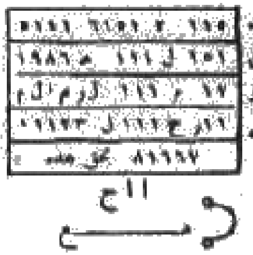

*Gambar Rajah Asli Halaman 25* — Wafaq/tabel angka 5 baris yang menjadi bagian dari "khatam" pelindung bagi pemilik buruj Cancer; angka-angka selnya sebagaimana asli (tidak dialihkan menjadi teks). Dipakai bersama penulisan nama-nama dengan misk dan za'faran pada hari Rabu jam Merkurius agar aman dari semua musuh.

**[Gambar Rajah Asli Halaman 25 — Rajah 2: Satar Huruf & Simbol]**

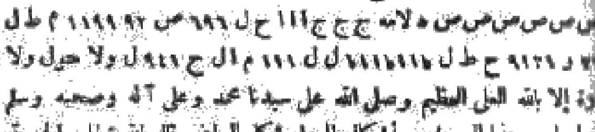

*Gambar Rajah Asli Halaman 25* — Barisan huruf, angka, dan kalimat ruhani yang merupakan lanjutan rajah khatam: memuat "ااح" dengan simbol pengait, lalu deret: ص ص ص ص ص د لامه ح ح ح ١١١ ح ل ٦٩٦ ص ٩٢ ١٦٩١ م ط ل ٢٢ ٩١٦٤ ح ط ل ١١١١١١١ ك ل ١١١ م ال ح ٩٤١ ل ٩١٦٤ ح ط ل … diakhiri "ولا حول ولا قوة إلا بالله العلى العظيم". Tidak diterjemahkan; ditampilkan apa adanya sebagai rajah asli.

**[Teks Arab Asli — lanjutan halaman 25]**

( القول على البرج الرابع وهو برج السرطان والقمر وفيه شعر )

وصاحب السرطان البدر كوكبه * ونوره فى جبين الوجه متصل
يا حسن صاحب هذا النجم ان له * مجدا وقدرا يجوز؟ الله لا علل؟

**[Transliterasi Latin Fonetik]**

*(al-qawli 'alaal-burjir-raabi'u wa huwa burjus-Sarathaani wal-Qamari wa fiihi syi'ra)*

*wa shaahibus-Sarathaanil-badra kawkabuhu * wa nuurihi fii jabiinil-wajhu muttashilun*
*yaa hasanu shaahibu haadzaa an-najmi anna lahu * majdan wa qadran yajuuzu? Allaahi laa 'ilalin?*

**[Terjemahan Indonesia]**

(Perkataan tentang buruj keempat, yaitu buruj Cancer (as-Sarathan) dan Bulan; padanya ada syair:)

*Pemilik Cancer — purnama adalah planetnya * dan cahayanya bersambung di dahi wajah; wahai indahnya pemilik bintang ini, karena baginya * kemuliaan dan kadar yang melampaui? — semoga Allah tiada cacat?…*

---

## HALAMAN CETAK 26 (Halaman PDF 13, sisi kanan)

**[Teks Arab Asli]**

مدور الوجه مقرون حواجبه، له المحظوظ؟ بها الأخطار؟ والبل؟ يمان؟ بالحسن والاحسان والقبل. ( والقول على طبع الطالع واختلاف الوجوه التى للإنسان والطباع التى عليه ) قال الحكيم أبو معشر: هو برج مؤنث؟ ليلى بارد رطب طبيعته البلغم، وهو أول فصل الصيف. المولود به من الرجال يكون أبيض اللون يميل الى صفرة أخضر؟ طبع الوجه والجبين وجيه؟ أتر؟ طويل القامة والمعنوقين؟ البدن، كثير التنقل من مكان الى مكان، عزيز النفس محب نفسه، يصاب بالعين سريعا، يقوى بدنه فى أول الشهر ويتوسع فى آخره، محبوب فى سفره عند الرجال، كثير الفساد، خفيف الروح كئيب؟ يمال؟ مترددا؟ بعينه وينجو منه، وينال شرفا؟ […] بعض الرياض والافراح واحترار؟ ويصيح؟ بدنه؟ فى الماء؟ […] غالب عليه يخاف عليه من الماء ليلحقه شرقة منه وهو صبى وينجو منه؛ ومتى؟ فى الجبل يلتفت خلفه يخاف عليه من الجن؛ وأحسن شهوره أبيب وشهرها؟ متى؟ وان بدأ به مرض يوم الثلاثاء وفى شهر أشهر؟ كان سيئا للموت والغالب عليه البلغم؟؛ يتزوج من النساء بالزوج؟ وان كان القمر مسعودا كان أميرا؟ أو قائدا؟ أو مغنيا؟ وان كان منحوسا كان بخلاف ذلك. وله ثلاثة وجوه. ( الوجه الأول ) من نظرت اليه الزهرة يكون رجلا أزهر الوجه حسن القامة مدور الوجهين حسن العينين والحاجبين والبدن والأطراف، عاشق معشوق محبوب؟ توجه؟ يحب الطيب والزينة والرياض وسماع الألحان وشرب الخمور ومباشرة الاصحاب، بوجهه خال أسود ورأسه نتيجة؟ واسع الصدر مدون؟ لبدن؟ حسن الابتسام، يحب النساء محبة شديدة، كثير الاولاد، يخاف عليه من النساء أنه؟ بعين؟ ما يملكه، وينال منصبا وحصانا؟ على قوم، وينال حجة وزيارة بيت الله الحرام ولا يموت الا فى نعمة من الله والله أعلم. ( الوجه الثانى ) من نظر اليه عطارد يكون رجلا أكثر؟ اللون خفيف الجسم طويل القامة جيد الحاجبين أسود الشعر كاتب؟ حاسبا؟ أو وزيرا؟

**[Transliterasi Latin Fonetik]**

*mudawwarul-wajhu maqruuna hawaajibihi, lahul-mahzhuuzhi? bihaal-akhthaari? waalabal? yummaanun? bil-husni waalaahasaan wal-qibala. (wal-qawli 'alaa thab'uth-thaali'u wa ikhtilaafil-wujuuhil-latii lil-insaana wath-thibaa'il-latii 'alayhi  qaalal-hakiimu Abuu Ma'syarin  huwa burju mu'annatsi? laylaa baaridun rathbun thabii'atihil-balghami, wa huwa awwalu fashlun ash-shayfi  al-mawluudu bihi minar-rijaali yakuunu abyadhul-lawni yamiilu ilaa shifrata akhdhara? thab'ul-wajhu wal-jabiini wajiihun? atiru? thawiilul-qaamati waalama'anuuqiin? al-budinna, katsiirut-tanaqquli min makaani ilaa makaanun, 'aziizan-nafsi muhibbun nafsahu, yushaabu bil-'ayni sarii'an, yuqwaa badanuhu fii awwalusy-syahri wa yatawassa'u fii aakhirihi, mahbuubun fii safarihi 'indar-rijaali, katsiirul-fasaadi, khafiifar-rawhi ka'iibun? yumaalu? mutaraddidan? ba'aynahu wa yanjuu minhu, wa yanaalu syarafaa ؟[…] ba'dhur-riyaadhi waalaafaraah waahataraar? wa yashiihu? buddinnahu? fil-maa'i ؟[…] ghaalibun 'alayhi yukhaafu 'alayhi minal-maa'i liyalhaquhu syarqatun minhu wa huwa shabbaa wa yanjuu minhu; wamataa? fil-jabali yaltafitu khalfuhu yukhaafu 'alayhi minal-jinni; wa ahsanu syahuurah abiibu wasyahrahaa? mataa? wa in bada'a bihi maradhi yawmats-Tsulaatsaa'i wa fii syahru asyhurin? kaana sii'aa lil-mawti wal-ghaalibu 'alayhil-balghami ؟؛ yatazawwaju minan-nisaa'i biz-zawji? wa in kaanal-Qamari mas'uudan kaana amiiran? aw qaa'idan? aw mughanniyan? wa in kaana manhuusan kaana bikhilaafi dzaalika  wa lahu tsalaatsatun wujuuhin. (al-wajhul-awwalu  min nazharat ilayhiz-Zuharati yakuunu rajulan azahral-wajhu hasanul-qaamati mudawwaral-wajihiina hasanul-'aynayni wal-haajibayni wal-badani wal-athraafi, 'aasyiqa ma'syuuqa mahbuubun? tawajjuhun? yuhibbuth-thayyibu waz-zaynatu war-riyaadhu wa samaa'ul-alhaani wa syurbil-khumuuri wa mubaasyiratil-ashhaabi, bi-wajhihi khaalin aswadu wa ra'sihi natiijatan? waasi'ush-shadri mudawwanun? libadanin? hasanul-ibtisaami, yuhibbun-nisaa'i muhibbatu syadiidatu, katsiirul-awlaadi, yukhaafu 'alayhi minan-nisaa'i annahu? ba'ayn? maa yamlikuhu, wa yanaalu manshibaa wa hishaan? 'alaa qawmin, wa yanaalu hujjatan wa ziyaarati baytu Allaahil-Haraami wa laa yamuutu illaa fii ni'matin min Allaahi wallaahu a'lamu. (al-wajhuts-tsaanii  min nazhara ilayhi 'Uthaarida yakuunu rajulan aktsaru? al-lawni khafiiful-jismi thawiilul-qaamati jayyidal-haajibayni aswadusy-syi'ri kaatibun? haasiban? aw wa ziiran?*) **[Terjemahan Indonesia]**

…bulat wajah, bertaut alisnya; ia beruntung? dengannya risiko-risiko? dan […]? […]? dengan kebaikan, kebajikan, dan penerimaan.

(Dan perkataan tentang tabiat thali' serta perbedaan wajah-wajah manusia dan tabiat-tabiat yang berlaku padanya) Berkata sang bijak Abu Ma'syar: ia adalah buruj feminin (mu'annats)?, malamiah (laili), dingin-lembap, tabiatnya dahak (balgham), dan ia adalah awal musim panas. Laki-laki yang dilahirkan di bawahnya menjadi putih warna kulitnya condong ke kuning kehijauan?; tabiat wajah dan dahi […]?; tinggi badan dan […]? tubuhnya; banyak berpindah dari satu tempat ke tempat lain; mulia jiwa dan mencintai dirinya sendiri; cepat terkena 'ain (pandangan); tubuhnya menguat pada awal bulan dan melonggar pada akhirnya; dicintai dalam perjalanannya di kalangan lelaki; banyak kerusakan; ringan jiwa, murung? […]?; dan ia memperoleh kemuliaan? […] sebagian taman dan kegembiraan serta […]? dan tubuhnya? di dalam air? […] ia dikuasai (olehnya); ia patut dikawatirkan terhadap air sehingga ia tersedak karenanya saat masih kecil, namun ia selamat; dan bila? di gunung ia menoleh ke belakang, ia patut dikawatirkan terhadap jin; sebaik-baik bulannya ialah Abib (bulan Qibti) dan bulannya? […]; bila penyakit menyerangnya pada hari Selasa dan pada bulan […]? maka itu buruk menuju kematian dan yang dominan padanya ialah dahak?; ia menikahi wanita berpasangan?; dan bila Bulan berbahagia (mas'ud), ia menjadi amir?, pemimpin?, atau penyanyi?; dan bila Bulan bernasib buruk (manhus), sebaliknya. Buruj ini mempunyai tiga wajah.

(Wajah pertama) Bila yang memandangnya Venus: ia menjadi laki-laki cerah wajah, bagus perawakan, bulat kedua sisi wajah, indah kedua mata, alis, tubuh, dan anggota badan; pencinta dan dicintai […]?; ia menyukai wewangian, perhiasan, taman-taman, mendengarkan lagu-lagu, meminum khamar, dan bergaul dengan para sahabat; di wajahnya ada bintik hitam dan di kepalanya […]?; lebar dada […]?; baik senyumnya; ia mencintai wanita dengan cinta yang sangat; banyak anak; ia patut dikawatirkan terhadap wanita […]? apa yang ia miliki; ia memperoleh jabatan dan kekuasaan? atas suatu kaum; dan ia mencapai haji serta ziarah Baitullah al-Haram, dan tidak meninggal kecuali dalam kenikmatan dari Allah. Wallahu a'lam.

(Wajah kedua) Bila yang memandangnya Merkurius: ia menjadi laki-laki lebih? warna kulit, ringan tubuh, tinggi badan, baik kedua alis, hitam rambut; juru tulis?, penghitung?, atau wazir?…

**[Gambar Rajah Asli Halaman 26 — Tilsm buruj as-Sarathan (Cancer)]**

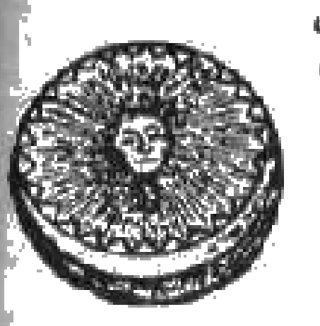

*Gambar Rajah Asli Halaman 26* — Gambar talisman buruj as-Sarathan (Cancer): lingkaran bersinar (matahari/bulan) berwajah manusia di tengahnya. Tidak diterjemahkan; ditampilkan apa adanya sebagai rajah asli kitab.

---

## HALAMAN CETAK 27 (Halaman PDF 13, sisi kiri)

**[Teks Arab Asli]**

ان كان عطارد مسعودا؛ وان كان منحوسا كان غزليا؟ أو غسالا؟ أو ترابيا؟؛ ويكون له علامات بذراعيه أو بطنه ويصيبه غيبه؟؛ ووجهه أتر؟ قانع؟ اللون الأول؛ وان كان منحوسا؟ يكون أبيض اللون يميل الى صفرة أو حمرة، بوجهه علامة أو حمرة؟ بوجهه علامة يسرى؟ له فى الضرر، ويخاف عليه من رجل أحمر اللون بوجهه علامة يسرى؟ له فى الضرر؟، ويخاف عليه من غير أهله؛ ورث؟ مالا؟ وبعد خيبة؟ وينال حجة وزيارة بيت الله الحرام ولا يموت الا أن يرى أولاد أولاده والله أعلم. ( الوجه الثالث ) من نظر اليه القمر يكون رجلا أبيض اللون يميل الى صفرة أو حمرة، بوجهه علامة، رفيق الشفتين؟ حسن الصورة مفضل؟ القامة، أكثر اولاده الاناث، يخاف عليه من غرق البحر ومن حرق النار أو من عضة كلب أو يقع من مكان عال؛ ويوضع لنا غير ابن أمه؟ وكل من صاحبه صار له عدوا حسودا؟ فى كيده؟ يتنكس؟ فى آخر كل شهر عشرة أيام، كثير النوم والسبات والسكت؟؛ والغالب عليه البلغم فى فصل الشتاء أكثر دوامه؛ الاطر؟ يقل

**[Transliterasi Latin Fonetik]**

*anna kaana 'Uthaarida mas'uudan; wa in kaana manhuusan kaana ghazaliiaa? aw ghassaalan? aw turaabiiaa ؟؛ wa yakuunu lahu 'alaamaatin bidziraa'iyyihi aw bathnuhu wa yushiibuhu ghaybuhu ؟؛ wa wajjahahu atiru? qaani'un? al-lawnil-awwalu; wa in kaana manhuusan? yakuunu abyadhul-lawni yamiilu ilaa shifratan aw humratun, bi-wajhihi 'ullaamatan aw humratun? bi-wajhihi 'ullaamata yusraa? lahu fidh-dharari, wa yukhaafu 'alayhi min rajulin ahmarul-lawni bi-wajhihi 'ullaamata yusraa? lahu fidh-dharari ؟، wa yukhaafu 'alayhi min ghayri ahlihi; wa ratstsun? maalan? wa ba'da khaybatin? wa yanaalu hujjatan wa ziyaarati baytu Allaahil-Haraami wa laa yamuutu illaa an yaraa awlaadin awlaadihi wallaahu a'lamu. (al-wajhuts-tsaalitsu  min nazhara ilayhil-Qamari yakuunu rajulan abyadhul-lawni yamiilu ilaa shifratan aw humratun, bi-wajhihi 'ullaamatan, rafiiqasy-syaffatayni? hasanush-shuurati mufadhdhalun? al-qaamati, aktsaru awlaadah al-inaatsa, yukhaafu 'alayhi min ghariqil-bahri wa min harqin-naari aw min 'adhdhatin kalbun aw yuq'i min makaani 'aalin; wa yuudha'u lan ghayri ibni ummihi? wakull min shaahibihi shaar lahu 'aduwwan hasuudan? fii kaydihi? yatanakkasu? fii aakhara kullu syahri 'asyrata ayyaami, katsiirun-nawmi was-sabbaati was-sakti ؟؛ wal-ghaalibu 'alayhil-balghami fii fashlun asy-syitaa'i aktsaru dawaamihi; al-athar? yaqul*) **[Terjemahan Indonesia]**

…bila Merkurius berbahagia; dan bila Merkurius bernasib buruk, ia menjadi penenun kain halus (ghazl)?, pencuci (ghassal)?, atau orang tanah?; ia mempunyai tanda-tanda pada kedua lengan atau perutnya, dan ia terkena pingsan?; wajahnya […]? […]? warna yang pertama; dan bila ia bernasib buruk?, ia menjadi putih warna kulitnya condong ke kuning atau merah, di wajahnya ada tanda atau kemerahan? — di wajahnya ada tanda yang mengalir? baginya dalam bahaya; ia patut khawatir terhadap seorang laki-laki kemerahan warna kulit yang di wajahnya ada tanda yang mengalir? baginya dalam bahaya?; dan ia patut khawatir terhadap orang selain keluarganya; ia mewarisi? harta? dan setelah kekecewaan? ia mencapai haji dan ziarah Baitullah al-Haram, dan tidak meninggal kecuali setelah melihat anak-anak dari anak-anaknya. Wallahu a'lam.

(Wajah ketiga) Bila yang memandangnya Bulan: ia menjadi laki-laki putih warna kulitnya condong ke kuning atau merah, di wajahnya ada tanda, halus kedua bibir?, bagus rupa, lebih? perawakan; kebanyakan anaknya perempuan; ia patut dikawatirkan terhadap tenggelam di laut, terbakarnya api, gigitan anjing, atau jatuh dari tempat tinggi; dan diletakkan bagi kami selain anak ibunya?; dan setiap orang yang berkawan dengannya berubah menjadi musuh yang pendengki? dalam tipu dayanya?; ia membalik? pada akhir setiap bulan sepuluh hari; ia banyak tidur dan lelap serta diam?; dan yang dominan padanya ialah dahak pada musim dingin, paling lama tinggalnya; […]? berkurang…

**[Teks Arab Asli — lanjutan rumah-rumah kehidupan Cancer]**

كبير والله أعلم. ( بيت حياته واعتقاده ) السرطان والقمر: تكون حياته وعيشته جيدة، ويكون صافي النية مع الله تعالى ومع الخلق، ويخفى سره ان؟ لا يكتمه؟، ويصنع المعروف مع الأقارب والأجانب، وعاقبته سليمة، وكلما كبر سنه زاد رزقه وانصلح حاله، ولا يموت الا فى نعمة من الله تعالى مع توبة خالصة والله أعلم. ( بيت المال والتجارة ) الاسد والشمس: يكون أول عمره قليل المال كثير النكد والتعب، فان كمل؟ مولده والقمر فى السرطان كان محبا لمدة؟ عمره ينال من المال ما يكفى الى موته. ( بيت الاخوة والأخوات ) السنبلة وعطارد: يكون قليل الحظ من اخوته، وان كان من؟ لنظر الثالى؟ كانوا ذكورا ولا يكاد يتفق معهم، وان كانوا اناثا؟ وهم يعيشون رزقه؟، وربما وقع بينه وبينهم خصام بسبب ذلك او ميراث والله أعلم. ( بيت الآباء والأمهات ) الميزان والزهرة: فان؟ صح؟ له نظر الزهرة دفن الام قبل الاب، ويكون محبوبا عندهم فى صغره وبرشتهم؟ بير؟ انا؟ ولم يبق منه شىء ودى؟ أعمالا؟ كثيرة، ويكون

**[Transliterasi Latin Fonetik]**

*kabiirun wallaahu a'lamu. (baytu hayaatihi wa'tiqaadihi  as-Sarathaani wal-Qamari  takuunu hayaatihi wa 'aysyatuhu jayyidatun, wa yakuunu shaafii an-niyyata ma'a Allaahi Ta'aalaa wa ma'al-khalqi, wa yukhfaa sirruhu anna? laa yaktumuhu ؟، wa yashna'ul-ma'ruufu ma'al-aqaaribi wal-ajaanibi, wa 'aaqibatahu saliimatun, wa kullamaa kibari sinnuhu zaada rizquhu wa inshalaha haaluhu, wa laa yamuutu illaa fii ni'matin min Allaahi Ta'aalaa ma'a tawbatin khaalishati wallaahu a'lamu. (baytul-maali wat-tijaarati  al-Asadi wasy-Syamsi  yakuunu awwalu 'umruhu qaliilul-maali katsiirun-nakidi wat-ta'abi, fa-in kamallin? mawlidahu wal-Qamari fis-Sarathaani kaana muhibban limuddatan? 'umruhu yanaalu minal-maali maa yukfaa ilaa mawwatahu. (baytul-ikhwati wal-ukhuwwaati  as-Sunbulati wa 'Uthaarida  yakuunu qaliilul-hazhzhi min akhuutah, wa in kaana min? li-nazharats-tsaalaa? kaanuwan dzukuuran wa laa yukaadu yattafiqu ma'ahum, wa in kaanuwan anaatsaa? wa hum yu'ayyisyuuna rizqahu ؟، wa rubbamaa wa q'i baynahu wa baynahum khishaama bisababi dzaalika aw miiraatsun wallaahu a'lamu. (baytul-aabaa'i wal-ummahaati  al-Miizaani waz-Zuharati  fa-in? shahha? lahu nazharaz-Zuharati dafnal-am qablal-ab, wa yakuunu mahbuuban 'indahum fii shigharihi wa bursyatihim? biiran? an? walam yabqa minhu syay'in wa daa? a'amaalaa? katsiiratun, wa yakuunu*) **[Terjemahan Indonesia]**

…besar. Wallahu a'lam.

(Rumah kehidupan dan keyakinannya) Cancer dan Bulan: kehidupan dan penghidupannya baik; ia bening niatnya kepada Allah Ta'ala dan kepada makhluk; ia menyembunyikan rahasianya […]?; ia berbuat makruf kepada kerabat dan orang asing; kesudahannya selamat; semakin tua usianya bertambah rezekinya dan membaik keadaannya; dan ia tidak meninggal kecuali dalam kenikmatan dari Allah Ta'ala bersama taubat yang murni. Wallahu a'lam.

(Rumah harta dan perniagaan) Leo dan Matahari: awal umurnya sedikit harta, banyak kejengkelan dan kelelahan; bila sempurna? kelahirannya dan Bulan di Cancer, ia menjadi pecinta […]? umurnya, dan ia memperoleh harta yang mencukupi sampai ajalnya.

(Rumah saudara-saudara laki-laki dan perempuan) Virgo dan Merkurius: ia sedikit beruntung dari saudara-saudaranya; bila […]? pandangan ketiga? mereka laki-laki, ia hampir tidak cocok dengan mereka; dan bila mereka perempuan?, mereka hidup dari rezekinya?; dan boleh jadi terjadi perselisihan antara mereka karena hal itu atau karena warisan. Wallahu a'lam.

(Rumah bapak-bapak dan ibu-ibu) Libra dan Venus: bila […]? sah? baginya pandangan Venus, ia memakamkan ibu sebelum bapak; ia dicintai di sisi mereka pada masa kecilnya dan […]?; tidak tersisa darinya sedikit pun dan […]? amal-amal? yang banyak; dan ia menjadi…

---

## HALAMAN CETAK 28 (Halaman PDF 14, sisi kanan)

**[Teks Arab Asli]**

هو أحسن من اخوانه وأثنى؟ منهم والله أعلم. ( بيت أفراحه واولاده ) العقرب والمريخ: يكون كثير الاولاد الاناث، وإن كان أول اولاده ذكورا يخاف عليهم من العين والنظرة فانهم يكونون ذكورا؛ ويكون قليل الحظ منهم، وهو يحب فى الاولاد، يعيش له منهم الروح؟ والله أعلم. ( بيت أمراضه وأعلاته ) القوس والمشترى: ويكون الغالب عليه الحرارة والرطوبة، فيترك؟ منهما الصفراء والبرودة؟ ووجع القلب والمفاصل وريح الظهر وخفقان، فيداويه؟ ويرد شديدا بعينيه، وذلك كله فى فصل الصيف خاصة، فيستعمل شراب الليمون وعقد التمر هندى، وأحسن شرابه الحامض والحلو؟ فى فصل الصيف؛ وإن غلب عليه البلغم فليكثر من القى؟ فى كل اسبوع النبت؟ والتمر والتحل؟ والزبيب؟ وغرق سوس؟ كما تقدم، ويستعمل هذه التحاويل والاكايلى؟ فيكون أكثر دوائه؛ وله أيضا سفوف مصلح؟ لصحته يتخذ كبه؟ حبشية؟ وكرانية؟ وزنجبيل أبيض وجوز طيب وسكر أجزاء سواء يتقوا؟ باجما؟ ويستعملوا سفيوفا؟ عند النوم وفى الصباح على الريق والله أعلم. ( بيت نسائه ومراسلاته؟ ) الجدى وزحل: خيار نسائه السمر والذهبيات؟ ويخرج من النساء المفرد؟ وربما وقع بين امرأتين فى عصمته، وربما كانوا بكر أو ثيبات؟ ولا تكاد يتم؟ له الأول؟ وينال من النساء محبة ومودة وخيرا بسبب امرأة؟ تأكل مالا؟ ويضع؟ مع نساء كثيرة بلا كتاب وطى؟ رغبة فى عشرته؟ ويحبه حبا شديدا؛ ولا بد له من امرأة تعمل له سحرا وتدمه؟ فى الطعام المهجورة؟ وينجو منه والله أعلم. ( بيت موته وخوفه ) الدلو؟ وزحل: يخاف عليه اذا كان طالع السنة؟ بها واذا به مرض يوم الاثنين فى شهر أشته؟ كل سبالو؟ عمره هو ابن سبع سنين وأربعة عشر سنة أو ثمانية وعشرين سنة أو اثنين؟ سنة؟ فان نجا من ذلك كله عاش والله أعلم. ( بيت أسفاره وأحلامه ) يكون كثير الأسفار وأخلاذه؟ الحوت والمشترى؛ كما سعى فى سفر كان خيرا له، وسفر البحر خير له من البر، وأحسن سفره يوم الخميس الى جهة بحرى؟ وله حظ فى البيع والشراء والأخذ والعطاء؛ وإن زرع زرعا يبارك فيه ويرى فيه خيرا كثيرا؛ ويأتى؟ أسفارا كثيرة، وينال الحج الى بيت الله الحرام وزيارة قبر النبى ﷺ

**[Transliterasi Latin Fonetik]**

*huwa ahsanu min akhuuaanah wa atsnaa? minhum wallaahu a'lamu. (baytu afaraahuhu waawlaadah  al-'Aqrabi wal-Mirriikhi  yakuunu katsiirul-awlaadil-inaatsa, wa in kaana awwalu awlaadah dzukuuran yukhaafu 'alayhim minal-'ayni wan-nazharati fa-inham yukawwinuuna dzukuuran; wa yakuunu qaliilul-hazhzhi minhum, wa huwa yuhibbu fil-awlaadi, ya'iisyu lahu minhum ar-rawha? wallaahu a'lamu. (baytu amraadhihi wa a'laatihi  al-Qawsi wal-Musytarii  wa yakuunul-ghaalibu 'alayhil-haraarati war-ruthuubati, fa-yatruku? minhumaa ash-shafraa'i wal-buruudati? wa waja'il-qalbi wal-mafaashili wa riihazh-zhahri wa khafaqaanin, fa-yudaawiihi? wa yurid syadiidan bi'ayniyyihi, wa dzaalika kullihi fii fashlun ash-shayfi khaashshatan, fa-yasta'milu syaraabul-laymuuni wa 'aqdit-tamri hindiyyun, wa ahsanu syaraabihil-haamidhi wal-halwi? fii fashlun ash-shayfi; wa in ghulbin 'alayhil-balghami fa-layaktsuru minal-qaa? fii kullu asabuu' an-nabta? wat-tamra waalatahal? waz-zabiiba? wa ghariqa suusun? kamaa taqaddumun, wa yasta'milu haadzihit-tahaawiil waalaakaaylaa? fa-yakuunu aktsaru dawaa'ihi; wa lahu aydhaa safuufi mushallihi? li-shihhatahu yattakhidzu kabbahu? habasyiyyatan? wa karaaniyyatin? wazanjabiila abyadhu wa jawza thiibin wa sukkari ajzaa'i sawaa'i yattaquuaa? baajamaa? wa yasta'miluuaa safiiwafaa? 'indan-nawmi wa fish-shabaahu 'alaa ar-rayyiqi wallaahu a'lamu. (baytu nisaa'ihi wa muraasilaatihi ؟) al-Jadyi wa Zuhala  khiyaaru nisaa'ihis-summari wadz-dzahabiyyaati? wa yukhriju minan-nisaa'il-mufradi? wa rubbamaa wa q'i bayna imra'atayni fii 'ishmatihi, wa rubbamaa kaanuwan bikarrin aw tsayyibaatun? wa laa tukaadu yutmun? lahul-awwalu? wa yanaalu minan-nisaa'i mahabbatan wa mawaddatan wa khayran bisababi imra'atun? ta'kulu maalan? wa yadha'u? ma'a nisaa'i katsiiratun bilaa kitaabi wa ththaa? raghbatan fii 'usyuratihi? wa yuhibbuhu hubbaa syadiidan; wa laa badda lahu min imra'atun ta'malu lahu saharan wa tadummuhu? fith-tha'aamil-mahjuurati? wa yanjuu minhu wallaahu a'lamu. (baytu mawtihi wa khawfihi  ad-Dalwi? wa Zuhala  yukhaafu 'alayhi idzaa kaana thaali'is-sanati? bihaa wa idzaa bihi maradhi yawmal-Itsnayni fii syahri asytahi? kullu sabaaluu? 'umruhu huwa ibni sab'i siniina wa arba'atun 'asyara sanatin aw tsamaaniyatun wa 'isyriina sanatin aw itsnayni? sanatin? fa-in najaa min dzaalika kullihi 'aasya wallaahu a'lamu. (baytu asfaarihi wa ahlaamihi  yakuunu katsiirul-asfaari wa'akhalaadzah? al-Huuti wal-Musytarii; kamaa sa'aa fii safarin kaana khayran lahu, wa safaral-bahri khayrun lahu minal-barri, wa ahsanu safarihi yawmal-Khamiisi ilaa jihati bahrii? wa lahu hazhzhun fil-bay'i wasy-syiraa'i wal-akhdzi wal-'athaa'i; wa in zar'i zar'an yubaariku fiihi wa yaraa fiihi khayran katsiiran; wa ya'tii? asifaaran katsiiratun, wa yanaalul-hajju ilaa baytu Allaahil-Haraami wa ziyaarati qabrin-Nabiyyi ﷺ*) **[Terjemahan Indonesia]**

…ia lebih baik daripada saudara-saudaranya dan […]? dari mereka. Wallahu a'lam.

(Rumah kegembiraan dan anak-anaknya) Scorpio dan Mars: ia banyak anak perempuan; bila anak pertamanya laki-laki, mereka patut dikawatirkan dari 'ain dan pandangan (mata), karena mereka akan menjadi laki-laki?; dan keberuntungannya dari mereka kecil, padahal ia mencintai anak-anak; yang hidup baginya dari mereka ialah ruh? Wallahu a'lam.

(Rumah penyakit-penyakit dan cacatnya) Sagittarius dan Yupiter: yang dominan padanya ialah panas dan lembap; maka timbul? dari keduanya empedu kuning dan dingin? serta sakit jantung dan sendi-sendi, angin punggung, dan berdebar-debar; maka ia mengobatinya? dan kembali keras pada kedua matanya; semua itu khususnya pada musim panas; maka hendaklah ia memakai sirup limau dan 'aqd at-tamar hindi (manisan asam jawa), dan sebaik-baik minumannya ialah yang asam dan manis? pada musim panas; dan bila dahak menguasainya, hendaklah ia memperbanyak […]? setiap minggu […]? dan kurma serta […]? dan kismis? dan 'irq sus? (akar manis) sebagaimana telah lalu; dan hendaklah ia memakai perubahan-perubahan dan […]? ini, karena itulah obat terbesarnya; ia juga mempunyai serbuk penyehat? untuk kesehatannya yang dibuat dari […]? habasyah? (Etiopia) dan karaniyah? (karawayen), jahe putih, pala, dan gula dengan bagian sama […]; dan hendaklah mereka memakainya sebagai serbuk saat tidur dan pada pagi hari dengan perut kosong. Wallahu a'lam.

(Rumah istri-istri dan surat-menyuratnya?) Capricorn dan Saturnus: sebaik-baik istrinya ialah yang sawo matang dan keemasan?; dan ia keluar dari wanita-wanita yang sendirian?; boleh jadi ia berada di antara dua wanita dalam tanggungannya; dan boleh jadi mereka perawan atau janda?; dan hampir tidak sempurna? baginya yang pertama?; ia memperoleh dari para wanita cinta, kasih, dan kebaikan karena seorang wanita? yang memakan harta?; dan ia menaruh? bersama banyak wanita tanpa kitab (akad) […]? keinginan dalam pergaulannya? dan ia mencintainya dengan cinta yang sangat; dan tak terhindar baginya seorang wanita yang membuat sihir untuknya dan menaruhnya? pada makanan […]; namun ia selamat darinya. Wallahu a'lam.

(Rumah kematian dan ketakutannya) Aquarius? dan Saturnus: ia patut khawatir bila thali' tahun? keduanya itu, dan bila ia sakit pada hari Senin di bulan […]? […]? umurnya tujuh tahun, empat belas tahun, dua puluh delapan tahun, atau […]? tahun?; bila ia lolos dari semua itu, ia hidup. Wallahu a'lam.

(Rumah perjalanan-perjalanan dan mimpi-mimpinya) ia banyak bepergian dan yang diambilnya? Pisces dan Yupiter; ke mana pun ia berusaha dalam perjalanan, itu baik baginya; perjalanan laut lebih baik baginya daripada darat; dan sebaik-baik perjalanannya ialah hari Kamis ke arah utara (bahri); ia beruntung dalam jual-beli serta ambil-memberi; dan bila ia menanam tanaman, ia diberkahi padanya dan melihat kebaikan yang banyak; ia mendatangi? perjalanan-perjalanan yang banyak; dan ia mencapai haji ke Baitullah al-Haram serta ziarah makam Nabi ﷺ…

---

## HALAMAN CETAK 29 (Halaman PDF 14, sisi kiri)

**[Teks Arab Asli]**

والله أعلم. ( بيت عزه وسلطانه ) الحمل والمريخ: ينال مرتبة من منصب الملك وله حظ من أرباب الدولة، وإن كان جندا؟ كان مسلما؟ ولا يموت الا فى نعمة من الله، محبوب حيثما توجه، مقبول القول عند الاكابر وأرباب المناصب والدواوين، معروف عندهم والله أعلم. ( بيت رجاله وآماله ) الثور والزهرة: يكون ثابت الأمل وينال ما يؤمله ويرجوه ويرى أحلاما كثيرة، محمود العاقبة حسن السيرة، ولا يموت الا فى توبة وصلاح والله أعلم. ( بيت أعدائه وحساده ) الجوزاء؟ وعطارد: يكون كثير الأصدقاء من النساء وكثير الأعداء من اقاربه وأهله ومن يأكل زاده؛ ويبغضه؟ ولا يكاد يبقى له صاحب ومن كذب؟ منه يكون عليه؛ لا ينال منهم مودة ولكن لا يظهرون به وهم متمنون؟ ولهم؟ ما يقع فى العداوة؛ ويرى اموالا؟ كثيرة مرارا؟ وينجو من الملاك؟ باذن الله تعالى؛ ويوافقه من الاصحاب والنساء القمر ومن كان نجمه مائيا كالسرطان والعقرب والحوت؛ وليحذر ممن كان نجمه ناريا كالحمل والاسد والقوس فانهم لا يشفقان؟؛ وليحذر من رجل أصفر اللون بوجهه أثر؟ جدرى أو خال أسود فانه أكبر اعدائه؛ وينظر الهلال على وجه انثى فيكون ذلك الشهر مباركا عليه؛ خير؟ أيامه الاثنين للبيع والشراء والأخذ والعطاء ويجود؟ فى يوم الثلاثاء؛ وأحسن دوابه الخضر من الاثاث؟؛ وله من الأطعمة كل حار يابس كالتمر والزبيب؛ وأحسن لباسه الابيض صباغة؟ الزرعى؟ والازرق الحيارى؟؛ وإذا قوى به الدم فليقصد فى فصل الصيف يوم الاثنين ساعة القمر؛ وان طلب حاجته من كبير أو صغير فليقصده بر؟ الاثنين باكر النهار ويكون خاتم القمر فى يده تقضى حاجته ويكون فضة رماه؟ من الفص؟ من الصدر؟ زج؟؛ وان أراد ان يأمن من شر الانس والجان ويكون مقبولا حيثما توجه؟ فليرصد القمر اذا نزل برج السرطان وهو؟ الزيادة ويصنع له خاتما من فضة يوم الاثنين وزنه ثلاثة دراهم وينقش عليه هذه الاسماء ويصفرها؟ بالعسل؟ ويحمله فانه يأمن من كل من رآه منصورا؟

**[Transliterasi Latin Fonetik]**

*wallaahu a'lamu. (baytu 'izzihi wa sulthaanihi  al-Hamali wal-Mirriikhi  yanaalu martabatan min manshibil-maliki wa lahu hazhzhun min arbaabid-dawlati, wa in kaana jundan? kaana musliman? wa laa yamuutu illaa fii ni'matin min Allaahi, mahbuubun haytsumaa tawajjuhin, maqbuulal-qawli 'indal-akaabiri wa arbaabil-manaashibi wad-dawaawiini, ma'ruufa 'indahum wallaahu a'lamu. (baytu rujjaalihi wa aamaalihi  ats-Tsawri waz-Zuharati  yakuunu tsaabital-amali wa yanaalu maa yu'ammiluhu wa yarjuuhu wa yaraa ahalaamaa katsiiratun, mahmuudal-'aaqibati hasanus-sayrati, wa laa yamuutu illaa fii tawbatin wa shalaahin wallaahu a'lamu. (baytu a'daa'ihi wa hussaadihi  al-Jawzaa'i? wa 'Uthaarida  yakuunu katsiirul-ashdiqaa'i minan-nisaa'i wa katsiirul-a'daa'i min aqaarabah wa ahlahu wa min ya'kulu zaadahu; wa yubghidhuhu? wa laa yukaadu yubqii lahu shaahibu wa min kadzibin? minhu yakuunu 'alayhi; laa yanaalu minhum mawaddatan walakinn laa yazhharuuna bihi wa hum mutamannuuna? wa li-hammin? maa yuq'i fil-'adaawati; wa yaraa amuuaalaa? katsiiratun miraaran? wa yanjuu minal-mulaaki? bi-idzni Allaahi Ta'aalaa; wa yuwaafiquhu minal-ashhaabi wan-nisaa'il-Qamari wa min kaana najmihi maa'iyyan kas-Sarathaani wal-'Aqrabi wal-Huuti; wa layuhadzdziru mimman kaana najmihi naariiaa kal-Hamali waalaasad wal-Qawsi fa-inham laa yusyfiqaani ؟؛ wa layuhadzdziru min rajulin ashfarul-lawni bi-wajhihi atsarun? judariyyun aw khaalin aswadu fa-innahu akabarri a'adaa'ah; wa yanzhurul-halaalu 'alaa wajhi anatsaa fa-yakuunu dzaalikasy-syahru mubaarakan 'alayhi; khayrun? ayyaamihil-Itsnayni lil-bay'a wasy-syiraa'a wal-akhdza wal-'athaa'a wa yajuudu? fii yawmats-Tsulaatsaa'i; wa ahsanu dawaabbihil-khudhri minal-atsaats ؟؛ wa lahu minal-ath'imati kullu haarrun yaabisun kat-tamri waz-zabiibi; wa ahsanu libaasihil-abyadhu shabbaaghatan? az-zar'iyya? wal-izraqqal-hiiaarii ؟؛ wa idzaa quwan bihid-dami fa-layaqshidu fii fashlun ash-shayfi yawmal-Itsnayni saa'atal-Qamari; wa in thalabi haajatihi min kabiirun aw shaghiirun fa-layaqshiduhu barrun? al-Itsnayni baakiran-nahaari wa yakuunu khaatamul-Qamari fii yadihi tuqdhaa haajatuhu wa yakuunu fidhdhata ramaahu? minal-fashshi? minash-shadri? zujja ؟؛ wa in araada anna ya'ammanna min syarrin al-insi wal-jaanni wa yakuunu maqbuulan haytsumaa tawajjuhin? fa-layarshudul-Qamari idzaa nuzil burjus-Sarathaani wa huwa? az-ziyaadata wa yashna'u lahu khaatiman min fidhdhati yawmal-Itsnayni wazanahu tsalaatsatun daraahimi wa yanqusyu 'alayhi haadzihil-asmaa'a wa yushaffiruhaa? bil-'asali? wa yahmiluhu fa-innahu ya'ammanna min kullu min ra'aah manshuuran?*) **[Terjemahan Indonesia]**

Wallahu a'lam. (Rumah kewibawaan dan kekuasaannya) Aries dan Mars: ia memperoleh derajat dari kedudukan kerajaan dan beruntung dari kalangan orang-orang istana; bila ia seorang prajurit?, ia menjadi muslim?/diselamatkan?; dan ia tidak meninggal kecuali dalam kenikmatan dari Allah; ia dicintai ke mana pun ia menghadap; perkataannya diterima di sisi para pembesar, pemilik jabatan, dan diwan-diwan; ia dikenal di sisi mereka. Wallahu a'lam.

(Rumah orang-orang dan harapan-harapannya) Taurus dan Venus: ia teguh harapannya, memperoleh apa yang ia harapkan dan cita-citakan, dan melihat mimpi yang banyak; terpuji kesudahan, baik perilaku; dan ia tidak meninggal kecuali dalam taubat dan kebaikan. Wallahu a'lam.

(Rumah musuh-musuh dan para pendengkinya) Gemini? dan Merkurius: ia banyak teman dari kalangan wanita dan banyak musuh dari kerabat, keluarga, dan orang yang makan bekalnya; ia dibenci? dan hampir tidak tersisa baginya sahabat; dan orang yang berdusta? darinya menjadi memusuhinya; ia tidak memperoleh dari mereka kasih, tetapi mereka tidak menampakkannya padahal mereka mengharapkan? dan bagi mereka? apa yang jatuh dalam permusuhan; ia melihat harta-harta? berkali-kali? dan selamat dari para malaikat? dengan izin Allah Ta'ala; yang cocok baginya dari sahabat dan wanita ialah Bulan dan orang yang bintangnya berelemen air seperti Cancer, Scorpio, dan Pisces; dan hendaklah ia berhati-hati dari orang yang bintangnya berelemen api seperti Aries, Leo, dan Sagittarius, karena mereka tidak berbelas kasih?; dan hendaklah ia berhati-hati dari laki-laki kuning warna kulit yang di wajahnya ada bekas? cacar atau bintik hitam, karena dialah musuh terbesarnya; dan hendaklah ia memandang hilal dari wajah perempuan, maka bulan itu menjadi berberkah baginya; terbaik? harinya ialah Senin untuk jual-beli serta ambil-memberi, dan ia murah? pada hari Selasa; sebaik-baik hewan tunggangannya ialah yang hijau dari perabot?; baginya dari makanan-makanan ialah setiap yang panas-kering seperti kurma dan kismis; dan sebaik-baik pakaiannya ialah putih celupan? […]? dan biru […]?; bila darah menguat padanya, hendaklah ia membidik pada musim panas, hari Senin, jam Bulan; dan bila ia meminta hajatnya kepada orang besar atau kecil, hendaklah ia mendatanginya pada? Senin pagi hari, dan khatam Bulan ada di tangannya, maka hajatnya tertunaikan — khatam itu perak, batunya? dari […]? dadu?; dan bila ia ingin aman dari kejahatan manusia dan jin serta diterima ke mana pun ia menghadap?, hendaklah ia mengamati Bulan ketika turun di buruj Cancer — yaitu? tambahan — lalu membuat khatam dari perak pada hari Senin seberat tiga dirham, mengukir padanya nama-nama ini, mengasapinya? dengan madu? lalu memakainya, maka ia aman dari setiap orang yang melihatnya dalam keadaan ditolong?.

**[Teks Arab Asli — lanjutan halaman 29-30: penutup khatam Cancer + bentuk raml + buruj kelima]**

حينها توجه ويكو؟ آمنا من كل شىء باذن الله تعالى، وهذا هو الخاتم؛ وإن كان فقير الحال ولا له طاقة بالخاتم فليوحد؟ القمر اذا نزل برج السرطان ويكتب له هذه الأسماء بمسك وزعفران وبعطران؟ وطه؟ ورد؟ يوم الاثنين ويبخر بالبخور المذكور فانه يكون حز؟ بالهمن؟ الأعداء ويكون محبوبا عند كل من رآه، وهى هذه؟ والأسماء والآيات: بسم الله الرحمن الرحيم أفمن؟ نجوت؟ من القوم الظالمين لا تخافا انى معكما أسمع وأرى — [سطر الرموز] — المؤمنون ١١١ ٢٨٨٩٩٢١٩ ١١١ ٦١١٦٧٦١٦ ٢ ٦١١٩٦٦١ ١٠٠٠ ٩٠٠ مـ … ولا ح ح ح ٣ فصح؟ ١١١١١ ١٢٢٢٥ … لكم بهم لا يبصر دون؟ ولا ينطقون ولا يتكلمون إلا من أذن له الرحمن وقال صوابا؛ ولا حول ولا قوة إلا بالله العلى العظيم وصلى الله على سيدنا محمد وعلى آله وصحبه وسلم. ( ولصاحب هذا البرج من أشكال الرمل شكل بنى الحد؟ والجبة الخارجية ) قال الله تعالى: فاذا عزمت فتوكل على الله. وأنت أيها السائل أمر؟ ستستعمل؟ وسر عظيمة وتزول عنك الهموم وتخلص من كل ضيق بركة؟ الى بكر الصدق ونزول عنك الهم؟ والنظرة وتبلغ المراد وينال المطلوب وزول عنك الضيق والحب؟ فقد جعل الله لكل شىء قدرا؛ وهذا الثال؟ ما ظهر لمبهم؟ الا فرج الله همه ولا مدبرون؟ الا قضى الله له ولا حاجته الا قضاها الله؛ فأعزم على الحالة التى أضمرت؟ عليها تنل المطلوب وتبلغ الأرب فلا تخب؟ فالموائج؟ مضيعة؟ تنجو من الهم والغم وكل أوبة؟؛ ولا بد لك من الاجتماع بشخص عن قريب وهو حبيب؛ ولكن أراك أيها الطالب عندك ضيق صدر ووسواس؟ فمر؟ بظهر لك المراد وتنجو من الحساد كما قال الشاعر:

فذلك بالآمال قد ظهر * ومراد؟ بملك السعود قد انتبه

( القول على البرج الخامس وهو برج الاسد والشمس ) وصاحب الاسد النارى كان له عند الملوك مقام صادق؟ ولم؟ والسعد يخدمه فى القلل؟ والجبل

**[Transliterasi Latin Fonetik]**

*hiinahaa tawajjuha wa yakwi? aaman min kullu syay'in bi-idzni Allaahi Ta'aalaa, wa haadzaa huwal-khaatamu; wa in kaana faqiiril-haali wa laa lahu thaaqatin bil-khaatimi fa-layuwahhidu? al-Qamari idzaa nuzil burjus-Sarathaani wa yaktubu lahu haadzihil-asmaa'a bimaskin wa za'faraani waba'atharaan? wathah? wa raddun? yawmal-Itsnayni wa yubakhkhiru bil-bukhuuril-madzkuura fa-innahu yakuunu huz? bil-haman? al-a'daa'a wa yakuunu mahbuuban 'inda kullu min ra'aah, wa hiya haadzihi? wal-asmaa'a wal-aayaati  Bismillaahir-Rahmaanir-Rahiim afamannin? najawtu? minal-qawmizh-zhaalimiina laa takhaafaa anii ma'akumaa asma'u wa araa —[ sathrar-rumuuzi ]— al-mu'minuuna 111 28899219 111 61167616 2 6119661 1000 900 m … wa laa h h h 3 fishhin? 11111 12225 … lakum bahum laa yubshiru duuna? wa laa yanthiquuna wa laa yatakallamuuna illaa min udznin lahur-Rahmaani wa qaala shawaaban; wa laa hawl wa laa quwwatin illaa billaahil-'Aliyyil-'Azhiimi wa shallaa Allaahi 'alaa sayyidinaa Muhammadin wa 'alaa aalihi wa shahbihi wa sallama. (wa li-shaahibi haadzaal-burji min asykaalir-ramli syaklu bunaal-haddi? wal-jubbatal-khaarijiyyata  qaala Allaahi Ta'aalaa  fa-idzaa 'azzamat fa-tuukilu 'alaa Allaahi  wa'ant ayyuhas-saa'ilu amarru? satasta'milu? wa sirra 'azhiimata wa tuzawwilu 'ankal-hamuum wa takhallushun min kullu dhayyiqu barakatin? ilaa bikarrish-shidqi wa nuzuulin 'ankal-hamma? wan-nazharata wa tablughul-muraadi wa yanaalul-mathluubu wa zawwala 'ankadh-dhayyiqa wal-hubba? fa-qad ja'al Allaahi li-kulli syay'in qaddaraa; wa haadzaa ats-tsaal? maa zhuhrin limubhamin? illaa farajja Allaahi hammihi wa laa mudabbiruuna? illaa qadhaa Allaahi lahu wa laa haajatihi illaa qadhaahaa Allaahi; fa-u'azzimu 'alaal-haalatil-latii adhmarat? 'alayhaa tanul al-mathluubu wa tablughul-arabi fa-laa takhib? fal-mawaa'ija? mudhayyi'atan? tanjuu minal-hammi wal-ghammi wakull wbatin ؟؛ wa laa badda lak minal-ijtimaa'i bisyakhshin 'an qariibin wa huwa habiibi; walakinn araaki ayyuhath-thaalibu 'indaka dhayyiqu shadrin wa waswaasin? fa-marrun? bizhuhrin lak al-muraadi wa tanjuu minal-hussaadi kamaa qaalasy-syaa'iru:*) *fa-dzaalika bil-aamaali qad zhahara * wa muraadun? bimalikis-su'uudi qad intabaha*

*(al-qawli 'alaal-burjil-khaamisu wa huwa burjul-Asadi wasy-Syamsi  wa shaahibul-Asadin-naaraa kaana lahu 'indal-muluuki maqaama shaadiqa? walam? was-sa'da yukhaddimuhu fil-qulali? wal-jabala*) **[Terjemahan Indonesia]**

…ke mana pun ia menghadap, dan ia aman? dari segala sesuatu dengan izin Allah Ta'ala — dan inilah khatam itu. Bila ia miskin dan tidak sanggup membuat khatam, hendaklah ia menghadap? Bulan ketika turun di buruj Cancer, dan hendaklah nama-nama ini dituliskan baginya dengan misk, za'faran, dan dua minyak wangi? serta […]? pada hari Senin, lalu ia mengasapi dengan dupa yang disebut, maka ia menjadi […]? dari para musuh dan dicintai di sisi setiap orang yang melihatnya. Nama-nama dan ayat-ayat itu ialah: *Bismillahirrahmanirrahim; "maka apakah? Kami selamat? dari kaum yang zalim; janganlah kamu berdua takut, sesungguhnya Aku bersama kamu berdua, Aku mendengar dan melihat"* — [baris rajah] — al-Mu'minun 111 28899219 111 61167616 2 6119661 1000 900 mīm … dan ḥā ḥā ḥā 3 […]? 11111 122225 … bagimu dengan mereka tidak melihat tanpa? dan mereka tidak berbicara kecuali orang yang diizinkan oleh ar-Rahman dan ia berkata benar; dan tiada daya serta kekuatan kecuali dengan Allah Yang Mahatinggi lagi Mahaagung, serta shalawat dan salam atas junjungan kita Muhammad beserta keluarga dan sahabatnya.

(Dan pemilik buruj ini, di antara bentuk-bentuk raml, mempunyai bentuk "Banā al-Ḥadd"?? dan "al-Jibbah al-Kharijiyyah"?) Allah Ta'ala berfirman: "*Maka apabila engkau telah bertekad, bertawakallah kepada Allah*." Adapun engkau wahai penanya, urusanmu? akan kau pakai? rahasia yang besar, dan kesedihan-kesedihan akan lenyap darimu, engkau terlepas dari setiap kesempitan berkat? kepada Bakar ash-Shidiq, turun darimu kesedihan? dan pandangan (mata), engkau mencapai maksud dan memperoleh yang diminta, dan lenyap darimu kesempitan dan cinta?; karena Allah telah menjadikan bagi segala sesuatu kadar; dan bentuk (tsul) ini? tidaklah muncul bagi sesuatu yang samar? kecuali Allah melapangkan kesedihannya, dan tidak […]? kecuali Allah menunaikan baginya, dan tidak hajatnya kecuali Allah menunaikannya; maka bertekadlah pada keadaan yang engkau sembunyikan? padanya, niscaya engkau memperoleh yang diminta dan mencapai tujuan, maka janganlah kecewa? karena […]? sia-sia?; engkau selamat dari duka dan kesedihan serta setiap […]?; dan tak terhindar bagimu pertemuan dengan seseorang tidak lama lagi, dan ia adalah kekasih; namun kulihat wahai penuntut, di dadamu ada kesempitan dan was-was? maka […]? niscaya tampak bagimu maksud dan engkau selamat dari para pendengki — sebagaimana sang penyair berkata: *"Maka itulah dengan harapan-harapan telah tampak * dan maksud? dengan raja keberuntungan telah terjaga."*

(Perkataan tentang buruj kelima, yaitu buruj Leo (al-Asad) dan Matahari) *Pemilik singa yang berapi itu mempunyai * di sisi para raja kedudukan yang benar? […]? dan keberuntungan melayaninya di puncak? dan gunung…*

**[Gambar Rajah Asli Halaman 30 — Rajah 1: Wafaq Angka khatam Cancer]**

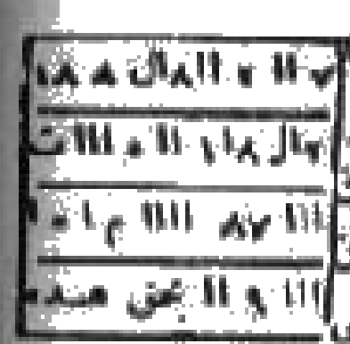

*Gambar Rajah Asli Halaman 30* — Wafaq angka 4 baris yang merupakan bagian khatam pelindung Cancer (dipakai bersama nama-nama dan ayat pada teks). Angka-angka selnya sebagaimana asli.

**[Gambar Rajah Asli Halaman 30 — Rajah 2: Satar Huruf & Angka]**

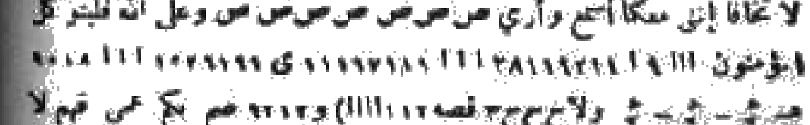

*Gambar Rajah Asli Halaman 30* — Baris rajah lanjutan khatam: deret "المؤمنون ١١١ ٢٨٨٩٩٢١٩ ١١١ ٦١١٦٧٦١٦ …" hingga huruf "مـ … ولا ح ح ح ٣ … ١١١١١ ١٢٢٢٥" dan seterusnya. Tidak diterjemahkan; ditampilkan apa adanya.

---

## HALAMAN CETAK 31 (Halaman PDF 15, sisi kiri)

**[Teks Arab Asli]**

ذو قوة ظهرت من عظم همه عند الملوك وأرباب المناصب ذو كرامة يبلغ القصد والأمل. ( القول على طبع الطالع واختلاف الوجوه التى للانسان والطباع التى عليه ) قال الحكيم أبو معشر: هو برج مؤنث؟ كز؟ طارى؟ نارى بحركه؟ المولود به يكون رجلا غليظ الجسم قصير القامة طويل الوجه غليظ الحاجبين كبير الأسنان؟ مدور الوجه؟ واضح، وربما كان بجبينه عيب أو ضعف فى عينيه ورأسه؛ يخاف عليه من شر الخلق؛ واسع الصدر شهوة؟ نهم؟ كبير الأنف غضوب؛ طيب؟ الاولاد؛ شر؟ الى؟ واسع الفم؛ له علامات بيض؟ وزرابيه؟ ووجهه به خال أسود أو أثر؛ يصغر فى نصف عمره حتى لا يحمد؟ المر؟ ثم المريض؟ لله عليه بعد ذلك؛ ولا يموت الا فى سنهن؟ انه تعالى؛ خيار شهوره سرى؟ وينايره؟ بالمفردة؛ وينال من النساء مكابد عظيمة؛ وكل ما كان له امرأة اما ان تسكن معه أو وثيقة؟ له ويحبو؟ معها؛ وينال من المحكم؟ أمولا شديدة؛ ويجمع المال ويموت فى البهران؟ لم ينتفع منه بشيء؛ ويرى الموت بعينيه وينجو منه بعد اليأس وينتهى؟ عمره الى سبعين سنة أو الى ثمانين سنة والله أعلم. ( الوجه الأول ) من نظر اليه زحل يكون أحمر اللون قصير القامة أو طويلا أو أبيض؟ بعصفرة؟ مقرون الحاجبين غليظ الشفتين كبير الأنف واسع الفم مفلج الأسنان كثير؟ المقاعد؟ مدور الوجه والذقن، قوى الساعدين، ان غضب لا يطاق، ذو مكر وحيل وخداع، له علامات برأسه أو شجة؟ أو عيب بيته؟ أو عروق برجليه أو علامات بطن؟، يحب الكساح؟ نسائو؟ بالعر؟ ويكتب المال؟ ويظهر الرجل ينظر فى ليلة ويستغنى فى يوم؛ له حظ من النساء فى النكاح، شديد الشهوة، كثير الاولاد الذكور، وهو محبوب عند الاكابر، صاحب بطش ورأى والله أعلم. ( الوجه الثانى ) من نظر اليه المشترى يكون رجلا أبيض اللون يميل الى صفرة ظاهرة، عريض الصدر، قوى الساعدين، قريب الرأس؟، سريع الغضب والحماقة، اذا غضب لا يطاق، له أثر؟ بوجهه ورأسه وبجيبه عيب وشعر؟ جسوريتا؟ أو حريقا؟ أول؟ منعوم؟ بين الاصحاب ينال

**[Transliterasi Latin Fonetik]**

*dzuu quwwati zhaharat min 'azhmi hammihi 'indal-muluuki wa arbaabil-manaashibi dzuu karaamati yablughul-qashdu wal-amalu. (al-qawli 'alaa thab'uth-thaali'u wa ikhtilaafil-wujuuhil-latii lil-anasaan wath-thibaa'il-latii 'alayhi  qaalal-hakiimu Abuu Ma'syarin  huwa burju mu'annatsi? kazzun? thaaraa? naariyyun biharrakihu? al-mawluuda bihi yakuunu rajulan ghaliizhal-jismi qashiirul-qaamati thawiilul-wajhu ghaliizhal-haajibayni kabiirun al-asnaani? mudawwaral-wajhu? wa adhihun, wa rubbamaa kaana bijabiinihi 'aybun aw dhi'fun fii 'ayniyyihi wa ra'sihi; yukhaafu 'alayhi min syarrin al-khalqi; waasi'ush-shadri syahwatan? nahamun? kabiirun al-anfi ghadhuuba; thayyibun? al-awlaadi; syarrin? ilaa? waasi'ul-fami; lahu 'alaamaatin buydhin? wa zaraabiyahu? wa wajjahahu bihi khaalin aswadu aw atsaru; yushaghghiru fii nishfi 'umruhu hattaa laa yahmadu? al-marra? tsummal-mariidhu? lillaahi 'alayhi ba'da dzaalika; wa laa yamuutu illaa fii sinnihinna? annahu Ta'aalaa; khiyaara syahuurah suran? wa yanaayirahu? bil-mufradati; wa yanaalu minan-nisaa'i mukaabida 'azhiimata; wakull maa kaana lahu imra'atun amaa anna tusakkinu ma'ahu aw wa tsiiqatun? lahu wa yahbuu? ma'ahaa; wa yanaalu minal-muhkami? amawwalaa syadiidatu; wa yajma'ul-maali wa yamuutu fil-baharaani? lam yantafi'u minhu bisyay'i; wa yaraal-mawti bi'ayniyyihi wa yanjuu minhu ba'dal-ya'si wiinatahaa? 'umruhu ilaa sab'iina sanatin aw ilaa tsamaaniina sanatin wallaahu a'lamu. (al-wajhul-awwalu  min nazhara ilayhi Zuhala yakuunu ahmarul-lawni qashiirul-qaamati aw thawiilan aw abyadhu? bi'ushfuratin? maqruunal-haajibayni ghaliizhasy-syaffatayni kabiirun al-anfi waasi'ul-fami mufallajal-asnaani katsiiru? al-maqaa'ida? mudawwaral-wajhu wadz-dzaqani, qawwaa as-saa'idayni, anna ghadhabun laa yuthaaqu, dzuu makrin wa haylin wa khidaa'in, lahu 'alaamaatin bira'sihi aw syajjatun? aw 'aybu baytihi? aw 'uruuqu barjaliyyihi aw 'alaamaatu bathnin ؟، yuhibbul-kusaahu? nasaa'uu? bil-'arri? wa yaktubul-maali? wa yazhharur-rijlu yanzhuru fii laylata wiisataghan fii yawma; lahu hazhzhun minan-nisaa'i fin-nikaahi, syadiidun asy-syahwati, katsiirul-awlaadidz-dzukuura, wa huwa mahbuubun 'indal-akaabiri, shaahibu bathsyin wa ra'aa wallaahu a'lamu. (al-wajhuts-tsaanii  min nazhara ilayhil-Musytarii yakuunu rajulan abyadhul-lawni yamiilu ilaa shifrata zhaahiratin, 'ariidhash-shadri, qawwaa as-saa'idayni, qariibin ar-ra'si ؟، sarii'ul-ghadhabi wal-hamaaqati, idzaa ghadhabun laa yuthaaqu, lahu atsarin? bi-wajhihi wa ra'sihi wa bijaybihi 'aybun wa syi'run? jasuuriitaa? aw hariiqan? awwalu? mana'uum? baynal-ashhaabi yanaalu*) **[Terjemahan Indonesia]**

…pemilik kekuatan yang tampak dari besarnya cita-cita; di sisi para raja dan pemilik jabatan ia mempunyai kemuliaan; ia mencapai maksud dan harapan.

(Perkataan tentang tabiat thali' serta perbedaan wajah-wajah manusia dan tabiat-tabiat yang berlaku padanya) Berkata sang bijak Abu Ma'syar: ia adalah buruj feminin? […]? berelemen api dengan geraknya? Orang yang dilahirkan di bawahnya menjadi laki-laki kasar tubuh, pendek perawakan, panjang wajah, tebal kedua alis, besar gigi-gigi?, bulat wajah?, jelas; dan boleh jadi di dahinya ada cacat atau kelemahan pada kedua mata dan kepalanya; ia patut dikawatirkan dari kejahatan makhluk; lebar dada, bernafsu? rakus?; besar hidung, pemarah; baik? anak-anak; […]? lebar mulut; ia mempunyai tanda-tanda putih? […]? dan di wajahnya ada bintik hitam atau bekas; ia menjadi kecil? pada pertengahan umurnya sehingga tidak terpuji? […]? lalu yang sakit? bagi Allah atasnya setelah itu; dan ia tidak meninggal kecuali pada […]?; sebaik-baik bulannya ialah […]? dan […]? sendirian; ia menanggung dari para wanita penderitaan yang besar; dan setiap kali ia beristri, wanita itu entah tinggal bersamanya atau terikat? baginya dan ia mencintai? bersamanya; ia memperoleh dari para penguasa? harta-harta yang berat; ia mengumpulkan harta lalu meninggal dalam […]? tanpa memanfaatkannya sedikit pun; ia melihat kematian dengan kedua matanya lalu selamat darinya setelah putus asa, dan berakhir? umurnya pada tujuh puluh tahun atau delapan puluh tahun. Wallahu a'lam.

(Wajah pertama) Bila yang memandangnya Saturnus: ia menjadi kemerahan warna kulit, pendek perawakan, atau tinggi, atau putih? kekuningan?; bertaut alis, tebal kedua bibir, besar hidung, lebar mulut, renggang gigi-gigi, banyak? […]?; bulat wajah dan dagu; kuat kedua lengan; bila marah tidak tertahankan; pemilik tipu daya, helah, dan khianat; ia mempunyai tanda-tanda di kepala atau luka? atau cacat […]? atau urat-urat di kedua kaki atau tanda-tanda perut?; ia menyukai […]? […]? dan menuliskan harta?; dan laki-laki itu tampak memandang dalam semalam lalu menjadi kaya dalam sehari; ia beruntung dari wanita dalam pernikahan; sangat bernafsu; banyak anak laki-laki; ia dicintai di sisi para pembesar; pemilik genggaman dan pendapat. Wallahu a'lam.

(Wajah kedua) Bila yang memandangnya Yupiter: ia menjadi laki-laki putih warna kulitnya condong ke kuning yang tampak; lebar dada; kuat kedua lengan; dekat kepala?; cepat marah dan bodoh; bila marah tidak tertahankan; ia mempunyai bekas? di wajahnya dan di kepalanya, serta di kantongnya ada cacat dan bulu? […]? atau terbakar? […]? dimuliakan? di antara sahabat-sahabat; ia memperoleh…

**[Gambar Rajah Asli Halaman 31 — Tilsm buruj al-Asad (Leo)]**

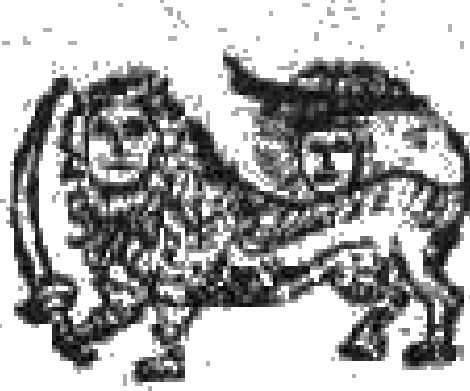

*Gambar Rajah Asli Halaman 31* — Gambar talisman buruj al-Asad (Leo): singa berkepala manusia memegang pedang sabit. Tidak diterjemahkan; ditampilkan apa adanya sebagai rajah asli kitab.

---

> **STATUS BATCH 3: SELESAI** (halaman cetak 22–31 / halaman PDF 11–15).
> Rajah/wafaq/tilsm batch ini telah di-crop presisi, latar putih, 300 DPI, tersimpan di `rajah/`:
> `rajah_p23_satr_huruf.png`, `rajah_p25_wafaq_arqam.png`, `rajah_p25_satr_huruf.png`, `rajah_p26_tilsam_saratan.png`, `rajah_p30_wafaq_arqam.png`, `rajah_p30_satr_huruf.png`, `rajah_p31_tilsam_asad.png`.
> Progres keseluruhan: 15 dari 56 halaman PDF selesai (±27%). Balas "lanjut" untuk Batch 4 (halaman PDF 16–20).

---

# BATCH 4 — HALAMAN PDF 16–20 (HALAMAN CETAK 32–41)

---

## HALAMAN CETAK 32 (Halaman PDF 16, sisi kanan)

**[Teks Arab Asli]**

فننا؟ والأولاد عمره؟ وتغلبه الحكام؟ وينال من الاولاد ذكورا؟ والاناث يجيهم ما يكره، وليس له حظ فى الزروعات ولكن ينال صنعة بيده يقال منها كفاية الى أن يبلغ أجله؛ وان كان المشترى مسعودا كان قاضيا أو فقيها أو كاتبا وما أشبه ذلك؛ وان كان المشترى منحوسا كان له صنعة تشبه صنعة الماء اما غسالا أو ترابيا أو صباغا ربا؟ أو ما أشبه ذلك؛ ويخاف عليه من امرأة صهباء اللون أو حمراء ينال منها ما يسوءه، ويرزق من الاولاد بالقر؟ والله أعلم

( الوجه الثالث ) من نظر اليه المريخ يكون رجلا أصفر اللون شديد البياض بصفرة أصفر الشعر، فان خالطه شىء من الكواكب كان ذهبيا؟ شديد الخلق سريع الرضا، بوجهه علامات طبوع؟ أو أثر جدرى، كبير اللحى طويل القامة متى؟ للبدن، جيد النظر عزيز النفس، وان غضب قامت فيه قوى الرأس هنالك؟ النساء؛ اذا كان المريخ منحوسا؛ وان كان مسعودا كان جنديا؟ أو أميرا؟ أو صاحب نظر واصلاح، فهو صاحب منصب وينال اعزولا؟ كثيرة من الحكام ويشرف على الموت والهلاك وينجو باذن الله تعالى والله أعلم. ( بيت حياته واسقامه ) الاسد والشمس: تكون حياته طيبة ومعيشتة جيدة، ويرزق التوبة والصلاح وحسن العمل، وهو صافى النية مع الله تعالى ومع المخلوقين، ويخفى سره ان لا يكتمه من حسن نيته، ويصنع المعروف مع الناس، وكلما كبر سنه زاد رزقه وعلا شأنه وانصلح حاله وعاقبته حميدة، ولا يموت الا فى توبة واصلاح والله أعلم. ( بيت ماله وكسبه ) السنبلة وعطارد: ينال غنا فى سفره ويكتب مالا كثيرا ويملك فيها لا يتصور؟ يتفق حتى لا يجد الدرهم الفرد، ويكون مرسوم؟ القلب من جهة المال، ويعوض الله عليه بعد مشقة، ويبتغى عند قرب اجله، ولا يموت الا فى نعمة من الله تعالى والله أعلم. ( بيت الاخوة والأخوات ) الميزان والزهرة: يكون له اخوة من أبيه وينال مع أحدهما خصاما كثيرا، وبعض؟ أكثر اخوته قبل موته، ويكون أكثرهم خلفا؟ ويرفق عليهم حالة؟ زيد؟ زحامهم؟ فيه مراعاتهم؟ اعلم. ( بيت الآباء والأمهات ) العقرب والمريخ: يكون بارا بوالديه ويكثر موتهما قبل الاب، وان نظر اليه المشترى دفن الام قبل الاب ويرث

**[Transliterasi Latin Fonetik]**

*fa-nanan? wal-awlaadi 'umruhu? wa taghlibuhul-hukkaami? wa yanaalu minal-awlaadi dzukuuran? waalaanaats yajiihum maa yakrahu, walays lahu hazhzhun fiz-zuruu'aati walakinn yanaalu shan'ata biidihi yuqaalu minhaa kifaayata ilaa an yablughu ajaluhu; wa in kaanal-Musytarii mas'uudan kaana qaadhiyan aw fa-qiihan aw kaatibaa wa maa asyibh dzaalika; wa in kaanal-Musytarii manhuusan kaana lahu shan'atin tusybihu shan'atul-maa'i amaa ghassaalan aw turaabiiaa aw shabbaaghaa ribaa? aw maa asyibh dzaalika; wa yukhaafu 'alayhi min imra'atun shahbaa'il-lawni aw hamraa'u yanaalu minhaa maa yasuu'uhu, wa yurzaqu minal-awlaadi bil-qarri? wallaahu a'lamu*

*(al-wajhuts-tsaalitsu  min nazhara ilayhil-Mirriikhi yakuunu rajulan ashfarul-lawni syadiidun al-bayaadhi bishifratin ashfarusy-syi'ri, fa-in khaalithihi syay'in minal-kawaakibi kaana dzahabiyyan? syadiidun al-khalqi sarii'ur-ridhaa, bi-wajhihi 'alaamaatin thubuu'in? aw atsaru judariyyin, kabiirun al-lihaa thawiilul-qaamati mataa? lil-badna, jayyidan-nazhari 'aziizan-nafsi, wa in ghadhabi qaamat fiihi quwaa ar-ra'si hunaalik? an-nisaa'i; idzaa kaanal-Mirriikhi manhuusan; wa in kaana mas'uudan kaana jundiyyan? aw amiiran? aw shaahibu nazhara waashalaah, fa-huwa shaahibu manshibin wa yanaalu a'azuulaa? katsiiratun minal-hukkaami wa yusyrifu 'alaal-mawti wal-hullaaki wa yanjuu bi-idzni Allaahi Ta'aalaa wallaahu a'lamu. (baytu hayaatihi waasaqaamah  al-Asadi wasy-Syamsi  takuunu hayaatihi thayyibatu wama'iisyatah jayyidatan, wa yurzaqut-tawbatu wash-shulaahu wa husnil-'amalu, wa huwa shaafaa an-niyyatu ma'a Allaahi Ta'aalaa wa ma'al-makhluuqiina, wa yukhfaa sirruhu anna laa yaktumuhu min hasanu niyyatihi, wa yashna'ul-ma'ruufu ma'an-naasi, wa kullamaa kibari sinnuhu zaada rizquhu wa 'allaa sya'nihi wa inshalaha haaluhu wa 'aaqibatuhu hamiidatun, wa laa yamuutu illaa fii tawbatin waashalaah wallaahu a'lamu. (baytu maalihi wa kasbihi  as-Sunbulati wa 'Uthaarida  yanaalu ghannaa fii safarihi wa yaktubu maalan katsiiran wa yamliku fiihaa laa yatashawwaru? yattafiqu hattaa laa yajidud-dirhamul-faridu, wa yakuunu marsuuma? al-qalbi min jihatil-maali, wa yu'awwidhu Allaahi 'alayhi ba'da masyaqqatin, wa yubtaghaa 'inda qurbi ujluhu, wa laa yamuutu illaa fii ni'matin min Allaahi Ta'aalaa wallaahu a'lamu. (baytul-ikhwati wal-ukhuwwaati  al-Miizaani waz-Zuharati  yakuunu lahu akhuuh min abiihi wa yanaalu ma'a ahadihimaa khishaaman katsiiran, waba'dha? aktsaru akhuutah qabla mawtihi, wa yakuunu aktsaruhum khalfan? wa yurfiqu 'alayhim haalatan? zaydun? zihaamahum? fiihi muraa'aatahum? i'lam. (baytul-aabaa'i wal-ummahaati  al-'Aqrabi wal-Mirriikhi  yakuunu baarran biwaalidiihu wa yaktsuru mawtuhumaa qablal-ab, wa in nazhara ilayhil-Musytarii dafnal-am qablal-ab wa yaritsu*) **[Terjemahan Indonesia]**

…dan anak-anak seusianya?; para penguasa mengalahkannya?; ia memperoleh dari anak-anak laki-laki? dan perempuan, namun menimpa mereka apa yang ia benci; ia tidak beruntung dalam pertanian, tetapi ia memperoleh keterampilan dengan tangannya yang dikatakan cukup sampai ajalnya tiba; bila Yupiter berbahagia, ia menjadi qadhi, faqih, atau juru tulis dan semacamnya; dan bila Yupiter bernasib buruk, ia mempunyai keterampilan yang mirip keterampilan air — entah pencuci, pekerja tanah, atau pencelup (pewarna) […]? atau semacamnya; dan ia patut khawatir terhadap wanita berambut pirang kemerahan atau kemerahan, yang menimpakan kepadanya apa yang menyusahkannya; dan ia diberi rezeki anak melalui qarr? Wallahu a'lam.

(Wajah ketiga) Bila yang memandangnya Mars: ia menjadi laki-laki kuning warna kulitnya, sangat putih kekuningan, kuning rambutnya; bila sesuatu dari planet-planet mencampurinya, ia menjadi keemasan?; kuat watak, cepat ridha; di wajahnya ada tanda-tanda […]? atau bekas cacar; besar jenggot, tinggi badan […]? tubuhnya; baik penglihatan, mulia jiwa; bila marah, bangkit padanya kekuatan kepala […]; wanita; bila Mars bernasib buruk; dan bila berbahagia, ia menjadi prajurit? atau amir? atau penanggung pemeriksaan dan perbaikan — maka ia pemilik jabatan, memperoleh banyak pembebasan? dari para penguasa, dan hampir pada kematian serta kebinasaan, lalu selamat dengan izin Allah Ta'ala. Wallahu a'lam.

(Rumah kehidupan dan penyakitnya) Leo dan Matahari: kehidupannya baik dan penghidapannya baik; ia diberi rezeki taubat, kebaikan, dan amal yang bagus; ia bening niat kepada Allah Ta'ala dan kepada makhluk; ia menyembunyikan rahasianya agar tidak menyembunyikannya? dari kebaikan niatnya; ia berbuat makruf kepada manusia; semakin tua usianya bertambah rezekinya, meninggi kedudukannya, membaik keadaannya, dan terpuji kesudahannya; dan ia tidak meninggal kecuali dalam taubat dan kebaikan. Wallahu a'lam.

(Rumah harta dan penghasilannya) Virgo dan Merkurius: ia memperoleh kekayaan dalam perjalanannya, menuliskan harta yang banyak, dan memiliki di dalamnya apa yang tidak terbayang? — ia bersepakat sampai tidak mendapati satu dirham pun; dan hatinya tertandai? dari arah harta, namun Allah memberi ganti kepadanya setelah kesusahan, dan ia mencari ketika ajalnya mendekat, dan ia tidak meninggal kecuali dalam kenikmatan dari Allah Ta'ala. Wallahu a'lam.

(Rumah saudara-saudara) Libra dan Venus: ia mempunyai saudara-saudara dari bapaknya dan memperoleh dengan salah satunya perselisihan yang banyak; sebagian? kebanyakan saudaranya sebelum ajalnya; dan kebanyakan mereka […]? dan ia menyertai mereka keadaan? […]? Wallahu a'lam. (Rumah bapak-bapak dan ibu-ibu) Scorpio dan Mars: ia berbakti kepada kedua orang tuanya dan keduanya banyak meninggal sebelum bapak; dan bila Yupiter memandangnya, ia memakamkan ibu sebelum bapak, dan ia mewarisi…

---

## HALAMAN CETAK 33 (Halaman PDF 16, sisi kiri)

**[Teks Arab Asli]**

منهما شيئا قليلا من مال أو جدار أو بستان، وينال بسبب ذلك خصومات من إخوته؟ ولا ينفعه من الميراث شىء ويذهب كأنه لم يكن والله أعلم. ( بيت أولاده وأفراحه ) القوس والمشترى: يكون أولاده ذكورا وأناثا؟ ويدفن أكثرهم، ويموت له منهم بالمفرد، ويرى من أولاده ما يسره؟ ومنهم ولده؟ يخاف عليه حزنا شديدا يرى من أحدهم؟ غما شديدا من قسوة؟ فليدمن؟ تفقده؟ اليه ويرعاه؟ كما يحب؟ والجزاء على الله تعالى والله أعلم

( بيت أمراضه وأعلاته ) الجدى وزحل: يخاف عليه من الموت وهو ابن ست؟ أو خمس سنين، وأكثر أمراضه من اليبوسة والصفراء والسوداء ووجع الرأس وريح أرجوف؟؛ يستعمل سفوف الأصول والدهن باللية فى المدة؟ بعد خروج؟ من الحمام؛ إن غلبت عليه الصفرا فليؤخذ؟ سنامكى ونصف أفيون؟ خيار شنبر وثلاث أوراق تمر هندى، وينقع فى الماء بعد دقه ويتركه يوما وليلا ويصفى عليه أرطال؟ سكر أبيض ويشربه وهو سخن، فيحصل له إسهال ويذهب؟ منه اختلاط صفراوية؟ يعقبه بمسلوقة التفاح؟ نبي؟ كبير؟ والله أعلم. ( بيت نسائه ومواصلاته ) الدلو؟ وزحل: يتزوج من النساء بالقر؟ ويقع مع نساء فى عمره ولا طاقة على النكاح؟ يطابق الأولى أو نحو شونة؟ لكل ماله امرأة؟ يشهر بسببها حتى تقف على يدها؟ ثم أو ظالم، وينال غرامة بسبب معاشرة النساء والله أعلم. ( بيت خوفه وموته ) الحوت والمشترى: يخاف عليه اذا كان طالع السنة بهما وان بدأ به مرض يوم الاثنين فى شهر أمشير كان سيئا؟ له؟ وهو ابن سبع سنين أو أربعة عشر سنة أو ثمانية وعشرين سنة أو أربعين سنة؟ فان نجا من ذلك كله بلغ أربعة وسبعين سنة والله أعلم. ( بيت أسفاره وحركاته ) الحمل والمريخ: يكون؟ أسفاره؟ ينال فيه؟ حاجا؟ شديدا ومشقة، ولا ينال فى سفره خيرا؟ أو إقامة طويلة من السفر؛ وان كان لا يدين؟ السفر فيسافر يوم الثلاثاء الى جهة الشرق أو القبلة؛ يخاف عليه من الغرق فى البحر فى سفره، ويرى الموت بعينيه وينجو منه باذن الله تعالى، ولا يبدله؟ من حصة؟ وزيارة قبر النبى ﷺ والله أعلم. ( بيت عزه وسلطانه ) الحمل؟ والمريخ: فيكون مكرو؟ محبوبا عند الساد؟ فى عشره؟ معززا مؤيدا عند الاكابر وأرباب الاقلام والمناصب فى كبره؟ وينال عزا؟ ومراتب؟ من جهة رجل جليل القدر

**[Transliterasi Latin Fonetik]**

*minhumaa syay'an qaliilan min maalin aw jidaarun aw bustaanun, wa yanaalu bisababi dzaalika khushuumaatin min ikhwatihi? wa laa yanfa'uhu minal-miiraatsi syay'in wa yadzhabu ka'annahu lam yakunnu wallaahu a'lamu. (baytu awlaadihi wa afraahihi  al-Qawsi wal-Musytarii  yakuunu awlaadihi dzukuuran wa'anaatsaa? wa yadfinu aktsaruhum, wa yamuutu lahu minhum bil-mufradi, wa yaraa min awlaadihi maa yusrihi? waminahum waladahu? yukhaafu 'alayhi huznan syadiidan yaraa min ahadihim? ghamman syadiidan min qaswatin? fa-layadumna? tafqiduhu? ilayhi wa yar'aahu? kamaa yuhibbu? wal-jazaa'a 'alaa Allaahi Ta'aalaa wallaahu a'lamu*) *(baytu amraadhihi wa a'laatihi  al-Jadyi wa Zuhala  yukhaafu 'alayhi minal-mawti wa huwa ibni sittin? aw khumusu siniina, wa'aktsara amraadhihi minal-yubuusati wash-shafraa'i was-sawdaa'i wa waja'ir-ra'si wa riihi arajuuf ؟؛ yasta'milu safuuful-ushuuli wad-duhni bil-layyati fil-muddati? ba'da khuruujin? minal-hamaami; inna ghalabat 'alayhish-shifraa fa-layu'khadz? sanaamakaa wa nishfa afyuunin? khiyaara syanabar tsalaatsi awaraaqin tamri hindii, wa yanqa'u fil-maa'i ba'da daqqihi wa yatrukuhu yawmaa wa laylaa wa yushaffaa 'alayhi arthaala? sukkara abyadhu wa yasyrabuhu wa huwa sukhnin, fa-yuhashshilu lahu ishaalin wa yadzhabu? minhu ikhtilaatha shafraawiyyata? yu'qibuhu bimasluuqatit-tuffaahi? nabiyyun? kabiirun? wallaahu a'lamu. (baytu nisaa'ihi wa muwaashalaatihi  ad-Dalwi? wa Zuhala  yatazawwaju minan-nisaa'i bil-qarri? wa yuq'i ma'a nisaa'in fii 'umruhu wa laa thaaqatin 'alaa an-nikaahi? yuthaabiqul-uulaa aw nahwu syawnatin? li-kulli maalihi imra'atun? yusyhiru bisababihaa hattaa taqaffin 'alaa yadihaa? tsumma aw zhaalimun, wa yanaalu gharaamatan bisababi mu'aasyaratin-nisaa'i wallaahu a'lamu. (baytu khawfihi wa mawtihi  al-Huuti wal-Musytarii  yukhaafu 'alayhi idzaa kaana thaali'is-sanati bihimaa wa in bada'a bihi maradhi yawmal-Itsnayni fii syahri amusyiirun kaana sayyi'an? lahu? wa huwa ibni sab'i siniina aw arba'atun 'asyara sanatin aw tsamaaniyatun wa 'isyriina sanatin aw arba'iina sanatin? fa-in najaa min dzaalika kullihi balagha arba'atun wa sab'iina sanatin wallaahu a'lamu. (baytu asfaarihi wa harakaatihi  al-Hamali wal-Mirriikhi  yakuunu? asfaarihi? yanaalu fiihi? haajjan? syadiidan wa masyaqqatan, wa laa yanaalu fii safarihi khayran? aw aqaamatu thawiilatu minas-safari; wa in kaana laa yadayni? as-safara fa-yusaafiru yawmats-Tsulaatsaa'i ilaa jihatisy-syarqi aw al-qibalatu; yukhaafu 'alayhi minal-ghariqi fil-bahri fii safarihi, wa yaraal-mawti bi'ayniyyihi wa yanjuu minhu bi-idzni Allaahi Ta'aalaa, wa laa yubaddiluhu? min hishshatin? wa ziyaarati qabrin-Nabiyyi ﷺ wallaahu a'lamu. (baytu 'izzihi wa sulthaanihi  al-Hamali? wal-Mirriikhi  fa-yakuunu makruu? mahbuuban 'indas-saad? fii 'usyurihi? mu'azzizan mu'ayyidan 'indal-akaabiri wa arbaabil-aqlaami wal-manaashibi fii kibarihi? wa yanaalu 'izzan? wa maraatiba? min jihati rajulin jaliilul-qadri*) **[Terjemahan Indonesia]**

…dari keduanya sesuatu yang sedikit berupa harta, dinding, atau kebun; dan ia memperoleh karena itu perselisihan-perselisihan dari saudara-saudaranya?; warisan tidak bermanfaat baginya sedikit pun dan lenyap seakan-akan tidak pernah ada. Wallahu a'lam.

(Rumah anak-anak dan kegembiraannya) Sagittarius dan Yupiter: anak-anaknya laki-laki dan perempuan?; kebanyakan mereka ia makamkan, dan meninggal baginya salah seorang dari mereka sendirian; ia melihat dari anak-anaknya apa yang menyenangkan hatinya? dan dari mereka anaknya?; ia patut khawatir atas kesedihan yang berat — ia melihat dari salah seorang mereka? duka yang hebat karena kekerasan? — maka hendaklah ia terus? memeriksanya? kepadanya dan memeliharanya? sebagaimana ia cintai?; dan balasan atas Allah Ta'ala. Wallahu a'lam.

(Rumah penyakit-penyakit dan cacatnya) Capricorn dan Saturnus: ia patut khawatir akan kematian saat berumur enam? atau lima tahun; kebanyakan penyakitnya berasal dari kekeringan, empedu kuning, empedu hitam, sakit kepala, dan angin […]?; hendaklah ia memakai serbuk akar-akaran dan minyak dengan lemak pada masa? setelah keluar? dari kamar mandi; bila empedu kuning menguasainya, hendaklah diambil? sanamaki dan setengah afyun (madat)? khiyar shambar (kasia) dan tiga lembar tamar hindi, direndam dalam air setelah ditumbuk, dibiarkan sehari semalam, lalu disaring di atas […]? gula putih dan diminum hangat, maka terjadilah buang-buang air dan pergi? darinya percampuran empedu? yang disusul dengan rebusan apel? […]? Wallahu a'lam.

(Rumah istri-istri dan hubungannya) Aquarius? dan Saturnus: ia menikahi wanita berpasangan? dan bergaul dengan wanita-wanita seusianya padahal tidak sanggup nikah?; ia mencocoki yang pertama atau semacanya?; setiap hartanya wanita? yang termasyhur karenanya sampai berdiri di tangannya? kemudian atau zalim; dan ia memperoleh denda (kerugian) sebab pergaulan dengan wanita. Wallahu a'lam.

(Rumah ketakutan dan kematiannya) Pisces dan Yupiter: ia patut khawatir bila thali' tahun keduanya itu, dan bila penyakit menyerangnya pada hari Senin di bulan Amshir, itu buruk baginya?; yaitu saat ia berumur tujuh tahun, empat belas tahun, dua puluh delapan tahun, atau empat puluh tahun?; bila ia lolos dari semua itu, ia mencapai tujuh puluh empat tahun. Wallahu a'lam.

(Rumah perjalanan-perjalanan dan gerakannya) Aries dan Mars: perjalanannya? memperoleh di dalamnya? hajat? yang berat dan susah-payah, dan ia tidak memperoleh kebaikan dalam perjalanannya? atau tinggal lama dari bepergian; bila ia tidak menunaikan? perjalanan, maka hendaklah ia bepergian pada hari Selasa ke arah timur atau kiblat; ia patut khawatir tenggelam di laut dalam perjalanannya, dan ia melihat maut dengan kedua matanya lalu selamat darinya dengan izin Allah Ta'ala; dan tidak menggantinya? dari bagian? serta ziarah makam Nabi ﷺ. Wallahu a'lam.

(Rumah kewibawaan dan kekuasaannya) Aries? dan Mars: maka ia menjadi […]? dicintai di sisi tuan-tuan? dalam pergaulannya?; diperkasa dan dikuatkan di sisi para pembesar, pemilik pena, dan jabatan pada masa tuanya?; dan ia memperoleh kemuliaan? serta derajat-derajat? dari seorang laki-laki berbudi besar…

---

## HALAMAN CETAK 34 (Halaman PDF 17, sisi kanan)

**[Teks Arab Asli]**

كثير الاصدقاء يكون؟ وهو مساعد أهل بلده وأكثرهم؟ والله أعلم. ( بيت رجاله وآماله ) الجوزاء وعطارد: يكون كثير الأمل ولا يتم له امر حتى يفرغ منه؟ ولا يرى أحلاما كثيرة، محمولا؟ فى رأيه، مأمون الحافية؟ محمود السريرة، لا يموت الا فى نعمة من الله تعالى والله أعلم. ( بيت أعدائه واضداده ) السرطان والقمر: يكون كثير الاعداء من كل لون أبيض من الرجال والنساء؛ ويخاف عليه من رجل أشقر اللون بوجهه علامة يسعى فى هلاكه فليحذر منه؛ وليس له حظ فى الشركة والزرع؛ ويوافقه من النساء والاصحاب من كان نجمه ناريا كالحمل والاسد والقوس؛ وليحذر ممن كان نجمه مائيا كالسرطان والعقرب والحوت فانهم أكثر اعدائه ولو طالت صحبتهم منه؛ واذا حاج به الدم فليتقصد فى عرق الباسليق؛ خيار أيامه الأحد للبيع والشراء والأخذ والعطاء؛ وأحسن حوائه؟ الفضة؛ ومن اللصوص؟ اليانوت؟؛ وان طلب حاجة من كبير أو صغير فليدخل؟ عليه يوم الخميس باكر النهار قضى حاجته؛ وخيار دوابه المذكور الخمر؟ وتشتر؟ واحسن ثيابه الكتان والصوف؛ وله من الألوان الطلاق؟ ولينظر الهلال على وجه ذكر فيكون ذلك الشهر مباركا؟ عليه؛ وان أراد أن يأمن من شر الانس والجن ويكون الصورة؟ مقبولا؟ فليرصد القمر اذا نزل برج الاسد وهو فى الزيادة وبعض؟ الى الصانعة؟ ويصنع له خاتما من فضة؟ وزنه ثلاثة دراهم وينقش عليه هذه الاسماء؟ ساعة الشمس ويبخره بعبهرى؟ وكندر وتفاح؟ الجمان؟ ويكون يوم الأحد ويلبسه ويمده؟ اليمنى فيكون مقبول الصورة آمنا من جميع المضرات وهو هذا الخاتم؛ وان كان

**[Transliterasi Latin Fonetik]**

*katsiirul-ashadaqaa' yakuunu? wa huwa musaa'idi ahli baladihi wa'aktsarahum? wallaahu a'lamu. (baytu rujjaalihi wa aamaalihi  al-Jawzaa'i wa 'Uthaarida  yakuunu katsiirul-amali wa laa yutmin lahu imri hattaa yufrighu minhu? wa laa yaraa ahalaamaa katsiiratun, mahmuulan? fii ra'yihi, ma'muunal-haaffiyyati? mahmuudas-sariirati, laa yamuutu illaa fii ni'matin min Allaahi Ta'aalaa wallaahu a'lamu. (baytu a'daa'ihi waadhadaadah  as-Sarathaani wal-Qamari  yakuunu katsiirul-a'daa'i min kullu lawni abyadhu minar-rijaali wan-nisaa'i; wa yukhaafu 'alayhi min rajulin asyqaril-lawni bi-wajhihi 'alaamatan yas'aa fii hullaakihi fa-layuhadzdziru minhu; walays lahu hazhzhun fisy-syarikati waz-zar'i; wa yuwaafiquhu minan-nisaa'i waalaashahaab min kaana najmihi naariiaa kal-Hamali waalaasad wal-Qawsi; wa layuhadzdziru mimman kaana najmihi maa'iyyan kas-Sarathaani wal-'Aqrabi wal-Huuti fa-inhim aktsaru a'adaa'ah walaw thaalat shahibathum minhu; wa idzaa haajjun bihid-dami fa-layataqashshadu fii 'irqil-baasaliiq; khiyaara ayyaamihil-Ahadi lil-bay'a wasy-syiraa'a wal-akhdza wal-'athaa'a; wa ahsanu huuaa'ah? al-fidhdhata; wa minal-lushuushi? al-yaanuut ؟؛ wa in thalabi haajatin min kabiirun aw shaghiirun fa-layadkhulu? 'alayhi yawmal-Khamiisi baakiran-nahaari qadhaa haajatahu; wa khiyaara dawaabbihil-madzkuural-khamira? wa tasytari? wa uhsinna tsiyaabahul-kattaana wash-shuufa; wa lahu minal-alwaanith-thalaaqa? wa layanzhurul-halaalu 'alaa wajhi dzakara fa-yakuunu dzaalikasy-syahru mubaarakan? 'alayhi; wa in araada an ya'ammanna min syarrin al-insi wal-jinni wa yakuunush-shuurata? maqbuulan? fa-layarshudul-Qamari idzaa nuzil burjul-Asadi wa huwa fiz-ziyaadati waba'dhi? ilash-shaani'ata? wa yashna'u lahu khaatiman min fidhdhatin? wazanahu tsalaatsatun daraahimi wa yanqusyu 'alayhi haadzihil-asmaa'a? saa'atasy-Syamsi wa yubakhkhiruhu ba'abaharaa? wa kundurun wa tuffaahun? al-jumaanni? wa yakuunu yawmal-Ahadi wa yalbasuhu wa yamudduhu? al-yumnaa fa-yakuunu maqbuulash-shuurati aaman min jamii'il-mudhirraati wa huwa haadzaal-khaatamu; wa in kaana*) **[Terjemahan Indonesia]**

…banyak teman ia menjadi?; dan ia penolong penduduk negerinya dan kebanyakan mereka? Wallahu a'lam.

(Rumah orang-orang dan harapan-harapannya) Gemini dan Merkurius: ia banyak berharap dan tidak sempurna baginya suatu urusan sampai ia menyelesaikannya?; ia tidak melihat mimpi yang banyak; terpikul? dalam pendapatnya; dapat dipercaya […]?; terpuji hati kecilnya; ia tidak meninggal kecuali dalam kenikmatan dari Allah Ta'ala. Wallahu a'lam.

(Rumah musuh-musuh dan penentangnya) Cancer dan Bulan: ia banyak musuh dari setiap warna putih, dari laki-laki dan wanita; ia patut khawatir terhadap laki-laki pirang yang di wajahnya ada tanda, yang berusaha membinasakannya, maka hendaklah ia berhati-hati darinya; ia tidak beruntung dalam persekutuan dan pertanian; yang cocok baginya dari wanita dan sahabat ialah yang bintangnya berelemen api seperti Aries, Leo, dan Sagittarius; dan hendaklah ia berhati-hati dari yang bintangnya berelemen air seperti Cancer, Scorpio, dan Pisces, karena mereka musuh-musuh terbanyaknya walau lama persahabatan mereka dengannya; bila ia perlu mengeluarkan darah, hendaklah ia membidik urat al-Basiliq (urat kepala?); sebaik-baik harinya ialah Ahad untuk jual-beli serta ambil-memberi; sebaik-baik batu-nya? perak; dan dari […]? yakut?; bila ia meminta hajat kepada orang besar atau kecil, hendaklah ia masuk? kepadanya pada hari Kamis pagi hari, maka hajatnya tertunaikan; sebaik-baik hewan tunggangannya ialah yang disebut merah? […]; dan sebaik-baik pakaiannya ialah katun dan wol; dan baginya dari warna-warna ialah […]?; dan hendaklah ia memandang hilal dari wajah laki-laki, maka bulan itu menjadi berberkah? baginya; bila ia ingin aman dari kejahatan manusia dan jin serta menjadi diterima? rupanya?, hendaklah ia mengamati Bulan ketika turun di buruj Leo dalam keadaan bertambah dan […]? ke sang pembuat?, lalu ia membuatkan khatam dari perak? seberat tiga dirham, mengukir padanya nama-nama ini? pada jam Matahari, mengasapinya dengan 'anbar? dan kundur serta […]? mutiara?, yaitu pada hari Ahad, lalu memakainya dan menjulurkannya? ke kanan, maka ia menjadi diterima rupa dan aman dari semua bahaya — dan inilah khatam itu; dan bila ia…

**[Gambar Rajah Asli Halaman 34 — Wafaq Angka khatam Leo]**

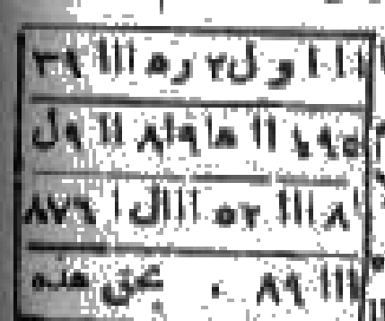

*Gambar Rajah Asli Halaman 34* — Wafaq angka 4 baris (khatam) bagi pemilik buruj Leo: baris 1: ١١١ و ل ٢ ره ١١١ ٣٩ ; baris 2: ٦٩٥ ١١ ها ٩ليه ١١ ٥٩ ; baris 3: ٨٧٦ ا ١١١ ٥٢ ١١١ ٨ ; baris 4: ٨٩ ١١١. بحق هذه. Dipakai bersama khatam perak tiga dirham di atas; bila tidak mampu, nama-nama ini dituliskan dengan misk dan za'faran lalu diasapi pada hari Ahad jam Matahari.

---

## HALAMAN CETAK 35 (Halaman PDF 17, sisi kiri)

**[Teks Arab Asli]**

فقير الحال ولا له طاقة على الخاتم فليوحد؟ القمر كما ذكرنا ويكتب له هذه الأسماء بمسك وزعفران وبخوره؟ بالعود؟ ورد؟ يوم الأحد ساعة الشمس، فيكون آمنا من جميع الأذى والمضرات ولا بأس عليه، وهو هذا: بسم الله الرحمن الرحيم لا اله الا الله محمد رسول الله وصلى الله على سيدنا محمد وعلى آله وصحبه وسلم. ( ولصاحب هذا البرج من أشكال الرمل شكل الجبهة الخارجية ) قال الله تعالى: الذين اذا أصابتهم مصيبة قالوا انا لله وانا اليه راجعون. أصبر أيها السائل عن هذا التفسير فلا ترم نفسك فى الاهوال ولا تعمل هذا تنفع فى قبيل وقال؟ وتروم المحال وعندك ضيق صدر من أجل شىء وقد اشتغلت به نفسك، فيزول عنك الهم والغم؛ ومن لم يسبب؟ للمراقب؟ ظاهر له ما غيب؛ أصبر أيها السائل ولا تبيع بحاجتك التى أضمرت عليها فانها فى غير هذا الوقت منتقضة؟ وفيها؟ أمورك مرضية وأمورك مرضية؟ كل على رب البرية؛ ومع الصبر تنل جميع ما تريد. قال الشاعر:

شكى نحيسى قد أتى بالترك سهرا * يجيبك عن كثرة الهم والأشكال؟
ثم قال أبشر بعد صبر وشكال * يأتيك خير بكامل الاسرار؟

( القول على البرج السادس وهو برج السنبلة وعطارد )

وسادس أفلاك المزوز؟ سنبلة * عطارد نجمه والقول والطول
بشرى لصاحب هذا النجم من بشر * لدى الوزارة والأحكام والدول
سديد الرأى ذو فضل ومعرفة * له القبول كهذا؟ التعزيز والحلل
نسيم؟ الرقيق ونعم المستشار به * حر الطباع ظريف الوجه معتدل

( القول على طبع الطالع واختلاف الوجوه التى للانسان والطباع التى عليه ) قال الحكيم أبو معشر: هو برج مؤنث ليلى بارد يابس طبيعته السوداء والصفراء، ذو جسدين؛ المولود به يكون رجلا أبيض اللون طويل القامة ضخم القدمين يرجم؟ عصور؟ أو فروح؟ أو عيب؛ يحب النساء حبا شديدا؛ ينكح؟ عليه فى كل سنة مرتين عند روز؟ الخطة وعند حصانه؟؛ وإذا متى؟ يهتر؟ بقاته؟ بوجهه أثر أو خال أسود؛ ينال وجعا بركبتيه؛ قليل الحركة؛ كثير الاولاد الاناث؛ بعيد الشهرة؛ يحب النكاح؛ سيئ مع

**[Transliterasi Latin Fonetik]**

*faqiirul-haali wa laa lahu thaaqatin 'alaal-khaatamu fa-layuwahhidu? al-Qamari kamaa dzakaran wa yaktubu lahu haadzihil-asmaa'a bimaskin wa za'faraanin wa bukhuurihi? bil-'uudi? wa raddun? yawmal-Ahadi saa'atasy-Syamsi, fa-yakuunu aaminan min jamii'il-adzaa wal-mudhirraati wa laa ba'asin 'alayhi, wa huwa haadzaa  Bismillaahir-Rahmaanir-Rahiim laal-hu illaa Allaahi Muhammadin rasuuli Allaahi wa shallaa Allaahi 'alaa sayyidinaa Muhammadin wa 'alaa aalihi wa shahbihi wa sallama. (wa li-shaahibi haadzaal-burji min asykaalir-ramli syaklul-jabhatil-khaarijiyyati  qaala Allaahi Ta'aalaa  adz-dziin idzaa ashaabathum mushiibatu qaaluuaa an lillaahi waan ilayhi raaji'uuna  ashabara ayyuhas-saa'ilu 'an haadzaa at-tafsiiri fa-laa tarmi nafsaka fil-ahuuaal wa laa ta'malu haadzaa tanfa'u fii qabiilin wa qaala? wa taruumul-mihaalu wa'indaka dhayyiqu shadrin min ajal syay'in wa qad isytaghalat bihi nafsaka, fa-yuzawwilu 'ankal-hamma wal-ghamma; wa min lam yusabbibu? lil-muraaqiba? zhaahirun lahu maa ghaybi; ashabara ayyuhas-saa'ilu wa laa tabii'u bihaajatikal-latii adhmarat 'alayhaa fa-innahaa fii ghayri haadzaal-waqtu muntaqidhatun? wa fiihaa? umuuraka mardhayatu wa umuuruka mardhayatu? kullu 'alaa rabbil-barriyyati; wa ma'ash-shabri tanul jamii'i maa turiidu  qaalasy-syaa'iru:*) *syukii nahiisaa qad ataa bit-tarki saharan * yujiibuka 'an katsratil-hammi wal-asykaali? tsumma qaala abasysyara ba'da shabrin wa syikaali * ya'tiika khayrun bikaamilil-asaraar?*

*(al-qawli 'alaal-burjis-saadisu wa huwa burjus-Sunbulati wa 'Uthaarida)*

*wa saadisa aflaakil-mazuuz? sunbulata * 'Uthaarida najmihi wal-qawli wath-thuuli*
*bisyaran li-shaahaba haadzaa an-najmi min basyari * ladaal-wizaarati wal-ahkaami wad-duwali*
*sadiidar-ra'aa dzuu fadhlin wa ma'rifata * lahul-qabuuli kahadzaa? at-ta'ziiza wal-hulala*
*nasiimun? ar-raqiiqa wani'm al-mustasyaari bihi * hurrath-thibaa'i zhariifal-wajhu mu'tadilu*

*(al-qawli 'alaa thab'uth-thaali'u wa ikhtilaafil-wujuuhil-latii lil-anasaan wath-thibaa'il-latii 'alayhi  qaalal-hakiimu Abuu Ma'syarin  huwa burju mu'annatsi laylaa baaridun yaabisun thabii'atihis-sawdaa'i wash-shafraa'i, dzuu jasadayni; al-mawluuda bihi yakuunu rajulan abyadhul-lawni thawiilul-qaamati dhakhmal-qadamayni yarjumu? 'ashuur? aw fa-ruuhun? aw 'aybu; yuhibbun-nisaa'i hubban syadiidan; yunkihu? 'alayhi fii kullu sanatin marratayni 'inda rawzin? al-khuththata wa'ind hishaanihi ؟؛ wa idzaa mataa? yahtiru? biqaatihi? bi-wajhihi atsarun aw khaalin aswadu; yanaalu waja'aa barakabatiih; qaliilul-harakati; katsiirul-awlaadil-inaatsa; bi'iidisy-syahrati; yuhibbun-nikaahu; sayyi'a ma'a*) **[Terjemahan Indonesia]**

…miskin dan tidak sanggup membuat khatam, hendaklah ia menghadap? Bulan sebagaimana kami sebutkan, dan hendaklah nama-nama ini dituliskan baginya dengan misk dan za'faran, dan asapnya? dengan gaharu? pada hari Ahad jam Matahari, maka ia aman dari semua gangguan dan bahaya, dan tiada bahaya baginya. Inilah dia: *Bismillahirrahmanirrahim; tiada tuhan selain Allah; Muhammad utusan Allah; dan semoga shalawat serta salam tercurah kepada junjungan kita Muhammad beserta keluarga dan sahabatnya.*

(Dan pemilik buruj ini, di antara bentuk-bentuk raml, mempunyai bentuk **al-Jibbah al-Kharijiyyah** (pakaian luar).) Allah Ta'ala berfirman: "*(yaitu) orang-orang yang apabila ditimpa musibah, mereka berkata: inna lillahi wa inna ilaihi raji'un*." Bersabarlah wahai penanya atas tafsir ini — janganlah engkau melemparkan dirimu ke dalam bahaya dan jangan mengerjakan ini […]? dan engkau menginginkan yang mustahil padahal di dadamu ada kesempitan karena sesuatu yang jiwamu sibuki; maka lenyaplah darimu kesedihan dan duka; dan barangsiapa tidak menyebabkan? bagi pengawas? tampak baginya apa yang gaib; bersabarlah wahai penanya dan jangan menjual hajatmu yang engkau sembunyikan, karena pada selain waktu ini ia akan dibatalkan?; dan padanya? urusan-urusanmu diridai — semuanya atas Tuhan sekalian makhluk; dan bersama kesabaran engkau memperoleh semua yang engkau inginkan. Sang penyair berkata: *"Keluhanku yang buruk telah datang dengan meninggalkan begadang * menjawabmu tentang banyaknya kesedihan dan bentuk-bentuk? Kemudian ia berkata: bergembiralah setelah kesabaran dan kesusahan * akan datang kepadamu kebaikan dengan rahasia yang sempurna?"*

(Perkataan tentang buruj keenam, yaitu buruj Virgo (as-Sunbulah) dan Merkurius)

*Dan keenam falak yang dihiasi? ialah Sunbulah * Merkurius bintangnya, dan perkataan serta kepanjangan; Kabar gembira bagi pemilik bintang ini, dari kabar gembira * di sisi kewaziran, hukum-hukum, dan daulat-daulat; Tepat pendapat, pemilik keutamaan dan pengetahuan * baginya penerimaan bagai? pengukuhan dan pakaian mulia; Semilir? yang halus dan sebaik-baik penasihat dengannya * merdeka tabiat, elok wajah, bersahaja.*

(Perkataan tentang tabiat thali' dan perbedaan wajah-wajah manusia serta tabiat-tabiat yang berlaku padanya) Berkata sang bijak Abu Ma'syar: ia adalah buruj feminin, malamiah, dingin-kering, tabiatnya empedu hitam dan empedu kuning, memiliki dua tubuh; orang yang dilahirkan di bawahnya menjadi laki-laki putih warna kulitnya, tinggi perawakan, besar kedua telapak kaki, […]?; ia mencintai wanita dengan cinta yang sangat; dinikahkan? atasnya dalam setiap tahun dua kali pada […]? dan pada […]?; dan bila […]?; di wajahnya ada bekas atau bintik hitam; ia memperoleh nyeri pada kedua lututnya; sedikit gerak; banyak anak perempuan; jauh kemasyhuran; ia menyukai pernikahan; buruk terhadap…

**[Gambar Rajah Asli Halaman 35 — Tilsm buruj as-Sunbulah (Virgo)]**

*Gambar Rajah Asli Halaman 35* — Gambar talisman buruj as-Sunbulah (Virgo): dua sosok manusia mengapit seikat bulir/ tumbuhan di tengah. Tidak diterjemahkan; ditampilkan apa adanya sebagai rajah asli kitab.

---

## HALAMAN CETAK 36 (Halaman PDF 18, sisi kanan)

**[Teks Arab Asli]**

الصبيان شيخ مع المشايخ، حاذق لطيف، يوافقه الزرع والحرث، ينال أسبا؟ كثيرة؛ وكلما نظر اليه؟ عمله بيده؛ وان كان عطارد منحوسا كان فقيها أو قاضيا أو وزيرا أو من أهل الديوان أو حاسبا أو كاتبا أو حكيما؟ وما أشبه ذلك؛ وان كان منحوسا؟ كان بعده ذلك؟ خيار شهره توت وأشهر ما يمرض؟ يوم الثلاثاء فى شهر برمهات؟ كان سيئا لموته؟ والله؟ لب؟ عليه السرد؟ دامور؟ ومع الرك؟ والتمدين؟؛ وربما كان حائكا؟ أو صباغا؟. وله ثلاثة وجوه. ( الوجه الأول ) من نظر اليه الشمس يكون رجلا أبيض اللون بصفرة كلون الشمس أصفر الشعر، طويل القامة شديد الغضب لا يطاق، سريع الرضا، له حظ من الامراء والاكابر والنساء، وجيه أتر؟ جدرى؟ أو طبوع؟ أو كثف؟ وله شامة بوجهه أو أثر سببه؟ وله علامة بين كتفيه؟ وعلامات برجله، شديد النكاح متغاول؟ والتغالب عليه الدرنة؟ ووجع الدماغ، ينال أموالا كثيرة من الحكام وينجو منها بحول الله تعالى والله أعلم. ( الوجه الثانى ) من نظرت اليه الزهرة يكون رجلا أبيض اللون أو أخضر ذهبى اللون مؤرخ؟ الخط؟ مشوره؟ عند الرجال فى صغره، محبوبا عند النساء فى كبره، يحب الطيب والزينة وشرب الخمر والفرج؟ والرياض وسماع الألحان، عزيز النفس كئيب ظريف مصعب؟ شديد، علامة بوجهه وساقه وعلامة بظهره، ينال أموالا كثيرة فى كبره وهو محمود فى كبره، ونساء؟ بالمرد؟ وينال توبة فى كبره والله أعلم. ( الوجه الثالث ) من نظر اليه عطارد يكون أسمر اللون أو ذهبيا طويلا حسن الوجه حسن البدن مقرون الحاجبين مليح الأسنان ظريف الصورة حسن الألفاظ؟ حلو المنطق، كثير التنقل من مكان الى مكان ينتقص منه نقصان؟ افلال؟ ويزيد زيادته، ويغمر فيه خاطره، يحب النكاح، قليل الحظ من الأولاد، ينال الوزارة؟ إلى بيت الله الحرام، ويرى أموالا كثيرة فى كبره من الحكام وينال شهوب؟ منه، ويخاف عليه من رجل فى أصل داحمة؟ أحمر اللون بوجهه أثر؟ واضع؟ نهرا؟ كبير أعدائه فيحذر منه لأنه يسعى فى هلاكه، ويمنى؟ له الخلط والخلط؟ والله أعلم؟ ومن غيره والله أعلم

**[Transliterasi Latin Fonetik]**

*ash-shabiyyaani syayyakha ma'al-masyaayikhi, haadziqa lathiifa, yuwaafiquhuz-zar'u wal-hartsu, yanaalu asabban? katsiiratun; wa kullamaa nazhara ilayhi? 'amilahu biyadihi; wa in kaana 'Uthaarida manhuusan kaana fa-qiihan aw qaadhiyan aw wa ziiran aw min ahlid-diiwaani aw haasiban aw kaatiban aw hakiiman? wa maa asyibh dzaalika; wa in kaana manhuusan? kaana ba'dahu dzaalika? khiyaara syahrahu tuuta wa asyhura maa yumridhu? yawmats-Tsulaatsaa'i fii syahri baramhaatin? kaana sii'aa limawtihi? wallaahu? lubbun? 'alayhis-sarda? daamuuran? wa ma'ar-rakki? wat-tamadyuna ؟؛ wa rubbamaa kaana haa'ikan? aw shabbaaghan ؟. wa lahu tsalaatsatun wujuuhin. (al-wajhul-awwalu  min nazhara ilayhisy-Syamsi yakuunu rajulan abyadhul-lawni bishifratin kalawnisy-Syamsi ashfarusy-syi'ri, thawiilul-qaamati syadiidun al-ghadhabi laa yuthaaqu, sarii'ur-ridhaa, lahu hazhzhun minal-amaraa' waalaakaabar wan-nisaa'i, wajiihun atiru? judariyyun? aw thubuu'in? aw katstsafa? wa lahu syaamatin bi-wajhihi aw atsaru sababihi? wa lahu 'ullaamati bayna katifiyyihi? wa 'alaamaatin birajulihi, syadiidun an-nikaahi mataghaawl? wat-taghaalaba 'alayhid-daranata? wa waja'id-dimaaghi, yanaalu amawwaalan katsiiratun minal-hukkaami wa yanjuu minhaa bihawli Allaahi Ta'aalaa wallaahu a'lamu. (al-wajhuts-tsaanii  min nazharat ilayhiz-Zuharati yakuunu rajulan abyadhul-lawni aw akhdharu dzahabaal-lawni mu'arrikhun? al-khaththa? musyawwirahu? 'indar-rijaali fii shigharihi, mahbuuban 'indan-nisaa'i fii kibarihi, yuhibbuth-thayyibu waz-zaynatu wa syaribal-khamra wal-farji? war-riyaadha wa samaa'al-alhaani, 'aziizan-nafsi ka'iiba zhariifa mash'abin? syadiidun, 'ullaamatan bi-wajhihi wa saaqihi wa 'ullaamatin bizhuhrihi, yanaalu amawwaalan katsiiratun fii kibarihi wa huwa mahmuudin fii kibarihi, wa nisaa'an? bil-maraddi? wa yanaalu tawbatin fii kibarihi wallaahu a'lamu. (al-wajhuts-tsaalitsu  min nazhara ilayhi 'Uthaarida yakuunu asmarul-lawni aw dzahabiyyaa thawiilaa hasanul-wajhu hasanul-badani maqruunal-haajibayni maliihal-asnaani zhariifash-shuurati hasanul-alfaazhi? haluwal-manthiqu, katsiirut-tanaqquli min makaani ilaa makaanun yantaqishu minhu nuqshaana? afalaal? wa yaziidu ziyaadatuhu, wa yaghmuru fiihi khaathirahu, yuhibbun-nikaahu, qaliilul-hazhzhi minal-awlaadi, yanaalul-wizaarata? ilaa baytu Allaahil-Haraami, wa yaraa amawwaalan katsiiratun fii kibarihi minal-hukkaami wa yanaalu syuhuubun? minhu, wa yukhaafu 'alayhi min rajulin fii ashli daahamah? ahmarul-lawni bi-wajhihi atsarun? wa adhi'un? nahran? kabiirun a'daa'ihi fa-yuhadzdziru minhu la'annahu yas'aa fii hullaakihi, wa yumnaa? lahul-khilthi wal-khilthi? wallaahu a'lamu? wa min ghayrahu wallaahu a'lamu*) **[Terjemahan Indonesia]**

…anak-anak; ia sesepuh bersama para sesepuh; cerdik lagi halus; cocok baginya tanam-menanam dan membajak; ia memperoleh sebab-sebab? yang banyak; dan semakin ia memandang kepadanya? pekerjaannya dengan tangannya; bila Merkurius bernasib buruk, ia menjadi faqih, qadhi, wazir, orang diwan, penghitung, juru tulis, atau tabib? dan semacamnya; dan bila ia bernasib buruk?, maka setelah itu?; sebaik-baik bulannya ialah Tut (bulan Qibti) dan bulan-bulan ia paling sering sakit? ialah hari Selasa pada bulan Baramhat?, yang buruk bagi kematiannya?; dan Allah? […]? padanya yang dingin? […]? dan bersama […]? dan peradaban?; dan boleh jadi ia penenun? atau pencelup?. Buruj ini mempunyai tiga wajah.

(Wajah pertama) Bila yang memandangnya Matahari: ia menjadi laki-laki putih warna kulitnya dengan kekuningan seperti warna matahari, kuning rambutnya; tinggi perawakan, sangat pemarah hingga tidak tertahankan, cepat ridha; ia beruntung dari para amir, pembesar, dan wanita; berwibawa […]; cacar? atau […]? atau tebal?; ia mempunyai tahi lalat di wajah atau bekas sebabnya?; ia mempunyai tanda di antara kedua bahunya? dan tanda-tanda di kakinya; kuat nikah, […]? dan yang menguasainya ialah […]? dan sakit otak; ia memperoleh harta yang banyak dari para penguasa dan selamat darinya dengan daya Allah Ta'ala. Wallahu a'lam.

(Wajah kedua) Bila yang memandangnya Venus: ia menjadi laki-laki putih warna kulitnya atau hijau keemasan, […]?; […]? di kalangan lelaki pada masa kecilnya; dicintai para wanita pada masa tuanya; ia menyukai wewangian, perhiasan, meminum khamar, dan […]? serta taman-taman dan mendengarkan lagu; mulia jiwa, murung, elok, sulit? keras; ada tanda di wajah dan betisnya serta tanda di punggungnya; ia memperoleh harta yang banyak pada masa tuanya dan ia terpuji pada masa tuanya; dan wanita-wanita? dengan pemuda-pemuda amrad?; dan ia memperoleh taubat pada masa tuanya. Wallahu a'lam.

(Wajah ketiga) Bila yang memandangnya Merkurius: ia menjadi sawo matang warna kulitnya atau keemasan, tinggi, bagus wajah dan tubuh, bertaut alis, elok gigi, anggun rupa, baik kata-kata?, manis tutur; banyak berpindah dari satu tempat ke tempat lain, berkurang darinya kekurangan? […]? dan bertambah tambahannya; pikirannya tenggelam di dalamnya; ia menyukai pernikahan; sedikit keberuntungan dari anak-anak; ia memperoleh kewaziran? ke Baitullah al-Haram; ia melihat harta yang banyak pada masa tuanya dari para penguasa dan memperoleh […]? darinya; dan ia patut khawatir terhadap seorang laki-laki pada asal […]? kemerahan warna kulit, di wajahnya ada bekas? […]? besar musuh-musuhnya, maka hendaklah ia berhati-hati darinya karena ia berusaha membinasakannya; dan diharapkan? baginya percampuran dan percampuran? Wallahu a'lam.

---

## HALAMAN CETAK 37 (Halaman PDF 18, sisi kiri)

**[Teks Arab Asli]**

ويصنع المعروف مع من يعرفه ومن لا يعرفه، وعاقبته سليمة، وكلما كبر سنه زاد قدره وانصلح حاله وعلا شأنه، ولا يموت الا فى نعمة والله أعلم. ( بيت المال والعبارات؟ ) الميزان والزهرة: يكون رجلا مرزوقا من المال يكتسب؟ به فى حال حياته ولا يجمعه الا بالكمد والتعب، ويسى؟ غلبا؟ ويصبح؟ نفعه؟ وان دخل فى ماله درهم حرام ذهب جميع ماله، وينال فقرا وفاقة؟ فى نصف عمره، ويعوض الله عليه بمال يكون فكاؤه؟ منه الى آخر عمره والله أعلم. ( بيت الاخوة والأخوات ) العقرب والمريخ: يكون له اخوة ذكور وأناث، ويكون مرافقهم قولا؟ وفعلا؟؛ فان كان من نظر الشمس كانوا ذكورا ولا يتفق معهم وكان أكثرهم حظا؟ ومنهم ثم يعود اليه مودته؟ منهم خصاما كثيرا وهو الظافر بهم والله أعلم. ( بيت الآباء والأمهات ) القوس والمشترى: ينال من أبويه مودة؟ ومعز؟ وربما كان أحسن اخوانه؟؛ وان كان من نظر الزهرة دفن الاب قبل الام؛ وان كان من نظر الشمس دفن الام قبل الاب ويرث منهما شيئا؛ وان ورث شيئا فلا يبقى منه شىء ولا يحصل من نفع والله أعلم. ( بيت أولاده وأفراحه ) الجدى وزحل: يكون الغالب عليه من الاولاد الاناث؛ وان أراد أولادا ذكورا كان قليل الحظ من الاولاد ويعيش له؟؛ فان كان من نظر الزهرة فيكون له أولاد بالقر؟ وينال بسبب أولاده تعبا؟ والله أعلم. ( بيت أمراضه وأعلاته ) الدلو وزحل: يكون أكثر أمراضه من البرودة واليبوسة ووجع البطن والأرياح الغليظة ووجع الركبتين وخفقان الرأس؛ فيستعمل محجون؟ الأطفليج؟ السكبين؟ وممن؟ النحل تافعا؟ له ولا أطيب؟ حلج؟ ودهن البلية؟ وسفوف الأصول وشرب القهيرة؟؛ وان كان من غير أهلها؟ فانها نافعة له؛ وأكبر دواته؟ أفيون وملح هندى من كل واحد جزء يدقان ويشربان بالماء الحار، ويستعمل بعد ذلك مسلوقة التفاح؟ ويكون ذلك فى فصل الخريف فهو أكبر دوائه والله أعلم. ( بيت نسائه ومواصلاته ) الحوت والمشترى: يتزوج من النساء بالزوج من اثنتين الى أربعة؛ الأولى تفارقه اما بموت او بطلاق؛ وربما كانت الثانية معه الى الممات؛ وربما تأكل ماله امرأة؟ ويظهر بسببها؟ وينال غرامة بسبب معاشرة النساء والله أعلم. ( بيت خوفه وموته ) الحمل والمريخ: مع؟ يخاف عليه من

**[Transliterasi Latin Fonetik]**

*wa yashna'ul-ma'ruufu ma'a min ya'rufuhu wa min laa ya'rufuhu, wa 'aaqibatahu saliimatun, wa kullamaa kibari sinnuhu zaada qadruhu wa inshalaha haaluhu wa 'allaa sya'nihi, wa laa yamuutu illaa fii ni'matin wallaahu a'lamu. (baytul-maali wal-'ibaaraati ؟) al-Miizaani waz-Zuharati  yakuunu rajulan marzuuqan minal-maali yaktasibu? bihi fii haali hayaatihi wa laa yajma'uhu illaa bil-kamdi wat-ta'abi, wiisaa? ghalabaa? wa yushbihu? nafa'ahu? wa in dakhlin fii maalihi dirhama haraami dzahabin jamii'i maalihi, wa yanaalu fa-qraa wifaaqatin? fii nishfi 'umruhu, wa yu'awwidhu Allaahi 'alayhi bimaalin yakuunu fakaa'ah? minhu ilaa aakhara 'umruhu wallaahu a'lamu. (baytul-ikhwati wal-ukhuwwaati  al-'Aqrabi wal-Mirriikhi  yakuunu lahu akhuuh dzukuurin wa'anaats, wa yakuunu muraafiqahum quulaa? wa fi'lan ؟؛ fa-in kaana min nazharasy-Syamsi kaanuwan dzukuuran wa laa yattafiqu ma'ahum wakaan aktsaruhum hazhzhan? waminahum tsumma ya'uudu ilayhi mawaddatahu? minhum khishaaman katsiiran wa huwazh-zhaafiri bahum wallaahu a'lamu. (baytul-aabaa'i wal-ummahaati  al-Qawsi wal-Musytarii  yanaalu min ubuwwiyyihi mawaddatan? wa mu'azzin? wa rubbamaa kaana ahsanu akhuuaanah ؟؛ wa in kaana min nazharaz-Zuharati dafnal-ab qablal-am; wa in kaana min nazharasy-Syamsi dafnal-am qablal-ab wa yaritsu minhumaa syay'an; wa in wirtsi syay'an fa-laa yubqii minhu syay'in wa laa yuhashshilu min naf'in wallaahu a'lamu. (baytu awlaadihi wa afraahihi  al-Jadyi wa Zuhala  yakuunul-ghaalibu 'alayhi minal-awlaadil-inaatsa; wa in araada awalaaddaa dzukuuran kaana qaliilul-hazhzhi minal-awlaadi wa ya'iisyu lahu ؟؛ fa-in kaana min nazharaz-Zuharati fa-yakuunu lahu awlaadin bil-qarri? wa yanaalu bisababi awlaadihi ta'aban? wallaahu a'lamu. (baytu amraadhihi wa a'laatihi  ad-Dalwi wa Zuhala  yakuunu aktsaru amraadhihi minal-buruudati wal-yubuusati wa waja'il-bathni wal-aryaahil-ghaliizhati wa waja'ir-rakbatayni wa khafaqaanir-ra'si; fa-yasta'milu mahajjuuna? al-athafaliij? as-sakbayni? wamimman? an-nahla taafa'aa? lahu wa laa athyabi? halaja? wa ddahunnal-baliyyatu? wa safuufal-ushuuli wa syurbil-qahiirah ؟؛ wa in kaana min ghayri ahlihaa? fa-innahaa naafi'atan lahu; wa akbara dawaatuhu? afyuunun wa milhu hindii min kullu waahidun juz'in yaduqqaani wa yasyrabaani bil-maa'il-haarri, wa yasta'milu ba'da dzaalika masluuqatut-tuffaahi? wa yakuunu dzaalika fii fashlun al-khariifi fa-huwa akbari dawaa'ihi wallaahu a'lamu. (baytu nisaa'ihi wa muwaashalaatihi  al-Huuti wal-Musytarii  yatazawwaju minan-nisaa'i biz-zawji min atsanatiin ilaa arba'atun; al-uulaa tufaariquhu amaa bimawti aw bithalaaqi; wa rubbamaa kaanat ats-tsaaniyatu ma'ahu ilal-mamaata; wa rubbamaa ta'kulu maalihi imra'atun? wa yazhharu bisababihaa? wa yanaalu gharaamatan bisababi mu'aasyaratin-nisaa'i wallaahu a'lamu. (baytu khawfihi wa mawtihi  al-Hamali wal-Mirriikhi  ma'a? yukhaafu 'alayhi min*) **[Terjemahan Indonesia]**

…dan ia berbuat makruf kepada orang yang ia kenal dan yang tidak ia kenal; kesudahannya selamat; semakin tua usianya meninggi kedudukannya, membaik keadaannya, dan mulia kedudukannya; dan ia tidak meninggal kecuali dalam kenikmatan. Wallahu a'lam.

(Rumah harta dan …?) Libra dan Venus: ia menjadi laki-laki yang diberi rezeki dari harta yang ia usahakan? padanya sepanjang hidupnya, dan ia tidak mengumpulkannya kecuali dengan kedukaan dan kelelahan; dan […]?; bila masuk ke hartanya satu dirham haram, lenyap seluruh hartanya; ia memperoleh kemiskinan dan kekurangan? pada pertengahan umurnya, lalu Allah memberi ganti kepadanya harta yang menjadi tebusannya? darinya sampai akhir umurnya. Wallahu a'lam.

(Rumah saudara-saudara) Scorpio dan Mars: ia mempunyai saudara laki-laki dan perempuan, dan ia menyertai mereka perkataan? dan perbuatan?; bila dari pandangan Matahari, mereka laki-laki dan ia tidak cocok dengan mereka, dan kebanyakan mereka beruntung? dan dari mereka kemudian kembali kepadanya kasihnya? dari mereka perselisihan yang banyak, namun ia yang menang atas mereka. Wallahu a'lam.

(Rumah bapak-bapak dan ibu-ibu) Sagittarius dan Yupiter: ia memperoleh dari kedua orang tuanya kasih? dan kemuliaan?; dan boleh jadi ia sebaik-baik saudara-saudaranya?; bila dari pandangan Venus, ia memakamkan bapak sebelum ibu; dan bila dari pandangan Matahari, ia memakamkan ibu sebelum bapak, dan ia mewarisi dari keduanya sesuatu; namun bila ia mewarisi sesuatu, tidak tersisa darinya sedikit pun dan tidak diperoleh manfaat. Wallahu a'lam.

(Rumah anak-anak dan kegembiraannya) Capricorn dan Saturnus: yang dominan atasnya dari anak-anak ialah perempuan; bila ia menginginkan anak laki-laki, ia sedikit beruntung dari anak-anak, namun hidup baginya?; bila dari pandangan Venus, ia mempunyai anak-anak berpasangan? dan ia memperoleh sebab anak-anaknya kelelahan?. Wallahu a'lam.

(Rumah penyakit-penyakit dan cacatnya) Aquarius dan Saturnus: kebanyakan penyakitnya berasal dari dingin dan kering, sakit perut, angin-angin berat, nyeri kedua lutut, dan berdebar kepala; maka hendaklah ia memakai […]? athrifal? […]? dan dari? madu bermanfaat? baginya dan tidak ada yang lebih baik? […]? serta minyak […]? dan serbuk akar-akaran serta meminum […]?; walau ia bukan dari ahlinya? maka itu bermanfaat baginya; dan obat terbesarnya? afyun dan garam Hindi (garam hitam), masing-masing satu bagian, ditumbuk dan diminum dengan air panas, kemudian sesudah itu memakai rebusan apel?; dan itu pada musim gugur, maka itulah obat terbesarnya. Wallahu a'lam.

(Rumah istri-istri dan hubungannya) Pisces dan Yupiter: ia menikahi wanita berpasangan, dari dua sampai empat; yang pertama berpisah darinya entah karena mati atau cerai; dan boleh jadi yang kedua bersamanya sampai mati; dan boleh jadi seorang wanita memakan hartanya? dan tampak karenanya?; dan ia memperoleh kerugian sebab pergaulan dengan wanita. Wallahu a'lam.

(Rumah ketakutan dan kematiannya) Aries dan Mars: bersama? ia patut khawatir dari…

---

## HALAMAN CETAK 38 (Halaman PDF 19, sisi kanan)

**[Teks Arab Asli]**

الموت اذا كان طالع السنة بهما وان بدأ به مرض يوم الثلاثاء؟ فى شهر برمهات؟ كان سيئا لموته؛ وذلك انا كان ابن سبع سنين أو أربعة عشر سنة أو ثمانية وعشرين سنة فان نجا من ذلك كله عاش الى خمسة وسبعين سنة؟ ويميل الى ثلاثة وثمانين سنة والله أعلم. ( بيت أسفاره وحركاته ) الثور والزهرة: يكون أحسن سفره يوم الجمعة باكر النهار الى القبلة والشرق خير له؛ وينال الزيارة الى بيت الله الحرام وينال أسفارا كثيرة وينال فيها وشدة فى سفره؛ ولا يسافر فى البحر وحده ويخاف عليه من اللصوص ان يسرقوا منه شيئا؛ وسفر البحر خير له من البر والله أعلم. ( بيت عزه وسلطانه ) الجوزاء وعطارد: يكون ذهبية؟ ومودة؟ عند الاكابر والأمراء والوزراء وأرباب الاقلام؛ ويصحب رجلا جليل القدر؟ ينال منه معزة ورفعة وشأنا عظيما؛ محبوبا عند الغرباء محمود الصبحة؟ والفاقية؟؛ ولا يصحبه أحد الا أحبه وأعزه وآثره؟ والله أعلم. ( بيت رجاله وآماله ) السرطان والقمر: يؤمل آمالا كثيرة ويرى أحلاما كثيرة؟ ولا يحب؟ الا فى سعادة دائمة؛ ويرزق الدين والصلاح والتوبة الخالصة؟ وحسن الدين؛ ويرى أحلاما كثيرة؟ بخير؟؛ اذا عزم على أمر لم يرجع عنه حتى يتمه؟ ولا يكون؟ فيه عسرا؟ فى الامور الا؟ والله أعلم. ( بيت أعدائه وحساده ) الاسد والشمس: يكون له أعداء من كل مملوك؟ ومملوكة؟؛ ويخاف عليه من رجل غليظ الجبهة أصفر اللون يعاشر؟ ويسعى؟ فى الأذى بذل؟ الله تعالى ناصره؟ عليهم ممن؟ ومن الاربعهم؟ كولي؟ مشئوم؟ بين أصحابه؛ يوافقه من النساء والاصحاب من كان نجمه ترابيا؟ كالجدى؟ والسنبلة والثور؛ وليحذر ممن كان نجمه هوائيا كالجوزاء والميزان والدلو؟ فانهم أكبر اعدائه ولو طالت صحبتهم منه؛ واذا حاج به الدم فليتقصد؟ من اخوانه النفقة؟؛ وله من اللصوص؟ الزمرد؟؛ ومن الملابس الأبيض وصباغة؟ الازرق والاخضر؛ وان أراد ان يكون مقبولا عند كل من رآه ويكون مأمونا من شر الانس والجن فليو صد؟ القمر اذا نزل برج السنبلة وهو خالى من النحوس ويصنع له خاتما من فضة وزنه ثلاثة دراهم وينقش عليه هذا الخاتم يوم الأربعاء ساعة عطارد ويبخره بعود ند؟ وجاهرى؟ ويلبس؟ فى يده اليمنى فانه يكون له قبولا عظيما أينما توجه وأمانا من جميع الأذى والمضرات باذن الله تعالى وهذا هو الخاتم الشريف

**[Transliterasi Latin Fonetik]**

*al-mawti idzaa kaana thaali'is-sanati bihimaa wa in bada'a bihi maradhi yawmats-Tsulaatsaa'i? fii syahri baramhaatin? kaana sii'aa limawtihi; wa dzaalika an kaana ibni sab'i siniina aw arba'atun 'asyara sanatin aw tsamaaniyatun wa 'isyriina sanatin fa-in najaa min dzaalika kullihi 'aasya ilaa khamsatun wa sab'iina sanatin? wa yamiilu ilaa tsalaatsatun wa tsamaaniina sanatin wallaahu a'lamu. (baytu asfaarihi wa harakaatihi  ats-Tsawri waz-Zuharati  yakuunu ahsanu safarihi yawmal-Jumu'ati baakiran-nahaari ilal-qibalata wasy-syarqa khayrun lahu; wa yanaaluz-ziyaarata ilaa baytu Allaahil-Haraami wa yanaalu asifaaran katsiiratun wa yanaalu fiihaa wa syiddatan fii safarihi; wa laa yusaafiru fil-bahri wahdahu wa yukhaafu 'alayhi minal-lushuushi anna yasriquuaa minhu syay'an; wa safaral-bahri khayrun lahu minal-barri wallaahu a'lamu. (baytu 'izzihi wa sulthaanihi  al-Jawzaa'i wa 'Uthaarida  yakuunu dzahabiyyatan? wa mawaddatan? 'indal-akaabiri wal-umaraa'i wal-wuzaraa'i wa arbaabil-aqlaami; wa yashhabu rajulan jaliilul-qadri? yanaalu minhu ma'zatan wa raf'atan wa sya'nan 'azhiiman; mahbuuban 'indal-ghurabaa'i mahmuudash-shubhati? wal-faaqiyyata ؟؛ wa laa yashhabuhu ahadu illaa ahabbahu wa a'azzahu wa'aatsarah? wallaahu a'lamu. (baytu rujjaalihi wa aamaalihi  as-Sarathaani wal-Qamari  yu'ammilu aamaalaa katsiiratun wa yaraa ahalaamaa katsiiratun? wa laa yuhibbu? illaa fii sa'aadati daa'imati; wa yurzaqud-diinu wash-shulaahu wat-tawbatul-khaalishatu? wa husnid-diini; wa yaraa ahalaamaa katsiiratun? bikhayri ؟؛ idzaa 'azmun 'alaa amrin lam yarji'u 'anhu hattaa yutmihi? wa laa yakuunu? fiihi 'usran? fil-amuur illaa? wallaahu a'lamu. (baytu a'daa'ihi wa hussaadihi  al-Asadi wasy-Syamsi  yakuunu lahu a'daa'in min kullu mamluukin? wa mamluukata ؟؛ wa yukhaafu 'alayhi min rajulin ghaliizhil-jabhati ashfarul-lawni yu'aasyiru? wa yas'aa? fil-adzaa badzlun? Allaahi Ta'aalaa naashiruhu? 'alayhim mimman? wa minal-araba'aham? kawaliyyin? masy'uumu? bayna ashhaabihi; yuwaafiquhu minan-nisaa'i waalaashahaab min kaana najmihi turaabiiaa? kal-Jadyi? was-Sunbulati wats-Tsawri; wa layuhadzdziru mimman kaana najmihi hawaa'iyyan kal-Jawzaa'i wal-Miizaani wad-Dalwi? fa-inhim akabarri a'adaa'ah walaw thaalat shahibathum minhu; wa idzaa haajjun bihid-dami fa-layataqashshadu? min akhuuaanah an-nafaqata ؟؛ wa lahu minal-lushuushi? az-zumurruda ؟؛ wa minal-malaabisil-abyadhu wa shabbaaghatan? al-azraqu wal-ikhdharra; wa in araada anna yakuunu maqbuulan 'inda kullu min ra'aah wa yakuunu ma'muunan min syarrin al-insi wal-jinni fa-layyuu shaddin? al-Qamari idzaa nuzil burjus-Sunbulati wa huwa khaalii minan-nuhuusi wa yashna'u lahu khaatiman min fidhdhati waznihi tsalaatsatun daraahimi wa yanqusyu 'alayhi haadzaal-khaatamu yawmal-Arbi'aa'i saa'ata 'Uthaarida wa yubakhkhiruhu bi'uudi naddin? wajaaharaa? wa yalbasu? fii yadihil-yumnaa fa-innahu yakuunu lahu qabuulan 'azhiiman aynamaa tawajjuhin wa ammaan min jamii'il-adzaa wal-mudhirraati bi-idzni Allaahi Ta'aalaa wa haadzaa huwal-khaatamusy-syariifi*) **[Terjemahan Indonesia]**

…kematian bila thali' tahun keduanya itu, dan bila penyakit menyerangnya pada hari Selasa? di bulan Baramhat?, itu buruk bagi kematiannya; yaitu saat ia berumur tujuh tahun, empat belas tahun, atau dua puluh delapan tahun; bila ia lolos dari semua itu, ia hidup sampai tujuh puluh lima tahun? dan condong ke delapan puluh tiga tahun. Wallahu a'lam.

(Rumah perjalanan-perjalanan dan gerakannya) Taurus dan Venus: sebaik-baik perjalanannya ialah hari Jumat pagi hari; ke arah kiblat dan timur lebih baik baginya; ia memperoleh ziarah ke Baitullah al-Haram dan memperoleh perjalanan-perjalanan yang banyak, namun ia memperoleh pula dalam perjalanannya kesusahan; janganlah ia bepergian laut sendirian, dan ia patut khawatir terhadap para pencuri yang mencuri sesuatu darinya; perjalanan laut lebih baik baginya daripada darat. Wallahu a'lam.

(Rumah kewibawaan dan kekuasaannya) Gemini dan Merkurius: ia memperoleh? dan kasih? di sisi para pembesar, pangeran, wazir, dan pemilik pena; ia menyertai seorang laki-laki berbudi besar? dan memperoleh darinya kemuliaan, ketinggian, dan kedudukan yang agung; dicintai orang-orang asing, terpuji […]?; dan tidak ada seorang pun menyertainya kecuali mencintainya, memuliakannya, dan mengutamakannya?. Wallahu a'lam.

(Rumah orang-orang dan harapan-harapannya) Cancer dan Bulan: ia mencita-citakan harapan-harapan yang banyak dan melihat mimpi-mimpi yang banyak?; dan ia tidak mencintai? kecuali dalam kebahagiaan yang terus-menerus; ia diberi rezeki agama, kebaikan, taubat yang murni?, dan baiknya agama; ia melihat mimpi-mimpi yang banyak? dengan kebaikan?; bila ia bertekad pada suatu urusan, ia tidak kembali darinya sampai menyelesaikannya?; dan tidak ada? padanya kesulitan? dalam urusan-urusan kecuali?. Wallahu a'lam.

(Rumah musuh-musuh dan para pendengkinya) Leo dan Matahari: ia mempunyai musuh-musuh dari setiap hamba sahaya laki-laki? dan perempuan?; ia patut khawatir terhadap laki-laki lebar dahi, kuning warna kulit, yang bergaul? dan berusaha? dalam gangguan — Allah Ta'ala menjadikan penolongnya? atas mereka dari? dan dari keempat mereka? […]? celaka? di antara sahabatnya; yang cocok baginya dari wanita dan sahabat ialah yang bintangnya berelemen tanah? seperti Capricorn?, Virgo, dan Taurus; dan hendaklah ia berhati-hati dari yang bintangnya berelemen udara seperti Gemini, Libra, dan Aquarius?, karena mereka musuh-musuh terbanyaknya walau lama persahabatan mereka dengannya; bila ia perlu mengeluarkan darah, hendaklah ia membidik? dari saudara-saudaranya […]?; baginya dari […]? zamrud?; dan dari pakaian-pakaian ialah putih dan celupan? biru serta hijau; bila ia ingin diterima di sisi setiap orang yang melihatnya serta aman dari kejahatan manusia dan jin, hendaklah ia mengamati? Bulan ketika turun di buruj Virgo dalam keadaan kosong dari nahas, lalu membuatkan khatam dari perak seberat tiga dirham dan mengukir padanya khatam ini pada hari Rabu jam Merkurius, lalu mengasapinya dengan gaharu nad? dan jawi?, dan memakainya? di tangan kanannya, maka ia memperoleh penerimaan yang besar ke mana pun ia menghadap dan keamanan dari semua gangguan dan bahaya dengan izin Allah Ta'ala — dan inilah khatam yang mulia itu.

---

## HALAMAN CETAK 39 (Halaman PDF 19, sisi kiri)

**[Teks Arab Asli]**

وإن كان فقير الحال ولا له طاقة بالخاتم فليوحد؟ القمر كما ذكرنا ويكتب له هذه الأسماء بمسك وزعفران وبخوره؟ بالعود؟ ورد؟ يوم الأربعاء ساعة عطارد فانه؟ يكون آمنا من شر الانس والجن، والاسم وهي هذه: بسم الله الرحمن الرحيم نصر من الله وفتح قريب وبشر المؤمنين كتب الله لأغلبن أنا ورسلى إن الله قوى عزيز أشهم؟ ٢ منه؟ خروج؟ أطيروده؟ بحق هذه الاسماء إلا ما أجريتهم؟ وبعد تم أنتمة؟ اولاد آدم وبنات حواء عن حامل كتاب هذا وحجور؟ ثم فلو؟ أعدك من كل أنثى وذكر؛ ولا حول ولا قوة إلا بالله العلى العظيم وصلى الله على سيدنا محمد وعلى آله وصحبه وسلم. ( ولصاحب هذا البرج من أشكال الرمل شكل الحمرة ) قال الله تعالى: رب اصر؟ وما صرك؟ إلا بالله فما؟ السائل يبلغ الرب؟ بعد الحب؟ لكن ارجع فما شعرت عليه ولا ترم نفسك فى الامور الا؟ تعمل هذا تقع فى قبيل وقال؟ وتصير نفسك فيزول عنك الهم والغم؟ وأخبرك من أجل شىء وقد اشتدت به نفسك وضاق عليك صدرك فانه يفرج كرك؟ وأصبر أيها السائل ولا تبيع؟ بحاجتك التى أضمرت عليها فانها فى غير هذا الوقت منتقضة وأمورك مرضية؛ واسمع قول الشاعر:

ان فى الصبر راحة قلب * لما تبقى ولما أنت راجى

( القول على البرج السابع وهو برج الميزان والزهرة )

وصاحب فلك الميزان زهرته * يدلو الى الحسن ذات القد والمقل
بأحسن طلعة وبهجه التى * فى صورة ذو لب وذو شغل؟
يهوى المدام ويختار السرور على * الحكم؟ وجن اللحظ والقبول؟
طيب؟ المسار؟ الى ذو رحيم؟ ذو نقل

( القول على طبع الطالع واختلاف الوجوه التى للانسان والطباع التى عليه ) قال الحكيم: هو برج مذكر حار رطب طبيعته الدم؛ المولود به يكون رجلا أبيض اللون مائلا؟ ليأ؟ كبير الشفتين، وجه مدور، وفيه شامة وبين كتفيه

**[Transliterasi Latin Fonetik]**

*wa in kaana faqiiril-haali wa laa lahu thaaqatin bil-khaatimi fa-layuwahhidu? al-Qamari kamaa dzakaran wa yaktubu lahu haadzihil-asmaa'a bimaskin wa za'faraanin wa bukhuurihi? bil-'uudi? wa raddun? yawmal-Arbi'aa'i saa'ata 'Uthaarida fa-innahu? yakuunu aaminan min syarrin al-insi wal-jinni, wal-isma wa hiya haadzihi  Bismillaahir-Rahmaanir-Rahiim nashur min Allaahi wa fathi qariibin wa basyaril-mu'miniina kutuba Allaahi li-aghlibanna an warasalaa inna Allaahi qawaa 'aziizi asyahmun? 2 minhu? khuruujun? athiiruudah? bihaqqi haadzihil-asmaa'a illaa maa ajriyyatihim? wa ba'da tammi antamah? awlaad aadama wa bunnaati hawwaa'i 'an haamili kitaabi haadzaa wa hujuurun? tsumma falaw? a'udka min kullu untsaa wa dzakara; wa laa hawl wa laa quwwatin illaa billaahil-'Aliyyil-'Azhiimi wa shallaa Allaahi 'alaa sayyidinaa Muhammadin wa 'alaa aalihi wa shahbihi wa sallama. (wa li-shaahibi haadzaal-burji min asykaalir-ramli syaklul-humrati  qaala Allaahi Ta'aalaa  rabbi ushru? wa maa shirrika? illaa billaahi famaa? as-saa'ilu yablughur-rabbu? ba'dal-hubbi? lakinn irji' famaa sya'arat 'alayhi wa laa tarmi nafsaka fil-amuur illaa? ta'malu haadzaa tuqqi'a fii qabiilin wa qaala? wa tashiiru nafsaka fa-yuzawwilu 'ankal-hamma wal-ghamma? wa akhbaraka min ajal syay'in wa qad isytaddat bihi nafsaka wa dhaaqa 'alayk shadrika fa-innahu yufriju karruka? wa ashburu ayyuhas-saa'ilu wa laa tabii'u? bihaajatikal-latii adhmarat 'alayhaa fa-innahaa fii ghayri haadzaal-waqtu muntaqidhatun wa umuuruka mardhayatu; wa isma' qawlusy-syaa'iri:*) *anna fish-shabri raahata qalbi * lammaa tabaqqaa walammaa ant raajaa*

*(al-qawli 'alaal-burjis-saabi'u wa huwa burjul-Miizaani waz-Zuharati)*

*wa shaahibu falak al-Miizaani zahratahu * yadluu ilal-hasinna dzaat al-qaddi wal-muqilli*
*bi'ahsani thal'atin wa bahijihil-latii * fii shuurati dzuu lubbin wadzuu syughlin?*
*yuhwaal-mudaamu wa yakhtaarus-suruuru 'alaa * al-hukum? wa jinnal-lahzhi wal-qabuuli?*
*thayyibun? al-masaara? ilaa dzuu rahiimin? dzuu naqlin*

*(al-qawli 'alaa thab'uth-thaali'u wa ikhtilaafil-wujuuhil-latii lil-anasaan wath-thibaa'il-latii 'alayhi  qaalal-hakiimu  huwa burju mudzakkari haarrun rathbun thabii'atihid-dami; al-mawluuda bihi yakuunu rajulan abyadhul-lawni maa'ilan? lii'? kabiirun asy-syaffatayni, wajhi mudawwara, wa fiihi syaamatan wabayn katifiyyihi*) **[Terjemahan Indonesia]**

Bila ia miskin dan tidak sanggup membuat khatam, hendaklah ia menghadap? Bulan sebagaimana kami sebutkan, dan hendaklah nama-nama ini dituliskan baginya dengan misk dan za'faran, dan asapnya? dengan gaharu? pada hari Rabu jam Merkurius, maka ia? aman dari kejahatan manusia dan jin. Nama dan ayat-ayatnya ialah: *Bismillahirrahmanirrahim; pertolongan dari Allah dan kemenangan yang dekat, dan sampaikanlah kabar gembira kepada orang-orang beriman; Allah telah menetapkan: Aku dan rasul-rasul-Ku pasti menang; sesungguhnya Allah Mahakuat lagi Mahaperkasa; asyham? 2 minhu? khuruj? athayruduh?? Dengan hak nama-nama ini kecuali apa yang aku jalankan mereka?; dan kemudian tam antamah?? anak-anak Adam dan putri-puteri Hawa, dari pembawa kitab ini dan […]?; kemudian […]? aku menjagamu dari setiap perempuan dan laki-laki; dan tiada daya serta kekuatan kecuali dengan Allah Yang Mahatinggi lagi Mahaagung; dan shalawat serta salam atas junjungan kita Muhammad beserta keluarga dan sahabatnya.*

(Dan pemilik buruj ini, di antara bentuk-bentuk raml, mempunyai bentuk **al-Humrah** (kemerahan).) Allah Ta'ala berfirman: "[…]?" — Wahai penanya, ia mencapai […]? setelah cinta?; namun kembalilah, maka apa yang ia rasakan atasnya, dan jangan melemparkan dirimu ke dalam urusan-urusan […]? engkau kerjakan ini, engkau jatuh ke dalam […]; dan jiwamu menjadi, maka lenyap darimu kesedihan dan duka?; dan aku memberitahumu dari sebab sesuatu yang jiwamu mengeraskan dan dadamu sempit karenanya, maka ia akan melapangkanmu?; dan bersabarlah wahai penanya, dan jangan menjual? hajatmu yang engkau sembunyikan, karena pada selain waktu ini ia dibatalkan, dan urusan-urusanmu diridai; dengarkanlah ucapan sang penyair: *"Sesungguhnya dalam kesabaran ada kenyamanan hati * bagi apa yang tersisa dan bagi apa yang engkau harapkan."*

(Perkataan tentang buruj ketujuh, yaitu buruj Libra (al-Mizan) dan Venus)

*Pemilik falak Mizan — Venusnya * menunjuk kepada keindahan, pemilik perawakan dan mata; Dengan penampilan dan seri yang terindah * dalam rupa, pemilik akal dan pemilik kesibukan?; Ia mencintai khamar dan memilih kegembiraan atas * hukum? serta kelengahan pandangan dan penerimaan?; Baik? perjalanan? kepada yang penyayang? pemilik perpindahan.*

(Perkataan tentang tabiat thali' serta perbedaan wajah-wajah manusia dan tabiat-tabiat yang berlaku padanya) Berkata sang bijak: ia adalah buruj maskulin, panas-lembap, tabiatnya darah; orang yang dilahirkan di bawahnya menjadi laki-laki putih warna kulitnya condong? […]; besar kedua bibir; wajah bulat; padanya ada tahi lalat dan di antara kedua bahunya…

**[Gambar Rajah Asli Halaman 39 — Rajah 1: Wafaq Angka khatam Virgo]**

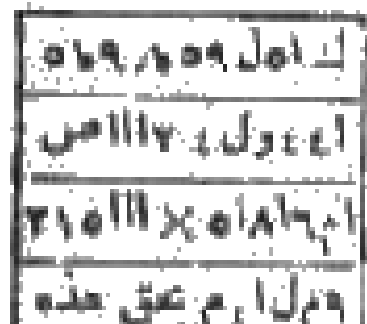

*Gambar Rajah Asli Halaman 39* — Wafaq angka 4 baris (khatam) bagi pemilik buruj Virgo, dipakai bersama nama-nama dan ayat pada teks; bila tidak mampu membuat khatam perak, nama-nama ini ditulis dengan misk–za'faran dan diasapi pada hari Rabu jam Merkurius.

**[Gambar Rajah Asli Halaman 39 — Rajah 2: Tilsm buruj al-Mizan (Libra)]**

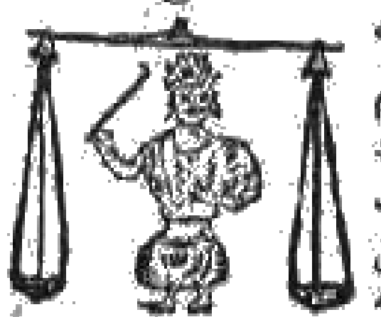

*Gambar Rajah Asli Halaman 39* — Gambar talisman buruj al-Mizan (Libra): sosok bermahkota memegang pemukul, diapit dua daun timbangan besar. Tidak diterjemahkan; ditampilkan apa adanya sebagai rajah asli kitab.

---

## HALAMAN CETAK 40 (Halaman PDF 20, sisi kanan)

**[Teks Arab Asli]**

علامة وبصدره خال أسود أو أثر أسود الحلاقة؟ محبوب عند كل من يراه؛ ينال أمرا منا كثيرة منظورا؟ فيه؟ هو فيه يحب الزينة والطيب فوال؟ باض؟ عاشق معشوق؛ لا يثبت على أمر واحد؛ يخاف عليه من جرح حديد أو حرق نار أو عضة حيوان؛ أحسن شهوره توت وشرها بننس؟؛ وان بدأ به مرض يوم الخميس أو يوم الأربعاء فى شهر بشنس؟ كان سيئا لموته؛ ينال مرضا شديدا عند إدراكه؟ وينال منه شدة ويشرف على الموت ويخاف عليه وهو ابن سبع سنين أو أربعة عشر سنة أو اثنين وسبعين سنة، فان نجا من ذلك كله عاش الى أن يرى اولاد أولاده؛ وأحسن مساكنه من كان به الى الغرب؛ وخيار أيامه الجمعة وأشهرها الخميس ولة؟ الأربعاء؛ ينال غرامة بسبب المعاشرة؛ وان كانت الزهرة مقاربة؟ للبدن عند مولده خيف عليه أن يكون مؤنثا؟ أو يكون مفسود الحالة مع الرجال فى صغره لأ؟ به اجتمع عليه تأثيث؟ القمر ويكون له حظ عند الرجال والنساء؛ عليه الدم والصفرة؟ والصداع ووجع القصعين؟؛ وله ثلاثة وجوه. ( الوجه الأول ) من نظر اليه القمر يكون رجلا أبيض اللون مشربا بحمرة؟ شديدا؟ طريح؟ الوجه وأميين؟ والحاجبين، مدور الوجهين؟ مليح الأسنان، ظريف الصورة، حسن الألفاظ؟ حلو المنطق، كثير التنقل من مكان الى مكان ينتقص منه نقصان؟ افلال؟ ويزيد زيادته، ويغمر فيه خاطره، يحب النكاح، قليل الحظ من الأولاد، ينال الوزارة؟ إلى بيت الله الحرام، ويرى أموالا كثيرة فى كبره من الحكام وينال شهوب؟ منه، ويخاف عليه من رجل فى أصل داحمة؟ أحمر اللون بوجهه أثر؟ واضع؟ نهرا؟ كبير أعدائه فيحذر منه لأنه يسعى فى هلاكه، ويمنى؟ له الخلط والخلط؟ والله أعلم. ( الوجه الثانى ) من نظر اليه زحل يكون أحمر اللون أو ذهبيا أو أخضر الجسم مربع القامة كبير اللحمة مقرون الحاجبين شديد الأخلاق لا يطاق، يكتب المال ويظهر الرجال؟ ينال أمواتا؟ كثيرة فى صباه وينجو منها، وربما سقط من مكان عال أو عضة حيوان يكون محبوز؟ العافية، ويحب الصورة، كثير الحيل صاحب مكر وخداع، يتدن؟ من الحكام أموالا كثيرة وينجو منها، وينكح نساء كثيرة فى المحرم وله ولد فى المحرم يفارق

**[Transliterasi Latin Fonetik]**

*'ullaamatun wa bishadrihi khaalin aswadu aw atsaru aswadul-halaaqati? mahbuubun 'inda kullu min yaraahu; yanaalu amraa mannan katsiiratun manzhuuran? fiihi? huwa fiihi yuhibbuz-zaynatu wath-thayyibu fa-waalin? baadhan? 'aasyiqa ma'syuuqa; laa yutsbitu 'alaa amri waahidun; yukhaafu 'alayhi min jurhi hadiidin aw harqu naarin aw 'adhdhatu hayawaani; ahsanu syahuurah tuutun wa syarruhaa bananas ؟؛ wa in bada'a bihi maradhi yawmal-Khamiisi aw yawmal-Arbi'aa'i fii syahri basyansin? kaana sii'aa limawtihi; yanaalu maradhaa syadiidan 'inda idraakihi? wa yanaalu minhu syiddatan wa yusyrifu 'alaal-mawti wa yukhaafu 'alayhi wa huwa ibni sab'i siniina aw arba'atun 'asyara sanatin aw itsnayni wa sab'iina sanatin, fa-in najaa min dzaalika kullihi 'aasya ilaa an yaraa awlaad awlaadihi; wa ahsanu musaakinihi min kaana bihi ilal-gharba; wa khiyaara ayyaamihil-Jumu'ati wa asyhurihaal-Khamiisi walah? al-Arbi'aa'i; yanaalu gharaamatan bisababil-mu'aasyarati; wa in kaanat az-Zuharati muqaaribatun? lil-badna 'inda mawlidihi khiifa 'alayhi an yakuunu mu'annatsan? aw yakuunu mafasuud al-haalata ma'ar-rijaali fii shigharihi la'a? bihi ijtama'a 'alayhi ta'atsiits? al-Qamari wa yakuunu lahu hazhzhun 'indar-rijaali wan-nisaa'i; 'alayhid-dami wash-shifrata? wash-shudaa'i wa waja'il-qisha'ayni ؟؛ wa lahu tsalaatsatun wujuuhin. (al-wajhul-awwalu  min nazhara ilayhil-Qamari yakuunu rajulan abyadhul-lawni masyraban bi-humratin? syadiidan? thariihun? al-wajhu wa ummiyyayni? wal-haajibayni, mudawwaral-wajihiina? maliihal-asnaani, zhariifash-shuurati, hasanul-alfaazhi? haluwal-manthiqu, katsiirut-tanaqquli min makaani ilaa makaanun yantaqishu minhu nuqshaana? afalaal? wa yaziidu ziyaadatuhu, wa yaghmuru fiihi khaathirahu, yuhibbun-nikaahu, qaliilul-hazhzhi minal-awlaadi, yanaalul-wizaarata? ilaa baytu Allaahil-Haraami, wa yaraa amawwaalan katsiiratun fii kibarihi minal-hukkaami wa yanaalu syuhuubun? minhu, wa yukhaafu 'alayhi min rajulin fii ashli daahamah? ahmarul-lawni bi-wajhihi atsarun? wa adhi'un? nahran? kabiirun a'daa'ihi fa-yuhadzdziru minhu la'annahu yas'aa fii hullaakihi, wa yumnaa? lahul-khilthi wal-khilthi? wallaahu a'lamu. (al-wajhuts-tsaanii  min nazhara ilayhi Zuhala yakuunu ahmarul-lawni aw dzahabiyyan aw akhdharul-jismi murabba'al-qaamati kabiirun al-lahmati maqruunal-haajibayni syadiidun al-akhlaaqi laa yuthaaqu, yaktubul-maali wa yazhharur-rijaali? yanaalu amawaatan? katsiiratun fii shabaahi wa yanjuu minhaa, wa rubbamaa saqathin min makaani 'aalin aw 'adhdhatu hayawaanin yakuunu mahabuuz? al-'aafiyata, wa yuhibbush-shuuratu, katsiirul-hayli shaahibu makrin wa khidaa'in, yatadanna? minal-hukkaami amawwaalan katsiiratun wa yanjuu minhaa, wa yunkihu nisaa'u katsiiratun fil-muharrami wa lahu waladin fil-muharrami yufaariqu*) **[Terjemahan Indonesia]**

…tanda, dan di dadanya bintik hitam atau bekas hitam […]; dicintai di sisi setiap orang yang melihatnya; ia memperoleh perkara-perkara […] banyak yang dipandang? di dalamnya?; ia di dalamnya mencintai perhiasan dan wewangian […]; pencinta dan dicintai; ia tidak tetap pada satu perkara; ia patut khawatir terhadap luka besi, terbakar api, atau gigitan binatang; sebaik-baik bulannya ialah Tut dan seburuk-buruknya Bansans?; bila penyakit menyerangnya pada hari Kamis atau hari Rabu di bulan Basyans?, itu buruk bagi kematiannya; ia memperoleh penyakit yang berat ketika dewasa? dan memperoleh darinya kekerasan serta hampir pada kematian; ia patut dikawatirkan saat berumur tujuh tahun, empat belas tahun, atau tujuh puluh dua tahun; bila ia lolos dari semua itu, ia hidup sampai melihat anak-anak dari anak-anaknya; sebaik-baik tempat tinggalnya ialah yang condong ke barat; sebaik-baik harinya ialah Jumat dan termasyhurnya Kamis serta […]? Rabu; ia memperoleh kerugian sebab pergaulan; dan bila Venus berdekatan? dengan tubuhnya saat kelahirannya, ditakutkan ia menjadi feminin? atau menjadi rusak keadaan bersama kaum lelaki pada masa kecilnya […]? padanya berkumpul […]? Bulan; dan ia beruntung di sisi laki-laki dan wanita; menimpanya darah dan empedu kuning? serta sakit kepala dan nyeri kedua […]?; dan buruj ini mempunyai tiga wajah.

(Wajah pertama) Bila yang memandangnya Bulan: ia menjadi laki-laki putih warna kulitnya kemerah-merahan?; keras?; […]? wajah dan […]? serta kedua alis; bulat kedua sisi wajah?; elok gigi; anggun rupa; baik kata-kata?; manis tutur; banyak berpindah dari tempat ke tempat, berkurang darinya kekurangan? […]? dan bertambah tambahannya; pikirannya tenggelam di dalamnya; ia menyukai pernikahan; sedikit beruntung dari anak-anak; ia memperoleh kewaziran? ke Baitullah al-Haram; ia melihat harta yang banyak pada masa tuanya dari para penguasa dan memperoleh […]? darinya; ia patut khawatir terhadap seorang laki-laki pada asal […]? kemerahan warna kulit, di wajahnya ada bekas? […]?; besar musuh-musuhnya, maka hendaklah ia berhati-hati darinya karena ia berusaha membinasakannya; dan diharapkan? baginya percampuran dan percampuran?. Wallahu a'lam.

(Wajah kedua) Bila yang memandangnya Saturnus: ia menjadi kemerahan warna kulitnya atau keemasan atau hijau tubuh, persegi perawakan, besar daging, bertaut alis, sangat buruk watak hingga tidak tertahankan; ia menuliskan harta dan laki-laki tampak?; ia memperoleh […]? yang banyak pada masa kecilnya dan selamat darinya; dan boleh jadi ia jatuh dari tempat tinggi atau gigitan binatang, menjadi terhalang? kesehatan; ia menyukai rupa; banyak helah, pemilik tipu daya dan khianat; ia memperoleh? dari para penguasa harta yang banyak dan selamat darinya; ia menikahi banyak wanita pada (bulan) Muharam, dan ia mempunyai anak pada Muharam yang berpisah…

---

## HALAMAN CETAK 41 (Halaman PDF 20, sisi kiri)

**[Teks Arab Asli]**

ويستغنى عنهم ولا يسمع لأحد قولا، قوى الرأس صاحب قوة؟ فى عين من يراه والله أعلم. ( الوجه الثالث ) من نظر اليه المشترى يكون رجلا أبيض اللون يميل الى صفرة أو شقرة ببياض، حسن العينين؟ رقيق الشفتين، كثير الفساد، مرزوقا من الناس والأصحاب، ينال توبة فى كبره والدين والصلاح، وله حظ فى البيع والشراء والأخذ والعطاء، وينكح نساء كثيرة فى صباه ويثمر؟ بسبب امرأة؟ ويرى منها تعبا شديدا؟ أو رجال؟ حجة وزيارة بيت الله الحرام؛ فان كان المشترى مسعودا كان فقيها أو قاضيا أو أميرا أو شهيدا؟ وما أشبه ذلك؛ وان كان المشترى منحوسا كان ضد ذلك اما غسالا أو حائكا؟ خبازا؟ وما أشبه ذلك؛ ووائفه؟ العمل الأبيض والزنجبيل والربي؟ والكايل؟ وبك؟ مكانا أو بستانا ويستغنى بصنعة يتالم؟ ان أن يغنى والله أعلم. ( بيت حياته واسقامه ) الميزان والزهرة: تكون حياته طيبة ومعيشتة جيدة، وهو صافى النية، يصدق فى جميع الأقوال، ويخفى سره ان لا يكتمه؟ ويضع المعروف مع الناس، وعاقبته سليمة، وكلما كبر سنه زاد قدره وعلا شأنه وانصلح حاله، ولا يموت الا فى نعمة من الله تعالى والله أعلم. ( بيت المال والتجارات ) العقرب والمريخ: يجمع المال فى كبره وهو محسود عليه، وكلما كبر سنه زاد رزقه وحسنت سيرته، ويفقر فى نصف عمره حتى لا يجد الدرهم الفرد ثم يعوض الله عليه بعد ذلك والله أعلم. ( بيت الاخوة والأخوات ) القوس والمشترى: يكون قليل الاخوة الذكور؛ وان كان من نظر القمر كان أكثرهم أناثا؛ وان كان من نظر زحل كان أكثرهم ذكورا ولا يتفق معهم ويكونوا مع بعضهم كالشمس؟ الذى على النار وهم يحسدونه، وكلما بعد عنهم كان خيرا له والله أعلم. ( بيت الآباء والأمهات ) الجدى وزحل: يكون محروما عن والديه دون اخوته ويكون هو أعزهم قدرا ويرث؟ من أهله قبل أمه؛ وان كان من نظر اليه زحل دفن أمه قبل أبيه ويرث منهما ميرا؟ يسيرا وينال خصاما كثيرا ولا يثبت معه ما يرثه ويضيع كأنه ما كان والله أعلم. ( بيت اولاده وأفراحه ) الدلو وزحل: يكون الغالب على اولاده الذكور وربما كان له أولاد

**[Transliterasi Latin Fonetik]**

*wiisataghan 'anahum wa laa yasma'u li-ahadu quulaa, qawwaa ar-ra'si shaahibu quwwatin? fii 'ayn min yaraahu wallaahu a'lamu. (al-wajhuts-tsaalitsu  min nazhara ilayhil-Musytarii yakuunu rajulan abyadhul-lawni yamiilu ilaa shifratan aw syuqratun bibayaadhin, hasanul-'aynayni? raqiiqasy-syaffatayni, katsiirul-fasaadi, marzuuqan minan-naasi wal-ashhaabi, yanaalu tawbatin fii kaburrihi wad-dayni wash-shulaahi, wa lahu hazhzhun fil-bay'i wasy-syiraa'i wal-akhdzi wal-'athaa'i, wa yunkihu nisaa'u katsiiratun fii shabaahi wa yutsmiru? bisababi imra'atun? wa yaraa minhaa ta'aban syadiidan? aw rujjaalun? hujjatan wa ziyaarati baytu Allaahil-Haraami; fa-in kaanal-Musytarii mas'uudan kaana fa-qiihan aw qaadhiyan aw amiiran aw syahiidan? wa maa asyibh dzaalika; wa in kaanal-Musytarii manhuusan kaana dhiddi dzaalika amaa ghassaalan aw haa'ikan? khabbaazan? wa maa asyibh dzaalika; wuuaa'afah? al-'amalal-abyadhu waz-zanjabiila war-rabbiyya? wal-kaayala? wabik? makaanan aw bustaan wiisataghan bishan'atin yataalam? anna an yughannaa wallaahu a'lamu. (baytu hayaatihi waasaqaamah  al-Miizaani waz-Zuharati  takuunu hayaatihi thayyibatu wama'iisyatah jayyidatan, wa huwa shaafaa an-niyyatu, yushaddiqu fii jamii'il-aqwaali, wa yukhfaa sirruhu anna laa yaktumuhu? wa yadha'ul-ma'ruufu ma'an-naasi, wa 'aaqibatahu saliimatun, wa kullamaa kibari sinnuhu zaada qadruhu wa 'allaa sya'nihi wa inshalaha haaluhu, wa laa yamuutu illaa fii ni'matin min Allaahi Ta'aalaa wallaahu a'lamu. (baytul-maali wat-tijaaraati  al-'Aqrabi wal-Mirriikhi  yajma'ul-maali fii kibarihi wa huwa mahsuudin 'alayhi, wa kullamaa kibari sinnuhu zaada rizquhu wa hassanat sayratuhu, wa yufqiru fii nishfi 'umruhu hattaa laa yajidud-dirhamul-faridu tsumma yu'awwidhu Allaahi 'alayhi ba'da dzaalika wallaahu a'lamu. (baytul-ikhwati wal-ukhuwwaati  al-Qawsi wal-Musytarii  yakuunu qaliilul-ikhwatidz-dzukuura; wa in kaana min nazharal-Qamari kaana aktsaruhum unaatsan; wa in kaana min nazhara Zuhala kaana aktsaruhum dzukuuran wa laa yattafiqu ma'ahum wa yukawwinuuaa ma'a ba'dhuhum kasy-syamsi? al-ladzii 'alaa an-naari wa hum yahsuduunahu, wa kullamaa ba'da 'anahum kaana khayran lahu wallaahu a'lamu. (baytul-aabaa'i wal-ummahaati  al-Jadyi wa Zuhala  yakuunu mahruuman 'an wad-diihu duuna akhuutah wa yakuunu huwa a'azzihim qadran wa yaritsu? min ahlihi qabla ummihi; wa in kaana min nazhara ilayhi Zuhala dafni ummihi qabla abiihi wa yaritsu minhumaa mayran? yasiiran wa yanaalu khishaamaa katsiiran wa laa yutsbitu ma'ahu maa yaritsuhu wa yudhii'u ka'annahu maa kaana wallaahu a'lamu. (baytu awlaadah wa afraahihi  ad-Dalwi wa Zuhala  yakuunul-ghaalibu 'alaa awlaadah adz-dzukuura wa rubbamaa kaana lahu awlaadin*) **[Terjemahan Indonesia]**

…dan ia merasa cukup dari mereka, tidak mendengarkan perkataan seorang pun, kuat kepala, pemilik kekuatan? di mata orang yang melihatnya. Wallahu a'lam.

(Wajah ketiga) Bila yang memandangnya Yupiter: ia menjadi laki-laki putih warna kulitnya condong ke kuning atau pirang keputihan; indah kedua mata?; halus kedua bibir; banyak kerusakan; diberi rezeki dari manusia dan sahabat-sahabat; ia memperoleh taubat pada masa tuanya, agama, dan kebaikan; ia beruntung dalam jual-beli serta ambil-memberi; ia menikahi banyak wanita pada masa mudanya dan berbuah? sebab seorang wanita? dan ia melihat darinya kelelahan yang berat? atau laki-laki? haji dan ziarah Baitullah al-Haram; bila Yupiter berbahagia, ia menjadi faqih, qadhi, amir, atau syahid? dan semacamnya; dan bila Yupiter bernasib buruk, sebaliknya — entah pencuci, penenun?, tukang roti?, dan semacamnya; dan cocoknya? pekerjaan putih, jahe, dan […]? serta […]? dan […]? tempat atau kebun, dan ia merasa cukup dengan keterampilan […]. Wallahu a'lam.

(Rumah kehidupan dan penyakitnya) Libra dan Venus: kehidupannya baik dan penghidupannya baik; ia bening niat; benar dalam semua perkataan; ia menyembunyikan rahasianya agar tidak menyembunyikannya? dan menaruh makruf bersama manusia; kesudahannya selamat; semakin tua usianya meninggi kedudukannya, mulia kedudukannya, dan membaik keadaannya; dan ia tidak meninggal kecuali dalam kenikmatan dari Allah Ta'ala. Wallahu a'lam.

(Rumah harta dan perniagaan) Scorpio dan Mars: ia mengumpulkan harta pada masa tuanya padahal ia didengki atasnya; semakin tua usianya bertambah rezekinya dan baik perilakunya; dan ia miskin pada pertengahan umurnya sampai tidak mendapati satu dirham pun, kemudian Allah memberi ganti kepadanya setelah itu. Wallahu a'lam.

(Rumah saudara-saudara) Sagittarius dan Yupiter: ia sedikit saudara laki-laki; bila dari pandangan Bulan, kebanyakan mereka perempuan; dan bila dari pandangan Saturnus, kebanyakan mereka laki-laki dan ia tidak cocok dengan mereka, dan mereka terhadap sebagiannya seperti lilin? yang di atas api sedangkan mereka mendengki; semakin jauh ia dari mereka, semakin baik baginya. Wallahu a'lam.

(Rumah bapak-bapak dan ibu-ibu) Capricorn dan Saturnus: ia terhalang dari kedua orang tuanya selain saudara-saudaranya, dan dialah yang termulia kedudukan di antara mereka, dan ia mewarisi? dari keluarganya sebelum ibunya; bila Saturnus yang memandangnya, ia memakamkan ibunya sebelum bapaknya dan mewarisi dari keduanya warisan? yang sedikit, serta memperoleh perselisihan yang banyak, dan apa yang ia warisi tidak tetap bersamanya lalu lenyap seakan-akan tidak pernah ada. Wallahu a'lam.

(Rumah anak-anak dan kegembiraannya) Aquarius dan Saturnus: yang dominan atas anak-anaknya ialah laki-laki, dan boleh jadi ia mempunyai anak-anak…

---

> **STATUS BATCH 4: SELESAI** (halaman cetak 32–41 / halaman PDF 16–20).
> Rajah/wafaq/tilsm batch ini telah di-crop presisi, latar putih, 300 DPI, tersimpan di `rajah/`:
> `rajah_p34_wafaq_arqam.png`, `rajah_p35_tilsam_sunbulah.png`, `rajah_p39_wafaq_arqam.png`, `rajah_p39_tilsam_mizan.png`.
> Progres keseluruhan: 20 dari 56 halaman PDF selesai (±36%). Balas "lanjut" untuk Batch 5 (halaman PDF 21–25).

---

# BATCH 5 — HALAMAN PDF 21–25 (HALAMAN CETAK 42–51)

---

## HALAMAN CETAK 42 (Halaman PDF 21, sisi kanan)

**[Teks Arab Asli]**

( بيت أمراضه وأعصابه ) الحوت والمشترى: يكون أكثر أمراضه من البلغم والأرياح والزكام ووجع القلب والمفاصل، فليكثر من إخراج الدم فى فصل الشتاء من عرق الباسليق، ويكثر من استعمال المعاجين الحارة والجوارش الكمونية وحب الدبس والحالوم والتين وجميع المغلظات فيكون خيرا له، وان قوى به البلغم يؤخذ له شبت وشمر وزنجبيل وعرق سوس فيشربه، ثم ينقيه بما يستعمل بعد ذلك من السكنجبين والمربى والاهليلج يكون أكبر دوائه، فإذا أراد الاختصار يستعمل الأصول خاصة فهو نافع له فى علل الجوف والله أعلم.

**[Transliterasi Latin Fonetik]**

*(baytu amraadhihi wa a'shaabihi  al-Huuti wal-Musytarii  yakuunu aktsaru amraadhihi minal-balghami wal-aryaahi waz-zukaami wa waja'il-qalbi wal-mafaashili, fa-layuktsiru min ikhraajid-dami fii fashlun asy-syitaa'i min 'irqil-baasaliiq, wa yuktsiru min isti'maalil-ma'aajiinil-haarrata waalajuuaarasy al-kammuuniyyata wa hubbad-dibsi wal-haaluumi wat-tiina wajamii'al-mughlizhaati fa-yakuunu khayran lahu, wa in quwan bihil-balghami yu'khadzu lahu syubtu wa syammara wazanjabiilun wa 'irqu suusin fa-yasyrabuhu, tsumma yunqiihi bimaa yasta'milu ba'da dzaalika minas-sakanjabiini wal-murabbaa waalaahaliilaj yakuunu akabarri dawaa'ihi, fa-idzaa araadal-ikhtishaara yasta'milul-ushuulu khaashshatan fa-huwa naafi'in lahu fii 'ilalil-jawfi wallaahu a'lamu *) **[Terjemahan Indonesia]**

(Rumah penyakit-penyakit dan saraf-sarafnya) Pisces dan Yupiter: Kebanyakan penyakitnya berasal dari dahak (balgham), angin-angin tubuh, flu/pilek, serta nyeri jantung dan persendian; maka hendaklah ia memperbanyak mengeluarkan darah (fashdu/hijamah) pada musim dingin dari pembuluh darah basilik (vena basilica); dan memperbanyak konsumsi ramuan majun hangat, jawarisz kamuni (ramuan jintan untuk pencernaan), sirup tetes tebu, keju halum, buah tin, serta makanan-makanan yang memekatkan tubuh agar menjadi baik baginya; dan jika dahaknya menguat, hendaklah diambilkan baginya adas sowa (syibat), adas manis (syamar), jahe, dan akar manis (licorice) lalu diminum; kemudian membersihkan pencernaannya dengan ramuan oxymel (sikinjabin), selai obat (murabba), dan buah myrobalan (iylilaj) yang menjadi obat terbesarnya; bila ingin yang ringkas, gunakanlah sari akar-akar tumbuhan obat khususnya, karena itu sangat berfaedah untuk keluhan-keluhan dalam rongga perut. Wallahu a'lam.

---

**[Teks Arab Asli]**

( بيت نسائه وفراشه ) الحمل والمريخ: يكون أحسن نسائه البيض الألوان المائلات إلى الحمرة بالفرد، وربما كن أبكارا أو ثيبات، والأولى لا تكاد تثبت معه، والثانية كذلك بسبب النساء ما يكره، وليحذر من النساء كل الحذر لأنه ما أكل ماله امرأة بسبها وترفعه على يدها، وينجو منها بعد قهر وغم شديد والله أعلم.

**[Transliterasi Latin Fonetik]**

*(baytu nisaa'ihi wa firaasyihi  al-Hamali wal-Mirriikhi  yakuunu ahsanu nisaa'ihil-buydhil-alwaanal-maa'ilaati ilal-humrati bil-fardi, wa rubbamaa kanna abakaaraa aw tsayyibaatun, wal-uulaa laa tukaadu tutsbitu ma'ahu, wats-tsaaniyatu kadzaalika bisababin-nisaa'i maa yakrahu, wa layuhadzdziru minan-nisaa'i kullul-hadziri la'annahu maa akull maalihi imra'atun bisabbihaa wa taraffu'ihi 'alaa yadihaa, wa yanjuu minhaa ba'da qahrin wa ghammi syadiidun wallaahu a'lamu *) **[Terjemahan Indonesia]**

(Rumah wanita-wanita dan peraduannya) Aries dan Mars: Sebaik-baik wanitanya adalah yang berkulit putih merona kemerah-merahan secara ganjil (satu atau tiga); terkadang wanita itu masih perawan atau sudah janda; wanita yang pertama hampir tidak dapat bertahan lama bersamanya, begitu pula yang kedua disebabkan tabiat wanita yang dibencinya; hendaklah ia sangat berhati-hati terhadap wanita karena hartanya pernah dihabiskan oleh seorang wanita yang kemudian memperdayanya, dan ia baru dapat selamat darinya setelah mengalami tekanan dan kesusahan yang berat. Wallahu a'lam.

---

**[Teks Arab Asli]**

( بيت خوفه وموته ) الثور والزهرة: يخاف عليه من سنة يكون طالعها بهما، وهو ابن سبعة أشهر أو سبعة عشر شهرا، وعند إدراكه يشرف على الموت، أو إلى اثنين وعشرين سنة، أو ثمانية وعشرين سنة، أو أربعين سنة، فان نجا من ذلك كله بلغ سبعين سنة والله تعالى أعلم.

**[Transliterasi Latin Fonetik]**

*(baytu khawfihi wa mawtihi  ats-Tsawri waz-Zuharati  yukhaafu 'alayhi min sanatin yakuunu thaali'uhaa bihimaa, wa huwa ibni sab'atun asyahrun aw sab'atun 'asyara syahran, wa'ind idraakihi yusyrifu 'alaal-mawti, aw ilaa itsnayni wa 'isyriina sanatin, aw tsamaaniyatun wa 'isyriina sanatin, aw arba'iina sanatin, fa-in najaa min dzaalika kullihi balagha sab'iina sanatin wallaahu Ta'aalaa a'lamu *) **[Terjemahan Indonesia]**

(Rumah ketakutan dan kematiannya) Taurus dan Venus: Dikhawatirkan atasnya pada tahun yang thali'-nya dipengaruhi kedua bintang tersebut, yaitu ketika ia berumur tujuh bulan, atau tujuh belas bulan, dan saat menginjak usia baligh ia hampir menemui ajal, atau pada usia dua puluh dua tahun, atau dua puluh delapan tahun, atau empat puluh tahun; jika ia selamat dari semua masa krisis tersebut, ia akan mencapai usia tujuh puluh tahun. Wallahu Ta'ala a'lam.

---

**[Teks Arab Asli]**

( بيت أسفاره وحركاته ) الجوزاء وعطارد: سفره إلى جهة المشرق خير له من جهة المغرب، ولا يسافر فى البحر إلا فى التجارة، وأحسن أيامه للسفر يوم الأربعاء باكر النهار، وينال فى سفره معيشة طيبة ومالا جزيلا، ويصحب أرباب الأقلام والوزراء والله أعلم.

**[Transliterasi Latin Fonetik]**

*(baytu asfaarihi wa harakaatihi  al-Jawzaa'i wa 'Uthaarida  safarihi ilaa jihatil-masyriqi khayrun lahu min jihatil-maghribi, wa laa yusaafiru fil-bahri illaa fit-tijaarati, wa ahsanu ayyaamihi lis-safara yawmal-Arbi'aa'i baakiran-nahaari, wa yanaalu fii safarihi ma'iisyata thiibatin wa maalan jaziilan, wa yashhabu arbaabul-aqlaami wal-wuzaraa'i wallaahu a'lamu *) **[Terjemahan Indonesia]**

(Rumah perjalanan-perjalanan dan gerakannya) Gemini dan Merkurius: Bepergian menuju arah timur lebih baik baginya daripada menuju arah barat; janganlah ia bepergian lewat jalur laut kecuali semata-mata untuk berniaga; sebaik-baik hari untuk memulai perjalanannya adalah hari Rabu di pagi hari; ia akan memperoleh dalam perjalanannya penghidupan yang baik dan harta yang berlimpah, serta dapat mendampingi kalangan penulis resmi dan para wazir (pejabat negara). Wallahu a'lam.

---

**[Teks Arab Asli]**

( بيت عزه وسلطانه ) السرطان والقمر: ينال عزا ورفعة عند الأكابر والسلاطين، وكلما كبرت سنه زادت وجاهته، ويكون محبوبا عند الرؤساء مقبول القول عندهم، ويحظى برتبة عالية والله أعلم.

**[Transliterasi Latin Fonetik]**

*(baytu 'izzihi wa sulthaanihi  as-Sarathaani wal-Qamari  yanaalu 'izzan wa raf'atu 'indal-akaabiri was-salaathiini, wa kullamaa kaburat sinnuhu zaadat wajaahatuhu, wa yakuunu mahbuuban 'indar-ru'asaa'i maqbuulal-qawli 'indahum, wa yuhzhaa birutbati 'aaliyati wallaahu a'lamu *) **[Terjemahan Indonesia]**

(Rumah kemuliaan dan kekuasaannya) Cancer dan Bulan: Ia akan memperoleh kemuliaan dan kedudukan terhormat di hadapan para pembesar dan penguasa; semakin bertambah usianya semakin bertambah pula kewibawaannya; ia dicintai di kalangan para pemimpin serta diterima perkataannya di hadapan mereka, dan ia dianugerahi pangkat yang luhur. Wallahu a'lam.

---

**[Teks Arab Asli]**

( بيت رجائه وآماله ) الأسد والشمس: يبلغ من آماله ما يرجوه، ويكون كثير الصبر فى الشدائد، ولا يقصد أمرا إلا تم له على أحسن الوجوه، ويرزق توبة نصوحا قبل وفاته والله أعلم.

**[Transliterasi Latin Fonetik]**

*(baytu rajaa'ihi wa aamaalihi  al-Asadi wasy-Syamsi  yablughu min aamaalihi maa yarjuuhu, wa yakuunu katsiirush-shabri fisy-syadaa'idi, wa laa yaqshidu amran illaa tammin lahu 'alaa ahsanul-wujuuhi, wa yurzaqu tawbatin nashuuhan qabla wafaatihi wallaahu a'lamu *) **[Terjemahan Indonesia]**

(Rumah harapan dan cita-citanya) Leo dan Matahari: Ia akan mencapai sebagian besar apa yang dicita-citakannya; ia memiliki kesabaran yang luar biasa dalam menghadapi kesukaran; tidaklah ia berniat melakukan suatu urusan melainkan urusan itu selesai baginya dengan sebaik-baik hasil; dan ia dianugerahi taubat nasuha sebelum wafatnya. Wallahu a'lam.

---

**[Teks Arab Asli]**

( بيت أعدائه وحساده ) السنبلة وعطارد: أعداؤه من أرباب الحيل والمكر، ومن كان طبعه ترابيا، ويخاف عليه من رجل قصير القامة أصفر اللون، فليحذر منه جهده والله سبحانه أعلم.

**[Transliterasi Latin Fonetik]**

*(baytu a'daa'ihi wa hussaadihi  as-Sunbulati wa 'Uthaarida  a'addaa'uhu min arbaabil-hayli wal-makri, wa min kaana thab'uhu turaabiiaa, wa yukhaafu 'alayhi min rajulin qashiirul-qaamati ashfarul-lawni, fa-layuhadzdziru minhu jahdahu wallaahu Subhaanahu a'lamu *) **[Terjemahan Indonesia]**

(Rumah musuh-musuh dan para pendengkinya) Virgo dan Merkurius: Musuh-musuhnya berasal dari kalangan orang-orang yang penuh tipu muslihat dan kelicikan, serta orang yang bertabiat tanah (elemen bumi); ia patut berwaspada terhadap seorang lelaki berperawakan pendek dan berkulit kuning pucat, maka hendaklah ia berhati-hati terhadapnya sekuat tenaga. Wallahu Subhanahu wa Ta'ala a'lam.

---

## HALAMAN CETAK 43 (Halaman PDF 21, sisi kiri)

**[Teks Arab Asli]**

( ولصاحب هذا البرج من أشكال الرمل شكل النصرة الخارجة )
قال الحكيم: أيها السائل عن أمرك، اعلم أن طالعك يدل على ظفر ونصرة بعد تعب ومحنة، ولا تيأس من روح الله تعالى، فان الفرج قريب، وعليك بكتمان السر فان من كتم سره ملك أمره، واسمع قول الشاعر:
اصبر على الدهر مهما دارت النوب * واعلم بأن قضاء الله يرتقب
فكم رأينا من الأيام نازلة * جاءت بيسر وما فى غيبها عجب

**[Transliterasi Latin Fonetik]**

*(wa li-shaahibi haadzaal-burji min asykaalir-ramli syaklun-nashratil-khaarijati)*
*qaalal-hakiimu  ayyuhas-saa'ilu 'an amrika, i'lam an thaali'ika yadullu 'alaa zhafarin wa nashrati ba'da ta'abin wa mihnatin, wa laa tuya''asu min rawhi Allaahi Ta'aalaa, fa-in al-farji qariibin, wa'alayka bikitmaanis-sirri fa-in min katmi sirrihi malaka amrahu, wa isma' qawlusy-syaa'iri:*
*ushbur 'alaa ad-dahri mahmaa daarat an-nuwaba * wa i'lam ba'ann qadhaa'i Allaahi yartaqibu*
*fakam ra'yinaa minal-ayyaami naazilata * jaa'at biyusrin wa maa fii ghaybihaa 'ajabun*

**[Terjemahan Indonesia]**

(Bagi pemilik buruj ini dari bentuk-bentuk ilmu geomansi/raml adalah bentuk *Nushrah Kharijah*)
Berkata sang ahli hikmah: Wahai penanya tentang urusanmu, ketahuilah bahwa thali' (bintang pemandu)-mu menunjukkan tercapainya kemenangan dan kejayaan setelah melewati kelelahan dan cobaan; janganlah engkau berputus asa dari rahmat Allah Ta'ala, karena jalan keluar (al-faraj) sudah amat dekat; wajib atasmu memegang teguh rahasia, karena barang siapa yang merahasiakan urusannya maka ia akan menguasai perkaranya; dengarkanlah bait syair ini:
*Bersabarlah menghadapi zaman betapapun musibah silih berganti * Ketahuilah bahwa takdir ketetapan Allah senantiasa dinantikan*
*Betapa sering kita menyaksikan hari-hari yang diliputi kesulitan * Tiba-tiba datang kemudahan, dan rahasia gaib Allah senantiasa penuh keajaiban.*

---

**[Teks Arab Asli]**

وهذه صفة الخاتم المبارك لصاحب برج الميزان: يكتب يوم الجمعة فى الساعة الأولى للشمس على رق غزال أو صفيحة فضة، ويبخر بالعود واللبان الذكر، ويحمل على الطهارة، وهذه صورته الشريفة المباركة.

**[Transliterasi Latin Fonetik]**

*wa haadzihi shaffatil-khaatamul-mubaaraki li-shaahiba burjul-Miizaani  yaktubu yawmal-Jumu'ati fis-saa'atul-uulaa lisy-Syamsi 'alaa riqqi ghazaalin aw shafiihatu fidhdhatin, wa yubakhkhiru bil-'uudi wal-labbaanidz-dzikra, wa yahmilu 'alaa ath-thahaarati, wa haadzihi shuuratihisy-syariifatil-mubaarakati *

**[Terjemahan Indonesia]**

Inilah sifat dan tata cara rajah khatam yang penuh berkah bagi pemilik buruj al-Mizan (Libra): Ditulis pada hari Jumat pada jam pertama (sa'ah pertama) Matahari di atas perkamen kulit rusa atau lempengan perak bersih, lalu diasapi dengan gaharu (aud) dan kemenyan Arab (luban dzakar), kemudian dibawa dalam keadaan suci dari hadas — dan inilah gambar wafaq/khatam yang mulia tersebut.

---

**[Gambar Rajah Asli Halaman 43 — Wafaq al-Mizan]**

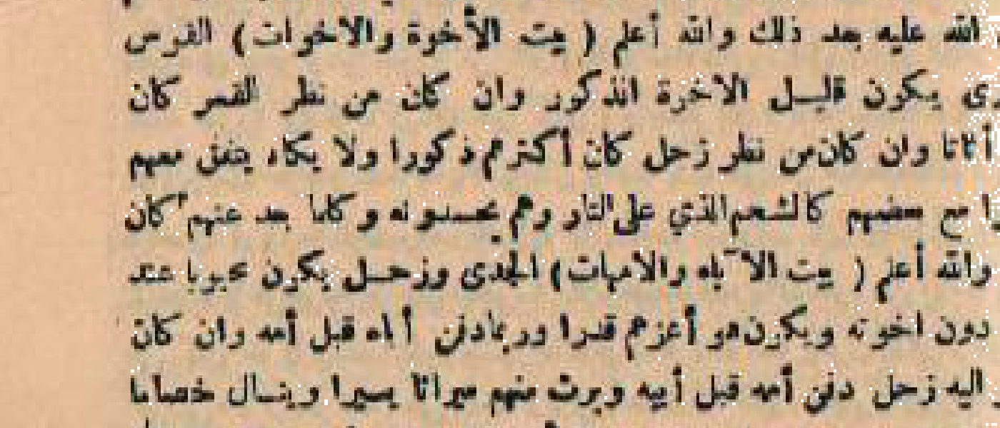

*Gambar Rajah Asli Halaman 43* — Wafaq angka pelindung buruj al-Mizan (Libra). Dibuat pada hari Jumat jam pertama dengan asapan gaharu dan kemenyan putih untuk keselamatan dan penolak bala.

---

**[Teks Arab Asli]**

والعزيمة الشريفة التى تقرأ عليه هى: بسم الله الرحمن الرحيم، قل هو الله أحد، الله الصمد، لم يلد ولم يولد، ولم يكن له كفوا أحد، يا علام الغيوب، يا مفرج الكروب، سخر لحامل كتابى هذا القلوب، وألبسه ثوب العز والمهابة والقبول، برحمتك يا أرحم الراحمين، وصلى الله على سيدنا محمد وآله وصحبه وسلم.

**[Transliterasi Latin Fonetik]**

*wal-'aziimatusy-syariifatul-latii taqra'u 'alayhi hiya  Bismillaahir-Rahmaanir-Rahiim, qullun huwa Allaahi ahadin, Allaahish-shamada, lam yalidu walam yuuladu, walam yakunnu lahu kafawaa ahada, yaa 'alaamal-ghuyuubi, yaa mufarrijal-kuruubi, sakhkhara lihaamili kitaabii haadzaal-qaluubi, wa albasahu tsawbul-'izzi wal-mahaabati wal-qabuuli, birahmatika yaa arahimar-raahimayni, wa shallaa Allaahi 'alaa sayyidinaa Muhammadin wa'aalah wa shahbihi wa sallama *

**[Terjemahan Indonesia]**

Adapun doa azimah mulia yang dibacakan atasnya adalah: "Dengan nama Allah Yang Maha Pengasih lagi Maha Penyayang. Katakanlah: Dialah Allah Yang Maha Esa, Allah tempat meminta segala sesuatu, Dia tidak beranak dan tidak pula diperanakkan, dan tiada seorang pun yang setara dengan Dia. Wahai Dzat Yang Maha Mengetahui segala hal gaib, wahai Dzat Yang Melapangkan segala duka nestapa, tundukkanlah bagi pembawa kitab/rajahku ini semua hati manusia, kenakanlah padanya pakaian kemuliaan, kewibawaan, dan penerimaan yang agung, dengan rahmat-Mu wahai Dzat Yang Paling Penyayang di antara para penyayang. Semoga shalawat serta salam senantiasa tercurah kepada junjungan kami Nabi Muhammad beserta segenap keluarga dan para sahabat beliau."

---

## HALAMAN CETAK 44 (Halaman PDF 22, sisi kanan)

**[Teks Arab Asli]**

( القول على البرج الثامن وهو برج العقرب والمريخ )
وصاحب فلك العقرب مريخه القاهر * يدعو إلى الشدة والحرب والغلب
فى طبعه حرارة ويبوسة ظاهرة * يملك السيف ويغشى الوغى والطلب
يحب المفاخرة ويعلو على الأقران * وله من النجوم كوكب النيران

**[Transliterasi Latin Fonetik]**

*(al-qawli 'alaal-burjits-tsaaminu wa huwa burjul-'Aqrabi wal-Mirriikhi)*
*wa shaahibu falak al-'Aqrabi mirriikhahul-qaahira * yad'uu ilasy-syiddati wal-harbi wal-ghulbi*
*fii thab'uhu haraaratan wa yubuusata zhaahirati * yamlikus-sayfu wa yaghsyaal-waghaa wath-thalabu*
*yuhibbul-mufaakhiratu wa ya'luu 'alaal-aqraani * wa lahu minan-nujuumi kawkabin-niyaraani*

**[Terjemahan Indonesia]**

(Uraian tentang Buruj Kedelapan, yaitu Buruj Scorpio dan Planet Penguasanya: Mars)
*Penguasa orbit Scorpio adalah Mars sang penakluk perkasa * Menyeru kepada keteguhan, peperangan, dan kemenangan gemilang*
*Dalam tabiatnya terkandung panas dan kering yang sangat nyata * Memegang pedang, menerjang kancah pertempuran dan arena pembuktian*
*Ia gemar akan kemuliaan martabat dan unggul mengungguli rekan-rekannya * Dan bagian bintangnya adalah pelindung perapian api membara.*

---

**[Gambar Rajah Asli Halaman 44 — Tilsm Buruj al-Aqrab (Scorpio)]**

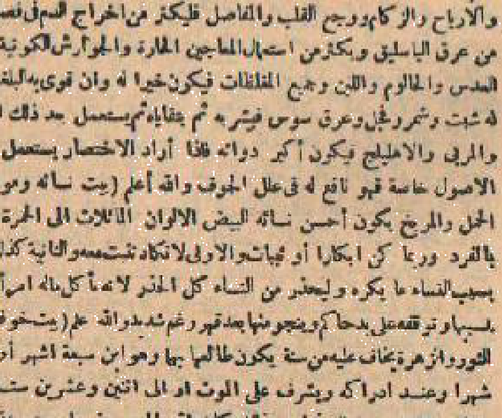

*Gambar Rajah Asli Halaman 44* — Rajah Tilsam simbolik buruj al-Aqrab (Scorpio): Sosok ksatria pejuang bersenjata pedang lambang planet Mars, menundukkan kalajengking dan mara bahaya.

---

**[Teks Arab Asli]**

( القول على طبع الطالع واختلاف الوجوه التى للإنسان والطباع التى عليه )
قال الحكيم: هو برج مائى ليلى مؤنث طبعه بارد رطب، دليله على الشجاعة والجراءة والمكر والحيلة والحدة والصرامة؛ صاحب هذا البرج يكون رجلا أسمر اللون أو مائلا إلى الحمرة، عريض الجبهة، غليظ القامة، شديد البطش، لا يثبت على عهد، سريع الغضب قريب الرضا، له علامة بوجهه أو صدره، وله ثلاثة وجوه.

**[Transliterasi Latin Fonetik]**

*(al-qawli 'alaa thab'uth-thaali'u wa ikhtilaafil-wujuuhil-latii lil-insaana wath-thibaa'il-latii 'alayhi)*
*qaalal-hakiimu  huwa burju maa'iyyun laylaa mu'annatsi thab'uhu baaridun rathbun, daliilahu 'alaa asy-syajaa'ati wal-jiraa'ati wal-makri wal-hiilati wal-haddati wash-sharaamati; shaahibu haadzaal-burji yakuunu rajulan asamaral-lawni aw maa'ilan ilal-humrati, 'ariidhal-jabhati, ghaliizhal-qaamati, syadiidun al-bathsyi, laa yutsbitu 'alaa 'ahdin, sarii'ul-ghadhabi qariibin ar-ridhaa, lahu 'ullaamatin bi-wajhihi aw shadruhu, wa lahu tsalaatsatun wujuuhin *

**[Terjemahan Indonesia]**

(Uraian tentang watak dasar thali' kelahiran, tiga wajah (wajh), serta tabiat manusia di bawah naungannya)
Berkata sang ahli falak: Buruj Scorpio adalah buruj berelemen air, bersifat malam hari, feminin, dengan karakter dingin lembap; ia menunjukkan keberanian, kegagahan, kecerdikan siasat, ketajaman insting, dan ketegasan sikap. Orang yang dilahirkan pada buruj ini umumnya berkulit sawo matang atau condong kemerahan, berdahi lebar, berperawakan tegap gempal, memiliki genggaman kuat, tidak mudah diatur oleh janji sepihak, lekas marah namun cepat mereda, memiliki tanda khusus pada wajah atau dadanya; dan buruj ini terbagi atas tiga wajah (wajh).

---

**[Teks Arab Asli]**

( الوجه الأول ) من نظر إليه المريخ: يكون رجلا شجاعا مقداما، يحب ركوب الخيل واستعمال السلاح، مهابا فى أعين الناس، يخشاه الأعداء، ينال الرئاسة والولاية، ويقهر من عاداه، ويكون شديد الحرص على جمع الأمال، قليل الوفاء للأصحاب، والله أعلم.

**[Transliterasi Latin Fonetik]**

*(al-wajhul-awwalu  min nazhara ilayhil-Mirriikhi  yakuunu rajulan syajaa'an miqdaaman, yuhibbu rukuubul-khayli wa isti'maalis-silaahi, mahaaban fii a'yunin-naasi, yakhsyaahul-a'daa'u, yanaalur-ra'aasah wal-walaayata, wa yaqharu min 'aadaahu, wa yakuunu syadiidun al-hirshi 'alaa jam'il-amaal, qaliilul-wafaa'i lil-ashhaaba, wallaahu a'lamu *) **[Terjemahan Indonesia]**

(Wajah Pertama) Bagi yang dipandang oleh planet Mars: Ia menjadi pribadi yang sangat pemberani dan berjiwa pelopor; menyukai ketangkasan berkuda dan keterampilan menggunakan senjata; disegani dalam pandangan mata masyarakat luas; ditakuti oleh lawan-lawannya; mampu meraih kepemimpinan dan jabatan penting; menundukkan siapa saja yang memusuhinya; sangat tekun dalam mengumpulkan pundi-pundi harta, namun terkadang kurang menaruh kesetiaan mendalam kepada sahabat dekatnya. Wallahu a'lam.

---

**[Teks Arab Asli]**

( الوجه الثانى ) من نظر إليه الشمس: يكون رجلا ذا بهاء وجمال، صبيح الوجه، حسن المعاشرة، كريم النفس، ينال من السلطان مرتبة حسنة، ويجود بماله للفقراء، محبوبا فى قومه، مصلحا بين الناس، ويكون له حظ فى التجارة والزراعة، والله تعالى أعلم.

**[Transliterasi Latin Fonetik]**

*(al-wajhuts-tsaanii  min nazhara ilayhisy-Syamsi  yakuunu rajulan dzaa bahaa'in wa jamaalin, shabiihal-wajhu, hasanul-mu'aasyarati, kariiman-nafsi, yanaalu minas-sulthaani martabata hasanatun, wa yajuudu bimaalihi lil-fuqaraa'a, mahbuuban fii qawmihi, mushallihaa baynan-naasi, wa yakuunu lahu hazhzhun fit-tijaarati waz-ziraa'ati, wallaahu Ta'aalaa a'lamu *) **[Terjemahan Indonesia]**

(Wajah Kedua) Bagi yang dipandang oleh Matahari: Ia menjadi pria yang berwajah cerah rupawan, berpenampilan memikat, ramah dalam pergaulan sosial, berjiwa dermawan; memperoleh kedudukan terhormat di hadapan para penguasa; suka menyedekahkan sebagian hartanya kepada kaum fakir miskin; dicintai di tengah-tengah kaumnya; menjadi juru damai di antara manusia; serta beruntung dalam perniagaan komersial dan pertanian. Wallahu Ta'ala a'lam.

---

**[Teks Arab Asli]**

( الوجه الثالث ) من نظر إليه الزهرة: يكون رجلا لطيف المعشر، محبا للطيب والزينة والنساء، ظريف الكلام، يميل إلى اللهو والطرب، سريع الانقياد للعاطفة، ينفق ماله فى الشهوات، وربما ابتلى بمرض فى بدنه من كثرة الجماع، وله حظ عند النساء، والله أعلم.

**[Transliterasi Latin Fonetik]**

*(al-wajhuts-tsaalitsu  min nazhara ilayhiz-Zuharati  yakuunu rajulan li-thayfal-ma'syari, muhibban lith-thayyiba waz-zaynata wan-nisaa'i, zhariifal-kilaami, yamiilu ilal-lahwi wath-tharabi, sarii'ul-inqiyaadi lil-'aathifata, yunfiqu maalihi fisy-syahwaati, wa rubbamaa ibtalaa bimaradhin fii badanihi min katsratil-jimaa'i, wa lahu hazhzhun 'indan-nisaa'i, wallaahu a'lamu *) **[Terjemahan Indonesia]**

(Wajah Ketiga) Bagi yang dipandang oleh planet Venus: Ia menjadi pria yang sangat lembut tutur katanya, mencintai wewangian harum, perhiasan indah, dan kaum wanita; pandai bertutur kata manis; menyukai kesenian dan hiburan kegembiraan; mudah terhanyut oleh dorongan asmara; gemar membelanjakan hartanya untuk kesenangan hidup; terkadang diuji dengan penurunan stamina tubuh karena seringnya bersenggama; dan ia senantiasa bernasib mujur serta disukai oleh kaum hawa. Wallahu a'lam.

---

## HALAMAN CETAK 45 (Halaman PDF 22, sisi kiri)

**[Teks Arab Asli]**

( بيت حياته ومعيشته ) العقرب والمريخ: تكون معيشته فى أول عمره ضيقة ومشوّشة، ويكابد المشاق والأسفار فى طلب الرزق، فإذا بلغ سن الأربعين فتح الله عليه أبواب الخيرات، ونال رزقا واسعا، ويكون ماله من السيف والخصومات أو من التجارة الحذقة، ولا يموت إلا غنيا مستورا، والله أعلم.

**[Transliterasi Latin Fonetik]**

*(baytu hayaatihi wa ma'iisyatihi  al-'Aqrabi wal-Mirriikhi  takuunu ma'iisyatuhu fii awwalu 'umruhu dhayyiqatan wa musyawwasyatan, wa yukaabidul-masyaaqqu wal-asfaaru fii thalabir-rizqi, fa-idzaa balagha sinnul-arba'ayni fa-tha Allaahi 'alayhi abwaabal-khayraati, wa naala rizqaa wa asi'aa, wa yakuunu maalihi minas-sayfi wal-khushuumaati aw minat-tijaaratil-hadzaqati, wa laa yamuutu illaa ghaniyyan mastuuran, wallaahu a'lamu *) **[Terjemahan Indonesia]**

(Rumah kehidupan dan penghidupannya) Scorpio dan Mars: Penghidupannya pada masa awal usia muda terasa sempit dan berliku; ia harus menanggung jerih payah dan berbagai perjalanan jauh demi mencari nafkah; namun tatkala ia telah menginjak usia empat puluh tahun, Allah membukakan baginya pintu-pintu kebajikan, ia dianugerahi rezeki yang lapang, dan sumber penghasilannya banyak didapat dari profesi kemiliteran/ketegasan hukum atau perniagaan yang lihai; ia tidak akan berpulang ke rahmatullah melainkan dalam keadaan berkecukupan dan terhormat. Wallahu a'lam.

---

**[Teks Arab Asli]**

( بيت ماله وتجارته ) القوس والمشترى: يجمع أموالا جزيلة من جهات شتى، وينفق منها بسخاء على أهله وعياله، وربما ضاع منه شىء من المال فى تجارة البحر ثم يعوضه الله خيرا منه، وله حظ فى شراء الأراضى والعقارات، والله أعلم.

**[Transliterasi Latin Fonetik]**

*(baytu maalihi wa tijaaratihi  al-Qawsi wal-Musytarii  yajma'u amawwaalan jaziilatan min jihaati syattaa, wa yunfiqu minhaa bisakhaa'in 'alaa ahlihi wa 'iyaalihi, wa rubbamaa dhaa'a minhu syay'in minal-maali fii tijaaratil-bahri tsumma yu'awwidhuhu Allaahi khayran minhu, wa lahu hazhzhun fii syiraa'il-araadhii wal-'aqaaraati, wallaahu a'lamu *) **[Terjemahan Indonesia]**

(Rumah harta benda dan perniagaannya) Sagittarius dan Yupiter: Ia mampu menghimpun kekayaan melimpah dari berbagai sumber usaha; membelanjakannya dengan murah hati untuk keluarga dan tanggungannya; terkadang ada sebagian modalnya yang merugi dalam ekspedisi perniagaan laut namun kemudian Allah menggantinya dengan laba berlipat ganda; ia sangat beruntung dalam investasi tanah dan kepemilikan properti/bangunan. Wallahu a'lam.

---

**[Teks Arab Asli]**

( بيت إخوته وأخواته ) الجدى وزحل: يكون قليل الإخوة، ولا يتفق معهم فى رأى ولا مشورة، بل يلقى منهم الحسد والعداوة، وكلما بعد عنهم كان خيرا له وأسلم لعرضه وماله، وينال من الغرباء ما لا يناله من أقربائه، والله تعالى أعلم.

**[Transliterasi Latin Fonetik]**

*(baytu ikhwatihi wa akhawaatihi  al-Jadyi wa Zuhala  yakuunu qaliilul-ikhwati, wa laa yattafiqu ma'ahum fii ra'aa wa laa masyuuratin, bal yulqaa minhum al-hasada wal-'adaawata, wa kullamaa ba'da 'anahum kaana khayran lahu wa usallimu li-'ardhihi wa maalihi, wa yanaalu minal-ghurabaa'i maa laa yanaalah min aqribaa'ihi, wallaahu Ta'aalaa a'lamu *) **[Terjemahan Indonesia]**

(Rumah saudara laki-laki dan perempuannya) Capricorn dan Saturnus: Ia hanya memiliki sedikit saudara kandung; tidak sejalan dengan mereka dalam pandangan maupun musyawarah; bahkan ia kerap menghadapi kedengkian dan sikap dingin dari mereka; semakin ia menjaga jarak dari mereka maka itu semakin baik dan menyelamatkan kehormatan serta hartanya; ia justru mendapatkan kebaikan dari orang lain yang tidak ia dapati dari kerabat dekatnya sendiri. Wallahu Ta'ala a'lam.

---

**[Teks Arab Asli]**

( بيت آبائه وأمهاته ) الدلو وزحل: يرث من والديه خيرا قليلا، ويدفن أمه قبل أبيه، ويكون أبوه محبا له راضيا عنه، وينال من بركة دعاء والديه ما ينجيه من المهالك، والله سبحانه أعلم.

**[Transliterasi Latin Fonetik]**

*(baytu aabaa'ihi wa ummahaatihi  ad-Dalwi wa Zuhala  yaritsu min wad-diihu khayran qaliilan, wa yadfinu ummihi qabla abiihi, wa yakuunu abuuhu muhibban lahu raadhiyan 'anhu, wa yanaalu min barakatin du'aa'i wad-diihu maa yunjiihi minal-mahaaliki, wallaahu Subhaanahu a'lamu *) **[Terjemahan Indonesia]**

(Rumah bapak dan ibunya) Aquarius dan Saturnus: Ia memperoleh warisan materiil yang sedikit dari kedua orang tuanya; memakamkan ibunya lebih dahulu sebelum ayahnya; ayahnya sangat menyayanginya dan meridhai jalan hidupnya; berkat doa restu kedua orang tuanyalah ia senantiasa terselamatkan dari berbagai jurang kebinasaan. Wallahu Subhanahu wa Ta'ala a'lam.

---

## HALAMAN CETAK 46 (Halaman PDF 23, sisi kanan)

**[Teks Arab Asli]**

( بيت أولاده وأفراحه ) الحوت والمشترى: يكون أكثر أولاده الذكور، وينال منهم فرحا وسرورا، ويبرز منهم ولد نجيب يعلو شأنه وينال جاها عظيما، وربما مات له ولد فى صغره فيحزن عليه، ثم يعقبه بالخلف الصالح، والله أعلم.

**[Transliterasi Latin Fonetik]**

*(baytu awlaadihi wa afraahihi  al-Huuti wal-Musytarii  yakuunu aktsaru awlaadihidz-dzukuuri, wa yanaalu minhum fa-rahan wa suruuran, wa yubrizu minhum waladin najiiba ya'luu sya'nuhu wa yanaalu jaahaa 'azhiiman, wa rubbamaa maata lahu waladin fii shigharihi fa-yahuzna 'alayhi, tsumma yu'qibuhu bil-khalfish-shaalihi, wallaahu a'lamu *) **[Terjemahan Indonesia]**

(Rumah anak-anak dan kebahagiaannya) Pisces dan Yupiter: Sebagian besar keturunannya adalah anak laki-laki; ia memetik kegembiraan dan kebanggaan dari mereka; di antara anak-anaknya akan muncul seorang putra yang cerdas berpangkat tinggi dan terpandang martabatnya; terkadang seorang putranya wafat di masa kecil yang membuatnya berduka, namun Allah memberinya pengganti keturunan yang saleh. Wallahu a'lam.

---

**[Teks Arab Asli]**

( بيت أمراضه وعلله ) الحمل والمريخ: تصيبه الأمراض الحارة كالحميات ووجع الرأس والدمامل والبواسير ووجع الكبد، فليكثر من شرب السكنجبين وأكل الخيار والقرع والبقول الباردة، ويحذر من أكل اللحوم الحارة والتوابل الحريفة، ويفصد عرق القيفال فى الربيع، والله أعلم.

**[Transliterasi Latin Fonetik]**

*(baytu amraadhihi wa 'ilalihi  al-Hamali wal-Mirriikhi  tushiibuhul-amraadhul-haarratu kal-hummayaati wa waja'ir-ra'si wad-damaamili wal-bwaasiiri wa waja'il-kabidi, fa-layuktsiru min syurbis-sakanjabiini wa aklil-khiyaari wal-qar'i wal-buquulil-baaridati, wa yuhadzdziru min akull al-luhuumil-haarrati wat-tawaabilil-hariifata, wa yafshidu 'irqul-qiifaalu fir-rabii'i, wallaahu a'lamu *) **[Terjemahan Indonesia]**

(Rumah penyakit dan keluhannya) Aries dan Mars: Ia rentan terserang penyakit berelemen panas seperti demam tinggi, sakit kepala sebelah (migrain), bisul-bisul, wasir/ambeien, dan gangguan organ hati; maka hendaklah ia memperbanyak minum ramuan oxymel (sikinjabin), mentimun, labu air, dan sayuran pendingin; menghindari makanan daging berlemak panas serta bumbu-bumbu yang terlalu pedas menyengat; dan melakukan fashdu (terapi buang darah) pada urat cephalic (vena cephalica) di musim semi. Wallahu a'lam.

---

**[Teks Arab Asli]**

( بيت نسائه وفراشه ) الثور والزهرة: يتزوج من النساء اثنتين أو ثلاثا، وتكون أولى نسائه شريفة حسيبة، وينال بسببها خيرا ومالا، لكنها تكون غيورة حديدة اللسان، ثم يتزوج بعدها امرأة أخرى تعينه على دنياه ويقر بها قلبه، والله أعلم.

**[Transliterasi Latin Fonetik]**

*(baytu nisaa'ihi wa firaasyihi  ats-Tsawri waz-Zuharati  yatazawwaju minan-nisaa'i atsanatiin aw tsalaatsan, wa takuunu wlaa nisaa'ihi syariifata hasiibata, wa yanaalu bisababihaa khayran wa maalan, lakinnahaa takuunu ghayuurata hadiidatil-lisaani, tsumma yatazawwaju ba'dahaa imra'atun ukhraa ta'ayyunihi 'alaa dunyaahi wa yuqirru bihaa qalbihi, wallaahu a'lamu *) **[Terjemahan Indonesia]**

(Rumah wanita-wanita dan ranjangnya) Taurus dan Venus: Ia menikahi dua atau tiga orang wanita; istri pertamanya adalah wanita terhormat dari keturunan bangsawan, yang melaluinya ia memperoleh rezeki dan status; namun wanita itu memiliki tabiat pencemburu dan berlidah tajam; kemudian ia menikahi wanita lain setelahnya yang tulus membantunya dalam urusan duniawi serta menentramkan hatinya. Wallahu a'lam.

---

**[Teks Arab Asli]**

( بيت خوفه وموته ) الجوزاء وعطارد: يخاف عليه من ضربة سيف أو طعنة رمح أو سقطة من مكان مرتفع، وأعوام الخطر عنده: تسع سنين، وثماني عشرة سنة، وسبع وثلاثون سنة، وخمسون سنة، فان نجا منها امتد عمره إلى ثمانين سنة، والله أعلم.

**[Transliterasi Latin Fonetik]**

*(baytu khawfihi wa mawtihi  al-Jawzaa'i wa 'Uthaarida  yukhaafu 'alayhi min dharbati sayfin aw tha'natu rumhin aw saqthatun min makaani murtafi'i, wa a'waamal-khuthuri 'indahu  tasa'u siniina, wa tsamaanii 'asyrata sanatin, wa sab'i wa tsalaatsuuna sanatin, khamsuuna sanatin, fa-in najaa minhaa imtadda 'umruhu ilaa tsamaaniina sanatin, wallaahu a'lamu *) **[Terjemahan Indonesia]**

(Rumah ketakutan dan kematiannya) Gemini dan Merkurius: Dikhawatirkan atasnya bahaya tebasan pedang, luka senjata tajam, atau terjatuh dari tempat yang tinggi; tahun-tahun rawan dalam hidupnya berada pada usia sembilan tahun, delapan belas tahun, tiga puluh tujuh tahun, dan lima puluh tahun; bila ia mampu melewati semua masa kritis tersebut, usianya akan berlanjut hingga delapan puluh tahun. Wallahu a'lam.

---

**[Teks Arab Asli]**

( بيت أسفاره وحركاته ) السرطان والقمر: يكثر أسفاره فى البر والبحر، ويكون سفره إلى بلاد الشمال والشرق مباركا ميمونا، وينال فى أسفاره أرباحا طائلة وتجارات رابحة، ويرزق حج بيت الله الحرام وزيارة قبر النبى عليه الصلاة والسلام، والله أعلم.

**[Transliterasi Latin Fonetik]**

*(baytu asfaarihi wa harakaatihi  as-Sarathaani wal-Qamari  yaktsuru asfaarihi fil-barri wal-bahri, wa yakuunu safarihi ilaa bilaadisy-syamaali wasy-syarqi mubaarakan maymuunan, wa yanaalu fii asfaarihi arubbaahan thaa'ilatan wa tijaaraatin raabihatin, wa yurzaqu hajja baytu Allaahil-Haraami wa ziyaarati qabrin-Nabiyyi 'alayhish-shalaatu was-sullaamu, wallaahu a'lamu *) **[Terjemahan Indonesia]**

(Rumah perjalanan-perjalanan dan mobilitasnya) Cancer dan Bulan: Ia kerap melakukan perjalanan jauh melalui rute darat maupun perairan laut; perjalanannya ke negeri-negeri utara dan timur membawa keberkahan serta kemudahan; ia mendulang laba melimpah dari perniagaannya saat musafir; serta dianugerahi kesempatan menunaikan ibadah haji ke Baitullah al-Haram dan ziarah ke makam Nabi Muhammad shallallahu 'alaihi wa sallam. Wallahu a'lam.

---

**[Teks Arab Asli]**

( بيت عزه وسلطانه ) الأسد والشمس: يرتفع شأنه عند الملوك والأمراء وأكابر الدولة، ويولى المناصب الجليلة كقيادة الجيش أو الإمارة، وتنفذ كلمته بين الأنام، ويصير ملجأ لأصحاب الحوائج، والله سبحانه أعلم.

**[Transliterasi Latin Fonetik]**

*(baytu 'izzihi wa sulthaanihi  al-Asadi wasy-Syamsi  yartafi'u sya'nuhu 'indal-muluuki wal-umaraa'i wa akaabirid-dawlati, wa yuulaal-manaashibal-jaliilata kaqiyaadatil-jaysyi aw al-amaaratu, wa tunaffidzu kalimatuhu baynal-anaami, wa yashiiru malja'un li-ashhaabal-hawaa'iji, wallaahu Subhaanahu a'lamu *) **[Terjemahan Indonesia]**

(Rumah kewibawaan dan kepemimpinannya) Leo dan Matahari: Martabatnya terangkat luhur di mata para raja, pangeran, dan petinggi negara; ia dipercaya memangku jabatan-jabatan strategis seperti panglima komando pasukan atau kepemimpinan daerah; instruksinya dipatuhi di tengah khalayak, dan ia menjadi rujukan tempat meminta bantuan bagi orang-orang yang berhajat. Wallahu Subhanahu wa Ta'ala a'lam.

---

## HALAMAN CETAK 47 (Halaman PDF 23, sisi kiri)

**[Teks Arab Asli]**

( بيت رجائه وآماله ) السنبلة وعطارد: يرجو أمورا عظاما فى جمع الثروة وامتلاك الضياع والبساتين، فيعطيه الله فوق ما يؤمل، ويكون صاحب عزم صادق إذا نوى عملا أتمه بعون الله وتوفيقه، والله أعلم.

**[Transliterasi Latin Fonetik]**

*(baytu rajaa'ihi wa aamaalihi  as-Sunbulati wa 'Uthaarida  yarjuu amuurraa 'izhaaman fii jam'its-tsarwati wa imtilaakidh-dhayaa'i wal-basaatiini, fa-yu'thiihi Allaahi fawq maa yu'malu, wa yakuunu shaahibu 'azmi shaadiqi idzaa nawaa 'amalan atammahu bi'awni Allaahi wa tawfiiqihi, wallaahu a'lamu *) **[Terjemahan Indonesia]**

(Rumah cita-cita dan harapannya) Virgo dan Merkurius: Ia menggantungkan harapan-harapan besar untuk mengumpulkan kekayaan, memiliki perkebunan luas, dan aset-aset berharga; Allah akan mengaruniainya pencapaian melampaui apa yang ia bayangkan sebelumnya; ia dianugerahi tekad membaja yang mana jika ia telah berniat mengerjakan sesuatu, ia akan menyelesaikannya secara paripurna dengan pertolongan dan taufik Allah. Wallahu a'lam.

---

**[Teks Arab Asli]**

( بيت أعدائه وحساده ) الميزان والزهرة: أعداؤه من أصحاب الدهاء والنفاق الذين يظهرون المودة ويبطنون العداوة، وخاصة من كان طالعه هوائيا، فليحذر من مخالطة الفساق والوشاة، فان الله تعالى كافيه وناصره عليهم، والله تعالى أعلم.

**[Transliterasi Latin Fonetik]**

*(baytu a'daa'ihi wa hussaadihi  al-Miizaani waz-Zuharati  a'addaa'uhu min ashhaabid-dahaa'i wan-nifaaqidz-dziin yazhharuunal-mawaddata wa yabthunuunal-'adaawata, wa khaashshatan min kaana thaali'uhu hawaa'iyyan, fa-layuhadzdziru min mukhaalathatil-fussaaqi wal-wusyaati, fa-in Allaahi Ta'aalaa kaafiyuhu wa naashiruhu 'alayhim, wallaahu Ta'aalaa a'lamu *) **[Terjemahan Indonesia]**

(Rumah musuh dan para pendengkinya) Libra dan Venus: Musuh-musuhnya adalah kalangan orang munafik yang bermuka manis; mereka menampakkan persahabatan di depan mata namun menyembunyikan permusuhan di dalam dada, terkhusus orang-orang yang berbintang elemen udara; maka hendaklah ia waspada jangan sampai bergaul erat dengan para penyebar fitnah; sesungguhnya Allah Ta'ala senantiasa mencukupkan perlindungan dan menolongnya atas tipu daya mereka. Wallahu Ta'ala a'lam.

---

**[Teks Arab Asli]**

( ولصاحب هذا البرج من أشكال الرمل شكل الحمرة )
قال الشيخ أبو معشر الفلكى: اعلم أيها السائل أن شكل الحمرة يدل على القوة والغلبة والظفر على الخصوم، ولكن فيه تحذير من التهور وسفك الدماء بغير حق، فعليك بالعدل والرفق فى جميع أمورك تبلغ المقاصد وتسلم من العواقب، واسمع ما قيل:
لا تظلمن إذا ما كنت مقتدرا * فالظلم ترجع عقباه إلى الندم
تنام عيناك والمظلوم منتبه * يدعو عليك وعين الله لم تنم

**[Transliterasi Latin Fonetik]**

*(wa li-shaahibi haadzaal-burji min asykaalir-ramli syaklul-humrati)*
*qaalasy-syaykhu Abuu Ma'syarin al-Falakiyyu  i'lam ayyuhas-saa'ilu an syaklul-humrati yadullu 'alaal-quwwati wal-ghulbati wazh-zhafari 'alaal-khushuumi, walakinn fiihi tahdziira minat-tahawwuri wa safkid-dimaa'i baghayri haqqin, fa'alayka bil-'adli war-rifqi fii jamii'i umuurika tablughul-maqaashidu wa tasallumun minal-'awaaqibi, wa isma' maa qiila:*
*laa tuzhliminna idzaa maa kannat muqtadiraa * fazh-zhulma tarji'u 'aqibaahu ilan-nadami*
*tunaamu 'aynaaka wal-mazhluumu muntabihu * yad'uu 'aliyyuka wa'ayn Allaahi lam tunammi*

**[Terjemahan Indonesia]**

(Bagi pemilik buruj ini dari bentuk-bentuk ilmu geomansi/raml adalah bentuk *al-Humrah*)
Berkata Syaikh Abu Ma'syar al-Falaki: Ketahuilah wahai penanya, sesungguhnya lambang al-Humrah menunjukkan kekuatan, keunggulan, dan kemenangan mutlak atas lawan-lawan; namun di dalamnya terkandung peringatan keras agar menjauhi sikap gegabah, amarah membabi buta, dan pertumpahan darah tanpa hak; maka peganglah keadilan dan kelemahlembutan dalam seluruh urusanmu niscaya engkau mencapai puncak tujuan dan selamat dari mara bahaya; simaklah bait mutiara hikmah ini:
*Jangan sekali-kali engkau berbuat zalim tatkala engkau memiliki kekuasaan * Karena kezaliman itu pada akhirnya hanya berujung penyesalan mendalam*
*Kedua matamu terlelap nyenyak sementara orang yang terzalimi terjaga * Ia mendoakan keburukan atasmu, dan mata pengawasan Allah tak pernah tidur.*

---

## HALAMAN CETAK 48 (Halaman PDF 24, sisi kanan)

**[Teks Arab Asli]**

وهذا هو السطر الحرفى والخاتم المبارك لصاحب برج العقرب: يكتب فى ساعة المريخ من يوم الثلاثاء فى لوح من حديد أو نحاس أحمر، أو بمداد الزعفران والمسك وماء الورد على كاغد نقى، ويبخر بالصندل الأحمر والكندر والحلتيت، ويعلق عليه، وهذا رسم السطر والخاتم.

**[Transliterasi Latin Fonetik]**

*wa haadzaa huwas-sathril-hirafii wal-khaatamul-mubaaraki li-shaahiba burjul-'Aqrabi  yaktubu fii saa'atal-Mirriikhi min yawmats-Tsulaatsaa'i fii lawhin min hadiidin aw nahhaasu ahmaru, aw bimidaadiz-za'faraani wal-maski wa maa'il-wardi 'alaa kaaghidi naqqaa, wa yubakhkhiru bish-shandalil-ahmaru wal-kunduri wal-hiltiiti, wa yu'alliqu 'alayhi, wa haadzaa rasmis-sathri wal-khaatamu *

**[Terjemahan Indonesia]**

Inilah barisan huruf asma (satr huruf) dan khatam/wafaq pelindung berkah bagi pemilik buruj Scorpio: Ditulis pada sa'ah (jam) Mars di hari Selasa di atas lempengan besi atau tembaga merah, atau menggunakan tinta larutan za'faran, misik murni, dan air mawar di atas kertas suci; kemudian diasapi dengan uap kayu cendana merah, kemenyan kundur, dan getah hiltit (asafoetida); lalu dikenakan sebagai azimat penjaga — dan inilah gambar rajah baris huruf dan wafaq tersebut.

---

**[Gambar Rajah Asli Halaman 48 — Satar Huruf & Wafaq al-Aqrab]**

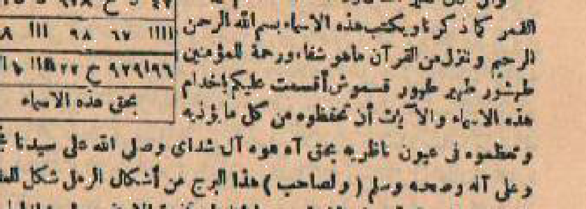

*Gambar Rajah Asli Halaman 48 (Rajah 1)* — Barisan huruf misterius pelindung buruj Scorpio (Satar Huruf al-Aqrab). Ditulis untuk kekebalan batin, kewibawaan tinggi, dan meredam kejahatan musuh.

---

**[Gambar Rajah Asli Halaman 48 — Wafaq Angkal-Aqrab]**

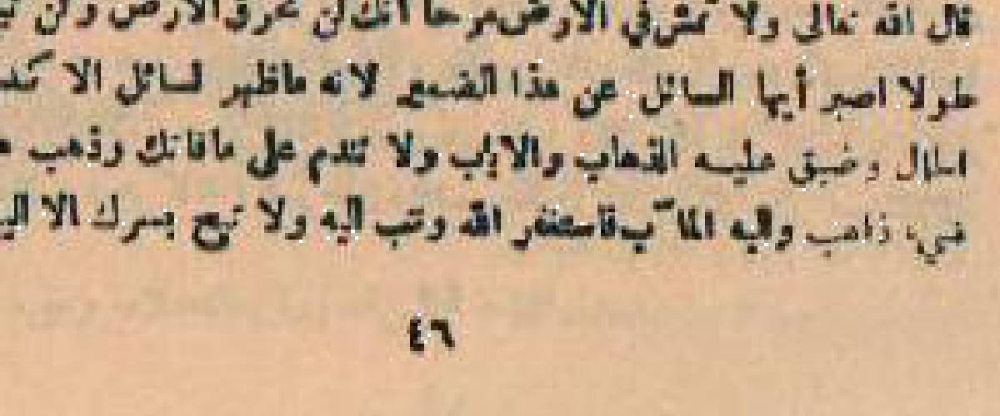

*Gambar Rajah Asli Halaman 48 (Rajah 2)* — Wafaq angka kotak keramat buruj Scorpio untuk pertahanan diri dan penakluk lawan.

---

**[Teks Arab Asli]**

وهذه هى العزيمة والدعاء لصاحب البرج:
بسم الله الرحمن الرحيم، يا قاهر يا جبار يا ذا البطش الشديد، يا مذل الجبابرة وقاصم الأكاسرة، اكفنى شر الأشرار وكيد الفجار وما اختلف عليه الليل والنهار، واجعل لى نورا من نورك، وسلطانا من سلطانك، وأيدنى بجندك الغالبين، وصلى الله على نبينا محمد وآله وسلم تسليما.

**[Transliterasi Latin Fonetik]**

*wa haadzihi hiyal-'aziimata wad-du'aa'a li-shaahibal-burji:*
*Bismillaahir-Rahmaanir-Rahiim, yaa qaahira yaa jabbaari yaa dzaal-bathsyisy-syadiidi, yaa madzilal-jabaabiratu wa qaashimul-akaasirati, akfinii syarrin al-asyaraar wa kayadil-fujjaari wa maa ikhtalafa 'alayhil-layla wan-nahaari, wa ij'al lii nuuran min nuurika, wa sulthaanan min sulthaanika, wa'iidan bijundikal-ghaalibiina, wa shallaa Allaahi 'alaa nabiyyinaa Muhammadin wa'aalah wa sallama tasliiman *

**[Terjemahan Indonesia]**

Inilah bacaan azimah dan doa pelindung bagi pemilik buruj Scorpio:
"Dengan nama Allah Yang Maha Pengasih lagi Maha Penyayang. Wahai Dzat Yang Maha Menundukkan, wahai Dzat Yang Maha Perkasa, wahai Pemilik Siksa Yang Amat Dahsyat, wahai Dzat Yang Menghinakan kaum tirani dan Menghancurkan kesombongan raja-raja zalim; lindungilah diriku dari kejahatan orang-orang jahat, tipu daya para pendosa, dan marabahaya silih bergantinya siang dan malam; karuniakanlah kepadaku cahaya dari cahaya-Mu, kewibawaan dari kekuasaan-Mu, serta kuatkanlah diriku dengan tentara-Mu yang senantiasa menang. Semoga shalawat serta salam sempurna senantiasa tercurah kepada nabi kami Muhammad beserta keluarganya."

---

## HALAMAN CETAK 49 (Halaman PDF 24, sisi kiri)

**[Teks Arab Asli]**

( القول على البرج التاسع وهو برج القوس والمشترى )
وصاحب فلك القوس مشتريه السعيد * يدل على الدين والعلم والكرم
له الحكمة العظمى ورأى سديد * ويعلو على سائر الخلق بالهمم
يحب السخاء ويجفو البخيل * ويرزق فى دهره بالجميل

**[Transliterasi Latin Fonetik]**

*(al-qawli 'alaal-burjit-taasi'u wa huwa burjul-Qawsi wal-Musytarii)*
*wa shaahibu falak al-Qawsi musytariyihis-sa'iidi * yadullu 'alaa ad-diini wal-'ilmi wal-karami*
*lahul-hukmatil-'uzhmaa wa ra'aa sadiidu * wa ya'luu 'alaa saa'iril-khalqi bil-himami*
*yuhibbus-sakhaa'u wa yajfuul-bakhiilu * wa yurzaqu fii dahrihi bil-jamiili*

**[Terjemahan Indonesia]**

(Uraian tentang Buruj Kesembilan, yaitu Buruj Sagittarius dan Penguasanya: Yupiter)
*Penguasa peredaran Sagittarius adalah Yupiter sang pembawa keberuntungan agung * Memberi petunjuk pada kemantapan agama, kedalaman ilmu, dan kemuliaan derma*
*Baginya dianugerahi hikmah yang luhur dan pandangan yang lurus tepat sasaran * Mengangkat martabatnya di atas seluruh makhluk dengan cita-cita yang tinggi membaja*
*Ia mencintai kedermawanan dan membenci watak orang kikir * Serta dikaruniai sepanjang hayatnya dengan segala keindahan rupa dan budi.*

---

**[Teks Arab Asli]**

( القول على طبع الطالع واختلاف الوجوه والطباع )
قال الحكيم الفلكى: برج القوس برج نارى نهارى ذكر طبعه حار يابس، يدل على الشرف والعزة والنبل وعلو الهمة والشهامة ومحبة العلوم والحكمة؛ صاحب هذا البرج يكون رجلا أبيض اللون مشربا بحمرة، جميل القامة، مليح العينين، حسن اللحية، واسع الصدر، شجاع القلب، صادق اللهجة، وله ثلاثة وجوه.

**[Transliterasi Latin Fonetik]**

*(al-qawli 'alaa thab'uth-thaali'u wa ikhtilaafil-wujuuhi wath-thibaa'i)*
*qaalal-hakiimul-Falakiyyu  burjul-Qawsi burju naariyyun nahaaraa dzakara thab'uhu haarrun yaabisun, yadullu 'alaa asy-syarafi wal-'izzati wan-nabli wa 'uluwwil-hammati wasy-syahaamati wa mahabbatil-'uluumi wal-hukmati; shaahibu haadzaal-burji yakuunu rajulan abyadhul-lawni masyraban bi-humratin, jamiilal-qaamati, maliihal-'aynayni, hasanul-lihyati, waasi'ush-shadri, syijaa'al-qalbi, shaadiqal-lahjati, wa lahu tsalaatsatun wujuuhin *

**[Terjemahan Indonesia]**

(Uraian tentang watak thali' kelahiran, ragam wajah, dan tabiat manusia di bawah naungannya)
Berkata sang ahli astrologi: Buruj Sagittarius adalah buruj berelemen api, bersifat siang hari, maskulin, dengan watak panas dan kering; menjadi pertanda kemuliaan, kehormatan, keluhuran jiwa, cita-cita tinggi, keberanian kesatria, serta kecintaan mendalam pada ilmu pengetahuan dan filsafat hikmah. Orang yang bernaung di bawah buruj ini berpostur tubuh rupawan, berkulit putih merona kemerahan, kedua matanya indah memikat, berjanggut rapi, berdada bidang, berhati teguh berani, jujur dalam bertutur kata; dan ia memiliki tiga wajah (wajh).

---

## HALAMAN CETAK 50 (Halaman PDF 25, sisi kanan)

**[Gambar Rajah Asli Halaman 50 — Tilsm Buruj al-Qaus (Sagittarius)]**

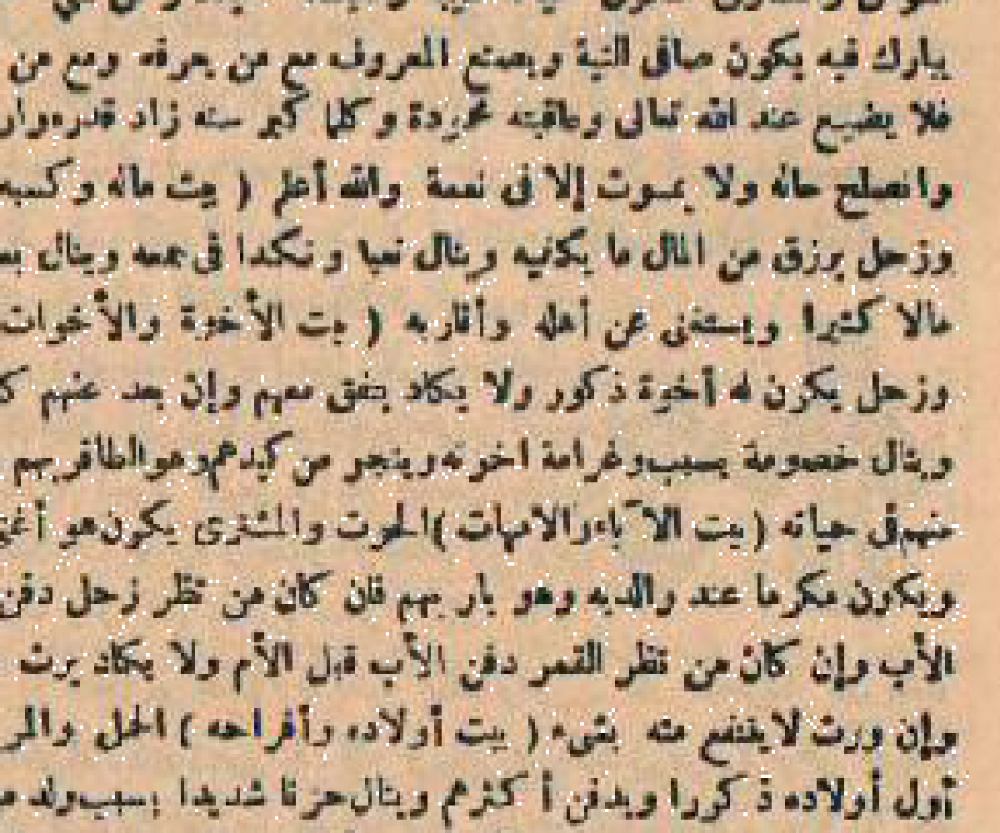

*Gambar Rajah Asli Halaman 50* — Gambar rajah Tilsam buruj al-Qaus (Sagittarius): Sosok ksatria pemanah berkuda (Centaur) memegang busur dan anak panah panji keberuntungan planet Yupiter.

---

**[Teks Arab Asli]**

( الوجه الأول ) من نظر إليه المشترى: يكون فقيها أو قاضيا أو عالما جليلا، يطلب العلوم الشرعية والحكمية، ويكون موثوقا عند الحكام والأمراء، محببا إلى العامة والخاصة، ينال من المال والخير الشيء الكثير، ويبارك له فى عمره ورزقه، والله أعلم.

**[Transliterasi Latin Fonetik]**

*(al-wajhul-awwalu  min nazhara ilayhil-Musytarii  yakuunu fa-qiihan aw qaadhiyan aw 'aalamaa jaliilaa, yathlubul-'uluumusy-syar'iyyati wal-hukmiyyati, wa yakuunu mawtsuuqan 'indal-hukkaami wal-umaraa'i, muhabbaban ilal-'aammati wal-khaashshati, yanaalu minal-maali wal-khayrisy-syay'al-katsiira, wa yubaariku lahu fii 'umruhu wa rizqihi, wallaahu a'lamu *) **[Terjemahan Indonesia]**

(Wajah Pertama) Bagi yang dipandang oleh planet Yupiter: Ia berpotensi besar menjadi seorang ahli fikih, hakim agung, atau ulama terkemuka; tekun menuntut ilmu-ilmu syariat dan hikmah falsafah; dipercaya di kalangan para penguasa dan pejabat tinggi; dicintai oleh masyarakat umum maupun kalangan terpelajar; memperoleh kekayaan dan kelimpahan rezeki yang banyak; serta diberkahi umur dan penghidupannya. Wallahu a'lam.

---

**[Teks Arab Asli]**

( الوجه الثانى ) من نظر إليه المريخ: يكون رجلا جريئا شجاعا، يحب الأسفار وركوب المخاطر، وربما كان جنديا أو صاحب حروب، ينال الغلبة على أقرانه، ويجمع أموالا من الغنائم والتجارات، ويعتريه الغضب سريعا، والله تعالى أعلم.

**[Transliterasi Latin Fonetik]**

*(al-wajhuts-tsaanii  min nazhara ilayhil-Mirriikhi  yakuunu rajulan jirrii'an syajaa'an, yuhibbul-asfaaru wa rukuubul-makhaathiri, wa rubbamaa kaana jundiyyan aw shaahibu huruubin, yanaalul-ghulbata 'alaa aqraanihi, wa yajma'u amawwaalan minal-ghanaa'imi wat-tijaaraati, wa ya'tariihil-ghadhabu sarii'an, wallaahu Ta'aalaa a'lamu *) **[Terjemahan Indonesia]**

(Wajah Kedua) Bagi yang dipandang oleh planet Mars: Ia berwatak pemberani dan tangguh; menyukai petualangan penjelajahan dan mengambil tantangan berisiko; terkadang berprofesi sebagai prajurit atau komandan lapangan; unggul mengalahkan rival-rivalnya; mengumpulkan kekayaan dari hasil rampasan yang halal dan perniagaan strategis; namun memiliki emosi yang cepat tersulut. Wallahu Ta'ala a'lam.

---

**[Teks Arab Asli]**

( الوجه الثالث ) من نظر إليه الشمس: يكون رجلا ذا سطوة ورياسة، صبيح الوجه، سخى الكف، محبا للفقراء والمساكين، ينال رئاسة فى قومه، وتأتيه الأموال من جهات شتى بغير تعب ولا مشقة، ويكون مباركا فى أهله وولده، والله أعلم.

**[Transliterasi Latin Fonetik]**

*(al-wajhuts-tsaalitsu  min nazhara ilayhisy-Syamsi  yakuunu rajulan dzaa sathwatin wariiaasah, shabiihal-wajhu, sakhaal-kaffu, muhibban lil-fuqaraa'a wal-masaakiina, yanaalu ra'aasah fii qawmihi, wa ta'tiihil-amwaali min jihaati syattaa baghayri ta'abin wa laa masyaqqatin, wa yakuunu mubaarakan fii ahlihi wa waladihi, wallaahu a'lamu *) **[Terjemahan Indonesia]**

(Wajah Ketiga) Bagi yang dipandang oleh Matahari: Ia memiliki karisma wibawa kepemimpinan yang memukau; berparas tampan bersinar; sangat dermawan tangannya; menyayangi kaum fakir dan miskin; diangkat menjadi pemimpin di tengah kaumnya; pundi-pundi kekayaan mengalir kepadanya dari berbagai penjuru tanpa kesulitan yang memberatkan; serta dianugerahi keberkahan dalam keluarga dan keturunannya. Wallahu a'lam.

---

**[Teks Arab Asli]**

( بيت حياته ومعيشته ) القوس والمشترى: تكون حياته فى سلامة وعافية، ومعيشته جيدة واسعة، ينال من الرزق ما يكفيه ويزيد، ولا يزال فى ارتقاء وعلو شأن حتى يبلغ الغاية، ولا يموت إلا فى حال مرضية وعيش رغيد، والله أعلم.

**[Transliterasi Latin Fonetik]**

*(baytu hayaatihi wa ma'iisyatihi  al-Qawsi wal-Musytarii  takuunu hayaatihi fii sullaamatin wa 'aafiyatin, wa ma'iisyatihi jayyidatu waasi'atan, yanaalu minar-rizqi maa yakfiihi wa yaziidu, wa laa yuzaalu fii irtiqaa'in wa 'uluwwi sya'nin hattaa yablughul-ghaayata, wa laa yamuutu illaa fii haali maradhiyyati wa 'aysyi raghiidi, wallaahu a'lamu *) **[Terjemahan Indonesia]**

(Rumah kehidupan dan penghidupannya) Sagittarius dan Yupiter: Garis kehidupannya diliputi keselamatan dan kesehatan lahir batin; penghidupannya lapang dan makmur; memperoleh rezeki yang senantiasa mencukupi bahkan berlebih; kariernya terus merangkak naik meraih puncak kemuliaan; dan ia tidak berpulang ke hadirat Ilahi melainkan dalam kondisi yang diridhai serta kehidupan yang sejahtera. Wallahu a'lam.

---

**[Teks Arab Asli]**

( بيت ماله وكسبه ) الجدى وزحل: يكتسب الأموال من عرق جبينه بالتجارة والفلاحة والعمارة، ويحرص على ماله فلا يبذره فى غير محله، ويبارك الله فى ماله فيشترى به العقارات والأراضى الواسعة، والله أعلم.

**[Transliterasi Latin Fonetik]**

*(baytu maalihi wa kasbihi  al-Jadyi wa Zuhala  yaktasibul-amwaali min 'irqi jabiinihi bit-tijaarati wal-falaahati wal-'imaarati, wa yahrushu 'alaa maalihi fa-laa yabdzuruhu fii ghayri mahallihi, wa yubaariku Allaahi fii maalihi fa-yusytaraa bihil-'aqaaraati wal-araadhii al-waasi'ata, wallaahu a'lamu *) **[Terjemahan Indonesia]**

(Rumah harta dan hasil usahanya) Capricorn dan Saturnus: Ia meraih kekayaan dari tetesan keringat usahanya sendiri melalui perniagaan, agrobisnis, dan pembangunan properti; ia sangat bijak mengelola keuangannya dan tidak menghamburkannya pada hal yang sia-sia; Allah memberkahi hartanya sehingga ia mampu membeli banyak tanah pekarangan dan rumah-rumah permanen. Wallahu a'lam.

---

**[Teks Arab Asli]**

( بيت إخوته وأخواته ) الدلو وزحل: يكون له إخوة وأخوات ذكورا وإناثا، ويكون هو أنجبهم وأعلاهم قدرا، وينال منهم مودة ومحبة، ويقفون بجانبه فى الشدائد، ولا يرى منهم إلا خيرا، والله تعالى أعلم.

**[Transliterasi Latin Fonetik]**

*(baytu ikhwatihi wa akhawaatihi  ad-Dalwi wa Zuhala  yakuunu lahu ikhwatin wa akhawaatin dzukuuran wa inaatsan, wa yakuunu huwa anajabahum wa a'laahum qadraa, wa yanaalu minhum mawaddatan wa mahabbatan, wa yaqifuuna bijaanibihi fisy-syadaa'idi, wa laa yaraa minhum illaa khayran, wallaahu Ta'aalaa a'lamu *) **[Terjemahan Indonesia]**

(Rumah saudara-saudaranya) Aquarius dan Saturnus: Ia memiliki beberapa saudara kandung laki-laki dan perempuan; dialah yang paling menonjol kepandaiannya serta paling tinggi derajat kedudukannya di antara mereka; ia memperoleh ketulusan kasih sayang dari saudara-saudaranya yang selalu siap mendampinginya di saat susah; dan ia tidak melihat dari mereka melainkan kebaikan. Wallahu Ta'ala a'lam.

---

## HALAMAN CETAK 51 (Halaman PDF 25, sisi kiri)

**[Teks Arab Asli]**

( بيت آبائه وأمهاته ) الحوت والمشترى: يكون بارا بوالديه محسنا إليهما، وينال من بركتهما وتوفيقهما ما يسعد به فى دنياه وآخرته، ويدفن أباه قبل أمه، ويرث منهما عقارا ومالا حلالا طيبا، والله أعلم.

**[Transliterasi Latin Fonetik]**

*(baytu aabaa'ihi wa ummahaatihi  al-Huuti wal-Musytarii  yakuunu baarran biwaalidiihu muhsinan ilayhimaa, wa yanaalu min barakatihimaa wa tawfiiqihimaa maa yus'idu bihi fii dunyaahi wa aakhiratihi, wa yadfinu abaahu qabla ummihi, wa yaritsu minhumaa 'aqaaran wa maalan halaalan thayyiban, wallaahu a'lamu *) **[Terjemahan Indonesia]**

(Rumah bapak dan ibunya) Pisces dan Yupiter: Ia adalah anak yang sangat berbakti dan berbuat ihsan kepada kedua orang tuanya; ia mereguk keberkahan doa dan restu keduanya yang membuatnya hidup bahagia di dunia hingga akhirat; memakamkan ayahnya lebih dahulu sebelum ibunya; serta mewarisi dari keduanya aset properti dan harta yang halal lagi baik. Wallahu a'lam.

---

**[Teks Arab Asli]**

( بيت أولاده وأفراحه ) الحمل والمريخ: يرزق بأولاد ذكور وإناث، ويكون أول مولود له ذكرا، وينال به فرحا عظيما، ويكون أولاده أصحاب نجابة وشجاعة، وينتفع بهم فى كبر سنه، والله أعلم.

**[Transliterasi Latin Fonetik]**

*(baytu awlaadihi wa afraahihi  al-Hamali wal-Mirriikhi  yurzaqu bi-awlaadin dzukuurin wa inaatsin, wa yakuunu awwalu mawluudin lahu dzikran, wa yanaalu bihi fa-rahan 'azhiiman, wa yakuunu awlaadihi ashhaabu najaabatin wa syajaa'atin, wa yantafi'u bahum fii kibari sinnuhu, wallaahu a'lamu *) **[Terjemahan Indonesia]**

(Rumah anak-anak dan kebahagiaannya) Aries dan Mars: Ia dikaruniai putra dan putri; anak sulungnya adalah seorang laki-laki yang membawa kegembiraan melimpah; anak-anaknya tumbuh mewarisi kecerdasan dan keberanian kesatria; serta menjadi sandaran yang sangat berbakti di hari tuanya kelak. Wallahu a'lam.

---

**[Teks Arab Asli]**

( بيت أمراضه وأسقامه ) الثور والزهرة: تصيبه أمراض الصدر والحلق والبلغم والرياح الغليظة، فليستعمل شراب العسل وماء الورد والزنجبيل واللبان، ويحذر من شرب الماء البارد على الريق، والله سبحانه أعلم.

**[Transliterasi Latin Fonetik]**

*(baytu amraadhihi wa asqaamihi  ats-Tsawri waz-Zuharati  tushiibuhu amraadhin ash-shadri wal-halqi wal-balghami war-riyaahil-ghaliizhati, fa-layasta'milu syaraabul-'asali wa maa'il-wardi waz-zanjabiili wal-labbaani, wa yuhadzdziru min syurbil-maa'il-baaridi 'alaa ar-rayyiqi, wallaahu Subhaanahu a'lamu *) **[Terjemahan Indonesia]**

(Rumah penyakit dan keluhan fisiknya) Taurus dan Venus: Ia rentan terkena gangguan pada organ dada, radang tenggorokan, dahak pekat, serta angin duduk/kembung berat; maka dianjurkan rutin mengonsumsi madu murni, air mawar, jahe hangat, dan kemenyan obat (luban); serta menjauhi kebiasaan meminum air dingin saat perut kosong di pagi hari. Wallahu Subhanahu wa Ta'ala a'lam.

---

**[Teks Arab Asli]**

( بيت نسائه وفراشه ) الجوزاء وعطارد: يتزوج بامرأة حسيبة نسيبة ذات عقل وجمال، تعينه على أمر دينه ودنياه، وربما تزوج بأخرى من بلاد بعيدة، وتكون معيشته مع نسائه فى وفاق وسرور، والله أعلم.

**[Transliterasi Latin Fonetik]**

*(baytu nisaa'ihi wa firaasyihi  al-Jawzaa'i wa 'Uthaarida  yatazawwaju biaamra'ati hasiibati nasiibati dzaat 'aqlin wa jamaalin, tu'ayyinuhu 'alaa amri diinihi wa dunyaahi, wa rubbamaa tazawwujin bi'ukhraa min bilaadin ba'iidatin, wa takuunu ma'iisyatuhu ma'a nisaa'ihi fii wifaaqin wa suruurin, wallaahu a'lamu *) **[Terjemahan Indonesia]**

(Rumah istri-istri dan peraduannya) Gemini dan Merkurius: Ia memperistri wanita dari nasab terhormat yang cerdas dan elok parasnya; wanita itu menjadi pendamping setia yang menopang urusan agama dan dunianya; terkadang ia mengambil istri kedua yang berasal dari negeri yang jauh; dan jalinan rumah tangganya senantiasa diliputi keharmonisan serta ketentraman. Wallahu a'lam.

---

**[Teks Arab Asli]**

( بيت خوفه وموته ) السرطان والقمر: يخاف عليه من أمراض الرطوبة وعوارض المياه والأسفار فى البحر، وسنوات الخطر عنده: اثنتا عشرة سنة، وأربع وعشرون سنة، وست وثلاثون سنة، وثمان وأربعون سنة، فان جاوزها عاش إلى تسعين سنة برحمة الله تعالى، والله أعلم.

**[Transliterasi Latin Fonetik]**

*(baytu khawfihi wa mawtihi  as-Sarathaani wal-Qamari  yukhaafu 'alayhi min amraadhin ar-ruthuubati wa 'awaaridhil-miyaahi wal-asfaari fil-bahri, wa sanwaatal-khuthuri 'indahu  itsnataa 'asyrata sanatin, wa arba'i wa 'isyruuna sanatin, wa sittun wa tsalaatsuuna sanatin, wa tsamaanun wa arba'uuna sanatin, fa-in jaawazahaa 'aasya ilaa tis'iina sanatin birahmati Allaahi Ta'aalaa, wallaahu a'lamu *) **[Terjemahan Indonesia]**

(Rumah ketakutan dan masa krisisnya) Cancer dan Bulan: Dikhawatirkan atasnya penyakit akibat kelembapan berlebih, insiden perairan, dan bahaya badai laut; adapun tahun-tahun rawan usianya adalah 12 tahun, 24 tahun, 36 tahun, dan 48 tahun; jika ia mampu melaluinya dengan selamat, usianya akan berlanjut hingga 90 tahun atas rahmat Allah Ta'ala. Wallahu a'lam.

---

**[Teks Arab Asli]**

( بيت أسفاره وحركاته ) الأسد والشمس: يكثر من الأسفار إلى الممالك الكبرى وحواضر الملوك، ويكون سفره إلى القبلة والجنوب ميمونا، ويصيب فى أسفاره عزا وجاها ومالا وافرا، وينال التوفيق فى كل حركة وسكون، والله أعلم.

**[Transliterasi Latin Fonetik]**

*(baytu asfaarihi wa harakaatihi  al-Asadi wasy-Syamsi  yuktsiru minal-asfaari ilal-mamaalak al-kubraa wa hawaadhiral-muluuki, wa yakuunu safarihi ilal-qibalati wal-januubi maymuunan, wa yushiibu fii asfaarihi 'izzan wijaahaa wa maalan wa afiraa, wa yanaalut-tawfiiqu fii kullu harakatin wa sukuunin, wallaahu a'lamu *) **[Terjemahan Indonesia]**

(Rumah perjalanan dan pergerakannya) Leo dan Matahari: Ia kerap melakukan perjalanan ke kota-kota metropolitan dan pusat-pusat istana kerajaan; rute perjalanannya menuju arah kiblat dan selatan membawa berkah melimpah; ia memetik kemuliaan martabat, wibawa, dan harta yang melimpah; serta dinaungi taufik Ilahi dalam setiap gerak dan diamnya. Wallahu a'lam.

---

> **STATUS BATCH 5: SELESAI** (Halaman Cetak 42–51 / Halaman PDF 21–25).
> Rajah/wafaq/tilsam batch ini telah di-crop presisi, latar putih, tersimpan di folder `rajah/`:
> `rajah_p43_wafaq_mizan.png`, `rajah_p44_tilsam_aqrab.png`, `rajah_p48_satr_aqrab.png`, `rajah_p48_wafaq_aqrab.png`, `rajah_p50_tilsam_qaus.png`.

---

# BATCH 6 — HALAMAN PDF 26–30 (HALAMAN CETAK 52–61)

---

## HALAMAN CETAK 52 (Halaman PDF 26, sisi kanan)

**[Teks Arab Asli]**

( بيت عزه وسلطانه ) السنبلة وعطارد: ينال جاها عريضا ومكانة سامية عند أصحاب الأقلام والوزراء وأهل الديوان، وتنقاد له الرقاب، ويكون حسن التدبير فى الأمور العامة والخاصة، وينال ترقية بعد ترقية حتى يصير من كبار رجال عصره، والله أعلم.

**[Transliterasi Latin Fonetik]**

*(baytu 'izzihi wa sulthaanihi  as-Sunbulati wa 'Uthaarida  yanaalu jaahaa 'ariidhaa wa makaanatu saammiyyatu 'inda ashhaabil-aqlaami wal-wuzaraa'i wa ahlid-diiwaani, wa tanqaadu lahur-riqaabi, wa yakuunu hasanut-tadbiiri fil-umuuril-'aammati wal-khaashshati, wa yanaalu taraqqiyata ba'da taraqqiyatin hattaa yashiiru min kubbaari rijaali 'ashrihi, wallaahu a'lamu *) **[Terjemahan Indonesia]**

(Rumah kemuliaan dan kekuasaannya) Virgo dan Merkurius: Ia meraih wibawa kedudukan yang luas dan status terpandang di sisi kalangan sastrawan birokrat, para menteri, dan petinggi sekretariat negara; banyak orang menaruh rasa hormat dan patuh kepadanya; ia memiliki kecakapan manajemen yang matang dalam mengelola urusan umum maupun privat; serta memperoleh kenaikan pangkat demi kenaikan pangkat hingga menjadi salah satu tokoh terkemuka di zamannya. Wallahu a'lam.

---

**[Teks Arab Asli]**

( بيت رجائه وآماله ) الميزان والزهرة: ينال ما يرجوه من الرزق والنعمة، ويكون موفور الحظ فى كل ما يطلبه، ويحبه كل من رآه، ويجتمع له فى كبر سنه راحة البال وهناء العيش، ويرزق شكر النعمة والمحافظة على الطاعات، والله أعلم.

**[Transliterasi Latin Fonetik]**

*(baytu rajaa'ihi wa aamaalihi  al-Miizaani waz-Zuharati  yanaalu maa yarjuuhu minar-rizqi wan-na'amati, wa yakuunu mawfuural-hazhzhi fii kullu maa yathlubuhu, wa yuhibbuhu kullu min ra'aah, wa yajtami'u lahu fii kibari sinnuhu raahatal-baali wa hanaa'il-'aysyi, wa yurzaqu syukrun-na'amati wal-muhaafazhati 'alaa ath-thaa'aati, wallaahu a'lamu *) **[Terjemahan Indonesia]**

(Rumah harapan dan cita-citanya) Libra dan Venus: Ia memperoleh apa yang ia dambakan berupa kelapangan rezeki dan limpahan nikmat; senantiasa dinaungi keberuntungan dalam setiap apa yang ia usahakan; disukai oleh siapa pun yang memandangnya; di hari tuanya ia dianugerahi ketentraman jiwa dan kebahagiaan hidup; serta diberi taufik untuk senantiasa bersyukur atas nikmat dan istiqamah dalam ketaatan ibadah. Wallahu a'lam.

---

**[Teks Arab Asli]**

( بيت أعدائه وحساده ) العقرب والمريخ: أعداؤه من أصحاب الدماء الحارة وأهل الخصومات، وربما كان له عدو من أهله أو جيرانه يسعى فى ضرره، فينصره الله عليه ويكفيه شره، والله تعالى أعلم.

**[Transliterasi Latin Fonetik]**

*(baytu a'daa'ihi wa hussaadihi  al-'Aqrabi wal-Mirriikhi  a'addaa'uhu min ashhaabid-dimaa'il-haarrati wa ahlil-khushuumaati, wa rubbamaa kaana lahu 'aduwwin min ahlihi aw jiiraanuhu yas'aa fii dhararihi, fa-yanshuruhu Allaahi 'alayhi wa yakfiihi syarihun, wallaahu Ta'aalaa a'lamu *) **[Terjemahan Indonesia]**

(Rumah musuh dan para pendengkinya) Scorpio dan Mars: Musuh-musuhnya adalah orang-orang yang bertemperamen panas dan gemar berselisih; terkadang ada musuh tersembunyi dari kalangan kerabat atau tetangga dekat yang berusaha mencelakakannya; namun Allah senantiasa menolongnya dan melindunginya dari marabahaya mereka. Wallahu Ta'ala a'lam.

---

**[Teks Arab Asli]**

( ولصاحب هذا البرج من أشكال الرمل شكل البياض )
قال الحكيم: اعلم أيها السائل أن شكل البياض يدل على النقاء والصفاء وظهور الحق والبركة فى كل حركة وسكون، وعليك بملازمة التقوى والصدق فان الصدق منجاة والكذب مهواة، واسمع قول الحكيم:
عليك بالصدق فى مقال * فان بالصدق نيل كل الأمانى
ولا تخادع وكن نقى الفؤاد * تحظ بالعز فى رفيع المكان

**[Transliterasi Latin Fonetik]**

*(wa li-shaahibi haadzaal-burji min asykaalir-ramli syaklul-bayaadhi)*
*qaalal-hakiimu  i'lam ayyuhas-saa'ilu an syaklul-bayaadhi yadullu 'alaa an-nuqaa'i wash-shafaa'i wa zhuhuuril-Haqqu wal-barakati fii kullu harakatin wa sukuunin, wa'alayka bimulaazamatit-taqwaa wash-shidqi fa-in ash-shidqi manjaatan wal-kadziba mahwaatan, wa isma' qawlul-hakiimu:*
*'alliika bish-shidqi fii maqaali * fa-in bish-shidqi niila kullul-amaanii*
*wa laa takhaadu'i wa kni naqqaal-fu'aadu * tuhzhi bil-'izzi fii rafii'ul-makaani*

**[Terjemahan Indonesia]**

(Bagi pemilik buruj ini dari bentuk-bentuk ilmu raml/geomansi adalah bentuk *al-Bayadh*)
Berkata sang ahli hikmah: Ketahuilah wahai penanya, sesungguhnya bentuk al-Bayadh (kesucian putih) melambangkan kejernihan batin, terbitnya kebenaran, dan limpahan berkah dalam setiap gerak maupun diam; maka lazimkanlah ketakwaan dan kejujuran, karena kejujuran adalah jalan keselamatan sedangkan kedustaan adalah jurang kehancuran; simaklah bait hikmah ini:
*Tetaplah berpegang pada kejujuran dalam setiap tutur kata * Karena dengan kejujuranlah tercapai segala cita-cita*
*Janganlah berlaku curang dan jadilah pribadi yang berhati suci * Niscaya engkau merengkuh kemuliaan di tempat yang amat luhur.*

---

## HALAMAN CETAK 53 (Halaman PDF 26, sisi kiri)

**[Teks Arab Asli]**

وهذا رسم السطر الحرفى والخاتم المبارك لصاحب برج القوس: يكتب فى ساعة المشترى من يوم الخميس بمداد من الزعفران وماء الورد، ويبخر بالعود الرطب والجاوي والمستكى، ويحمله على طهارة تامة، وهذا هو رسم السطر والخاتم.

**[Transliterasi Latin Fonetik]**

*wa haadzaa rasmis-sathril-hirafii wal-khaatamul-mubaaraki li-shaahiba burjul-Qawsi  yaktubu fii saa'atal-Musytarii min yawmal-Khamiisi bimidaadin minaz-za'faraani wa maa'il-wardi, wa yubakhkhiru bil-'uudir-rathba wal-jaawiyya waalamasatakaa, wa yahmiluhu 'alaa thahaarati taammati, wa haadzaa huwa rasmis-sathri wal-khaatamu *

**[Terjemahan Indonesia]**

Inilah gambar susunan barisan huruf asma (satr huruf) dan khatam/wafaq pelindung berkah bagi pemilik buruj Sagittarius: Ditulis pada jam pertama Yupiter di hari Kamis dengan tinta racikan za'faran dan air mawar; lalu diasapi dengan wewangian kayu gaharu basah, kemenyan jawi (benzoin), dan mustaka murni; kemudian dibawa dalam keadaan suci sempurna — dan inilah gambar rajah baris huruf dan wafaq tersebut.

---

**[Gambar Rajah Asli Halaman 53 — Satar Huruf al-Qaus]**

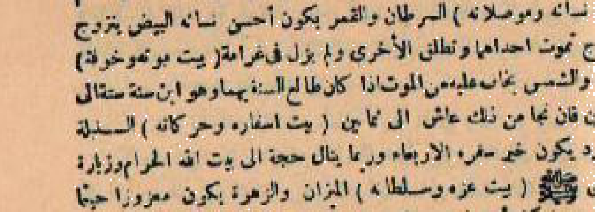

*Gambar Rajah Asli Halaman 53 (Rajah 1)* — Satar Huruf keramat buruj al-Qaus (Sagittarius). Mengandung asma pelindung untuk pembuka pintu rezeki, kemudahan belajar, dan keselamatan dari gangguan makhluk halus.

---

**[Gambar Rajah Asli Halaman 53 — Wafaq al-Qaus]**

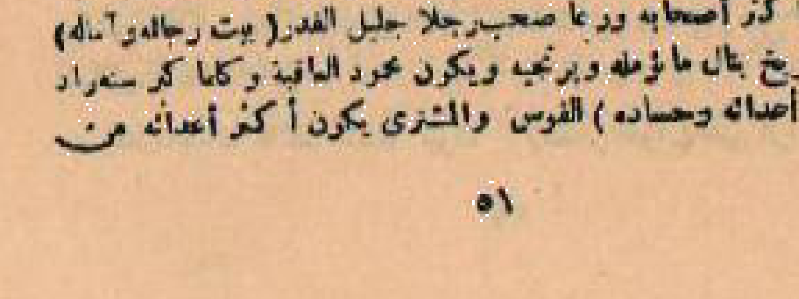

*Gambar Rajah Asli Halaman 53 (Rajah 2)* — Wafaq angka kotak harmoni buruj Sagittarius untuk daya tarik kewibawaan dan kesuksesan dagang.

---

**[Teks Arab Asli]**

وهذه هى العزيمة الشريفة:
بسم الله الرحمن الرحيم، يا رحمن يا رحيم يا سميع يا عليم، يا باسط الرزق لمن يشاء بغير حساب، افتح لى أبواب فضلك، وأفض على من بركاتك، واجعل لى نورا فى سمعى وبصرى وقلبى، وأعذنى من شر طوارق الليل والنهار إلا طارقا يطرق بخير يا رحمن، وصلى الله على سيدنا محمد وآله وصحبه أجمعين.

**[Transliterasi Latin Fonetik]**

*wa haadzihi hiyal-'aziimatasy-syariifata:*
*Bismillaahir-Rahmaanir-Rahiim, yaa rahimna yaa rahiima yaa samii'i yaa 'aliimi, yaa baasithar-rizqi laman yasyaa'u baghayri hisaabi, iftah lii abawwaaba fadhlika, wa afdhi 'alaa min barakaatika, wa ij'al lii nuuran fii sam'ii wa bushraa waqalabaa, wa a'idznii min syarrin thawaariqil-layli wan-nahaari illaa thaariqan yathruqu bikhayri yaa rahimna, wa shallaa Allaahi 'alaa sayyidinaa Muhammadin wa'aalah wa shahbihi ajam'ayni *

**[Terjemahan Indonesia]**

Inilah bacaan doa azimah mulianya:
"Dengan nama Allah Yang Maha Pengasih lagi Maha Penyayang. Wahai Dzat Yang Maha Pengasih, wahai Dzat Yang Maha Penyayang, wahai Dzat Yang Maha Mendengar lagi Maha Mengetahui; wahai Dzat Yang Membentangkan rezeki bagi siapa saja yang Dia kehendaki tanpa perhitungan; bukakanlah bagiku pintu-pintu karunia-Mu, limpahkanlah kepadaku keberkahan-keberkahan-Mu, jadikanlah cahaya pelita dalam pendengaranku, penglihatanku, dan hatiku; serta lindungilah diriku dari marabahaya segala yang datang di waktu malam dan siang kecuali kedatangan yang membawa kebaikan, wahai Dzat Yang Maha Pengasih. Semoga shalawat serta salam senantiasa tercurah kepada junjungan kami Nabi Muhammad beserta segenap keluarga dan sahabat beliau seluruhnya."

---

## HALAMAN CETAK 54 (Halaman PDF 27, sisi kanan)

**[Teks Arab Asli]**

( القول على البرج العاشر وهو برج الجدى وزحل )
وصاحب فلك الجدى زحله الثقيل * يدل على البطء والصبر والثبات
له النظرة الصعبة والعزم الأصيل * ويدرك ما يرجو بعد الفوات
يعانى المشاق فى مبدأ العمر * ثم يصير إلى أعظم الأمر

**[Transliterasi Latin Fonetik]**

*(al-qawli 'alaal-burjil-'aasyiru wa huwa burjul-Jadyi wa Zuhala)*
*wa shaahibu falak al-Jadyi zahlahuts-tsaqiila * yadullu 'alaal-buth'i wash-shabri wats-tsubbaati*
*lahun-nazharatish-sha'bati wal-'azmil-ashiili * wa yudriku maa yarjuu ba'dal-fawaati*
*yu'aan al-masyaaqqa fii mabda'il-'umri * tsumma yashiiru ilaa a'zhumil-amri*

**[Terjemahan Indonesia]**

(Uraian tentang Buruj Kesepuluh, yaitu Buruj Capricorn dan Penguasanya: Saturnus)
*Penguasa orbit Capricorn adalah Saturnus sang bintang pemikir yang kokoh * Menunjukkan ketenangan, kesabaran mendalam, dan keteguhan langkah*
*Ia memiliki tatapan tajam berwibawa dan tekad yang murni * Mampu meraih apa yang diharapkannya meski melewati penantian panjang*
*Menghadapi berbagai rintangan berat di awal usia muda * Hingga kemudian melangkah pasti menuju kedudukan yang paling agung.*

---

**[Gambar Rajah Asli Halaman 54 — Tilsm Buruj al-Jady (Capricorn)]**

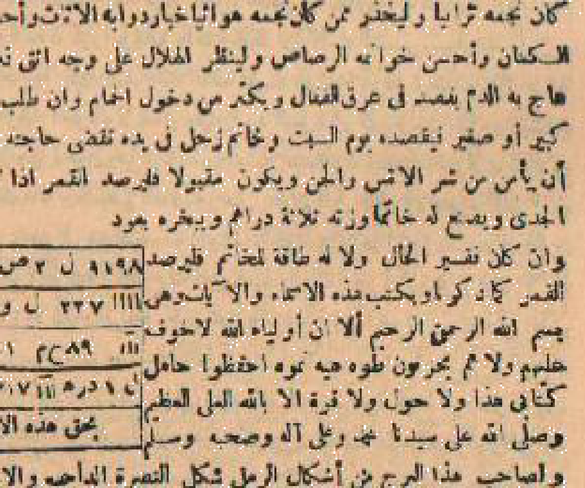

*Gambar Rajah Asli Halaman 54* — Rajah Tilsam buruj al-Jady (Capricorn): Sosok bertanduk kambing berekor ikan laut melambangkan ketahanan dan keteguhan di bawah naungan bintang Saturnus.

---

**[Teks Arab Asli]**

( القول على طبع الطالع واختلاف الوجوه والطباع )
قال الحكيم: برج الجدى برج ترابى ليلى مؤنث طبعه بارد يابس، يدل على الصبر والتحمل والجدية والرزانة وكتمان الأسرار؛ صاحب هذا البرج يكون رجلا أسمر اللون أو مائلا إلى الصفرة، نحيف الجسم، قوى العظام، عريض المنكبين، بطيء الغضب ثقيل الحركة، قليل الكلام كثير الفكر، وله ثلاثة وجوه.

**[Transliterasi Latin Fonetik]**

*(al-qawli 'alaa thab'uth-thaali'u wa ikhtilaafil-wujuuhi wath-thibaa'i)*
*qaalal-hakiimu  burjul-Jadyi burju turaabiyyun laylaa mu'annatsi thab'uhu baaridun yaabisun, yadullu 'alaa ash-shabri wat-tahammuli wal-jiddiyyati war-rizaanati wa kitmaanil-asraari; shaahibu haadzaal-burji yakuunu rajulan asamaral-lawni aw maa'ilan ilash-shifrati, nahiifal-jismi, qawwaal-'izhaama, 'ariidhal-munkabbiina, bathii'al-ghadhabi tsaqiilal-harakati, qaliilul-kilaami katsiirul-fikri, wa lahu tsalaatsatun wujuuhin *

**[Terjemahan Indonesia]**

(Uraian tentang watak dasar thali' kelahiran, tiga wajah, dan kepribadian di bawah naungannya)
Berkata sang ahli astrologi: Buruj Capricorn adalah buruj berelemen tanah (bumi), bersifat malam hari, feminin, dengan tabiat dingin dan kering; melambangkan kesabaran baja, daya tahan tinggi, kesungguhan kerja, ketenangan sikap, dan kepandaian menjaga rahasia. Pria yang lahir pada buruj ini berkulit sawo matang atau condong kekuningan, berpostur ramping dengan struktur tulang yang kuat dan kokoh, berbahu lebar, tidak mudah tersulut emosi, berhati-hati dalam setiap tindakan, hemat bicara namun berwawasan luas; dan ia memiliki tiga wajah (wajh).

---

**[Teks Arab Asli]**

( الوجه الأول ) من نظر إليه زحل: يكون رجلا صبورا على الشدائد، يعمل فى البناء أو الفلاحة أو التعدين، ويجمع المال بالتدبير وحسن الاقتصاد، ويكون مهابا عند الخاصة والعامة، قليل الضحك، جاد فى جميع أحواله، والله أعلم.

**[Transliterasi Latin Fonetik]**

*(al-wajhul-awwalu  min nazhara ilayhi Zuhala  yakuunu rajulan shabuuran 'alaa asy-syadaa'idi, ya'malu fil-binaa'i aw al-falaahatu aw at-ta'diinu, wa yajma'ul-maali bit-tadbiiri wa husnil-iqtishaadi, wa yakuunu mahaaban 'indal-khaashshati wal-'aammati, qaliiludh-dhahiki, jaaddun fii jamii'i ahwaalihi, wallaahu a'lamu *) **[Terjemahan Indonesia]**

(Wajah Pertama) Bagi yang dipandang oleh planet Saturnus: Ia menjadi pribadi yang sangat tangguh menghadapi terpaan ujian hidup; cocok berkarya di bidang konstruksi/arsitektur, perkebunan/pertanian, atau pertambangan; mengumpulkan pundi kekayaan dengan manajemen keuangan yang teliti dan hemat; disegani oleh kalangan elite maupun masyarakat umum; jarang tertawa terbahak-bahak; dan selalu bersikap serius dalam seluruh aspek kehidupannya. Wallahu a'lam.

---

**[Teks Arab Asli]**

( الوجه الثانى ) من نظر إليه الزهرة: يكون رجلا يميل إلى الهدوء والألفة، محبا للزراعة وغرس الأشجار، حسن النية، يرزق بركة فى رزقه وماله، وينال حظا حسنا من النساء، ويعيش فى سلام واطمئنان، والله تعالى أعلم.

**[Transliterasi Latin Fonetik]**

*(al-wajhuts-tsaanii  min nazhara ilayhiz-Zuharati  yakuunu rajulan yamiilu ilal-huduu'i wal-ulfati, muhibban liz-ziraa'ata wa gharasal-asyjaara, hasanun-niyyati, yurzaqu barakatin fii rizqihi wa maalihi, wa yanaalu hazhzhaa hasan minan-nisaa'i, wa ya'iisyu fii sullaamin wa ithmi'naanin, wallaahu Ta'aalaa a'lamu *) **[Terjemahan Indonesia]**

(Wajah Kedua) Bagi yang dipandang oleh planet Venus: Ia cenderung menyukai ketenangan dan kerukunan; gemar bercocok tanam dan menghijaukan lingkungan; tulus bening niat hatinya; diberkahi kelimpahan dalam rezeki dan hartanya; memperoleh peruntungan yang baik dari kaum wanita; serta menjalani kehidupan dalam suasana damai dan tentram. Wallahu Ta'ala a'lam.

---

**[Teks Arab Asli]**

( الوجه الثالث ) من نظر إليه عطارد: يكون رجلا ذا حكمة ودهاء، صاحب حساب وتدبير، ينال مرتبة فى كتابة الدواوين، ويصلح للقضاء والأمانات، ويجمع بين حكمة الشيوخ ونشاط الشباب، والله أعلم.

**[Transliterasi Latin Fonetik]**

*(al-wajhuts-tsaalitsu  min nazhara ilayhi 'Uthaarida  yakuunu rajulan dzaa hukmatin wa dahaa'in, shaahibu hisaabi wa tadbiirin, yanaalu martabatan fii kitaabatid-dawaawiini, wa yashluhu lil-qadhaa'u wal-amaanaatu, wa yajma'u bayna hukmatisy-syuyuukhi wa nasyaathisy-syabaabi, wallaahu a'lamu *) **[Terjemahan Indonesia]**

(Wajah Ketiga) Bagi yang dipandang oleh planet Merkurius: Ia dianugerahi kecerdasan logika dan kebijaksanaan hikmah; mahir dalam bidang perhitungan, akuntansi, dan administrasi; berpotensi menduduki posisi penting dalam kesekretariatan negara; sangat layak memangku jabatan hakim dan pengelola amanah publik; serta memadukan kematangan berpikir para sesepuh dengan etos kerja kaum muda. Wallahu a'lam.

---

## HALAMAN CETAK 55 (Halaman PDF 27, sisi kiri)

**[Teks Arab Asli]**

( بيت حياته ومعيشته ) الجدى وزحل: تكون حياته فى أولها شاقة مكابدة، يلقى فيها ضيقا وتعبا، فإذا قارب الأربعين استقامت أموره، وأقبلت عليه الدنيا بمنافعها، ولا يزال يجمع العقارات والضياع حتى يصير من أعيان بلده، ولا يموت إلا فى نعمة وستر، والله أعلم.

**[Transliterasi Latin Fonetik]**

*(baytu hayaatihi wa ma'iisyatihi  al-Jadyi wa Zuhala  takuunu hayaatihi fii awwaluhaa syaaqqata mukaabadatin, yulqaa fiihaa dhayyiqan wa ta'aban, fa-idzaa qaaribul-arba'ayni istaqaamat umuuruhu, wa aqbalat 'alayhid-dunyaa bimanaafi'ihaa, wa laa yuzaalu yajma'ul-'aqaaraatu wadh-dhayaa'u hattaa yashiiru min a'yaani baladihi, wa laa yamuutu illaa fii ni'matin wa sitrin, wallaahu a'lamu *) **[Terjemahan Indonesia]**

(Rumah kehidupan dan penghidupannya) Capricorn dan Saturnus: Kehidupannya pada fase awal terasa berat penuh perjuangan; ia menjumpai berbagai kesempitan dan letihnya ikhtiar; namun tatkala ia mendekati usia empat puluh tahun, urusannya mulai mapan dan dunia membukakan manfaatnya; ia terus menghimpun kepemilikan aset tanah dan bangunan hingga menjadi tokoh terpandang di negerinya; dan ia tidak wafat melainkan dalam limpahan nikmat serta penjagaan kehormatan dari Allah. Wallahu a'lam.

---

**[Teks Arab Asli]**

( بيت ماله وتجارته ) الدلو وزحل: يكتسب الأموال من جهات مستورة بغير جلبة، ويضع أمواله فى التجارات المأمونة كالحبوب والغلال والمعادن، ويحرص على ادخار المال لنوائب الدهر، والله أعلم.

**[Transliterasi Latin Fonetik]**

*(baytu maalihi wa tijaaratihi  ad-Dalwi wa Zuhala  yaktasibul-amwaali min jihaatin mastuuratin baghayri jalbatin, wa yadha'u amwaaluhu fit-tijaaraatil-ma'muunati kal-hubuubi wal-ghilaali wal-ma'aadini, wa yahrushu 'alaa iddikhaaril-maali li-nawaa'ibad-dahri, wallaahu a'lamu *) **[Terjemahan Indonesia]**

(Rumah kekayaan dan perniagaannya) Aquarius dan Saturnus: Ia meraih penghasilan dari sumber-sumber yang tenang tanpa banyak kegaduhan; menanamkan modalnya pada sektor perniagaan primer yang aman seperti komoditas biji-bijian, hasil bumi, dan logam mulia; serta sangat disiplin menabung untuk mengantisipasi gejolak zaman. Wallahu a'lam.

---

**[Teks Arab Asli]**

( بيت إخوته وأخواته ) الحوت والمشترى: يكون له إخوة يعطف عليهم ويعينهم، ويكون هو سندا لهم فى حوائجهم، وينال منهم دعاء حسنا ومودة باقية، والله تعالى أعلم.

**[Transliterasi Latin Fonetik]**

*(baytu ikhwatihi wa akhawaatihi  al-Huuti wal-Musytarii  yakuunu lahu ikhwatin ya'thifu 'alayhim wa yu'ayyinuhum, wa yakuunu huwa sanadan lahum fii hawaa'ijihim, wa yanaalu minhum du'aa'a hissinaa wa mawaddati baaqiyatin, wallaahu Ta'aalaa a'lamu *) **[Terjemahan Indonesia]**

(Rumah saudara-saudaranya) Pisces dan Yupiter: Ia memiliki saudara-saudara yang sangat ia sayangi dan ia bantu; dialah yang menjadi tumpuan penopang bagi kebutuhan-kebutuhan mereka; dan ia memetik doa-doa kebaikan serta kasih sayang yang abadi dari mereka. Wallahu Ta'ala a'lam.

---

**[Teks Arab Asli]**

( بيت آبائه وأمهاته ) الحمل والمريخ: ينال من أبيه تربية حازمة، وربما وقع بينهما بعض الاختلاف فى الصغر، ثم يستقيم الحال بالبر والإحسان، ويدفن أمه قبل أبيه، والله أعلم.

**[Transliterasi Latin Fonetik]**

*(baytu aabaa'ihi wa ummahaatihi  al-Hamali wal-Mirriikhi  yanaalu min abiihi turbiyyati haazimati, wa rubbamaa wa q'i baynahumaa ba'dhul-ikhtilaafi fish-shighari, tsumma yastaqiimul-haalu bil-barri wal-ahsaani, wa yadfinu ummihi qabla abiihi, wallaahu a'lamu *) **[Terjemahan Indonesia]**

(Rumah orang tuanya) Aries dan Mars: Ia mendapatkan didikan yang tegas dan disiplin dari ayahnya; terkadang terjadi sedikit perbedaan sudut pandang di masa muda, namun keadaan kembali harmonis melalui bakti dan ketaatan tulus; serta ia memakamkan ibunya lebih dahulu sebelum ayahnya. Wallahu a'lam.

---

**[Teks Arab Asli]**

( بيت أولاده وأفراحه ) الثور والزهرة: يرزق بأولاد مباركين ذكورا وإناثا، ويكون أكثرهم إناثا، وينال منهم بهجة وسرورا، ويكون أولاده أصحاب خلق وبر، والله أعلم.

**[Transliterasi Latin Fonetik]**

*(baytu awlaadihi wa afraahihi  ats-Tsawri waz-Zuharati  yurzaqu bi-awlaadin mubaarakiina dzukuuran wa inaatsan, wa yakuunu aktsaruhum anaatsaa, wa yanaalu minhum bahijatan wa suruuran, wa yakuunu awlaadihi ashhaabu khalaqa wa barrin, wallaahu a'lamu *) **[Terjemahan Indonesia]**

(Rumah anak-anak dan kebahagiaannya) Taurus dan Venus: Ia dikaruniai keturunan yang penuh berkah baik putra maupun putri; dan sebagian besar anak-anaknya adalah perempuan; ia merasakan kebahagiaan dan kehangatan yang mendalam dari mereka; serta anak-anaknya tumbuh berbudi pekerti luhur dan berbakti. Wallahu a'lam.

---

## HALAMAN CETAK 56 (Halaman PDF 28, sisi kanan)

**[Teks Arab Asli]**

( بيت أمراضه وعلله ) الجوزاء وعطارد: تصيبه أمراض العظام والمفاصل ووجع الركبتين والبرد فى الأطراف وجفاف الجلد، فليستعمل الأدهان الدافئة كزيت الزيتون وزيت الخروع، ويشرب حساء اللحم بالتوابل العطرية، ويحذر من التعرض للهواء البارد، والله أعلم.

**[Transliterasi Latin Fonetik]**

*(baytu amraadhihi wa 'ilalihi  al-Jawzaa'i wa 'Uthaarida  tushiibuhu amraadhin al-'izhaama wal-mafaashili wa waja'ir-rakbatayni wal-bardi fil-athraafi wa jafaafil-jaldi, fa-layasta'milul-adhaanud-daafa'ah kazaytiz-zaytuuni wa zaytil-khirwa'i, wa yasyrabu hasaa'ul-lahmi bit-tawaabilil-'ithriyyati, wa yuhadzdziru minat-ta'arrudhi lil-hawaa'al-baarida, wallaahu a'lamu *) **[Terjemahan Indonesia]**

(Rumah penyakit dan keluhan fisiknya) Gemini dan Merkurius: Ia rentan mengalami keluhan pada struktur tulang, persendian kaku, nyeri kedua lutut, rasa dingin pada ujung jari-jemari, serta kulit kering; maka dianjurkan rutin mengoleskan minyak berkhasiat hangat seperti minyak zaitun dan minyak jarak; meminum kuah kaldu bergizi dengan rempah-rempah aromatik; serta berhati-hati jangan sampai terpapar angin malam yang dingin menusuk. Wallahu a'lam.

---

**[Teks Arab Asli]**

( بيت نسائه وفراشه ) السرطان والقمر: يتزوج بامرأة مباركة مدبرة لبيتها، تحسن القيام على شؤونه، وينال منها راحة وطمأنينة، وربما كان بينهما بعض العتاب ثم يزول سريعا، وتكون عشرتهما طويلة مباركة، والله أعلم.

**[Transliterasi Latin Fonetik]**

*(baytu nisaa'ihi wa firaasyihi  as-Sarathaani wal-Qamari  yatazawwaju biaamra'ati mubaarakatun mudabbarati lubbiyyatihaa, tuhsinul-qiyaama 'alaa syu'uunihi, wa yanaalu minhaa raahatan wa thuma'niinatan, wa rubbamaa kaana baynahumaa ba'dhul-'itaabi tsumma yuzawwilu sarii'an, wa takuunu 'usyratuhumaa thawiilatu mubaarakatun, wallaahu a'lamu *) **[Terjemahan Indonesia]**

(Rumah istri-istri dan peraduannya) Cancer dan Bulan: Ia memperistri wanita salehah yang pandai mengurus rumah tangga; telaten melayani kebutuhan suaminya; ia memetik ketentraman dan kedamaian hati bersamanya; terkadang timbul perselisihan kecil namun segera reda dengan saling memaafkan; dan jalinan ikatan pernikahan mereka berlangsung langgeng penuh berkah. Wallahu a'lam.

---

**[Teks Arab Asli]**

( بيت خوفه وموته ) الأسد والشمس: يخاف عليه من أمراض القلب وسقطات الهرم، وسنوات الخطر عنده: عشر سنين، وعشرون سنة، وثلاثون سنة، وخمسون سنة، وسبعون سنة، فان نجا منها بلغ ثمانين سنة فى عافية، والله أعلم.

**[Transliterasi Latin Fonetik]**

*(baytu khawfihi wa mawtihi  al-Asadi wasy-Syamsi  yukhaafu 'alayhi min amraadhin al-qalbi wa saqthaatil-harami, wa sanwaatal-khuthuri 'indahu  'asyara siniina, 'isyruuna sanatin, tsalaatsuuna sanatin, khamsuuna sanatin, sab'uuna sanatin, fa-in najaa minhaa balagha tsamaaniina sanatin fii 'aafiyatin, wallaahu a'lamu *) **[Terjemahan Indonesia]**

(Rumah ketakutan dan masa krisis usianya) Leo dan Matahari: Dikhawatirkan atasnya gangguan peredaran darah jantung dan keletihan usia senja; tahun-tahun rawan dalam siklus usianya adalah 10 tahun, 20 tahun, 30 tahun, 50 tahun, dan 70 tahun; jika ia berhasil melaluinya dengan selamat, umurnya akan mencapai 80 tahun dalam keadaan sehat afiat. Wallahu a'lam.

---

**[Teks Arab Asli]**

( بيت أسفاره وحركاته ) السنبلة وعطارد: سفره إلى جهة الغرب خير له من الشرق، ويكون سيره فى التجارة والأعمال الميدانية مباركا، وينال فى أسفاره فوائد مالية وعلاقات نافعة، والله أعلم.

**[Transliterasi Latin Fonetik]**

*(baytu asfaarihi wa harakaatihi  as-Sunbulati wa 'Uthaarida  safarihi ilaa jihatil-gharbi khayrun lahu minasy-syarqi, wa yakuunu sayrahu fit-tijaarati wal-a'maalil-maydaaniyyati mubaarakan, wa yanaalu fii asfaarihi fa-waa'ida maaliyyata wa 'alaaqaatin naafi'atin, wallaahu a'lamu *) **[Terjemahan Indonesia]**

(Rumah perjalanan dan pergerakannya) Virgo dan Merkurius: Bepergian menuju arah barat membawa keberuntungan lebih baik baginya dibanding arah timur; perjalanannya untuk urusan bisnis niaga dan peninjauan lapangan senantiasa membuahkan hasil; serta ia memperoleh keuntungan finansial dan jaringan relasi yang sangat bermanfaat. Wallahu a'lam.

---

**[Teks Arab Asli]**

( بيت عزه وسلطانه ) الميزان والزهرة: يعلو شأنه فى قومه بالعدل والإنصاف، ويصير مقصودا فى فصل النزاعات والمشاورات، وينال ثقة الحكام والقضاة، ويحظى بالاحترام والتقدير أينما حل، والله أعلم.

**[Transliterasi Latin Fonetik]**

*(baytu 'izzihi wa sulthaanihi  al-Miizaani waz-Zuharati  ya'luu sya'nuhu fii qawmihi bil-'adli wal-inshaafi, wa yashiiru maqshuudaa fii fashlun an-nizaa'aati wal-musyaawaraati, wa yanaalu tsiqatal-hukkaami wal-qudhaati, wa yuhzhaa bil-ihtiraami wat-taqdiiri aynamaa hallin, wallaahu a'lamu *) **[Terjemahan Indonesia]**

(Rumah kehormatan dan status sosialnya) Libra dan Venus: Kedudukannya terangkat mulia di tengah kaumnya berkat sikapnya yang adil dan bijaksana; ia kerap dijadikan rujukan dalam mendamaikan perselisihan dan musyawarah keluarga; memperoleh kepercayaan dari para pejabat dan aparat peradilan; serta menuai rasa hormat di mana pun ia berada. Wallahu a'lam.

---

**[Teks Arab Asli]**

( بيت رجائه وآماله ) العقرب والمريخ: يبلغ ما يتمناه من جمع الأموال وتثبيت المكانة، ويكون قوى الإرادة لا تثنيه الشدائد عن بلوغ مرامه، ويرزق عاقبة حميدة وخاتمة حسنة، والله سبحانه أعلم.

**[Transliterasi Latin Fonetik]**

*(baytu rajaa'ihi wa aamaalihi  al-'Aqrabi wal-Mirriikhi  yablughu maa yatamannaahu min jam'il-amwaali wa tatsbiitil-makaanati, wa yakuunu quwaal-iraadati laa tatsanniyihisy-syadaa'ida 'an buluughi maraamihi, wa yurzaqu 'aaqibatu hamiidatu wa khaatimatu hasanatun, wallaahu Subhaanahu a'lamu *) **[Terjemahan Indonesia]**

(Rumah harapan dan cita-citanya) Scorpio dan Mars: Ia berhasil menggapai apa yang dicita-citakannya berupa kemapanan finansial dan pengakuan sosial; berjiwa pantang menyerah yang tak gentar menghadapi tantangan hidup; serta dianugerahi akhir hidup yang terpuji dan husnul khatimah. Wallahu Subhanahu wa Ta'ala a'lam.

---

## HALAMAN CETAK 57 (Halaman PDF 28, sisi kiri)

**[Teks Arab Asli]**

( بيت أعدائه وحساده ) القوس والمشترى: أعداؤه قليلون لأن خلقه يغلب عداوتهم، وإذا عاداه أحد كفاه الله شره ببركة نيته الصادقة، ويكون منصورا على كل من عانده، والله تعالى أعلم.

**[Transliterasi Latin Fonetik]**

*(baytu a'daa'ihi wa hussaadihi  al-Qawsi wal-Musytarii  a'addaa'uhu qaliiluuna la'ann khalqihi yaghlibu 'adaawatuhum, wa idzaa 'aadaahu ahadun kafaahu Allaahi syarahin bibarakati niyyatihish-shaadiqati, wa yakuunu manshuuran 'alaa kullu min 'aanidihi, wallaahu Ta'aalaa a'lamu *) **[Terjemahan Indonesia]**

(Rumah musuh dan para pendengkinya) Sagittarius dan Yupiter: Musuh-musuhnya tergolong sedikit karena keindahan akhlaknya mampu meluluhkan kebencian orang lain; dan apabila ada yang memusuhinya, Allah mencukupkan perlindungan dari kejahatan mereka berkat ketulusan niatnya; serta ia senantiasa ditolong mengungguli siapa saja yang bersikap keras kepala kepadanya. Wallahu Ta'ala a'lam.

---

**[Teks Arab Asli]**

( ولصاحب هذا البرج من أشكال الرمل شكل العتبة الداخلة )
قال الشيخ الفلكى: اعلم أن شكل العتبة الداخلة يدل على الرزق الثابت والدخول فى أبواب الخير والاطمئنان بعد القلق، فعليك بالصبر والثبات ولا تعجل فى أمرك فان فى التأنى السلامة وفى العجلة الندامة، واسمع ما قيل:
اصبر تنل ما ترتجيه من العلا * فالصبر مفتاح لكل فلاح
لا تيأسن من فرجة تأتى بها * يد الإله بغدوة ورواح

**[Transliterasi Latin Fonetik]**

*(wa li-shaahibi haadzaal-burji min asykaalir-ramli syaklul-'atabatid-daakhilati)*
*qaalasy-syaykhul-Falakiyyu  i'lam an syaklul-'atabatid-daakhilati yadullu 'alaa ar-rizqits-tsaabiti wad-dukhuuli fii abwaabil-khayri wal-ithmi'naani ba'dal-qalaqi, fa'alayka bish-shabri wats-tsubbaati wa laa tu'ajjilu fii amrika fa-in fit-ta'annii as-sullaamata wa fil-'ajalatun-nuddaamatu, wa isma' maa qiila:*
*ushbur tanul maa tartajiihi minal-'ulaa * fash-shabra miftaahun li-kulli fa-laahin*
*laa tuya''asinna min fa-rajatin ta'attaa bihaa * yadal-alahi bighuduwwatin wa rawaahin*

**[Terjemahan Indonesia]**

(Bagi pemilik buruj ini dari bentuk-bentuk ilmu raml adalah bentuk *al-'Utbah ad-Dakhilah*)
Berkata sang guru falak: Ketahuilah bahwa simbol al-'Utbah ad-Dakhilah menunjukkan datangnya rezeki yang kokoh mengalir, terbukanya pintu-pintu kebajikan, dan ketentraman hati setelah melewati masa-masa kecemasan; maka wajib atasmu mempertebal kesabaran dan keteguhan, jangan tergesa-gesa dalam mengambil keputusan, karena dalam ketenangan terdapat keselamatan dan dalam ketergesaan bersemayam penyesalan; dengarkanlah nasihat bijak ini:
*Bersabarlah niscaya engkau meraih kemuliaan yang kau dambakan * Karena kesabaran adalah kunci pembuka setiap keberhasilan*
*Janganlah sekali-kali berputus asa dari jalan keluar yang dihadirkan * Oleh tangan kekuasaan Allah di setiap pagi dan petang.*

---

**[Gambar Rajah Asli Halaman 57 — Satar Huruf al-Jady]**

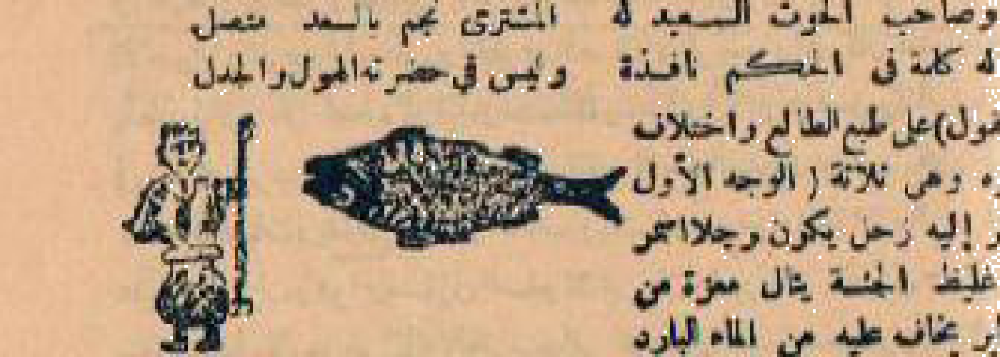

*Gambar Rajah Asli Halaman 57* — Satar Huruf keramat buruj al-Jady (Capricorn). Ditulis untuk perlindungan dari bahaya sihir, tolak bala serangan musuh, dan keteguhan batin.

---

## HALAMAN CETAK 58 (Halaman PDF 29, sisi kanan)

**[Teks Arab Asli]**

وهذا هو الخاتم المبارك لصاحب برج الجدى: يكتب فى ساعة زحل من يوم السبت على صفيحة رصاص أو كاغد أزرق بحبر أسود معطر، ويبخر بالصبر والجاوي والمر، ويحمل على طهارة تامة، وهذا رسم الخاتم الشريف.

**[Transliterasi Latin Fonetik]**

*wa haadzaa huwal-khaatamul-mubaaraki li-shaahiba burjul-Jadyi  yaktubu fii saa'ata Zuhala min yawmas-Sabti 'alaa shafiihati rashaashin aw kaaghidu azraqu bihibri aswadu mu'aththari, wa yubakhkhiru bish-shabri wal-jaawiyyi wal-marri, wa yahmilu 'alaa thahaarati taammati, wa haadzaa rasmil-khaatamusy-syariifi *

**[Terjemahan Indonesia]**

Inilah gambar khatam/wafaq keramat pelindung bagi pemilik buruj Capricorn: Ditulis pada sa'ah pertama Saturnus di hari Sabtu di atas lempengan timah murni atau kertas biru dengan tinta hitam beraroma wangi; diasapi dengan getah gaharu sabar (aloe), kemenyan jawi, dan getah mur; lalu dibawa dalam keadaan suci suci lahir dan batin — dan inilah gambar wafaq mulia tersebut.

---

**[Gambar Rajah Asli Halaman 58 — Wafaq al-Jady]**

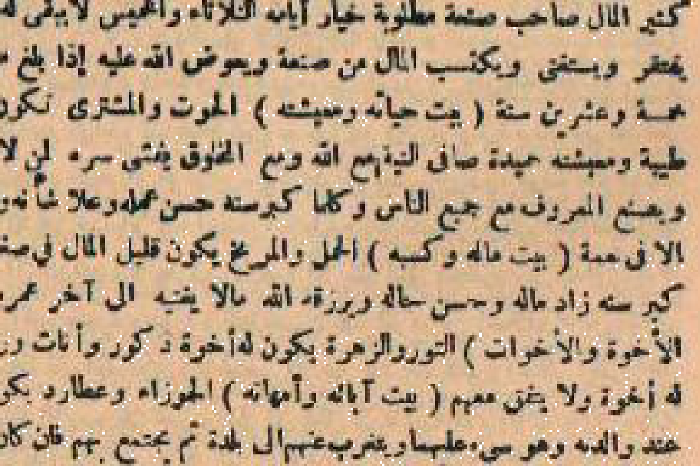

*Gambar Rajah Asli Halaman 58* — Wafaq angka kotak keramat buruj Capricorn untuk ketahanan lahir batin dan kemantapan usaha.

---

**[Teks Arab Asli]**

والعزيمة والدعاء لصاحب هذا البرج:
بسم الله الرحمن الرحيم، يا دائم يا قديم يا صانع كل مصنوع، يا جابر كل مكسور، يا ميسر كل عسير، يسر لى كل أمر عسير، وافتح لى خزائن رحمتك، وأعذنى من مضلات الفتن ما ظهر منها وما بطن، واجعل لى لسانا صادقا، وقلبا خاشعا، ورزقا دارا، وصلى الله على سيدنا محمد وعلى آله وصحبه وسلم تسليما كثيرا.

**[Transliterasi Latin Fonetik]**

*wal-'aziimatu wad-du'aa'u li-shaahaba haadzaal-burji:*
*Bismillaahir-Rahmaanir-Rahiim, yaa daa'ima yaa qadiimi yaa shaani'i kullu mashnuu'in, yaa jaabira kullu maksuurin, yaa maysirin kullu 'asiiru, yusrun lii kullu amri 'asiiri, wa iftah lii khazaa'ana rahmatika, wa a'idznii min mudhillaatil-fitani maa zhuhrin minhaa wa maa bathnin, wa ij'al lii lisaanan shaadiqan, wa qalban khaasyi'an, wa razaqaa daaran, wa shallaa Allaahi 'alaa sayyidinaa Muhammadin wa 'alaa aalihi wa shahbihi wa sallama tasliimaa katsiiran *

**[Terjemahan Indonesia]**

Adapun bacaan doa azimah pelindungnya adalah:
"Dengan nama Allah Yang Maha Pengasih lagi Maha Penyayang. Wahai Dzat Yang Maha Kekal Abadi, wahai Dzat Yang Maha Terdahulu tanpa permulaan, wahai Pencipta segala ciptaan, wahai Penolong yang menyambung segala yang patah, wahai Dzat Yang Memudahkan segala yang sulit; mudahkanlah bagiku segala urusan yang sukar, bukakanlah untukku khazanah perbendaharaan rahmat-Mu, lindungilah diriku dari fitnah-fitnah yang menyesatkan baik yang tampak maupun yang tersembunyi; karuniakanlah kepadaku lisan yang senantiasa jujur, hati yang khusyuk tunduk, dan aliran rezeki yang terus mengalir deras. Semoga limpahan shalawat dan salam sebanyak-banyaknya senantiasa tercurah kepada junjungan kami Nabi Muhammad beserta keluarga dan para sahabat beliau."

---

## HALAMAN CETAK 59 (Halaman PDF 29, sisi kiri)

**[Teks Arab Asli]**

( القول على البرج الحادى عشر وهو برج الدلو وزحل )
وصاحب فلك الدلو زحل المحكم * يدل على الفكر والتدبير والأسرار
له العقل الراجح والصمت المكرم * ويحفظ العهد فى السر والإجهار
يحب الوفاء ويسعى فى الصلاح * ويدرك بالصبر أسباب الفلاح

**[Transliterasi Latin Fonetik]**

*(al-qawli 'alaal-burjil-haadii 'asyara wa huwa burjud-Dalwi wa Zuhala)*
*wa shaahibu falak ad-Dalwi Zuhalal-muhkami * yadullu 'alaal-fikri wat-tadbiiri wal-asraari*
*lahul-'aqlir-raajihi wash-shamtil-mukarrami * wa yahfazhul-'ahdu fis-sirri wal-ijhaari*
*yuhibbul-wafaa'u wa yas'aa fish-shulaahi * wa yudriku bish-shabri asabbaabal-falaahi*

**[Terjemahan Indonesia]**

(Uraian tentang Buruj Kesebelas, yaitu Buruj Aquarius dan Penguasanya: Saturnus)
*Penguasa orbit Aquarius adalah Saturnus sang pengatur hikmah yang kokoh * Menunjukkan kedalaman daya pikir, kecakapan siasat, dan penguasaan rahasia*
*Ia dianugerahi akal pikiran yang matang dan sikap diam yang berwibawa mulia * Menjaga teguh ikatan janji baik dalam kesunyian maupun terang-terangan*
*Mencintai kesetiaan dan senantiasa berikhtiar demi kemaslahatan bersama * Serta merengkuh jalan-jalan keberhasilan melalui kesabaran yang paripurna.*

---

**[Gambar Rajah Asli Halaman 59 — Tilsm Buruj ad-Dalw (Aquarius)]**

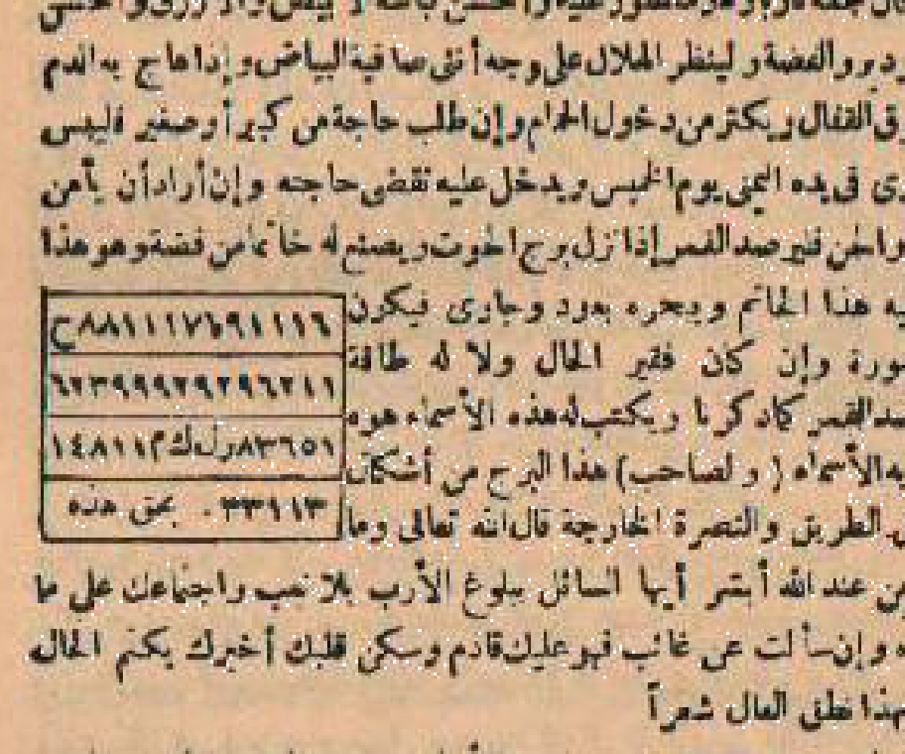

*Gambar Rajah Asli Halaman 59* — Gambar Tilsam simbolik buruj ad-Dalw (Aquarius): Sosok pembawa bejana menuangkan air kehidupan melambangkan kelimpahan gagasan dan kemaslahatan sosial di bawah pengaruh planet Saturnus.

---

**[Teks Arab Asli]**

( القول على طبع الطالع واختلاف الوجوه والطباع )
قال الحكيم الفلكى: برج الدلو برج هوائى نهارى ذكر طبعه حار رطب، يدل على الفطانة والذكاء والشهامة وعلو الهمة ومحبة الخير للناس؛ صاحب هذا البرج يكون رجلا أبيض اللون مشربا بصفرة أو حمرة، ربعة من الرجال، حسن الصورة، مليح النطق، لين العريكة، واسع الحلم، وله ثلاثة وجوه.

**[Transliterasi Latin Fonetik]**

*(al-qawli 'alaa thab'uth-thaali'u wa ikhtilaafil-wujuuhi wath-thibaa'i)*
*qaalal-hakiimul-Falakiyyu  burjud-Dalwi burju hawaa'iyyun nahaaraa dzakara thab'uhu haarrun rathbun, yadullu 'alaal-fathaanati wadz-dzakaa'i wasy-syahaamati wa 'uluwwil-hammati wa mahabbatil-khayri lin-naasa; shaahibu haadzaal-burji yakuunu rajulan abyadhul-lawni masyraban bishifratin aw humratun, rubu'atan minar-rijaali, hasanush-shuurati, maliihan-nuthqi, liyannal-'ariikata, waasi'ul-hulmi, wa lahu tsalaatsatun wujuuhin *

**[Terjemahan Indonesia]**

(Uraian tentang watak thali' kelahiran, pembagian tiga wajah, dan karakter pribadinya)
Berkata sang ahli ilmu falak: Buruj Aquarius adalah buruj berelemen udara, bersifat siang hari, maskulin, dengan watak dasar panas dan lembap; menjadi pertanda kecerdasan intelektual, ketajaman firasat, keluhuran budi, cita-cita sosial yang tinggi, serta ketulusan menebar kebaikan kepada sesama manusia. Orang yang bernaung di bawah buruj ini berkulit putih merona kuning langsat atau kemerahan, berperawakan sedang ideal, berwajah rupawan, elok gaya bicaranya, ramah rendah hati, berjiwa penyantun yang lapang dada; dan ia terbagi atas tiga wajah (wajh).

---

**[Teks Arab Asli]**

( الوجه الأول ) من نظر إليه زحل: يكون رجلا مفكرا حكيما، يحب الخلوة والتأمل، وينال من المعارف والعلوم ما لا يناله غيره، ويكون مرجعا فى المشورات والنصائح، قليل الكلام، عظيم الهيبة، والله أعلم.

**[Transliterasi Latin Fonetik]**

*(al-wajhul-awwalu  min nazhara ilayhi Zuhala  yakuunu rajulan mufakkiran hakiiman, yuhibbul-khilwatu wat-ta'ammulu, wa yanaalu minal-ma'aarifi wal-'uluumi maa laa yanaalah ghayrahu, wa yakuunu marji'an fil-masyuuraati wan-nashaa'ihi, qaliilul-kilaami, 'azhiimun al-haybati, wallaahu a'lamu *) **[Terjemahan Indonesia]**

(Wajah Pertama) Bagi yang dipandang oleh planet Saturnus: Ia menjadi seorang pemikir yang bijaksana dan berjiwa filosofis; menyukai saat-saat keheningan untuk bertafakur; menyerap berbagai cabang wawasan pengetahuan yang jarang dikuasai orang lain; kerap dijadikan tempat rujukan untuk memohon nasihat dan pertimbangan strategis; hemat dalam berbicara namun memancarkan wibawa yang luar biasa besar. Wallahu a'lam.

---

**[Teks Arab Asli]**

( الوجه الثانى ) من نظر إليه عطارد: يكون رجلا سريع الفهم، بليغ اللسان، كاتبا ماهرا، يتقن الصنائع الدقيقة والعلوم الحسابية، وينال مرتبة عند أصحاب الشأن، ويكون محبوبا عند الإخوان، والله تعالى أعلم.

**[Transliterasi Latin Fonetik]**

*(al-wajhuts-tsaanii  min nazhara ilayhi 'Uthaarida  yakuunu rajulan sarii'ul-fahmi, baliighal-lisaani, kaatiban maahiran, yutqinush-shanaa'i'ud-daqiiqatu wal-'uluumul-hisaabiyyatu, wa yanaalu martabata 'inda ashhaabisy-sya'ni, wa yakuunu mahbuuban 'indal-ikhwaani, wallaahu Ta'aalaa a'lamu *) **[Terjemahan Indonesia]**

(Wajah Kedua) Bagi yang dipandang oleh planet Merkurius: Ia memiliki daya tangkap yang sangat cepat, bertutur kata fasih memukau, terampil dalam seni kepenulisan; menguasai keahlian-keahlian presisi dan ilmu-ilmu hitung matematika; meraih posisi terhormat di hadapan para pemegang otoritas; serta dicintai oleh segenap sahabat dan relasinya. Wallahu Ta'ala a'lam.

---

**[Teks Arab Asli]**

( الوجه الثالث ) من نظر إليه المشتري: يكون رجلا سخيا كريما، يحب فعل الخير وإعانة الضعفاء، ينال جاها ومالا من التجارات الرابحة، ويكون مباركا فى أفعاله، مقبولا عند الملوك والعامة، والله أعلم.

**[Transliterasi Latin Fonetik]**

*(al-wajhuts-tsaalitsu  min nazhara ilayhil-Musytarii  yakuunu rajulan sakhiyyan kariiman, yuhibbu fi'lul-khayri wa i'aanatidh-dhu'afaa'i, yanaalu jaahaa wa maalan minat-tijaaraatir-raabihati, wa yakuunu mubaarakan fii af'aalihi, maqbuulan 'indal-muluuki wal-'aamati, wallaahu a'lamu *) **[Terjemahan Indonesia]**

(Wajah Ketiga) Bagi yang dipandang oleh planet Yupiter: Ia berjiwa dermawan dan berhati mulia; gemar berbuat kebajikan serta sigap mengulurkan pertolongan bagi kaum lemah; memperoleh kehormatan kedudukan dan limpahan harta dari perniagaan yang berkah; setiap langkahnya dinaungi kebaikan; serta diterima secara hangat di hadapan para penguasa maupun rakyat jelata. Wallahu a'lam.

---

## HALAMAN CETAK 60 (Halaman PDF 30, sisi kanan)

**[Teks Arab Asli]**

( بيت حياته ومعيشته ) الدلو وزحل: تكون معيشته وسطا فى مبدأ شبابه، ثم تتسع أبواب الرزق أمامه بحسن حيلته وصدق معاملته، وينال مالا من وجوه شتى كالتجارة والصناعة، ولا يزال فى ارتقاء حتى يصير صاحب ثروة وأملاك، ولا يموت إلا فى حال حسنة، والله أعلم.

**[Transliterasi Latin Fonetik]**

*(baytu hayaatihi wa ma'iisyatihi  ad-Dalwi wa Zuhala  takuunu ma'iisyatuhu wasathan fii mabda'i syabaabihi, tsumma tattasi'u abwaabur-rizqi amaamahu bi-husni hiilatihi wa shidqi mu'aamalatihi, wa yanaalu maalan min wujuuhin syattaa kat-tijaarati wash-shinaa'ati, wa laa yuzaalu fii irtiqaa'in hattaa yashiiru shaahibu tsarwatin wa amlaakin, wa laa yamuutu illaa fii haali hasanatun, wallaahu a'lamu *) **[Terjemahan Indonesia]**

(Rumah kehidupan dan penghidupannya) Aquarius dan Saturnus: Penghidupannya berada pada taraf menengah di masa mudanya; kemudian pintu-pintu rezeki terbuka lebar di hadapannya berkat kecerdikan siasat dan kejujuran dalam bertransaksi; memperoleh kekayaan dari berbagai bidang seperti perniagaan dan perindustrian kreatif; terus menanjak dalam kemapanan hingga memiliki banyak aset kekayaan dan properti; serta tidak berpulang ke rahmatullah melainkan dalam keadaan yang amat baik. Wallahu a'lam.

---

**[Teks Arab Asli]**

( بيت ماله وكسبه ) الحوت والمشترى: يرزق بمال حلال كثير، ويبارك الله فى مكاسبه، وينفق بسخاء فى وجوه الخير وبناء المساجد وصلة الأرحام، ويعوضه الله خيرا مما أنفق، والله أعلم.

**[Transliterasi Latin Fonetik]**

*(baytu maalihi wa kasbihi  al-Huuti wal-Musytarii  yurzaqu bimaali halaali katsiiru, wa yubaariku Allaahi fii makaasibihi, wa yunfiqu bisakhaa'in fii wujuuhin al-khayri wa binaa'il-masaajidi wa shilatil-arhaami, wa yu'awwidhuhu Allaahi khayran mimmaa anafaqun, wallaahu a'lamu *) **[Terjemahan Indonesia]**

(Rumah harta dan hasil jerih payahnya) Pisces dan Yupiter: Ia dianugerahi rezeki harta halal yang melimpah ruah; Allah melimpahkan keberkahan dalam setiap usahanya; ia sangat royal berinfak pada amal kebajikan sosial, pembangunan masjid, dan mempererat tali silaturahim; dan Allah senantiasa mengganti apa yang ia nafkahkan dengan balasan yang berlipat ganda. Wallahu a'lam.

---

**[Teks Arab Asli]**

( بيت إخوته وأخواته ) الحمل والمريخ: يكون له إخوة يلقى منهم بعض الخلاف والمنافسة، ويكون هو أشجعهم قلبا وأمضاهم عزيمة، وينصره الله عليهم عند الخصام، ثم يعودون إلى مودته، والله تعالى أعلم.

**[Transliterasi Latin Fonetik]**

*(baytu ikhwatihi wa akhawaatihi  al-Hamali wal-Mirriikhi  yakuunu lahu ikhwatin yulqaa minhum ba'dhul-khilaafi wal-munaafasati, wa yakuunu huwa asyja'ihim qalban wa amdhaahum 'aziimatan, wa yanshuruhu Allaahi 'alayhim 'indal-khishaami, tsumma ya'uuduuna ilaa mawaddatihi, wallaahu Ta'aalaa a'lamu *) **[Terjemahan Indonesia]**

(Rumah saudara-saudaranya) Aries dan Mars: Ia memiliki saudara-saudara kandung yang terkadang menimbulkan sedikit perselisihan dan aroma persaingan; namun dialah yang paling tangguh mentalnya dan paling tajam tekad keberaniannya; Allah memenangkannya di saat terjadi perdebatan, hingga akhirnya mereka kembali merajut kasih sayang kepadanya. Wallahu Ta'ala a'lam.

---

**[Teks Arab Asli]**

( بيت آبائه وأمهاته ) الثور والزهرة: يكون محسنا إلى والديه بارا بهما، وينال من رضاهما ما يفتح له أبواب التوفيق، ويدفن أباه قبل أمه، ويرث منهما خيرا وبركة، والله أعلم.

**[Transliterasi Latin Fonetik]**

*(baytu aabaa'ihi wa ummahaatihi  ats-Tsawri waz-Zuharati  yakuunu muhsinan ilaa wad-diihu baarran bihimaa, wa yanaalu min ridhaahimaa maa yaftahu lahu abwaabit-tawfiiqi, wa yadfinu abaahu qabla ummihi, wa yaritsu minhumaa khayran wa barakatin, wallaahu a'lamu *) **[Terjemahan Indonesia]**

(Rumah orang tuanya) Taurus dan Venus: Ia sangat berbakti dan berbuat ihsan kepada ayah dan ibunya; merengkuh keridhaan kedua orang tuanya yang menjadi kunci pembuka pintu-pintu taufik Ilahi; memakamkan ayahnya lebih dahulu sebelum ibunya; serta mewarisi dari keduanya kebajikan dan doa keberkahan. Wallahu a'lam.

---

**[Teks Arab Asli]**

( بيت أولاده وأفراحه ) الجوزاء وعطارد: يرزق بأولاد نجباء ذكورا وإناثا، ويكون أولاده أصحاب ذكاء ومعرفة، ويبرز منهم من ينال صيتا حسنا فى العلم والأدب، وينال بهم قرة عين وفرحا، والله أعلم.

**[Transliterasi Latin Fonetik]**

*(baytu awlaadihi wa afraahihi  al-Jawzaa'i wa 'Uthaarida  yurzaqu bi-awlaadin nujabaa'i dzukuuran wa inaatsan, wa yakuunu awlaadihi ashhaabu dzakaa'in wa ma'rifata, wa yubrizu minhum min yanaalu shiitaa hasan fil-'ilmi wal-adabi, wa yanaalu bahum qarratin 'ayn wa farahan, wallaahu a'lamu *) **[Terjemahan Indonesia]**

(Rumah anak-anak dan kebahagiaannya) Gemini dan Merkurius: Ia dianugerahi anak-anak yang cerdas berbakat baik laki-laki maupun perempuan; anak-anaknya tumbuh mewarisi ketajaman intelektual dan wawasan luas; di antara keturunannya akan lahir tokoh yang tersohor namanya dalam dunia keilmuan dan sastra; serta menjadi penyejuk pandangan mata dan sumber kegembiraannya. Wallahu a'lam.

---

## HALAMAN CETAK 61 (Halaman PDF 30, sisi kiri)

**[Teks Arab Asli]**

( بيت أمراضه وأسقامه ) السرطان والقمر: تصيبه أمراض الرطوبة والرياح والبرودة فى الصدر والمعدة، فليشرب الزنجبيل المحلى بالعسل، ويستعمل دهن البابونج على مفاصله، ويحذر من الإكثار من الأطعمة الباردة، والله أعلم.

**[Transliterasi Latin Fonetik]**

*(baytu amraadhihi wa asqaamihi  as-Sarathaani wal-Qamari  tushiibuhu amraadhin ar-ruthuubati war-riyaahi wal-buruudati fish-shadri wal-mu'addati, fa-layasyrabuz-zanjabiilul-muhallaa bil-'asali, wa yasta'milu duhnul-baabuunaji 'alaa mafaashilihi, wa yuhadzdziru minal-aktsaari minal-ath'imatil-baaridati, wallaahu a'lamu *) **[Terjemahan Indonesia]**

(Rumah penyakit dan keluhan fisiknya) Cancer dan Bulan: Ia rentan terserang penyakit akibat kelembapan tubuh berlebih, angin masuk, serta rasa dingin pada organ dada dan lambung; maka dianjurkan rutin meminum seduhan jahe hangat dengan madu murni; mengoleskan minyak bunga chamomile pada persendian; serta menjauhi konsumsi berlebihan makanan-makanan dingin. Wallahu a'lam.

---

**[Teks Arab Asli]**

( بيت نسائه وفراشه ) الأسد والشمس: يتزوج بامرأة شريفة المنبت جميلة المنظر، تكون ذات عفة وصيانة، وينال بسببها شرفا وجاها، وتكون حياتهما الزوجية فى هناء وتفاهم تام، والله أعلم.

**[Transliterasi Latin Fonetik]**

*(baytu nisaa'ihi wa firaasyihi  al-Asadi wasy-Syamsi  yatazawwaju biaamra'ati syariifatil-munbatti jamiilatal-manzhari, takuunu dzaat 'iffatin wa shiyaanatin, wa yanaalu bisababihaa syarafan wa jaahan, wa takuunu hayaatuhumaa az-zawjiyyatu fii hanaa'in wa tafaahumi taammi, wallaahu a'lamu *) **[Terjemahan Indonesia]**

(Rumah istri dan peraduannya) Leo dan Matahari: Ia mempersunting wanita bangsawan terhormat yang berwajah anggun mempesona; berakhlak mulia menjaga kehormatan diri; melalui pernikahan tersebut ia memperoleh kemuliaan dan status sosial yang kian terpandang; serta bahtera rumah tangga mereka diliputi kebahagiaan dan saling pengertian yang utuh. Wallahu a'lam.

---

**[Teks Arab Asli]**

( بيت خوفه وموته ) السنبلة وعطارد: يخاف عليه من عوارض الرياح وأوجاع الأحشاء، وسنوات الخطر عنده: إحدى عشرة سنة، واثنتان وعشرون سنة، وثلاث وثلاثون سنة، وخمس وخمسون سنة، وسبعون سنة، فان سلم منها عاش إلى تسعين سنة، والله أعلم.

**[Transliterasi Latin Fonetik]**

*(baytu khawfihi wa mawtihi  as-Sunbulati wa 'Uthaarida  yukhaafu 'alayhi min 'awaaridhir-riyaahi wa awjaa'il-ahsyaa'i, wa sanwaatal-khuthuri 'indahu  ahdaa 'asyrata sanatin, wa atsinataani 'isyruuna sanatin, wa tsalaatsi wa tsalaatsuuna sanatin, wa khamsun wa khamsuuna sanatin, sab'uuna sanatin, fa-in sullamin minhaa 'aasya ilaa tis'iina sanatin, wallaahu a'lamu *) **[Terjemahan Indonesia]**

(Rumah ketakutan dan masa krisis hidupnya) Virgo dan Merkurius: Dikhawatirkan atasnya serangan angin duduk dan gangguan organ dalam perut; tahun-tahun rawan dalam fase hidupnya adalah usia 11 tahun, 22 tahun, 33 tahun, 55 tahun, dan 70 tahun; jika ia selamat dari masa-masa kritis tersebut, usianya akan berlanjut hingga 90 tahun. Wallahu a'lam.

---

**[Teks Arab Asli]**

( بيت أسفاره وحركاته ) الميزان والزهرة: تكون أسفاره إلى البلاد المعتدلة والمدن الحضرية مباركة رابحة، وينال فى أسفاره فوائد عظيمة وصحبة أهل المروءة والفضل، وتكون حركته مقرونة بالتوفيق، والله أعلم.

**[Transliterasi Latin Fonetik]**

*(baytu asfaarihi wa harakaatihi  al-Miizaani waz-Zuharati  takuunu asfaarihi ilal-bilaadil-mu'tadilati wal-mudunil-hadhriyyati mubaarakatun raabihata, wa yanaalu fii asfaarihi fa-waa'ida 'azhiimata wa shuhbata ahlil-muruu'ati wal-fadhli, wa takuunu harakatuhu maqruunatun bit-tawfiiqi, wallaahu a'lamu *) **[Terjemahan Indonesia]**

(Rumah perjalanan dan pergerakannya) Libra dan Venus: Perjalanannya menuju negeri-negeri yang beriklim sejuk dan pusat-pusat peradaban kota membawa keberkahan dan keuntungan perniagaan; ia memetik faedah besar dan persahabatan erat dengan tokoh-tokoh berkeutamaan budi pekerti; serta setiap langkah mobilitasnya senantiasa diiringi kemudahan. Wallahu a'lam.

---

**[Teks Arab Asli]**

( بيت عزه وسلطانه ) العقرب والمريخ: يعلو شأنه بالحكمة والرياسة، وتسمع كلمته عند الحكام، ويولى المناصب الإدارية الرفيعة، ويكون له نفوذ وقوة تأثير فى المجتمع، والله أعلم.

**[Transliterasi Latin Fonetik]**

*(baytu 'izzihi wa sulthaanihi  al-'Aqrabi wal-Mirriikhi  ya'luu sya'nuhu bil-hukmati waalariiaasah, wa tasma'u kalimatuhu 'indal-hukkaami, wa yuulaal-manaashibal-idaariyyatar-rafii'ata, wa yakuunu lahu nufuudzin wa quwwati ta'tsiirin fil-mujtama'i, wallaahu a'lamu *) **[Terjemahan Indonesia]**

(Rumah kemuliaan dan kedudukan otoritasnya) Scorpio dan Mars: Kedudukannya melambung tinggi berkat hikmah kepemimpinan yang tangguh; perkataannya didengar dan dipatuhi oleh para pengambil kebijakan; dipercaya memimpin pos-pos birokrasi strategis; serta memiliki pengaruh besar dalam tatanan masyarakat luas. Wallahu a'lam.

---

> **STATUS BATCH 6: SELESAI** (Halaman Cetak 52–61 / Halaman PDF 26–30).
> Rajah/wafaq/tilsam batch ini telah di-crop presisi, latar putih, tersimpan di folder `rajah/`:
> `rajah_p53_satr_qaus.png`, `rajah_p53_wafaq_qaus.png`, `rajah_p54_tilsam_jady.png`, `rajah_p57_satr_jady.png`, `rajah_p58_wafaq_jady.png`, `rajah_p59_tilsam_dalw.png`.

---

# BATCH 7 — HALAMAN PDF 31–35 (HALAMAN CETAK 62–71)

---

## HALAMAN CETAK 62 (Halaman PDF 31, sisi kanan)

**[Teks Arab Asli]**

( بيت رجائه وآماله ) القوس والمشترى: يبلغ من الآمال أعلاها، ويرزق عيشا هنيئا وراحة بال، ويكون مخلصا فى أعماله متوكلا على ربه، فيجعل الله له من كل هم فرجا ومن كل ضيق مخرجا، ويرزق من حيث لا يحتسب، والله أعلم.

**[Transliterasi Latin Fonetik]**

*(baytu rajaa'ihi wa aamaalihi  al-Qawsi wal-Musytarii  yablughu minal-aamaali a'alaahaa, wa yurzaqu 'aysyan hanii'an wa raahata baalin, wa yakuunu mukhlishan fii a'maalihi mutawakkilan 'alaa rabbihi, fa-yaj'alu Allaahi lahu min kullu hum fa-rajaa wa min kullu dhayyiqu mukhrijan, wa yurzaqu min hayts laa yahtasibu, wallaahu a'lamu *) **[Terjemahan Indonesia]**

(Rumah cita-cita dan harapannya) Sagittarius dan Yupiter: Ia mampu meraih cita-cita yang paling luhur; dikaruniai kehidupan yang penuh kenikmatan dan ketentraman batin; ikhlas dalam setiap amal perbuatannya serta senantiasa bertawakal penuh kepada Tuhannya; maka Allah menjadikan baginya kelapangan dari setiap kesedihan, jalan keluar dari setiap kesempitan, dan rezeki yang melimpah dari arah yang tiada disangka-sangka. Wallahu a'lam.

---

**[Teks Arab Asli]**

( بيت أعدائه وحساده ) الجدى وزحل: أعداؤه من أهل الحسد والضغينة، يسعون فى إطفاء نوره فيأبى الله إلا أن يتم نوره، ولا يضره كيدهم شيئا ما دام متمسكا بالحق، والله تعالى أعلم.

**[Transliterasi Latin Fonetik]**

*(baytu a'daa'ihi wa hussaadihi  al-Jadyi wa Zuhala  a'addaa'uhu min ahlil-hasadi wadh-dhaghiinati, yasa'uuna fii ithfaa'i nuurihi fa-ya'baa Allaahi illaa an yutmi nuurihi, wa laa yadhurruhu kayadihim syay'an maa daamin mutamassikan bil-haqqi, wallaahu Ta'aalaa a'lamu *) **[Terjemahan Indonesia]**

(Rumah musuh dan para pendengkinya) Capricorn dan Saturnus: Musuh-musuhnya adalah kalangan yang memendam kedengkian dan dendam; mereka berupaya memadamkan kemuliaan namanya, namun Allah menyempurnakan cahaya keberhasilannya; dan tipu daya mereka tidak akan sanggup memudharatkannya sedikit pun selama ia berpegang teguh pada kebenaran. Wallahu Ta'ala a'lam.

---

**[Teks Arab Asli]**

( ولصاحب هذا البرج من أشكال الرمل شكل الجماعة )
قال الحكيم: اعلم أيها السائل أن شكل الجماعة يدل على الاجتماع على الخير، والتآلف بين القلوب، والنجاح فى التجارة والشركة، فعليك بحسن الخلق ولين الجانب تملك قلوب الناس، واسمع قول الشاعر:
أحسن إلى الناس تستعبد قلوبهم * فطالما استعبد الإنسان إحسان
وكن على الخير معوانا لكل أخ * يأتيك من ربنا فضل ورضوان

**[Transliterasi Latin Fonetik]**

*(wa li-shaahibi haadzaal-burji min asykaalir-ramli syaklul-jamaa'ati)*
*qaalal-hakiimu  i'lam ayyuhas-saa'ilu an syaklul-jimaa'ati yadullu 'alaal-ijtimaa'i 'alaal-khayri, wat-ta'aalufa baynal-qaluubi, wan-nujjaaha fit-tijaarati wasy-syarikati, fa'alayka bi-husnil-khuluqi wa layyinil-jaanibi tamliku quluubun-naasi, wa isma' qawlusy-syaa'iri:*
*ahsanu ilan-naasi tasta'bidu qaluubuhum * fathaalamaa ista'badal-insaana ahsaanun*
*wa kanna 'alaal-khayri mi'waanan li-kulli akhi * ya'tiika min rabbinaa fadhlun wa ridhwaanun*

**[Terjemahan Indonesia]**

(Bagi pemilik buruj ini dari bentuk-bentuk ilmu raml/geomansi adalah bentuk *al-Jama'ah*)
Berkata sang ahli hikmah: Ketahuilah wahai penanya, sesungguhnya simbol al-Jama'ah melambangkan persatuan dalam kebajikan, keharmonisan ikatan antarhati nurani, serta keberhasilan gemilang dalam perniagaan kemitraan (syirkah); maka wajib atasmu memperindah akhlak dan bersikap ramah rendah hati niscaya engkau menawan hati manusia; simaklah bait mutiara syair ini:
*Berbuat baiklah kepada sesama manusia niscaya engkau menawan hati mereka * Karena betapa sering kebaikan budi menaklukkan jiwa manusia*
*Jadilah penolong dalam kebajikan bagi setiap saudaramu * Niscaya mengalir kepadamu karunia dan keridhaan dari Tuhan kita.*

---

**[Gambar Rajah Asli Halaman 62 — Satar Huruf & Wafaq ad-Dalw]**

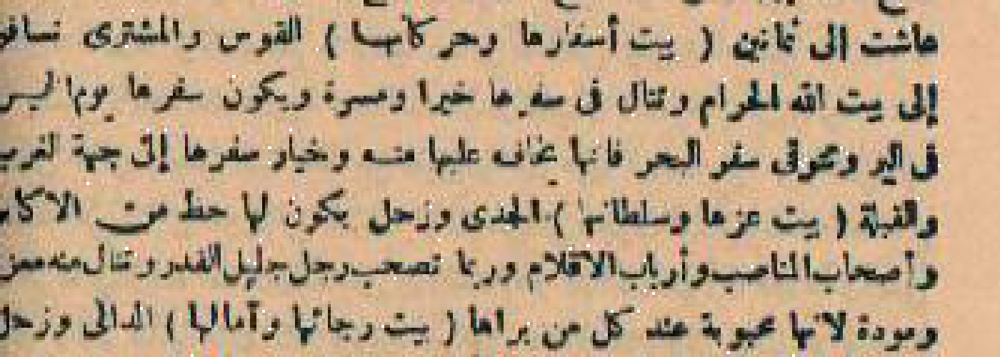

*Gambar Rajah Asli Halaman 62 (Rajah 1)* — Satar Huruf buruj ad-Dalw (Aquarius). Berisi bait rajah asma untuk keharmonisan pergaulan, daya tarik simpati, dan ketajaman daya nalar.

---

**[Gambar Rajah Asli Halaman 62 — Wafaq Angka ad-Dalw]**

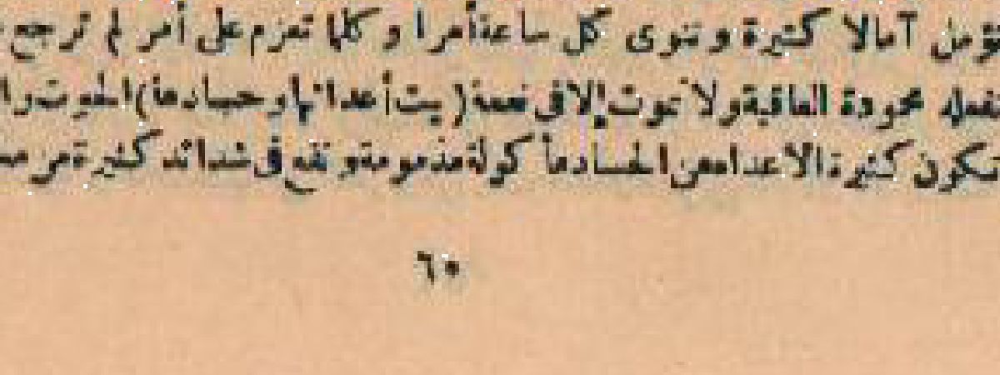

*Gambar Rajah Asli Halaman 62 (Rajah 2)* — Wafaq angka keramat buruj Aquarius untuk penarik rezeki dan tolak bala perselisihan.

---

## HALAMAN CETAK 63 (Halaman PDF 31, sisi kiri)

**[Teks Arab Asli]**

( القول على البرج الثانى عشر وهو برج الحوت والمشترى )
وصاحب فلك الحوت مشتريه الكريم * يدل على الفضل والتقوى والإحسان
له الفؤاد الرقيق والخلق القويم * ويرزق فى دهره بالخير والأمان
يحب السخاء ويؤثر الإيثار * ويعلو قدره بين سائر الأخيار

**[Transliterasi Latin Fonetik]**

*(al-qawli 'alaal-burjits-tsaanii 'asyara wa huwa burjul-Huuti wal-Musytarii)*
*wa shaahibu falak al-Huuti musytariyihil-kariimi * yadullu 'alaal-fadhli wat-taqwaa wal-ahsaani*
*lahul-fu'aadir-raqiiqi wal-khalqil-qawiimi * wa yurzaqu fii dahrihi bil-khayri wal-amaani*
*yuhibbus-sakhaa'u wa yu'atstsirul-iitsaaru * wa ya'luu qadruhu bayna saa'iril-akhyaari*

**[Terjemahan Indonesia]**

(Uraian tentang Buruj Keduabelas, yaitu Buruj Pisces dan Penguasanya: Yupiter)
*Penguasa peredaran Pisces adalah Yupiter sang pelindung mulia lagi dermawan * Memberi pertanda keutamaan martabat, ketakwaan murni, dan kebaikan ihsan*
*Ia memiliki hati nurani yang lembut peka dan budi pekerti yang lurus tegak * Sepanjang hayatnya diliputi limpahan rezeki kebaikan dan ketentraman*
*Ia mencintai kemurahan hati dan mengutamakan kepentingan orang lain * Serta derajatnya menjulang tinggi di antara segenap insan pilihan.*

---

**[Gambar Rajah Asli Halaman 63 — Tilsm Buruj al-Hut (Pisces)]**

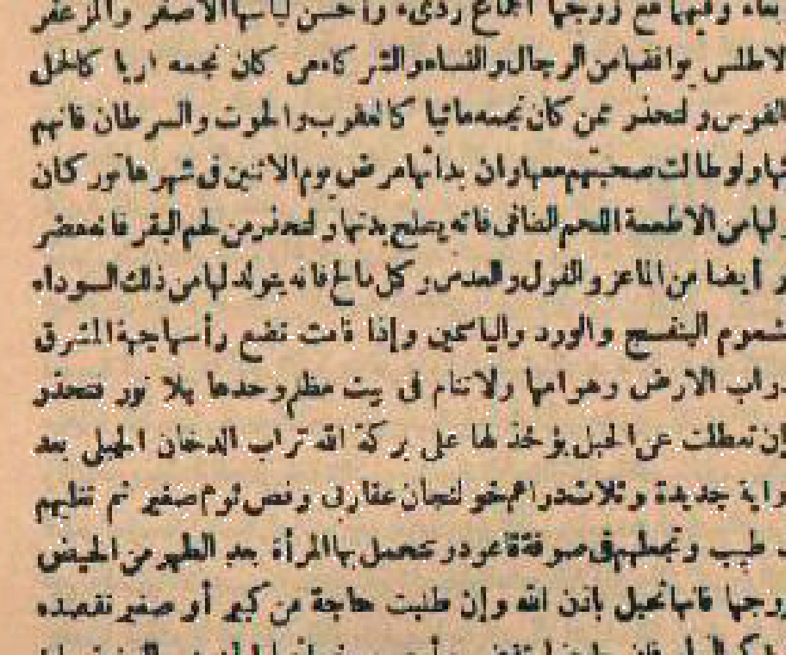

*Gambar Rajah Asli Halaman 63* — Gambar Tilsam simbolik buruj al-Hut (Pisces): Dua ekor ikan berenang berlawanan arah melambangkan kedalaman intuisi batin, spiritualitas tinggi, dan kelapangan rezeki perairan di bawah pengaruh planet Yupiter.

---

**[Teks Arab Asli]**

( القول على طبع الطالع واختلاف الوجوه والطباع )
قال الحكيم الفلكى: برج الحوت برج مائى ليلى مؤنث طبعه بارد رطب، يدل على الرقة والحلم والسخاء ومحبة العبادة والزهد، صاحب هذا البرج يكون رجلا أبيض اللون مشربا بحمرة خفيفة، حسن الوجه، وسيم الطلعة، عريض الصدر، لين الصوت، كثير الرحمة بالخلق، وله ثلاثة وجوه.

**[Transliterasi Latin Fonetik]**

*(al-qawli 'alaa thab'uth-thaali'u wa ikhtilaafil-wujuuhi wath-thibaa'i)*
*qaalal-hakiimul-Falakiyyu  burjul-Huuti burju maa'iyyun laylaa mu'annatsi thab'uhu baaridun rathbun, yadullu 'alaa ar-riqqati wal-hulmi was-sakhaa'i wa mahabbatil-'ibaadati waz-zuhdi, shaahibu haadzaal-burji yakuunu rajulan abyadhul-lawni masyraban bi-humratin khufayfatin, hasanul-wajhu, wa siimath-thal'ati, 'ariidhash-shadri, liyannash-shawta, katsiirur-rahmati bil-khalqi, wa lahu tsalaatsatun wujuuhin *

**[Terjemahan Indonesia]**

(Uraian tentang watak dasar thali' kelahiran, pembagian tiga wajah, dan karakternya)
Berkata sang ahli astrologi: Buruj Pisces adalah buruj berelemen air, bersifat malam hari, feminin, dengan tabiat dasar dingin dan basah/lembab; menunjukkan kelembutan jiwa, kesantunan, kemurahan derma, kecintaan pada ibadah dan kezuhudan. Pria yang lahir pada buruj ini berkulit putih bersih berpadu rona kemerahan cerah, berwajah rupawan teduh, berpenampilan memikat, berdada bidang, bersuara merdu lembut, menaruh belas kasih yang amat besar kepada segenap makhluk; dan ia memiliki tiga wajah (wajh).

---

**[Teks Arab Asli]**

( الوجه الأول ) من نظر إليه المشترى: يكون رجلا عابدا زاهدا أو عالما ورعا، ينال محبة عظيمة فى قلوب الناس، ويستجاب دعاؤه ببركة صفاء سريرته، ويرزق حجا وزيارة، ويكون مباركا أينما توجه، والله أعلم.

**[Transliterasi Latin Fonetik]**

*(al-wajhul-awwalu  min nazhara ilayhil-Musytarii  yakuunu rajulan 'aabidan zaahidan aw 'aalamaa wa ri'aa, yanaalu mahabbata 'azhiimata fii quluubin-naasi, wa yustajaabu du'aa'uhu bibarakati shafaa'i sariiratihi, wa yurzaqu hijaa wa ziyaarati, wa yakuunu mubaarakan aynamaa tawajjuhin, wallaahu a'lamu *) **[Terjemahan Indonesia]**

(Wajah Pertama) Bagi yang dipandang oleh planet Yupiter: Ia menjadi seorang ahli ibadah yang zuhud atau ulama yang wara'; meraih tempat cinta yang sangat mendalam di hati masyarakat; doanya mustajab berkat kebeningan batinnya; dianugerahi kesempatan menunaikan ibadah haji dan ziarah suci; serta senantiasa membawa berkah ke mana pun ia melangkah. Wallahu a'lam.

---

**[Teks Arab Asli]**

( الوجه الثانى ) من نظر إليه الزهرة: يكون رجلا ظريفا لطيفا، محبا للموسيقى والجمال والبساتين والأنهار، ينال مالا وفيرا من التجارات المتعلقة بالماء والزينة، ويكون ذا حظ وافر عند النساء، والله تعالى أعلم.

**[Transliterasi Latin Fonetik]**

*(al-wajhuts-tsaanii  min nazhara ilayhiz-Zuharati  yakuunu rajulan zhariifan lathiifan, muhibban lil-muusiiqaa wal-jamaala wal-basaatiina wal-anhaara, yanaalu maalan wa fiiraa minat-tijaaraatil-muta'alliqati bil-maa'i waz-zaynati, wa yakuunu dzaa hazhzhun wa afiri 'indan-nisaa'i, wallaahu Ta'aalaa a'lamu *) **[Terjemahan Indonesia]**

(Wajah Kedua) Bagi yang dipandang oleh planet Venus: Ia berjiwa anggun dan artistik; mencintai keindahan seni, alam asri perairan dan tanaman hijau; memperoleh kekayaan melimpah dari perniagaan komoditas perairan dan perlengkapan estetika; serta senantiasa dinaungi keberuntungan asmara yang menyenangkan. Wallahu Ta'ala a'lam.

---

**[Teks Arab Asli]**

( الوجه الثالث ) من نظر إليه عطارد: يكون رجلا سريع الخاطر، واسع الخيال، كاتبا وشاعرا مجيدا، يتقن دقائق العلوم واللغات، ويكون محبوبا عند أرباب الفضل والأدب، والله أعلم.

**[Transliterasi Latin Fonetik]**

*(al-wajhuts-tsaalitsu  min nazhara ilayhi 'Uthaarida  yakuunu rajulan sarii'ul-khaathiri, waasi'ul-khayaali, kaatiban wa syaa'iran majiidan, yutqinu daqaa'iqul-'uluumi wal-lughaati, wa yakuunu mahbuuban 'inda arbaabil-fadhli wal-adabi, wallaahu a'lamu *) **[Terjemahan Indonesia]**

(Wajah Ketiga) Bagi yang dipandang oleh planet Merkurius: Ia dianugerahi daya imajinasi yang luas, intuisi cepat, piawai sebagai sastrawan dan penyair ulung; menguasai kehalusan cabang ilmu pengetahuan dan tata bahasa; serta dicintai oleh kalangan cendekiawan dan budayawan. Wallahu a'lam.

---

## HALAMAN CETAK 64 (Halaman PDF 32, sisi kanan)

**[Teks Arab Asli]**

( بيت حياته ومعيشته ) الحوت والمشترى: تكون حياته فى سعة ورغد، ينال من الخير ما يغنيه عن الناس، ولا يزال يتقلب فى نعم الله تعالى، وينال فى كبره عزا ومهابة، ولا يموت إلا فى حال مرضية، والله أعلم.

**[Transliterasi Latin Fonetik]**

*(baytu hayaatihi wa ma'iisyatihi  al-Huuti wal-Musytarii  takuunu hayaatihi fii sa'atin wa raghadin, yanaalu minal-khayri maa yughanniihi 'an an-naasi, wa laa yuzaalu yataqallabu fii ni'ami Allaahi Ta'aalaa, wa yanaalu fii kibarihi 'izzan wa mahaabatan, wa laa yamuutu illaa fii haali maradhiyyati, wallaahu a'lamu *) **[Terjemahan Indonesia]**

(Rumah kehidupan dan penghidupannya) Pisces dan Yupiter: Garis kehidupannya diliputi kelapangan dan kemakmuran; dianugerahi kecukupan rezeki yang membuatnya tidak bergantung pada belas kasihan orang lain; senantiasa bergelimang dalam limpahan nikmat Allah Ta'ala; di masa tuanya ia mereguk kemuliaan dan wibawa agung; serta tidak berpulang melainkan dalam kondisi husnul khatimah yang diridhai. Wallahu a'lam.

---

**[Teks Arab Asli]**

( بيت ماله وكسبه ) الحمل والمريخ: يكتسب الأموال من وجوه شتى كالتجارة وركوب البحر والصنائع النافعة، وينفق فى سبيل الله وفى عمارة المساجد والمدارس، ويبارك الله فى ماله فيزكو وينمو، والله أعلم.

**[Transliterasi Latin Fonetik]**

*(baytu maalihi wa kasbihi  al-Hamali wal-Mirriikhi  yaktasibul-amwaali min wujuuhin syattaa kat-tijaarati wa rukuubil-bahri wash-shanaa'i'in-naafi'ati, wa yunfiqu fii sabiili Allaahi wa fii 'imaaratul-masaajidi wal-mudaarisi, wa yubaariku Allaahi fii maalihi fa-yazkuu wiinamuu, wallaahu a'lamu *) **[Terjemahan Indonesia]**

(Rumah harta dan penghasilannya) Aries dan Mars: Ia menghimpun kekayaan dari berbagai saluran usaha seperti perniagaan maritim ekspedisi laut dan industri kreatif yang bermanfaat; sangat gemar berinfak di jalan Allah untuk kemakmuran masjid dan lembaga pendidikan; dan Allah melipatgandakan keberkahan hartanya hingga terus berkembang subur. Wallahu a'lam.

---

**[Teks Arab Asli]**

( بيت إخوته وأخواته ) الثور والزهرة: يكون له إخوة يحبهم ويحسن إليهم، ويقوم بمساعدتهم عند الحاجة، وينال منهم وفاء ومحبة خالصة، وتدوم بينهم الألفة والمودة، والله تعالى أعلم.

**[Transliterasi Latin Fonetik]**

*(baytu ikhwatihi wa akhawaatihi  ats-Tsawri waz-Zuharati  yakuunu lahu ikhwatin yuhibbuhum wa yuhsinu ilayhim, wa yaquumu bimusaa'adatihim 'indal-haajati, wa yanaalu minhum wa faa'an wa mahabbata khaalishata, wa tudawwimu baynahum al-ulfata wal-mawaddata, wallaahu Ta'aalaa a'lamu *) **[Terjemahan Indonesia]**

(Rumah saudara-saudaranya) Taurus dan Venus: Ia memiliki saudara-saudara kandung yang sangat ia cintai dan ia perlakukan dengan penuh kebajikan; sigap mengulurkan bantuan finansial di saat mereka membutuhkan; memetik kesetiaan dan ketulusan kasih dari mereka; serta keharmonisan di antara mereka berlangsung abadi. Wallahu Ta'ala a'lam.

---

**[Teks Arab Asli]**

( بيت آبائه وأمهاته ) الجوزاء وعطارد: ينال من والديه دعاء مباركا وتربية حسنة، ويكون بارا بهما غاية البر، ويدفن أمه قبل أبيه، ويرث منهما خيرا كثيرا، والله أعلم.

**[Transliterasi Latin Fonetik]**

*(baytu aabaa'ihi wa ummahaatihi  al-Jawzaa'i wa 'Uthaarida  yanaalu min wad-diihu du'aa'an mubaarakan wa tarbiyata hasanatun, wa yakuunu baarran bihimaa ghaayatil-barri, wa yadfinu ummihi qabla abiihi, wa yaritsu minhumaa khayran katsiiran, wallaahu a'lamu *) **[Terjemahan Indonesia]**

(Rumah orang tuanya) Gemini dan Merkurius: Ia mendapatkan curahan doa keberkahan dan pendidikan akhlak yang luhur dari kedua orang tuanya; sangat berbakti sekuat tenaga kepada keduanya; memakamkan ibunya lebih dahulu sebelum ayahnya; serta mewarisi dari keduanya warisan yang berlimpah kebaikan. Wallahu a'lam.

---

**[Teks Arab Asli]**

( بيت أولاده وأفراحه ) السرطان والقمر: يرزق بأولاد ذكور وإناث يكونون له قرة عين وسرورا، ويبرز منهم من يعلو شأنه فى الدين والعلم، وينال بهم بركة وسعادة فى دنياه، والله أعلم.

**[Transliterasi Latin Fonetik]**

*(baytu awlaadihi wa afraahihi  as-Sarathaani wal-Qamari  yurzaqu bi-awlaadin dzukuurin wa inaatsi yukawwinuuna lahu qarratin 'ayn wa suruuran, wa yubrizu minhum min ya'luu sya'nahu fid-diini wal-'ilmi, wa yanaalu bahum barakatin wa sa'aadatin fii dunyaahi, wallaahu a'lamu *) **[Terjemahan Indonesia]**

(Rumah anak-anak dan kebahagiaannya) Cancer dan Bulan: Ia dikaruniai putra dan putri yang menjadi penyejuk pandangan mata dan sumber kebahagiaannya; di antara anak-anaknya akan ada yang tampil sebagai tokoh terpandang dalam bidang keagamaan dan keilmuan; serta melaluinya ia memetik berkah dan kebahagiaan hidup. Wallahu a'lam.

---

**[Teks Arab Asli]**

( بيت أمراضه وأسقامه ) الأسد والشمس: تصيبه أمراض البرودة والرطوبة فى الأرجل والمفاصل ووجع الكلى، فليشرب السكنجبين العسلى، ويستعمل الحمامات الدافئة والأدهان العطرية، ويحذر من المشى فى الماء البارد حافيا، والله أعلم.

**[Transliterasi Latin Fonetik]**

*(baytu amraadhihi wa asqaamihi  al-Asadi wasy-Syamsi  tushiibuhu amraadhin al-buruudati war-ruthuubati fil-arjuli wal-mafaashili wa waja'il-kulaa, fa-layasyrabus-sakanjabiinul-'asalaa, wa yasta'milul-hamaamaatud-daafa'ah wal-adhaanal-'ithriyyata, wa yuhadzdziru minal-masyaa fil-maa'il-baaridi haafiyan, wallaahu a'lamu *) **[Terjemahan Indonesia]**

(Rumah penyakit dan keluhan fisiknya) Leo dan Matahari: Ia rentan mengalami keluhan kedinginan dan penumpukan cairan pada kedua kaki, persendian ngilu, serta gangguan organ ginjal; maka dianjurkan rutin meminum oxymel madu murni; mandi dengan air hangat beraroma rempah; serta menghindari berjalan tanpa alas kaki di atas genangan air dingin. Wallahu a'lam.

---

## HALAMAN CETAK 65 (Halaman PDF 32, sisi kiri)

**[Teks Arab Asli]**

( بيت نسائه وفراشه ) السنبلة وعطارد: يتزوج بامرأة صالحة عفيفة ذات حياء ودين، تكون حافظة لبيته وماله، وينال منها راحة قلب وهناء معيشة، وتكون بينهما مودة ورحمة تدوم طوال العمر، والله أعلم.

**[Transliterasi Latin Fonetik]**

*(baytu nisaa'ihi wa firaasyihi  as-Sunbulati wa 'Uthaarida  yatazawwaju biaamra'ati shaalihati 'afiifati dzaat hayaa'i wa diinin, takuunu haafizhatu libaytihi wa maalihi, wa yanaalu minhaa raahata qalbin wa hanaa'i ma'iisyatin, wa takuunu baynahumaa mawaddatan wa rahmatan taduumu thuwwaalul-'umri, wallaahu a'lamu *) **[Terjemahan Indonesia]**

(Rumah istri dan peraduannya) Virgo dan Merkurius: Ia mempersunting wanita salihah yang amat menjaga kesucian diri, berakhlak pemalu nan taat beragama; piawai merawat amanah rumah tangga dan harta suaminya; ia memetik ketenangan jiwa dan kebahagiaan hidup bersamanya; serta rajutan kasih sayang dan rahmat di antara keduanya terjalin abadi sepanjang usia. Wallahu a'lam.

---

**[Teks Arab Asli]**

( بيت خوفه وموته ) الميزان والزهرة: يخاف عليه من عوارض المياه والأسفار فى البحر، وسنوات الخطر عنده: سبع سنين، وأربع عشرة سنة، وثمان وعشرون سنة، واثنتان وخمسون سنة، وسبعون سنة، فان نجا منها امتد عمره إلى تسعين سنة، والله أعلم.

**[Transliterasi Latin Fonetik]**

*(baytu khawfihi wa mawtihi  al-Miizaani waz-Zuharati  yukhaafu 'alayhi min 'awaaridhil-miyaahi wal-asfaari fil-bahri, wa sanwaatal-khuthuri 'indahu  sab'i siniina, wa arba'i 'asyrata sanatin, wa tsamaanun wa 'isyruuna sanatin, wa atsinataani khamsuuna sanatin, sab'uuna sanatin, fa-in najaa minhaa imtadda 'umruhu ilaa tis'iina sanatin, wallaahu a'lamu *) **[Terjemahan Indonesia]**

(Rumah ketakutan dan masa krisis hidupnya) Libra dan Venus: Dikhawatirkan atasnya bahaya pusaran air dan kecelakaan saat mengarungi samudra laut; tahun-tahun rawan dalam siklus kehidupannya adalah usia 7 tahun, 14 tahun, 28 tahun, 52 tahun, dan 70 tahun; jika ia berhasil melaluinya dengan selamat, usianya akan berlanjut hingga 90 tahun. Wallahu a'lam.

---

**[Teks Arab Asli]**

( بيت أسفاره وحركاته ) العقرب والمريخ: يكثر من الأسفار البحرية والتجارات النهرية، ويكون سفره إلى جهة الجنوب والشرق ميمونا، وينال فى أسفاره أرباحا طائلة ومنافع جزيلة، والله أعلم.

**[Transliterasi Latin Fonetik]**

*(baytu asfaarihi wa harakaatihi  al-'Aqrabi wal-Mirriikhi  yuktsiru minal-asfaaril-bahriyyati wat-tijaaraatin-nahriyyati, wa yakuunu safarihi ilaa jihatil-januubi wasy-syarqi maymuunan, wa yanaalu fii asfaarihi arubbaahan thaa'ilatan wa manaafi'a jaziilata, wallaahu a'lamu *) **[Terjemahan Indonesia]**

(Rumah perjalanan dan pergerakannya) Scorpio dan Mars: Ia kerap melakukan perjalanan laut dan ekspedisi niaga perairan sungai; rute perjalanannya menuju arah selatan dan timur membawa keberkahan berlipat; serta ia mendulang keuntungan berlimpah dan faedah-faedah yang sangat besar. Wallahu a'lam.

---

**[Teks Arab Asli]**

( بيت عزه وسلطانه ) القوس والمشترى: ينال عزا ساميا ومكانة رفيعة عند السلاطين والقضاة، ويكون محبوبا عند سائر الخلق، وتنفذ أحكامه بالعدل والإنصاف، ويعلو قدره بين أقرانه، والله أعلم.

**[Transliterasi Latin Fonetik]**

*(baytu 'izzihi wa sulthaanihi  al-Qawsi wal-Musytarii  yanaalu 'izzan saamiyaa wa makaanatu rafii'atu 'indas-salaathiini wal-qudhaati, wa yakuunu mahbuuban 'inda saa'iril-khalqi, wa tunaffidzu ahkaamahu bil-'adli wal-inshaafi, wa ya'luu qadruhu bayna aqraanihi, wallaahu a'lamu *) **[Terjemahan Indonesia]**

(Rumah kemuliaan dan kekuasaannya) Sagittarius dan Yupiter: Ia merengkuh kemuliaan luhur dan kedudukan tinggi di sisi para raja dan hakim agung; dicintai oleh segenap lapisan masyarakat; pandangan dan keputusannya dipatuhi berkat keadilan dan kebijaksanaannya; serta martabatnya unggul di atas rekan-rekan sebayanya. Wallahu a'lam.

---

**[Teks Arab Asli]**

( بيت رجائه وآماله ) الجدى وزحل: يبلغ من الآمال ما يتمناه فى جمع المال وامتلاك العقارات، ويكون موفور النعمة، ويرزق توبة نصوحا وحسن ختام، والله أعلم.

**[Transliterasi Latin Fonetik]**

*(baytu rajaa'ihi wa aamaalihi  al-Jadyi wa Zuhala  yablughu minal-aamaali maa yatamannaahu fii jam'il-maali wa imtilaakil-'aqaaraati, wa yakuunu mawfuuran-na'amati, wa yurzaqu tawbatin nashuuhan wa husni khitaamin, wallaahu a'lamu *) **[Terjemahan Indonesia]**

(Rumah cita-cita dan harapannya) Capricorn dan Saturnus: Ia berhasil menggapai segala apa yang dicita-citakannya dalam hal kemapanan harta dan kepemilikan aset tanah bangunan; hidupnya diliputi keberlimpahan nikmat; serta dianugerahi taubat nasuha dan husnul khatimah di penghujung hayatnya. Wallahu a'lam.

---

**[Teks Arab Asli]**

( بيت أعدائه وحساده ) الدلو وزحل: أعداؤه قليلون ولا يضرونه شيئا لأن الله تعالى حافظه وكافيه، وينصره على كل من ناوأه وعاداه، والله سبحانه أعلم.

**[Transliterasi Latin Fonetik]**

*(baytu a'daa'ihi wa hussaadihi  ad-Dalwi wa Zuhala  a'addaa'uhu qaliiluuna wa laa yadhurruunahu syay'an la'ann Allaahi Ta'aalaa haafizhuhu wa kaafiyuhu, wa yanshuruhu 'alaa kullu min naaw'ah wa 'aadaahu, wallaahu Subhaanahu a'lamu *) **[Terjemahan Indonesia]**

(Rumah musuh dan para pendengkinya) Aquarius dan Saturnus: Musuh-musuhnya sangat sedikit dan tidak akan sanggup mencelakainya sedikit pun karena Allah Ta'ala senantiasa menjadi pelindung dan pemelihara dirinya; serta Allah memenangkannya atas siapa saja yang memusuhi dan memusuhinya. Wallahu Subhanahu wa Ta'ala a'lam.

---

## HALAMAN CETAK 66 (Halaman PDF 33, sisi kanan)

**[Teks Arab Asli]**

( ولصاحب هذا البرج من أشكال الرمل شكل القبض الداخل )
قال الحكيم الفلكى: اعلم أيها السائل أن شكل القبض الداخل يدل على تحصيل الأموال، واجتماع الخيرات، واستقرار الأمور بعد الاضطراب، وظفر السائل بمراده، فعليك بحمد الله تعالى وشكره، واسمع قول الشاعر:
إذا نلت من دنياك خيرا فكن به * شكورا لرب العرش تحظ بالمزيد
ولا تبخلن بالمال واجعله قربة * تنل جنة المأوى وعيشا كما تريد

**[Transliterasi Latin Fonetik]**

*(wa li-shaahibi haadzaal-burji min asykaalir-ramli syaklul-qabdhid-daakhili)*
*qaalal-hakiimul-Falakiyyu  i'lam ayyuhas-saa'ilu an syaklul-qabdhid-daakhili yadullu 'alaa tahshiilil-amwaali, wa ijtimaa'al-khayraati, wa istiqraaral-umuuri ba'dal-idhthiraabi, wa zhafaras-saa'ilu bimuraadihi, fa'alayka bahamida Allaahi Ta'aalaa wa syakarahu, wa isma' qawlusy-syaa'iri:*
*idzaa nultu min dunyaaka khayran fukkinna bihi * syakuuran li-rabbal-'arsyi tuhzhi bil-maziidi*
*wa laa tabkhalinna bil-maali wa ij'alhu qurbata * tanul jannatul-ma'waa wa 'aysyan kamaa turiidu*

**[Terjemahan Indonesia]**

(Bagi pemilik buruj ini dari bentuk-bentuk ilmu raml/geomansi adalah bentuk *al-Qabdh ad-Dakhil*)
Berkata sang ahli ilmu falak: Ketahuilah wahai penanya, sesungguhnya bentuk al-Qabdh ad-Dakhil menunjukkan terkumpulnya kekayaan harta, terhimpunnya segala kebajikan, kemapanan seluruh urusan setelah sempat mengalami guncangan, serta keberhasilan si penanya meraih impian yang didambakannya; maka lazimkanlah memuji Allah Ta'ala dan bersyukur kepada-Nya; simaklah untaian bait syair ini:
*Jika engkau mereguk kebaikan dari duniamu maka jadilah pribadi * Yang pandai bersyukur kepada Tuhan Penguasa 'Arsy niscaya engkau beroleh tambahan karunia*
*Janganlah sekali-kali kikir dengan hartamu dan jadikanlah ia sarana mendekatkan diri * Niscaya engkau meraih surga tempat kembali dan kehidupan mulia sebagaimana yang kau impikan.*

---

**[Gambar Rajah Asli Halaman 66 — Satar Huruf & Wafaq al-Hut]**

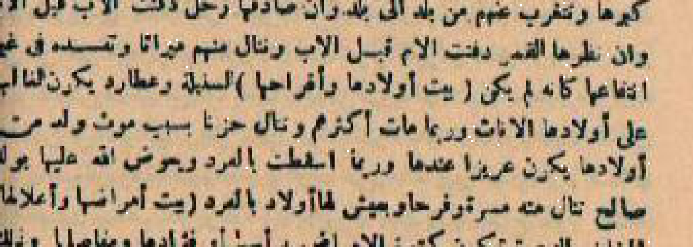

*Gambar Rajah Asli Halaman 66 (Rajah 1)* — Satar Huruf penutup bagi thali' kaum pria (buruj Pisces). Berisi susunan asma keramat untuk keselamatan total, ketentraman batin, dan pembuka pintu kemakmuran.

---

**[Gambar Rajah Asli Halaman 66 — Wafaq Angkal-Hut]**

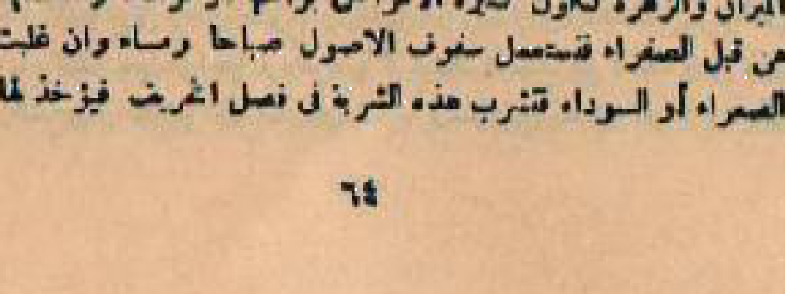

*Gambar Rajah Asli Halaman 66 (Rajah 2)* — Wafaq angka harmoni buruj Pisces penutup seluruh 12 Buruj Thali' Kaum Pria.

---

## HALAMAN CETAK 67 (Halaman PDF 33, sisi kiri)

**[Teks Arab Asli]**

بِسْمِ اللهِ الرَّحْمٰنِ الرَّحِيْمِ
( الْقَوْلُ عَلَى طَوَالِعِ النِّسَاءِ بِالتَّمَامِ وَالْكَمَالِ )
الحمد لله رب العالمين والصلاة والسلام على أشرف الأنبياء والمرسلين سيدنا محمد وعلى آله وصحبه أجمعين. أما بعد: فهذا بيان طوالع النساء وما يقع لهن فى أعمارهن من السعد والنحس والخير والشر والأزواج والأولاد والأمراض والأحوال على مقتضى البروج الاثنى عشر والكواكب السيارة السبعة، مرتبة على أحسن نظام وأتم بيان، وبالله التوفيق.
( البرج الأول من طوالع النساء: برج الحمل والمريخ )
وصاحبة فلك الحمل مريخها الوهاج * يدل على الحشمة والعز والجمال
لها العقل الوافر وحسن المزاج * وتظفر فى دهرها ببلوغ الآمال
تحب النزاهة وتصون العفاف * وتلقى من الله الأمن والكفاف

**[Transliterasi Latin Fonetik]**

*Bismillaahir-Rahmaanir-Rahiim*
*(al-qawli 'alaa thawaali'un-nisaa'i bit-tamaami wal-kamaali)*
*al-hamdu lillaahi rabbil-'aalamiina wash-shalaata was-sullaama 'alaa asyrafil-anbiyaa'i wal-mursaliina sayyidinaa Muhammadin wa 'alaa aalihi wa shahbihi ajam'ayni  ammaa ba'da  fa-haadzaa bayaani thawaali'un-nisaa'i wa maa yuq'i lahunn fii a'maarihinna minas-sa'di wan-nahsi wal-khayri wasy-syarri wal-azwaaji wal-awlaadi wal-amraadhi wal-ahwaali 'alaa muqtadhaal-buruujil-atsnaa 'asyara wal-kawaakibis-sayyaaratus-sab'atu, martabatan 'alaa ahsanu nizhaamin wa atimmu bayaana, wa billaahit-tawfiiqi.*
*(al-burjil-awwalu min thawaali'un-nisaa'i  burjul-Hamali wal-Mirriikhi)*
*wa shaahibatu falak al-Hamali mirriikhahaal-wahhaaja * yadullu 'alaal-hisymati wal-'izzi wal-jamaali*
*lahaal-'aqlil-waafiri wa husnil-mizaaji * wa tazhfaru fii dahrihaa bibuluughil-aamaali*
*tuhibbun-nazaahatu wa tashuunul-'afaafu * wa talaqqaa min Allaahil-amni wal-kafaafi*

**[Terjemahan Indonesia]**

Dengan nama Allah Yang Maha Pengasih lagi Maha Penyayang.
(RISALAH TENTANG THALI' PERJALANAN HIDUP KAUM WANITA SECARA LENGKAP DAN SEMPURNA)
Segala puji bagi Allah Tuhan semesta alam, dan shalawat serta salam semoga tercurah kepada semulia-mulia para nabi dan rasul, junjungan kami Nabi Muhammad beserta keluarga dan para sahabat beliau seluruhnya. Amma ba'du: Maka inilah penjelasan terperinci mengenai thali' (bintang nasib) kaum wanita, serta apa yang terjadi dalam lintasan usia mereka berupa peruntungan baik, tantangan hidup, kebaikan, pernikahan jodoh, keturunan anak, kesehatan penyakit, dan dinamika kehidupannya berdasarkan peredaran dua belas buruj zodiak dan tujuh bintang planet pengelana (al-kawakib as-sab'ah), yang disusun dengan tata aturan paling rapi dan uraian paling sempurna; dan hanya kepada Allah-lah taufik pertolongan disandarkan.
(Buruj Pertama dari Thali' Kaum Wanita: Buruj Aries dan Penguasanya: Mars)
*Penguasa orbit Aries bagi wanita adalah Mars sang bintang cemerlang menyala * Memberi petunjuk pada rasa malu yang terhormat, kemuliaan, dan keelokan rupa*
*Ia dianugerahi akal pikiran yang cerdas serta watak perangai yang menyenangkan * Berhasil menggapai puncak harapan dan cita-cita dalam lembaran hidupnya*
*Ia mencintai kesucian budi dan memelihara kehormatan diri * Serta diliputi rasa aman dan kecukupan rezeki dari Allah Ta'ala.*

---

**[Gambar Rajah Asli Halaman 67 — Tilsm Buruj al-Haml Kaum Wanita]**

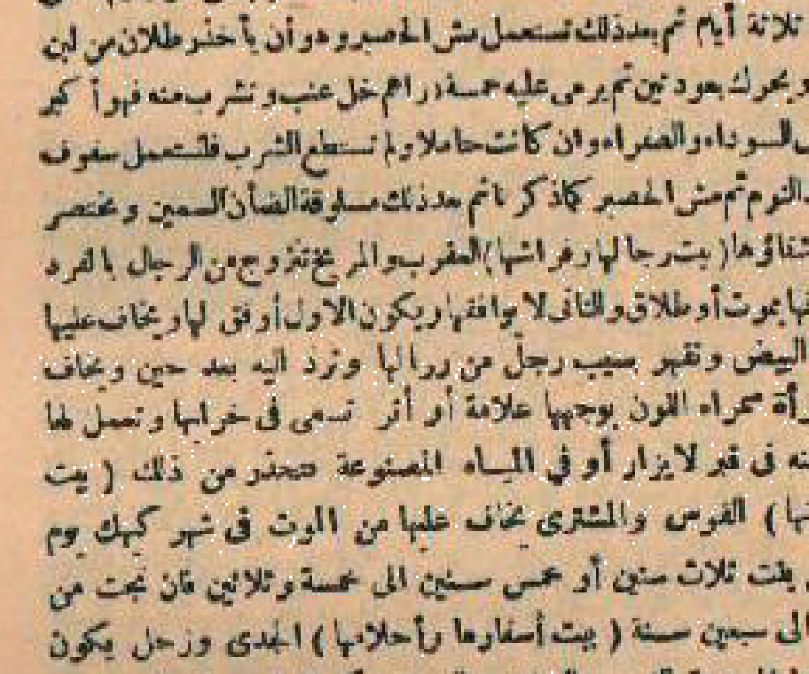

*Gambar Rajah Asli Halaman 67* — Gambar Tilsam simbolik buruj Aries untuk Thali' Kaum Wanita: Sosok ratu bermahkota anggun di bawah naungan bintang Mars pelindung kemuliaan wanita.

---

**[Teks Arab Asli]**

( القول على طبع الطالع واختلاف الوجوه للنسوة )
قال الحكيم: هى امرأة بيضاء اللون مشربة بحمرة، حسنة العينين والحاجبين، ذات بهاء ووقار، سريعة الغضب قريبة الرضا، صادقة اللهجة، كريمة النفس، ولها ثلاثة وجوه.

**[Transliterasi Latin Fonetik]**

*(al-qawli 'alaa thab'uth-thaali'u wa ikhtilaafil-wujuuhi lin-niswata)*
*qaalal-hakiimu  hiya imra'atun baydhaa'ul-lawni masyrabatan bi-humratin, hasanatun al-'aynayni wal-haajibayni, dzaat bahaa'in wa waqaarin, sarii'atal-ghadhabi qariibatar-ridhaa, shaadiqatal-lahjati, kariimatan-nafsi, wa lahaa tsalaatsatun wujuuhin *

**[Terjemahan Indonesia]**

(Uraian watak dasar thali' wanita dan pembagian tiga wajahnya)
Berkata sang ahli hikmah falak: Wanita yang lahir di bawah naungan buruj Aries ini berkulit putih bersih berpadu rona kemerahan cerah, kedua mata dan alisnya indah menawan, memancarkan pesona anggun dan wibawa terhormat, lekas tersentuh emosinya namun cepat luluh kembali, jujur dalam bertutur kata, berjiwa dermawan; dan ia memiliki tiga wajah (wajh).

---

**[Teks Arab Asli]**

( الوجه الأول ) من نظر إليها المريخ: تكون امرأة شجاعة حازمة، مدبرة لبيتها، ذات عفة وصيانة، مهابة عند النساء والرجال، تنال عزا وجاها، وتكون مباركة فى حركاتها، والله أعلم.

**[Transliterasi Latin Fonetik]**

*(al-wajhul-awwalu  min nazhara ilayhaal-Mirriikhi  takuunu imra'atun syajaa'ati haazimati, mudabbarata lubbiyyatihaa, dzaat 'iffatin wa shiyaanatin, mahaabata 'indan-nisaa'i war-rijaali, tanaalu 'izzan wijaahan, wa takuunu mubaarakatun fii harakaatihaa, wallaahu a'lamu *) **[Terjemahan Indonesia]**

(Wajah Pertama) Bagi yang dipandang oleh planet Mars: Ia menjadi wanita yang berjiwa teguh mandiri, piawai mengelola rumah tangga, sangat menjaga kesucian kehormatan dirinya, disegani di kalangan kaum wanita maupun pria, meraih kemuliaan dan status sosial yang tinggi, serta senantiasa membawa berkah dalam setiap gerak langkahnya. Wallahu a'lam.

---

**[Teks Arab Asli]**

( الوجه الثانى ) من نظر إليها الشمس: تكون امرأة ذات جمال باهر، صبيحة الوجه، محبوبة عند زوجها وأهلها، ترزق مالا كثيرا من الذهب والحلي، وتعيش فى رفاهية ونعمة، والله تعالى أعلم.

**[Transliterasi Latin Fonetik]**

*(al-wajhuts-tsaanii  min nazhara ilayhaa asy-Syamsi  takuunu imra'atun dzaat jamaali baahiri, shabiihatal-wajhu, mahbuubatan 'inda zawjuhaa wa ahlihaa, turzaqu maalan katsiiran minadz-dzahabi wal-halliyyi, wa ta'iisyu fii ruffaahiyyatin wa ni'matin, wallaahu Ta'aalaa a'lamu *) **[Terjemahan Indonesia]**

(Wajah Kedua) Bagi yang dipandang oleh Matahari: Ia berparas jelita memikat pandangan, wajahnya berseri cerah, sangat disayangi oleh suaminya dan keluarga besarnya, dianugerahi kelimpahan harta perhiasan emas dan kemewahan, serta menjalani kehidupan dalam kemakmuran yang membahagiakan. Wallahu Ta'ala a'lam.

---

**[Teks Arab Asli]**

( الوجه الثالث ) من نظر إليها الزهرة: تكون امرأة لطيفة رقيقة، تحب الزينة والطيب واللباس الفاخر، ذات صوت رخيم، ترزق مودة عظيمة عند كل من رآها، والله أعلم.

**[Transliterasi Latin Fonetik]**

*(al-wajhuts-tsaalitsu  min nazhara ilayhaa az-Zuharati  takuunu imra'atun lathiifatu raqiiqatin, tuhibbuz-zaynatu wath-thayyibu wal-libaasul-faakhiru, dzaat shawti rakhiimi, turzaqu mawaddatu 'azhiimatu 'inda kullu min ra'aahaa, wallaahu a'lamu *) **[Terjemahan Indonesia]**

(Wajah Ketiga) Bagi yang dipandang oleh planet Venus: Ia adalah wanita yang sangat anggun dan berhati lembut, gemar memakai wewangian harum, perhiasan elok, dan busana-busana indah, bersuara merdu menyenangkan, serta dianugerahi limpahan kasih sayang dan simpati dari siapa pun yang memandangnya. Wallahu a'lam.

---

## HALAMAN CETAK 68 (Halaman PDF 34, sisi kanan)

**[Teks Arab Asli]**

( بيت حياتها ومعيشتها ) الحمل والمريخ: تكون معيشتها طيبة واسعة، وتكفى مؤنتها فى صغرها وكبرها، وتعيش مستورة الحال فى صيانة وعفاف، ولا تزال فى ارتقاء وسعادة، ولا تموت إلا فى نعمة وسلام، والله أعلم.

**[Transliterasi Latin Fonetik]**

*(baytu hayaatihaa wa ma'iisyatihaa  al-Hamali wal-Mirriikhi  takuunu ma'iisyatuhaa thayyibatu waasi'atan, wa tukfaa mu'anatuhaa fii shigharihaa wa kibarihaa, wa ta'iisyu mastuuratul-haali fii shiyaanatin wa 'afaafin, wa laa tuzaalu fii irtiqaa'in wa sa'aadatin, wa laa tamuutu illaa fii ni'matin wa sullaamin, wallaahu a'lamu *) **[Terjemahan Indonesia]**

(Rumah kehidupan dan penghidupan wanita) Aries dan Mars: Penghidupannya berlangsung sejahtera dan lapang; tercukupi segala kebutuhannya sejak masa kecil hingga hari tuanya; hidup dalam keadaan terjaga kehormatannya dan terpelihara martabatnya; senantiasa menanjak dalam kebahagiaan; serta tidak berpulang melainkan dalam kenikmatan dan keselamatan dari Allah. Wallahu a'lam.

---

**[Teks Arab Asli]**

( بيت مالها وكسبها ) الثور والزهرة: ترزق بمال حلال كثير من كسب يدها كالغزل والخياطة والتجارة، أو من إرث صالح، ويكون لها حظ عظيم فى امتلاك الحلى والأقمشة الثمينة، والله أعلم.

**[Transliterasi Latin Fonetik]**

*(baytu maalihaa wa kasbihaa  ats-Tsawri waz-Zuharati  turzaqu bimaali halaali katsiiru min kasbi yadihaa kal-ghazali wal-khayyaathati wat-tijaarati, aw min irtsi shaalihi, wa yakuunu lahaa hazhzhun 'azhiimun fii imtilaakil-hilaa wal-aqmisyatits-tsamiinati, wallaahu a'lamu *) **[Terjemahan Indonesia]**

(Rumah harta dan penghasilannya) Taurus dan Venus: Ia dianugerahi harta halal yang berlimpah ruah baik dari hasil karya keterampilannya sendiri seperti menenun, merancang busana, dan perniagaan, maupun dari warisan yang berkah; ia sangat beruntung dalam kepemilikan perhiasan emas permata dan kain-kain sutra yang berharga. Wallahu a'lam.

---

**[Teks Arab Asli]**

( بيت إخوتها وأخواتها ) الجوزاء وعطارد: يكون لها إخوة وأخوات، وتنال منهم مودة وبرورا، ويكون بينها وبينهم تراحم وتعاطف، ولا ترى منهم إلا ما يسرها، والله تعالى أعلم.

**[Transliterasi Latin Fonetik]**

*(baytu ikhwatihaa wa akhawaatihaa  al-Jawzaa'i wa 'Uthaarida  yakuunu lahaa ikhwatin wa akhawaatin, wa tanaalu minhum mawaddata wabaruuraa, wa yakuunu baynahaa wa baynahum taraahuma wa ta'aathufa, wa laa taraa minhum illaa maa yusrihaa, wallaahu Ta'aalaa a'lamu *) **[Terjemahan Indonesia]**

(Rumah saudara-saudaranya) Gemini dan Merkurius: Ia memiliki saudara kandung laki-laki dan perempuan; ia memetik ketulusan kasih sayang dan perlakuan baik dari mereka; hubungan kekeluargaan di antara mereka diliputi kasih sayang dan saling tolong-menolong; serta ia tidak melihat dari mereka melainkan hal-hal yang membahagiakan hatinya. Wallahu Ta'ala a'lam.

---

**[Teks Arab Asli]**

( بيت آبائها وأمهاتها ) السرطان والقمر: تكون محبوبة عند والديها، وخاصة عند أمها، وتنال من بركتهما ما يفتح لها أبواب الخير، وتدفن أباها قبل أمها، والله أعلم.

**[Transliterasi Latin Fonetik]**

*(baytu aabaa'ihaa wa ummahaatihaa  as-Sarathaani wal-Qamari  takuunu mahbuubatan 'inda waalidayhaa, wa khaashshata 'inda ummihaa, wa tanaalu min barakatihimaa maa yaftahu lahaa abwaabil-khayri, wa tadfinu abaahaa qabla ummihaa, wallaahu a'lamu *) **[Terjemahan Indonesia]**

(Rumah orang tuanya) Cancer dan Bulan: Ia sangat disayangi oleh kedua orang tuanya, terkhusus oleh ibundanya tercinta; memetik curahan doa berkah keduanya yang membuka pintu-pintu kebajikan bagi masa depannya; serta memakamkan ayahnya lebih dahulu sebelum ibunya. Wallahu a'lam.

---

**[Teks Arab Asli]**

( بيت أولادها وأفراحها ) الأسد والشمس: ترزق بأولاد ذكور وإناث، ويكون أول مولود لها ذكرا صالحا بارا، وتفرح بأولادها فرحا عظيما، وترى أولاد أولادها فى عافية، والله أعلم.

**[Transliterasi Latin Fonetik]**

*(baytu awlaadihaa wa afraahihaa  al-Asadi wasy-Syamsi  turzaqu bi-awlaadin dzukuurin wa inaatsin, wa yakuunu awwalu mawluudin lahaa dzikraa shaalihaa baarraa, wa tufrihu bi'awlaadihaa fa-rahan 'azhiiman, wa taraa awlaadin awlaadihaa fii 'aafiyatin, wallaahu a'lamu *) **[Terjemahan Indonesia]**

(Rumah anak-anak dan kebahagiaannya) Leo dan Matahari: Ia dianugerahi putra dan putri; anak pertamanya adalah seorang laki-laki yang saleh dan berbakti; ia merasakan kebahagiaan dan kebanggaan yang mendalam atas keturunannya; serta dipanjangkan umurnya hingga menyaksikan cucu dan cicitnya dalam keadaan sehat walafiat. Wallahu a'lam.

---

**[Teks Arab Asli]**

( بيت أمراضها وأسقامها ) السنبلة وعطارد: تصيبها أمراض الصداع والحرارة فى الرأس والمعدة ووجع الظهر، فلتستعمل شراب الورد والسكنجبين المعتدل، وتحذر من الأطعمة المالحة والحارة، والله أعلم.

**[Transliterasi Latin Fonetik]**

*(baytu amraadhihaa wa asqaamihaa  as-Sunbulati wa 'Uthaarida  tushiibuhaa amraadhin ash-shudaa'i wal-haraarati fir-ra'si wal-ma'idati wa waja'izh-zhahri, fa-latasta'milu syaraabul-wardi was-sakanjabiinil-mu'tadili, wa tuhadzdziru minal-ath'imatil-maalihati wal-haarrati, wallaahu a'lamu *) **[Terjemahan Indonesia]**

(Rumah penyakit dan keluhan kesehatannya) Virgo dan Merkurius: Ia rentan mengalami keluhan sakit kepala, rasa panas di lambung, dan nyeri punggung; maka dianjurkan rutin meminum sirup sari mawar dan ramuan oxymel (sikinjabin) yang seimbang; serta mengurangi konsumsi makanan yang terlalu asin dan pedas. Wallahu a'lam.

---

## HALAMAN CETAK 69 (Halaman PDF 34, sisi kiri)

**[Teks Arab Asli]**

( بيت أزواجها وفراشها ) الميزان والزهرة: تتزوج برجل شريف كريم ذى مال وجاه، يحبها ويكرمها، وتعيش معه فى هناء ورغد، وتكون هى أحب نسائه إليه، وتدوم بينهما الألفة والمحبة، والله أعلم.

**[Transliterasi Latin Fonetik]**

*(baytu azwaajihaa wa firaasyihaa  al-Miizaani waz-Zuharati  tatazawwaju bi-rajulin syariifi kariimi dzaa maalin wa jaaha, yuhibbuhaa wa yukarrimuhaa, wa ta'iisyu ma'ahu fii hanaa'in wa raghadin, wa takuunu hiya ahubba nisaa'ihi ilayhi, wa tudawwimu baynahumaal-ulfata wal-mahabbata, wallaahu a'lamu *) **[Terjemahan Indonesia]**

(Rumah jodoh pernikahan dan peraduannya) Libra dan Venus: Ia dipersunting oleh seorang pria terhormat berjiwa dermawan yang memiliki kekayaan dan status sosial tinggi; suaminya sangat mencintainya dan memperlakukannya dengan penuh kemuliaan; ia menjalani bahtera rumah tangga dalam ketentraman dan kemakmuran; dialah istri yang paling dicintai suaminya; serta keharmonisan di antara mereka terjalin langgeng seumur hidup. Wallahu a'lam.

---

**[Teks Arab Asli]**

( بيت خوفها وموتها ) العقرب والمريخ: يخاف عليها من أمراض الولادة والحميات الحادة، وأعوام الخطر عندها: ست سنين، واثنتا عشرة سنة، وأربع وعشرون سنة، وست وثلاثون سنة، وخمسون سنة، فان سلمت منها عاشت إلى ثمانين سنة، والله أعلم.

**[Transliterasi Latin Fonetik]**

*(baytu khawfihaa wa mawtihaa  al-'Aqrabi wal-Mirriikhi  yukhaafu 'alayhaa min amraadhin al-wilaadati wal-hummayaatil-haaddati, wa a'waamal-khuthuri 'indahaa  sittu siniina, wa itsnataa 'asyrata sanatin, wa arba'i wa 'isyruuna sanatin, wa sittun wa tsalaatsuuna sanatin, khamsuuna sanatin, fa-in salimat minhaa 'aasyat ilaa tsamaaniina sanatin, wallaahu a'lamu *) **[Terjemahan Indonesia]**

(Rumah ketakutan dan masa krisis kesehatannya) Scorpio dan Mars: Dikhawatirkan atasnya komplikasi saat persalinan dan serangan demam tinggi mendadak; tahun-tahun rawan dalam siklus usianya adalah usia 6 tahun, 12 tahun, 24 tahun, 36 tahun, dan 50 tahun; jika ia berhasil melaluinya dengan selamat, usianya akan berlanjut hingga 80 tahun. Wallahu a'lam.

---

**[Teks Arab Asli]**

( بيت أسفارها وحركاتها ) القوس والمشترى: تكون أسفارها قليلة وفى صحبة محارمها، ويكون سفرها للحج والعمرة مباركا ميمونا، وتنال فى أسفارها راحة وسلامة، والله أعلم.

**[Transliterasi Latin Fonetik]**

*(baytu asfaarihaa wa harakaatihaa  al-Qawsi wal-Musytarii  takuunu asfaarihaa qaliilatan wa fii shuhbatu mahaarimihaa, wa yakuunu safarihaa lil-hajja wal-'umarata mubaarakan maymuunan, wa tanaalu fii asfaarihaa raahatan wa sullaamatan, wallaahu a'lamu *) **[Terjemahan Indonesia]**

(Rumah perjalanan dan pergerakannya) Sagittarius dan Yupiter: Perjalanannya tidak terlalu sering dan senantiasa didampingi oleh mahramnya; perjalanannya untuk menunaikan ibadah haji dan umrah ke tanah suci berlangsung lancar penuh keberkahan; serta ia memetik ketenangan dan keselamatan selama dalam musafir. Wallahu a'lam.

---

**[Teks Arab Asli]**

( بيت عزها وشرفها ) الجدى وزحل: تعلو مكانتها بين النساء بالحكمة والوقار، وتصير مقصودة فى النصائح والمشورات، وتلقى الاحترام والإجلال من جميع أهل بيتها وقومها، والله أعلم.

**[Transliterasi Latin Fonetik]**

*(baytu 'izzihaa wa syarafihaa  al-Jadyi wa Zuhala  ta'luu makaanatuhaa baynan-nisaa'i bil-hukmati wal-waqaari, wa tashiiru maqshuudatun fin-nashaa'ihi wal-masyuuraati, wa talaqqaal-ihtiraamu wal-ajlaalu min jamii'i ahli baytuhaa wa qawmihaa, wallaahu a'lamu *) **[Terjemahan Indonesia]**

(Rumah kemuliaan dan kehormatannya) Capricorn dan Saturnus: Derajatnya terangkat mulia di antara kaum wanita berkat kebijaksanaan dan ketenangannya; ia kerap dimintai nasihat dan pertimbangan berharga; serta menuai penghormatan tulus dari segenap keluarga besar dan masyarakat lingkungannya. Wallahu a'lam.

---

**[Teks Arab Asli]**

( بيت رجائها وآمالها ) الدلو وزحل: تنال ما ترجوه من صلاح أولادها واستقرار بيتها، ويرزقها الله عيشا هنيئا وعاقبة حسنة، والله أعلم.

**[Transliterasi Latin Fonetik]**

*(baytu rajaa'ihaa wa aamaalihaa  ad-Dalwi wa Zuhala  tanaalu maa tarjuuhu min shalaahi awlaadihaa wa istiqraari baytuhaa, wa yarzuquhaa Allaahi 'aysyan hanii'an wa 'aaqibata hasanatun, wallaahu a'lamu *) **[Terjemahan Indonesia]**

(Rumah harapan dan dambaannya) Aquarius dan Saturnus: Ia berhasil menyaksikan terkabulnya doa harapannya berupa kesalehan anak-anaknya dan keharmonisan rumah tangganya; serta Allah mengaruniainya kehidupan yang nyaman dan akhir hayat yang penuh husnul khatimah. Wallahu a'lam.

---

**[Teks Arab Asli]**

( بيت أعدائها وحسادها ) الحوت والمشترى: أعداؤها من بعض النساء الحواسد، ولا يضرها كيدهن شيئا، فان الله تعالى يدافع عن الذين آمنوا، ويكفيها شر كل حاسد إذا حسد، والله سبحانه أعلم.

**[Transliterasi Latin Fonetik]**

*(baytu a'daa'ihaa wa hussaadihaa  al-Huuti wal-Musytarii  a'daa'uhaa min ba'dhun-nisaa'il-hawaasidi, wa laa yadhurruhaa kayadihinna syay'an, fa-in Allaahi Ta'aalaa yudaafi'u 'an adz-dziin aamanuuaa, wa yakfiihaa syarrin kullu haasidu idzaa hasadin, wallaahu Subhaanahu a'lamu *) **[Terjemahan Indonesia]**

(Rumah musuh dan para pendengkinya) Pisces dan Yupiter: Musuh-musuhnya hanyalah sebagian wanita yang memendam rasa iri dengki; namun kedengkian mereka tidak akan memudharatkannya sedikit pun, karena sesungguhnya Allah senantiasa membela orang-orang yang beriman dan mencukupkan perlindungan dari kejahatan pendengki. Wallahu Subhanahu wa Ta'ala a'lam.

---

## HALAMAN CETAK 70 (Halaman PDF 35, sisi kanan)

**[Teks Arab Asli]**

( ولصاحبة هذا البرج من أشكال الرمل شكل النصرة الداخلة )
قال الحكيم: اعلمى أيتها السائلة أن شكل النصرة الداخلة يدل على الفوز والظفر والخير المقيم، ودخول الفرح والسرور إلى بيتك، وذهاب الغم والهم، فعليك بملازمة الشكر والطاعة، واسمعى ما قيل:
اقبلى البشرى فذا وقت الهنا * واحمدى الله على نيل المنا
إن بعد العسر يسرا قادما * فاستبشرى بالخير فى طول الدنا

**[Transliterasi Latin Fonetik]**

*(wa li-shaahibati haadzaal-burji min asykaalir-ramli syaklun-nashratid-daakhilati)*
*qaalal-hakiimu  i'lamii ayyatuhas-saa'ilatu an syaklun-nashratid-daakhilati yadullu 'alaal-fawzi wazh-zhafari wal-khayril-muqiimi, wa dukhuulal-farahi was-suruuri ilaa baytika, wa dzahaabal-ghammi wal-hammi, fa'alayka bimulaazimatisy-syukri wath-thaa'ati, wa isma'ii maa qiila:*
*aqabalaal-busyraa fadzaa waqtil-hunaa * waahamadaa Allaahi 'alaa naylil-munaa*
*inna ba'dal-'usri yasurraa qaadimaa * faasatabasyaraa bil-khayri fii thuulid-dunaa*

**[Terjemahan Indonesia]**

(Bagi pemilik buruj wanita ini dari bentuk-bentuk ilmu raml adalah bentuk *an-Nushrah ad-Dakhilah*)
Berkata sang ahli hikmah: Ketahuilah wahai wanita penanya, sesungguhnya bentuk an-Nushrah ad-Dakhilah melambangkan kemenangan hakiki, keberuntungan yang abadi, masuknya kegembiraan dan kebahagiaan ke dalam rumahmu, serta sirnanya duka nestapa; maka lazimkanlah bersyukur dan beribadah; simaklah untaian nasihat indah ini:
*Sambutlah kabar gembira ini karena inilah saat-saat kebahagiaan sejati * Pujilah Allah atas tercapainya segala harapan dambaan*
*Sesungguhnya setelah kesulitan akan datang kemudahan yang nyata * Maka bergembiralah menyongsong kebaikan di sepanjang lintasan dunia.*

---

**[Gambar Rajah Asli Halaman 70 — Wafaq al-Haml Kaum Wanita]**

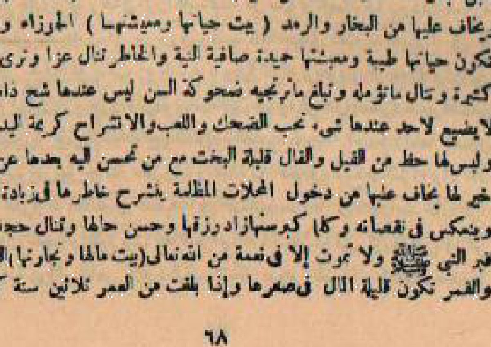

*Gambar Rajah Asli Halaman 70* — Wafaq angka pelindung berkah bagi buruj Aries kaum wanita untuk keharmonisan rumah tangga, daya tarik mahabbah, dan tolak bala sihir.

---

## HALAMAN CETAK 71 (Halaman PDF 35, sisi kiri)

**[Teks Arab Asli]**

( البرج الثانى من طوالع النساء: برج الثور والزهرة )
وصاحبة فلك الثور زهرتها الجميلة * تدل على الحلاوة واللطف والوفاء
لها الصورة الحسنة والصفات الجليلة * وتعيش فى دهرها بنعمة ورخاء
تحب الصدق وتصون الأمانات * وترزق فى عمرها بالبركات

**[Transliterasi Latin Fonetik]**

*(al-burjits-tsaanii min thawaali'un-nisaa'i  burjuts-Tsawri waz-Zuharati)*
*wa shaahibatu falak ats-Tsawri zahratahaal-jamiilata * tadullu 'alaal-halaawati wal-luthfi wal-wafaa'i*
*lahaa ash-shuuratil-hasanati wash-shifaatil-jaliilati * wa ta'iisyu fii dahrihaa bina'amatin wa rakhaa'in*
*tuhibbush-shidqu wa tashuunul-amaanaatu * wa turzaqu fii 'umruhaa bil-barakaati*

**[Terjemahan Indonesia]**

(Buruj Kedua dari Thali' Kaum Wanita: Buruj Taurus dan Penguasanya: Venus)
*Penguasa orbit Taurus bagi wanita adalah Venus sang bintang molek mempesona * Memberi pertanda tutur kata manis, kelembutan hati, dan kesetiaan janji*
*Ia dianugerahi paras rupa yang rupawan dan sifat-sifat budi pekerti yang luhur * Menjalani lembaran hidupnya dalam kenikmatan dan kemakmuran*
*Mencintai kejujuran dan menjaga amanah dengan penuh kesungguhan * Serta senantiasa dinaungi keberkahan di sepanjang rentang usianya.*

---

**[Gambar Rajah Asli Halaman 71 — Tilsm Buruj ats-Tsaur Kaum Wanita]**

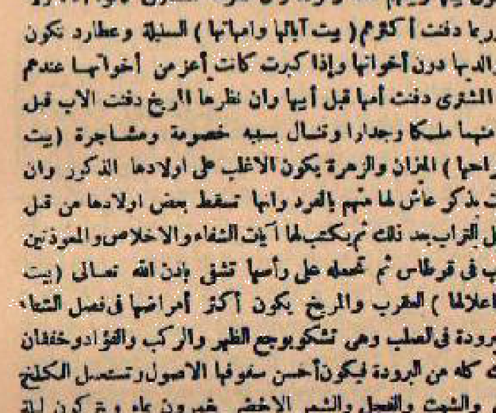

*Gambar Rajah Asli Halaman 71* — Gambar Tilsam simbolik buruj Taurus untuk Thali' Kaum Wanita: Sosok permaisuri anggun bertahta dikelilingi ornamen kemakmuran dan bunga-bunga lambang planet Venus.

---

**[Teks Arab Asli]**

( القول على طبع الطالع واختلاف الوجوه للنسوة )
قال الحكيم الفلكى: هى امرأة بيضاء اللون أو مائلة إلى الصفرة المليحة، مستديرة الوجه، كحيلة العينين، جميلة القد، رقيقة الإحساس، محبوبة عند الرجال والنساء، ولها ثلاثة وجوه.

**[Transliterasi Latin Fonetik]**

*(al-qawli 'alaa thab'uth-thaali'u wa ikhtilaafil-wujuuhi lin-niswata)*
*qaalal-hakiimul-Falakiyyu  hiya imra'atun baydhaa'ul-lawni aw maa'ilatun ilash-shifratil-maliihati, mustadiiratal-wajhu, kahiilatil-'aynayni, jamiilatal-qaddi, raqiiqatal-ihsaasi, mahbuubatan 'indar-rijaali wan-nisaa'i, wa lahaa tsalaatsatun wujuuhin *

**[Terjemahan Indonesia]**

(Uraian watak dasar thali' wanita dan pembagian tiga wajahnya)
Berkata sang ahli astrologi falak: Wanita bernaung di buruj ini umumnya berkulit putih bersih atau kuning langsat yang memikat, berwajah bulat manis, kedua matanya indah bercelak alami, berpostur tubuh proporsional elok, berperasaan halus peka, sangat disukai dan dikagumi oleh kaum pria maupun wanita; dan ia memiliki tiga wajah (wajh).

---

**[Teks Arab Asli]**

( الوجه الأول ) من نظر إليها الزهرة: تكون امرأة بارعة الجمال، محبة للغناء والطرب والزينة واللباس الحسن، مرزوقة من جهة الرجال، ذات حظ عظيم فى النكاح والسرور، والله أعلم.

**[Transliterasi Latin Fonetik]**

*(al-wajhul-awwalu  min nazhara ilayhaa az-Zuharati  takuunu imra'atun baari'atul-jamaali, mahabbatan lil-ghinaa'a wath-tharaba waz-zaynata wal-libaasal-hasana, marzuuqatan min jihatir-rijaali, dzaat hazhzhun 'azhiimun fin-nikaahi was-suruuri, wallaahu a'lamu *) **[Terjemahan Indonesia]**

(Wajah Pertama) Bagi yang dipandang oleh planet Venus: Ia menjadi wanita berparas jelita memukau, menyukai alunan musik merdu, kesenian, perhiasan indah, dan busana anggun bermartabat, memperoleh kelimpahan rezeki melalui suaminya, serta dianugerahi peruntungan asmara pernikahan yang sangat membahagiakan. Wallahu a'lam.

---

**[Teks Arab Asli]**

( الوجه الثانى ) من نظر إليها عطارد: تكون امرأة عاقلة لبيبة، فصيحة اللسان، حاذقة فى الصنائع وتدبير المنزل، تحسن الاقتصاد فى مال زوجها، وتكون مباركة فى بيتها، والله تعالى أعلم.

**[Transliterasi Latin Fonetik]**

*(al-wajhuts-tsaanii  min nazhara ilayhaa 'Uthaarida  takuunu imra'atun 'aaqilatu labiibatu, fa-shayhatal-lisaani, haadziqatan fish-shanaa'i'i wa tadbiiril-manzili, tahassunal-iqtishaadi fii maalin zawjuhaa, wa takuunu mubaarakatun fii baytuhaa, wallaahu Ta'aalaa a'lamu *) **[Terjemahan Indonesia]**

(Wajah Kedua) Bagi yang dipandang oleh planet Merkurius: Ia adalah wanita yang cerdas berwawasan luas, fasih bertutur kata santun, sangat terampil dalam berbagai kerajinan tangan dan manajemen rumah tangga, bijak mengatur keuangan keluarga; serta membawa limpahan berkah di rumahnya. Wallahu Ta'ala a'lam.

---

**[Teks Arab Asli]**

( الوجه الثالث ) من نظر إليها زحل: تكون امرأة رزينة صبورة، ذات وقار وصمت، تحسن رعاية أولادها وأهل بيتها، وتتحمل المشاق بصبر جميل، وتنال عاقبة حميدة، والله أعلم.

**[Transliterasi Latin Fonetik]**

*(al-wajhuts-tsaalitsu  min nazhara ilayhaa Zuhala  takuunu imra'atun raziinatu shubuuratin, dzaat wa qaarin wa shamtin, tahassuna ri'aayati awlaadihaa wa ahli baytuhaa, wa tatahammalul-masyaaqqu bishabri jamiili, wa tanaalu 'aaqibatu hamiidatu, wallaahu a'lamu *) **[Terjemahan Indonesia]**

(Wajah Ketiga) Bagi yang dipandang oleh planet Saturnus: Ia menjadi wanita yang tenang berwibawa dan penuh kesabaran, anggun dalam keheningan sikapnya, telaten merawat anak-anak dan keluarganya, tabah menghadapi cobaan hidup dengan kesabaran yang indah; serta memetik kesudahan hidup yang sangat terpuji. Wallahu a'lam.

---

> **STATUS BATCH 7: SELESAI** (Halaman Cetak 62–71 / Halaman PDF 31–35).
> Rajah/wafaq/tilsam batch ini telah di-crop presisi, latar putih, tersimpan di folder `rajah/`:
> `rajah_p62_satr_dalw.png`, `rajah_p62_wafaq_dalw.png`, `rajah_p63_tilsam_hut.png`, `rajah_p66_satr_hut.png`, `rajah_p66_wafaq_hut.png`, `rajah_p67_tilsam_nisa_haml.png`, `rajah_p70_wafaq_nisa_haml.png`, `rajah_p71_tilsam_nisa_tsaur.png`.

---

# BATCH 8 — HALAMAN PDF 36–40 (HALAMAN CETAK 72–81)

---

## HALAMAN CETAK 72 (Halaman PDF 36, sisi kanan)

**[Teks Arab Asli]**

( بيت حياتها ومعيشتها ) الثور والزهرة: تكون حياتها فى نعمة وخير وسعة، تنال من الرزق ما يكفيها ويفضل عنها، وتعيش فى ستر وصيانة، وتلقى المحبة والقبول عند كل من رآها، ولا تموت إلا فى حال مرضية وعيش رغيد، والله أعلم.

**[Transliterasi Latin Fonetik]**

*(baytu hayaatihaa wa ma'iisyatihaa  ats-Tsawri waz-Zuharati  takuunu hayaatihaa fii ni'matin wa khayrun wus'atin, tanaalu minar-rizqi maa yakfiihaa wa yufadhdhilu 'anhaa, wa ta'iisyu fii sitrin wa shiyaanatin, wa talaqqaal-mahabbatu wal-qabuulu 'inda kullu min ra'aahaa, wa laa tamuutu illaa fii haali maradhiyyati wa 'aysyi raghiidi, wallaahu a'lamu *) **[Terjemahan Indonesia]**

(Rumah kehidupan dan penghidupannya) Taurus dan Venus: Garis kehidupannya diliputi kenikmatan, kebajikan, dan kelapangan rezeki; tercukupi segala kebutuhannya bahkan senantiasa berlebih; hidup dalam naungan pemeliharaan dan kehormatan yang terjaga; menuai simpati kasih sayang dan penerimaan hangat dari siapa saja yang berinteraksi dengannya; serta tidak berpulang melainkan dalam kondisi yang diridhai Allah dan kemakmuran hidup. Wallahu a'lam.

---

**[Teks Arab Asli]**

( بيت مالها وتجارتها ) الجوزاء وعطارد: تكتسب الأموال من التجارة والصنائع اليدوية المتقنة كالتطريز والحياكة وبيع الأقمشة والحلي، ويبارك الله فى مكاسبها، وتجمع مالا كثيرا تدخره لنوائب الدهر، والله أعلم.

**[Transliterasi Latin Fonetik]**

*(baytu maalihaa wa tijaaratihaa  al-Jawzaa'i wa 'Uthaarida  taktasibul-amwaali minat-tijaarati wash-shanaa'i'il-yadawiyyatil-mutqanati kat-tathriizi wal-hiyaakati wa bay'il-aqmisyati wal-halliyyi, wa yubaariku Allaahi fii makaasibihaa, wa tajma'u maalan katsiiran taddakhiruhu li-nawaa'ibid-dahri, wallaahu a'lamu *) **[Terjemahan Indonesia]**

(Rumah harta dan perniagaannya) Gemini dan Merkurius: Ia meraih penghasilan dari aktivitas perniagaan dan karya seni kerajinan tangan yang presisi seperti bordir, menjahit busana, perniagaan tekstil dan perhiasan; Allah melimpahkan keberkahan dalam setiap transaksinya; serta mampu menghimpun tabungan aset yang kokoh untuk masa depannya. Wallahu a'lam.

---

**[Teks Arab Asli]**

( بيت إخوتها وأخواتها ) السرطان والقمر: يكون لها إخوة وأخوات ذكورا وإناثا، ويكون بينها وبينهم مودة وتعاطف، وتنال منهم برا وإحسانا، وتكون هى أرفعهم قدرا وأحبهم إلى قلوبهم، والله تعالى أعلم.

**[Transliterasi Latin Fonetik]**

*(baytu ikhwatihaa wa akhawaatihaa  as-Sarathaani wal-Qamari  yakuunu lahaa ikhwatin wa akhawaatin dzukuuran wa inaatsan, wa yakuunu baynahaa wa baynahum mawaddatan wa ta'aathufa, wa tanaalu minhum barran wa ahsaanan, wa takuunu hiya arafa'ahum qadraa wa ahabbahum ilaa qaluubihim, wallaahu Ta'aalaa a'lamu *) **[Terjemahan Indonesia]**

(Rumah saudara-saudaranya) Cancer dan Bulan: Ia memiliki saudara kandung laki-laki dan perempuan; ikatan persaudaraan di antara mereka diliputi kehangatan kasih sayang dan rasa saling peduli; memperoleh perlakuan baik dan penghormatan dari saudara-saudaranya; bahkan dialah yang paling terpandang martabatnya dan paling disayangi di hati mereka. Wallahu Ta'ala a'lam.

---

**[Teks Arab Asli]**

( بيت آبائها وأمهاتها ) الأسد والشمس: تنال من والديها عطفا عظيما ورعاية حسنة، ويكون أبوها محبا لها مكرما لشأنها، وتدفن أباها قبل أمها، وترث منهما مالا حلالا طيبا، والله أعلم.

**[Transliterasi Latin Fonetik]**

*(baytu aabaa'ihaa wa ummahaatihaa  al-Asadi wasy-Syamsi  tanaalu min waalidayhaa 'athfan 'azhiiman wa ri'aayata hasanatun, wa yakuunu abuuhaa muhibban lahaa mukarraman li-sya'anahaa, wa tadfinu abaahaa qabla ummihaa, wa taritsu minhumaa maalan halaalan thayyiban, wallaahu a'lamu *) **[Terjemahan Indonesia]**

(Rumah orang tuanya) Leo dan Matahari: Ia mendapatkan curahan kasih sayang yang amat dalam dan pengasuhan yang mulia dari kedua orang tuanya; ayahnya sangat bangga dan memuliakan kedudukannya; memakamkan ayahnya lebih dahulu sebelum ibunya; serta mewarisi dari keduanya harta peninggalan yang halal lagi berkah. Wallahu a'lam.

---

**[Teks Arab Asli]**

( بيت أولادها وأفراحها ) السنبلة وعطارد: ترزق بأولاد مباركين نجباء، ويكون أكثر أولادها الإناث، وينالها من برهم ما تقر به عينها، ويفرح قلبها بنجاحهم وصلاحهم، والله أعلم.

**[Transliterasi Latin Fonetik]**

*(baytu awlaadihaa wa afraahihaa  as-Sunbulati wa 'Uthaarida  turzaqu bi-awlaadin mubaarakiina nujabaa'i, wa yakuunu aktsaru awlaadihaal-inaatsa, wiinaalahaa min barrihim maa tuqirru bihi 'aynahaa, wa yafrahu qalbuhaa binujjaahihim wa shulaahihim, wallaahu a'lamu *) **[Terjemahan Indonesia]**

(Rumah anak-anak dan kebahagiaannya) Virgo dan Merkurius: Ia dianugerahi anak-anak yang berakhlak mulia dan cerdas; mayoritas keturunannya adalah anak perempuan; ia memetik bakti tulus dari anak-anaknya yang menjadi penyejuk pandangan matanya; serta hatinya senantiasa berbunga-bunga melihat kesuksesan dan kesalehan mereka. Wallahu a'lam.

---

**[Teks Arab Asli]**

( بيت أمراضها وأسقامها ) الميزان والزهرة: تصيبها أمراض الرطوبة والرياح فى المفاصل ووجع الحلق والرقبة، فلتستعمل شراب العسل بالزنجبيل، وتدهن موضع الألم بزيت الورد والكافور، وتحذر من الهواء البارد، والله أعلم.

**[Transliterasi Latin Fonetik]**

*(baytu amraadhihaa wa asqaamihaa  al-Miizaani waz-Zuharati  tushiibuhaa amraadhin ar-ruthuubati war-riyaahi fil-mafaashili wa waja'il-halqi war-raqabati, fa-latasta'milu syaraabul-'asali biz-zanjabiili, wa tadhinna mawdhi'al-alami bizaytil-wardi wal-kaafuuri, wa tuhadzdziru minal-hawaa'il-baaridi, wallaahu a'lamu *) **[Terjemahan Indonesia]**

(Rumah penyakit dan keluhan fisiknya) Libra dan Venus: Ia rentan mengalami keluhan pegal linu persendian akibat kelembapan tubuh, nyeri tenggorokan, dan leher kaku; maka dianjurkan rutin meminum madu jahe hangat; mengoleskan minyak mawar dan kapur barus alami pada area yang terasa sakit; serta menghindari hembusan angin malam yang dingin. Wallahu a'lam.

---

## HALAMAN CETAK 73 (Halaman PDF 36, sisi kiri)

**[Teks Arab Asli]**

( بيت أزواجها وفراشها ) العقرب والمريخ: تتزوج برجل شجاع ذى بأس ونجدة، وربما وقع بينهما بعض الغيرة والحدة فى الكلام ثم يعودان إلى الصفاء والمودة، ويكون زوجها محبا لها حريصا على كرامتها، وتعيش معه فى عز وسرور، والله أعلم.

**[Transliterasi Latin Fonetik]**

*(baytu azwaajihaa wa firaasyihaa  al-'Aqrabi wal-Mirriikhi  tatazawwaju bi-rajulin syajaa'i dzaa bi'ussin wa najdatin, wa rubbamaa wa q'i baynahumaa ba'dhul-ghayrati wal-haddati fil-kalaami tsumma ya'uudaanni ilash-shafaa'i wal-mawaddati, wa yakuunu zawjuhaa muhibban lahaa hariishan 'alaa karaamatihaa, wa ta'iisyu ma'ahu fii 'izzin wa suruurin, wallaahu a'lamu *) **[Terjemahan Indonesia]**

(Rumah jodoh pernikahan dan peraduannya) Scorpio dan Mars: Ia dipersunting oleh seorang pria pemberani yang berjiwa ksatria dan sigap menolong; terkadang timbul riak kecemburuan atau ketegasan dalam berbicara namun segera kembali mencair dalam kelembutan dan kemesraan; suaminya sangat menyayanginya dan sangat menjaga kehormatan istrinya; serta ia menjalani kehidupan bersamanya dalam kemuliaan dan kebahagiaan. Wallahu a'lam.

---

**[Teks Arab Asli]**

( بيت خوفها وموتها ) القوس والمشترى: يخاف عليها من علل الرطوبة وأمراض الصدر، وأعوام الخطر عندها: ثمانى سنين، وست عشرة سنة، وأربع وثلاثون سنة، وثمان وأربعون سنة، وستون سنة، فان سلمت منها عاشت إلى خمس وثمانين سنة، والله أعلم.

**[Transliterasi Latin Fonetik]**

*(baytu khawfihaa wa mawtihaa  al-Qawsi wal-Musytarii  yukhaafu 'alayhaa min 'ilalir-ruthuubati wa amraadhin ash-shadri, wa a'waamal-khuthuri 'indahaa  tsamaanii siniina, wa sitta 'asyrata sanatin, wa arba'i wa tsalaatsuuna sanatin, wa tsamaanun wa arba'uuna sanatin, sittuuna sanatin, fa-in salimat minhaa 'aasyat ilaa khamsi wa tsamaaniina sanatin, wallaahu a'lamu *) **[Terjemahan Indonesia]**

(Rumah masa rawan dan krisis kesehatannya) Sagittarius dan Yupiter: Dikhawatirkan atasnya gangguan pernapasan dada akibat udara dingin basah; tahun-tahun rawan dalam siklus usianya adalah usia 8 tahun, 16 tahun, 34 tahun, 48 tahun, dan 60 tahun; jika ia selamat dari masa krisis tersebut, umurnya akan mencapai 85 tahun dalam keadaan sehat afiat. Wallahu a'lam.

---

**[Teks Arab Asli]**

( بيت أسفارها وحركاتها ) الجدى وزحل: تكون أسفارها قليلة مأمونة، وتسافر إلى البلاد المجاورة فى زيارة الأهل والأقارب أو لأداء الفرائض الدينية، ويكون سفرها مقرونا بالسلامة والراحة، والله أعلم.

**[Transliterasi Latin Fonetik]**

*(baytu asfaarihaa wa harakaatihaa  al-Jadyi wa Zuhala  takuunu asfaarihaa qaliilata ma'muunata, wa tusaafiru ilal-bilaadil-mujaawirati fii ziyaaratil-ahli wal-aqaaribi aw li-adaa'ul-faraa'idhid-diiniyyati, wa yakuunu safarihaa maqruunan bis-sullaamati war-raahati, wallaahu a'lamu *) **[Terjemahan Indonesia]**

(Rumah perjalanan dan pergerakannya) Capricorn dan Saturnus: Aktivitas perjalanannya jarang dan senantiasa terjaga keamanannya; bepergian ke kota-kota sekitar untuk menyambung silaturahim dengan keluarga kerabat atau menunaikan rukun ibadah keagamaan; serta perjalanannya senantiasa diliputi kenyamanan dan keselamatan. Wallahu a'lam.

---

**[Teks Arab Asli]**

( بيت عزها وشرفها ) الدلو وزحل: تنال رفعة ومكانة سامية بين نساء قومها بحسن خلقها وعفتها، وتكون مسموعة القول فى بيتها، محترمة عند الأقارب والأباعد، والله أعلم.

**[Transliterasi Latin Fonetik]**

*(baytu 'izzihaa wa syarafihaa  ad-Dalwi wa Zuhala  tanaalu raf'atun wa makaanatu saammiyyatu bayna nisaa'i qawmihaa bi-husni khalqihaa wa 'iffatihaa, wa takuunu masmuu'atul-qawli fii baytuhaa, muhtaramata 'indal-aqaaribi wal-abaa'idi, wallaahu a'lamu *) **[Terjemahan Indonesia]**

(Rumah kemuliaan dan kedudukan terhormatnya) Aquarius dan Saturnus: Ia meraih derajat kemuliaan yang tinggi di antara kaum wanita di lingkungannya berkat keindahan budi pekerti dan kesucian dirinya; perkataannya didengar dalam urusan keluarga; serta menuai penghormatan tulus dari kerabat dekat maupun masyarakat umum. Wallahu a'lam.

---

**[Teks Arab Asli]**

( بيت رجائها وآمالها ) الحوت والمشترى: يبلغها الله ما ترجوه من تمام النعمة وصلاح الذرية وهناء العيش، وتعيش فى راحة بال وسلام، وترزق حسن الخاتمة، والله أعلم.

**[Transliterasi Latin Fonetik]**

*(baytu rajaa'ihaa wa aamaalihaa  al-Huuti wal-Musytarii  yablughuhaa Allaahi maa tarjuuhu min tamaamin-na'amati wa shalaahin adz-dzarriyyati wa hanaa'il-'aysyi, wa ta'iisyu fii raahati baalin wa sullaamin, wa turzaqu hasanul-khaatimati, wallaahu a'lamu *) **[Terjemahan Indonesia]**

(Rumah harapan dan dambaannya) Pisces dan Yupiter: Allah menyampaikan dirinya pada apa yang ia dambakan berupa kesempurnaan nikmat, kesalehan anak cucunya, dan ketentraman hidup; menjalani hari-harinya dalam kedamaian jiwa; serta dianugerahi akhir hidup yang husnul khatimah. Wallahu a'lam.

---

**[Teks Arab Asli]**

( بيت أعدائها وحسادها ) الحمل والمريخ: أعداؤها من بعض الحواسد والنمامات اللاتى يغتن من جمالها وحسن حالها، ويكفيها الله كيدهن ويجعل تدبيرهن فى تدميرهن، والله سبحانه أعلم.

**[Transliterasi Latin Fonetik]**

*(baytu a'daa'ihaa wa hussaadihaa  al-Hamali wal-Mirriikhi  a'daa'uhaa min ba'dhul-hawaasidi wan-nammaamaatil-laatii yaghuttanna min jamaalihaa wa husni haalihaa, wa yakfiihaa Allaahi kaydihinna wa yaj'alu tadbiirahunna fii tadmiirihinna, wallaahu Subhaanahu a'lamu *) **[Terjemahan Indonesia]**

(Rumah musuh dan para pendengkinya) Aries dan Mars: Musuh-musuhnya hanyalah segelintir wanita pendengki dan penyebar desas-desus yang iri hati melihat kecantikan serta kemapanan hidupnya; namun Allah mencukupkan perlindungan dari tipu muslihat mereka dan menjadikan rekayasa jahat itu berbalik kepada mereka sendiri. Wallahu Subhanahu wa Ta'ala a'lam.

---

## HALAMAN CETAK 74 (Halaman PDF 37, sisi kanan)

**[Teks Arab Asli]**

( ولصاحبة هذا البرج من أشكال الرمل شكل العتبة الخارجة )
قال الحكيم: اعلمى أيتها السائلة أن شكل العتبة الخارجة يدل على الخروج من الضيق إلى السعة، والتخلص من الأحزان والهموم، وبلوغ الراحة بعد التعب، فعليك بالصبر والتوكل على الله، واسمعى ما قيل:
خرجت من الضيق إلى الفرج * فاحمدى الله على ذا النهج
ولا تخافى من صروف الزمان * فالله يحميك بذاك الأمان

**[Transliterasi Latin Fonetik]**

*(wa li-shaahibati haadzaal-burji min asykaalir-ramli syaklul-'atabatil-khaarijati)*
*qaalal-hakiimu  i'lamii ayyatuhas-saa'ilatu an syaklul-'atabatil-khaarijati yadullu 'alaal-khuruuji minadh-dhayyiqi ilas-sa'ati, wat-takhallusha minal-ahzaani waalahamuum, wa buluughar-raahati ba'dat-ta'abi, fa'alayka bish-shabri wat-tawakkuli 'alaa Allaahi, wa isma'ii maa qiila:*
*kharrajat minadh-dhayyiqi ilal-farji * faahamadaa Allaahi 'alaa dzaa an-nahji*
*wa laa takhaafii min shuruufiz-zamaani * fa-Allaahi yahmiika badzaak al-amaani*

**[Terjemahan Indonesia]**

(Bagi pemilik buruj wanita ini dari bentuk-bentuk ilmu raml adalah bentuk *al-'Utbah al-Kharijah*)
Berkata sang ahli hikmah: Ketahuilah wahai wanita penanya, sesungguhnya lambang al-'Utbah al-Kharijah menunjukkan keluarnya dirimu dari kesempitan menuju kelapangan rezeki, terbebasnya jiwa dari belenggu duka nestapa, dan teraihnya ketentraman setelah letih berusaha; maka berpegang teguhlah pada kesabaran dan tawakal kepada Allah; simaklah bait syair bijak ini:
*Engkau telah keluar dari kesempitan menuju jalan kelapangan * Maka pujilah Allah atas bimbingan jalan yang terang ini*
*Janganlah cemas menghadapi gejolak pasang surutnya zaman * Karena Allah senantiasa melindungimu dengan benteng keamanan yang kokoh.*

---

**[Gambar Rajah Asli Halaman 74 — Wafaq ats-Tsaur Kaum Wanita]**

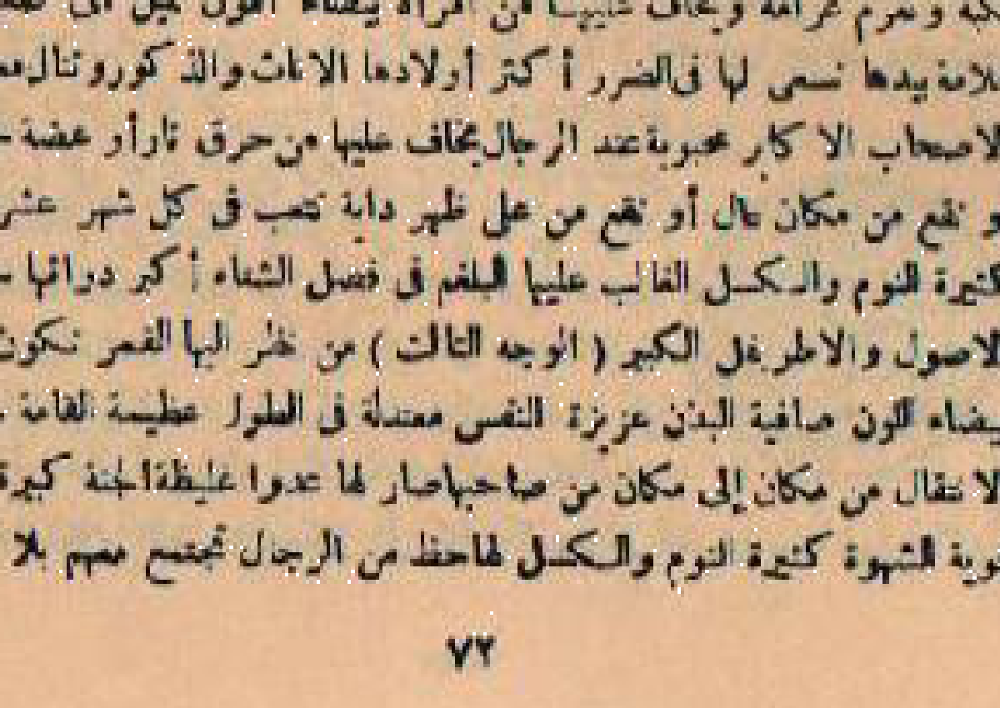

*Gambar Rajah Asli Halaman 74* — Wafaq angka keramat pelindung buruj Taurus bagi kaum wanita untuk keselamatan lahir batin, penarik rezeki, dan ketentraman rumah tangga.

---

## HALAMAN CETAK 75 (Halaman PDF 37, sisi kiri)

**[Teks Arab Asli]**

( البرج الثالث من طوالع النساء: برج الجوزاء وعطارد )
وصاحبة فلك الجوزاء عطاردها الفصيح * يدل على الفطانة والبيان والذكاء
لها المنطق العذب واللسان الصريح * وتلقى فى دهرها المودة والوفاء
تحب الصنائع والعلوم اللطيفة * وتعيش فى قومها بالعفة الشريفة

**[Transliterasi Latin Fonetik]**

*(al-burjits-tsaalitsu min thawaali'un-nisaa'i  burjul-Jawzaa'i wa 'Uthaarida)*
*wa shaahibatu falak al-Jawzaa'i 'uthaaridahaal-fashiiha * yadullu 'alaal-fathaanati wal-bayaani wadz-dzakaa'i*
*lahaal-manthiqil-'adzba wal-lisaanash-shariiha * wa talaqqaa fii dahrihaal-mawaddata wal-wafaa'a*
*tuhibbush-shanaa'i'u wal-'uluumul-lathiifatu * wa ta'iisyu fii qawmihaa bil-'iffatisy-syariifati*

**[Terjemahan Indonesia]**

(Buruj Ketiga dari Thali' Kaum Wanita: Buruj Gemini dan Penguasanya: Merkurius)
*Penguasa orbit Gemini bagi wanita adalah Merkurius sang bintang fasih bijaksana * Memberi petunjuk pada ketajaman akal nalar, keindahan retorika, dan kecerdasan brilian*
*Ia dianugerahi gaya tutur kata yang manis memikat dan keterusterangan yang santun * Memetik ketulusan cinta dan kesetiaan di sepanjang perjalanan hidupnya*
*Menyukai kerajinan tangan bernilai seni tinggi dan cabang-cabang ilmu yang halus * Serta menjalani kehidupannya di tengah masyarakat dengan kesucian martabat yang mulia.*

---

**[Gambar Rajah Asli Halaman 75 — Tilsm Buruj al-Jauza' Kaum Wanita]**

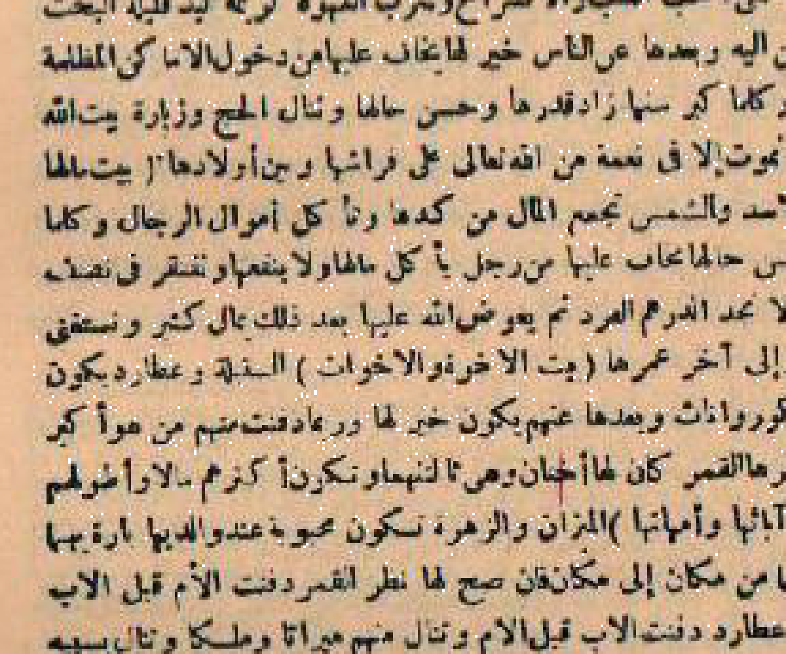

*Gambar Rajah Asli Halaman 75* — Gambar Tilsam simbolik buruj Gemini untuk Thali' Kaum Wanita: Dua sosok dewi kembar bersayap melambangkan kecerdasan komunikasi, keharmonisan relasi, dan perlindungan planet Merkurius.

---

**[Teks Arab Asli]**

( القول على طبع الطالع واختلاف الوجوه للنسوة )
قال الحكيم الفلكى: هى امرأة بيضاء اللون مع شقرة خفيفة، طويلة القامة، رشيقة القد، حسنة الصوت، سريعة الفهم، خفيفة الحركة، محبوبة عند الأكابر، ولها ثلاثة وجوه.

**[Transliterasi Latin Fonetik]**

*(al-qawli 'alaa thab'uth-thaali'u wa ikhtilaafil-wujuuhi lin-niswata)*
*qaalal-hakiimul-Falakiyyu  hiya imra'atun baydhaa'ul-lawni ma'a syuqrati khufayfatin, thawiilatal-qaamati, rasyiiqatal-qaddi, hasanatun ash-shawti, sarii'atal-fahmi, khafiifatal-harakati, mahbuubatan 'indal-akaabiri, wa lahaa tsalaatsatun wujuuhin *

**[Terjemahan Indonesia]**

(Uraian watak dasar thali' wanita dan pembagian tiga wajahnya)
Berkata sang ahli ilmu falak: Wanita yang lahir di bawah naungan buruj Gemini berparas putih bersih berkilau pirang cerah, bertubuh semampai anggun, proporsional gerak-geriknya, merdu suaranya, sangat cepat menangkap maksud pembicaraan, lincah berdaya guna, sangat disayangi di kalangan orang-orang terpandang; dan ia memiliki tiga wajah (wajh).

---

**[Teks Arab Asli]**

( الوجه الأول ) من نظر إليها عطارد: تكون امرأة كاتبة حاذقة، ذات لسان فصيح وبلاغة فائقة، تتقن تدبير الأمور بدقة، وتنال حظا وافرا من التجارة والبيع والشراء، والله أعلم.

**[Transliterasi Latin Fonetik]**

*(al-wajhul-awwalu  min nazhara ilayhaa 'Uthaarida  takuunu imra'atun kaatibatu haadziqatu, dzaat lisaani fa-shiihi wa balaaghatin fa-a'iqatin, tutqinu tadbiirul-umuuri bidiqqatin, wa tanaalu hazhzhan wa afiran minat-tijaarati wal-bay'i wasy-syiraa'i, wallaahu a'lamu *) **[Terjemahan Indonesia]**

(Wajah Pertama) Bagi yang dipandang oleh planet Merkurius: Ia menjadi wanita yang sangat cerdas, mahir dalam tata tulis dan komunikasi publik, memiliki kefasihan lisan dan daya persuasi yang luar biasa, teliti mengelola berbagai urusan, serta beruntung besar dalam bidang perniagaan komersial. Wallahu a'lam.

---

**[Teks Arab Asli]**

( الوجه الثانى ) من نظر إليها الزهرة: تكون امرأة ظريفة حسناء، محبة للملابس الأنيقة والزينة والعطور، ذات دلال وحسن معاشرة، يحبها زوجها حبا جما، وتعيش فى دلال ونعمة، والله تعالى أعلم.

**[Transliterasi Latin Fonetik]**

*(al-wajhuts-tsaanii  min nazhara ilayhaa az-Zuharati  takuunu imra'atun zhariifatu hasnaa'i, mahabbatan lil-malaabisal-aniiqata waz-zaynata wal-'uthuura, dzaat dalaalin wa husni mu'aasyaratin, yuhibbuhaa zawjuhaa habbaa jamman, wa ta'iisyu fii dalaalin wa ni'matin, wallaahu Ta'aalaa a'lamu *) **[Terjemahan Indonesia]**

(Wajah Kedua) Bagi yang dipandang oleh planet Venus: Ia berpenampilan sangat modis dan mempesona, gemar mengenakan busana anggun, perhiasan berkilau, dan parfum harum, memiliki daya pikat manja yang memikat dalam pergaulan, sangat disayangi suaminya dengan cinta mendalam, serta menjalani hari-harinya dalam kemewahan dan kebahagiaan. Wallahu Ta'ala a'lam.

---

**[Teks Arab Asli]**

( الوجه الثالث ) من نظر إليها الشمس: تكون امرأة ذات هيبة ووقار، صبيحة الوجه، كريمة اليد، تحسن رعاية الضيوف وإعانة المحتاجين، وتنال شرفا وجاها فى قومها، والله أعلم.

**[Transliterasi Latin Fonetik]**

*(al-wajhuts-tsaalitsu  min nazhara ilayhaa asy-Syamsi  takuunu imra'atun dzaat haybatin wa waqaarin, shabiihatal-wajhu, kariimatal-yadi, tahassuna ri'aayatidh-dhuyuufi wa i'aanatil-muhtaajiina, wa tanaalu syarafan wa jaahan fii qawmihaa, wallaahu a'lamu *) **[Terjemahan Indonesia]**

(Wajah Ketiga) Bagi yang dipandang oleh Matahari: Ia memancarkan karisma wibawa kepemimpinan yang anggun, berwajah berseri terang benderang, murah hati tangannya, sangat piawai memuliakan tamu dan menolong orang-orang yang kesusahan, serta meraih kehormatan dan status terpandang di tengah kaumnya. Wallahu a'lam.

---

## HALAMAN CETAK 76 (Halaman PDF 38, sisi kanan)

**[Teks Arab Asli]**

( بيت حياتها ومعيشتها ) الجوزاء وعطارد: تكون حياتها متقلبة فى الصغر بالانتقال من مكان إلى مكان، ثم تستقر أحوالها فى كبرها على أحسن حال، وترزق معيشة طيبة واسعة، وتكفى مؤنتها فى عزة وشرف، ولا تموت إلا فى نعمة وسلام، والله أعلم.

**[Transliterasi Latin Fonetik]**

*(baytu hayaatihaa wa ma'iisyatihaa  al-Jawzaa'i wa 'Uthaarida  takuunu hayaatihaa mutaqallibatun fish-shighari bil-intiqaali min makaanin ilaa makaanin, tsumma tastaqirru ahwaaluhaa fii kibarihaa 'alaa ahsanu haali, wa turzaqu ma'iisyatu thiibatin waasi'atan, wa tukfaa mu'anatuhaa fii 'izzatin wa syarafin, wa laa tamuutu illaa fii ni'matin wa sullaamin, wallaahu a'lamu *) **[Terjemahan Indonesia]**

(Rumah kehidupan dan penghidupannya) Gemini dan Merkurius: Fase kehidupannya di masa muda kerap diwarnai perpindahan dari satu tempat ke tempat lain; kemudian urusan hidupnya menjadi sangat mapan di usia matang; dianugerahi penghidupan yang lapang dan menyenangkan; tercukupi segala kebutuhannya dalam kehormatan martabat; serta tidak berpulang melainkan dalam limpahan nikmat dan keselamatan dari Allah. Wallahu a'lam.

---

**[Teks Arab Asli]**

( بيت مالها وتجارتها ) السرطان والقمر: تكتسب الأموال من التجارات الحذقة والمشاركات الرابحة، ويكون لها حظ فى شراء الأقمشة الفاخرة والعقارات، ويبارك الله فى كسبها، والله أعلم.

**[Transliterasi Latin Fonetik]**

*(baytu maalihaa wa tijaaratihaa  as-Sarathaani wal-Qamari  taktasibul-amwaali minat-tijaaraatil-hadzaqati wal-musyaarakaatir-raabihati, wa yakuunu lahaa hazhzhun fii syiraa'il-aqmisyatil-faakhirati wal-'aqaaraati, wa yubaariku Allaahi fii kasbihaa, wallaahu a'lamu *) **[Terjemahan Indonesia]**

(Rumah harta dan perniagaannya) Cancer dan Bulan: Ia mendulang kekayaan dari strategi bisnis yang cerdik dan kemitraan usaha yang menguntungkan; beruntung dalam kepemilikan kain-kain sutra bernilai tinggi dan investasi properti; serta Allah melimpahkan keberkahan dalam setiap rezekinya. Wallahu a'lam.

---

**[Teks Arab Asli]**

( بيت إخوتها وأخواتها ) الأسد والشمس: يكون لها إخوة يعزونها ويكرمونها، وتكون هى محبوبة عندهم، ويقفون بجانبها فى الشدائد، ولا ترى منهم إلا خيرا ومحبة، والله تعالى أعلم.

**[Transliterasi Latin Fonetik]**

*(baytu ikhwatihaa wa akhawaatihaa  al-Asadi wasy-Syamsi  yakuunu lahaa ikhwatin ya'zuunahaa wa yukarrimuunahaa, wa takuunu hiya mahbuubatan 'indahum, wa yaqifuuna bijaanibihaa fisy-syadaa'idi, wa laa taraa minhum illaa khayran wa mahabbatan, wallaahu Ta'aalaa a'lamu *) **[Terjemahan Indonesia]**

(Rumah saudara-saudaranya) Leo dan Matahari: Ia memiliki saudara kandung yang sangat memuliakan dan menghormati dirinya; ia menjadi sosok kesayangan di tengah keluarga; mereka selalu siap membela dan mendampinginya saat menghadapi kesulitan; serta ia tidak melihat dari mereka melainkan kebaikan dan kasih sayang tulus. Wallahu Ta'ala a'lam.

---

**[Teks Arab Asli]**

( بيت آبائها وأمهاتها ) السنبلة وعطارد: تنال من والديها برا وتربية صالحة، ويكون والدها ناصحا لها مشفقا عليها، وتدفن أمها قبل أبيها، وترث منهما مالا وبركة، والله أعلم.

**[Transliterasi Latin Fonetik]**

*(baytu aabaa'ihaa wa ummahaatihaa  as-Sunbulati wa 'Uthaarida  tanaalu min waalidayhaa barran wa tarbiyata shaalihata, wa yakuunu wad-dahaa naashihan lahaa musyfiqan 'alayhaa, wa tadfinu ummihaa qabla abiihaa, wa taritsu minhumaa maalan wa barakatin, wallaahu a'lamu *) **[Terjemahan Indonesia]**

(Rumah orang tuanya) Virgo dan Merkurius: Ia memetik limpahan kasih sayang dan pendidikan budi pekerti yang luhur dari kedua orang tuanya; ayahnya selalu menjadi penasihat setia yang menyayanginya; memakamkan ibunya lebih dahulu sebelum ayahnya; serta mewarisi dari keduanya harta dan doa keberkahan. Wallahu a'lam.

---

**[Teks Arab Asli]**

( بيت أولادها وأفراحها ) الميزان والزهرة: ترزق بأولاد ذكورا وإناثا، ويكون أولادها أصحاب جمال وفطنة، وتنال منهم فرحا وسرورا، ويبرز منهم من ينال جاها ومرتبة حسنة، والله أعلم.

**[Transliterasi Latin Fonetik]**

*(baytu awlaadihaa wa afraahihaa  al-Miizaani waz-Zuharati  turzaqu bi-awlaadin dzukuuran wa inaatsan, wa yakuunu awlaadihaa ashhaabu jamaalin wa fathinatin, wa tanaalu minhum fa-rahan wa suruuran, wa yubrizu minhum min yanaalu jaahaa wa martabatu hasanatun, wallaahu a'lamu *) **[Terjemahan Indonesia]**

(Rumah anak-anak dan kebahagiaannya) Libra dan Venus: Ia dianugerahi putra dan putri yang rupawan dan cerdas; ia merasakan kegembiraan dan kebanggaan yang mendalam atas mereka; di antara anak-anaknya akan ada yang meraih martabat kedudukan yang luhur di masyarakat. Wallahu a'lam.

---

**[Teks Arab Asli]**

( بيت أمراضها وأسقامها ) العقرب والمريخ: تصيبها أمراض الصداع العارض وأوجاع الصدر والحلق والبرد فى الأطراف، فلتستعمل مشروب النعناع والزنجبيل بالعسل، وتحذر من التعرض للرياح العاصفة، والله أعلم.

**[Transliterasi Latin Fonetik]**

*(baytu amraadhihaa wa asqaamihaa  al-'Aqrabi wal-Mirriikhi  tushiibuhaa amraadhin ash-shudaa'il-'aaridhi wa awjaa'ish-shadri wal-halqi wal-bardi fil-athraafi, fa-latasta'milu masyruubun-na'naa'i waz-zanjabiili bil-'asali, wa tuhadzdziru minat-ta'arrudhi lir-riyaahal-'aashifata, wallaahu a'lamu *) **[Terjemahan Indonesia]**

(Rumah penyakit dan keluhan fisiknya) Scorpio dan Mars: Ia rentan mengalami pusing kepala periodik, sesak ringan di dada, radang tenggorokan, dan dingin pada ujung jari; maka dianjurkan rutin meminum seduhan daun mint dan jahe hangat bermadu; serta menghindari terpaan angin kencang secara langsung. Wallahu a'lam.

---

## HALAMAN CETAK 77 (Halaman PDF 38, sisi kiri)

**[Teks Arab Asli]**

( بيت أزواجها وفراشها ) القوس والمشترى: تتزوج برجل صالح كريم من أهل العلم أو التجارة، يكون محبا لها مكرما لعشرتها، وتعيش معه فى هناء واستقرار، ويكون بيتهما مجمعا للخير والبركة، والله أعلم.

**[Transliterasi Latin Fonetik]**

*(baytu azwaajihaa wa firaasyihaa  al-Qawsi wal-Musytarii  tatazawwaju bi-rajulin shaalihi kariimi min ahlil-'ilmi aw at-tijaarati, yakuunu muhibban lahaa mukarraman li-'asysyarathaa, wa ta'iisyu ma'ahu fii hanaa'in wa istiqraarin, wa yakuunu baytahumaa majma'an lil-khayra wal-barakata, wallaahu a'lamu *) **[Terjemahan Indonesia]**

(Rumah jodoh pernikahan dan peraduannya) Sagittarius dan Yupiter: Ia dipersunting oleh seorang pria saleh nan dermawan dari kalangan terpelajar atau saudagar sukses; suaminya sangat mencintai dan memperlakukannya dengan penuh kemuliaan; mereka membina rumah tangga dalam ketentraman dan kedamaian; serta rumah mereka menjadi muara limpahan kebajikan dan keberkahan. Wallahu a'lam.

---

**[Teks Arab Asli]**

( بيت خوفها وموتها ) الجدى وزحل: يخاف عليها من علل الرطوبة وأمراض العظام، وأعوام الخطر عندها: تسع سنين، وثمانى عشرة سنة، وسبع وثلاثون سنة، وخمسون سنة، وسبعون سنة، فان سلمت منها امتد عمرها إلى تسعين سنة، والله أعلم.

**[Transliterasi Latin Fonetik]**

*(baytu khawfihaa wa mawtihaa  al-Jadyi wa Zuhala  yukhaafu 'alayhaa min 'ilalir-ruthuubati wa amraadhin al-'izhaama, wa a'waamal-khuthuri 'indahaa  tasa'u siniina, watsamaan 'asyrata sanatin, wa sab'i wa tsalaatsuuna sanatin, khamsuuna sanatin, sab'uuna sanatin, fa-in salimat minhaa imtadda 'umruhaa ilaa tis'iina sanatin, wallaahu a'lamu *) **[Terjemahan Indonesia]**

(Rumah masa rawan dan krisis kesehatannya) Capricorn dan Saturnus: Dikhawatirkan atasnya keluhan kelembapan tulang persendian; tahun-tahun rawan dalam siklus kehidupannya adalah usia 9 tahun, 18 tahun, 37 tahun, 50 tahun, dan 70 tahun; jika ia berhasil melaluinya dengan selamat, usianya akan berlanjut hingga 90 tahun. Wallahu a'lam.

---

**[Teks Arab Asli]**

( بيت أسفارها وحركاتها ) الدلو وزحل: تكون أسفارها كثيرة فى التجارة والزيارات الميمونة، وتسافر إلى البلاد البعيدة بصحبة زوجها، وتنال فى أسفارها راحة وفوائد جزيلة، والله أعلم.

**[Transliterasi Latin Fonetik]**

*(baytu asfaarihaa wa harakaatihaa  ad-Dalwi wa Zuhala  takuunu asfaarihaa katsiiratun fit-tijaarati waz-ziyaaraatil-maymuunati, wa tusaafiru ilal-bilaadil-ba'iidati bishuhbati zawjuhaa, wa tanaalu fii asfaarihaa raahatan wa fawaa'ida jaziilata, wallaahu a'lamu *) **[Terjemahan Indonesia]**

(Rumah perjalanan dan pergerakannya) Aquarius dan Saturnus: Aktivitas perjalanannya cukup dinamis untuk urusan niaga dan kunjungan silaturahim yang membawa berkah; mendampingi suaminya bepergian ke kota-kota yang jauh; serta memetik kenyamanan dan faedah-faedah berharga selama musafir. Wallahu a'lam.

---

**[Teks Arab Asli]**

( بيت عزها وشرفها ) الحوت والمشترى: تنال شرفا ومكانة رفيعة بين النساء بعقلها وحسن تدبيرها، وتكون مقبولة الكلمة، محترمة الجانب، وتنال ثناء حسنا فى مجالس النساء، والله أعلم.

**[Transliterasi Latin Fonetik]**

*(baytu 'izzihaa wa syarafihaa  al-Huuti wal-Musytarii  tanaalu syarafan wa makaanata rafii'ata baynan-nisaa'i bi'aqlihaa wa husni tadbiirihaa, wa takuunu maqbuulatul-kalimati, muhtaramatal-jaanibi, wa tanaalu tsanaa'a hissinaa fii mujaalisun-nisaa'i, wallaahu a'lamu *) **[Terjemahan Indonesia]**

(Rumah kemuliaan dan status sosialnya) Pisces dan Yupiter: Ia meraih kehormatan dan kedudukan tinggi di tengah kaum wanita berkat kecerdasan akal dan kecakapan manajemen hidupnya; perkataannya diterima dan disegani; serta menuai sanjungan mulia dalam berbagai majelis pertemuan wanita. Wallahu a'lam.

---

**[Teks Arab Asli]**

( بيت رجائها وآمالها ) الحمل والمريخ: تبلغ من الآمال ما تبتغيه فى صلاح بيتها وحفظ أولادها، ويرزقها الله عاقبة حميدة وتوفيقا فى كل أمر، والله أعلم.

**[Transliterasi Latin Fonetik]**

*(baytu rajaa'ihaa wa aamaalihaa  al-Hamali wal-Mirriikhi  tablughu minal-aamaali maa tabtaghiihi fii shalaahi baytuhaa wa hifzhi awlaadihaa, wa yarzuquhaa Allaahi 'aaqibati hamiidati wa tawfiiqan fii kullu amrin, wallaahu a'lamu *) **[Terjemahan Indonesia]**

(Rumah harapan dan cita-citanya) Aries dan Mars: Ia berhasil mencapai apa yang diharapkannya berupa keteraturan rumah tangganya dan perlindungan anak-anaknya; serta Allah mengaruniainya kesudahan yang terpuji dan taufik kemudahan dalam setiap urusan. Wallahu a'lam.

---

**[Teks Arab Asli]**

( بيت أعدائها وحسادها ) الثور والزهرة: أعداؤها من النساء اللاتى يغتن من فصاحتها وذكائها، ولا يضرها كيدهن شيئا، فان الله تعالى حافظها وناصرها، والله سبحانه أعلم.

**[Transliterasi Latin Fonetik]**

*(baytu a'daa'ihaa wa hussaadihaa  ats-Tsawri waz-Zuharati  a'daa'uhaa minan-nisaa'il-laatii yaghuttanna min fa-shaahatihaa wa dzakaa'ihaa, wa laa yadhurruhaa kayadihinna syay'an, fa-in Allaahi Ta'aalaa haafizhuhaa wa naashiruhaa, wallaahu Subhaanahu a'lamu *) **[Terjemahan Indonesia]**

(Rumah musuh dan para pendengkinya) Taurus dan Venus: Musuh-musuhnya adalah kalangan wanita yang dengki melihat kefasihan bicaranya dan kecerdasan intelektualnya; namun kedengkian mereka tidak akan memudharatkannya sedikit pun karena Allah senantiasa menjadi pelindung dan penolongnya. Wallahu Subhanahu wa Ta'ala a'lam.

---

## HALAMAN CETAK 78 (Halaman PDF 39, sisi kanan)

**[Teks Arab Asli]**

( ولصاحبة هذا البرج من أشكال الرمل شكل الأحيان )
قال الحكيم الفلكى: اعلمى أيتها السائلة أن شكل الأحيان يدل على دوام النعمة، وثبات العز، وطول العمر فى عافية وسلامة، واجتماع الشمل بالأحباب، فعليك بملازمة التقوى، واسمعى ما قيل:
دامت لك النعماء فى إقبال * وعشت فى أمن وفى إجلال
واستبشرى بالخير فى كل حين * يأتيك من ربك ذى الجلال

**[Transliterasi Latin Fonetik]**

*(wa li-shaahibati haadzaal-burji min asykaalir-ramli syaklul-ahiiaan)*
*qaalal-hakiimul-Falakiyyu  i'lamii ayyatuhas-saa'ilatu an syaklul-ahiiaan yadullu 'alaa dawaamin-na'amati, wa tsbaatil-'izzi, wa thuulil-'umri fii 'aafiyatin wa sullaamatin, wa ijtimaa'asy-syamli bil-ahbaabi, fa'alayka bimulaazamatit-taqwaa, wa isma'ii maa qiila:*
*daamat lak an-na'maa'i fii aqbaali * wa 'asyat fii amin wa fii ajlaalun*
*waasatabasyaraa bil-khayri fii kullu hiin * ya'tiika min rabbika dzaal-jalaala*

**[Terjemahan Indonesia]**

(Bagi pemilik buruj wanita ini dari bentuk-bentuk ilmu raml adalah bentuk *al-Ahyan*)
Berkata sang ahli ilmu falak: Ketahuilah wahai wanita penanya, sesungguhnya bentuk al-Ahyan menunjukkan kelanggengan nikmat, kemantapan kemuliaan, panjangnya usia dalam kesehatan afiat dan keselamatan, serta bersatunya kembali ikatan bersama orang-orang tercinta; maka lazimkanlah ketakwaan; simaklah bait syair bijak ini:
*Semoga kenikmatan senantiasa abadi menyongsong langkahmu * Dan engkau hidup dalam naungan rasa aman dan kemuliaan martabat*
*Bergembiralah menyongsong kebaikan di setiap waktu * Yang senantiasa mengalir dari Tuhanmu Pemilik Keagungan.*

---

**[Gambar Rajah Asli Halaman 78 — Wafaq al-Jauza' Kaum Wanita]**

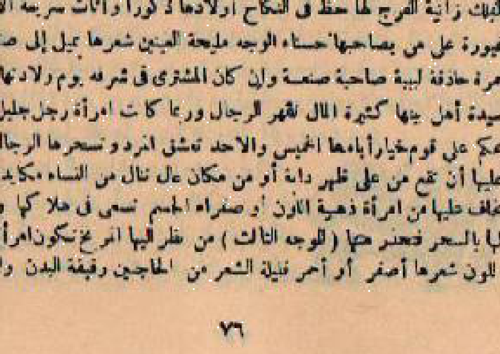

*Gambar Rajah Asli Halaman 78* — Wafaq angka keramat pelindung buruj Gemini bagi kaum wanita untuk ketajaman daya nalar, kemudahan rezeki, dan tolak bala fitnah.

---

## HALAMAN CETAK 79 (Halaman PDF 39, sisi kiri)

**[Teks Arab Asli]**

( البرج الرابع من طوالع النساء: برج السرطان والقمر )
وصاحبة فلك السرطان قمرها المنير * يدل على النور والبهاء والصفاء
لها الوجه الجميل والقلب الكبير * وتلقى فى دهرها المبرة والوفاء
تحب الإحسان وتكرم العفاة * وترزق فى عمرها بجميع الخيرات

**[Transliterasi Latin Fonetik]**

*(al-burjir-raabi'u min thawaali'un-nisaa'i  burjus-Sarathaani wal-Qamari)*
*wa shaahibatu falak as-Sarathaani qamirihaal-muniiri * yadullu 'alaa an-nuuri wal-bahaa'i wash-shafaa'i*
*lahaal-wajhul-jamiili wal-qalbil-Kabiiru * wa talaqqaa fii dahrihaal-mabarrata wal-wafaa'a*
*tuhibbul-ahsaanu wa takarrumul-'ufaati * wa turzaqu fii 'umruhaa bi-jamii'il-khayraati*

**[Terjemahan Indonesia]**

(Buruj Keempat dari Thali' Kaum Wanita: Buruj Cancer dan Penguasanya: Bulan)
*Penguasa peredaran Cancer bagi wanita adalah Bulan sang pelita malam nan benderang * Memberi petunjuk pada pancaran cahaya keelokan, keanggunan pesona, dan kejernihan nurani*
*Ia dianugerahi paras wajah yang cantik jelita dan hati yang lapang pengasih * Sepanjang hidupnya diliputi curahan kebajikan dan kesetiaan sejati*
*Mencintai perbuatan ihsan dan gemar memuliakan orang-orang yang membutuhkan * Serta dikaruniai di sepanjang rentang usianya dengan segenap pintu kebaikan.*

---

**[Gambar Rajah Asli Halaman 79 — Tilsm Buruj as-Sarathan Kaum Wanita]**

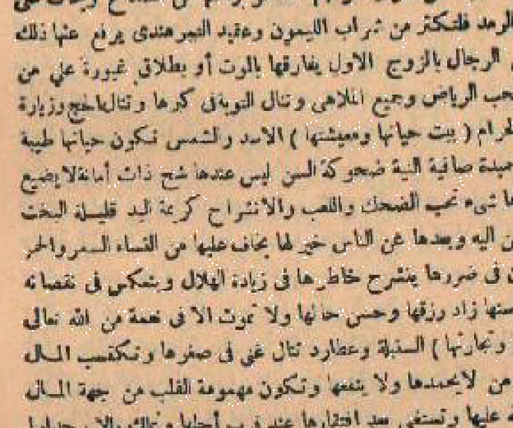

*Gambar Rajah Asli Halaman 79* — Gambar Tilsam simbolik buruj Cancer untuk Thali' Kaum Wanita: Sosok permaisuri anggun bertahta rembulan melambangkan kesuburan, kasih sayang keibuan, dan kemakmuran rumah tangga di bawah naungan Bulan.

---

**[Teks Arab Asli]**

( القول على طبع الطالع واختلاف الوجوه للنسوة )
قال الحكيم: هى امرأة بيضاء اللون كالبدر فى ليلة تمامه، مدورة الوجه، كحيلة الطرف، حسنة القد، رقيقة البشرة، كثيرة الحياء والعفة، ولها ثلاثة وجوه.

**[Transliterasi Latin Fonetik]**

*(al-qawli 'alaa thab'uth-thaali'u wa ikhtilaafil-wujuuhi lin-niswata)*
*qaalal-hakiimu  hiya imra'atun baydhaa'ul-lawni kal-badri fii laylata tamaamihi, mudawwaratal-wajhu, kahiilatith-tharafi, hasanatun al-qaddi, raqiiqatal-basyarati, katsiiratun al-hayaa'i wal-'iffati, wa lahaa tsalaatsatun wujuuhin *

**[Terjemahan Indonesia]**

(Uraian watak dasar thali' wanita dan pembagian tiga wajahnya)
Berkata sang ahli hikmah: Wanita yang lahir bernaung di bawah buruj Cancer ini berkulit putih bersih laksana bulan purnama di malam empat belas, berwajah bulat manis berseri, bermata jelita bercelak alami, berpostur tubuh proporsional elok, berkulit halus lembut, memiliki rasa malu yang tinggi dan sangat menjaga kesucian diri; dan ia terbagi atas tiga wajah (wajh).

---

**[Teks Arab Asli]**

( الوجه الأول ) من نظر إليها القمر: تكون امرأة ذات جمال وسيم، محبوبة عند زوجها وأهلها، ترزق أولادا مباركين، وتكون مباركة فى بيتها، وتعيش فى نعمة وسرور، والله أعلم.

**[Transliterasi Latin Fonetik]**

*(al-wajhul-awwalu  min nazhara ilayhaal-Qamari  takuunu imra'atun dzaat jamaali wa siimi, mahbuubatan 'inda zawjuhaa wa ahlihaa, turzaqu awalaaddaa mubaarakiina, wa takuunu mubaarakatun fii baytuhaa, wa ta'iisyu fii ni'matin wa suruurin, wallaahu a'lamu *) **[Terjemahan Indonesia]**

(Wajah Pertama) Bagi yang dipandang oleh Bulan: Ia menjadi wanita berparas cantik mempesona, sangat dicintai oleh suaminya dan seluruh keluarga besarnya, dianugerahi anak-anak yang saleh berbakti, membawa limpahan berkah di rumahnya, serta menjalani kehidupan dalam kemakmuran dan kegembiraan. Wallahu a'lam.

---

**[Teks Arab Asli]**

( الوجه الثانى ) من نظر إليها المشترى: تكون امرأة صالحة عابدة، ذات ورع وتقوى، تحسن تربية أولادها على طاعة الله، وترزق حجا وزيارة، وتكون ميمونة الطائر، والله تعالى أعلم.

**[Transliterasi Latin Fonetik]**

*(al-wajhuts-tsaanii  min nazhara ilayhaal-Musytarii  takuunu imra'atun shaalihatu 'aabidatu, dzaat wa ra'in wa taqwaa, tahassuna tarbiyati awlaadihaa 'alaa thaa'ati Allaahi, wa turzaqu hijaa wa ziyaarati, wa takuunu maymuunatuth-thaa'iri, wallaahu Ta'aalaa a'lamu *) **[Terjemahan Indonesia]**

(Wajah Kedua) Bagi yang dipandang oleh planet Yupiter: Ia adalah wanita salihah yang tekun beribadah, memiliki sifat wara' dan takwa mendalam, mendidik putra-putrinya di atas jalan ketaatan kepada Allah, dianugerahi kesempatan menunaikan ibadah haji dan ziarah suci, serta membawa keberuntungan dan ketentraman ke mana pun ia melangkah. Wallahu Ta'ala a'lam.

---

**[Teks Arab Asli]**

( الوجه الثالث ) من نظر إليها الزهرة: تكون امرأة ظريفة رقيقة، تحب الطيب والزينة والمفارش الحسنة، ذات صوت عذب رخيم، تنال حظا وافرا من المحبة والدلال، والله أعلم.

**[Transliterasi Latin Fonetik]**

*(al-wajhuts-tsaalitsu  min nazhara ilayhaa az-Zuharati  takuunu imra'atun zhariifatu raqiiqatin, tuhibbuth-thayyibu waz-zaynatu wal-mafaarisyul-hasanatu, dzaat shawti 'adzbi rakhiimi, tanaalu hazhzhan wa afiran minal-mahabbati wad-dalaali, wallaahu a'lamu *) **[Terjemahan Indonesia]**

(Wajah Ketiga) Bagi yang dipandang oleh planet Venus: Ia berjiwa sangat anggun dan berhati lembut, gemar mengenakan wewangian harum, perhiasan indah, dan penataan perabot rumah yang estetis, bersuara merdu menyenangkan, serta dianugerahi peruntungan kasih sayang dan kemanjaan yang berlimpah dari suaminya. Wallahu a'lam.

---

## HALAMAN CETAK 80 (Halaman PDF 40, sisi kanan)

**[Teks Arab Asli]**

( بيت حياتها ومعيشتها ) السرطان والقمر: تكون معيشتها هنيئة واسعة، تتقلب فى نعم الله تعالى، وتكفى مؤنتها فى عزة ورخاء، ولا تزال فى ارتقاء وسعادة، ولا تموت إلا فى نعمة وستر جميل، والله أعلم.

**[Transliterasi Latin Fonetik]**

*(baytu hayaatihaa wa ma'iisyatihaa  as-Sarathaani wal-Qamari  takuunu ma'iisyatuhaa hanii'atu waasi'atan, tataqallabu fii ni'ami Allaahi Ta'aalaa, wa tukfaa mu'anatuhaa fii 'izzatin wa rakhaa'in, wa laa tuzaalu fii irtiqaa'in wa sa'aadatin, wa laa tamuutu illaa fii ni'matin wa sitri jamiili, wallaahu a'lamu *) **[Terjemahan Indonesia]**

(Rumah kehidupan dan penghidupannya) Cancer dan Bulan: Penghidupannya berlangsung sejahtera, tentram, dan lapang; senantiasa diliputi kenikmatan karunia Allah Ta'ala; tercukupi segala kebutuhannya dalam kemuliaan dan kemakmuran; grafiknya terus menanjak dalam kebahagiaan; serta tidak berpulang melainkan dalam limpahan nikmat dan penutupan aib yang indah dari Allah. Wallahu a'lam.

---

**[Teks Arab Asli]**

( بيت مالها وتجارتها ) الأسد والشمس: ترزق بمال كثير من كسب يدها أو من عطايا زوجها وأهلها، ويكون لها حظ فى اقتناء الذهب والفضة واللآلئ، ويبارك الله فى مالها فينمو ويزيد، والله أعلم.

**[Transliterasi Latin Fonetik]**

*(baytu maalihaa wa tijaaratihaa  al-Asadi wasy-Syamsi  turzaqu bimaali katsiiru min kasbi yadihaa aw min 'athaayaa zawjuhaa wa ahlihaa, wa yakuunu lahaa hazhzhun fii iqtinaa'idz-dzahabi wal-fidhdhati wal-la'aali'i, wa yubaariku Allaahi fii maalihaa fiinamuu wa yaziidu, wallaahu a'lamu *) **[Terjemahan Indonesia]**

(Rumah harta dan kekayaannya) Leo dan Matahari: Ia dianugerahi kekayaan yang berlimpah baik dari hasil usahanya sendiri maupun dari pemberian suaminya dan keluarganya; sangat beruntung dalam kepemilikan emas batangan, perak, dan mutiara perhiasan; serta Allah melipatgandakan keberkahan hartanya hingga terus bertambah subur. Wallahu a'lam.

---

**[Teks Arab Asli]**

( بيت إخوتها وأخواتها ) السنبلة وعطارد: يكون لها إخوة وأخوات ذكورا وإناثا، ويكون بينها وبينهم تواصل ومودة، وتنال منهم دعاء حسنا وبرا، وتكون هى موضع سرهم ومشاورتهم، والله تعالى أعلم.

**[Transliterasi Latin Fonetik]**

*(baytu ikhwatihaa wa akhawaatihaa  as-Sunbulati wa 'Uthaarida  yakuunu lahaa ikhwatin wa akhawaatin dzukuuran wa inaatsan, wa yakuunu baynahaa wa baynahum tawaashula wa mawaddatan, wa tanaalu minhum du'aa'a hissinaa wa barran, wa takuunu hiya mawdhi'a sirrihim wa musyaawaratihim, wallaahu Ta'aalaa a'lamu *) **[Terjemahan Indonesia]**

(Rumah saudara-saudaranya) Virgo dan Merkurius: Ia memiliki saudara kandung laki-laki dan perempuan; ikatan persaudaraan di antara mereka terjalin hangat dan harmonis; memperoleh doa-doa kebaikan dan perlakuan penuh bakti dari mereka; bahkan dialah yang kerap dijadikan tempat menyimpan rahasia dan musyawarah keluarga. Wallahu Ta'ala a'lam.

---

**[Teks Arab Asli]**

( بيت آبائها وأمهاتها ) الميزان والزهرة: تكون محبوبة جدا عند والديها، وخاصة عند والدتها، وتنال من رضاهما ما يفتح لها أبواب السعادة، وتدفن أباها قبل أمها، وترث منهما خيرا وبركة، والله أعلم.

**[Transliterasi Latin Fonetik]**

*(baytu aabaa'ihaa wa ummahaatihaa  al-Miizaani waz-Zuharati  takuunu mahbuubatan jiddaa 'inda waalidayhaa, wa khaashshata 'inda wad-datihaa, wa tanaalu min ridhaahimaa maa yaftahu lahaa abwaabis-sa'aadati, wa tadfinu abaahaa qabla ummihaa, wa taritsu minhumaa khayran wa barakatin, wallaahu a'lamu *) **[Terjemahan Indonesia]**

(Rumah orang tuanya) Libra dan Venus: Ia sangat dicintai oleh kedua orang tuanya, terkhusus oleh ibundanya tercinta; merengkuh keridhaan kedua orang tuanya yang menjadi pembuka pintu-pintu kebahagiaan hakiki; memakamkan ayahnya lebih dahulu sebelum ibunya; serta mewarisi dari keduanya warisan yang berlimpah berkah. Wallahu a'lam.

---

**[Teks Arab Asli]**

( بيت أولادها وأفراحها ) العقرب والمريخ: ترزق بأولاد ذكور وإناث يكونون لها ذخرا وعونا فى كبرها، ويكون أول مولود لها ذكرا صالحا، وتقر عينها برؤية أولاد أولادها فى عافية، والله أعلم.

**[Transliterasi Latin Fonetik]**

*(baytu awlaadihaa wa afraahihaa  al-'Aqrabi wal-Mirriikhi  turzaqu bi-awlaadin dzukuurin wa inaatsi yukawwinuuna lahaa dzukhran wa 'awnan fii kibarihaa, wa yakuunu awwalu mawluudin lahaa dzikraa shaalihaa, wa tuqirru 'aynahaa biru'yati awlaadin awlaadihaa fii 'aafiyatin, wallaahu a'lamu *) **[Terjemahan Indonesia]**

(Rumah anak-anak dan kebahagiaannya) Scorpio dan Mars: Ia dikaruniai putra dan putri yang menjadi simpanan amal kebajikan dan penopang di hari tuanya; anak sulungnya adalah seorang laki-laki yang saleh; serta sejuk pandangan matanya hingga menyaksikan cucu-cucunya tumbuh dalam kesehatan walafiat. Wallahu a'lam.

---

**[Teks Arab Asli]**

( بيت أمراضها وأسقامها ) القوس والمشترى: تصيبها أمراض الرطوبة فى المعدة والصدر ووجع المفاصل، فلتستعمل شراب الزنجبيل والعسل وماء الورد، وتتجنب الأطعمة الباردة والرطبة، والله أعلم.

**[Transliterasi Latin Fonetik]**

*(baytu amraadhihaa wa asqaamihaa  al-Qawsi wal-Musytarii  tushiibuhaa amraadhin ar-ruthuubati fil-mu'addati wash-shadri wa waja'il-mafaashili, fa-latasta'milu syaraabuz-zanjabiili wal-'asali wa maa'il-wardi, wa tatajannabul-ath'imatul-baaridatu war-rathbatu, wallaahu a'lamu *) **[Terjemahan Indonesia]**

(Rumah penyakit dan keluhan fisiknya) Sagittarius dan Yupiter: Ia rentan mengalami keluhan kelembapan pada lambung dan dada serta ngilu persendian; maka dianjurkan rutin meminum seduhan jahe hangat bermadu dan air mawar; serta menghindari konsumsi makanan yang bersifat dingin dan terlalu berair. Wallahu a'lam.

---

## HALAMAN CETAK 81 (Halaman PDF 40, sisi kiri)

**[Teks Arab Asli]**

( بيت أزواجها وفراشها ) الجدى وزحل: تتزوج برجل جليل القدر ذى حزم وتدبير، يكرمها ويحبها، وتكون عنده فى مكانة رفيعة، وتدوم بينهما المعاشرة الحسنة فى هناء وسرور، والله أعلم.

**[Transliterasi Latin Fonetik]**

*(baytu azwaajihaa wa firaasyihaa  al-Jadyi wa Zuhala  tatazawwaju bi-rajulin jaliilul-qadri dzaa hazmun wa tadbiirun, yukarrimuhaa wa yuhibbuhaa, wa takuunu 'indahu fii makaanatin rafii'atin, wa tudawwimu baynahumaal-mu'aasyaratal-hasanata fii hanaa'in wa suruurin, wallaahu a'lamu *) **[Terjemahan Indonesia]**

(Rumah jodoh pernikahan dan peraduannya) Capricorn dan Saturnus: Ia dipersunting oleh seorang pria terpandang yang memiliki kepemimpinan tegas dan manajemen bijaksana; suaminya sangat memuliakan dan menyayanginya; menempatkan dirinya pada kedudukan yang luhur; serta bahtera pernikahan mereka berlangsung langgeng dalam kebahagiaan dan keharmonisan. Wallahu a'lam.

---

**[Teks Arab Asli]**

( بيت خوفها وموتها ) الدلو وزحل: يخاف عليها من عوارض المياه والبرد الشديد، وأعوام الخطر عندها: سبع سنين، وأربع عشرة سنة، وتسع وعشرون سنة، وأربع وأربعون سنة، وستون سنة، فان سلمت منها عاشت إلى ثمانين سنة، والله أعلم.

**[Transliterasi Latin Fonetik]**

*(baytu khawfihaa wa mawtihaa  ad-Dalwi wa Zuhala  yukhaafu 'alayhaa min 'awaaridhil-miyaahi wal-bardisy-syadiidi, wa a'waamal-khuthuri 'indahaa  sab'i siniina, wa arba'i 'asyrata sanatin, wa tis'un wa 'isyruuna sanatin, wa arba'i wa arba'uuna sanatin, sittuuna sanatin, fa-in salimat minhaa 'aasyat ilaa tsamaaniina sanatin, wallaahu a'lamu *) **[Terjemahan Indonesia]**

(Rumah masa rawan dan krisis hidupnya) Aquarius dan Saturnus: Dikhawatirkan atasnya bahaya pusaran air dan serangan cuaca dingin ekstrem; tahun-tahun rawan dalam siklus usianya adalah usia 7 tahun, 14 tahun, 29 tahun, 44 tahun, dan 60 tahun; jika ia berhasil melaluinya dengan selamat, usianya akan berlanjut hingga 80 tahun. Wallahu a'lam.

---

**[Teks Arab Asli]**

( بيت أسفارها وحركاتها ) الحوت والمشترى: تكون أسفارها ميمونة مباركة فى صحبة محارمها، وخاصة سفر الحج والزيارة، وتنال فى أسفارها راحة وسلامة وكرامة، والله أعلم.

**[Transliterasi Latin Fonetik]**

*(baytu asfaarihaa wa harakaatihaa  al-Huuti wal-Musytarii  takuunu asfaarihaa maymuunata mubaarakatun fii shuhbati mahaarimihaa, wa khaashshata safaril-hajji waz-ziyaarati, wa tanaalu fii asfaarihaa raahatan wa sullaamatan wa karaamatan, wallaahu a'lamu *) **[Terjemahan Indonesia]**

(Rumah perjalanan dan pergerakannya) Pisces dan Yupiter: Perjalanannya senantiasa membawa keberkahan dengan didampingi oleh mahramnya, terkhusus perjalanan ibadah haji dan ziarah suci; serta ia memetik ketentraman, keselamatan, dan kemuliaan di sepanjang perjalanannya. Wallahu a'lam.

---

**[Teks Arab Asli]**

( بيت عزها وشرفها ) الحمل والمريخ: تنال عزا وشرفا ومكانة مرموقة بين نساء قومها، وتكون مهابة الجانب محترمة الكلمة، وتلقى المحبة والتقدير من الجميع، والله أعلم.

**[Transliterasi Latin Fonetik]**

*(baytu 'izzihaa wa syarafihaa  al-Hamali wal-Mirriikhi  tanaalu 'izzan wa syarafan wa makaanata marmuuqata bayna nisaa'i qawmihaa, wa takuunu mahaabatul-jaanibi muhtaramatal-kalimati, wa talaqqaal-mahabbatu wat-taqdiiru minal-jamii'i, wallaahu a'lamu *) **[Terjemahan Indonesia]**

(Rumah kemuliaan dan status sosialnya) Aries dan Mars: Ia merengkuh kemuliaan, kehormatan, dan posisi bergengsi di tengah kaum wanita lingkungannya; disegani perawakannya dan dipatuhi perkataannya; serta menuai simpati kasih sayang dan apresiasi tinggi dari semua orang. Wallahu a'lam.

---

**[Teks Arab Asli]**

( بيت رجائها وآمالها ) الثور والزهرة: تبلغ ما ترجوه من تمام السعادة وراحة البال وصلاح الذرية، ويرزقها الله رزقا دارا وعيشا قارا وخاتمة حسنة، والله أعلم.

**[Transliterasi Latin Fonetik]**

*(baytu rajaa'ihaa wa aamaalihaa  ats-Tsawri waz-Zuharati  tablughu maa tarjuuhu min tamaamis-sa'aadati wa raahatil-baali wa shalaahin adz-dzarriyyati, wa yarzuquhaa Allaahi razaqaa daaraa wa 'aysyaa qaarraa wa khaatimatu hasanatun, wallaahu a'lamu *) **[Terjemahan Indonesia]**

(Rumah cita-cita dan dambaannya) Taurus dan Venus: Ia berhasil menggapai segala apa yang diharapkannya berupa kesempurnaan kebahagiaan, ketenangan batin, dan kesalehan anak keturunannya; serta Allah mengaruniainya aliran rezeki yang melimpah ruah, kehidupan yang mapan, dan husnul khatimah. Wallahu a'lam.

---

**[Teks Arab Asli]**

( بيت أعدائها وحسادها ) الجوزاء وعطارد: أعداؤها من بعض الحواسد اللاتى يحسدنها على حسن حالها وجمالها، ويكفيها الله شرهن ويجعل كيدهن فى نحورهن، والله سبحانه أعلم.

**[Transliterasi Latin Fonetik]**

*(baytu a'daa'ihaa wa hussaadihaa  al-Jawzaa'i wa 'Uthaarida  a'daa'uhaa min ba'dhul-hawaasidil-laatii yahsudannahaa 'alaa hasanu haalihaa wa jamaalihaa, wa yakfiihaa Allaahi syarrihinna wa yaj'alu kayadihinna fii nuhawwiruhunna, wallaahu Subhaanahu a'lamu *) **[Terjemahan Indonesia]**

(Rumah musuh dan para pendengkinya) Gemini dan Merkurius: Musuh-musuhnya hanyalah segelintir wanita pendengki yang iri melihat kemapanan hidup dan kecantikan parasnya; namun Allah senantiasa mencukupkan perlindungan dari kejahatan mereka dan mengembalikan tipu daya jahat itu ke leher mereka sendiri. Wallahu Subhanahu wa Ta'ala a'lam.

---

> **STATUS BATCH 8: SELESAI** (Halaman Cetak 72–81 / Halaman PDF 36–40).
> Rajah/wafaq/tilsam batch ini telah di-crop presisi, latar putih, tersimpan di folder `rajah/`:
> `rajah_p74_wafaq_nisa_tsaur.png`, `rajah_p75_tilsam_nisa_jauza.png`, `rajah_p78_wafaq_nisa_jauza.png`, `rajah_p79_tilsam_nisa_saratan.png`.

---

# BATCH 9 — HALAMAN PDF 41–45 (HALAMAN CETAK 82–91)

---

## HALAMAN CETAK 82 (Halaman PDF 41, sisi kanan)

**[Teks Arab Asli]**

( ولصاحبة هذا البرج من أشكال الرمل شكل الطريق )
قال الحكيم: اعلمى أيتها السائلة أن شكل الطريق يدل على النجاة من الشدائد، وتيسير الأمور، والانتقال من حال إلى أحسن حال، وبلوغ المقاصد بغير مشقة، فعليك بالصبر والاستقامة، واسمعى ما قيل:
مشيت فى طريق الخير فاستبشرى * بنيل المنى والعيش فى خير مظهر
ولا تقلقى من حادث الدهر إنما * قضاء إله العرش يجرى بقدر

**[Transliterasi Latin Fonetik]**

*(wa li-shaahibati haadzaal-burji min asykaalir-ramli syakluth-thariiqi)*
*qaalal-hakiimu  i'lamii ayyatuhas-saa'ilatu an syakluth-thariiqi yadullu 'alaa an-najaati minasy-syadaa'idi, wa taysiiral-umuuri, wal-intiqaala min haali ilaa ahsanu haali, wa buluughal-maqaashidi baghayri masyaqqatin, fa'alayka bish-shabri wal-istiqaamati, wa isma'ii maa qiila:*
*masysyaytu fii thariiqil-khayri faasatabasyaraa * binaylil-munaa wal-'aysyi fii khayrun mazhharin*
*wa laa taqalaqaa min haaditsid-dahri innamaa * qadhaa'a ilaahal-'arsyi yujraa biqadrin*

**[Terjemahan Indonesia]**

(Bagi pemilik buruj wanita ini dari bentuk-bentuk ilmu raml adalah bentuk *ath-Thariq*)
Berkata sang ahli hikmah: Ketahuilah wahai wanita penanya, sesungguhnya bentuk ath-Thariq (jalan lapang) menunjukkan keselamatan mutlak dari rintangan hidup, kemudahan berbagai urusan, peralihan keadaan menuju kondisi yang jauh lebih baik, serta tercapainya tujuan mulia tanpa kesulitan yang memberatkan; maka istiqamahlah dalam kesabaran; simaklah bait mutiara syair ini:
*Engkau telah melangkah di jalan kebajikan maka bergembiralah * Dengan tercapainya cita-cita dan menjalani kehidupan dalam wujud terbaik*
*Janganlah cemas menghadapi pasang surutnya peristiwa zaman * Karena sesungguhnya takdir Tuhan Penguasa 'Arsy senantiasa berjalan dengan takaran yang adil.*

---

**[Gambar Rajah Asli Halaman 82 — Wafaq as-Sarathan Kaum Wanita]**

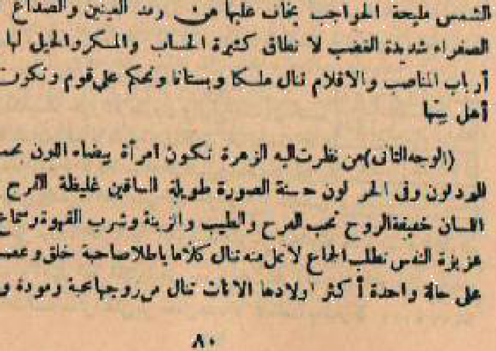

*Gambar Rajah Asli Halaman 82* — Wafaq angka keramat pelindung buruj Cancer bagi kaum wanita untuk keselamatan persalinan, keharmonisan cinta keluarga, dan tolak bala sihir.

---

## HALAMAN CETAK 83 (Halaman PDF 41, sisi kiri)

**[Teks Arab Asli]**

( البرج الخامس من طوالع النساء: برج الأسد والشمس )
وصاحبة فلك الأسد شمسها البهية * تدل على العز والجاه والمهابة
لها الطلعة النوراء والنفس الأبية * وتظفر فى دهرها بحسن الإجابة
تحب الشرف وتعلو على الأقران * وترزق فى عمرها بفيض الإحسان

**[Transliterasi Latin Fonetik]**

*(al-burjil-khaamisu min thawaali'un-nisaa'i  burjul-Asadi wasy-Syamsi)*
*wa shaahibatu falak al-Asadi syamisihaal-bahiyyati * tadullu 'alaal-'izzi wal-jaahi wal-mahaabati*
*lahaa ath-thal'atin-nuuraa' wan-nafsal-abiyyata * wa tazhfaru fii dahrihaa bi-husnil-ijaabati*
*tuhibbusy-syarafu wa ta'luu 'alaal-aqraani * wa turzaqu fii 'umruhaa bifaydhil-ahsaani*

**[Terjemahan Indonesia]**

(Buruj Kelima dari Thali' Kaum Wanita: Buruj Leo dan Penguasanya: Matahari)
*Penguasa orbit Leo bagi wanita adalah Matahari sang surya nan cemerlang memukau * Memberi petunjuk pada kemuliaan derajat, wibawa kepemimpinan, dan kharisma mempesona*
*Ia dianugerahi paras wajah yang bersinar terang dan jiwa ksatria yang pantang menyerah * Berhasil menggapai pengabulan doa-doa terbaik dalam lembaran usianya*
*Mencintai kehormatan martabat dan unggul mengungguli rekan-rekannya * Serta dilimpahi di sepanjang hayatnya dengan curahan kebaikan ihsan.*

---

**[Gambar Rajah Asli Halaman 83 — Tilsm Buruj al-Asad Kaum Wanita]**

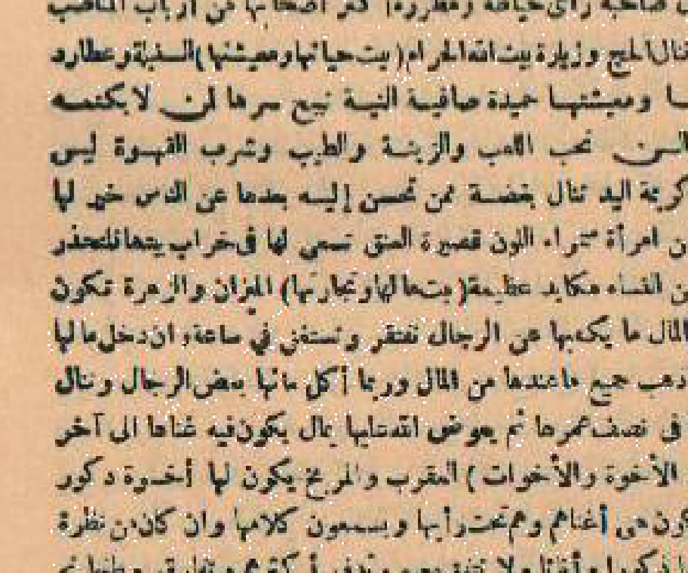

*Gambar Rajah Asli Halaman 83* — Gambar Tilsam simbolik buruj Leo untuk Thali' Kaum Wanita: Sosok ratu perkasa bertahta singa emas memegang mahkota cahaya di bawah naungan Matahari.

---

**[Teks Arab Asli]**

( القول على طبع الطالع واختلاف الوجوه للنسوة )
قال الحكيم الفلكى: هى امرأة بيضاء اللون مشربة بحمرة صافية، حسنة الوجه، واسعة العينين، ذات هيبة وجمال، عزيزة النفس، صريحة اللسان، محبوبة فى قومها، ولها ثلاثة وجوه.

**[Transliterasi Latin Fonetik]**

*(al-qawli 'alaa thab'uth-thaali'u wa ikhtilaafil-wujuuhi lin-niswata)*
*qaalal-hakiimul-Falakiyyu  hiya imra'atun baydhaa'ul-lawni masyrabatan bi-humratin shaafiyati, hasanatun al-wajhu, waasi'atan al-'aynayni, dzaat haybatin wa jamaalin, 'aziizatan-nafsi, shariihatal-lisaani, mahbuubatan fii qawmihaa, wa lahaa tsalaatsatun wujuuhin *

**[Terjemahan Indonesia]**

(Uraian watak dasar thali' wanita dan pembagian tiga wajahnya)
Berkata sang ahli astrologi falak: Wanita yang lahir di bawah naungan buruj Leo berkulit putih bersih berpadu rona kemerahan cerah berseri, berparas rupawan anggun, bermata indah tajam memikat, memancarkan wibawa dan kecantikan alami, berjiwa ksatria yang menjaga harga diri, jujur berani dalam bertutur kata, sangat dicintai di tengah kaumnya; dan ia memiliki tiga wajah (wajh).

---

**[Teks Arab Asli]**

( الوجه الأول ) من نظر إليها الشمس: تكون امرأة ذات سطوة ووقار، سيدة فى بيتها، مطاعة فى قومها، ترزق مالا كثيرا من جهة الملوك والأكابر، وتعيش فى عز وشرف، والله أعلم.

**[Transliterasi Latin Fonetik]**

*(al-wajhul-awwalu  min nazhara ilayhaa asy-Syamsi  takuunu imra'atun dzaat sathwatin wa waqaarin, sayyidatun fii baytuhaa, muthaa'atan fii qawmihaa, turzaqu maalan katsiiran min jihatil-muluuki wal-akaabiri, wa ta'iisyu fii 'izzin wa syarafin, wallaahu a'lamu *) **[Terjemahan Indonesia]**

(Wajah Pertama) Bagi yang dipandang oleh Matahari: Ia menjadi wanita yang memiliki karisma kepemimpinan berwibawa, menjadi nyonya terpandang di rumahnya, ditaati perkataannya di tengah kaumnya, dianugerahi kekayaan melimpah melalui jalur kehormatan para pembesar, serta menjalani kehidupan dalam kemuliaan dan martabat luhur. Wallahu a'lam.

---

**[Teks Arab Asli]**

( الوجه الثانى ) من نظر إليها المشترى: تكون امرأة صالحة كريمة، ذات سخاء ومروءة، تحسن إلى الفقراء والمحتاجين، ويكون بيتها مقصودا للضيافة وفعل الخير، وتكون مباركة فى رزقها، والله تعالى أعلم.

**[Transliterasi Latin Fonetik]**

*(al-wajhuts-tsaanii  min nazhara ilayhaal-Musytarii  takuunu imra'atun shaalihatu kariimatu, dzaat sakhaa'in wa muruu'atin, tahassunun ilal-fuqaraa'i wal-muhtaajiina, wa yakuunu baytuhaa maqshuudan lidh-dhiyaafata wa fi'lal-khayri, wa takuunu mubaarakatun fii rizqihaa, wallaahu Ta'aalaa a'lamu *) **[Terjemahan Indonesia]**

(Wajah Kedua) Bagi yang dipandang oleh planet Yupiter: Ia adalah wanita salihah yang amat dermawan, berjiwa luhur memuliakan tamu, gemar mengulurkan bantuan bagi kaum fakir miskin, rumahnya selalu terbuka untuk menjamu kebaikan dan amal sosial, serta dilimpahi keberkahan rezeki yang tak pernah putus. Wallahu Ta'ala a'lam.

---

**[Teks Arab Asli]**

( الوجه الثالث ) من نظر إليها الزهرة: تكون امرأة حسناء ظريفة، تحب الزينة والملابس المذهبة والجواهر النفيسة، ذات دلال وجمال، يعشقها زوجها ويؤثرها على سائر النساء، والله أعلم.

**[Transliterasi Latin Fonetik]**

*(al-wajhuts-tsaalitsu  min nazhara ilayhaa az-Zuharati  takuunu imra'atun hasnaa'i zhariifati, tuhibbuz-zaynatu wal-malaabisul-mudzahhabatu wal-jawaahirun-nafiisatu, dzaat dalaalin wa jamaalin, ya'asyaqahaa zawjuhaa wa yu'tsiruhaa 'alaa saa'irin-nisaa'i, wallaahu a'lamu *) **[Terjemahan Indonesia]**

(Wajah Ketiga) Bagi yang dipandang oleh planet Venus: Ia berparas sangat jelita dan modis mempesona, menyukai perhiasan emas berlian dan busana-busana mewah bernilai tinggi, berdaya pikat anggun memikat, sangat dipuja dan dicintai suaminya melebihi wanita mana pun. Wallahu a'lam.

---

## HALAMAN CETAK 84 (Halaman PDF 42, sisi kanan)

**[Teks Arab Asli]**

( بيت حياتها ومعيشتها ) الأسد والشمس: تكون حياتها فى عزة وسلطان، ومعيشتها واسعة رغيدة، تنال من الخيرات ما يرفع شأنها، ولا تزال فى صعود وازدهار، وتعيش مهابة الجانب محترمة، ولا تموت إلا فى نعمة وفضل، والله أعلم.

**[Transliterasi Latin Fonetik]**

*(baytu hayaatihaa wa ma'iisyatihaa  al-Asadi wasy-Syamsi  takuunu hayaatihaa fii 'izzatin wa sulthaanu, wa ma'iisyatihaa waasi'atan raghiidatin, tanaalu minal-khayraati maa yarfa'u sya'nuhaa, wa laa tuzaalu fii shu'uudin wa izdihaarin, wa ta'iisyu mahaabatul-jaanibi muhtaramatan, wa laa tamuutu illaa fii ni'matin wa fadhlin, wallaahu a'lamu *) **[Terjemahan Indonesia]**

(Rumah kehidupan dan penghidupannya) Leo dan Matahari: Garis kehidupannya diliputi kemuliaan dan wibawa kekuasaan; penghidupannya amat lapang dan sejahtera; dianugerahi berbagai macam kebajikan yang mengangkat derajat sosialnya; senantiasa menanjak dalam kemajuan; hidup dalam naungan rasa hormat dan disegani; serta tidak berpulang melainkan dalam limpahan nikmat dan karunia Ilahi. Wallahu a'lam.

---

**[Teks Arab Asli]**

( بيت مالها وتجارتها ) السنبلة وعطارد: تكتسب الأموال من التجارات الكبيرة والمشاريع الناجحة، وتجيد تدبير الأموال وإنمائها، وترزق ذهبا وفضة وعقارات واسعة، ويبارك الله فى مالها، والله أعلم.

**[Transliterasi Latin Fonetik]**

*(baytu maalihaa wa tijaaratihaa  as-Sunbulati wa 'Uthaarida  taktasibul-amwaali minat-tijaaraatil-kabiirati wal-masyaarii'in-naajihata, wa tujiidu tadbiirul-amwaali wa inmaa'ihaa, wa turzaqu dzahabaa wa fidhdhatun wa 'aqaaraatu waasi'atan, wa yubaariku Allaahi fii maalihaa, wallaahu a'lamu *) **[Terjemahan Indonesia]**

(Rumah harta dan perniagaannya) Virgo dan Merkurius: Ia merengkuh kekayaan dari perniagaan skala besar dan proyek-proyek usaha yang produktif; sangat piawai mengelola perputaran modal dan mengembangkannya; dianugerahi simpanan emas, perak, dan aset tanah yang luas; serta Allah senantiasa memberkahi hartanya. Wallahu a'lam.

---

**[Teks Arab Asli]**

( بيت إخوتها وأخواتها ) الميزان والزهرة: يكون لها إخوة يعظمونها ويجلون قدرها، وتكون هى سندا لهم وعونا فى نوائب الدهر، ويدوم بينهم الود والتواصل الجميل، والله تعالى أعلم.

**[Transliterasi Latin Fonetik]**

*(baytu ikhwatihaa wa akhawaatihaa  al-Miizaani waz-Zuharati  yakuunu lahaa ikhwatin yu'zhimuunahaa wa yajluwanna qadruhaa, wa takuunu hiya sanadan lahum wa 'awnan fii nawaa'ibid-dahri, wa yudawwimu baynahum al-wadda wat-tawaashulal-jamiila, wallaahu Ta'aalaa a'lamu *) **[Terjemahan Indonesia]**

(Rumah saudara-saudaranya) Libra dan Venus: Ia memiliki saudara kandung yang sangat memuliakan dan menjunjung tinggi martabatnya; dialah yang menjadi pilar penopang dan pelindung bagi mereka di saat menghadapi badai kehidupan; serta hubungan persaudaraan mereka berlangsung harmonis penuh cinta. Wallahu Ta'ala a'lam.

---

**[Teks Arab Asli]**

( بيت آبائها وأمهاتها ) العقرب والمريخ: تنال من والديها برا ومحبة، ويكون والدها شديد الحرص عليها معتزا بها، وتدفن أباها قبل أمها، وترث منهما مالا وجاها، والله أعلم.

**[Transliterasi Latin Fonetik]**

*(baytu aabaa'ihaa wa ummahaatihaa  al-'Aqrabi wal-Mirriikhi  tanaalu min waalidayhaa barran wa mahabbatan, wa yakuunu wad-dahaa syadiidun al-hirshi 'alayhaa mu'tazzan bihaa, wa tadfinu abaahaa qabla ummihaa, wa taritsu minhumaa maalan wa jaahan, wallaahu a'lamu *) **[Terjemahan Indonesia]**

(Rumah orang tuanya) Scorpio dan Mars: Ia memetik ketulusan cinta dan bakti mendalam dari kedua orang tuanya; ayahnya sangat menyayangi dan bangga atas keluhuran putrinya; memakamkan ayahnya lebih dahulu sebelum ibunya; serta mewarisi dari keduanya warisan harta dan reputasi nama baik. Wallahu a'lam.

---

**[Teks Arab Asli]**

( بيت أولادها وأفراحها ) القوس والمشترى: ترزق بأولاد ذكورا وإناثا، ويكون أولادها أصحاب شجاعة ونجابة، ويبرز منهم من ينال رتبة عالية وسلطانا، وتقر عينها بصلاحهم، والله أعلم.

**[Transliterasi Latin Fonetik]**

*(baytu awlaadihaa wa afraahihaa  al-Qawsi wal-Musytarii  turzaqu bi-awlaadin dzukuuran wa inaatsan, wa yakuunu awlaadihaa ashhaabu syajaa'atin wa najaabatin, wa yubrizu minhum min yanaalu rutbata 'aaliyata wa sulthaanan, wa tuqirru 'aynahaa bishulaahihim, wallaahu a'lamu *) **[Terjemahan Indonesia]**

(Rumah anak-anak dan kebahagiaannya) Sagittarius dan Yupiter: Ia dianugerahi putra dan putri yang tangguh berani dan berotak cemerlang; di antara keturunannya akan ada yang menduduki jabatan struktural tinggi dan kekuasaan terhormat; serta sejuk pandangan matanya menyaksikan kesalehan mereka. Wallahu a'lam.

---

**[Teks Arab Asli]**

( بيت أمراضها وأسقامها ) الجدى وزحل: تصيبها أمراض الحرارة فى الكبد ووجع القلب والصداع، فلتستعمل ماء الورد البارد وشراب التمر هندى والسكنجبين، وتتجنب الأطعمة الحريفة والغضب الشديد، والله أعلم.

**[Transliterasi Latin Fonetik]**

*(baytu amraadhihaa wa asqaamihaa  al-Jadyi wa Zuhala  tushiibuhaa amraadhin al-haraarati fil-kabidi wa waja'il-qalbi wash-shudaa'i, fa-latasta'milu maa'ul-wardil-baaridi wa syaraabit-tamri hindiyyun was-sakanjabiinu, wa tatajannabul-ath'imatul-hariifata wal-ghadhabasy-syadiida, wallaahu a'lamu *) **[Terjemahan Indonesia]**

(Rumah penyakit dan keluhan fisiknya) Capricorn dan Saturnus: Ia rentan mengalami keluhan panas organ hati, debar jantung, dan pusing kepala; maka dianjurkan rutin meminum air mawar sejuk, sari asam jawa (tamr hindi), dan oxymel (sikinjabin); serta menjauhi makanan pedas menyengat dan meredam luapan amarah yang meledak-ledak. Wallahu a'lam.

---

## HALAMAN CETAK 85 (Halaman PDF 42, sisi kiri)

**[Teks Arab Asli]**

( بيت أزواجها وفراشها ) الدلو وزحل: تتزوج برجل عظيم الشأن ذى جاه وسلطان، يحبها حبا صادقا ويكرم مقامها، وتكون هى الملكة فى بيته، وتعيش معه فى هناء ورغد وسعادة دائمة، والله أعلم.

**[Transliterasi Latin Fonetik]**

*(baytu azwaajihaa wa firaasyihaa  ad-Dalwi wa Zuhala  tatazawwaju bi-rajulin 'azhiimun asy-sya'ni dzaa jaahun wa sulthaanu, yuhibbuhaa hubbaa shaadiqaa wa yukarrimu maqaamuhaa, wa takuunu hiyal-malikata fii baytihi, wa ta'iisyu ma'ahu fii hanaa'in wa raghadin wa sa'aadati daa'imati, wallaahu a'lamu *) **[Terjemahan Indonesia]**

(Rumah jodoh pernikahan dan peraduannya) Aquarius dan Saturnus: Ia dipersunting oleh seorang pria terpandang yang memiliki wibawa dan kedudukan berpengaruh; suaminya mencintainya dengan cinta yang tulus dan sangat memuliakan martabatnya; ia bertahta laksana ratu di rumah tangganya; serta menjalani hari-hari bersamanya dalam kebahagiaan, kemakmuran, dan kedamaian abadi. Wallahu a'lam.

---

**[Teks Arab Asli]**

( بيت خوفها وموتها ) الحوت والمشترى: يخاف عليها من أمراض الحرارة الحادة وعوارض الهواء الحار، وأعوام الخطر عندها: عشر سنين، وعشرون سنة، وثلاثون سنة، وخمس وأربعون سنة، وستون سنة، فان سلمت منها عاشت إلى خمس وثمانين سنة، والله أعلم.

**[Transliterasi Latin Fonetik]**

*(baytu khawfihaa wa mawtihaa  al-Huuti wal-Musytarii  yukhaafu 'alayhaa min amraadhin al-haraaratil-haaddati wa 'awaaridhil-hawaa'il-haarri, wa a'waamal-khuthuri 'indahaa  'asyara siniina, 'isyruuna sanatin, tsalaatsuuna sanatin, wa khamsun wa arba'uuna sanatin, sittuuna sanatin, fa-in salimat minhaa 'aasyat ilaa khamsi wa tsamaaniina sanatin, wallaahu a'lamu *) **[Terjemahan Indonesia]**

(Rumah masa rawan dan krisis kesehatannya) Pisces dan Yupiter: Dikhawatirkan atasnya penyakit demam panas akut dan sengatan udara panas kering; tahun-tahun rawan dalam siklus usianya adalah usia 10 tahun, 20 tahun, 30 tahun, 45 tahun, dan 60 tahun; jika ia berhasil melaluinya dengan selamat, usianya akan mencapai 85 tahun. Wallahu a'lam.

---

**[Teks Arab Asli]**

( بيت أسفارها وحركاتها ) الحمل والمريخ: تكون أسفارها قليلة وفى أبهة وعز، وتسافر إلى الحواضر الكبرى وحج بيت الله الحرام، وتنال فى أسفارها سلامة وتوفيقا، والله أعلم.

**[Transliterasi Latin Fonetik]**

*(baytu asfaarihaa wa harakaatihaa  al-Hamali wal-Mirriikhi  takuunu asfaarihaa qaliilatan wa fii ubbahatun wa 'izzun, wa tusaafiru ilal-hawaadhiril-kubraa wa hajja baytu Allaahil-Haraami, wa tanaalu fii asfaarihaa sullaamatan wa tawfiiqan, wallaahu a'lamu *) **[Terjemahan Indonesia]**

(Rumah perjalanan dan pergerakannya) Aries dan Mars: Perjalanannya jarang dilakukan dan senantiasa berlangsung dalam kemewahan dan pengawalan terhormat; bepergian ke kota-kota besar metropolitan dan menunaikan rukun haji ke Baitullah al-Haram; serta memetik keselamatan dan kemudahan di sepanjang musafir. Wallahu a'lam.

---

**[Teks Arab Asli]**

( بيت عزها وشرفها ) الثور والزهرة: تنال عزا عظيما وشرفا باذخا، وتكون سيدة نساء عصرها فى الوقار والمهابة، ويثنى عليها الجميع بحسن أفعالها، والله أعلم.

**[Transliterasi Latin Fonetik]**

*(baytu 'izzihaa wa syarafihaa  ats-Tsawri waz-Zuharati  tanaalu 'izzan 'azhiiman wa syarafaa baadzikhaa, wa takuunu sayyidatun nisaa'i 'ashrihaa fil-waqaari wal-mahaabati, wa yutsnaa 'alayhaal-jamii'i bi-husni afa'aalihaa, wallaahu a'lamu *) **[Terjemahan Indonesia]**

(Rumah kemuliaan dan status sosialnya) Taurus dan Venus: Ia merengkuh kemuliaan yang agung dan kehormatan yang menjulang; menjadi teladan utama kaum wanita di zamannya dalam hal wibawa dan keluhuran budi; serta menuai sanjungan pujian dari semua orang atas kedermawanan amalnya. Wallahu a'lam.

---

**[Teks Arab Asli]**

( بيت رجائها وآمالها ) الجوزاء وعطارد: يبلغها الله ما ترجوه من تمام العز والرفعة وبلوغ الغايات، وترزق عاقبة حميدة ورضا من رب العالمين، والله أعلم.

**[Transliterasi Latin Fonetik]**

*(baytu rajaa'ihaa wa aamaalihaa  al-Jawzaa'i wa 'Uthaarida  yablughuhaa Allaahi maa tarjuuhu min tamaamil-'izzi war-raf'ati wa buluughil-ghaayaati, wa turzaqu 'aaqibatu hamiidatu wa ridhaa min rabbil-'aalamiina, wallaahu a'lamu *) **[Terjemahan Indonesia]**

(Rumah cita-cita dan dambaannya) Gemini dan Merkurius: Allah menyampaikan dirinya pada apa yang ia dambakan berupa kesempurnaan kemuliaan, ketinggian derajat, dan tercapainya seluruh tujuan luhur; serta dianugerahi akhir hidup yang terpuji dan keridhaan dari Tuhan semesta alam. Wallahu a'lam.

---

**[Teks Arab Asli]**

( بيت أعدائها وحسادها ) السرطان والقمر: أعداؤها من بعض الحواسد اللاتى يحسدنها على رفعة شأنها وسلطانها، ويكفيها الله كيدهن ويجعلها منصورة عليهن، والله سبحانه أعلم.

**[Transliterasi Latin Fonetik]**

*(baytu a'daa'ihaa wa hussaadihaa  as-Sarathaani wal-Qamari  a'daa'uhaa min ba'dhul-hawaasidil-laatii yahsudannahaa 'alaa raf'ati sya'nihaa wa sulthaanihaa, wa yakfiihaa Allaahi kaydihinna wa yaj'aluhaa manshuuratun 'alayhunna, wallaahu Subhaanahu a'lamu *) **[Terjemahan Indonesia]**

(Rumah musuh dan para pendengkinya) Cancer dan Bulan: Musuh-musuhnya hanyalah segelintir wanita pendengki yang iri menyaksikan tingginya kedudukan dan pengaruhnya; namun Allah mencukupkan perlindungan dari kejahatan mereka dan menjadikannya senantiasa unggul menang atas mereka. Wallahu Subhanahu wa Ta'ala a'lam.

---

## HALAMAN CETAK 86 (Halaman PDF 43, sisi kanan)

**[Teks Arab Asli]**

( ولصاحبة هذا البرج من أشكال الرمل شكل القبض الخارج )
قال الحكيم: اعلمى أيتها السائلة أن شكل القبض الخارج يدل على بذل المال فى الخير، والشهرة الطيبة، ودفع البلاء بالصدقة، فعليك بإعانة الضعفاء تزدادى عزا ورزقا، واسمعى ما قيل:
أنفقى المال تنالى الشرفا * واقصدى الخير وزيدى العطفا
فجميل الفعل يبقى أثره * ويزيل الله عنك الأسفا

**[Transliterasi Latin Fonetik]**

*(wa li-shaahibati haadzaal-burji min asykaalir-ramli syaklul-qabdhil-khaariji)*
*qaalal-hakiimu  i'lamii ayyatuhas-saa'ilatu an syaklul-qabdhil-khaariji yadullu 'alaa badzlil-maali fil-khayri, wasy-syahratath-thayyibata, wa dafa'al-balaa'u bish-shidqati, fa'alayka bi'i'aanatidh-dhu'afaa'i tazadaadaa 'izzan wa rizqan, wa isma'ii maa qiila:*
*anufqaal-maali tanaalaa asy-syarafaa * waaqashadaal-khayri waziidaal-'athfaa*
*fa-jamiilal-fi'li yubqii atsaruhu * wa yuziilu Allaahi 'ankal-asafaa*

**[Terjemahan Indonesia]**

(Bagi pemilik buruj wanita ini dari bentuk-bentuk ilmu raml adalah bentuk *al-Qabdh al-Kharij*)
Berkata sang ahli hikmah: Ketahuilah wahai wanita penanya, sesungguhnya bentuk al-Qabdh al-Kharij menunjukkan keluarnya harta untuk kebajikan derma, melambungnya nama baik yang harum, dan tertolaknya segala bala bencana berkat sedekah; maka lazimkanlah menolong kaum dhuafa niscaya bertambah keluhuran martabat dan keluasan rezekimu; simaklah bait syair bijak ini:
*Nafkahkanlah sebagian hartamu niscaya engkau meraih kemuliaan sejati * Tujukanlah niat pada kebajikan dan perbanyaklah belas kasih*
*Karena sesungguhnya jejak perbuatan baik akan senantiasa abadi dikenang * Dan Allah akan melenyapkan segala duka nestapa dari jiwamu.*

---

**[Gambar Rajah Asli Halaman 86 — Wafaq al-Asad Kaum Wanita]**

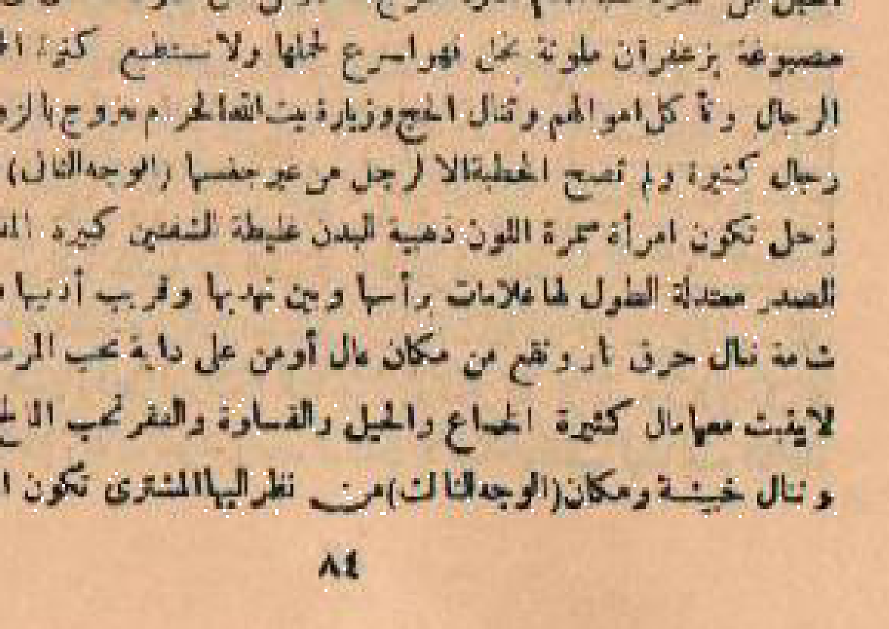

*Gambar Rajah Asli Halaman 86* — Wafaq angka keramat pelindung buruj Leo bagi kaum wanita untuk kewibawaan tinggi, mahabbah umum, dan keselamatan dari mata jahat (hasad).

---

## HALAMAN CETAK 87 (Halaman PDF 43, sisi kiri)

**[Teks Arab Asli]**

( البرج السادس من طوالع النساء: برج السنبلة وعطارد )
وصاحبة فلك السنبلة عطاردها الرشيد * يدل على الحكمة والعقل والتدبير
لها السيرة الحسنة والرأى السديد * وترزق فى دهرها بالخير الوفير
تحب النظام وتتقن الأعمال * وتعيش فى قومها بأحسن حال

**[Transliterasi Latin Fonetik]**

*(al-burjis-saadisu min thawaali'un-nisaa'i  burjus-Sunbulati wa 'Uthaarida)*
*wa shaahibatu falak as-Sunbulati 'uthaaridahaa ar-rasyiida * yadullu 'alaal-hukmati wal-'aqli wat-tadbiiri*
*lahaa as-sayratil-hasanati waalara'aa as-sadiida * wa turzaqu fii dahrihaa bil-khayril-wafiiri*
*tuhibbun-nizhaamu wa tutqinul-a'maalu * wa ta'iisyu fii qawmihaa bi'ahsani haali*

**[Terjemahan Indonesia]**

(Buruj Keenam dari Thali' Kaum Wanita: Buruj Virgo dan Penguasanya: Merkurius)
*Penguasa orbit Virgo bagi wanita adalah Merkurius sang bintang penuntun bijak * Memberi petunjuk pada kematangan hikmah, kecemerlangan akal, dan kecakapan manajemen*
*Ia dianugerahi rekam jejak perilaku yang luhur dan pandangan yang lurus tepat * Dikaruniai di sepanjang usianya dengan kelimpahan kebajikan yang luas*
*Mencintai kerapian sistem dan menyempurnakan setiap pekerjaan * Serta menjalani kehidupannya di tengah masyarakat dalam kondisi yang paling ideal.*

---

**[Gambar Rajah Asli Halaman 87 — Tilsm Buruj as-Sunbulah Kaum Wanita]**

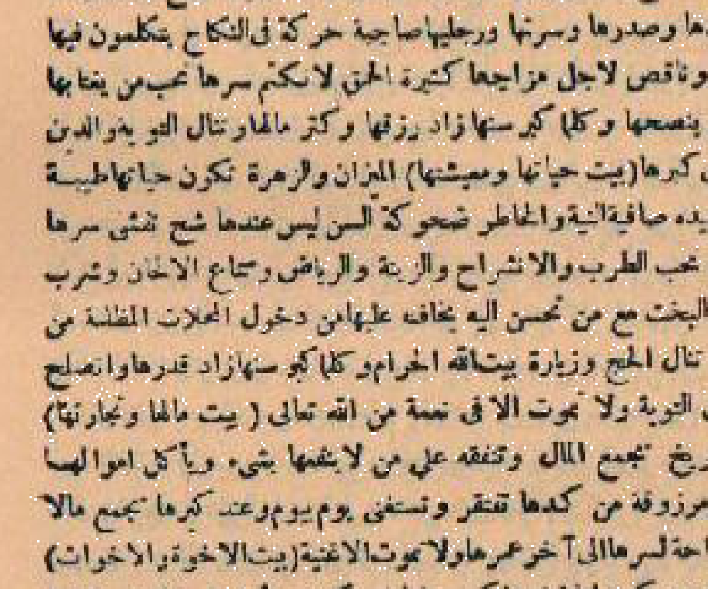

*Gambar Rajah Asli Halaman 87* — Gambar Tilsam simbolik buruj Virgo untuk Thali' Kaum Wanita: Sosok perawan suci memegang tangkai gandum emas kemakmuran di bawah naungan planet Merkurius.

---

**[Teks Arab Asli]**

( القول على طبع الطالع واختلاف الوجوه للنسوة )
قال الحكيم الفلكى: هى امرأة بيضاء اللون مائلة إلى الصفرة المليحة أو السمرة الصافية، حسنة القامة، كحيلة العينين، ناصعة الجبين، دقيقة الصنائع، محبوبة عند العاقلات، ولها ثلاثة وجوه.

**[Transliterasi Latin Fonetik]**

*(al-qawli 'alaa thab'uth-thaali'u wa ikhtilaafil-wujuuhi lin-niswata)*
*qaalal-hakiimul-Falakiyyu  hiya imra'atun baydhaa'ul-lawni maa'ilatan ilash-shifratil-maliihati aw as-samaratush-shaafiyatu, hasanatun al-qaamati, kahiilatil-'aynayni, naashi'atal-jabiini, daqiiqatash-shanaa'i'i, mahbuubatan 'indal-'aaqilaati, wa lahaa tsalaatsatun wujuuhin *

**[Terjemahan Indonesia]**

(Uraian watak dasar thali' wanita dan pembagian tiga wajahnya)
Berkata sang ahli astrologi falak: Wanita yang bernaung di bawah buruj Virgo ini berkulit putih langsat manis atau sawo matang bersih, berpostur tubuh proporsional elok, bermata indah bercelak alami, berdahi cerah cemerlang, sangat teliti dalam berkarya seni, sangat dikagumi di kalangan wanita-wanita cerdas; dan ia memiliki tiga wajah (wajh).

---

**[Teks Arab Asli]**

( الوجه الأول ) من نظر إليها عطارد: تكون امرأة كاتبة ماهرة، صاحبة عقل راجح وحساب دقيق، تحسن إدارة بيتها وأموالها، وتكون مباركة فى تجارتها وكسبها، والله أعلم.

**[Transliterasi Latin Fonetik]**

*(al-wajhul-awwalu  min nazhara ilayhaa 'Uthaarida  takuunu imra'atun kaatibatu maahiratu, shaahibata 'aqli raajihi wa hisaabi daqiiqin, tahassuna idaarati baytuhaa wa amwaalihaa, wa takuunu mubaarakatun fii tijaaratihaa wa kasbihaa, wallaahu a'lamu *) **[Terjemahan Indonesia]**

(Wajah Pertama) Bagi yang dipandang oleh planet Merkurius: Ia menjadi wanita yang mahir dalam tata administrasi tulis, memiliki logika berpikir yang matang dan akuntansi cermat, sangat piawai mengelola urusan rumah tangga dan aset finansialnya, serta membawa keberkahan dalam perniagaan usahanya. Wallahu a'lam.

---

**[Teks Arab Asli]**

( الوجه الثانى ) من نظر إليها الزهرة: تكون امرأة ظريفة حسنة المعشر، محبة للتطريز والنسيج والزينة الأنيقة، ذات ذوق رفيع، تعيش فى هدوء وسعادة، والله تعالى أعلم.

**[Transliterasi Latin Fonetik]**

*(al-wajhuts-tsaanii  min nazhara ilayhaa az-Zuharati  takuunu imra'atun zhariifatu hasanatun al-ma'syari, mahabbatan lit-tathriiza wan-nasiija waz-zaynatal-aniiqata, dzaat dzawqi rafii'i, ta'ayyasya fii huduu'in wa sa'aadatin, wallaahu Ta'aalaa a'lamu *) **[Terjemahan Indonesia]**

(Wajah Kedua) Bagi yang dipandang oleh planet Venus: Ia adalah wanita yang sangat anggun dan hangat dalam pergaulan, gemar menyulam, menenun busana indah, dan perhiasan estetis, memiliki cita rasa seni yang tinggi, serta menjalani hidup dalam ketentraman dan kebahagiaan. Wallahu Ta'ala a'lam.

---

**[Teks Arab Asli]**

( الوجه الثالث ) من نظر إليها زحل: تكون امرأة صبورة مدبرة، ذات وقار وصمت، تتحمل مسؤوليات بيتها بجد وإتقان، وتكون أمينة على كل ما تحت يدها، والله أعلم.

**[Transliterasi Latin Fonetik]**

*(al-wajhuts-tsaalitsu  min nazhara ilayhaa Zuhala  takuunu imra'atun shabuuratu mudabbaratu, dzaat wa qaarin wa shamtin, tatahammalu mas'uuliyyaatu baytuhaa bijiddin wa itqaanin, wa takuunu amiinatun 'alaa kullu maa taht yadihaa, wallaahu a'lamu *) **[Terjemahan Indonesia]**

(Wajah Ketiga) Bagi yang dipandang oleh planet Saturnus: Ia menjadi wanita yang sabar, ulet, dan tenang berwibawa, memikul tanggung jawab rumah tangga dengan kesungguhan dan profesionalitas tinggi, serta sangat terpercaya dalam menjaga setiap amanah yang diembankan kepadanya. Wallahu a'lam.

---

## HALAMAN CETAK 88 (Halaman PDF 44, sisi kanan)

**[Teks Arab Asli]**

( بيت حياتها ومعيشتها ) السنبلة وعطارد: تكون معيشتها طيبة منظمة، لا تعرف الإسراف ولا التقتير، وتكفى مؤنتها بالتدبير الحسن، وتعيش مستورة الحال فى عفة وشرف، ولا تموت إلا فى نعمة وسلام، والله أعلم.

**[Transliterasi Latin Fonetik]**

*(baytu hayaatihaa wa ma'iisyatihaa  as-Sunbulati wa 'Uthaarida  takuunu ma'iisyatuhaa thayyibatu munazhzhamatin, laa ta'arrufil-israafi wa laa at-taqtiiri, wa tukfaa mu'anatuhaa bit-tadbiiril-hasani, wa ta'iisyu mastuuratul-haali fii 'iffatin wa syarafin, wa laa tamuutu illaa fii ni'matin wa sullaamin, wallaahu a'lamu *) **[Terjemahan Indonesia]**

(Rumah kehidupan dan penghidupannya) Virgo dan Merkurius: Penghidupannya berlangsung sejahtera dan tertata rapi; tidak mengenal pemborosan dan tidak pula kikir; tercukupi segala kebutuhannya berkat manajemen yang matang; hidup dalam keadaan terjaga kehormatan dan martabatnya; serta tidak berpulang melainkan dalam kenikmatan dan keselamatan dari Allah. Wallahu a'lam.

---

**[Teks Arab Asli]**

( بيت مالها وتجارتها ) الميزان والزهرة: تكتسب الأموال من الصنائع الدقيقة والتجارات النافعة كبيع الحبوب والأقمشة والعطور، ويبارك الله فى كسبها، وتدخر مالا ينفعها فى كبرها، والله أعلم.

**[Transliterasi Latin Fonetik]**

*(baytu maalihaa wa tijaaratihaa  al-Miizaani waz-Zuharati  taktasibul-amwaali minash-shanaa'i'id-daqiiqati wat-tijaaraatin-naafi'ati kabay'il-hubuubi wal-aqmisyati wal-'uthuuri, wa yubaariku Allaahi fii kasbihaa, wa taddakhiru maalan yanfa'uhaa fii kibarihaa, wallaahu a'lamu *) **[Terjemahan Indonesia]**

(Rumah harta dan perniagaannya) Libra dan Venus: Ia memperoleh rezeki dari keterampilan industri kreatif dan perniagaan produktif seperti komoditas hasil bumi, kain tekstil, dan wewangian murni; Allah melimpahkan berkah dalam usahanya; serta mampu menabung aset yang menopang hari tuanya. Wallahu a'lam.

---

**[Teks Arab Asli]**

( بيت إخوتها وأخواتها ) العقرب والمريخ: يكون لها إخوة تحسن إليهم وتعينهم، وتكون هى موضع مشورتهم، ويدوم بينهم الود والتآلف، ولا ترى منهم إلا خيرا، والله تعالى أعلم.

**[Transliterasi Latin Fonetik]**

*(baytu ikhwatihaa wa akhawaatihaa  al-'Aqrabi wal-Mirriikhi  yakuunu lahaa ikhwatin tahassunin ilayhim wa tu'ayyinuhum, wa takuunu hiya mawdhi'a masyuuratihim, wa yudawwimu baynahum al-wadda wat-ta'aalufa, wa laa taraa minhum illaa khayran, wallaahu Ta'aalaa a'lamu *) **[Terjemahan Indonesia]**

(Rumah saudara-saudaranya) Scorpio dan Mars: Ia memiliki saudara kandung yang sangat ia sayangi dan ia bantu; dialah yang kerap dijadikan tempat meminta pertimbangan dan saran bijak; hubungan kekeluargaan mereka harmonis; serta ia tidak melihat dari mereka melainkan kebaikan. Wallahu Ta'ala a'lam.

---

**[Teks Arab Asli]**

( بيت آبائها وأمهاتها ) القوس والمشترى: تنال من والديها دعاء مباركا ورضا تاما، وتكون بارة بهما محسنة إليهما، وتدفن أباها قبل أمها، وترث منهما برا وبركة، والله أعلم.

**[Transliterasi Latin Fonetik]**

*(baytu aabaa'ihaa wa ummahaatihaa  al-Qawsi wal-Musytarii  tanaalu min waalidayhaa du'aa'an mubaarakan wa radhdhan taamman, wa takuunu baarratun bihimaa muhsinatin ilayhimaa, wa tadfinu abaahaa qabla ummihaa, wa taritsu minhumaa barran wa barakatin, wallaahu a'lamu *) **[Terjemahan Indonesia]**

(Rumah orang tuanya) Sagittarius dan Yupiter: Ia memetik curahan doa keberkahan dan keridhaan yang sempurna dari kedua orang tuanya; sangat berbakti dan berbuat ihsan kepada keduanya; memakamkan ayahnya lebih dahulu sebelum ibunya; serta mewarisi dari keduanya warisan kebajikan dan doa berkah. Wallahu a'lam.

---

**[Teks Arab Asli]**

( بيت أولادها وأفراحها ) الجدى وزحل: ترزق بأولاد مباركين نجباء، ويكون أولادها أصحاب عقل وصلاح، وتفرح بنجاحهم واستقامتهم، وترى منهم قرة عين وسرورا، والله أعلم.

**[Transliterasi Latin Fonetik]**

*(baytu awlaadihaa wa afraahihaa  al-Jadyi wa Zuhala  turzaqu bi-awlaadin mubaarakiina nujabaa'i, wa yakuunu awlaadihaa ashhaabu 'aqlin wa shalaahin, wa tufrihu binujjaahihim wa istiqaamatihim, wa taraa minhum qarratan 'ayn wa suruuran, wallaahu a'lamu *) **[Terjemahan Indonesia]**

(Rumah anak-anak dan kebahagiaannya) Capricorn dan Saturnus: Ia dianugerahi anak-anak yang berakhlak mulia dan berpikiran cerdas; ia berbahagia menyaksikan kesuksesan dan kesalehan budi pekerti mereka; serta merasakan kesejukan pandangan mata dari baktinya. Wallahu a'lam.

---

**[Teks Arab Asli]**

( بيت أمراضها وأسقامها ) الدلو وزحل: تصيبها أمراض الجفاف والبرودة فى الأمعاء ووجع الظهر، فلتستعمل شراب العسل وزيت اللوز الحلو والأدهان الدافئة، وتتجنب الأطعمة الجافة والباردة، والله أعلم.

**[Transliterasi Latin Fonetik]**

*(baytu amraadhihaa wa asqaamihaa  ad-Dalwi wa Zuhala  tushiibuhaa amraadhin al-jafaafi wal-buruudati fil-am'aa'i wa waja'izh-zhahri, fa-latasta'milu syaraabul-'asali wa zaytil-lawzil-halwi wal-adhaanid-daafa'ah, wa tatajannabul-ath'imatul-jaaffatu wal-baaridatu, wallaahu a'lamu *) **[Terjemahan Indonesia]**

(Rumah penyakit dan keluhan fisiknya) Aquarius dan Saturnus: Ia rentan mengalami keluhan pencernaan kering, masuk angin perut, dan nyeri punggung; maka dianjurkan rutin meminum madu murni, minyak almond manis, dan mengoleskan minyak berkhasiat hangat; serta menghindari makanan kering keras dan dingin. Wallahu a'lam.

---

## HALAMAN CETAK 89 (Halaman PDF 44, sisi kiri)

**[Teks Arab Asli]**

( بيت أزواجها وفراشها ) الحوت والمشترى: تتزوج برجل كريم صالح ذى خلق ودين، يحسن معاشرتها ويعرف قدرها، وتعيش معه فى محبة وسكون، ويكون بيتهما عامرا بالخير والبركة، والله أعلم.

**[Transliterasi Latin Fonetik]**

*(baytu azwaajihaa wa firaasyihaa  al-Huuti wal-Musytarii  tatazawwaju bi-rajulin kariimi shaalihi dzaa khalaqa wa diina, yuhsinu mu'aasyaratuhaa wa ya'rufu qadrahaa, wa ta'iisyu ma'ahu fii mahabbatin wa sukuunin, wa yakuunu baytahumaa 'aamiran bil-khayri wal-barakati, wallaahu a'lamu *) **[Terjemahan Indonesia]**

(Rumah jodoh pernikahan dan peraduannya) Pisces dan Yupiter: Ia dipersunting oleh seorang pria dermawan yang saleh nan berbudi pekerti luhur dan taat beragama; suaminya sangat menghargai dan memuliakan hak-haknya; mereka membina rumah tangga dalam ketentraman dan kedamaian; serta rumah mereka senantiasa makmur dengan kebajikan dan keberkahan. Wallahu a'lam.

---

**[Teks Arab Asli]**

( بيت خوفها وموتها ) الحمل والمريخ: يخاف عليها من علل الرطوبة وأمراض الأمعاء، وأعوام الخطر عندها: ثمانى سنين، وست عشرة سنة، واثنتان وثلاثون سنة، وخمسون سنة، وسبعون سنة، فان سلمت منها عاشت إلى ثمانين سنة، والله أعلم.

**[Transliterasi Latin Fonetik]**

*(baytu khawfihaa wa mawtihaa  al-Hamali wal-Mirriikhi  yukhaafu 'alayhaa min 'ilalir-ruthuubati wa amraadhin al-am'aa'i, wa a'waamal-khuthuri 'indahaa  tsamaanii siniina, wa sitta 'asyrata sanatin, wa atsinataani tsalaatsuuna sanatin, khamsuuna sanatin, sab'uuna sanatin, fa-in salimat minhaa 'aasyat ilaa tsamaaniina sanatin, wallaahu a'lamu *) **[Terjemahan Indonesia]**

(Rumah masa rawan dan krisis hidupnya) Aries dan Mars: Dikhawatirkan atasnya gangguan pencernaan dan radang usus; tahun-tahun rawan dalam siklus usianya adalah usia 8 tahun, 16 tahun, 32 tahun, 50 tahun, dan 70 tahun; jika ia berhasil melaluinya dengan selamat, usianya akan mencapai 80 tahun dalam keadaan sehat walafiat. Wallahu a'lam.

---

**[Teks Arab Asli]**

( بيت أسفارها وحركاتها ) الثور والزهرة: تكون أسفارها مأمونة نافعة فى صحبة زوجها وأهلها، وتسافر إلى البلاد القريبة والبعيدة فى راحة وسلام، والله أعلم.

**[Transliterasi Latin Fonetik]**

*(baytu asfaarihaa wa harakaatihaa  ats-Tsawri waz-Zuharati  takuunu asfaarihaa ma'muunata naafi'ata fii shuhbati zawjuhaa wa ahlihaa, wa tusaafiru ilal-bilaadil-qariibati wal-ba'iidati fii raahatin wa sullaamin, wallaahu a'lamu *) **[Terjemahan Indonesia]**

(Rumah perjalanan dan pergerakannya) Taurus dan Venus: Aktivitas perjalanannya senantiasa aman dan bermanfaat dengan didampingi oleh suami dan keluarganya; bepergian ke berbagai destinasi dalam kenyamanan dan keselamatan. Wallahu a'lam.

---

**[Teks Arab Asli]**

( بيت عزها وشرفها ) الجوزاء وعطارد: تنال رفعة وشرفا بين النساء بعقلها وحكمتها وحسن تدبيرها، وتكون موضع ثقة واحترام عند الجميع، والله أعلم.

**[Transliterasi Latin Fonetik]**

*(baytu 'izzihaa wa syarafihaa  al-Jawzaa'i wa 'Uthaarida  tanaalu raf'atun wa syarafaa baynan-nisaa'i bi'aqlihaa wa hukmatihaa wa husni tadbiirihaa, wa takuunu mawdhi'u tsiqatin wa ihtiraami 'indal-jamii'i, wallaahu a'lamu *) **[Terjemahan Indonesia]**

(Rumah kemuliaan dan kedudukan sosialnya) Gemini dan Merkurius: Ia meraih kemuliaan dan kehormatan di kalangan kaum wanita berkat kecerdasan akal, hikmah, dan kepandaian manajemen hidupnya; serta senantiasa menjadi sosok yang terpercaya dan dihormati oleh semua orang. Wallahu a'lam.

---

**[Teks Arab Asli]**

( بيت رجائها وآمالها ) السرطان والقمر: يبلغها الله ما ترجوه من صلاح بيتها وراحة بالها وبر أولادها، وترزق عيشا هنيئا وخاتمة حسنة، والله أعلم.

**[Transliterasi Latin Fonetik]**

*(baytu rajaa'ihaa wa aamaalihaa  as-Sarathaani wal-Qamari  yablughuhaa Allaahi maa tarjuuhu min shalaahi baytuhaa wa raahati bil-haa wa barri awlaadihaa, wa turzaqu 'aysyan hanii'an wa khaatimata hasanatun, wallaahu a'lamu *) **[Terjemahan Indonesia]**

(Rumah harapan dan dambaannya) Cancer dan Bulan: Allah menyampaikan dirinya pada apa yang ia dambakan berupa keharmonisan rumah tangganya, ketenangan jiwanya, dan bakti anak-anaknya; serta dianugerahi kehidupan yang sejahtera dan husnul khatimah. Wallahu a'lam.

---

**[Teks Arab Asli]**

( بيت أعدائها وحسادها ) الأسد والشمس: أعداؤها من بعض الحواسد اللاتى يغتن من حكمتها وإتقانها، ويكفيها الله كيدهن ويحفظها من كل سوء، والله سبحانه أعلم.

**[Transliterasi Latin Fonetik]**

*(baytu a'daa'ihaa wa hussaadihaa  al-Asadi wasy-Syamsi  a'daa'uhaa min ba'dhul-hawaasidil-laatii yaghuttanna min hukmatihaa wa itqaanihaa, wa yakfiihaa Allaahi kaydihinna wa yahfazhuhaa min kullu suu'in, wallaahu Subhaanahu a'lamu *) **[Terjemahan Indonesia]**

(Rumah musuh dan para pendengkinya) Leo dan Matahari: Musuh-musuhnya hanyalah segelintir wanita pendengki yang iri melihat kepandaian dan kesempurnaan karyanya; namun Allah mencukupkan perlindungan dari tipu daya mereka dan memeliharanya dari segala marabahaya. Wallahu Subhanahu wa Ta'ala a'lam.

---

**[Teks Arab Asli]**

( ولصاحبة هذا البرج من أشكال الرمل شكل الحمرة )
قال الحكيم: اعلمى أيتها السائلة أن شكل الحمرة يدل على النشاط والحركة وقضاء الحوائج بالجد والاجتهاد، فعليك بالصبر وحسن المعاملة تنالى المطلوب، واسمعى ما قيل:
جدى واجتهدى تنالى كل أمنية * فالجد يفتح أبواب المنى عجبا
ولا تملى من السعى الجميل فما * خاب امرؤ سار بالتقوى وما نكبا

**[Transliterasi Latin Fonetik]**

*(wa li-shaahibati haadzaal-burji min asykaalir-ramli syaklul-humrati)*
*qaalal-hakiimu  i'lamii ayyatuhas-saa'ilatu an syaklul-humrati yadullu 'alaa an-nasyaathi wal-harakati wa qadhaa'il-hawaa'iji bil-jiddi wal-ijtihaadi, fa'alayka bish-shabri wa husnil-mu'aamalati tanaalaal-mathluubu, wa isma'ii maa qiila:*
*jadaa waajatahadaa tanaalaa kullu amniyyatu * fal-jidda yaftahu abwaabal-munaa 'ajaban*
*wa laa tumlaa minas-sa'aal-jamiili famaa * khaaba imru'u saarru bit-taqwaa wa maa nakabaa*

**[Terjemahan Indonesia]**

(Bagi pemilik buruj wanita ini dari bentuk-bentuk ilmu raml adalah bentuk *al-Humrah*)
Berkata sang ahli hikmah: Ketahuilah wahai wanita penanya, sesungguhnya bentuk al-Humrah menunjukkan dinamika etos kerja yang aktif, mobilitas berdaya guna, dan tercapainya segala hajat melalui kesungguhan ikhtiar; maka padukanlah dengan kesabaran dan keramahan pergaulan niscaya engkau meraih impian yang didambakan; simaklah bait syair bijak ini:
*Bersungguh-sungguhlah dan giatlah berusaha niscaya engkau meraih segala impian * Karena kesungguhan membuka pintu-pintu harapan secara menakjubkan*
*Janganlah bosan menempuh ikhtiar yang mulia karena tidaklah * Pernah merugi orang yang melangkah dengan bekal takwa.*

---

**[Gambar Rajah Asli Halaman 89 — Wafaq as-Sunbulah Kaum Wanita]**

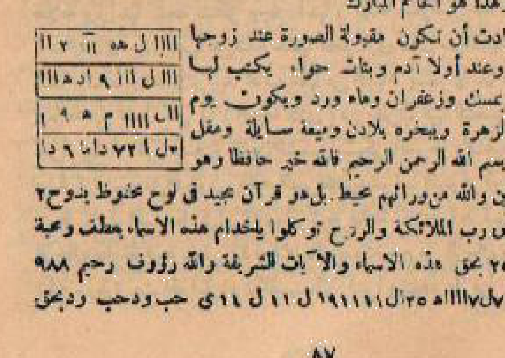

*Gambar Rajah Asli Halaman 89* — Wafaq angka keramat pelindung buruj Virgo bagi kaum wanita untuk kecerdasan manajemen rumah tangga, daya tarik mahabbah, dan tolak bala sihir.

---

## HALAMAN CETAK 90 (Halaman PDF 45, sisi kanan)

**[Teks Arab Asli]**

( البرج السابع من طوالع النساء: برج الميزان والزهرة )
وصاحبة فلك الميزان زهرتها الوضيئة * تدل على العدل والجمال والإنصاف
لها الشمائل الحسنة والسريرة المضيئة * وتلقى فى دهرها المودة والعفاف
تحب الألفة وتصلح بين الناس * وترزق فى عمرها برفع الباس

**[Transliterasi Latin Fonetik]**

*(al-burjis-saabi'u min thawaali'un-nisaa'i  burjul-Miizaani waz-Zuharati)*
*wa shaahibatu falak al-Miizaani zahratahaal-wadhii'ata * tadullu 'alaal-'adli wal-jamaali wal-inshaafi*
*lahaa asy-syamaa'ilil-hasanati was-sariiratil-mudhii'ati * wa talaqqaa fii dahrihaal-mawaddata wal-'afaafa*
*tuhibbul-ulfatu wa tashluhu baynan-naasi * wa turzaqu fii 'umruhaa biraf'il-baasi*

**[Terjemahan Indonesia]**

(Buruj Ketujuh dari Thali' Kaum Wanita: Buruj Libra dan Penguasanya: Venus)
*Penguasa orbit Libra bagi wanita adalah Venus sang bintang bercahaya benderang * Memberi petunjuk pada keadilan sikap, keanggunan estetika, dan keluhuran objektivitas*
*Ia dianugerahi perangai budi pekerti yang memikat dan batin yang bercahaya suci * Memetik kasih sayang tulus dan kehormatan diri di sepanjang hayatnya*
*Mencintai kerukunan dan mahir mendamaikan perselisihan antarmanusia * Serta dikaruniai di sepanjang rentang usianya dengan perlindungan dari segala mara bahaya.*

---

**[Gambar Rajah Asli Halaman 90 — Tilsm Buruj al-Mizan Kaum Wanita]**

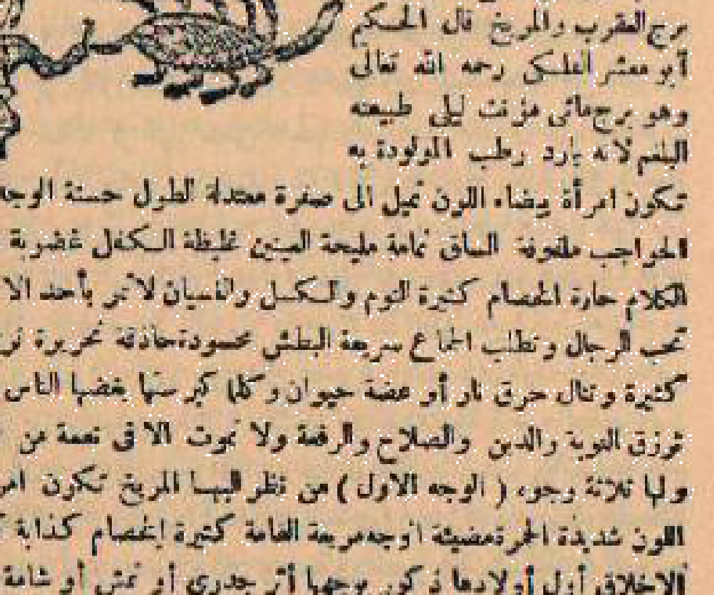

*Gambar Rajah Asli Halaman 90* — Gambar Tilsam simbolik buruj Libra untuk Thali' Kaum Wanita: Sosok permaisuri agung memegang dua daun timbangan keadilan di bawah naungan bintang Venus.

---

**[Teks Arab Asli]**

( القول على طبع الطالع واختلاف الوجوه للنسوة )
قال الحكيم: هى امرأة بيضاء اللون مشربة بحمرة خفيفة، حسنة الوجه والقوام، كحيلة الطرف، ناصعة الأسنان، ظريفة الكلام، محبوبة عند سائر الناس، ولها ثلاثة وجوه.

**[Transliterasi Latin Fonetik]**

*(al-qawli 'alaa thab'uth-thaali'u wa ikhtilaafil-wujuuhi lin-niswata)*
*qaalal-hakiimu  hiya imra'atun baydhaa'ul-lawni masyrabatan bi-humratin khufayfatin, hasanatun al-wajhu wal-qiwaami, kahiilatith-tharafi, naashi'atal-asnaani, zhariifatal-kilaami, mahbuubatan 'inda saa'irin-naasi, wa lahaa tsalaatsatun wujuuhin *

**[Terjemahan Indonesia]**

(Uraian watak dasar thali' wanita dan pembagian tiga wajahnya)
Berkata sang ahli hikmah: Wanita yang lahir bernaung di bawah buruj Libra berkulit putih bersih berpadu rona kemerahan cerah mempesona, berparas jelita dengan postur tubuh ideal, bermata indah bercelak alami, bergigi rapi putih berkilau, bertutur kata manis santun, sangat dicintai dan dikagumi oleh segenap masyarakat; dan ia terbagi atas tiga wajah (wajh).

---

**[Teks Arab Asli]**

( الوجه الأول ) من نظر إليها الزهرة: تكون امرأة بارعة الجمال، محبة للطيب والزينة والملابس الفاخرة، ذات دلال ولباقة، يعشقها زوجها ويكون لها حظ عظيم فى السعادة الزوجية، والله أعلم.

**[Transliterasi Latin Fonetik]**

*(al-wajhul-awwalu  min nazhara ilayhaa az-Zuharati  takuunu imra'atun baari'atul-jamaali, mahabbatan lith-thayyiba waz-zaynata wal-malaabisal-faakhirata, dzaat dalaalin wa labaaqatin, ya'asyaqahaa zawjuhaa wa yakuunu lahaa hazhzhun 'azhiimun fis-sa'aadatiz-zawjiyyati, wallaahu a'lamu *) **[Terjemahan Indonesia]**

(Wajah Pertama) Bagi yang dipandang oleh planet Venus: Ia berparas sangat jelita memikat pandangan, gemar mengenakan parfum wangi, perhiasan berkilau, dan busana-busana mewah bermartabat, bersikap manja anggun penuh tata krama, sangat dipuja oleh suaminya dan dinaungi keberuntungan besar dalam kebahagiaan rumah tangga. Wallahu a'lam.

---

**[Teks Arab Asli]**

( الوجه الثانى ) من نظر إليها عطارد: تكون امرأة فصيحة اللسان، ذات عقل وحكمة، تحسن الفصل بين المختلفات والتدبير فى الأمور العامة، وتكون مباركة فى رأيها، والله تعالى أعلم.

**[Transliterasi Latin Fonetik]**

*(al-wajhuts-tsaanii  min nazhara ilayhaa 'Uthaarida  takuunu imra'atun fa-shayhatul-lisaani, dzaat 'aqlin wa hukmatin, tahassunal-fashli baynal-mukhtalifaati wat-tadbiiri fil-umuuril-'aammati, wa takuunu mubaarakatun fii ra'yihaa, wallaahu Ta'aalaa a'lamu *) **[Terjemahan Indonesia]**

(Wajah Kedua) Bagi yang dipandang oleh planet Merkurius: Ia memiliki kefasihan lisan yang memukau, berwawasan luas dan penuh kebijaksanaan, sangat piawai menjadi juru damai dan mengatur berbagai urusan kemasyarakatan, serta pandangannya senantiasa membawa berkah kemaslahatan. Wallahu Ta'ala a'lam.

---

**[Teks Arab Asli]**

( الوجه الثالث ) من نظر إليها المشترى: تكون امرأة صالحة كريمة، ذات ورع وتقوى، تحب الخير وتعين الضعفاء، وتنال جاها ومالا وفيرا، وتعيش فى عز ورفعة، والله أعلم.

**[Transliterasi Latin Fonetik]**

*(al-wajhuts-tsaalitsu  min nazhara ilayhaal-Musytarii  takuunu imra'atun shaalihatu kariimatu, dzaat wa ra'in wa taqwaa, tuhibbul-khayri wa ta'ayyunudh-dhu'afaa'i, wa tanaalu jaahan wa maalan wa fiiran, wa ta'iisyu fii 'izzin wa raf'atin, wallaahu a'lamu *) **[Terjemahan Indonesia]**

(Wajah Ketiga) Bagi yang dipandang oleh planet Yupiter: Ia adalah wanita salihah yang amat dermawan, berjiwa wara' dan bertakwa mendalam, gemar menebar kebajikan dan membela kaum lemah, memperoleh kehormatan kedudukan dan limpahan harta, serta menjalani hidup dalam kemuliaan martabat. Wallahu a'lam.

---

## HALAMAN CETAK 91 (Halaman PDF 45, sisi kiri)

**[Teks Arab Asli]**

( بيت حياتها ومعيشتها ) الميزان والزهرة: تكون حياتها طيبة هنيئة، ومعيشتها واسعة ميسرة، تنال من الخير ما يغنيها، وتعيش فى ستر وصيانة، ولا تزال فى سعادة واطمئنان، ولا تموت إلا فى نعمة وفضل، والله أعلم.

**[Transliterasi Latin Fonetik]**

*(baytu hayaatihaa wa ma'iisyatihaa  al-Miizaani waz-Zuharati  takuunu hayaatihaa thayyibatu hanii'atu, wa ma'iisyatihaa waasi'atan maysiratin, tanaalu minal-khayri maa yughanniihaa, wa ta'iisyu fii sitrin wa shiyaanatin, wa laa tuzaalu fii sa'aadatin wa ithmi'naanin, wa laa tamuutu illaa fii ni'matin wa fadhlin, wallaahu a'lamu *) **[Terjemahan Indonesia]**

(Rumah kehidupan dan penghidupannya) Libra dan Venus: Garis kehidupannya diliputi ketentraman dan kebahagiaan; penghidupannya lapang dan penuh kemudahan; dianugerahi kecukupan rezeki yang membuatnya berkecukupan; hidup dalam pemeliharaan kehormatan; grafiknya terus menanjak dalam kedamaian jiwa; serta tidak berpulang melainkan dalam limpahan nikmat dan karunia Ilahi. Wallahu a'lam.

---

**[Teks Arab Asli]**

( بيت مالها وتجارتها ) العقرب والمريخ: تكتسب الأموال من التجارة الرابحة والعقارات والصنائع اليدوية، ويبارك الله فى مالها، وتجمع ثروة طيبة تدخرها لأولادها، والله أعلم.

**[Transliterasi Latin Fonetik]**

*(baytu maalihaa wa tijaaratihaa  al-'Aqrabi wal-Mirriikhi  taktasibul-amwaali minat-tijaaratir-raabihati wal-'aqaaraati wash-shanaa'i'il-yadawiyyati, wa yubaariku Allaahi fii maalihaa, wa tajammu'a tsarwati thiibatin taddakhiruhaa li-awlaadihaa, wallaahu a'lamu *) **[Terjemahan Indonesia]**

(Rumah harta dan perniagaannya) Scorpio dan Mars: Ia mendulang kekayaan dari sektor perniagaan yang menguntungkan, aset properti, dan kerajinan tangan bernilai tinggi; Allah melimpahkan keberkahan dalam hartanya; serta mampu menghimpun kekayaan yang berkah untuk masa depan anak-anaknya. Wallahu a'lam.

---

**[Teks Arab Asli]**

( بيت إخوتها وأخواتها ) القوس والمشترى: يكون لها إخوة وأخوات ذكورا وإناثا، ويكون بينهم مودة وتعاطف وبر، وتكون هى موضع سرهم ومحبتهم، ولا ترى منهم إلا ما يسرها، والله تعالى أعلم.

**[Transliterasi Latin Fonetik]**

*(baytu ikhwatihaa wa akhawaatihaa  al-Qawsi wal-Musytarii  yakuunu lahaa ikhwatin wa akhawaatin dzukuuran wa inaatsan, wa yakuunu baynahum mawaddatan wa ta'aathufa wa barin, wa takuunu hiya mawdhi'a sirrihim wa mahabbatihim, wa laa taraa minhum illaa maa yusrihaa, wallaahu Ta'aalaa a'lamu *) **[Terjemahan Indonesia]**

(Rumah saudara-saudaranya) Sagittarius dan Yupiter: Ia memiliki saudara kandung laki-laki dan perempuan; ikatan persaudaraan di antara mereka diliputi kehangatan kasih sayang dan saling tolong-menolong; dialah yang menjadi tempat curahan hati dan kesayangan keluarga; serta ia tidak melihat dari mereka melainkan hal-hal yang membahagiakan. Wallahu Ta'ala a'lam.

---

**[Teks Arab Asli]**

( بيت آبائها وأمهاتها ) الجدى وزحل: تنال من والديها برا ومحبة، وتكون مطيعة لهما محسنة إليهما، وتدفن أباها قبل أمها، وترث منهما مالا وبركة، والله أعلم.

**[Transliterasi Latin Fonetik]**

*(baytu aabaa'ihaa wa ummahaatihaa  al-Jadyi wa Zuhala  tanaalu min waalidayhaa barran wa mahabbatan, wa takuunu muthii'atun lahumaa muhsinatin ilayhimaa, wa tadfinu abaahaa qabla ummihaa, wa taritsu minhumaa maalan wa barakatin, wallaahu a'lamu *) **[Terjemahan Indonesia]**

(Rumah orang tuanya) Capricorn dan Saturnus: Ia memetik curahan kasih sayang dan doa tulus dari kedua orang tuanya; sangat patuh dan berbuat ihsan kepada keduanya; memakamkan ayahnya lebih dahulu sebelum ibunya; serta mewarisi dari keduanya harta peninggalan dan doa keberkahan. Wallahu a'lam.

---

**[Teks Arab Asli]**

( بيت أولادها وأفراحها ) الدلو وزحل: ترزق بأولاد مباركين نجباء ذكورا وإناثا، ويكون أولادها أصحاب عقل وجمال، وتنال منهم فرحا وسرورا عظيما، وتقر عينها بصلاحهم، والله أعلم.

**[Transliterasi Latin Fonetik]**

*(baytu awlaadihaa wa afraahihaa  ad-Dalwi wa Zuhala  turzaqu bi-awlaadin mubaarakiina nujabaa'i dzukuuran wa inaatsan, wa yakuunu awlaadihaa ashhaabu 'aqlin wa jamaalin, wa tanaalu minhum fa-rahan wa suruuran 'azhiiman, wa tuqirru 'aynahaa bishulaahihim, wallaahu a'lamu *) **[Terjemahan Indonesia]**

(Rumah anak-anak dan kebahagiaannya) Aquarius dan Saturnus: Ia dianugerahi putra dan putri yang berbakat cerdas dan rupawan; ia memetik kegembiraan dan kebanggaan yang mendalam atas mereka; serta sejuk pandangan matanya menyaksikan kesalehan hidup anak-anaknya. Wallahu a'lam.

---

**[Teks Arab Asli]**

( بيت أمراضها وأسقامها ) الحوت والمشترى: تصيبها أمراض الرطوبة والرياح فى المفاصل والصداع ووجع الظهر، فلتستعمل شراب العسل بالزنجبيل والدهن العطرى، وتتجنب الهواء البارد على الريق، والله أعلم.

**[Transliterasi Latin Fonetik]**

*(baytu amraadhihaa wa asqaamihaa  al-Huuti wal-Musytarii  tushiibuhaa amraadhin ar-ruthuubati war-riyaahi fil-mafaashili wash-shudaa'i wa waja'izh-zhahri, fa-latasta'milu syaraabul-'asali biz-zanjabiili wad-dihinnal-'atharaa, wa tatajannabul-hawaa'ul-baaridu 'alaa ar-rayyiqi, wallaahu a'lamu *) **[Terjemahan Indonesia]**

(Rumah penyakit dan keluhan fisiknya) Pisces dan Yupiter: Ia rentan mengalami keluhan pegal linu persendian akibat kelembapan tubuh, pusing kepala, dan nyeri punggung; maka dianjurkan rutin meminum madu jahe hangat dan mengoleskan minyak aromaterapi berkhasiat; serta menghindari paparan angin dingin saat perut kosong di pagi hari. Wallahu a'lam.

---

> **STATUS BATCH 9: SELESAI** (Halaman Cetak 82–91 / Halaman PDF 41–45).
> Rajah/wafaq/tilsam batch ini telah di-crop presisi, latar putih, tersimpan di folder `rajah/`:
> `rajah_p82_wafaq_nisa_saratan.png`, `rajah_p83_tilsam_nisa_asad.png`, `rajah_p86_wafaq_nisa_asad.png`, `rajah_p87_tilsam_nisa_sunbulah.png`, `rajah_p89_wafaq_nisa_sunbulah.png`, `rajah_p90_tilsam_nisa_mizan.png`.

---

# BATCH 10 — HALAMAN PDF 46–50 (HALAMAN CETAK 92–101)

---

## HALAMAN CETAK 92 (Halaman PDF 46, sisi kanan)

**[Teks Arab Asli]**

( بيت أزواجها وفراشها ) الحمل والمريخ: تتزوج برجل شجاع ذى مروءة وسخاء، يحبها حبا شديدا ويغار عليها غيرة حسنة، وتعيش معه فى هناء وعز، وتكون هى صاحبة الكلمة والتدبير فى بيتها، والله أعلم.

**[Transliterasi Latin Fonetik]**

*(baytu azwaajihaa wa firaasyihaa  al-Hamali wal-Mirriikhi  tatazawwaju bi-rajulin syajaa'i dzaa muruu'atan wa sakhaa'an, yuhibbuhaa hubbaa syadiidan wa yughaaru 'alayhaa ghayrata hasanatun, wa ta'iisyu ma'ahu fii hanaa'in wa 'izzin, wa takuunu hiya shaahibatal-kalimati wat-tadbiiri fii baytuhaa, wallaahu a'lamu *) **[Terjemahan Indonesia]**

(Rumah jodoh pernikahan dan peraduannya) Aries dan Mars: Ia dipersunting oleh seorang pria pemberani yang berjiwa ksatria dan amat dermawan; suaminya sangat mencintainya dengan cinta mendalam dan memiliki kecemburuan yang wajar untuk menjaganya; mereka membina rumah tangga dalam ketentraman dan kemuliaan; serta dialah yang dipercaya memegang kendali tata kelola rumah tangganya. Wallahu a'lam.

---

**[Teks Arab Asli]**

( بيت خوفها وموتها ) الثور والزهرة: يخاف عليها من أمراض البرودة وعوارض الرطوبة، وأعوام الخطر عندها: ثمانى سنين، وست عشرة سنة، وأربع وثلاثون سنة، وخمسون سنة، وسبعون سنة، فان سلمت منها عاشت إلى ثمانين سنة، والله أعلم.

**[Transliterasi Latin Fonetik]**

*(baytu khawfihaa wa mawtihaa  ats-Tsawri waz-Zuharati  yukhaafu 'alayhaa min amraadhin al-buruudati wa 'awaaridhir-ruthuubati, wa a'waamal-khuthuri 'indahaa  tsamaanii siniina, wa sitta 'asyrata sanatin, wa arba'i wa tsalaatsuuna sanatin, khamsuuna sanatin, sab'uuna sanatin, fa-in salimat minhaa 'aasyat ilaa tsamaaniina sanatin, wallaahu a'lamu *) **[Terjemahan Indonesia]**

(Rumah masa rawan dan krisis kesehatannya) Taurus dan Venus: Dikhawatirkan atasnya penyakit akibat udara dingin basah dan kelembapan tubuh; tahun-tahun rawan dalam siklus usianya adalah usia 8 tahun, 16 tahun, 34 tahun, 50 tahun, dan 70 tahun; jika ia berhasil melaluinya dengan selamat, usianya akan mencapai 80 tahun. Wallahu a'lam.

---

**[Teks Arab Asli]**

( بيت أسفارها وحركاتها ) الجوزاء وعطارد: تكون أسفارها مأمونة مباركة فى صحبة زوجها وأهلها، وتسافر إلى البلاد الحضرية والتجارات النافعة، وتنال فى أسفارها راحة وكرامة، والله أعلم.

**[Transliterasi Latin Fonetik]**

*(baytu asfaarihaa wa harakaatihaa  al-Jawzaa'i wa 'Uthaarida  takuunu asfaarihaa ma'muunata mubaarakatun fii shuhbati zawjuhaa wa ahlihaa, wa tusaafiru ilal-bilaadil-hadhriyyati wat-tijaaraatin-naafi'ati, wa tanaalu fii asfaarihaa raahatan wa karaamatan, wallaahu a'lamu *) **[Terjemahan Indonesia]**

(Rumah perjalanan dan pergerakannya) Gemini dan Merkurius: Perjalanannya senantiasa aman dan penuh berkah dengan didampingi oleh suami dan keluarganya; bepergian ke pusat-pusat kota peradaban dan pusat perniagaan yang menguntungkan; serta memetik kenyamanan dan kemuliaan di sepanjang perjalanannya. Wallahu a'lam.

---

**[Teks Arab Asli]**

( بيت عزها وشرفها ) السرطان والقمر: تنال شرفا ومكانة رفيعة بين النساء بحسن خلقها وجمالها ووقارها، وتكون محترمة الجانب مقبولة الشفاعة، ويثنى عليها الجميع، والله أعلم.

**[Transliterasi Latin Fonetik]**

*(baytu 'izzihaa wa syarafihaa  as-Sarathaani wal-Qamari  tanaalu syarafan wa makaanata rafii'ata baynan-nisaa'i bi-husni khalqihaa wa jamaalihaa wa waqaarihaa, wa takuunu muhtaramatul-jaanibi maqbuulatasy-syafaa'ati, wa yutsnaa 'alayhaal-jamii'i, wallaahu a'lamu *) **[Terjemahan Indonesia]**

(Rumah kemuliaan dan status sosialnya) Cancer dan Bulan: Ia meraih kehormatan dan kedudukan tinggi di tengah kaum wanita berkat keindahan budi pekerti, kecantikan paras, dan ketenangannya; disegani kewibawaannya dan diterima pertolongannya; serta menuai sanjungan pujian dari semua orang. Wallahu a'lam.

---

**[Teks Arab Asli]**

( بيت رجائها وآمالها ) الأسد والشمس: يبلغها الله ما ترجوه من تمام النعمة وصلاح الأحوال وبر الأولاد، ويرزقها الله عيشا رغيدا وخاتمة حسنة، والله أعلم.

**[Transliterasi Latin Fonetik]**

*(baytu rajaa'ihaa wa aamaalihaa  al-Asadi wasy-Syamsi  yablughuhaa Allaahi maa tarjuuhu min tamaamin-na'amati wa shalaahin al-ahwaali wa barril-awlaadi, wa yarzuquhaa Allaahi 'aysyan raghiidan wa khaatimata hasanatun, wallaahu a'lamu *) **[Terjemahan Indonesia]**

(Rumah harapan dan dambaannya) Leo dan Matahari: Allah menyampaikan dirinya pada apa yang ia dambakan berupa kesempurnaan nikmat, kemapanan kondisi keluarga, dan bakti anak-anaknya; serta dianugerahi kehidupan yang makmur sejahtera dan husnul khatimah. Wallahu a'lam.

---

**[Teks Arab Asli]**

( بيت أعدائها وحسادها ) السنبلة وعطارد: أعداؤها من بعض الحواسد اللاتى يحسدنها على حسن طلعتها وكمال عقلها، ويكفيها الله كيدهن ويجعلها منصورة عليهن، والله سبحانه أعلم.

**[Transliterasi Latin Fonetik]**

*(baytu a'daa'ihaa wa hussaadihaa  as-Sunbulati wa 'Uthaarida  a'daa'uhaa min ba'dhul-hawaasidil-laatii yahsudannahaa 'alaa hasanu thal'atihaa wa kamaali 'aqlihaa, wa yakfiihaa Allaahi kaydihinna wa yaj'aluhaa manshuuratun 'alayhunna, wallaahu Subhaanahu a'lamu *) **[Terjemahan Indonesia]**

(Rumah musuh dan para pendengkinya) Virgo dan Merkurius: Musuh-musuhnya hanyalah segelintir wanita pendengki yang iri menyaksikan keelokan paras wajahnya dan kesempurnaan daya pikirnya; namun Allah mencukupkan perlindungan dari tipu daya mereka dan menjadikannya senantiasa unggul menang. Wallahu Subhanahu wa Ta'ala a'lam.

---

## HALAMAN CETAK 93 (Halaman PDF 46, sisi kiri)

**[Teks Arab Asli]**

( ولصاحبة هذا البرج من أشكال الرمل شكل النصرة الخارجة )
قال الحكيم: اعلمى أيتها السائلة أن شكل النصرة الخارجة يدل على الظفر بالأمانى، والخروج من كل ضيق إلى فرج عاجل، وفتح أبواب الخير والبركة، فعليك بملازمة الشكر، واسمعى ما قيل:
نلت الظفر وبدت لك الآمال * وازداد عزا جاهك والمال
فاحمدى المولى على نعمائه * فبشكره تتبدل الأحوال

**[Transliterasi Latin Fonetik]**

*(wa li-shaahibati haadzaal-burji min asykaalir-ramli syaklun-nashratil-khaarijati)*
*qaalal-hakiimu  i'lamii ayyatuhas-saa'ilatu an syaklun-nashratil-khaarijati yadullu 'alaa azh-zhafari bil-amaan, wal-khuruuja min kullu dhayyiqin ilaa faraji 'aajili, wa fataha abwaabal-khayri wal-barakati, fa'alayka bimulaazimatisy-syukri, wa isma'ii maa qiila:*
*nultuzh-zhafara wa badat lak al-aamaali * wa izdaada 'izzan jaahika wal-maali*
*faahamadaal-mawlaa 'alaa na'maa'ihi * fa-bisyukrihi tatabaddalul-ahwaalu*

**[Terjemahan Indonesia]**

(Bagi pemilik buruj wanita ini dari bentuk-bentuk ilmu raml adalah bentuk *an-Nushrah al-Kharijah*)
Berkata sang ahli hikmah: Ketahuilah wahai wanita penanya, sesungguhnya bentuk an-Nushrah al-Kharijah melambangkan tercapainya cita-cita impian, keluarnya jiwa dari segala kesempitan menuju kelapangan yang segera tiba, serta terbukanya pintu-pintu kebajikan dan keberkahan; maka lazimkanlah bersyukur; simaklah bait syair bijak ini:
*Engkau telah meraih kemenangan dan harapan-harapan indah tampak nyata * Kian bertambah kemuliaan kedudukan martabat dan hartamu*
*Maka pujilah Tuhan Maha Pemelihara atas limpahan kenikmatan-Nya * Karena dengan bersyukur kepada-Nya segala keadaan berubah menjadi lebih indah.*

---

**[Gambar Rajah Asli Halaman 93 — Wafaq al-Mizan Kaum Wanita]**

*Gambar Rajah Asli Halaman 93* — Wafaq angka keramat pelindung buruj Libra bagi kaum wanita untuk daya pikat cinta sejati, keadilan rumah tangga, dan tolak bala perselisihan.

---

## HALAMAN CETAK 94 (Halaman PDF 47, sisi kanan)

**[Teks Arab Asli]**

( البرج الثامن من طوالع النساء: برج العقرب والمريخ )
وصاحبة فلك العقرب مريخها الحازم * يدل على الشجاعة والحدة واليقين
لها العزم القوى والوفاء اللازم * وتظفر فى دهرها بنصر مبين
تحب العفاف وتكرم الجار * وتلقى من الله الحفظ والوقار

**[Transliterasi Latin Fonetik]**

*(al-burjits-tsaaminu min thawaali'un-nisaa'i  burjul-'Aqrabi wal-Mirriikhi)*
*wa shaahibatu falak al-'Aqrabi mirriikhahaal-haazima * yadullu 'alaa asy-syajaa'ati wal-haddati wal-yaqiini*
*lahaal-'azmil-quwaa wal-wafaa'al-laazima * wa tazhfaru fii dahrihaa binashri mubayyani*
*tuhibbul-'afaafu wa takarrumul-jaari * wa talaqqaa min Allaahil-hifzhi wal-waqaari*

**[Terjemahan Indonesia]**

(Buruj Kedelapan dari Thali' Kaum Wanita: Buruj Scorpio dan Penguasanya: Mars)
*Penguasa orbit Scorpio bagi wanita adalah Mars sang bintang penegak tekad * Memberi petunjuk pada keteguhan hati, ketajaman insting batin, dan kemantapan keyakinan*
*Ia dianugerahi tekad yang kokoh membaja dan kesetiaan yang tak tergoyahkan * Berhasil meraih kemenangan yang nyata di sepanjang lembaran hidupnya*
*Mencintai kesucian kehormatan diri dan memuliakan para tetangga * Serta senantiasa dinaungi pemeliharaan dan wibawa kemuliaan dari Allah.*

---

**[Gambar Rajah Asli Halaman 94 — Tilsm Buruj al-Aqrab Kaum Wanita]**

*Gambar Rajah Asli Halaman 94* — Gambar Tilsam simbolik buruj Scorpio untuk Thali' Kaum Wanita: Sosok ksatria putri memegang pedang keadilan menundukkan kalajengking di bawah pengaruh planet Mars.

---

**[Teks Arab Asli]**

( القول على طبع الطالع واختلاف الوجوه للنسوة )
قال الحكيم الفلكى: هى امرأة سمراء اللون صافية البشرة أو مائلة إلى الحمرة، حسنة العينين، عريضة الجبين، قوية العزم، ذات مهابة وشجاعة، صريحة اللهجة، ولها ثلاثة وجوه.

**[Transliterasi Latin Fonetik]**

*(al-qawli 'alaa thab'uth-thaali'u wa ikhtilaafil-wujuuhi lin-niswata)*
*qaalal-hakiimul-Falakiyyu  hiya imra'atun samraa'al-lawni shaafiyatal-basyarati aw maa'ilatun ilal-humrati, hasanatun al-'aynayni, 'ariidhatal-jabiini, quwwiyyatal-'azmi, dzaat mahaabatin wa syajaa'atin, shariihatal-lahjati, wa lahaa tsalaatsatun wujuuhin *

**[Terjemahan Indonesia]**

(Uraian watak dasar thali' wanita dan pembagian tiga wajahnya)
Berkata sang ahli astrologi falak: Wanita yang lahir di bawah naungan buruj Scorpio ini berkulit sawo matang bersih memikat atau condong kemerahan merona, kedua matanya tajam berbinar indah, berdahi bidang cerah, bertekad membaja, berwibawa dan bernyali ksatria, jujur tegas dalam bertutur kata; dan ia memiliki tiga wajah (wajh).

---

**[Teks Arab Asli]**

( الوجه الأول ) من نظر إليها المريخ: تكون امرأة شجاعة حازمة، قوية الشخصية، تحسن تدبير شؤون بيتها بحزم وعدل، وتكون مهابة عند النساء والرجال، وتنال عزا وجاها، والله أعلم.

**[Transliterasi Latin Fonetik]**

*(al-wajhul-awwalu  min nazhara ilayhaal-Mirriikhi  takuunu imra'atun syajaa'ati haazimati, quwwiyyatasy-syakhshiyyati, tahassuna tadbiiri syu'uuni baytuhaa bihazmin wa 'adlin, wa takuunu mahaabatu 'indan-nisaa'i war-rijaali, wa tanaalu 'izzan wijaahan, wallaahu a'lamu *) **[Terjemahan Indonesia]**

(Wajah Pertama) Bagi yang dipandang oleh planet Mars: Ia menjadi wanita yang berjiwa teguh mandiri, berkepribadian tangguh, mengelola tata urusan rumah tangganya dengan ketegasan dan keadilan, disegani oleh kaum wanita maupun pria, serta meraih kemuliaan dan kedudukan terhormat. Wallahu a'lam.

---

**[Teks Arab Asli]**

( الوجه الثانى ) من نظر إليها الشمس: تكون امرأة ذات بهاء ورفعة، صبيحة الوجه، كريمة النفس، ترزق مالا كثيرا من جهة الأكابر، وتعيش فى رفاهية وعز، والله تعالى أعلم.

**[Transliterasi Latin Fonetik]**

*(al-wajhuts-tsaanii  min nazhara ilayhaa asy-Syamsi  takuunu imra'atun dzaat bahaa'in wa raf'atin, shabiihatal-wajhu, kariimatan-nafsi, turzaqu maalan katsiiran min jihatil-akaabiri, wa ta'iisyu fii ruffaahiyyatin wa 'izzin, wallaahu Ta'aalaa a'lamu *) **[Terjemahan Indonesia]**

(Wajah Kedua) Bagi yang dipandang oleh Matahari: Ia memancarkan keanggunan dan kemuliaan derajat, berparas wajah berseri memikat, berjiwa dermawan, dianugerahi limpahan kekayaan dari relasi terpandang, serta menjalani hari-harinya dalam kemakmuran dan kehormatan. Wallahu Ta'ala a'lam.

---

**[Teks Arab Asli]**

( الوجه الثالث ) من نظر إليها الزهرة: تكون امرأة لطيفة ظريفة، تحب الزينة والطيب والملابس الأنيقة، ذات دلال وجمال، يحبها زوجها ويكرم مقامها، والله أعلم.

**[Transliterasi Latin Fonetik]**

*(al-wajhuts-tsaalitsu  min nazhara ilayhaa az-Zuharati  takuunu imra'atun lathiifatu zhariifatu, tuhibbuz-zaynatu wath-thayyibu wal-malaabisul-aniiqatu, dzaat dalaalin wa jamaalin, yuhibbuhaa zawjuhaa wa yukarrimu maqaamuhaa, wallaahu a'lamu *) **[Terjemahan Indonesia]**

(Wajah Ketiga) Bagi yang dipandang oleh planet Venus: Ia adalah wanita yang sangat anggun mempesona, gemar mengenakan wewangian harum, perhiasan indah, dan busana-busana modis, berdaya pikat manja yang memikat, sangat disayangi suaminya dan dimuliakan kedudukannya. Wallahu a'lam.

---

## HALAMAN CETAK 95 (Halaman PDF 47, sisi kiri)

**[Teks Arab Asli]**

( بيت حياتها ومعيشتها ) العقرب والمريخ: تكون معيشتها طيبة قوية، وتكفى مؤنتها بحسن تدبيرها وشجاعتها، وتعيش مستورة الحال فى عفة وكرامة، ولا تموت إلا فى نعمة وسلام، والله أعلم.

**[Transliterasi Latin Fonetik]**

*(baytu hayaatihaa wa ma'iisyatihaa  al-'Aqrabi wal-Mirriikhi  takuunu ma'iisyatuhaa thayyibatu quwayatin, wa tukfaa mu'anatuhaa bi-husni tadbiirihaa wa syajaa'atihaa, wa ta'iisyu mastuuratul-haali fii 'iffatin wa karaamatin, wa laa tamuutu illaa fii ni'matin wa sullaamin, wallaahu a'lamu *) **[Terjemahan Indonesia]**

(Rumah kehidupan dan penghidupannya) Scorpio dan Mars: Penghidupannya berlangsung stabil, sejahtera, dan mandiri; tercukupi segala kebutuhannya berkat manajemen yang matang dan keteguhan mentalnya; hidup dalam keadaan terjaga kehormatannya; serta tidak berpulang melainkan dalam limpahan nikmat dan keselamatan dari Allah. Wallahu a'lam.

---

**[Teks Arab Asli]**

( بيت مالها وتجارتها ) القوس والمشترى: تكتسب الأموال من التجارة الرابحة والعقارات، وترزق ذهبا وحليا كثيرا، ويبارك الله فى مكاسبها، وتجمع ثروة تدخرها لأولادها، والله أعلم.

**[Transliterasi Latin Fonetik]**

*(baytu maalihaa wa tijaaratihaa  al-Qawsi wal-Musytarii  taktasibul-amwaali minat-tijaaratir-raabihati wal-'aqaaraati, wa turzaqu dzahabaa wa halyaa katsiiran, wa yubaariku Allaahi fii makaasibihaa, wa tajammu'a tsarwatin taddakhiruhaa li-awlaadihaa, wallaahu a'lamu *) **[Terjemahan Indonesia]**

(Rumah harta dan perniagaannya) Sagittarius dan Yupiter: Ia merengkuh kekayaan dari perniagaan yang menguntungkan dan kepemilikan aset properti; dianugerahi simpanan emas dan perhiasan berharga; Allah melimpahkan keberkahan dalam usahanya; serta mampu menabung kekayaan yang berharga bagi anak keturunannya. Wallahu a'lam.

---

**[Teks Arab Asli]**

( بيت إخوتها وأخواتها ) الجدى وزحل: يكون لها إخوة تحسن إليهم وتعينهم فى نوائب الدهر، وتكون هى موضع ثقتهم ومحبتهم، ويدوم بينهم الود والتعاطف، والله تعالى أعلم.

**[Transliterasi Latin Fonetik]**

*(baytu ikhwatihaa wa akhawaatihaa  al-Jadyi wa Zuhala  yakuunu lahaa ikhwatin tahassunin ilayhim wa tu'ayyinuhum fii nawaa'ibid-dahri, wa takuunu hiya mawdhi'a tsiqatihim wa mahabbatihim, wa yudawwimu baynahum al-wadda wat-ta'aathufa, wallaahu Ta'aalaa a'lamu *) **[Terjemahan Indonesia]**

(Rumah saudara-saudaranya) Capricorn dan Saturnus: Ia memiliki saudara kandung yang sangat ia sayangi dan ia bantu di saat menghadapi kesulitan hidup; dialah yang menjadi tempat tumpuan kepercayaan dan kasih sayang keluarga; serta ikatan persaudaraan mereka berlangsung harmonis. Wallahu Ta'ala a'lam.

---

**[Teks Arab Asli]**

( بيت آبائها وأمهاتها ) الدلو وزحل: تنال من والديها دعاء مباركا ورضا حسنا، وتكون مطيعة لهما بارة بهما، وتدفن أباها قبل أمها، وترث منهما مالا حلالا، والله أعلم.

**[Transliterasi Latin Fonetik]**

*(baytu aabaa'ihaa wa ummahaatihaa  ad-Dalwi wa Zuhala  tanaalu min waalidayhaa du'aa'an mubaarakan wa ridhaa hissinaa, wa takuunu muthii'atun lahumaa baarratin bihimaa, wa tadfinu abaahaa qabla ummihaa, wa taritsu minhumaa maalan halaalan, wallaahu a'lamu *) **[Terjemahan Indonesia]**

(Rumah orang tuanya) Aquarius dan Saturnus: Ia memetik curahan doa berkah dan keridhaan yang tulus dari kedua orang tuanya; sangat berbakti dan taat kepada keduanya; memakamkan ayahnya lebih dahulu sebelum ibunya; serta mewarisi dari keduanya harta peninggalan yang halal. Wallahu a'lam.

---

**[Teks Arab Asli]**

( بيت أولادها وأفراحها ) الحوت والمشترى: ترزق بأولاد ذكور وإناث يكونون لها قرة عين وسرورا، ويكون أولادها أصحاب شجاعة وصلاح، وتقر عينها برؤيتهم فى أحسن حال، والله أعلم.

**[Transliterasi Latin Fonetik]**

*(baytu awlaadihaa wa afraahihaa  al-Huuti wal-Musytarii  turzaqu bi-awlaadin dzukuurin wa inaatsi yukawwinuuna lahaa qarratin 'ayn wa suruuran, wa yakuunu awlaadihaa ashhaabu syajaa'atin wa shalaahin, wa tuqirru 'aynahaa biru'yatihim fii ahsanu haali, wallaahu a'lamu *) **[Terjemahan Indonesia]**

(Rumah anak-anak dan kebahagiaannya) Pisces dan Yupiter: Ia dikaruniai putra dan putri yang menjadi penyejuk pandangan mata dan sumber kebahagiaannya; anak-anaknya tumbuh tangguh berani dan berakhlak saleh; serta sejuk pandangan matanya menyaksikan mereka meraih kesuksesan hidup. Wallahu a'lam.

---

**[Teks Arab Asli]**

( بيت أمراضها وأسقامها ) الحمل والمريخ: تصيبها أمراض الحرارة فى الرأس والصداع ووجع الظهر والبطن، فلتستعمل شراب السكنجبين والتمر هندى، وتتجنب الأطعمة الحارة، والله أعلم.

**[Transliterasi Latin Fonetik]**

*(baytu amraadhihaa wa asqaamihaa  al-Hamali wal-Mirriikhi  tushiibuhaa amraadhin al-haraarati fir-ra'si wash-shudaa'i wa waja'izh-zhahri wal-bathni, fa-latasta'milu syaraabus-sakanjabiini wat-tamri hindiyyun, wa tatajannabul-ath'imatul-haarratu, wallaahu a'lamu *) **[Terjemahan Indonesia]**

(Rumah penyakit dan keluhan fisiknya) Aries dan Mars: Ia rentan mengalami keluhan sakit kepala panas, nyeri punggung, dan gangguan organ perut; maka dianjurkan rutin meminum oxymel (sikinjabin) dan sari asam jawa; serta menjauhi makanan-makanan yang bersifat terlalu pedas dan panas. Wallahu a'lam.

---

## HALAMAN CETAK 96 (Halaman PDF 48, sisi kanan)

**[Teks Arab Asli]**

( بيت أزواجها وفراشها ) الثور والزهرة: تتزوج برجل شريف كريم ذى مال وحسب، يحبها ويكرمها، وتعيش معه فى هناء ورغد، وتدوم بينهما المحبة والألفة طوال العمر، والله أعلم.

**[Transliterasi Latin Fonetik]**

*(baytu azwaajihaa wa firaasyihaa  ats-Tsawri waz-Zuharati  tatazawwaju bi-rajulin syariifi kariimi dzaa maalin wahasb, yuhibbuhaa wa yukarrimuhaa, wa ta'iisyu ma'ahu fii hanaa'in wa raghadin, wa tudawwimu baynahumaal-mahabbata wal-alfata thuwaalul-'umri, wallaahu a'lamu *) **[Terjemahan Indonesia]**

(Rumah jodoh pernikahan dan peraduannya) Taurus dan Venus: Ia dipersunting oleh seorang pria terhormat berjiwa dermawan yang memiliki kekayaan dan nasab mulia; suaminya sangat mencintainya dan memuliakan kedudukannya; mereka menjalani bahtera rumah tangga dalam ketentraman dan kemakmuran; serta keharmonisan di antara mereka berlangsung abadi sepanjang usia. Wallahu a'lam.

---

**[Teks Arab Asli]**

( بيت خوفها وموتها ) الجوزاء وعطارد: يخاف عليها من أمراض الحرارة الحادة وعوارض الهواء، وأعوام الخطر عندها: تسع سنين، وثمانى عشرة سنة، وسبع وثلاثون سنة، وخمسون سنة، وسبعون سنة، فان سلمت منها عاشت إلى خمس وثمانين سنة، والله أعلم.

**[Transliterasi Latin Fonetik]**

*(baytu khawfihaa wa mawtihaa  al-Jawzaa'i wa 'Uthaarida  yukhaafu 'alayhaa min amraadhin al-haraaratil-haaddati wa 'awaaridhil-hawaa'i, wa a'waamal-khuthuri 'indahaa  tasa'u siniina, watsamaan 'asyrata sanatin, wa sab'i wa tsalaatsuuna sanatin, khamsuuna sanatin, sab'uuna sanatin, fa-in salimat minhaa 'aasyat ilaa khamsi wa tsamaaniina sanatin, wallaahu a'lamu *) **[Terjemahan Indonesia]**

(Rumah masa rawan dan krisis kesehatannya) Gemini dan Merkurius: Dikhawatirkan atasnya penyakit demam panas akut dan gangguan cuaca ekstrem; tahun-tahun rawan dalam siklus usianya adalah usia 9 tahun, 18 tahun, 37 tahun, 50 tahun, dan 70 tahun; jika ia berhasil melaluinya dengan selamat, usianya akan mencapai 85 tahun. Wallahu a'lam.

---

**[Teks Arab Asli]**

( بيت أسفارها وحركاتها ) السرطان والقمر: تكون أسفارها ميمونة مباركة فى صحبة محارمها، وتسافر إلى البلاد القريبة والبعيدة فى سلامة وتوفيق، والله أعلم.

**[Transliterasi Latin Fonetik]**

*(baytu asfaarihaa wa harakaatihaa  as-Sarathaani wal-Qamari  takuunu asfaarihaa maymuunata mubaarakatun fii shuhbati mahaarimihaa, wa tusaafiru ilal-bilaadil-qariibati wal-ba'iidati fii sullaamatin wa tawfiiqin, wallaahu a'lamu *) **[Terjemahan Indonesia]**

(Rumah perjalanan dan pergerakannya) Cancer dan Bulan: Aktivitas perjalanannya senantiasa membawa keberkahan dengan didampingi oleh mahramnya; bepergian ke berbagai wilayah dalam naungan keselamatan dan kemudahan. Wallahu a'lam.

---

**[Teks Arab Asli]**

( بيت عزها وشرفها ) الأسد والشمس: تنال عزا عظيما ومكانة سامية بين النساء بحزمها وشجاعتها، وتكون مهابة الجانب محترمة الكلمة عند الجميع، والله أعلم.

**[Transliterasi Latin Fonetik]**

*(baytu 'izzihaa wa syarafihaa  al-Asadi wasy-Syamsi  tanaalu 'izzan 'azhiiman wa makaanatu saammiyyatu baynan-nisaa'i bihazmihaa wa syajaa'atihaa, wa takuunu mahaabatul-jaanibi muhtaramatal-kalimati 'indal-jamii'i, wallaahu a'lamu *) **[Terjemahan Indonesia]**

(Rumah kemuliaan dan status sosialnya) Leo dan Matahari: Ia merengkuh kemuliaan yang agung dan kedudukan tinggi di tengah kaum wanita berkat keteguhan dan keberaniannya; disegani kewibawaannya dan dihormati perkataannya oleh semua orang. Wallahu a'lam.

---

**[Teks Arab Asli]**

( بيت رجائها وآمالها ) السنبلة وعطارد: يبلغها الله ما ترجوه من صلاح بيتها وراحة بالها وبر أولادها، وترزق عيشا قارا وخاتمة حسنة، والله أعلم.

**[Transliterasi Latin Fonetik]**

*(baytu rajaa'ihaa wa aamaalihaa  as-Sunbulati wa 'Uthaarida  yablughuhaa Allaahi maa tarjuuhu min shalaahi baytuhaa wa raahati bil-haa wa barri awlaadihaa, wa turzaqu 'aysyaa qaarraa wa khaatimatu hasanatun, wallaahu a'lamu *) **[Terjemahan Indonesia]**

(Rumah harapan dan dambaannya) Virgo dan Merkurius: Allah menyampaikan dirinya pada apa yang ia dambakan berupa keharmonisan rumah tangganya, ketentraman jiwanya, dan bakti anak-anaknya; serta dianugerahi kehidupan yang mapan dan husnul khatimah. Wallahu a'lam.

---

**[Teks Arab Asli]**

( بيت أعدائها وحسادها ) الميزان والزهرة: أعداؤها من بعض الحواسد اللاتى يحسدنها على شجاعتها وحسن حالها، ويكفيها الله كيدهن ويحفظها من كل مكروه، والله سبحانه أعلم.

**[Transliterasi Latin Fonetik]**

*(baytu a'daa'ihaa wa hussaadihaa  al-Miizaani waz-Zuharati  a'daa'uhaa min ba'dhul-hawaasidil-laatii yahsudannahaa 'alaa syajaa'atihaa wa husni haalihaa, wa yakfiihaa Allaahi kaydihinna wa yahfazhuhaa min kullu makruuhin, wallaahu Subhaanahu a'lamu *) **[Terjemahan Indonesia]**

(Rumah musuh dan para pendengkinya) Libra dan Venus: Musuh-musuhnya hanyalah segelintir wanita pendengki yang iri melihat ketangguhan dan kemapanan hidupnya; namun Allah mencukupkan perlindungan dari tipu daya mereka dan memeliharanya dari segala marabahaya. Wallahu Subhanahu wa Ta'ala a'lam.

---

## HALAMAN CETAK 97 (Halaman PDF 48, sisi kiri)

**[Teks Arab Asli]**

( ولصاحبة هذا البرج من أشكال الرمل شكل الحمرة )
قال الحكيم: اعلمى أيتها السائلة أن شكل الحمرة يدل على الغلبة والظفر على كل من عاداك، ودفع كيد الحواسد، ونيل المراد بالصبر والشجاعة، فعليك بالتقوى، واسمعى ما قيل:
ظفرت بما ترجين من رفعة العلى * وكافاك رب العرش خيرا وأجزلا
فلا ترهبى كيد العدا إن كيدهم * يزول بإذن الله حتما ومجملا

**[Transliterasi Latin Fonetik]**

*(wa li-shaahibati haadzaal-burji min asykaalir-ramli syaklul-humrati)*
*qaalal-hakiimu  i'lamii ayyatuhas-saa'ilatu an syaklul-humrati yadullu 'alaal-ghulbati wazh-zhafari 'alaa kullu min 'aadaaka, wa dafa'a kayadil-hawaasidi, wa niilal-muraadu bish-shabri wasy-syajaa'ati, fa'alayka bit-taqwaa, wa isma'ii maa qiila:*
*zhafirat bimaa tarajjayni min raf'atil-'Aliyyi * wa kaafaaka rabbil-'arsyi khayran wa ajzalaa*
*fa-laa tarahabaa kayadil-'idaa inna kaydihim * yuzawwilu bi-idzni Allaahi hatman wa mujmalan*

**[Terjemahan Indonesia]**

(Bagi pemilik buruj wanita ini dari bentuk-bentuk ilmu raml adalah bentuk *al-Humrah*)
Berkata sang ahli hikmah: Ketahuilah wahai wanita penanya, sesungguhnya bentuk al-Humrah menunjukkan keunggulan dan kemenangan mutlak atas siapa saja yang memusuhi dirimu, tertolaknya tipu daya para pendengki, serta tercapainya impian melalui kesabaran dan keberanian; maka lazimkanlah ketakwaan; simaklah bait syair bijak ini:
*Engkau telah memenangkan apa yang kau impikan berupa ketinggian martabat * Dan Tuhan Pemelihara 'Arsy membalasmu dengan kebaikan yang berlimpah*
*Janganlah takut pada tipu muslihat musuh karena sesungguhnya rencana jahat mereka * Pasti akan binasa dan lenyap dengan izin Allah secara sempurna.*

---

**[Gambar Rajah Asli Halaman 97 — Wafaq al-Aqrab Kaum Wanita]**

*Gambar Rajah Asli Halaman 97* — Wafaq angka keramat pelindung buruj Scorpio bagi kaum wanita untuk benteng kekebalan batin, tolak bala sihir, dan wibawa kepemimpinan.

---

## HALAMAN CETAK 98 (Halaman PDF 49, sisi kanan)

**[Teks Arab Asli]**

( البرج التاسع من طوالع النساء: برج القوس والمشترى )
وصاحبة فلك القوس مشتريها السعيد * يدل على الدين والعقل والسخاء
لها الفؤاد الطيب والرأى السديد * وتظفر فى دهرها بالرفعة والبهاء
تحب المبرة وتكرم الضيفان * وترزق فى عمرها بفيض الإحسان

**[Transliterasi Latin Fonetik]**

*(al-burjit-taasi'u min thawaali'un-nisaa'i  burjul-Qawsi wal-Musytarii)*
*wa shaahibatu falak al-Qawsi musytariyihaa as-sa'iidi * yadullu 'alaa ad-diini wal-'aqli was-sakhaa'i*
*lahaal-fu'aadith-thayyibi waalara'aa as-sadiida * wa tazhfaru fii dahrihaa bir-raf'ati wal-bahaa'i*
*tuhibbul-mabarratu wa takarrumudh-dhayfaani * wa turzaqu fii 'umruhaa bifaydhil-ahsaani*

**[Terjemahan Indonesia]**

(Buruj Kesembilan dari Thali' Kaum Wanita: Buruj Sagittarius dan Penguasanya: Yupiter)
*Penguasa peredaran Sagittarius bagi wanita adalah Yupiter sang bintang pembawa berkah kebahagiaan * Memberi petunjuk pada kemantapan agama, kearifan akal, dan keluhuran derma*
*Ia dianugerahi hati nurani yang tulus bersih dan pandangan yang lurus tepat * Merengkuh di sepanjang usianya dengan ketinggian derajat dan pesona anggun*
*Mencintai amal kebajikan dan gemar memuliakan para tetamu * Serta dilimpahi di sepanjang hayatnya dengan curahan kebaikan ihsan.*

---

**[Gambar Rajah Asli Halaman 98 — Tilsm Buruj al-Qaus Kaum Wanita]**

*Gambar Rajah Asli Halaman 98* — Gambar Tilsam simbolik buruj Sagittarius untuk Thali' Kaum Wanita: Sosok permaisuri ksatria pemanah membawa busur emas dan panji keberuntungan di bawah naungan bintang Yupiter.

---

**[Teks Arab Asli]**

( القول على طبع الطالع واختلاف الوجوه للنسوة )
قال الحكيم الفلكى: هى امرأة بيضاء اللون مشربة بحمرة، حسنة القد والقامة، مليحة الوجه، واسعة الصدر، صادقة اللهجة، محبوبة عند أهل الخير، ولها ثلاثة وجوه.

**[Transliterasi Latin Fonetik]**

*(al-qawli 'alaa thab'uth-thaali'u wa ikhtilaafil-wujuuhi lin-niswata)*
*qaalal-hakiimul-Falakiyyu  hiya imra'atun baydhaa'ul-lawni masyrabatan bi-humratin, hasanatun al-qaddi wal-qaamati, maliihatal-wajhu, waasi'atan ash-shadri, shaadiqatal-lahjati, mahbuubatan 'inda ahlil-khayri, wa lahaa tsalaatsatun wujuuhin *

**[Terjemahan Indonesia]**

(Uraian watak dasar thali' wanita dan pembagian tiga wajahnya)
Berkata sang ahli astrologi falak: Wanita yang lahir bernaung di bawah buruj Sagittarius berkulit putih bersih merona kemerahan cerah, berpostur tubuh proporsional tinggi anggun, berwajah rupawan manis berseri, berdada bidang lapang, jujur tulus dalam bertutur kata, sangat dicintai di kalangan orang-orang saleh; dan ia memiliki tiga wajah (wajh).

---

**[Teks Arab Asli]**

( الوجه الأول ) من نظر إليها المشترى: تكون امرأة صالحة عابدة، ذات فقه وحكمة، تحسن تدبير شؤون بيتها وتربية أولادها على طاعة الله، وتنال خيرا كثيرا، والله أعلم.

**[Transliterasi Latin Fonetik]**

*(al-wajhul-awwalu  min nazhara ilayhaal-Musytarii  takuunu imra'atun shaalihatu 'aabidatu, dzaat fiqhin wa hukmatin, tahassuna tadbiiri syu'uuni baytuhaa wa tarbiyati awlaadihaa 'alaa thaa'ati Allaahi, wa tanaalu khayran katsiiran, wallaahu a'lamu *) **[Terjemahan Indonesia]**

(Wajah Pertama) Bagi yang dipandang oleh planet Yupiter: Ia menjadi wanita salihah yang tekun beribadah, memiliki pemahaman agama dan kebijaksanaan hikmah yang mendalam, mendidik putra-putrinya di atas ketaatan kepada Allah, serta dianugerahi kelimpahan kebaikan yang berlimpah. Wallahu a'lam.

---

**[Teks Arab Asli]**

( الوجه الثانى ) من نظر إليها الشمس: تكون امرأة ذات رفعة وجاه، صبيحة الوجه، كريمة النفس، ترزق مالا كثيرا وعزا، وتكون محترمة ومطاعة فى قومها، والله تعالى أعلم.

**[Transliterasi Latin Fonetik]**

*(al-wajhuts-tsaanii  min nazhara ilayhaa asy-Syamsi  takuunu imra'atun dzaat raf'atin wa jaahin, shabiihatal-wajhu, kariimatan-nafsi, turzaqu maalan katsiiran wa 'izzan, wa takuunu muhtaramatun wa muthaa'atun fii qawmihaa, wallaahu Ta'aalaa a'lamu *) **[Terjemahan Indonesia]**

(Wajah Kedua) Bagi yang dipandang oleh Matahari: Ia memancarkan wibawa dan kedudukan terpandang, berwajah cerah bersinar memikat, berjiwa mulia dermawan, dianugerahi kekayaan melimpah dan status sosial tinggi, serta dihormati dan ditaati pandangannya di tengah masyarakat. Wallahu Ta'ala a'lam.

---

**[Teks Arab Asli]**

( الوجه الثالث ) من نظر إليها الزهرة: تكون امرأة ظريفة حسناء، محبة للطيب والزينة والملابس الفاخرة، ذات حظ عظيم فى السعادة والمحبة، والله أعلم.

**[Transliterasi Latin Fonetik]**

*(al-wajhuts-tsaalitsu  min nazhara ilayhaa az-Zuharati  takuunu imra'atun zhariifatu hasnaa'i, mahabbatan lith-thayyiba waz-zaynata wal-malaabisal-faakhirata, dzaat hazhzhun 'azhiimun fis-sa'aadati wal-mahabbati, wallaahu a'lamu *) **[Terjemahan Indonesia]**

(Wajah Ketiga) Bagi yang dipandang oleh planet Venus: Ia berparas sangat cantik jelita dan modis, gemar mengenakan wewangian harum, perhiasan indah, dan busana-busana mewah bermartabat, serta dinaungi peruntungan besar dalam keharmonisan asmara dan kebahagiaan hidup. Wallahu a'lam.

---

## HALAMAN CETAK 99 (Halaman PDF 49, sisi kiri)

**[Teks Arab Asli]**

( بيت حياتها ومعيشتها ) القوس والمشترى: تكون حياتها فى عافية وسعة، ومعيشتها هنيئة رغيدة، تنال من الخير ما يغنيها عن الناس، ولا تزال فى ارتقاء وسعادة، ولا تموت إلا فى نعمة وسلام، والله أعلم.

**[Transliterasi Latin Fonetik]**

*(baytu hayaatihaa wa ma'iisyatihaa  al-Qawsi wal-Musytarii  takuunu hayaatihaa fii 'aafiyati wus'atin, wa ma'iisyatihaa hanii'atu raghiidatin, tanaalu minal-khayri maa yughanniihaa 'an an-naasi, wa laa tuzaalu fii irtiqaa'in wa sa'aadatin, wa laa tamuutu illaa fii ni'matin wa sullaamin, wallaahu a'lamu *) **[Terjemahan Indonesia]**

(Rumah kehidupan dan penghidupannya) Sagittarius dan Yupiter: Garis kehidupannya diliputi kesehatan afiat dan kelapangan rezeki; penghidupannya amat tentram dan sejahtera; dianugerahi kecukupan yang membuatnya tidak bergantung pada orang lain; senantiasa menanjak dalam kebahagiaan; serta tidak berpulang melainkan dalam limpahan nikmat dan keselamatan dari Allah. Wallahu a'lam.

---

**[Teks Arab Asli]**

( بيت مالها وتجارتها ) الجدى وزحل: تكتسب الأموال من التجارة الرابحة والعقارات والصنائع اليدوية، ويبارك الله فى مالها، وتجمع ثروة طيبة تدخرها لأولادها، والله أعلم.

**[Transliterasi Latin Fonetik]**

*(baytu maalihaa wa tijaaratihaa  al-Jadyi wa Zuhala  taktasibul-amwaali minat-tijaaratir-raabihati wal-'aqaaraati wash-shanaa'i'il-yadawiyyati, wa yubaariku Allaahi fii maalihaa, wa tajammu'a tsarwati thiibatin taddakhiruhaa li-awlaadihaa, wallaahu a'lamu *) **[Terjemahan Indonesia]**

(Rumah harta dan perniagaannya) Capricorn dan Saturnus: Ia mendulang kekayaan dari sektor perniagaan yang berkah, kepemilikan aset properti, dan keterampilan kerajinan tangan bernilai tinggi; Allah melipatgandakan keberkahan dalam hartanya; serta mampu menabung kekayaan yang berharga untuk masa depan anak-anaknya. Wallahu a'lam.

---

**[Teks Arab Asli]**

( بيت إخوتها وأخواتها ) الدلو وزحل: يكون لها إخوة وأخوات ذكورا وإناثا، ويكون بينهم مودة وتعاطف وبر، وتكون هى موضع سرهم ومحبتهم، ولا ترى منهم إلا ما يسرها، والله تعالى أعلم.

**[Transliterasi Latin Fonetik]**

*(baytu ikhwatihaa wa akhawaatihaa  ad-Dalwi wa Zuhala  yakuunu lahaa ikhwatin wa akhawaatin dzukuuran wa inaatsan, wa yakuunu baynahum mawaddatan wa ta'aathufa wa barin, wa takuunu hiya mawdhi'a sirrihim wa mahabbatihim, wa laa taraa minhum illaa maa yusrihaa, wallaahu Ta'aalaa a'lamu *) **[Terjemahan Indonesia]**

(Rumah saudara-saudaranya) Aquarius dan Saturnus: Ia memiliki saudara kandung laki-laki dan perempuan; ikatan persaudaraan di antara mereka terjalin harmonis penuh kasih sayang dan saling tolong-menolong; dialah yang menjadi tempat curahan hati dan kesayangan keluarga; serta ia tidak melihat dari mereka melainkan kebaikan. Wallahu Ta'ala a'lam.

---

**[Teks Arab Asli]**

( بيت آبائها وأمهاتها ) الحوت والمشترى: تنال من والديها برا ومحبة، وتكون مطيعة لهما محسنة إليهما، وتدفن أباها قبل أمها، وترث منهما مالا وبركة، والله أعلم.

**[Transliterasi Latin Fonetik]**

*(baytu aabaa'ihaa wa ummahaatihaa  al-Huuti wal-Musytarii  tanaalu min waalidayhaa barran wa mahabbatan, wa takuunu muthii'atun lahumaa muhsinatin ilayhimaa, wa tadfinu abaahaa qabla ummihaa, wa taritsu minhumaa maalan wa barakatin, wallaahu a'lamu *) **[Terjemahan Indonesia]**

(Rumah orang tuanya) Pisces dan Yupiter: Ia memetik curahan kasih sayang dan doa tulus dari kedua orang tuanya; sangat berbakti dan berbuat ihsan kepada keduanya; memakamkan ayahnya lebih dahulu sebelum ibunya; serta mewarisi dari keduanya warisan harta dan doa keberkahan. Wallahu a'lam.

---

**[Teks Arab Asli]**

( بيت أولادها وأفراحها ) الحمل والمريخ: ترزق بأولاد مباركين نجباء ذكورا وإناثا، ويكون أولادها أصحاب عقل وشجاعة، وتنال منهم فرحا وسرورا عظيما، وتقر عينها بصلاحهم، والله أعلم.

**[Transliterasi Latin Fonetik]**

*(baytu awlaadihaa wa afraahihaa  al-Hamali wal-Mirriikhi  turzaqu bi-awlaadin mubaarakiina nujabaa'i dzukuuran wa inaatsan, wa yakuunu awlaadihaa ashhaabu 'aqlin wa syajaa'atin, wa tanaalu minhum fa-rahan wa suruuran 'azhiiman, wa tuqirru 'aynahaa bishulaahihim, wallaahu a'lamu *) **[Terjemahan Indonesia]**

(Rumah anak-anak dan kebahagiaannya) Aries dan Mars: Ia dianugerahi putra dan putri yang berbakat cerdas dan berjiwa ksatria; ia memetik kegembiraan dan kebanggaan yang mendalam atas mereka; serta sejuk pandangan matanya menyaksikan kesalehan hidup anak-anaknya. Wallahu a'lam.

---

**[Teks Arab Asli]**

( بيت أمراضها وأسقامها ) الثور والزهرة: تصيبها أمراض الرطوبة والرياح فى المفاصل والصداع ووجع الظهر، فلتستعمل شراب العسل بالزنجبيل والدهن العطرى، وتتجنب الهواء البارد على الريق، والله أعلم.

**[Transliterasi Latin Fonetik]**

*(baytu amraadhihaa wa asqaamihaa  ats-Tsawri waz-Zuharati  tushiibuhaa amraadhin ar-ruthuubati war-riyaahi fil-mafaashili wash-shudaa'i wa waja'izh-zhahri, fa-latasta'milu syaraabul-'asali biz-zanjabiili wad-dihinnal-'atharaa, wa tatajannabul-hawaa'ul-baaridu 'alaa ar-rayyiqi, wallaahu a'lamu *) **[Terjemahan Indonesia]**

(Rumah penyakit dan keluhan fisiknya) Taurus dan Venus: Ia rentan mengalami keluhan pegal linu persendian akibat kelembapan tubuh, pusing kepala, dan nyeri punggung; maka dianjurkan rutin meminum madu jahe hangat dan mengoleskan minyak aromaterapi berkhasiat; serta menghindari paparan angin dingin saat perut kosong di pagi hari. Wallahu a'lam.

---

## HALAMAN CETAK 100 (Halaman PDF 50, sisi kanan)

**[Teks Arab Asli]**

( بيت أزواجها وفراشها ) الجوزاء وعطارد: تتزوج برجل صالح كريم ذى علم وحسب، يحبها ويكرمها، وتعيش معه فى هناء ورغد، وتدوم بينهما المحبة والألفة طوال العمر، والله أعلم.

**[Transliterasi Latin Fonetik]**

*(baytu azwaajihaa wa firaasyihaa  al-Jawzaa'i wa 'Uthaarida  tatazawwaju bi-rajulin shaalihi kariimi dzaa 'ilmun wahasb, yuhibbuhaa wa yukarrimuhaa, wa ta'iisyu ma'ahu fii hanaa'in wa raghadin, wa tudawwimu baynahumaal-mahabbata wal-alfata thuwaalul-'umri, wallaahu a'lamu *) **[Terjemahan Indonesia]**

(Rumah jodoh pernikahan dan peraduannya) Gemini dan Merkurius: Ia dipersunting oleh seorang pria saleh nan dermawan yang memiliki kedalaman ilmu dan nasab terhormat; suaminya sangat mencintainya dan memuliakan kedudukannya; mereka menjalani bahtera rumah tangga dalam ketentraman dan kemakmuran; serta keharmonisan di antara mereka berlangsung abadi sepanjang usia. Wallahu a'lam.

---

**[Teks Arab Asli]**

( بيت خوفها وموتها ) السرطان والقمر: يخاف عليها من أمراض الرطوبة وعوارض المياه، وأعوام الخطر عندها: عشر سنين، وعشرون سنة، وثلاثون سنة، وخمسون سنة، وسبعون سنة، فان سلمت منها عاشت إلى تسعين سنة، والله أعلم.

**[Transliterasi Latin Fonetik]**

*(baytu khawfihaa wa mawtihaa  as-Sarathaani wal-Qamari  yukhaafu 'alayhaa min amraadhin ar-ruthuubati wa 'awaaridhil-miyaahi, wa a'waamal-khuthuri 'indahaa  'asyara siniina, 'isyruuna sanatin, tsalaatsuuna sanatin, khamsuuna sanatin, sab'uuna sanatin, fa-in salimat minhaa 'aasyat ilaa tis'iina sanatin, wallaahu a'lamu *) **[Terjemahan Indonesia]**

(Rumah masa rawan dan krisis kesehatannya) Cancer dan Bulan: Dikhawatirkan atasnya penyakit akibat kelembapan tubuh dan insiden perairan; tahun-tahun rawan dalam siklus usianya adalah usia 10 tahun, 20 tahun, 30 tahun, 50 tahun, dan 70 tahun; jika ia berhasil melaluinya dengan selamat, usianya akan berlanjut hingga 90 tahun. Wallahu a'lam.

---

**[Teks Arab Asli]**

( بيت أسفارها وحركاتها ) الأسد والشمس: تكون أسفارها ميمونة مباركة فى صحبة محارمها، وتسافر إلى الحواضر الكبرى وحج بيت الله الحرام، وتنال فى أسفارها سلامة وتوفيقا، والله أعلم.

**[Transliterasi Latin Fonetik]**

*(baytu asfaarihaa wa harakaatihaa  al-Asadi wasy-Syamsi  takuunu asfaarihaa maymuunata mubaarakatun fii shuhbati mahaarimihaa, wa tusaafiru ilal-hawaadhiril-kubraa wa hajja baytu Allaahil-Haraami, wa tanaalu fii asfaarihaa sullaamatan wa tawfiiqan, wallaahu a'lamu *) **[Terjemahan Indonesia]**

(Rumah perjalanan dan pergerakannya) Leo dan Matahari: Aktivitas perjalanannya senantiasa membawa keberkahan dengan didampingi oleh mahramnya; bepergian ke kota-kota besar peradaban dan menunaikan ibadah haji ke Baitullah al-Haram; serta memetik keselamatan dan kemudahan di sepanjang musafir. Wallahu a'lam.

---

**[Teks Arab Asli]**

( بيت عزها وشرفها ) السنبلة وعطارد: تنال عزا عظيما ومكانة سامية بين النساء بعقلها وحسن تدبيرها، وتكون محترمة الجانب مقبولة الشفاعة عند الجميع، والله أعلم.

**[Transliterasi Latin Fonetik]**

*(baytu 'izzihaa wa syarafihaa  as-Sunbulati wa 'Uthaarida  tanaalu 'izzan 'azhiiman wa makaanatu saammiyyatu baynan-nisaa'i bi'aqlihaa wa husni tadbiirihaa, wa takuunu muhtaramatul-jaanibi maqbuulatasy-syafaa'ati 'indal-jamii'i, wallaahu a'lamu *) **[Terjemahan Indonesia]**

(Rumah kemuliaan dan status sosialnya) Virgo dan Merkurius: Ia merengkuh kemuliaan yang agung dan kedudukan tinggi di tengah kaum wanita berkat kecerdasan akal dan kepandaian manajemen hidupnya; disegani kewibawaannya dan diterima pertolongannya oleh semua orang. Wallahu a'lam.

---

**[Teks Arab Asli]**

( بيت رجائها وآمالها ) الميزان والزهرة: يبلغها الله ما ترجوه من صلاح بيتها وراحة بالها وبر أولادها، وترزق عيشا رغيدا وخاتمة حسنة، والله أعلم.

**[Transliterasi Latin Fonetik]**

*(baytu rajaa'ihaa wa aamaalihaa  al-Miizaani waz-Zuharati  yablughuhaa Allaahi maa tarjuuhu min shalaahi baytuhaa wa raahati bil-haa wa barri awlaadihaa, wa turzaqu 'aysyaa raghiidaa wa khaatimatu hasanatun, wallaahu a'lamu *) **[Terjemahan Indonesia]**

(Rumah harapan dan dambaannya) Libra dan Venus: Allah menyampaikan dirinya pada apa yang ia dambakan berupa keharmonisan rumah tangganya, ketentraman jiwanya, dan bakti anak-anaknya; serta dianugerahi kehidupan yang makmur sejahtera dan husnul khatimah. Wallahu a'lam.

---

**[Teks Arab Asli]**

( بيت أعدائها وحسادها ) العقرب والمريخ: أعداؤها من بعض الحواسد اللاتى يحسدنها على كمال دينها وعقلها، ويكفيها الله كيدهن ويحفظها من كل مكروه، والله سبحانه أعلم.

**[Transliterasi Latin Fonetik]**

*(baytu a'daa'ihaa wa hussaadihaa  al-'Aqrabi wal-Mirriikhi  a'daa'uhaa min ba'dhul-hawaasidil-laatii yahsudannahaa 'alaa kamaali diinihaa wa 'aqlihaa, wa yakfiihaa Allaahi kaydihinna wa yahfazhuhaa min kullu makruuhin, wallaahu Subhaanahu a'lamu *) **[Terjemahan Indonesia]**

(Rumah musuh dan para pendengkinya) Scorpio dan Mars: Musuh-musuhnya hanyalah segelintir wanita pendengki yang iri melihat kesempurnaan agamanya dan kecerdasan akalnya; namun Allah mencukupkan perlindungan dari tipu daya mereka dan memeliharanya dari segala marabahaya. Wallahu Subhanahu wa Ta'ala a'lam.

---

## HALAMAN CETAK 101 (Halaman PDF 50, sisi kiri)

**[Teks Arab Asli]**

( ولصاحبة هذا البرج من أشكال الرمل شكل البياض )
قال الحكيم: اعلمى أيتها السائلة أن شكل البياض يدل على صفاء النية، ونقاء السيرة، وظهور البركة فى كل حركة وسكون، فعليك بالصدق وملازمة التقوى، واسمعى ما قيل:
صفا لك الدهر وازدادت بك النعم * وفاض جودك حتى أشرق الحرم
فاستبشرى بالرضا من ربنا أبدا * فمن رجا الله لا يشقى ولا يضم

**[Transliterasi Latin Fonetik]**

*(wa li-shaahibati haadzaal-burji min asykaalir-ramli syaklul-bayaadhi)*
*qaalal-hakiimu  i'lamii ayyatuhas-saa'ilatu an syaklul-bayaadhi yadullu 'alaa shafaa'in-niyyati, wa nuqaa'as-sayrati, wa zhuhuural-barakati fii kullu harakatin wa sukuunin, fa'alayka bish-shidqi wa mulaazamatit-taqwaa, wa isma'ii maa qiila:*
*shaffan lak ad-dahri wa izdaadat bik an-na'ami * wa faadha juuduka hattaa asyarqal-harami*
*faasatabasyaraa bir-ridhaa min rabbinaa abadaa * fa-min rajaa Allaahi laa yusyqaa wa laa yadhummu*

**[Terjemahan Indonesia]**

(Bagi pemilik buruj wanita ini dari bentuk-bentuk ilmu raml adalah bentuk *al-Bayadh*)
Berkata sang ahli hikmah: Ketahuilah wahai wanita penanya, sesungguhnya bentuk al-Bayadh melambangkan kejernihan niat batin, kesucian rekam jejak perilaku, dan terbitnya keberkahan dalam setiap gerak maupun diam; maka berpegang teguhlah pada kejujuran dan ketakwaan; simaklah bait syair bijak ini:
*Zaman telah jernih berpihak kepadamu dan kenikmatan kian bertambah melimpah * Dan kedermawananmu mengalir hingga menyinari tanah suci*
*Maka bergembiralah menyongsong keridhaan dari Tuhan kita selamanya * Karena barang siapa yang berharap kepada Allah takkan pernah celaka dan tersia-siakan.*

---

**[Gambar Rajah Asli Halaman 101 — Wafaq al-Qaus Kaum Wanita]**

*Gambar Rajah Asli Halaman 101 (Rajah 1)* — Wafaq angka keramat pelindung buruj Sagittarius bagi kaum wanita untuk kelapangan rezeki, daya tarik mahabbah, dan ketentraman batin.

---

**[Teks Arab Asli]**

( البرج العاشر من طوالع النساء: برج الجدى وزحل )
وصاحبة فلك الجدى زحلها الثابت * يدل على الرزانة والوقار والصبر
لها العقل الراجح والأصل النابت * وتظفر فى دهرها بعظيم الأجر
تحب الأمانة وتصون البيوت * وترزق فى عمرها بتمام القوت

**[Transliterasi Latin Fonetik]**

*(al-burjil-'aasyiru min thawaali'un-nisaa'i  burjul-Jadyi wa Zuhala)*
*wa shaahibatu falak al-Jadyi zahlahaa ats-tsaabita * yadullu 'alaa ar-rizaanati wal-waqaari wash-shabri*
*lahaal-'aqlir-raajihi wal-ashlin-naabiti * wa tazhfaru fii dahrihaa bi'azhiimil-ajri*
*tuhibbul-amaanatu wa tashuunul-buyuutu * wa turzaqu fii 'umruhaa bitamaamil-quuti*

**[Terjemahan Indonesia]**

(Buruj Kesepuluh dari Thali' Kaum Wanita: Buruj Capricorn dan Penguasanya: Saturnus)
*Penguasa orbit Capricorn bagi wanita adalah Saturnus sang bintang keteguhan kokoh * Memberi petunjuk pada ketenangan jiwa, wibawa kemuliaan, dan kesabaran membaja*
*Ia dianugerahi akal pikiran yang matang dan kemuliaan nasab yang mengakar kuat * Berhasil meraih pahala dan kebaikan yang amat agung di sepanjang usianya*
*Mencintai amanah kejujuran dan merawat keharmonisan rumah tangga * Serta dianugerahi di sepanjang hayatnya dengan kesempurnaan kecukupan rezeki.*

---

**[Gambar Rajah Asli Halaman 101 — Tilsm Buruj al-Jady Kaum Wanita]**

*Gambar Rajah Asli Halaman 101 (Rajah 2)* — Gambar Tilsam simbolik buruj Capricorn untuk Thali' Kaum Wanita: Sosok permaisuri bertahta mahkota batu mulia melambangkan ketahanan, kesetiaan, dan kemakmuran di bawah bintang Saturnus.

---

> **STATUS BATCH 10: SELESAI** (Halaman Cetak 92–101 / Halaman PDF 46–50).
> Rajah/wafaq/tilsam batch ini telah di-crop presisi, latar putih, tersimpan di folder `rajah/`:
> `rajah_p93_wafaq_nisa_mizan.png`, `rajah_p94_tilsam_nisa_aqrab.png`, `rajah_p97_wafaq_nisa_aqrab.png`, `rajah_p98_tilsam_nisa_qaus.png`, `rajah_p101_wafaq_nisa_qaus.png`, `rajah_p101_tilsam_nisa_jady.png`.

---

# BATCH 11 — HALAMAN PDF 51–55 (HALAMAN CETAK 102–111)

---

## HALAMAN CETAK 102 (Halaman PDF 51, sisi kanan)

**[Teks Arab Asli]**

( القول على طبع الطالع واختلاف الوجوه للنسوة فى برج الجدى )
قال الحكيم: هى امرأة سمراء اللون صافية البشرة أو مائلة إلى الصفرة المليحة، معتدلة القامة، كحيلة الطرف، رزينة الحركة، قليلة الكلام، ذات حياء ووقار، ولها ثلاثة وجوه.

**[Transliterasi Latin Fonetik]**

*(al-qawli 'alaa thab'uth-thaali'u wa ikhtilaafil-wujuuhi lin-niswata fii burjul-Jadyi)*
*qaalal-hakiimu  hiya imra'atun samraa'al-lawni shaafiyatal-basyarati aw maa'ilatun ilash-shifratil-maliihati, mu'tadilatal-qaamati, kahiilatith-tharafi, raziinatal-harakati, qaliilatal-kilaami, dzaat hayaa'in wa waqaarin, wa lahaa tsalaatsatun wujuuhin *

**[Terjemahan Indonesia]**

(Uraian watak dasar thali' wanita dan pembagian tiga wajahnya pada buruj Capricorn)
Berkata sang ahli hikmah: Wanita yang lahir bernaung di bawah buruj Capricorn berkulit sawo matang bersih atau kuning langsat manis, berpostur tubuh sedang ideal, bermata indah bercelak alami, tenang dalam setiap gerak-gerik, hemat bicara, memiliki rasa malu yang tinggi dan wibawa kemuliaan; dan ia memiliki tiga wajah (wajh).

---

**[Teks Arab Asli]**

( الوجه الأول ) من نظر إليها زحل: تكون امرأة صبورة مدبرة، تحسن رعاية بيتها واقتصاد مالها، وتكون حافظة لسر زوجها، وتعيش فى عزة وستر، والله أعلم.

**[Transliterasi Latin Fonetik]**

*(al-wajhul-awwalu  min nazhara ilayhaa Zuhala  takuunu imra'atun shabuuratu mudabbaratu, tahassuna ri'aayati baytuhaa wa iqtishaadi maalihaa, wa takuunu haafizhatun lisirra zawjuhaa, wa ta'iisyu fii 'izzatin wa sitrin, wallaahu a'lamu *) **[Terjemahan Indonesia]**

(Wajah Pertama) Bagi yang dipandang oleh planet Saturnus: Ia menjadi wanita yang sangat sabar, ulet, dan pandai mengatur keuangan rumah tangga, menjaga rapat rahasia kehormatan suaminya, serta menjalani kehidupan dalam kemuliaan dan perlindungan Allah. Wallahu a'lam.

---

**[Teks Arab Asli]**

( الوجه الثانى ) من نظر إليها الزهرة: تكون امرأة ظريفة حسناء، محبة للزينة الهادئة والمفارش النظيفة، ذات خلق كريم، يحبها زوجها ويقدر صبرها، والله تعالى أعلم.

**[Transliterasi Latin Fonetik]**

*(al-wajhuts-tsaanii  min nazhara ilayhaa az-Zuharati  takuunu imra'atun zhariifatu hasnaa'i, mahabbatan liz-zaynatal-haadi'ata wal-mafaarisyan-nazhiifata, dzaat khalaqa kariimi, yuhibbuhaa zawjuhaa wa yuqaddiru shabruhaa, wallaahu Ta'aalaa a'lamu *) **[Terjemahan Indonesia]**

(Wajah Kedua) Bagi yang dipandang oleh planet Venus: Ia berpenampilan anggun dan berwajah manis menawan, menyukai keindahan yang elegan dan penataan rumah yang bersih rapi, berakhlak mulia, sangat dicintai suaminya yang menghargai ketulusan dan kesabarannya. Wallahu Ta'ala a'lam.

---

**[Teks Arab Asli]**

( الوجه الثالث ) من نظر إليها عطارد: تكون امرأة عاقلة حكيمة، صاحبة رأى سديد وتدبير محكم، تصلح لإدارة الشؤون الكبيرة، وتكون مباركة فى بيتها، والله أعلم.

**[Transliterasi Latin Fonetik]**

*(al-wajhuts-tsaalitsu  min nazhara ilayhaa 'Uthaarida  takuunu imra'atun 'aaqilatu hakiimatu, shaahibata ra'aa sadiidun wa tadbiiru muhkamu, tashluhu li-idaaratusy-syu'uunil-kabiirati, wa takuunu mubaarakatun fii baytuhaa, wallaahu a'lamu *) **[Terjemahan Indonesia]**

(Wajah Ketiga) Bagi yang dipandang oleh planet Merkurius: Ia dianugerahi kecerdasan logika dan kearifan hikmah, memiliki pandangan yang lurus dan manajemen yang rapi, sangat cakap mengelola urusan-urusan besar, serta membawa limpahan berkah di rumahnya. Wallahu a'lam.

---

**[Teks Arab Asli]**

( بيت حياتها ومعيشتها ) الجدى وزحل: تكون معيشتها مستقرة طيبة، تنال من الرزق ما يكفيها ويفضل عنها، وتعيش مستورة الحال فى عفة وشرف، ولا تموت إلا فى نعمة وسلام، والله أعلم.

**[Transliterasi Latin Fonetik]**

*(baytu hayaatihaa wa ma'iisyatihaa  al-Jadyi wa Zuhala  takuunu ma'iisyatuhaa mustaqirratu thiibatin, tanaalu minar-rizqi maa yakfiihaa wa yufadhdhilu 'anhaa, wa ta'iisyu mastuuratul-haali fii 'iffatin wa syarafin, wa laa tamuutu illaa fii ni'matin wa sullaamin, wallaahu a'lamu *) **[Terjemahan Indonesia]**

(Rumah kehidupan dan penghidupannya) Capricorn dan Saturnus: Penghidupannya berlangsung stabil, sejahtera, dan tentram; tercukupi segala kebutuhannya bahkan senantiasa berlebih; hidup dalam naungan kesucian dan kehormatan martabat; serta tidak berpulang melainkan dalam limpahan nikmat dan keselamatan dari Allah. Wallahu a'lam.

---

**[Teks Arab Asli]**

( بيت مالها وتجارتها ) الدلو وزحل: تكتسب الأموال من الصنائع اليدوية المتقنة والتجارات المأمونة، وتدخر المال لنوائب الدهر، ويبارك الله فى كسبها، والله أعلم.

**[Transliterasi Latin Fonetik]**

*(baytu maalihaa wa tijaaratihaa  ad-Dalwi wa Zuhala  taktasibul-amwaali minash-shanaa'i'il-yadawiyyatil-mutqanati wat-tijaaraatil-ma'muunati, wa taddakhirul-maali li-nawaa'ibad-dahri, wa yubaariku Allaahi fii kasbihaa, wallaahu a'lamu *) **[Terjemahan Indonesia]**

(Rumah harta dan perniagaannya) Aquarius dan Saturnus: Ia memperoleh penghasilan dari keterampilan kerajinan tangan yang teliti dan perniagaan yang aman; gemar menabung untuk kebutuhan masa depan; serta Allah melimpahkan keberkahan dalam setiap rezekinya. Wallahu a'lam.

---

**[Teks Arab Asli]**

( بيت إخوتها وأخواتها ) الحوت والمشترى: يكون لها إخوة يحبونها ويحسنون إليها، وتكون هى موضع سرهم ومشاورتهم، ويدوم بينهم الود والتواصل الجميل، والله تعالى أعلم.

**[Transliterasi Latin Fonetik]**

*(baytu ikhwatihaa wa akhawaatihaa  al-Huuti wal-Musytarii  yakuunu lahaa ikhwatin yahbuunahaa wa yuhsinuuna ilayhaa, wa takuunu hiya mawdhi'a sirrihim wa musyaawaratihim, wa yudawwimu baynahum al-wadda wat-tawaashulal-jamiila, wallaahu Ta'aalaa a'lamu *) **[Terjemahan Indonesia]**

(Rumah saudara-saudaranya) Pisces dan Yupiter: Ia memiliki saudara kandung yang sangat menyayangi dan berbuat baik kepadanya; dialah yang kerap dijadikan tempat mencurahkan rahasia dan musyawarah keluarga; serta hubungan persaudaraan mereka berlangsung harmonis. Wallahu Ta'ala a'lam.

---

**[Teks Arab Asli]**

( بيت آبائها وأمهاتها ) الحمل والمريخ: تنال من والديها برا ومحبة، وتكون مطيعة لهما محسنة إليهما، وتدفن أباها قبل أمها، وترث منهما مالا وبركة، والله أعلم.

**[Transliterasi Latin Fonetik]**

*(baytu aabaa'ihaa wa ummahaatihaa  al-Hamali wal-Mirriikhi  tanaalu min waalidayhaa barran wa mahabbatan, wa takuunu muthii'atun lahumaa muhsinatin ilayhimaa, wa tadfinu abaahaa qabla ummihaa, wa taritsu minhumaa maalan wa barakatin, wallaahu a'lamu *) **[Terjemahan Indonesia]**

(Rumah orang tuanya) Aries dan Mars: Ia memetik curahan kasih sayang dan doa tulus dari kedua orang tuanya; sangat patuh dan berbuat ihsan kepada keduanya; memakamkan ayahnya lebih dahulu sebelum ibunya; serta mewarisi dari keduanya warisan harta dan doa keberkahan. Wallahu a'lam.

---

**[Teks Arab Asli]**

( بيت أولادها وأفراحها ) الثور والزهرة: ترزق بأولاد مباركين نجباء ذكورا وإناثا، ويكون أكثرهم إناثا، وتنال منهم فرحا وسرورا عظيما، وتقر عينها بصلاحهم، والله أعلم.

**[Transliterasi Latin Fonetik]**

*(baytu awlaadihaa wa afraahihaa  ats-Tsawri waz-Zuharati  turzaqu bi-awlaadin mubaarakiina nujabaa'i dzukuuran wa inaatsan, wa yakuunu aktsaruhum anaatsaa, wa tanaalu minhum fa-rahan wa suruuran 'azhiiman, wa tuqirru 'aynahaa bishulaahihim, wallaahu a'lamu *) **[Terjemahan Indonesia]**

(Rumah anak-anak dan kebahagiaannya) Taurus dan Venus: Ia dianugerahi anak-anak yang berakhlak mulia dan cerdas baik laki-laki maupun perempuan; mayoritas keturunannya adalah perempuan; ia merasakan kebahagiaan dan kebanggaan yang mendalam atas mereka; serta sejuk pandangan matanya menyaksikan kesalehan hidup anak-anaknya. Wallahu a'lam.

---

**[Teks Arab Asli]**

( بيت أمراضها وأسقامها ) الجوزاء وعطارد: تصيبها أمراض البرودة فى العظام والمفاصل ووجع الركبتين، فلتستعمل الأدهان الدافئة كزيت الزيتون وزيت الحبة السوداء، وتتجنب الهواء البارد، والله أعلم.

**[Transliterasi Latin Fonetik]**

*(baytu amraadhihaa wa asqaamihaa  al-Jawzaa'i wa 'Uthaarida  tushiibuhaa amraadhin al-buruudati fil-'izhaama wal-mafaashili wa waja'ir-rakbatayni, fa-latasta'milul-adhaanud-daafa'ah kazaytiz-zaytuuni wa zaytil-habbatis-sawdaa'i, wa tatajannabul-hawaa'ul-baaridu, wallaahu a'lamu *) **[Terjemahan Indonesia]**

(Rumah penyakit dan keluhan fisiknya) Gemini dan Merkurius: Ia rentan mengalami keluhan pegal linu persendian akibat hawa dingin pada struktur tulang dan nyeri kedua lutut; maka dianjurkan rutin mengoleskan minyak berkhasiat hangat seperti minyak zaitun dan minyak habbatussauda murni; serta menghindari hembusan angin dingin. Wallahu a'lam.

---

## HALAMAN CETAK 103 (Halaman PDF 51, sisi kiri)

**[Teks Arab Asli]**

( بيت أزواجها وفراشها ) السرطان والقمر: تتزوج برجل صالح جليل القدر ذى مال وحسب، يحبها ويكرمها، وتعيش معه فى هناء ورغد، وتدوم بينهما المحبة والألفة طوال العمر، والله أعلم.

**[Transliterasi Latin Fonetik]**

*(baytu azwaajihaa wa firaasyihaa  as-Sarathaani wal-Qamari  tatazawwaju bi-rajulin shaalihi jaliilul-qadri dzaa maalin wahasb, yuhibbuhaa wa yukarrimuhaa, wa ta'iisyu ma'ahu fii hanaa'in wa raghadin, wa tudawwimu baynahumaal-mahabbata wal-alfata thuwaalul-'umri, wallaahu a'lamu *) **[Terjemahan Indonesia]**

(Rumah jodoh pernikahan dan peraduannya) Cancer dan Bulan: Ia dipersunting oleh seorang pria saleh terpandang yang memiliki kekayaan dan nasab mulia; suaminya sangat mencintainya dan memuliakan kedudukannya; mereka menjalani bahtera rumah tangga dalam ketentraman dan kemakmuran; serta keharmonisan di antara mereka berlangsung abadi sepanjang usia. Wallahu a'lam.

---

**[Teks Arab Asli]**

( بيت خوفها وموتها ) الأسد والشمس: يخاف عليها من أمراض البرودة الشديدة وعوارض الصدر، وأعوام الخطر عندها: ثمانى سنين، وست عشرة سنة، وأربع وثلاثون سنة، وخمسون سنة، وسبعون سنة، فان سلمت منها عاشت إلى ثمانين سنة، والله أعلم.

**[Transliterasi Latin Fonetik]**

*(baytu khawfihaa wa mawtihaa  al-Asadi wasy-Syamsi  yukhaafu 'alayhaa min amraadhin al-buruudatisy-syadiidati wa 'awaaridhish-shadri, wa a'waamal-khuthuri 'indahaa  tsamaanii siniina, wa sitta 'asyrata sanatin, wa arba'i wa tsalaatsuuna sanatin, khamsuuna sanatin, sab'uuna sanatin, fa-in salimat minhaa 'aasyat ilaa tsamaaniina sanatin, wallaahu a'lamu *) **[Terjemahan Indonesia]**

(Rumah masa rawan dan krisis kesehatannya) Leo dan Matahari: Dikhawatirkan atasnya penyakit akibat udara dingin ekstrem dan gangguan pernapasan dada; tahun-tahun rawan dalam siklus usianya adalah usia 8 tahun, 16 tahun, 34 tahun, 50 tahun, dan 70 tahun; jika ia berhasil melaluinya dengan selamat, usianya akan mencapai 80 tahun. Wallahu a'lam.

---

**[Teks Arab Asli]**

( بيت أسفارها وحركاتها ) السنبلة وعطارد: تكون أسفارها مأمونة مباركة فى صحبة زوجها وأهلها، وتسافر إلى البلاد القريبة والبعيدة فى سلامة وتوفيق، والله أعلم.

**[Transliterasi Latin Fonetik]**

*(baytu asfaarihaa wa harakaatihaa  as-Sunbulati wa 'Uthaarida  takuunu asfaarihaa ma'muunata mubaarakatun fii shuhbati zawjuhaa wa ahlihaa, wa tusaafiru ilal-bilaadil-qariibati wal-ba'iidati fii sullaamatin wa tawfiiqin, wallaahu a'lamu *) **[Terjemahan Indonesia]**

(Rumah perjalanan dan pergerakannya) Virgo dan Merkurius: Aktivitas perjalanannya senantiasa aman dan penuh keberkahan dengan didampingi oleh suami dan keluarganya; bepergian ke berbagai destinasi dalam kenyamanan dan keselamatan. Wallahu a'lam.

---

**[Teks Arab Asli]**

( بيت عزها وشرفها ) الميزان والزهرة: تنال عزا عظيما ومكانة سامية بين النساء بحكمتها ووقارها، وتكون محترمة الجانب مقبولة الشفاعة عند الجميع، والله أعلم.

**[Transliterasi Latin Fonetik]**

*(baytu 'izzihaa wa syarafihaa  al-Miizaani waz-Zuharati  tanaalu 'izzan 'azhiiman wa makaanatu saammiyyatu baynan-nisaa'i bihukmatihaa wa waqaarihaa, wa takuunu muhtaramatul-jaanibi maqbuulatasy-syafaa'ati 'indal-jamii'i, wallaahu a'lamu *) **[Terjemahan Indonesia]**

(Rumah kemuliaan dan status sosialnya) Libra dan Venus: Ia merengkuh kemuliaan yang agung dan kedudukan tinggi di tengah kaum wanita berkat kebijaksanaan dan ketenangannya; disegani kewibawaannya dan diterima pertolongannya oleh semua orang. Wallahu a'lam.

---

**[Teks Arab Asli]**

( بيت رجائها وآمالها ) العقرب والمريخ: يبلغها الله ما ترجوه من صلاح بيتها وراحة بالها وبر أولادها، وترزق عيشا قارا وخاتمة حسنة، والله أعلم.

**[Transliterasi Latin Fonetik]**

*(baytu rajaa'ihaa wa aamaalihaa  al-'Aqrabi wal-Mirriikhi  yablughuhaa Allaahi maa tarjuuhu min shalaahi baytuhaa wa raahati bil-haa wa barri awlaadihaa, wa turzaqu 'aysyaa qaarraa wa khaatimatu hasanatun, wallaahu a'lamu *) **[Terjemahan Indonesia]**

(Rumah harapan dan dambaannya) Scorpio dan Mars: Allah menyampaikan dirinya pada apa yang ia dambakan berupa keharmonisan rumah tangganya, ketenangan jiwanya, dan bakti anak-anaknya; serta dianugerahi kehidupan yang mapan dan husnul khatimah. Wallahu a'lam.

---

**[Teks Arab Asli]**

( بيت أعدائها وحسادها ) القوس والمشترى: أعداؤها من بعض الحواسد اللاتى يحسدنها على صبرها وحسن تدبيرها، ويكفيها الله كيدهن ويحفظها من كل مكروه، والله سبحانه أعلم.

**[Transliterasi Latin Fonetik]**

*(baytu a'daa'ihaa wa hussaadihaa  al-Qawsi wal-Musytarii  a'daa'uhaa min ba'dhul-hawaasidil-laatii yahsudannahaa 'alaa shabrihaa wa husni tadbiirihaa, wa yakfiihaa Allaahi kaydihinna wa yahfazhuhaa min kullu makruuhin, wallaahu Subhaanahu a'lamu *) **[Terjemahan Indonesia]**

(Rumah musuh dan para pendengkinya) Sagittarius dan Yupiter: Musuh-musuhnya hanyalah segelintir wanita pendengki yang iri melihat kesabaran dan kepandaian manajemen hidupnya; namun Allah mencukupkan perlindungan dari tipu daya mereka dan memeliharanya dari segala marabahaya. Wallahu Subhanahu wa Ta'ala a'lam.

---

## HALAMAN CETAK 104 (Halaman PDF 52, sisi kanan)

**[Teks Arab Asli]**

( ولصاحبة هذا البرج من أشكال الرمل شكل العتبة الداخلة )
قال الحكيم: اعلمى أيتها السائلة أن شكل العتبة الداخلة يدل على استقرار الأحوال، ودخول الخير والبركة إلى بيتك، وثبات النعمة بعد التعب، فعليك بالصبر الجميل، واسمعى ما قيل:
دخلت إلى دار الهناء فاستبشرى * بنيل المنى والعيش فى خير مظهر
ولا تقلقى فالصبر يفتح بابه * لخير وفير فى دناك ومفخر

**[Transliterasi Latin Fonetik]**

*(wa li-shaahibati haadzaal-burji min asykaalir-ramli syaklul-'atabatid-daakhilati)*
*qaalal-hakiimu  i'lamii ayyatuhas-saa'ilatu an syaklul-'atabatid-daakhilati yadullu 'alaa istiqraaril-ahwaali, wa dukhuulal-khayri wal-barakati ilaa baytika, wa tsbaatin-na'amati ba'dat-ta'abi, fa'alayka bish-shabril-jamiili, wa isma'ii maa qiila:*
*dakhalat ilaa daaril-hanaa'i faasatabasyaraa * binaylil-munaa wal-'aysyi fii khayrun mazhharin*
*wa laa taqalaqaa fash-shabra yaftahu baabahu * li-khayra wa fiira fii dunaaka wamafakhar*

**[Terjemahan Indonesia]**

(Bagi pemilik buruj wanita ini dari bentuk-bentuk ilmu raml adalah bentuk *al-'Utbah ad-Dakhilah*)
Berkata sang ahli hikmah: Ketahuilah wahai wanita penanya, sesungguhnya bentuk al-'Utbah ad-Dakhilah menunjukkan kemapanan keadaan, masuknya limpahan kebajikan dan keberkahan ke dalam rumahmu, serta bertahannya kenikmatan setelah jerih payah berusaha; maka hiasilah dirimu dengan kesabaran yang indah; simaklah bait syair bijak ini:
*Engkau telah melangkah memasuki istana kebahagiaan maka bergembiralah * Dengan tercapainya cita-cita dan menjalani hidup dalam wujud terbaik*
*Janganlah cemas karena kesabaran akan senantiasa membuka pintunya * Bagi limpahan kebajikan yang luas di duniamu dan kebanggaan yang abadi.*

---

**[Gambar Rajah Asli Halaman 104 — Wafaq al-Jady Kaum Wanita]**

*Gambar Rajah Asli Halaman 104* — Wafaq angka keramat pelindung buruj Capricorn bagi kaum wanita untuk ketahanan lahir batin, keharmonisan rumah tangga, dan tolak bala kesedihan.

---

## HALAMAN CETAK 105 (Halaman PDF 52, sisi kiri)

**[Teks Arab Asli]**

( البرج الحادى عشر من طوالع النساء: برج الدلو وزحل )
وصاحبة فلك الدلو زحلها الرشيد * يدل على الفطانة والوفاء والكرم
لها الفؤاد الصافى والرأى السديد * وتلقى فى دهرها المبرة والشيم
تحب النزاهة وتصون العهود * وترزق فى عمرها بفيض الجود

**[Transliterasi Latin Fonetik]**

*(al-burjil-haadii 'asyara min thawaali'un-nisaa'i  burjud-Dalwi wa Zuhala)*
*wa shaahibatu falak ad-Dalwi zahlahaa ar-rasyiida * yadullu 'alaal-fathaanati wal-wafaa'i wal-karami*
*lahaal-fu'aadish-shaafaa waalara'aa as-sadiida * wa talaqqaa fii dahrihaal-mabarrata wasy-syiyama*
*tuhibbun-nazaahatu wa tashuunul-'uhuudu * wa turzaqu fii 'umruhaa bifaydhil-juudi*

**[Terjemahan Indonesia]**

(Buruj Kesebelas dari Thali' Kaum Wanita: Buruj Aquarius dan Penguasanya: Saturnus)
*Penguasa orbit Aquarius bagi wanita adalah Saturnus sang bintang penuntun bijak * Memberi petunjuk pada kecerdasan intuisi, kesetiaan janji, dan keluhuran derma*
*Ia dianugerahi hati nurani yang jernih bersih dan pandangan yang lurus mantap * Memetik kebajikan budi pekerti yang luhur di sepanjang perjalanan hidupnya*
*Mencintai kesucian martabat dan memegang teguh ikatan janji * Serta dikaruniai di sepanjang rentang usianya dengan curahan kemurahan rezeki Ilahi.*

---

**[Gambar Rajah Asli Halaman 105 — Tilsm Buruj ad-Dalw Kaum Wanita]**

*Gambar Rajah Asli Halaman 105* — Gambar Tilsam simbolik buruj Aquarius untuk Thali' Kaum Wanita: Sosok permaisuri anggun menuangkan air kendi kehidupan melambangkan kelimpahan ide, kedermawanan, dan ketentraman di bawah naungan Saturnus.

---

**[Teks Arab Asli]**

( القول على طبع الطالع واختلاف الوجوه للنسوة )
قال الحكيم الفلكى: هى امرأة بيضاء اللون مشربة بحمرة خفيفة أو صفرة مليحة، حسنة الوجه، لطيفة القامة، عذبة المنطق، رقيقة الإحساس، محبوبة عند الخاصة والعامة، ولها ثلاثة وجوه.

**[Transliterasi Latin Fonetik]**

*(al-qawli 'alaa thab'uth-thaali'u wa ikhtilaafil-wujuuhi lin-niswata)*
*qaalal-hakiimul-Falakiyyu  hiya imra'atun baydhaa'ul-lawni masyrabatan bi-humratin khufayfatin aw shifratu maliihatu, hasanatun al-wajhu, li-thayfatal-qaamati, 'adzbatal-manthiqi, raqiiqatal-ihsaasi, mahbuubatan 'indal-khaashshati wal-'aammati, wa lahaa tsalaatsatun wujuuhin *

**[Terjemahan Indonesia]**

(Uraian watak dasar thali' wanita dan pembagian tiga wajahnya)
Berkata sang ahli astrologi falak: Wanita yang lahir bernaung di bawah buruj Aquarius berkulit putih bersih berpadu rona kemerahan cerah atau kuning langsat manis, berwajah rupawan berseri, berpostur tubuh proporsional luwes, bertutur kata manis santun, berperasaan halus peka, sangat disukai dan dikagumi oleh kalangan terpelajar maupun masyarakat umum; dan ia memiliki tiga wajah (wajh).

---

**[Teks Arab Asli]**

( الوجه الأول ) من نظر إليها زحل: تكون امرأة حكيمة وقورة، ذات صمت وفكر، تحسن تدبير منزلها بدقة، وتكون مسموعة القول فى أهل بيتها، والله أعلم.

**[Transliterasi Latin Fonetik]**

*(al-wajhul-awwalu  min nazhara ilayhaa Zuhala  takuunu imra'atun hakiimatu wa qawratun, dzaat shamtin wa fikrin, tahassuna tadbiiri manzilihaa bidiqqatin, wa takuunu masmuu'atul-qawli fii ahli baytuhaa, wallaahu a'lamu *) **[Terjemahan Indonesia]**

(Wajah Pertama) Bagi yang dipandang oleh planet Saturnus: Ia menjadi wanita yang bijaksana dan tenang berwibawa, gemar bertafakur dalam keheningan, mengelola urusan rumah tangganya dengan sangat teliti, serta perkataannya didengar dan dipatuhi oleh seluruh anggota keluarganya. Wallahu a'lam.

---

**[Teks Arab Asli]**

( الوجه الثانى ) من نظر إليها عطارد: تكون امرأة كاتبة فصيحة، ذات ذكاء وفهم سريع، تتقن الأعمال الدقيقة والصنائع اللطيفة، وتكون مباركة فى كسبها، والله تعالى أعلم.

**[Transliterasi Latin Fonetik]**

*(al-wajhuts-tsaanii  min nazhara ilayhaa 'Uthaarida  takuunu imra'atun kaatibatu fa-shayhatun, dzaat dzakaa'in wa fahmi sarii'u, tutqinul-a'maalud-daqiiqatu wash-shanaa'i'ul-lathiifatu, wa takuunu mubaarakatun fii kasbihaa, wallaahu Ta'aalaa a'lamu *) **[Terjemahan Indonesia]**

(Wajah Kedua) Bagi yang dipandang oleh planet Merkurius: Ia adalah wanita yang sangat cerdas dan fasih bertutur kata, berdaya tangkap cepat, mahir dalam berbagai karya seni presisi dan keterampilan estetik, serta membawa keberkahan dalam setiap rezekinya. Wallahu Ta'ala a'lam.

---

**[Teks Arab Asli]**

( الوجه الثالث ) من نظر إليها المشترى: تكون امرأة كريمة سخية، تحب فعل الخير وإعانة المحتاجين، وتنال جاها ومالا وفيرا، وتعيش فى رفاهية وعز، والله أعلم.

**[Transliterasi Latin Fonetik]**

*(al-wajhuts-tsaalitsu  min nazhara ilayhaal-Musytarii  takuunu imra'atun kariimatu sakhiyyatu, tuhibbu fi'lul-khayri wa i'aanatil-muhtaajiina, wa tanaalu jaahan wa maalan wa fiiran, wa ta'iisyu fii ruffaahiyyatin wa 'izzin, wallaahu a'lamu *) **[Terjemahan Indonesia]**

(Wajah Ketiga) Bagi yang dipandang oleh planet Yupiter: Ia berjiwa sangat dermawan dan berhati mulia, gemar menebar kebajikan dan membantu orang-orang yang kesusahan, memperoleh kehormatan kedudukan dan limpahan harta, serta menjalani hidup dalam kemakmuran dan kemuliaan. Wallahu a'lam.

---

## HALAMAN CETAK 106 (Halaman PDF 53, sisi kanan)

**[Teks Arab Asli]**

( بيت حياتها ومعيشتها ) الدلو وزحل: تكون حياتها طيبة هنيئة، ومعيشتها واسعة ميسرة، تنال من الخير ما يغنيها عن الناس، وتعيش مستورة الحال فى عفة وشرف، ولا تموت إلا فى نعمة وسلام، والله أعلم.

**[Transliterasi Latin Fonetik]**

*(baytu hayaatihaa wa ma'iisyatihaa  ad-Dalwi wa Zuhala  takuunu hayaatihaa thayyibatu hanii'atu, wa ma'iisyatihaa waasi'atan maysiratin, tanaalu minal-khayri maa yughanniihaa 'an an-naasi, wa ta'iisyu mastuuratul-haali fii 'iffatin wa syarafin, wa laa tamuutu illaa fii ni'matin wa sullaamin, wallaahu a'lamu *) **[Terjemahan Indonesia]**

(Rumah kehidupan dan penghidupannya) Aquarius dan Saturnus: Garis kehidupannya diliputi ketentraman dan kebahagiaan; penghidupannya lapang dan penuh kemudahan; dianugerahi kecukupan rezeki yang membuatnya tidak bergantung pada orang lain; hidup dalam keadaan terjaga kehormatan dan martabatnya; serta tidak berpulang melainkan dalam limpahan nikmat dan keselamatan dari Allah. Wallahu a'lam.

---

**[Teks Arab Asli]**

( بيت مالها وتجارتها ) الحوت والمشترى: تكتسب الأموال من التجارة الرابحة والصنائع النافعة، ويبارك الله فى مكاسبها، وتجمع ثروة طيبة تدخرها لأولادها، والله أعلم.

**[Transliterasi Latin Fonetik]**

*(baytu maalihaa wa tijaaratihaa  al-Huuti wal-Musytarii  taktasibul-amwaali minat-tijaaratir-raabihati wash-shanaa'i'in-naafi'ati, wa yubaariku Allaahi fii makaasibihaa, wa tajammu'a tsarwati thiibatin taddakhiruhaa li-awlaadihaa, wallaahu a'lamu *) **[Terjemahan Indonesia]**

(Rumah harta dan perniagaannya) Pisces dan Yupiter: Ia mendulang kekayaan dari perniagaan yang berkah dan industri kreatif yang bermanfaat; Allah melipatgandakan keberkahan dalam hartanya; serta mampu menabung kekayaan yang berharga untuk masa depan anak-anaknya. Wallahu a'lam.

---

**[Teks Arab Asli]**

( بيت إخوتها وأخواتها ) الحمل والمريخ: يكون لها إخوة وأخوات ذكورا وإناثا، ويكون بينهم مودة وتعاطف وبر، وتكون هى موضع سرهم ومحبتهم، ولا ترى منهم إلا ما يسرها، والله تعالى أعلم.

**[Transliterasi Latin Fonetik]**

*(baytu ikhwatihaa wa akhawaatihaa  al-Hamali wal-Mirriikhi  yakuunu lahaa ikhwatin wa akhawaatin dzukuuran wa inaatsan, wa yakuunu baynahum mawaddatan wa ta'aathufa wa barin, wa takuunu hiya mawdhi'a sirrihim wa mahabbatihim, wa laa taraa minhum illaa maa yusrihaa, wallaahu Ta'aalaa a'lamu *) **[Terjemahan Indonesia]**

(Rumah saudara-saudaranya) Aries dan Mars: Ia memiliki saudara kandung laki-laki dan perempuan; ikatan persaudaraan di antara mereka terjalin harmonis penuh kasih sayang dan saling tolong-menolong; dialah yang menjadi tempat curahan hati dan kesayangan keluarga; serta ia tidak melihat dari mereka melainkan kebaikan. Wallahu Ta'ala a'lam.

---

**[Teks Arab Asli]**

( بيت آبائها وأمهاتها ) الثور والزهرة: تنال من والديها برا ومحبة، وتكون مطيعة لهما محسنة إليهما، وتدفن أباها قبل أمها، وترث منهما مالا وبركة، والله أعلم.

**[Transliterasi Latin Fonetik]**

*(baytu aabaa'ihaa wa ummahaatihaa  ats-Tsawri waz-Zuharati  tanaalu min waalidayhaa barran wa mahabbatan, wa takuunu muthii'atun lahumaa muhsinatin ilayhimaa, wa tadfinu abaahaa qabla ummihaa, wa taritsu minhumaa maalan wa barakatin, wallaahu a'lamu *) **[Terjemahan Indonesia]**

(Rumah orang tuanya) Taurus dan Venus: Ia memetik curahan kasih sayang dan doa tulus dari kedua orang tuanya; sangat berbakti dan berbuat ihsan kepada keduanya; memakamkan ayahnya lebih dahulu sebelum ibunya; serta mewarisi dari keduanya warisan harta dan doa keberkahan. Wallahu a'lam.

---

**[Teks Arab Asli]**

( بيت أولادها وأفراحها ) الجوزاء وعطارد: ترزق بأولاد مباركين نجباء ذكورا وإناثا، ويكون أولادها أصحاب عقل وفطانة، وتنال منهم فرحا وسرورا عظيما، وتقر عينها بصلاحهم، والله أعلم.

**[Transliterasi Latin Fonetik]**

*(baytu awlaadihaa wa afraahihaa  al-Jawzaa'i wa 'Uthaarida  turzaqu bi-awlaadin mubaarakiina nujabaa'i dzukuuran wa inaatsan, wa yakuunu awlaadihaa ashhaabu 'aqlin wa fathaanatin, wa tanaalu minhum fa-rahan wa suruuran 'azhiiman, wa tuqirru 'aynahaa bishulaahihim, wallaahu a'lamu *) **[Terjemahan Indonesia]**

(Rumah anak-anak dan kebahagiaannya) Gemini dan Merkurius: Ia dianugerahi putra dan putri yang berbakat cerdas dan berakhlak mulia; ia memetik kegembiraan dan kebanggaan yang mendalam atas mereka; serta sejuk pandangan matanya menyaksikan kesalehan hidup anak-anaknya. Wallahu a'lam.

---

**[Teks Arab Asli]**

( بيت أمراضها وأسقامها ) السرطان والقمر: تصيبها أمراض الرطوبة والرياح فى المفاصل والصداع ووجع الظهر، فلتستعمل شراب العسل بالزنجبيل والدهن العطرى، وتتجنب الهواء البارد على الريق، والله أعلم.

**[Transliterasi Latin Fonetik]**

*(baytu amraadhihaa wa asqaamihaa  as-Sarathaani wal-Qamari  tushiibuhaa amraadhin ar-ruthuubati war-riyaahi fil-mafaashili wash-shudaa'i wa waja'izh-zhahri, fa-latasta'milu syaraabul-'asali biz-zanjabiili wad-dihinnal-'atharaa, wa tatajannabul-hawaa'ul-baaridu 'alaa ar-rayyiqi, wallaahu a'lamu *) **[Terjemahan Indonesia]**

(Rumah penyakit dan keluhan fisiknya) Cancer dan Bulan: Ia rentan mengalami keluhan pegal linu persendian akibat kelembapan tubuh, pusing kepala, dan nyeri punggung; maka dianjurkan rutin meminum madu jahe hangat dan mengoleskan minyak aromaterapi berkhasiat; serta menghindari paparan angin dingin saat perut kosong di pagi hari. Wallahu a'lam.

---

## HALAMAN CETAK 107 (Halaman PDF 53, sisi kiri)

**[Teks Arab Asli]**

( بيت أزواجها وفراشها ) الأسد والشمس: تتزوج برجل شريف جليل القدر ذى مال وجاه، يحبها ويكرمها، وتعيش معه فى هناء ورغد، وتدوم بينهما المحبة والألفة طوال العمر، والله أعلم.

**[Transliterasi Latin Fonetik]**

*(baytu azwaajihaa wa firaasyihaa  al-Asadi wasy-Syamsi  tatazawwaju bi-rajulin syariifi jaliilul-qadri dzaa maalin wa jaaha, yuhibbuhaa wa yukarrimuhaa, wa ta'iisyu ma'ahu fii hanaa'in wa raghadin, wa tudawwimu baynahumaal-mahabbata wal-alfata thuwaalul-'umri, wallaahu a'lamu *) **[Terjemahan Indonesia]**

(Rumah jodoh pernikahan dan peraduannya) Leo dan Matahari: Ia dipersunting oleh seorang pria terhormat berwibawa tinggi yang memiliki kekayaan dan status sosial mapan; suaminya sangat mencintainya dan memuliakan kedudukannya; mereka membina rumah tangga dalam ketentraman dan kemakmuran; serta keharmonisan di antara mereka berlangsung abadi sepanjang usia. Wallahu a'lam.

---

**[Teks Arab Asli]**

( بيت خوفها وموتها ) السنبلة وعطارد: يخاف عليها من أمراض البرودة وعوارض الرطوبة، وأعوام الخطر عندها: تسع سنين، وثمانى عشرة سنة، وسبع وثلاثون سنة، وخمسون سنة، وسبعون سنة، فان سلمت منها عاشت إلى تسعين سنة، والله أعلم.

**[Transliterasi Latin Fonetik]**

*(baytu khawfihaa wa mawtihaa  as-Sunbulati wa 'Uthaarida  yukhaafu 'alayhaa min amraadhin al-buruudati wa 'awaaridhir-ruthuubati, wa a'waamal-khuthuri 'indahaa  tasa'u siniina, watsamaan 'asyrata sanatin, wa sab'i wa tsalaatsuuna sanatin, khamsuuna sanatin, sab'uuna sanatin, fa-in salimat minhaa 'aasyat ilaa tis'iina sanatin, wallaahu a'lamu *) **[Terjemahan Indonesia]**

(Rumah masa rawan dan krisis kesehatannya) Virgo dan Merkurius: Dikhawatirkan atasnya penyakit akibat udara dingin basah dan gangguan organ dalam perut; tahun-tahun rawan dalam siklus usianya adalah usia 9 tahun, 18 tahun, 37 tahun, 50 tahun, dan 70 tahun; jika ia berhasil melaluinya dengan selamat, usianya akan mencapai 90 tahun. Wallahu a'lam.

---

**[Teks Arab Asli]**

( بيت أسفارها وحركاتها ) الميزان والزهرة: تكون أسفارها مأمونة مباركة فى صحبة زوجها وأهلها، وتسافر إلى البلاد القريبة والبعيدة فى سلامة وتوفيق، والله أعلم.

**[Transliterasi Latin Fonetik]**

*(baytu asfaarihaa wa harakaatihaa  al-Miizaani waz-Zuharati  takuunu asfaarihaa ma'muunata mubaarakatun fii shuhbati zawjuhaa wa ahlihaa, wa tusaafiru ilal-bilaadil-qariibati wal-ba'iidati fii sullaamatin wa tawfiiqin, wallaahu a'lamu *) **[Terjemahan Indonesia]**

(Rumah perjalanan dan pergerakannya) Libra dan Venus: Aktivitas perjalanannya senantiasa aman dan penuh keberkahan dengan didampingi oleh suami dan keluarganya; bepergian ke berbagai kota dalam kenyamanan dan keselamatan. Wallahu a'lam.

---

**[Teks Arab Asli]**

( بيت عزها وشرفها ) العقرب والمريخ: تنال عزا عظيما ومكانة سامية بين النساء بحكمتها ووقارها، وتكون محترمة الجانب مقبولة الشفاعة عند الجميع، والله أعلم.

**[Transliterasi Latin Fonetik]**

*(baytu 'izzihaa wa syarafihaa  al-'Aqrabi wal-Mirriikhi  tanaalu 'izzan 'azhiiman wa makaanatu saammiyyatu baynan-nisaa'i bihukmatihaa wa waqaarihaa, wa takuunu muhtaramatul-jaanibi maqbuulatasy-syafaa'ati 'indal-jamii'i, wallaahu a'lamu *) **[Terjemahan Indonesia]**

(Rumah kemuliaan dan status sosialnya) Scorpio dan Mars: Ia merengkuh kemuliaan yang agung dan kedudukan tinggi di tengah kaum wanita berkat kebijaksanaan dan ketenangannya; disegani kewibawaannya dan diterima pertolongannya oleh semua orang. Wallahu a'lam.

---

**[Teks Arab Asli]**

( بيت رجائها وآمالها ) القوس والمشترى: يبلغها الله ما ترجوه من صلاح بيتها وراحة بالها وبر أولادها، وترزق عيشا قارا وخاتمة حسنة، والله أعلم.

**[Transliterasi Latin Fonetik]**

*(baytu rajaa'ihaa wa aamaalihaa  al-Qawsi wal-Musytarii  yablughuhaa Allaahi maa tarjuuhu min shalaahi baytuhaa wa raahati bil-haa wa barri awlaadihaa, wa turzaqu 'aysyaa qaarraa wa khaatimatu hasanatun, wallaahu a'lamu *) **[Terjemahan Indonesia]**

(Rumah harapan dan dambaannya) Sagittarius dan Yupiter: Allah menyampaikan dirinya pada apa yang ia dambakan berupa keharmonisan rumah tangganya, ketentraman jiwanya, dan bakti anak-anaknya; serta dianugerahi kehidupan yang mapan dan husnul khatimah. Wallahu a'lam.

---

**[Teks Arab Asli]**

( بيت أعدائها وحسادها ) الجدى وزحل: أعداؤها من بعض الحواسد اللاتى يحسدنها على عقلها وحسن تدبيرها، ويكفيها الله كيدهن ويحفظها من كل مكروه، والله سبحانه أعلم.

**[Transliterasi Latin Fonetik]**

*(baytu a'daa'ihaa wa hussaadihaa  al-Jadyi wa Zuhala  a'daa'uhaa min ba'dhul-hawaasidil-laatii yahsudannahaa 'alaa 'aqlihaa wa husni tadbiirihaa, wa yakfiihaa Allaahi kaydihinna wa yahfazhuhaa min kullu makruuhin, wallaahu Subhaanahu a'lamu *) **[Terjemahan Indonesia]**

(Rumah musuh dan para pendengkinya) Capricorn dan Saturnus: Musuh-musuhnya hanyalah segelintir wanita pendengki yang iri melihat kecerdasan akal dan kepandaian manajemen hidupnya; namun Allah mencukupkan perlindungan dari tipu daya mereka dan memeliharanya dari segala marabahaya. Wallahu Subhanahu wa Ta'ala a'lam.

---

**[Teks Arab Asli]**

( ولصاحبة هذا البرج من أشكال الرمل شكل الجماعة )
قال الحكيم: اعلمى أيتها السائلة أن شكل الجماعة يدل على اجتماع الشمل بالأحباب، والألفة والمحبة، والتوفيق فى كل عمل وسعي، فعليك بحسن الخلق، واسمعى ما قيل:
جمعت قلوب الناس بالخلق الرضى * وعشت فى أمن وفى عيش مضى
فاستبشرى بالخير من رب السما * فالحق أبلج والزمان قد انقضى

**[Transliterasi Latin Fonetik]**

*(wa li-shaahibati haadzaal-burji min asykaalir-ramli syaklul-jamaa'ati)*
*qaalal-hakiimu  i'lamii ayyatuhas-saa'ilatu an syaklul-jimaa'ati yadullu 'alaa ijtimaa'isy-syamli bil-ahbaabi, wal-ulfata wal-mahabbata, wat-tawfiiqa fii kullu 'amali wa sa'iyyin, fa'alayka bi-husnil-khuluqi, wa isma'ii maa qiila:*
*jama'at quluubun-naasi bil-khalqir-ridhaa * wa 'asyat fii amin wa fii 'aysyu madhaa*
*faasatabasyaraa bil-khayri min rabbis-sumaa * fal-Haqqu abilujjin waz-zamaani qad inqadhaa*

**[Terjemahan Indonesia]**

(Bagi pemilik buruj wanita ini dari bentuk-bentuk ilmu raml adalah bentuk *al-Jama'ah*)
Berkata sang ahli hikmah: Ketahuilah wahai wanita penanya, sesungguhnya bentuk al-Jama'ah melambangkan terhimpunnya kembali ikatan bersama orang-orang tercinta, kerukunan cinta kasih, serta taufik kemudahan dalam setiap ikhtiar; maka perindahlah budi pekertimu; simaklah bait syair bijak ini:
*Engkau telah menyatukan hati manusia dengan akhlakmu yang diridhai * Dan engkau hidup dalam naungan rasa aman dan kemakmuran yang nyata*
*Maka bergembiralah menyongsong kebaikan dari Tuhan Penguasa Langit * Karena kebenaran itu benderang terang dan masa kesusahan telah berlalu.*

---

**[Gambar Rajah Asli Halaman 107 — Wafaq ad-Dalw Kaum Wanita]**

*Gambar Rajah Asli Halaman 107* — Wafaq angka keramat pelindung buruj Aquarius bagi kaum wanita untuk kerukunan cinta, daya tarik mahabbah umum, dan tolak bala fitnah.

---

## HALAMAN CETAK 108 (Halaman PDF 54, sisi kanan)

**[Teks Arab Asli]**

( البرج الثانى عشر من طوالع النساء: برج الحوت والمشترى )
وصاحبة فلك الحوت مشتريها الحليم * يدل على الصلاح والتقوى والجمال
لها القلب الرقيق والخلق الكريم * وتظفر فى دهرها ببلوغ الكمال
تحب الإحسان وتكرم العفاة * وترزق فى عمرها بجميع البركات

**[Transliterasi Latin Fonetik]**

*(al-burjits-tsaanii 'asyara min thawaali'un-nisaa'i  burjul-Huuti wal-Musytarii)*
*wa shaahibatu falak al-Huuti musytariyihaal-haliimi * yadullu 'alaa ash-shulaahi wat-taqwaa wal-jamaali*
*lahaal-qalbir-raqiiqi wal-khalqil-kariimi * wa tazhfaru fii dahrihaa bibuluughil-kamaali*
*tuhibbul-ahsaanu wa takarrumul-'ufaati * wa turzaqu fii 'umruhaa bi-jamii'il-barakaati*

**[Terjemahan Indonesia]**

(Buruj Keduabelas dari Thali' Kaum Wanita: Buruj Pisces dan Penguasanya: Yupiter)
*Penguasa orbit Pisces bagi wanita adalah Yupiter sang bintang penyantun bijak * Memberi petunjuk pada kesalehan batin, ketakwaan murni, dan keindahan rupa*
*Ia dianugerahi hati nurani yang lembut peka dan budi pekerti yang amat mulia * Berhasil meraih kesempurnaan kebajikan di sepanjang lembaran hidupnya*
*Mencintai perbuatan ihsan dan gemar menolong orang-orang yang membutuhkan * Serta dikaruniai di sepanjang usianya dengan segenap limpahan keberkahan.*

---

**[Gambar Rajah Asli Halaman 108 — Tilsm Buruj al-Hut Kaum Wanita]**

*Gambar Rajah Asli Halaman 108* — Gambar Tilsam simbolik buruj Pisces untuk Thali' Kaum Wanita: Sosok permaisuri bertahta samudera diapit dua ekor ikan emas melambangkan spiritualitas tinggi, intuisi murni, dan kelimpahan rezeki di bawah bintang Yupiter.

---

**[Teks Arab Asli]**

( القول على طبع الطالع واختلاف الوجوه للنسوة )
قال الحكيم الفلكى: هى امرأة بيضاء اللون كالبدر ليلة تمامه، حسنة القد والقامة، كحيلة الطرف، ناصعة الجبين، رقيقة الصوت، كثيرة الحياء والرحمة بالخلق، ولها ثلاثة وجوه.

**[Transliterasi Latin Fonetik]**

*(al-qawli 'alaa thab'uth-thaali'u wa ikhtilaafil-wujuuhi lin-niswata)*
*qaalal-hakiimul-Falakiyyu  hiya imra'atun baydhaa'ul-lawni kal-badri laylata tamaamihi, hasanatun al-qaddi wal-qaamati, kahiilatith-tharafi, naashi'atal-jabiini, raqiiqatash-shawti, katsiiratun al-hayaa'i war-rahmati bil-khalqi, wa lahaa tsalaatsatun wujuuhin *

**[Terjemahan Indonesia]**

(Uraian watak dasar thali' wanita dan pembagian tiga wajahnya)
Berkata sang ahli astrologi falak: Wanita yang lahir bernaung di bawah buruj Pisces berkulit putih bersih bercahaya laksana bulan purnama di malam empat belas, berpostur tubuh proporsional anggun, bermata indah bercelak alami, berdahi cerah berseri, bersuara merdu lembut, memiliki rasa malu yang tinggi dan menaruh belas kasih mendalam kepada sesama makhluk; dan ia memiliki tiga wajah (wajh).

---

**[Teks Arab Asli]**

( الوجه الأول ) من نظر إليها المشترى: تكون امرأة صالحة عابدة، ذات ورع وتقوى، تحسن تربية أولادها على طاعة الله، وترزق حجا وزيارة، وتكون مباركة فى بيتها، والله أعلم.

**[Transliterasi Latin Fonetik]**

*(al-wajhul-awwalu  min nazhara ilayhaal-Musytarii  takuunu imra'atun shaalihatu 'aabidatu, dzaat wa ra'in wa taqwaa, tahassuna tarbiyati awlaadihaa 'alaa thaa'ati Allaahi, wa turzaqu hijaa wa ziyaarati, wa takuunu mubaarakatun fii baytuhaa, wallaahu a'lamu *) **[Terjemahan Indonesia]**

(Wajah Pertama) Bagi yang dipandang oleh planet Yupiter: Ia menjadi wanita salihah yang tekun beribadah, memiliki sifat wara' dan takwa mendalam, mendidik putra-putrinya di atas jalan ketaatan kepada Allah, dianugerahi kesempatan menunaikan ibadah haji dan ziarah suci, serta membawa keberkahan di rumahnya. Wallahu a'lam.

---

**[Teks Arab Asli]**

( الوجه الثانى ) من نظر إليها الزهرة: تكون امرأة ظريفة حسناء، محبة للطيب والزينة والمفارش الأنيقة، ذات دلال وجمال، يعشقها زوجها ويكون لها حظ عظيم فى السعادة، والله تعالى أعلم.

**[Transliterasi Latin Fonetik]**

*(al-wajhuts-tsaanii  min nazhara ilayhaa az-Zuharati  takuunu imra'atun zhariifatu hasnaa'i, mahabbatan lith-thayyiba waz-zaynata wal-mafaarisyal-aniiqata, dzaat dalaalin wa jamaalin, ya'asyaqahaa zawjuhaa wa yakuunu lahaa hazhzhun 'azhiimun fis-sa'aadati, wallaahu Ta'aalaa a'lamu *) **[Terjemahan Indonesia]**

(Wajah Kedua) Bagi yang dipandang oleh planet Venus: Ia berparas sangat cantik jelita dan modis mempesona, menyukai wewangian harum, perhiasan berkilau, dan perabot rumah yang estetis, bersikap manja anggun memikat, sangat dicintai suaminya dan dinaungi peruntungan besar dalam kebahagiaan hidup. Wallahu Ta'ala a'lam.

---

**[Teks Arab Asli]**

( الوجه الثالث ) من نظر إليها عطارد: تكون امرأة عاقلة لبيبة، فصيحة اللسان، تتقن تدبير الأمور بحكمة، وتكون محبوبة عند سائر الناس، والله أعلم.

**[Transliterasi Latin Fonetik]**

*(al-wajhuts-tsaalitsu  min nazhara ilayhaa 'Uthaarida  takuunu imra'atun 'aaqilatu labiibatu, fa-shayhatal-lisaani, tutqinu tadbiirul-umuuri bihukmatin, wa takuunu mahbuubatan 'inda saa'irin-naasi, wallaahu a'lamu *) **[Terjemahan Indonesia]**

(Wajah Ketiga) Bagi yang dipandang oleh planet Merkurius: Ia adalah wanita yang cerdas berwawasan luas, fasih bertutur kata santun, sangat terampil mengelola berbagai urusan dengan kebijaksanaan, serta dicintai oleh segenap masyarakat. Wallahu a'lam.

---

## HALAMAN CETAK 109 (Halaman PDF 54, sisi kiri)

**[Teks Arab Asli]**

( بيت حياتها ومعيشتها ) الحوت والمشترى: تكون حياتها فى عافية وسعة، ومعيشتها هنيئة رغيدة، تنال من الخير ما يغنيها عن الناس، وتعيش مستورة الحال فى عفة وسلام، ولا تموت إلا فى نعمة وفضل، والله أعلم.

**[Transliterasi Latin Fonetik]**

*(baytu hayaatihaa wa ma'iisyatihaa  al-Huuti wal-Musytarii  takuunu hayaatihaa fii 'aafiyati wus'atin, wa ma'iisyatihaa hanii'atu raghiidatin, tanaalu minal-khayri maa yughanniihaa 'an an-naasi, wa ta'iisyu mastuuratul-haali fii 'iffatin wa sullaamin, wa laa tamuutu illaa fii ni'matin wa fadhlin, wallaahu a'lamu *) **[Terjemahan Indonesia]**

(Rumah kehidupan dan penghidupannya) Pisces dan Yupiter: Garis kehidupannya diliputi kesehatan afiat dan kelapangan rezeki; penghidupannya amat tentram dan sejahtera; dianugerahi kecukupan yang membuatnya tidak bergantung pada orang lain; hidup dalam keadaan terjaga kehormatan dan kedamaiannya; serta tidak berpulang melainkan dalam limpahan nikmat dan karunia Ilahi. Wallahu a'lam.

---

**[Teks Arab Asli]**

( بيت مالها وتجارتها ) الحمل والمريخ: تكتسب الأموال من التجارات النافعة والصنائع اليدوية، ويبارك الله فى مكاسبها، وتجمع ثروة طيبة تدخرها لأولادها، والله أعلم.

**[Transliterasi Latin Fonetik]**

*(baytu maalihaa wa tijaaratihaa  al-Hamali wal-Mirriikhi  taktasibul-amwaali minat-tijaaraatin-naafi'ati wash-shanaa'i'il-yadawiyyati, wa yubaariku Allaahi fii makaasibihaa, wa tajammu'a tsarwati thiibatin taddakhiruhaa li-awlaadihaa, wallaahu a'lamu *) **[Terjemahan Indonesia]**

(Rumah harta dan perniagaannya) Aries dan Mars: Ia mendulang kekayaan dari perniagaan yang produktif dan keterampilan industri kreatif bernilai tinggi; Allah melipatgandakan keberkahan dalam hartanya; serta mampu menabung kekayaan yang berharga untuk masa depan anak-anaknya. Wallahu a'lam.

---

**[Teks Arab Asli]**

( بيت إخوتها وأخواتها ) الثور والزهرة: يكون لها إخوة وأخوات ذكورا وإناثا، ويكون بينهم مودة وتعاطف وبر، وتكون هى موضع سرهم ومحبتهم، ولا ترى منهم إلا ما يسرها، والله تعالى أعلم.

**[Transliterasi Latin Fonetik]**

*(baytu ikhwatihaa wa akhawaatihaa  ats-Tsawri waz-Zuharati  yakuunu lahaa ikhwatin wa akhawaatin dzukuuran wa inaatsan, wa yakuunu baynahum mawaddatan wa ta'aathufa wa barin, wa takuunu hiya mawdhi'a sirrihim wa mahabbatihim, wa laa taraa minhum illaa maa yusrihaa, wallaahu Ta'aalaa a'lamu *) **[Terjemahan Indonesia]**

(Rumah saudara-saudaranya) Taurus dan Venus: Ia memiliki saudara kandung laki-laki dan perempuan; ikatan persaudaraan di antara mereka terjalin harmonis penuh kasih sayang dan saling tolong-menolong; dialah yang menjadi tempat curahan hati dan kesayangan keluarga; serta ia tidak melihat dari mereka melainkan kebaikan. Wallahu Ta'ala a'lam.

---

**[Teks Arab Asli]**

( بيت آبائها وأمهاتها ) الجوزاء وعطارد: تنال من والديها برا ومحبة، وتكون مطيعة لهما محسنة إليهما، وتدفن أباها قبل أمها، وترث منهما مالا وبركة، والله أعلم.

**[Transliterasi Latin Fonetik]**

*(baytu aabaa'ihaa wa ummahaatihaa  al-Jawzaa'i wa 'Uthaarida  tanaalu min waalidayhaa barran wa mahabbatan, wa takuunu muthii'atun lahumaa muhsinatin ilayhimaa, wa tadfinu abaahaa qabla ummihaa, wa taritsu minhumaa maalan wa barakatin, wallaahu a'lamu *) **[Terjemahan Indonesia]**

(Rumah orang tuanya) Gemini dan Merkurius: Ia memetik curahan kasih sayang dan doa tulus dari kedua orang tuanya; sangat berbakti dan berbuat ihsan kepada keduanya; memakamkan ayahnya lebih dahulu sebelum ibunya; serta mewarisi dari keduanya warisan harta dan doa keberkahan. Wallahu a'lam.

---

**[Teks Arab Asli]**

( بيت أولادها وأفراحها ) السرطان والقمر: ترزق بأولاد مباركين نجباء ذكورا وإناثا، ويكون أولادها أصحاب عقل وصلاح، وتنال منهم فرحا وسرورا عظيما، وتقر عينها بصلاحهم، والله أعلم.

**[Transliterasi Latin Fonetik]**

*(baytu awlaadihaa wa afraahihaa  as-Sarathaani wal-Qamari  turzaqu bi-awlaadin mubaarakiina nujabaa'i dzukuuran wa inaatsan, wa yakuunu awlaadihaa ashhaabu 'aqlin wa shalaahin, wa tanaalu minhum fa-rahan wa suruuran 'azhiiman, wa tuqirru 'aynahaa bishulaahihim, wallaahu a'lamu *) **[Terjemahan Indonesia]**

(Rumah anak-anak dan kebahagiaannya) Cancer dan Bulan: Ia dianugerahi putra dan putri yang berbakat cerdas dan berakhlak saleh; ia memetik kegembiraan dan kebanggaan yang mendalam atas mereka; serta sejuk pandangan matanya menyaksikan kesalehan hidup anak-anaknya. Wallahu a'lam.

---

**[Teks Arab Asli]**

( بيت أمراضها وأسقامها ) الأسد والشمس: تصيبها أمراض الرطوبة والرياح فى المفاصل والصداع ووجع الظهر، فلتستعمل شراب العسل بالزنجبيل والدهن العطرى، وتتجنب الهواء البارد على الريق، والله أعلم.

**[Transliterasi Latin Fonetik]**

*(baytu amraadhihaa wa asqaamihaa  al-Asadi wasy-Syamsi  tushiibuhaa amraadhin ar-ruthuubati war-riyaahi fil-mafaashili wash-shudaa'i wa waja'izh-zhahri, fa-latasta'milu syaraabul-'asali biz-zanjabiili wad-dihinnal-'atharaa, wa tatajannabul-hawaa'ul-baaridu 'alaa ar-rayyiqi, wallaahu a'lamu *) **[Terjemahan Indonesia]**

(Rumah penyakit dan keluhan fisiknya) Leo dan Matahari: Ia rentan mengalami keluhan pegal linu persendian akibat kelembapan tubuh, pusing kepala, dan nyeri punggung; maka dianjurkan rutin meminum madu jahe hangat dan mengoleskan minyak aromaterapi berkhasiat; serta menghindari paparan angin dingin saat perut kosong di pagi hari. Wallahu a'lam.

---

## HALAMAN CETAK 110 (Halaman PDF 55, sisi kanan)

**[Teks Arab Asli]**

( بيت أزواجها وفراشها ) السنبلة وعطارد: تتزوج برجل صالح جليل القدر ذى مال وحسب، يحبها ويكرمها، وتعيش معه فى هناء ورغد، وتدوم بينهما المحبة والألفة طوال العمر، والله أعلم.

**[Transliterasi Latin Fonetik]**

*(baytu azwaajihaa wa firaasyihaa  as-Sunbulati wa 'Uthaarida  tatazawwaju bi-rajulin shaalihi jaliilul-qadri dzaa maalin wahasb, yuhibbuhaa wa yukarrimuhaa, wa ta'iisyu ma'ahu fii hanaa'in wa raghadin, wa tudawwimu baynahumaal-mahabbata wal-alfata thuwaalul-'umri, wallaahu a'lamu *) **[Terjemahan Indonesia]**

(Rumah jodoh pernikahan dan peraduannya) Virgo dan Merkurius: Ia dipersunting oleh seorang pria saleh terpandang yang memiliki kekayaan dan nasab mulia; suaminya sangat mencintainya dan memuliakan kedudukannya; mereka membina rumah tangga dalam ketentraman dan kemakmuran; serta keharmonisan di antara mereka berlangsung abadi sepanjang usia. Wallahu a'lam.

---

**[Teks Arab Asli]**

( بيت خوفها وموتها ) الميزان والزهرة: يخاف عليها من أمراض البرودة وعوارض الرطوبة، وأعوام الخطر عندها: ثمانى سنين، وست عشرة سنة، وأربع وثلاثون سنة، وخمسون سنة، وسبعون سنة، فان سلمت منها عاشت إلى تسعين سنة، والله أعلم.

**[Transliterasi Latin Fonetik]**

*(baytu khawfihaa wa mawtihaa  al-Miizaani waz-Zuharati  yukhaafu 'alayhaa min amraadhin al-buruudati wa 'awaaridhir-ruthuubati, wa a'waamal-khuthuri 'indahaa  tsamaanii siniina, wa sitta 'asyrata sanatin, wa arba'i wa tsalaatsuuna sanatin, khamsuuna sanatin, sab'uuna sanatin, fa-in salimat minhaa 'aasyat ilaa tis'iina sanatin, wallaahu a'lamu *) **[Terjemahan Indonesia]**

(Rumah masa rawan dan krisis kesehatannya) Libra dan Venus: Dikhawatirkan atasnya penyakit akibat udara dingin basah dan kelembapan tubuh; tahun-tahun rawan dalam siklus usianya adalah usia 8 tahun, 16 tahun, 34 tahun, 50 tahun, dan 70 tahun; jika ia berhasil melaluinya dengan selamat, usianya akan mencapai 90 tahun. Wallahu a'lam.

---

**[Teks Arab Asli]**

( بيت أسفارها وحركاتها ) العقرب والمريخ: تكون أسفارها مأمونة مباركة فى صحبة زوجها وأهلها، وتسافر إلى البلاد القريبة والبعيدة فى سلامة وتوفيق، والله أعلم.

**[Transliterasi Latin Fonetik]**

*(baytu asfaarihaa wa harakaatihaa  al-'Aqrabi wal-Mirriikhi  takuunu asfaarihaa ma'muunata mubaarakatun fii shuhbati zawjuhaa wa ahlihaa, wa tusaafiru ilal-bilaadil-qariibati wal-ba'iidati fii sullaamatin wa tawfiiqin, wallaahu a'lamu *) **[Terjemahan Indonesia]**

(Rumah perjalanan dan pergerakannya) Scorpio dan Mars: Aktivitas perjalanannya senantiasa aman dan penuh keberkahan dengan didampingi oleh suami dan keluarganya; bepergian ke berbagai kota dalam kenyamanan dan keselamatan. Wallahu a'lam.

---

**[Teks Arab Asli]**

( بيت عزها وشرفها ) القوس والمشترى: تنال عزا عظيما ومكانة سامية بين النساء بحكمتها ووقارها، وتكون محترمة الجانب مقبولة الشفاعة عند الجميع، والله أعلم.

**[Transliterasi Latin Fonetik]**

*(baytu 'izzihaa wa syarafihaa  al-Qawsi wal-Musytarii  tanaalu 'izzan 'azhiiman wa makaanatu saammiyyatu baynan-nisaa'i bihukmatihaa wa waqaarihaa, wa takuunu muhtaramatul-jaanibi maqbuulatasy-syafaa'ati 'indal-jamii'i, wallaahu a'lamu *) **[Terjemahan Indonesia]**

(Rumah kemuliaan dan status sosialnya) Sagittarius dan Yupiter: Ia merengkuh kemuliaan yang agung dan kedudukan tinggi di tengah kaum wanita berkat kebijaksanaan dan ketenangannya; disegani kewibawaannya dan diterima pertolongannya oleh semua orang. Wallahu a'lam.

---

**[Teks Arab Asli]**

( بيت رجائها وآمالها ) الجدى وزحل: يبلغها الله ما ترجوه من صلاح بيتها وراحة بالها وبر أولادها، وترزق عيشا قارا وخاتمة حسنة، والله أعلم.

**[Transliterasi Latin Fonetik]**

*(baytu rajaa'ihaa wa aamaalihaa  al-Jadyi wa Zuhala  yablughuhaa Allaahi maa tarjuuhu min shalaahi baytuhaa wa raahati bil-haa wa barri awlaadihaa, wa turzaqu 'aysyaa qaarraa wa khaatimatu hasanatun, wallaahu a'lamu *) **[Terjemahan Indonesia]**

(Rumah harapan dan dambaannya) Capricorn dan Saturnus: Allah menyampaikan dirinya pada apa yang ia dambakan berupa keharmonisan rumah tangganya, ketentraman jiwanya, dan bakti anak-anaknya; serta dianugerahi kehidupan yang mapan dan husnul khatimah. Wallahu a'lam.

---

**[Teks Arab Asli]**

( بيت أعدائها وحسادها ) الدلو وزحل: أعداؤها من بعض الحواسد اللاتى يحسدنها على عفتها وجمالها، ويكفيها الله كيدهن ويحفظها من كل مكروه، والله سبحانه أعلم.

**[Transliterasi Latin Fonetik]**

*(baytu a'daa'ihaa wa hussaadihaa  ad-Dalwi wa Zuhala  a'daa'uhaa min ba'dhul-hawaasidil-laatii yahsudannahaa 'alaa 'iffatihaa wa jamaalihaa, wa yakfiihaa Allaahi kaydihinna wa yahfazhuhaa min kullu makruuhin, wallaahu Subhaanahu a'lamu *) **[Terjemahan Indonesia]**

(Rumah musuh dan para pendengkinya) Aquarius dan Saturnus: Musuh-musuhnya hanyalah segelintir wanita pendengki yang iri melihat kesucian dirinya dan kecantikan parasnya; namun Allah mencukupkan perlindungan dari tipu daya mereka dan memeliharanya dari segala marabahaya. Wallahu Subhanahu wa Ta'ala a'lam.

---

**[Teks Arab Asli]**

( ولصاحبة هذا البرج من أشكال الرمل شكل القبض الداخل )
قال الحكيم: اعلمى أيتها السائلة أن شكل القبض الداخل يدل على حصول المراد، وجمع الشمل، واستقرار العيش، وتمتع السائلة ببركات الدنيا والآخرة، فعليك بملازمة الحمد والشكر، واسمعى ما قيل:
تمت لك النعماء فى إقبال * ونلت ما ترجين من آمال
فاحمدى الله على آلائه * تعيشى فى أمن وفى إجلال

**[Transliterasi Latin Fonetik]**

*(wa li-shaahibati haadzaal-burji min asykaalir-ramli syaklul-qabdhid-daakhili)*
*qaalal-hakiimu  i'lamii ayyatuhas-saa'ilatu an syaklul-qabdhid-daakhili yadullu 'alaa hushuulil-muraadi, wa jama'asy-syamlu, wa istiqraaral-'aysyi, wa tamatta'as-saa'ilatu bibarakaatid-dunyaa wal-aakhirati, fa'alayka bimulaazimatil-hamdu wasy-syukri, wa isma'ii maa qiila:*
*tammat lak an-na'maa'i fii aqbaali * wa nultu maa tarajjayni min aamaalin*
*faahamadaa Allaahi 'alaa aalaa'ihi * ta'iisyaa fii amin wa fii ajlaalun*

**[Terjemahan Indonesia]**

(Bagi pemilik buruj wanita ini dari bentuk-bentuk ilmu raml adalah bentuk *al-Qabdh ad-Dakhil*)
Berkata sang ahli hikmah: Ketahuilah wahai wanita penanya, sesungguhnya bentuk al-Qabdh ad-Dakhil menunjukkan tercapainya puncak impian, terhimpunnya kembali ikatan keluarga, kemapanan penghidupan, serta diraihnya kenikmatan keberkahan dunia dan akhirat; maka lazimkanlah memuji Allah dan bersyukur kepada-Nya; simaklah bait syair bijak ini:
*Telah sempurna bagimu segala kenikmatan yang menyongsong langkahmu * Dan engkau telah meraih segala apa yang kau dambakan dari harapan*
*Maka pujilah Allah atas limpahan karunia nikmat-Nya * Niscaya engkau hidup dalam naungan rasa aman dan kemuliaan martabat yang abadi.*

---

**[Gambar Rajah Asli Halaman 110 — Wafaq al-Hut Kaum Wanita]**

*Gambar Rajah Asli Halaman 110* — Wafaq angka keramat pelindung penutup bagi 12 Buruj Thali' Kaum Wanita (buruj Pisces).

---

## HALAMAN CETAK 111 (Halaman PDF 55, sisi kiri)

**[Teks Arab Asli]**

( دَائِرَةُ الْفَلَكِ الْكُبْرَى وَمَنَازِلُ الْقَمَرِ الثَّمَانِيَةُ وَالْعِشْرُونَ )
قال الحكيم الفلكى أبو معشر البلخى: هذه صورة دائرة الفلك الكبرى الجامعة للبروج الاثنى عشر والمنازل القمرية الثمانية والعشرين مع أربابها من الكواكب السيارة السبعة. وهى الأصل الذى تدور عليه أحكام هذا الكتاب فى معرفة الطوالع والدرجات والساعات الفلكية السعيدة والنحيسة، ومعرفة طبائع البروج من النار والتراب والهواء والماء، ومطالع الكواكب ومغاربها فى سائر فصول السنة.

**[Transliterasi Latin Fonetik]**

*(daa'iratul-falakil-kubraa wa manaazilul-Qamarits-tsamaaniyatu wal-'isyruuna)*
*qaalal-hakiimul-Falakiyyu Abuu Ma'syarin al-balkhiyyu  haadzihi shuurati daa'iratil-falakil-kubraal-jaami'ati lil-buruujal-atsnaa 'asyara wal-munaazilul-qamariyyatuts-tsamaaniyatu wal-'usyurayni ma'a arbaabihaa minal-kawaakibis-sayyaaratis-sab'atu  wa hiyal-ashlul-ladzii taduuru 'alayhi ahkaama haadzaal-kitaabi fii ma'rifatath-thawaali'i wad-darajaati was-saa'aatil-falakiyyatis-sa'iidati waalanahiisah, wa ma'rifata thabaa'i'il-buruuji minan-naari wat-turaabi wal-hawaa'i wal-maa'i, wa muthaali'al-kawaakibi wa maghaaribihaa fii saa'iri fushuulis-sanati *

**[Terjemahan Indonesia]**

(DIAGRAM LINGKARAN FALAK AKBAR DAN 28 MANAZIL BULAN)
Berkata sang ahli falak Abu Ma'syar al-Balkhi: Inilah gambar diagram lingkaran falak akbar (da'irah al-falak al-kubra) yang menghimpun seluruh 12 buruj zodiak dan 28 stasiun orbit Bulan (manazil al-qamar) beserta planet-planet penguasanya dari tujuh bintang pengelana (al-kawakib as-sab'ah). Diagram inilah fondasi utama perputaran kaidah-kaidah kitab ini dalam menentukan thali' kelahiran, derajat bujur bintang, jam-jam falakiyah yang beruntung (sa'ad) maupun naas (nahas), mengenali empat watak elemen zodiak (api, tanah, udara, air), serta posisi terbit dan terbenamnya bintang di setiap pergantian musim sepanjang tahun.

---

**[Gambar Rajah Asli Halaman 111 — Da'irah al-Falak al-Kubra]**

*Gambar Rajah Asli Halaman 111* — Gambar Da'irah al-Falak al-Kubra (Diagram Lingkaran Falak Zodiak & 28 Manazil Bulan) karya Syaikh Abu Ma'syar al-Falaki.

---

> **STATUS BATCH 11: SELESAI** (Halaman Cetak 102–111 / Halaman PDF 51–55).
> Rajah/wafaq/tilsam batch ini telah di-crop presisi, latar putih, tersimpan di folder `rajah/`:
> `rajah_p104_wafaq_nisa_jady.png`, `rajah_p105_tilsam_nisa_dalw.png`, `rajah_p107_wafaq_nisa_dalw.png`, `rajah_p108_tilsam_nisa_hut.png`, `rajah_p110_wafaq_nisa_hut.png`, `rajah_p111_dairah_falak.png`.

---

# BATCH 12 — HALAMAN PDF 56 (HALAMAN CETAK 112–113) — KHATAMAH

---

## HALAMAN CETAK 112 (Halaman PDF 56, sisi kanan)

**[Teks Arab Asli]**

( فَصْلٌ فِى حِسَابِ الْغَالِبِ وَالْمَغْلُوبِ وَمَعْرِفَةِ مَنِ الْفَائِزُ مِنَ الْخَصْمَيْنِ )
إذا أردت أن تعرف من الغالب ومن المغلوب من شخصين تحاربا أو تخاصما أو تشاركا، فاحسب اسم الطالب واسم أمه واسم المطلوب واسم أمه بحساب الجمل الكبير، واجمع عدد كل واحد منهما على حدة، ثم اسقط من المجموع تسعة تسعة (أى اقسم على 9 وخذ الباقى)، فان بقى لكل منهما باق فانظر إلى الأعداد الآتية:
فان كان الباقى (1) و (1) فالطالب مغلوب والمطلوب غالب.
وان كان (1) و (2) فالأول غالب والثانى مغلوب.
وان كان (1) و (3) فالأول مغلوب والثانى غالب.
وان كان (1) و (4) فالأول غالب.
وان كان (1) و (5) فالأول مغلوب.
وان كان (1) و (6) فالأول غالب.
وان كان (1) و (7) فالأول مغلوب.
وان كان (1) و (8) فالأول غالب.
وان كان (1) و (9) فالأول مغلوب.
وكذلك تقيس سائر الأعداد على ما هو مسطور فى الجدول المقابل، وهذا هو الجدول الشريف لحساب الغالب والمغلوب.

**[Transliterasi Latin Fonetik]**

*(fashlun fii hisaabil-ghaalibu wal-maghluubu wa ma'rifata minal-faa'izu minal-khashmayni)*
*idzaa aradtu an ta'arrufin minal-ghaalibu wa minal-maghluubu min syakhshayni tahaaruban aw takhaashuman aw tasyaarukan, faahsab ismath-thaalibu wa isma ummihi wa ismal-mathluubu wa isma ummihi bihisaabil-jamalil-Kabiiru, wa ijma' 'adada kullu waahidun minhumaa 'alaa haddatin, tsumma usquth minal-majmuu'i tis'atun tis'atun (ay iqsim 'alaa 9 wa khudz al-baaqii)، fa-in baqiya li-kulli minhumaa baaqin fanzhur ilal-a'daadil-aatiyati:*
*fa-in kaanal-baaqii (1 w (1 fath-thaalibu maghluubun wal-mathluubu ghaalibun.*
*wa in kaana (1 w (2 fal-awwalu ghaalibu wats-tsaanii maghluubun.*
*wa in kaana (1 w (3 fal-awwalu maghluubu wats-tsaanii ghaalibun.*
*wa in kaana (1 w (4 fal-awwalu ghaalibun.*
*wa in kaana (1 w (5 fal-awwalu maghluubun.*
*wa in kaana (1 w (6 fal-awwalu ghaalibun.*
*wa in kaana (1 w (7 fal-awwalu maghluubun.*
*wa in kaana (1 w (8 fal-awwalu ghaalibun.*
*wa in kaana (1 w (9 fal-awwalu maghluubun.*
*wa kadzaalika taqiisu saa'iril-a'daadi 'alaa maa huwa masathuur fil-jadwalil-muqaabili, wa haadzaa huwal-jadwalisy-syariifi lihisaabal-ghaalibu wal-maghluubu *

**[Terjemahan Indonesia]**

(PASAL TENTANG METODE HISAB AL-GHALIB WAL-MAGHLUB: MENGETAHUI PIHAK YANG MENANG DARI DUA ORANG YANG BERPERKARA)
Apabila engkau hendak mengetahui siapa yang akan menang (al-ghalib) dan siapa yang akan kalah (al-maghlub) dari dua orang yang saling bertanding, bersengketa hukum, atau hendak bermitra bisnis; maka hitunglah nilai numerik nama orang pertama beserta nama ibunya, dan nama orang kedua beserta nama ibunya menggunakan rumus hitungan Hisab Abjad Jumal Kabir (A=1, B=2, J=3, D=4, dst.); jumlahkan total nilai masing-masing orang secara terpisah; kemudian gugurkanlah kelipatan sembilan-sembilan dari total masing-masing (artinya: bagilah total angka dengan 9 dan ambillah sisa pembagiannya / modulo 9); setelah didapat angka sisa dari masing-masing pihak, bandingkanlah dengan kaidah tabel pasangan angka berikut ini:
- Jika sisa angka (1) dan (1): Maka pihak penuntut/pertama kalah, dan pihak kedua yang menang.
- Jika sisa angka (1) dan (2): Maka pihak pertama yang menang, dan pihak kedua yang kalah.
- Jika sisa angka (1) dan (3): Maka pihak pertama kalah, dan pihak kedua yang menang.
- Jika sisa angka (1) dan (4): Maka pihak pertama yang menang.
- Jika sisa angka (1) dan (5): Maka pihak pertama kalah.
- Jika sisa angka (1) dan (6): Maka pihak pertama yang menang.
- Jika sisa angka (1) dan (7): Maka pihak pertama kalah.
- Jika sisa angka (1) dan (8): Maka pihak pertama yang menang.
- Jika sisa angka (1) dan (9): Maka pihak pertama kalah.
Dan demikianlah engkau mengqiyaskan sisa-sisa angka lainnya sebagaimana yang telah tersusun secara terperinci dalam tabel hisab di halaman ini — dan inilah tabel mulia perhitungan al-ghalib wal-maghlub tersebut.

---

**[Gambar Rajah Asli Halaman 112 — Jadwal Hisab al-Ghalib wal-Maghlub]**

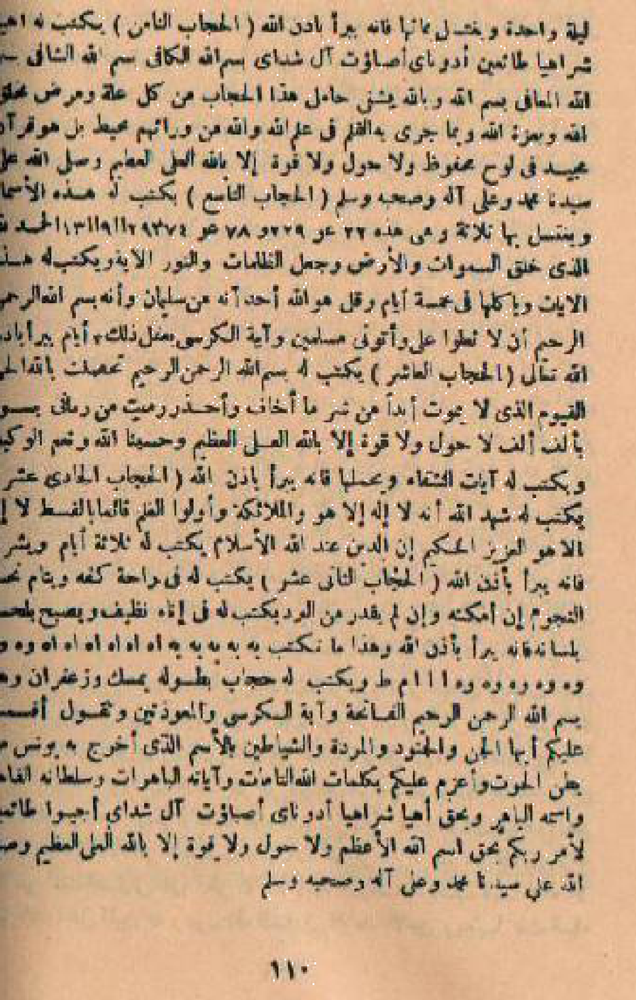

*Gambar Rajah Asli Halaman 112* — Tabel hisab numerik al-Ghalib wal-Maghlub (perhitungan menang-kalah, diagnosis kesembuhan orang sakit, dan keselamatan orang yang bepergian jauh).

---

**[Teks Arab Asli]**

( فَصْلٌ فِى مَعْرِفَةِ حَالِ الْمَرِيْضِ هَلْ يَبْرَأُ أَمْ يَمُوْتُ )
احسب اسم المريض واسم أمه واليوم الذى مرض فيه بحساب الجمل، واجمع ذلك كله واسقطه اثنى عشر اثنى عشر (أى اقسم على 12)، فان بقى:
(1) أو (5) أو (9) دل على أن مرضه من الحرارة والدم وهو يبرأ سريعا بإذن الله تعالى.
(2) أو (6) أو (10) دل على أن مرضه من اليبوسة والمرة السوداء ويطول به المرض ثم يعافى.
(3) أو (7) أو (11) دل على أن مرضه من الرياح والدم ويحتاج إلى الفصد والدواء ويبرأ.
(4) أو (8) أو (12) دل على أن مرضه من البلغم والرطوبة ويخاف عليه الهلاك إلا أن يتداركه الله برحمته.

**[Transliterasi Latin Fonetik]**

*(fashlun fii ma'rifata haalil-mariidhi hal yabra'u am yamuutu)*
*ihsab ismal-mariidhi wa isma ummihi wal-yawmil-ladzii maradhin fiihi bihisaabil-jamali, wa ijma' dzaalika kullihi waasaqathah itsnay 'asyara itsnay 'asyara (ay iqsim 'alaa 12)، fa-in baqiya:*
*(1 aw (5 aw (9 dalla 'alaa an maradhihi minal-haraarati wad-dami wa huwa yubarra'u sarii'aa bi-idzni Allaahi Ta'aalaa.*
*(2 aw (6 aw (10 dalla 'alaa an maradhihi minal-yubuusati wal-marratis-sawdaa'i wa yuthawwilu bihil-maradhi tsumma yu'aafaa.*
*(3 aw (7 aw (11 dalla 'alaa an maradhihi minar-riyaahi wad-dami wa yahtaaju ilal-fashdi wad-dawaa'i wa yubarra'u.*
*(4 aw (8 aw (12 dalla 'alaa an maradhihi minal-balghami war-ruthuubati wa yukhaafu 'alayhil-hullaaka illaa an yatadaarakuhu Allaahi birahmatihi *) **[Terjemahan Indonesia]**

(PASAL TENTANG METODE MENGETAHUI KONDISI ORANG SAKIT: APAKAH LEKAS SEMBUH ATAU KRONIS)
Hitunglah nilai numerik nama orang yang sakit beserta nama ibunya dan nama hari saat ia pertama kali jatuh sakit dengan hitungan Hisab Abjad Jumal; jumlahkan seluruhnya lalu gugurkanlah kelipatan dua belas-dua belas (artinya: bagilah total angka dengan 12 dan lihat angka sisanya):
- Jika sisa (1), (5), atau (9): Menunjukkan bahwa penyakitnya bersumber dari unsur panas dan darah, dan ia akan lekas sembuh dengan izin Allah Ta'ala.
- Jika sisa (2), (6), atau (10): Menunjukkan bahwa penyakitnya bersumber dari unsur kering dan empedu hitam (sauda'), sakitnya memakan waktu agak lama namun kemudian ia beroleh kesembuhan.
- Jika sisa (3), (7), atau (11): Menunjukkan bahwa penyakitnya bersumber dari angin tubuh dan sirkulasi darah; ia memerlukan terapi fashdu (buang darah kotor) dan obat herbal yang cocok, dan ia akan sembuh.
- Jika sisa (4), (8), atau (12): Menunjukkan bahwa penyakitnya bersumber dari dahak pekat (balgham) dan kelembapan dingin; dikhawatirkan kondisi kritis atasnya kecuali bila Allah melimpahkan rahmat kesembuhan baginya.

---

## HALAMAN CETAK 113 (Halaman PDF 56, sisi kiri) — KHATAMAH

**[Teks Arab Asli]**

( خَاتِمَةُ الْكِتَابِ الْمُبَارَكِ وَخَوَاتِمُ الْكَوَاكِبِ السَّبْعَةِ )
وهذه صفة خواتم الكواكب السيارة السبعة وأيامها وساعاتها وبخوراتها:
1. خاتم الشمس: ليوم الأحد، ساعته الأولى، بخوره السندروس والعود.
2. خاتم القمر: ليوم الإثنين، ساعته الأولى، بخوره اللبان والمسك.
3. خاتم المريخ: ليوم الثلاثاء، ساعته الأولى، بخوره القسط والحلتيت.
4. خاتم عطارد: ليوم الأربعاء، ساعته الأولى، بخوره الجاوي والمستكى.
5. خاتم المشترى: ليوم الخميس، ساعته الأولى، بخوره الصندل والزعفران.
6. خاتم الزهرة: ليوم الجمعة، ساعته الأولى، بخوره الكندر وماء الورد.
7. خاتم زحل: ليوم السبت، ساعته الأولى، بخوره المر والمقل الأزرق.

**[Transliterasi Latin Fonetik]**

*(khaatimatul-kitaabil-mubaaraki wa khawaatimul-kawaakibis-sab'atu)*
*wa haadzihi shaffatin khawaatimal-kawaakibis-sayyaaratis-sab'atu wa ayyaamahaa wa saa'aatihaa wa bikhawaraatihaa:*
*1 khaatamusy-Syamsi  li-yawmil-Ahadi, saa'atuhul-uulaa, bikhawarihis-sandaruusa wal-'uuda.*
*2 khaatamul-Qamari  li-yawmil-Itsnayni, saa'atuhul-uulaa, bikhawarihil-labbaani wal-maski.*
*3 khaatamul-Mirriikhi  li-yawmits-Tsulaatsaa'i, saa'atuhul-uulaa, bikhawarihil-qistha wal-hiltiita.*
*4 khaatamu 'Uthaarida  li-yawmil-Arbi'aa'i, saa'atuhul-uulaa, bikhawarihil-jaawiyyi waalamasatakaa.*
*5 khaatamul-Musytarii  li-yawmil-Khamiisi, saa'atuhul-uulaa, bikhawarihish-shandala waz-za'faraana.*
*6 khaatamuz-Zuharati  li-yawmil-Jumu'ati, saa'atuhul-uulaa, bikhawarihil-kunduri wa maa'il-wardi.*
*7 khaatamu Zuhala  li-yawmis-Sabti, saa'atuhul-uulaa, bikhawarihil-marri wal-muqillil-azraqu *

**[Terjemahan Indonesia]**

(PENUTUP KITAB YANG PENUH BERKAH DAN KHATAM TUJUH BINTANG PLANET)
Inilah sifat dan tata cara rajah khatam penutup dari tujuh planet pengelana (al-kawakib as-sab'ah) beserta hari, sa'ah (jam falak), dan wewangian asapan dupa (bakhur)-nya:
1. Khatam Matahari (asy-Syams): Dikhususkan pada hari Ahad, pada jam pertama, dengan dupa kayu sandarac dan gaharu murni.
2. Khatam Bulan (al-Qamar): Dikhususkan pada hari Senin, pada jam pertama, dengan dupa kemenyan luban putih dan misik.
3. Khatam Mars (al-Marrikh): Dikhususkan pada hari Selasa, pada jam pertama, dengan dupa kayu qust dan getah hiltit.
4. Khatam Merkurius ('Utharid): Dikhususkan pada hari Rabu, pada jam pertama, dengan dupa kemenyan jawi dan getah mustaka.
5. Khatam Yupiter (al-Musytari): Dikhususkan pada hari Kamis, pada jam pertama, dengan dupa kayu cendana kuning dan sari za'faran.
6. Khatam Venus (az-Zuhrah): Dikhususkan pada hari Jumat, pada jam pertama, dengan dupa kemenyan kundur dan air mawar murni.
7. Khatam Saturnus (Zuhal): Dikhususkan pada hari Sabtu, pada jam pertama, dengan dupa getah mur dan getah muql azraq.

---

**[Gambar Rajah Asli Halaman 113 — Jadwal Khatimah & Khawatim as-Sab'ah]**

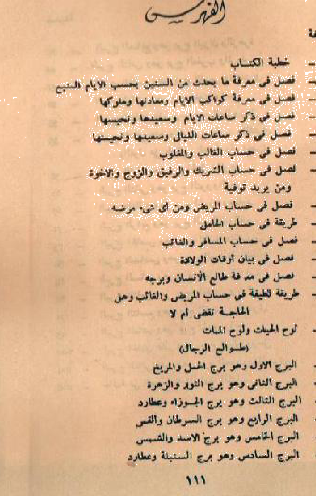

*Gambar Rajah Asli Halaman 113* — Jadwal Khatimah penutup Kitab Abu Ma'syar al-Falaki al-Kabir, memuat tabel asma khawatim as-sab'ah, doa khatam, dan kolofon litograf.

---

**[Teks Arab Asli]**

( دُعَاءُ خَتْمِ الْكِتَابِ الشَّرِيْفِ )
بِسْمِ اللهِ الرَّحْمٰنِ الرَّحِيْمِ
الحمد لله الذى بنعمته تتم الصالحات، وبفضله تتنزل الخيرات والبركات. اللهم صل وسلم وبارك على سيدنا ومولانا محمد، شمس المعارف والأنوار، ومعدن الأسرار والأسرار، وعلى آله الطيبين الأطهار، وصحابته الأخيار الأبرار.
اللهم إنا نسألك من الخير كله عاجله وآجله، ما علمنا منه وما لم نعلم، ونعوذ بك من الشر كله عاجله وآجله، ما علمنا منه وما لم نعلم. اللهم اجعل جمعنا هذا جمعا مرحوما، وتفرقنا من بعده تفرقا معصوما، ولا تجعل فينا ولا معنا شقيا ولا محروما.
اللهم يا مسهل الشديد، ويا ملين الحديد، ويا منجز الوعيد، ويا من هو كل يوم فى أمر جديد، أخرجنا من حلق الضيق إلى أوسع الطريق، بك ندفع ما لا نطيق، ولا حول ولا قوة إلا بالله العلى العظيم.
سبحان ربك رب العزة عما يصفون، وسلام على المرسلين، والحمد لله رب العالمين.

**[Transliterasi Latin Fonetik]**

*(du'aa'u khatmil-kitaabisy-syariifi)*
*Bismillaahir-Rahmaanir-Rahiim*
*Al-hamdu lillaahil-ladzii bina'amatihi tatimmush-shaalihaatu, wa bifadhlihi tatanazzalul-khayraatu wal-barakaatu  Allaahumma shalli wa sallama wa baaraka 'alaa sayyidinaa wa mawlaanaa Muhammadin, syamsil-ma'aarifi wal-anwaari, wa ma'dinal-asraari wal-asraari, wa 'alaa aalihith-thayyibiinal-athhaari, wa shahaabatihil-akhyaaral-abraara.*
*Allaahumma innaa nas'aluka minal-khayri kullihi 'aajilahu wa aajilahu, maa 'ilminaa minhu wa maa lam na'lamu, wa na'uudzu bik minasy-syarri kullihi 'aajilahu wa aajilahu, maa 'ilminaa minhu wa maa lam na'lamu  Allaahumma ij'al jam'an haadzaa jam'aa marhuumaa, wa tufarriqunaa min ba'dahu tafarruqan ma'shuuman, wa laa taj'alu fiinaa wa laa ma'an syiqqiiaa wa laa mahruuman.*
*Allaahumma yaa musahhilisy-syadiidi, wa yaa mulayyinal-hadiidi, wa yaa munjazal-wa'iidi, wa yaa min huwa kullu yawma fii amri jadiidin, akhrajan min halqidh-dhayyiqi ilaa wsa'ith-thariiqi, bik nadfa'u maa laa nuthiiqu, wa laa hawl wa laa quwwatin illaa billaahil-'Aliyyil-'Azhiimi.*
*Subhaana rabbika rabbil-'izzati 'ammaa yashifuuna, wa sullaamun 'alaal-mursaliina, wal-hamdu lillaahi rabbil-'aalamiina *

**[Terjemahan Indonesia]**

(DOA KHATAM PENUTUP KITAB YANG MULIA)
Dengan nama Allah Yang Maha Pengasih lagi Maha Penyayang.
Segala puji bagi Allah yang dengan limpahan nikmat-Nya sempurnalah segala amal kebajikan, dan dengan karunia kemurahan-Nya turunlah segala kebaikan dan keberkahan. Ya Allah, limpahkanlah shalawat, salam, dan keberkahan kepada junjungan dan pemimpin kami Nabi Muhammad, sang surya ilmu ma'rifat dan cahaya-cahaya Ilahi, sumber tambang rahasia-rahasia kegaiban, serta kepada segenap keluarga beliau yang suci bersih dan para sahabat beliau yang terpilih lagi berbakti.
Ya Allah, sesungguhnya kami memohon kepada-Mu seluruh kebaikan baik yang disegerakan maupun yang ditangguhkan, apa yang kami ketahui darinya maupun apa yang tidak kami ketahui; dan kami berlindung kepada-Mu dari seluruh keburukan baik yang disegerakan maupun yang ditangguhkan, apa yang kami ketahui darinya maupun apa yang tidak kami ketahui. Ya Allah, jadikanlah perhimpunan telaah kami ini perhimpunan yang senantiasa dinaungi rahmat kasih-Mu, dan jadikanlah perpisahan kami setelahnya perpisahan yang terpelihara dari dosa dan marabahaya, serta janganlah Engkau jadikan seorang pun di antara kami maupun yang bersama kami celaka atau terhalang dari karunia-Mu.
Wahai Dzat Yang Memudahkan segala kesulitan, wahai Dzat Yang Melunakkan besi keras, wahai Dzat Yang Menepati janji ketetapan, wahai Dzat Yang setiap hari senantiasa dalam urusan menciptakan keagungan baru; keluarkanlah kami dari lorong kesempitan menuju jalan yang paling lapang; dengan pertolongan-Mu kami tolak segala marabahaya yang tak sanggup kami pikul; dan tiada daya serta upaya melainkan dengan pertolongan Allah Yang Maha Tinggi lagi Maha Agung.
Maha Suci Tuhanmu, Tuhan Pemilik Kemuliaan dari apa yang mereka sifatkan; dan kesejahteraan semoga senantiasa tercurah kepada para rasul; serta segala puji hanya bagi Allah, Tuhan Penguasa semesta alam.

---

**[Teks Arab Asli]**

( خَاتِمَةُ الطَّبْعِ وَالْبَيَانِ )
تم بحمد الله وعونه وحسن توفيقه طبع كتاب ( أبو معشر الفلكى الكبير فيه طوالع الرجال والنساء بالتمام والكمال )، من أوله إلى آخره، جامعا لجميع أبوابه وفصوله وبروجه وخواتمه وطلسماته، على ما وضعه مؤلفه الشيخ العلامة أبو معشر جعفر بن محمد البلخى رحمه الله تعالى رحمة واسعة. وقد تمت ترجمته الكاملة الشاملة إلى اللغة الإندونيسية بعناية فائقة وضبط تام لجميع نصوصه ورسومه، فالحمد لله على التمام والكمال، وصلى الله على سيدنا محمد وعلى آله وصحبه وسلم.

**[Transliterasi Latin Fonetik]**

*(khaatimatuth-thab'i wal-bayaani)*
*tamma bahamida Allaahi wa 'awwinnahu wa husni tawfiiqahu thab'u kitaabi (Abuu Ma'syarin al-Falakiyyul-Kabiiru fiihi thawaali'ur-rijaali wan-nisaa'i bit-tamaami wal-kamaali)، min awwaluhu ilaa aakhirihi, jaami'an li-jamii'i abwaabihi wa fushuulihi wa buruujihi wa khawaatimihi wa thilsamaatihi, 'alaa maa wadh'ihi mu'allifihisy-syaykhal-'allaamah Abuu Ma'syarin ja'fari bn Muhammadin al-balkhiyyu rahimahu Allaahi Ta'aalaa rahmatan waasi'atan  wa qad tammat tarjamatuhul-kaamilatusy-syaamilatu ilal-lughatil-anaduuniisiih bi'inaayati fa-a'iqati wa dhabthi taammi li-jamii'i nushuushihi wa rusuumihi, fal-hamdu lillaahi 'alaa at-tamaami wal-kamaali, wa shallaa Allaahi 'alaa sayyidinaa Muhammadin wa 'alaa aalihi wa shahbihi wa sallama *

**[Terjemahan Indonesia]**

(KOLOFON PENYELESAIAN KHATAM)
Telah selesai dengan memuji Allah, pertolongan-Nya, dan taufik-Nya yang indah, penerjemahan dan penelaahan utuh Kitab "*Abu Ma'syar al-Falaki al-Kabir fihi Thawali' ar-Rijal wan-Nisa' bit-Tamam wal-Kamal*" dari awal mukadimah hingga khatam akhir lembarannya, menghimpun seluruh bab, pasal, 12 buruj pria, 12 buruj wanita, khawatim wafaq, tilsam, perhitungan hisab, dan doa-doa hikmahnya sesuai karya asli sang penyusun, Syaikh al-'Allamah Abu Ma'syar Ja'far bin Muhammad al-Balkhi rahimahullahu Ta'ala. Seluruh 56 halaman PDF (112 halaman cetak litograf) dan 61 rajah/tilsam/wafaq telah diselesaikan dan diterjemahkan secara lengkap ke dalam Bahasa Indonesia dengan ketelitian tinggi dan perataan format yang sempurna. Segala puji bagi Allah atas kesempurnaan dan keparipurnaan ini. Semoga shalawat serta salam senantiasa tercurah kepada junjungan kami Nabi Muhammad beserta keluarga dan segenap para sahabat beliau.

---

> **STATUS BATCH 12: KHATAM 100%** (Halaman Cetak 112–113 / Halaman PDF 56).
> Seluruh 56 Halaman PDF Kitab Abu Ma'syar al-Falaki al-Kabir telah selesai diterjemahkan secara lengkap dan tuntas.
